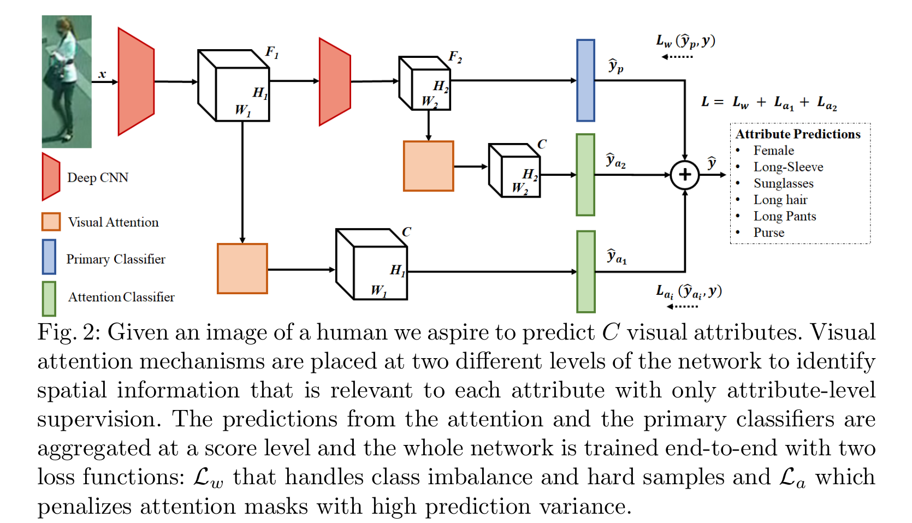
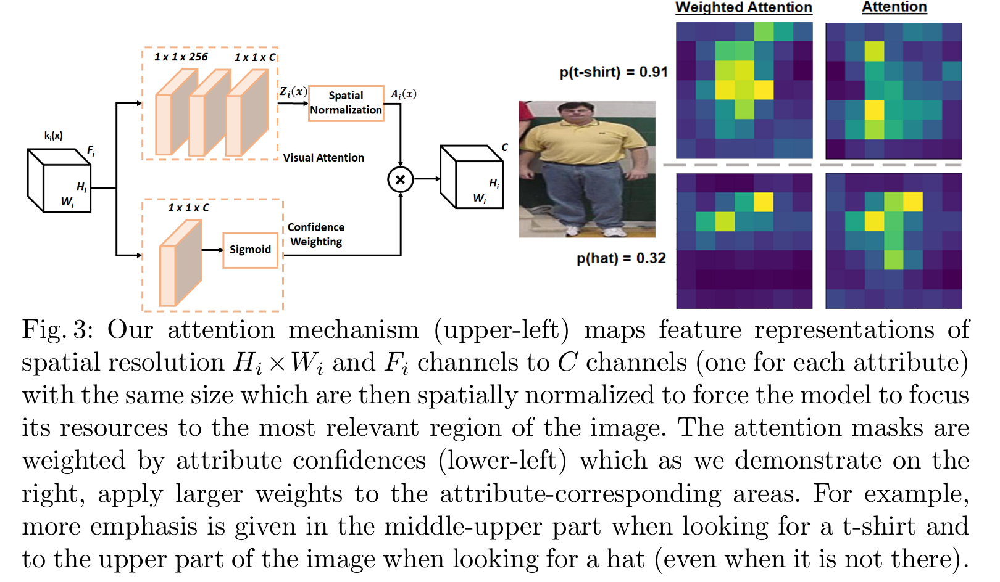

Deep Imbalanced Attribute Classification using Visual Attention Aggregation
=

# 3 Methodology
# 3.1 Multi-scale Visual Attention and Aggregation

给定人体图像，我们的目标时预测其视觉属性。具体而言，我们的输入包含图像 $x$ 及其相应的标签 $y = [y^1, y^2, \cdots, y^C]$ ，其中 $C$ 为属性的总数，$y^c$ 为指示图像中特定属性存在与否的二值标签。本文中，我们使用 Res 和 DenseNets 作为骨干架构进行实验，因此我们选择在第三和第四阶段/层块之后进行表示。注意力信息提取的概念可以扩展到更多的空间分辨率/尺度，而不需要学习额外的参数。因此，我们称网络的第一部分（到阶段/块 3）为 $\phi_1(\cdot)$ ，称到分类器的部分为 $\phi_2(\cdot)$ 。我们的主网络中，除非另有说明，它是 ResNet-101 架构(图2中的 deep CNN 模块)，给定图像 $x$ ，我们获得 3 维特征表示：

$$
\begin{align}
k_1(x) = \phi_1(x), k_1(x) \in R^{H_1 \times W_1 \times F_1}  \\
k_2(x) = \phi_2(k_1(x)), k_2(x) \in R^{H_2, W_2, F_2}
\end{align} \tag 1
$$

对于 $224 \times 224$ 的图像，注意机制分别置于通道大小 $F_1$ 等于 1024 和 2048 以及空间分辨率为 $14 \times 14$ 和 $7 \times 7$ 的特征上。最终，主网络分类器输出 logits $\hat{y}_p(x) = W_pk_2(x) + b_p$， 其中 $(W_p, b_p)$ 是分类层的参数。

思想上很简单，我们的注意力机制，如图 3 ，由三个堆叠的核大小为 1 的卷积层（以及批归一化和 ReLU）组成。由于多标签问题的本质，最后一个卷积层将通道映射为类的数量 $C$ ，这提取给定特征表示的相同空间/通道大小的显著图（saliency map）。然后属性特定的空间注意图 $z_{h,w}^c$ 在空间上使用空间 softmax 操作归一化为：

$$a_{h,w}^c = \frac{\exp(z_{h,w}^c)}{\sum_{h,w}\exp(z_{h,w}^c)} \tag 2$$

其中 $h,w$ 对应高度和宽度维，$c$ 为相应的属性标签。空间 softmax 操作的结果是对每个属性 $c$ 使用性质为 $\sum_{h,w}a_{h,w}^c = 1$ 的注意掩码，并用于强制模型将其资源集中到图像的最相关区域。我们将包含三个卷积层的注意机制称为 $\cal A$ ，因此，对于每个空间分辨率 $i$ ，我们首先获取非规范化的的注意力 $Z_i(x) = \cal{A}(k_i(x))$ ，其然后使用公式 2 规范化，产生规范化的注意力掩模 $A_i(x)$ 。

遵循 [14] 的工作，我们使用 $C$ 通道(与类的数量相同)和 sigmoid 函数将特征表示并发地传递给单个卷积层。这个分支的作用是根据标签的置信度为注意力图分配权重，避免在没有标签时从注意力掩码中学习。权重注意力图反映了不同空间位置和标签置信度的属性信息。我们观察，在我们的试验中置信度加权分支提升少量的信息，并有助于注意力机制更好的学习显著热图（如图 3 右）。

不同尺度的输出显著掩模的结合可以在预测级（即平均 logits）或者特征级[42]完成。然而，将注意力掩码聚合在一个特征级别上，会提供持续较差的性能。我们认为这是因为这两种注意机制提取的掩码强调的是不同的空间区域，加在一起无法为分类器提供属性判别信息。因此，我们选择了前一种方法，并将每个置信度加权的注意力掩模输入一个分类器，以获得注意力模块 $i$ 的 logits $\hat{y}_{a_i}$ 。最终图像 $x$ 的维度 $1 \times C$ 的预测定义为 $\hat{y} = (\hat{y}_p + \hat{y}_{a_1} + \hat{y}_{a_2}) / 3$ 。

## 3.2 Deep Imbalanced Classification
使用主模型的输出预测 $\hat{y}_p$ ，其有相同的维度 $1 \times C$ （即每个属性之一），是一种被 [14] 采用的直接方法，其使用二值交叉熵训练整个网络：

$$L_b(\hat{y}_p, y) = -\sum_{c=1}^C \log(\sigma(\hat{y}_p^c y^c))+ \log(1 - \sigma(\hat{y}_p^c))(1 - y^c) \tag 3$$

其中 $(\hat{y}_p^c, y^c)$ 对应属性的 logits 和 ground-truth 标签，$\sigma(\cdot)$ 为 sigmoid 激活函数。然而，如此的损失函数完全忽略了类别不平衡问题，我们提出为我们的主模型使用一个 focal 损失的加权变体：

$$\cal L_b(\hat{y}_p, y) = -\sum_{c=1}^C w_c((1 - \sigma(\hat{y}_p^c))^\gamma\log(\sigma(\hat{y}_p^c y^c))+ \sigma(\hat{y}_p^c)^\gamma \log(1 - \sigma(\hat{y}_p^c))(1 - y^c)) \tag 4$$

其中 $\gamma$ 为超参数（设置为 0.5），控制基于当前预测的实例级权重，重点对难分类样本进行分类，$w_c = e^{-a_c}$ 中 $a_c$ 为第 $c$ 个属性的先验类分布（如[12]）。

不同于 FAN（face attention network），其基于 ground-truth 人脸边界框学习注意力掩模，在人体属性中，如此信息是不可用的。这意味着，注意力掩模可以属性级监督 $y$ 学习。维度为 $H_i \times W_i \times F_i$ 的注意力掩模被馈入分类器，其输出每个空间分别率 $i$ 的 logits $\hat{y}_{a_i}$ 。考虑到注意力网络的弱监督，我们决定将注意力集中在预测方差高的注意掩模上。与[43]的工作相似，在使用 $\cal L_b$ 的一些时期（burn-in）之后，我们开始收集第 $s$ 个样本的预测 $p_H (y_s |x_s)$ 的历史 $H$ ，并计算批次内每个样本在时间上的标准差:

$$std_s(H) = \sqrt{var(p_{H^{t-1}(y_s|x_s)}) + \frac{var(p_{H^{t-1}(y_s|x_s)})^2}{|H_s^{t-1}| - 1}} \tag5$$

其中 $t$ 对应当前的时期，$var$ 为在历史 $H_s^{t-1}$ 中估计的预测方差，$|H_s^{t-1}|$ 为存储的预测概率数。每个样本 $s$ 的具有属性级监督的级别 $i$ 注意力掩模的损失定义为：

$$\cal L_{a_i}(\hat{y}_{a_i}, y) = (1 + std_s(H)) L_b(\hat{y}_{a_i}, y)  \tag 6$$

为了指导网络学习这些不确定的样本，在时间上的具有高方标准差的注意力掩模预测将被给予更高个权重。注意，为了内存的原因，我们的历史仅包含最近 5 个时期，而不是整个预测历史。我们认为，在弱监督的应用程序中，这种方案比原始论文[43]中的完全监督场景(如MNIST或CIFAR)更直观。最后，用于端到端训练网络的全部损失定义为：

$$\cal L = \cal L_w + \cal L_{a_1} + \cal L_{a_2} \tag 7$$

其中 $\cal L_{a_1}$ 用于第一个注意力模块，其提取空间分辨率为 $14 \times 14$ 的显著图，而 $\cal L_{a_2}$ 在主网络的空间分辨为 $7 \times 7$ 的第 4 个阶段相似地使用第二个注意力模块。理清这两个损失函数使我们能够分别关注不同类型的挑战。加权焦点损失 $\cal L_w$ 使用权重 $w_c$ 处理每个属性的先验类不平衡，同一时间通过实例级焦点损失权重关注难分的正类演变。注意力损失 $\cal L_a$ 惩罚来自具有高预测方差的注意掩码的预测。
