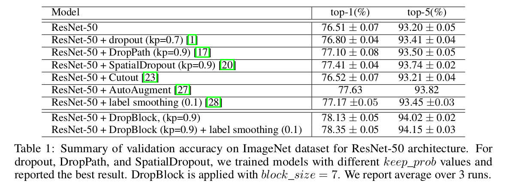
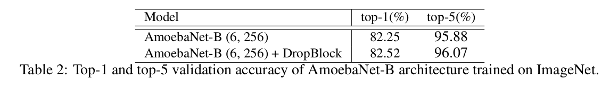
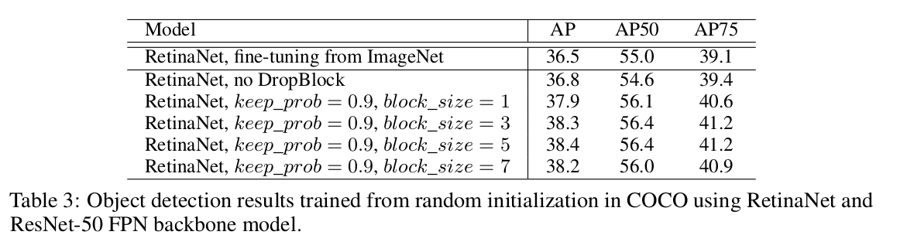

DropBlock: A regularization method for convolutional networks
=

# 1 Introduction
当深度神经网络具有大量参数并且受到大量正则化和噪声训练时，例如权重衰减和丢失[1]，它们可以很好地工作。虽然 dropout 的第一次成功与卷积网络有关[2]，但最近的卷积架构很少使用 dropout [3-10]。在多数案例中，dropout 主要你用于卷积网络的全连接层。

我们认为 dropout 的主要缺点是随机地丢弃特征。虽然这个过程对全连接层有效，但是对于卷积层缺乏效率，其中卷积层的特征是空间相关的。当特征是相关时，即使使用 dropout ，输入的信息仍然能够传递到下一层，这引起网络过拟合。这种直觉表明需要更加结构化的 dropout 形式来更好地规范卷积网络。

本文中，我们引入 DropBlock ，一种结构化的 dropout 形式，其对于规范卷积网络特别有效。在 DropBlock 中，块中的特征，即特征图的连续区域，一起被丢弃。因为 DropBlock 丢弃关联区域中的特征，所以网络必须从其他地方搜索证据以拟合数据（如图1）。

试验中，DropBlock DropBlock比一系列模型和数据集中的 dropout 要好得多。将 DropBlock 添加到 ResNet-50 架构中，将 ImageNet 的分类准确率从 76.51% 提高到 78.13% 。在 COCO 检测任务中，DropBlock 将 RetinaNet 的 AP 从 36.8% 提高到 38.4 % 。

# 2 Related Work
自从 dropout 的引入，其启发了大量的正则化方法，如 DropConnect、maxout、StochasticDepth、DropPath、ScheduledDropPath、shake-shake 正则和 ShakeDrop 正则。这些方法后的基本原则是将噪声引入神经网络使得它们不会过拟合训练数据。当用到卷积神经网络时，当涉及卷积神经网络时，大多数成功的方法都需要构造噪声 [16,17,8,18-20]。例如，在DropPath中，神经网络中的整个层都被归零，而不仅仅是一个特定的单元。尽管这些丢弃层的策略在具有非常多的输入或输出分支的层上工作良好，但是它们不能用于没有任何分支的层。我们的方法 DropBlock 更加一般，其可以用于卷积层的任何地方。我们方法与 SpatialDropout 相关，其中将整个通道从特征图中丢弃。我们的实验表明 DropBlock 比 SpatialDropout 有效。

这些特定于架构的噪声注入技术的发展并非卷积网络所独有。事实上，与卷积网络相似，循环网络需要它们自己的噪声注入方法。当前，Variational Dropout[21] 和 ZoneOut[22] 是两种将噪声注入循环连接的最常用方法。

我们的方法受 Cutout 的启发，Cutout 一种数据增强方法，其中部分输入样本被清零。DropBlock通过在卷积网络中的每个特征图处应用Cutout来概括剪切。我们的实验中，在训练期间对DropBlock具有固定的零输出比率不如在训练期间具有增加的比率计划那样强大。换句话说，最好在训练期间将 DropBlock 比率设置为较小，并在训练期间随时间线性增加。此调度方案与 ScheduledDropPath [8]相关。

# 3 DropBlock
DropBlock 是一种与 Dropout 相似的简单方法。与 dropout 主要的不同是，DropBlock 丢弃一层的一个特征图的连续区域，而不是丢弃独立的随机单元。DropBlock 的伪代码如算法1 。DropBlock 有两个主要的参数，其为 $block\_size$ 和 $\gamma$ 。 $block\_size$ 为块中需要丢弃的大小， $\gamma$ 控制激活单元丢弃的多少。

我们在不同的特征通道上尝试了共享的 DropBlock 掩码，或者每个特征通道都有 DropBlock 掩码。算法1对应于后者，它往往在我们的实验中更好地工作。

与 dropout 相似，我们在推理期间不使用 DropBlock 。这被解释为评估指数大小的子网集成的平均预测。这些子网络包括由丢失覆盖的子网络的特殊子集，其中每个网络不看到特征图的连续部分。

**Setting the value of $block\_size$ .** 我们实现中，我们设置为所有特征图设置一个常数 $block\_size$ ，而不管特征图的分辨率如何。当 $block\_size = 1$ 时，DropBlock 类似 dropout ；当 $block\_size$ 覆盖整全部特征图时，类似于 SpatialDropout 。

**Setting the value of $\gamma$ .**  事实上，我们不会显式地设置 $\gamma$ 。如前所述，$\gamma$ 控制要丢弃的特征数量。假设我们想要以概率 $keep\_prob$ 保留每个激活单元， dropout 中的二值掩模以均值 $1 - keep\_prob$ 从 Bernoulli 分布采样。然而，但是，为了解释掩码中的每个零条目都将被 $block\_size^2$ 扩扩展并且块将完全包含在特征图中的事实，我们需要在采样初始二进制掩码相应地调整 $\gamma$ 。我们的实现中，$\gamma$ 计算为
$$\gamma = \frac{1-keep\_prob}{block\_size^2} \frac{feat\_size^2}{(feat\_size - block\_size + 1)^2} \tag 2$$
其中 $keep\_prob$ 可以解释为传统的 dropout 中保留一个单元的概率。有效的种子区域的大小为 $(feat\_size - block\_size + 1)^2$ ，其中 $feat\_size$ 为特征图的大小。DropBlock 主要的细微差别是在丢弃块中有一些重叠，因此，上述等式仅是一种近似。我们的试验中，我们首先估计使用的 $keep\_prob$ （介于 0.75 和 0.95 之间），然后根据上面的等式计算 $\gamma$ 。

**Scheduled DropBlock.** 我们训练期间固定 $keep\_prob$ 的 DropBlock 不能很好地工作。应用 $keep_prob$ 的较小值会妨害开始阶段的学习。相反，随着时间的推移从1到目标值地逐渐减少 $keep\_prob$ 更加稳健，并为 $keep\_prob$ 的大多数值增加了改进。我们的试验中，我们使用降低 $keep\_prob$ 值的线性方案，这种方案在许多超参数设置中都能很好地工作。这种线性方案类似于 ScheduledDropPath [8]。

# 4 Experiments
在接下来的章节中，我们实证研究了DropBlock在图像分类、目标检测和语义分割方面的有效性。我们将 DropBlock 用于 ResNet-50 ，并进行了大量的图像分类实验。为了验证结果可以迁移到不同的架构，我们在最先进的模型架构 AmoebaNet [10] 上执行DropBlock，并显示改进。处理图像分类外，我们证明 DropBlock 有助于训练RetinaNet [24]进行对象检测和语义分割。

## 4.1 ImageNet Classification
ImageNet-2012 分类数据集。使用水平翻转、缩放和纵横比增强图像。评估期间，使用 single-crop 。

**Implementation Details** 使用 Tensorflow 训练 ResNet-50 和 AmoebaNet 。所有模型使用默认图像大小（ResNet 为 $224 \times 224$ ， AmoebaNet为 $331 \times 331$）、批大小（ResNet 为 1024 ，AmoebaNet 为 2048）以超参数设置。对于 ResNet-50 架构，我们仅将训练时期从 90 增加到 270 。学习率使用因子 0.1， 在 125、 200 和 250 时期衰减。AmoebaNet 模型训练 340 epoch，并使用指数衰减方案安排学习率。由于基线通常适用于较长的训练方案，并且在训练结束时具有较低的验证准确性，因此我们在整个训练中报告最高的验证准确性以进行公平比较。

### 4.1.1 DropBlock in ResNet-50
使用 DropBlock 训练的 ResNet-50 结果如表 1 。

**Where to apply DropBlock.** 在残差网络中，一个构建块由几个卷积层和执行恒等映射的单独的跳过连接组成。每个卷积层后跟批归一化层和 ReLU 激活。构建块的输出为卷积分支和 skip 连接的输出之和。

可以通过基于特征激活的空间分辨率构建组来表示残差网络。构建组由多个构建块组成。我们使用组4来表示残差网络的最后一个组（即，conv5_x的所有层）等。

在接下来的试验中，我们研究在残差网络的何处使用 DropBlock 。我们实验了仅在卷积层之和使用 DropBlock 或在卷积层和 skip 连接之后都使用 DropBlock 。为了研究应用到不同特征图的 DropBlock 的性能，我们尝试将 DropBlock 应用于第4组或第3组和第4组。

**DropBlock vs. dropout** 原始ResNet架构不会在模型中应用任何 dropout。为了方便讨论，我们将 ResNet 的 dropout 基线定义为仅在卷积分支上应用 dropout 。默认下，我们在第 3 组和第 4 组使用 $block\_size = 7$ 的 DropBlock 。在所有实验中，我们将 $\gamma$ 减小 4 倍。在图 3-a 中，我们展示了 DropBlock 在 top-1 准确率方面优于 dropout 1.3％ 。Scheduled $keep\_prob$ 使 DropBlock 对 $keep\_prob$ 的变化更具鲁邦性，并为多数 $keep\_prob$ 值添加了改进（如图3-b）。

有了图 3 中最佳的 $keep\_prob$ ，我们将block_size从1扫描到覆盖完整特征图的大小。图 4 展示了应用更大的 $block\_size$ 通常优于使用 $block\_size = 1$ 。最佳的 DropBlock 配置为应用 $block\_size = 7$ 到第 3 组和第 4 组。

**DropBlock vs. SpatialDropout.** 与 dropout 基线相似，我们将 SpatialDropout 基线定义为仅仅将其用于卷积分支。SpatialDropout 优于 dropout，但是次于 DropBlock 。在图 4 中，我们发现在应用于第 3 组的高分辨率特征映射时，SpatialDropout可能过于苛刻。DropBlock通过在第3组和第4组上丢弃具有恒定大小的块来实现最佳结果。

**Comparison with DropPath.** 遵循 ScheduledDropPath ，我们将计划的 DropPath 用于处理 skip 连接的所有连接。我们训练了具有不同 $keep\_prob$ 值的模型。此外，我们训练在所有组中应用DropPath，以仅在第4组或第3组和第4组与我们的其他实验相似的模型。当仅将 $drop\_prob = 0.9$ 的 DropPath 用于第 4 组时，我们获得最佳的验证准确率 $77.10%$ 。

**Comparison with Cutout.** 我们也比较了 Cutout ，其为一种数据增强方法，并且从图像中随机丢弃固定大小的块。尽管 Cutout 提高了 CIFAR-10 的准确率，但是，在我们的试验中，其没有提高 ImageNet 的准确率。

**Comparison with other regularization technique.** 我们将DropBlock与数据增强和标签平滑进行比较，这是两种常用的正则化技术。表 1 中， 与强数据增强[27]和标签平滑[28]相比，DropBlock具有更好的性能。结合DropBlock和标签平滑以及训练290个时期后，性能得到改善，表明当我们训练更长时间时，正则化技术可以是受欢迎的。

### 4.1.2 DropBlock in AmoebaNet
我们还展示了DropBlock在最近的AmoebaNet-B架构上的有效性，这是一种先进的架构，使用进化架构搜索[10]。 该模型具有 dropout，保持概率为 0.5 但仅在最终的 softmax 层上。

我们在所有批归一化层之后以及最后50％单元格的跳过连接中应用 DropBlock 。对于输入大小为 $331 \times 331$ 的图像，这些单元格中的特征图的分辨率为 $21 \times 21$ 或 $11 \times 11$ 。基于上一节中的实验，我们使用了 $keep\_prob$ 为 0.9 ，并设置了 $block\_size = 11$ ，这是最后一个特征图的宽度。DropBlock 将 AmoebaNet-B 的 top-1 准确率从 82.25％ 提高到 82.52％（表2）。

## 4.2 Experimental Analysis
与 dropout 相比，DropBlock 在提高 ImageNet 分类准确度方面展示了强大的实证结果。我们假设 dropout 是不充分的，因为卷积层中的连续区域是强相关的。随机丢弃一个单元仍然允许信息流过相邻单元。在本节中，我们进行分析以显示 DropBlock 在删除语义信息方面更有效。随后，与通过 dropout 正规化的模型相比，DropBlock 正则化的模型更加稳健。我们通过在推理期间应用具有 1 和 7 的 $block\_size$ 的 DropBlock 并观察性能差异来研究该问题。

**DropBlock drops more semantic information.**
我们首先对模型进行了训练，没有任何正则化，并使用具有 $block\_size = 1$ 和 $block\_size = 7$ 的 DropBlock 进行测试。图 5 的绿色曲线表明在推理期间，随着 $keep\_prob$ 的减小，验证准确率迅速减小。这种所建议的 DropBlock 移除了语义信息，并使分类更加困难。随着 $keep\_prob$ 的减小，准确率减小得更加迅速，对于 $block\_size = 1$ 与 $block\_size = 7$ 的比较，，其认为在移除语义信息方面 DropBlock 比 dropout 有效。

**Model trained with DropBlock is more robust.** 接下来，我们展示了使用大块大小训练的模型，这消除了更多的语义信息，从而导致更强的正则化。我们通过使用 $block\_size = 7$ 训练的模型并在推理期间应用 $block\_size = 1$ 来证明这一事实，反之亦然。在图 5 中，模型以 $block\_size=1$ 和 $block\_size=7$ 训练，在推理期间使用 $block\_size=1$ 都是稳健的。然而，当使用 $block\_size = 7$ 进行推理时，使用 $block\_size = 1$ 训练的网络的性能下降迅速。这种结果认为，$block\_size = 7$ 更加鲁棒性，并且有 $block\_size = 1$ 的优势，反之亦然。

**DropBlock learns spatially distributed representations.** 我们假设用DropBlock训练的模型需要学习空间分布的表示，因为DropBlock在删除连续区域中的语义信息方面是有效的。通过 DropBlock 正则化的模型应当学习多种辨别性，而不仅仅关注一个种辨别性区域。我们使用类激活图（class activation maps: CAM）[29]来可视化 ImageNet 验证集上 ResNet-50 的 $conv5\_3$ 的类激活。图 6 展示了原始模型的类激活和使用 $block\_size =1$ 和 $block\_size=7$ 的 DropBlock 训练的模型类激活。通常，使用 DropBlock 训练的模型学习空间分布表征，其诱导多个区域的高类激活，然而，没有正则化的模型倾向于关注一个或更少的区域。

## 4.3 Object Detection in COCO
DropBlock是CNN的通用正则化模块。 在本节中，我们将展示DropBlock也可以应用于COCO数据集中的训练对象检测器[30]。我们使用RetinaNet [24]框架进行实验。与预测图像单一标签的图像分类器不同，RetinaNet在多尺度特征金字塔网络（FPN）[31]上进行卷积运算，以对不同尺度和位置的对象进行定位和分类。我们遵循[24]中的模型体系结构和锚定义来构建FPN和分类器/回归分支。

**Where to apply BropBlock to RetinaNet model.** RetinaNet 模型使用 ResNet-FPN 作为其骨干模型。为了简明起见，我们将 DropBlock 用于 ResNet-FPN 的 ResNet，并使用在 ImageNet 分类训练中的最佳 $keep\_prob$ 。 DropBlock 不同于最近的工作[32]，其学习丢弃区域提议的特征上的一个结构化模式。

**Training object detector from random initialization.** 从随机初始化开始训练目标检测器被认为是一个挑战性的任务。最佳，一些论文尝试使用新颖的模型结构[33]、大批量[34]和更好的归一化层[35]来解决这个问题。我们的实验中，我们从模型正则化的角度看待这个问题。我们尝试了 $keep\_prob = 9$ 的 DropBlock ，其与训练的分类模型一样的参数，并且使用不同的 $block_size$ 训练。表 3 证明了从随机初始化训练的模型超过了ImageNet预训练模型。添加 DropBlock 获得额外的 1.6% 的 AP 。结果表明，模型正则化是从头开始训练物体检测器的重要因素，DropBlock是一种有效的物体检测方法。

**Implementation details.** 在 TPU 上使用每个批 64 张图像训练模型。在训练期间，多尺度扰动用于将图像调整到 $[512, 768]$ 的尺度；然后，将图像剪裁或填充到最大维度 640 。在测试期间，仅使用最大维度为 640 的单一尺度图像。批归一化层在所有卷积层之后使用，包括分类器/回归器分支。模型训练 150 个时期（280K 训练步）。初始学习率 0.08 用于前 120 个时期的训练，并在 120 和 140 时期衰减 10 倍。ImageNet 初始化的模型训练 28 个时期，学习率在 16 和 22 时期时衰减。 Focal Loss 使用 $\alpha = 0.25$ 和 $\gamma = 1.5$ 。权重衰减为 0.0001 ，动量为 0.9 。模型在 COCO train2017 上训练，在 COCO val 2017 上评估。

## 4.4 Semantic Segmentation in PASCAL VOC
我们证明 DropBlock 也能改善语义分割模型。我们使用 PASCAL VOC 2012 数据集进行实验，并遵循通用实践来训练增强的 10,582 个训练图像[36]，并在 1,449 个测试集图像上报告 mIOU 。该实现使用ResNet-FPN骨干模型来提取多尺度特征，并在顶部附加完全卷积网络以预测分割。我们在开源代码中使用默认超参数进行培训。

在对象检测实验之后，我们研究了 DropBlock 对随机初始化训练模型的影响。我们训练模型开始于预先训练的ImageNet模型45个时期和模型随机初始化500个时期。 我们尝试将 DropBlock 应用于 ResNet-FPN 骨干网模型和完全卷积网络，并发现将DropBlock应用于全卷积网络更为有效。 应用 DropBlock 大大提高了从头开始训练模型的 mIOU，缩小了 ImageNet 预训练模型和随机初始化模型的训练之间的性能差距。

