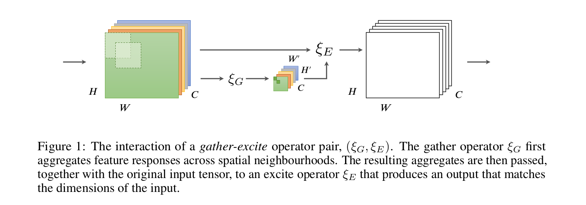
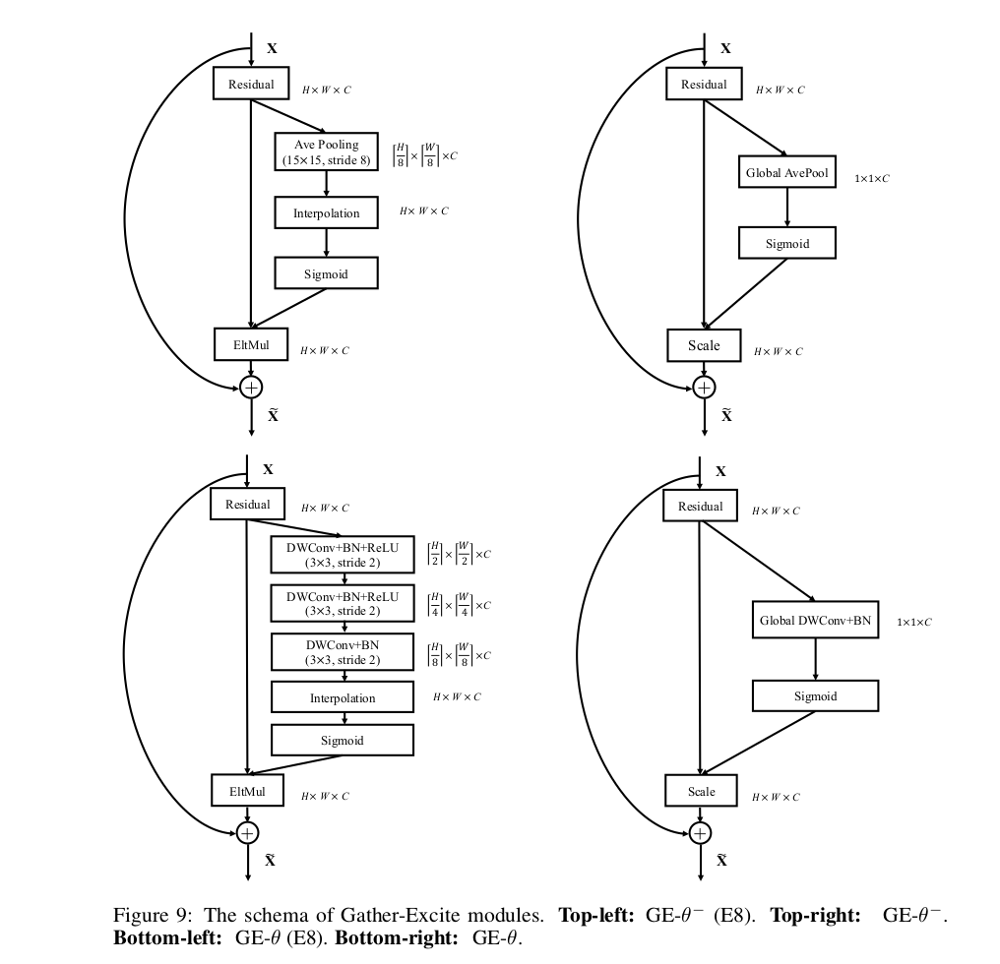
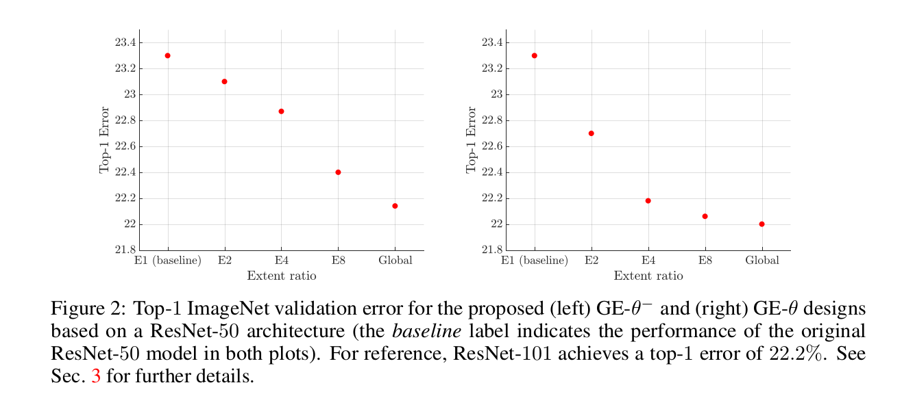
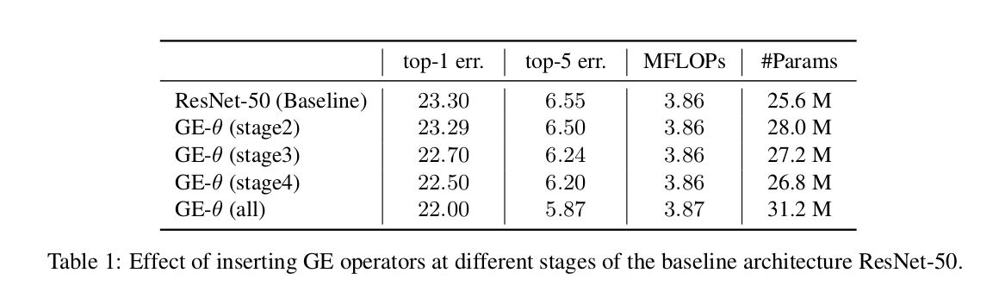
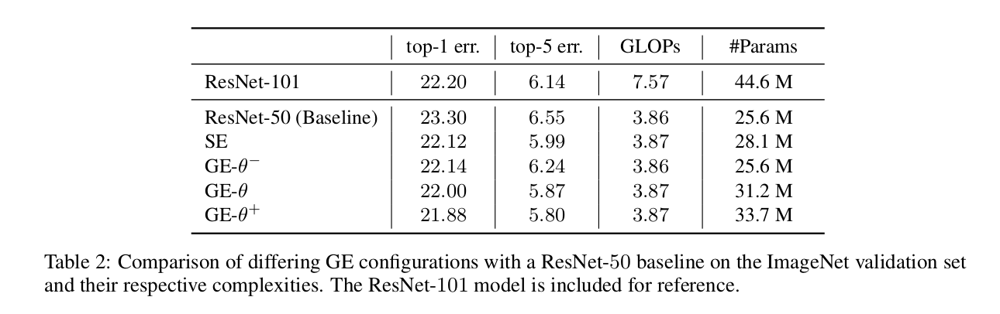
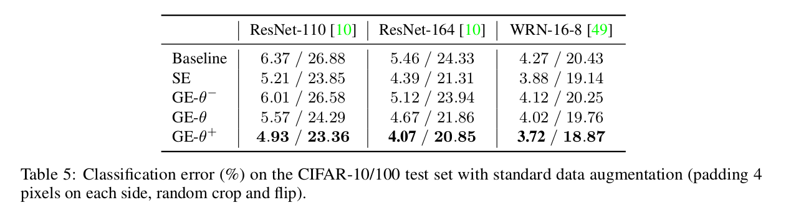

Gather-Excite: Exploiting Feature Context in
Convolutional Neural Networks
=

# 1. Introduction
CNN 是如图像分类、目标检测和图像分割问题的黄金标准方法。因此，对改进的CNN架构存在重大兴趣。在计算机视觉中，经常改进视觉表示的想法是增加使用在更大的上下文上运行的函数执行局部决策的函数，从而提供解决局部模糊的提示[39]。虽然“上下文”方面是过载的[6]，但在这项工作中，我们专注于特征上下文，即由特征提取器响应（即CNN特征图）作为一个整体捕获的信息，分布在输入图像的整个空间范围内。

在许多标准的 CNN 架构中，许多特征提取器的感受野理论上已经足够完整覆盖输入图像，然而，实践中如此感受野的有效大小明显更小[27]。这可以是一个解释为什么改善深度网络的上下文使用可以导致更好的性能，如在目标检测和其他应用重复强调的。

先前的工作已经说明，使用简单的低级特征聚合可以有效地编码视觉任务的上下文信息，并且可以证明是基于更高级语义特征的迭代方法的有用替代方法[44]。为了证明这种方法的有效性，最近提出的 Squeeze-and-Excitation（SE）网络[15]表明，从输入的全部范围重新加权特征通道作为特征的函数可以提高分类性能。在这些方法中，squeeze 操作扮演着一个轻权重的上下文聚合器，并产生传递给充分配权重函数的嵌入以确保它能够利用超越每个滤波器局部感受野的信息。

本文中，我们构建了这种方法，并进一步探索通过深度网络处理上下文的机制。我们的目标是探索更有效的算法以及使它们运行良好的基本属性。我们将这些“上下文”模块表示为两个运算的组合：聚合（gather）运算符，它聚合每个特征图的大邻域的上下文信息;以及激励（excite）运算符，它在聚合的条件下调整特征图。

使用这种分解，我们绘制了可以利用深度网络中的特征上下文的设计空间，并独立探索不同操作的影响。我们的研究导致我们提出一种新的、轻权重的 gather-excite 对操作，其在最小的超参数调整西，在不同架构、数据集和任务上产生显著改进。我们还研究了操作对现有深度结构所学习的分布式表征的影响：我们发现该机制产生的中间表征具有较低的类选择性，这表明提供对其他上下文的访问可以实现更多的功能重用。

# 2 The Gather-Excite Framework
通过检查 CNN 典型的信息流来激发设计。这些模型计算从空间到通道编码逐渐过渡的表征层次。通过组合先前层的特征，同时降低分辨率，增加单元的感受野大小以及增加特征通道的数量，更深的层实现更大的抽象。

在 bag-of-visual-words 模型家族中证明了池化局部描述符中包含的信息以形成局部图像表征的有效性。受这些观察的启发，我们的目标是帮助卷积网络利用网络本身计算的特征响应域中包含的上下文信息。为此，我们构造一个轻量级函数来收集大邻域上的特征响应，并使用生成的上下文信息来调整邻域元素的原始响应。具体地，我们定义一个聚合（gather）操作 $\xi_G$ ，其聚合给定空间范围的神经元响应；一个激励（excite）操作 $\xi_E$，其利用聚合和原始输入产生一个与原始输入相同的维度的新张量。GE 操作如图 1 所示。

更形式化地，令 $x = \{x^c: c \in \{1, \cdots, C\}\}$ 表示网络产生的特征图集合。要评估改变聚合发生的空间区域大小的影响，我们定义选择操作 $\iota (u,e) = \{eu + \delta: \delta \in [-\lfloor(2e - 1) / 2\rfloor, \lfloor(2e - 1) / 2\rfloor]^2\}$ 其中 $e$ 表示选择程度的比例（extent ratio）。然后，我们自已具有 extent ratio $e$ 的 **gather operator** 为函数 $\xi_G: \Bbb R^{H' \times W' \times C}$ （ $H' = \lceil \frac{H}{e}\rceil, W' = \lceil \frac{W}{e}\rceil$ ），其对于任意输入 $x$ 满足约束 $\xi_G(x)_ u^c = \xi_G(x \odot 1_{\iota_{(u,e)}}^c)$ ，其中 $u \in \{1, \cdots, H'\} \times \{1, \cdots, W'\}$ ， $c \in \{1, \cdots, C\}$ ， $1_{\{\cdot\}}$ 表示指示函数， $\odot$ 为 Hadamard 乘积（对应元素相乘）。这个符号简单地表述了通道 $c$ 的每个输出位置 $u$ ，聚合操作具有位于单个通道内的输入的感受野，并且具有由 $(2e-1)^2$ 限定的区域。如果该字段包含完整的输入特征图，我们说聚合操作具有全局范围。**excite operator** 为使用聚合输出的作为上下文特征，并有形式 $\xi_E(x, \hat{x}) = x \odot f(\hat{x})$ ，其中 $f : \Bbb R^{H' \times W' \times C} \rightarrow [0, 1]^{H \times W \times C}$ 为负责重新调整和分配来自聚合的信号的映射。

# 3 Models and Experiments
本节中，我们探索和评估 gather-excite 框架的一系列可能的实例。为了比较每种设计的效用，我们使用 ImageNet-1k 数据集进行了一系列关于图像分类任务的实验[33]，在验证集上评估。

我们的研究基于流行的ResNet-50架构，该架构在该数据集上获得了良好的性能，并且已被证明可以有效地推广到一系列其他领域[9]。通过在与 ResNet-50 的每个构建块的恒等分支求和之前立即将 gather-excite 算子插入残差分支中来形成新模型。这些模型采用随机初始化[10]进行训练，使用SGD，动量为0.9，带有256个图像的小批量图像，每个图像裁剪为 $224 \times 224$ 像素。初始学习率设定为0.1，并且每次损失平稳时减少 10 倍（总共三次）。在所有实验中，我们在ImageNet验证集上报告 single-centre-crop 结果。

## 3.1 Parameter-free pairings
我们首先考虑一组 GE 配对，它们不需要额外的可学习参数。我们将聚合算子 $\xi_G$ 作为具有不同程度比（extent ratio）的平均池化（在供应材料中分析改变池化算子的效果）。然后，激励算子重新调整聚合，使用一个 sigmoid ，并将结果与输入相乘。因此，每个输出特征图计算为 $y^c = x \odot \sigma (interp(\xi_G(x)^c))$ ，其中 $interp(\cdot)$ 表示通过最近邻插值调整原始输入的大小。我们称这个模型为 $GE-\theta^-$ ，其中符号 $\theta^-$ 用于表示参数自由的算子（即没有额外的可学习参数，因此，平均池化和最近邻插值都是参数自由的操作）。这些操作符如何集成到剩余单元中的图表可以在附录的图9中找到。

**Spatial extent:** 该基本模型允许我们测试本文的中心假设，即提供能够获取额外特征上下文的简单总结的网络，从而改善网络的表征能力。至此，首先实验了不同的 $GE-\theta^-$ 的空间 extent ratio 设计： 考虑 $e = \{2, 4, 8\}$ ，也考虑了使用全局平均池化的 global extent ratio 。实验结果如图 2 （左）所示。每次 extent ratio 的增加都产生了 相对于原始 ResNet-50 性能（23.3%）的一致改善，global extent ratio 获得最强性能（22.14 % 的 top-1 错误率）。实验表明，即使一个简单的参数自由的方法，基于上下文的模块能够加强网络的辨别能力。注意，这个模型可以与更加繁重的 ResNet-101 （22.2% top-1 错误率）竞争。

## 3.2 Parameterised pairings
我们已经看到没有可学习参数的简单的 gather-excite 操作提供了以一种有效的利用上下文的机制。为了进一步探索这些对的设计空间，接下来考虑将参数引入到 gather 函数 $\xi_G(\theta)$ 。在这项工作中，我们提出使用带步长的 depth-wise 卷积作为 gather 算子，其将空间滤波器独立的用于输入通道。我们如 3.1 节描述的结合 $\xi_G(\theta)$ 和 excite 算子，并称之为 $GE-\theta$ 。

**Spatial extent:** 我们首先重复实验，以评估增加的 extent ratio 对参数化模型的影响。对于参数效率，通过链接 $3\times 3$ 的步幅为2的 depth-wise 卷积来实现不同的程 extent ratio $e$ （ $e / 2$ 全部执行这样的卷积）。对于全局 extent ratio ，使用一个单一的全局 depth-wise 卷积。图 2 （右）展示了这种实验结果。我们观察到与 $GE-\theta^-$ 研究相似的整体趋势，并注意到额外参数的引入带来了对无参数设计的期望改进。

**Effect on different stage:** 接下来研究训练的网络不同阶段 $GE-\theta$ 的影响，其中算子单独地插入每个阶段。产生的模型准确率、计算成本和模型复杂度如表 1 。虽然在每个极端插入有某些提高，但是最大的提高来自中间和后面阶段（其中也有更多的通道）。在不同阶段插入的效果不是相互冗余的，在这种场景中，它们可以有效地组合以进一步提高性能。为了简明起见，我们在所有剩余的实验中都包括整个网络中的 GE 算子，但我们注意到，如果参数存储是一个重要问题，那么 GE 可以在性能上以较小的成本从第2阶段中删除。

**Relationship to Squeeze-and-Excitation Networks:** 最近提出的 Squeeze-and-Excitation 可以视为一个特别的 GE 对，其中 gather 算子是参数自由的操作（全局平均池化），而 excite 算子是全连接的子网络。鉴于这些网络的强性能（详见[15]），一个自然的问题提出了： 参数化 gather 算子的好处是增加 excite 算子的容量吗？为了回答这个问题，我们实验了变体 $GE-\theta^+$ ，其将 $GE-\theta$ 与 $1 \times 1$ 卷积通道子网络的 excite 算子（支持使用可变的空间 extent ratio）结合。因此，参数化的 excite 算子有这种形式 $\xi_E(x, \hat{x}) = x \odot \sigma (interp(f(\hat{x} | \theta)))$ ，其中 $f(\hat{x} | \theta)$ 满足[15]的定义，reduction ratio 为 16 。所产生的模型结果见表 2 。我们观察到 $GE-\theta^+$ 模型不仅由于 ResNet-50-SE 和 $GR-\theta$ ，还达到更大的 152 层的 ResNet（21.88% vs. 21.87%），$GE-\theta^+$ 的计算复杂度约为 ResNet-152 的 $1/3$ 。

## 3.3 Generalisation
**Deeper networks:** 接下来我们询问通过整合 $GE$ 算子带来的改进是否与增加网络深度的好处相辅相成。为了处理这个问题，我们训练了更深的 $GE-\theta^-$ 、 $GE-\theta$ 和 $GE-\theta^+$ 的 ResNet-101 变体。结果如表 3 。值得注意的是，$GE$ 算子本身会在架构中添加层（因此该实验无法精确控制网络深度）。然而，与构成网络的标准计算模块相比，它们以非常轻量级的方式实现，并且我们观察到GE实现的改进转移到更深的ResNet-101基线，这表明在合理的程度上，这些收益与 增加底层骨干网的深度是互补的。

**Resource constrained architecture:** 我们已经看到 $GE$ 算子可以加强深度残差网络架构。然而，这些模型主要由密集卷积计算单元组成。在移动应用需求的推动下，最近提出了一些更稀疏连接的架构，以期在严格的资源限制下实现良好的性能[14,50]。因此，我们想评估 $GE$ 对此类场景的泛化能力。为了回答这个问题，我们在 ShuffleNet 架构上进行了一系列实验[50]，这是一种在准确性和延迟之间实现良好折衷的有效模型。结果如表 4 。在实践中，我们发现这些模型难以优化并需要长训练时间表（≈400个时期）来重现[50]中报告的基线模型的性能（在固定时间表中的训练曲线在附加材料中提供）。我们也发现不使用额外参数很难获得提高。$GE-\theta$ 在适当的的理论计算复杂度下产生性能提高。在参数存储代表主要系统约束的情况下，$GE$ 的初始应用可能不太合适，需要更加谨慎以实现准确率和存储之间的良好折衷（例如，这可以通过在子集中使用 $GE$ 来实现）。

**Beyond ImageNet:** 接下来，评估 $GE$ 算子到除 ImageNet 的其他数据上的泛化能力。为此，我们在 CIFAR-10 和 CIFAR-100 图像分类基准测试上执行了额外的实验。这些数据集分别由 10 个类和 100 个类的 $32 \times 32$ 彩色图像组成。在训练期间，首先，在图像的每边零填充四个像素；然后从填充的图像上随机剪裁 $32 \times 32$ 的块；最后在应用 mean/std 归一化之前水平翻转。我们将 $GE$ 算子与几种流行的骨干（ResNet-101、 ResNet-164 和 Wide Residual Network-16-8）结合。结果如表 5 。我们观察到，即使在明显不同特点的数据集（例如 $32 \times 32$ 像素）， $GE$ 仍然产生了良好的性能增益。

**Beyond images classification:** 我们也想要评估 $GE$ 算子是否在除图像分类的其他任务上也具有泛化。为了这个目的，我们在 MS COCO 数据集上训练了对象检测器，该数据包含 80k 训练图像和 40k 验证图像。实验中使用 Faster R-CNN 框架（使用 RoIAlign 替换 RoIPool），其他的遵循[9]的训练设置。我们训练了两个变体：一个使用 ResNet-50骨干，另一使用 $GE-\theta$ 骨干，并保持所有的其他参数固定。ResNet-50 基线性能为 27.3 mAP。包含 $GE-\theta$ 骨干将基线性能提高到 28.6 mAP 。
