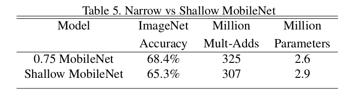
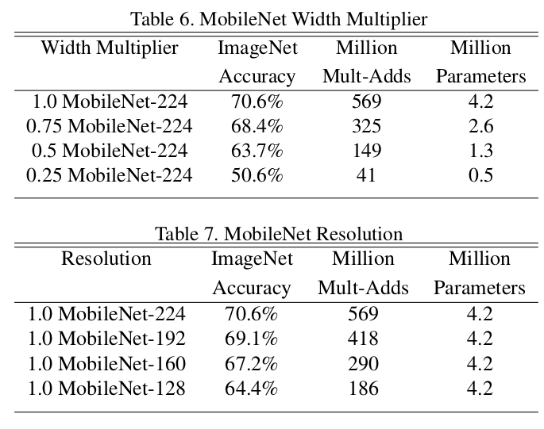
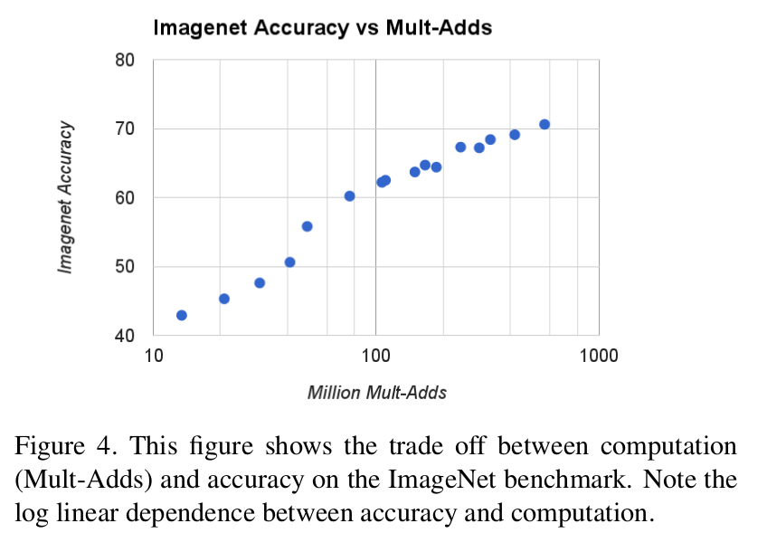
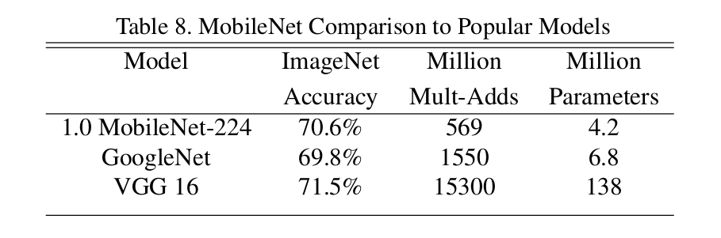
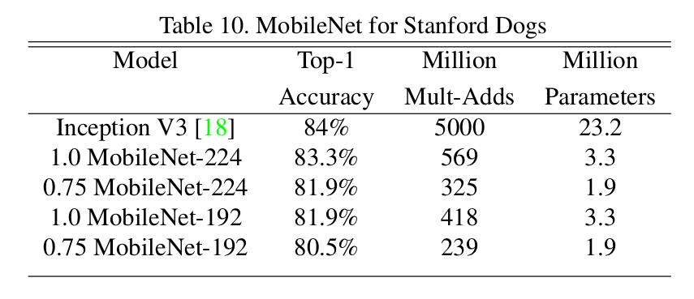
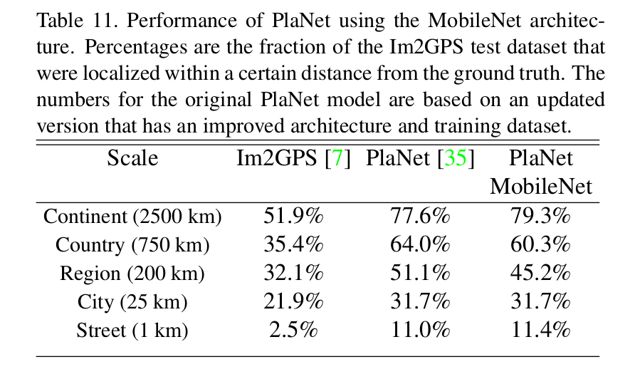
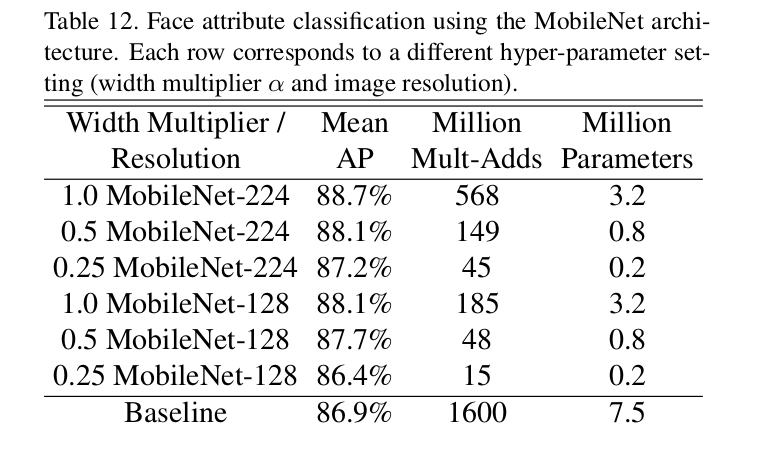

MobileNets: Efficient Convolutional Neural Networks for Mobile Vision Applications
=

# 3. MobileNet Architecture
## 3.1. Depthwise Separable Convolution
MobileNet 是基于 depthwise separable 卷积，其是分解卷积的一种形式，其将标准卷积分解为 depthwise 卷积和 $1 \times 1$ 卷积（称为 pointwise 卷积）。depthwise 卷积将单个滤波器用于每个输入通道。然后，pointwise 卷积使用 $1 \times 1$ 卷积来组合 depthwise 卷积的输出。而标准卷积一步完成滤波和将输入组合到一组新的输出中。depthwise separable 卷积将其划分为两层，一层用于滤波，而另一层用于组合。这种因式分解具有显著减少计算量和模型大小的效果。图 2 展示论文如何将标准卷积 2(a) 分解为 depthwise 卷积 2（b）和 $1 \times 1$ pointwise 卷积 2（c）。

一个标准的卷积将 $D_F \times D_F \times M$ 的特征图 $F$ 作为输入，并产生 $D_F \times D_F \times N$ 的特征图 $G$ ，其中 $D_F$ 为正方形输入特征图的宽和高， $M$ 为输入通道数（输入深度），$D_G$ 为正方形输出特征图的宽和高，$N$ 为输出通道数（输出深度）。

标准卷积由大小为 $D_K \times D_K \times M \times N$ 的卷积核参数化，其中 $D_K$ 为核（假设为正方形）的空间维度，$M$ 为输入通道数，$N$ 为输出通道数。

假设步长为 1 和 padding 的标砖卷的输出特征图计算为：

$$G_{k,l,n} = \sum_{i,j,m}K_{i,j,m,n} \cdot F_{k+i-1,l+j-1,m}  \tag 1$$

标准卷积的计算成本为

$$D_K \cdot D_K \cdot M \cdot N \cdot D_F \cdot D_F \tag 2$$

其中计算成本依赖输入通道 $M$ 、输出通道 $N$ 、核大小 $D_K \times D_K$ 和 特征图大小 $D_F \times D_F$ 。MobileNet 模型处理这些项以及它们之间的交互。首先，它使用 depthwise separable 卷积来打破输出通道数量和内核大小之间的交互。

标准卷积运算具有基于卷积核的特征滤波和特征组合的效果，从而产生新的表示形式。通过使用称为深度可分卷积的分解卷积，可以将滤波和组合步骤分为两个步骤，以大幅降低计算成本。深度可分离卷积由两层组成： depthwise 卷积和 pointwise 卷积。我们使用 depthwise 卷积来将单个滤波器应用到每个输入通道。然后，Pointwise 卷积用于创建 depthwise 层输出的线性组合。MobileNets 的两层都是用 batch-norm 和 ReLU 。

每个输入通道一个滤波器的 depthwise 卷积可以写为：

$$\hat{G}_{k,l,m} = \sum_{i,j} \hat{K}_{i,j,m}
\cdot F_{k+i-1,l+j-1,m}  \tag 3$$

其中 $\hat{K}$ 为大小为 $D_K \times D_K \times M$ 的 depthwise 卷积和，其中 $\hat{K}$ 中的第 $m$ 个滤波器用于 $F$ 的第 $m$ 个通道以产生输出特征图 $\hat{G}$ 的第 $m$ 个通道。

Depthwise 卷积的计算成本为：

$$D_K \cdot D_K \cdot M \cdot D_F \cdot D_F \tag 4$$

与标准卷积相比，Depthwise 卷积极其有效。然而，它仅对输入通道进行滤波，而没有将它们组合成新的特征。因此，为了生成这些新特征，通过 $1 \times 1$ 卷积计算 depthwise 卷积的输出的线性组合而产生的额外卷积是必要的。

Depthwise 卷积和 $1 \times 1$ 卷积的组合称为深度可分离卷积。

深度可分离卷积的计算成本为：

$$D_K \cdot D_K \cdot M \cdot D_F \cdot D_F + M \cdot N \cdot D_F \cdot D_F  \tag 5$$

其为 depthwise 和 $1 \times 1$ 的pointwise 卷积之和。

通过将卷积表示为滤波的两步过程并结合，我们得到的计算约简为:

$$\frac{D_K \cdot D_K \cdot M \cdot D_F \cdot D_F + M \cdot N \cdot D_F \cdot D_F}{D_K \cdot D_K \cdot M \cdot N \cdot D_F \cdot D_F} = \frac{1}{N} + \frac{1}{D^2_k}$$

MobileNets 使用 $3 \times 3$ 的深度可分离卷积，其比标准卷积的计算量少 8 到 9 倍，且仅有很小的准确率下降。

在[16,31]等空间维度上的额外因子分解不会节省太多额外的计算，因为在深度卷积上花费的计算非常少。

## 3.2. Network Structure and Training

MobileNet 构建在深度可分离卷积的基础之上，但是其第一层是完整的卷积。通过定义如此简单的项，我们可以轻松地探索网络的拓扑结构以找到最佳网络。MobileNet 结构定义于表 1 。所有层后都是 batchnorm 和 ReLU ，最后传入 softmax 层以进行分类。图 3 比较具有规则卷积、批归一化和 ReLU 的层与深度可分离层。下采样在  depthwise 卷积中通过步长处理。在全连接之前，使用全局平均池化将空间分辨率缩小为 1 。将 depthwise 和 pointwise 卷积作为单独层，MobileNet 共有 28 层。

仅仅用少量的 Mult-Add 来定义网络是不够的。确保这些操作能够有效地实现也很重要。例如，非结构化稀疏矩阵运算通常不会比密集矩阵运算快，除非稀疏程度非常高。我们的模型结构几乎将所有的计算放到密集的 $1 \times 1$ 卷积。这可以通过高度优化的通用矩阵乘法（general matrix multiply: GEMM）函数来实现。卷积通常使用 GEMM 实现，但是需要在内存中进行名为 im2col 的初始重新排序，以便将其映射到 GEMM 。例如，该方法在 Caffe 保重使用。$1 \times 1$ 卷积不需要内存中的这种重新排序，并能够直接使用 GEMM 实现，其为最优化的数值线性代数算法。MobileNet 95% 的计算都位于 $1 \times 1$ 卷积，$1 \times 1$ 卷积也有 75% 的参数，如表 2 所示。几乎所有额外的参数都位于全连接层。

在 TensorFlow[1] 中使用 RMSprop[33] 对 MobileNet 模型进行训练，使用异步梯度下降，类似于 Inception V3[31] 。然而，与训练大型模型相反，我们使用较少的正则化和数据增强技术，因为小型模型在过拟合方面的问题较少。当训练 MobileNet 时，我们不使用 side head 或标签平滑，并且通过限制在大初始训练[31]中使用的小裁剪的尺寸来减少图像失真。此外，**我们发现，由于深度滤波器的参数非常少，所以在深度滤波器上加入很少或没有权衰减(l2正则化)是非常重要的。** 对于下一节的 ImageNet 基准测试，所有模型使用相同参数训练，而不管模型的大小。

## 3.3. Width Multiplier: Thinner Models
尽管基于 MobileNet 的架构是已经很小和低延迟，许多时候一个特定的案例或者应用需要模型更小，且更快。为了构建这些更小并且更少计算成本的模型，我们引入非常简单的参数 $\alpha$ （称为 width multiplier）。Width multiplier $\alpha$ 统一薄化每层的网络。对于给定的每层和 width multiplier $\alpha$ ，输入通道数 $M$ 变为 $\alpha M$ ，输出通道数 $N$ 变为 $\alpha N$ 。

具有 width multiplier $\alpha$ 的深度可分离卷积的计算成本变为：

$$D_K \cdot D_K \cdot \alpha M \cdot D_F \cdot D_F + \alpha M \cdot \alpha N \cdot D_F \cdot D_F \tag 6$$

其中 $\alpha \in (0,1]$ ，且通常设置为 1、 0.75、 0.5 和 0.25 。$\alpha = 1$ 为基线 MobileNet ，$\alpha < 1$ 为 reduced MobileNet 。Width multiplier 具有减小计算成本和大致 $\alpha^2$ 的计算量的效果。宽度乘法器可以应用于任何模型结构，以合理的精度、延迟和大小权衡来定义新的更小的模型。它用于定义需要从头开始训练的新的简化结构。

## 3.4. Resolution Multiplier: Reduced Representation
第二用于减小神经网络计算成本的超参数为 resolution multiplier $\rho$ 。我们将此应用于输入图像，每个层的内部表示随后被相同的 multiplier 减少。实践中，我们同设置输入分辨率来简单地设置 $\alpha$ 。

现在，我们将网络的核心层的计算成本表示为具有宽度 width multiplier $\alpha$ 和 resolution multiplier $\alpha$ 的深度可分离卷积：

$$D_K \cdot D_K \cdot \alpha M \cdot \rho D_F \cdot \rho D_F + \alpha M \cdot \alpha N \cdot \rho D_F \cdot \rho D_F \tag 7$$

其中 $\rho \in (0, 1]$ ，其通常简地设置以使输入分辨率为 224、 192、 160 或者 128 。$\rho = 1$ 为基线 MobileNet ，而 $\rho < 1$ 为减小计算量的 MobileNet 。分辨率乘子具有减小计算成本 $\rho^2$ 的影响。

作为一个例子，我们可以看看MobileNet中的一个典型层，看看深度可分卷积、宽度乘法器和分辨率乘法器如何降低成本和参数。表3显示了一个层的计算和参数数量，因为架构收缩方法依次应用于该层。表 3 的第一行展示大小为 $14 \times 14 \times 512$ 的输入特征和大小为 $3 \times 3 \times 512 \times 512$ 的核 $K$ 的完整卷层的 Mult-Add 和参数量。我们将在下一节详细讨论资源和准确性之间的权衡。

# 4. Experiments
## 4.1. Model Choices
首先，我们展示了深度可分卷积的MobileNet与完整卷积模型的比较结果。表 4 中，我们可以看到使用深度可分离卷积与完整卷积相比，在 ImageNet 上仅减小 1% 的准确率，但极大地节约了 Mult-Add 和参数。

接下来我们将展示使用宽度乘子的较薄模型与使用较少层的较薄模型的比较结果。为了使 MobileNet 更浅，表 1 中特征图大小为 $14 \times 14 \times 512$ 的可分离滤波器的 5 层被移除。表 5 展示相似的计算和参数量，其是 MobileNet 更薄 3% ，但是更好于使他们更浅。

## 4.2. Model Shrinking Hyperparameters

表 6 为具有权衡宽度乘子 $\alpha$ 的 MobileNet 架构的精度,计算和尺寸缩小。精度下降平稳,直到 $\alpha = 0.25$ 。

表 7 为通过训练输入分辨率降低的 MobileNet 在不同分辨率乘子下的精度、计算和大小的权衡。精度随分辨率而平稳下降。

图 4 显示由宽度乘子 $\alpha \in \{1,0.75,0.5,0.25\}$ 和分辨率乘子 $\rho \in \{224, 192, 160, 128\}$ 的交叉乘积产生的 16 个模型在ImageNet 准确率和计算量之间的权衡。

图 5 显示了这 16 中模型的 ImageNet 准确率和参数量之间的权衡。

## 4.3. Fine Grained Recognition

## 4.4. Large Scale Geolocalizaton

## 4.5. Face Attributes

## 4.6. Object Detection

## 4.7. Face Embeddings

