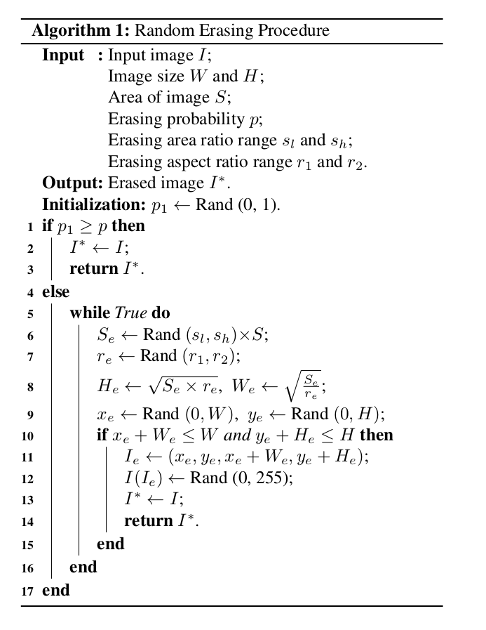
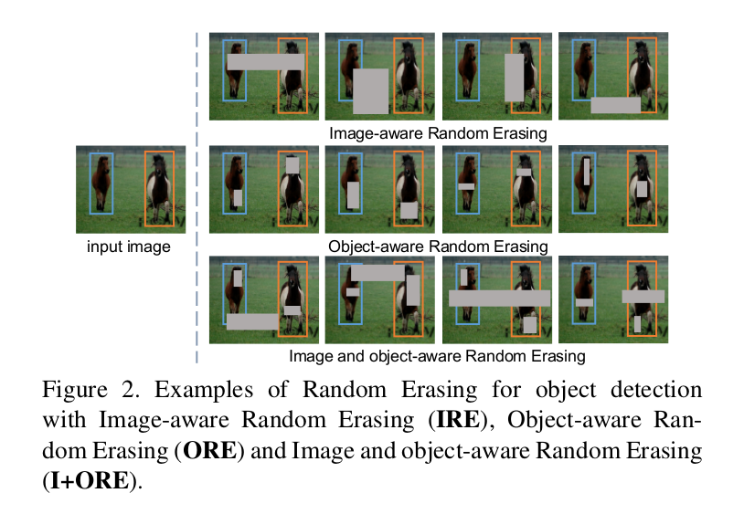
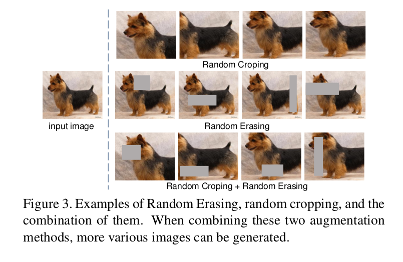
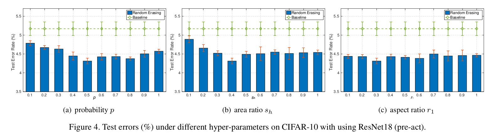
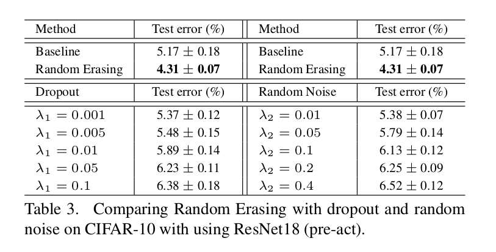
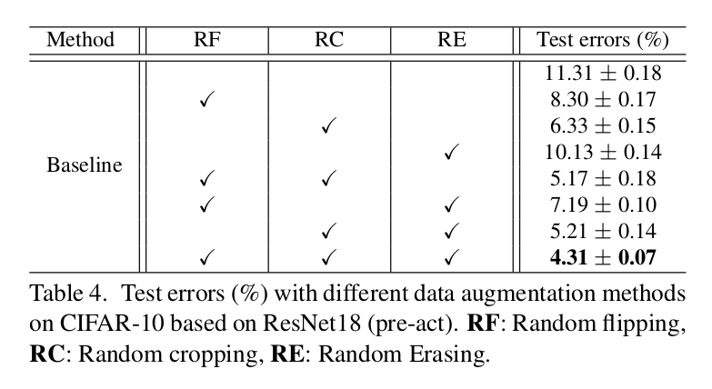
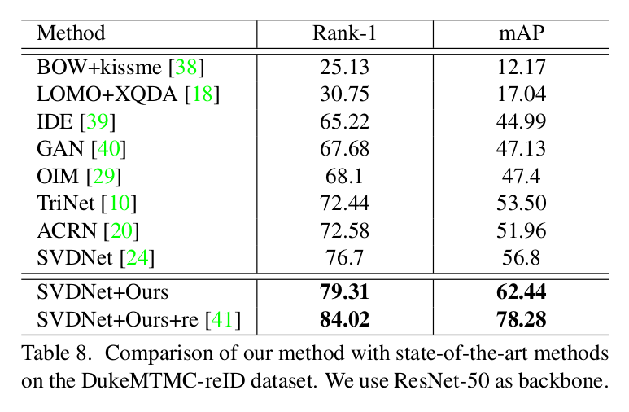
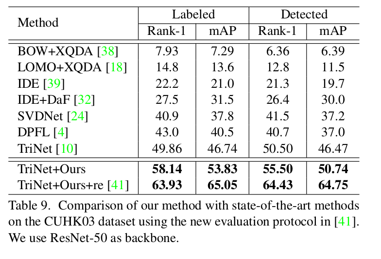

Random Erasing Data Augmentation
=

# 1. Introduction
泛化能力是卷积神经网络研究的重点。当模型过于复杂时，如相比训练样本量有过多的参数，可能会发生过拟合，并减弱泛化能力。学习到的模型可能会描述随机误差或者噪声，而不是潜在的数据分布。在不好的情况下，CNN模型可能在训练数据上表现出良好的性能，但是在预测新数据时却表现得非常糟糕。为了提高 CNN 的泛化能力，提出了许多数据增强和正则化方法，如随机剪裁、翻转、dropout和批归一化。

遮挡是 CNN 泛化能力的一个关键影响因素。我们希望在不同的遮挡程度上保持不变。当对象的某些部分被遮挡时，一个强壮的分类模型可以从整体对象结构上识别其类别。然而，收集到的样本通常在遮挡问题显示出有限的变化。一个极端的案例是，当所有训练对象都是清楚可见，即没遮挡发生时，学习到的 CNN 可能在没有遮挡测试图像起作用，但是，由于 CNN 模型有限的泛化能力，可能不能成功地识别部分遮挡的对象。虽然我们可以手工添加遮挡的图像自然图像到训练集中，但是它是昂贵的，并且遮挡程度可能是有限的。

为了处理遮挡问题，并提高 CNN 的泛化能力，本文介绍一种新的数据增强方法—Random Earsing 。他能轻松地在多数已有的 CNN 模型中实现。在训练阶段，minibatch 中的图像随机地进行一下操作的中一种：1）保持不变；2）随机选择任意尺寸的矩形区域，并随机地给该区域赋值（或者 ImageNet的平均像素值）。在操作 2）中，图像使用随机大小的掩模产生随机位置的遮挡。以这种方式，不同遮挡成都的增强图像便能生成。随机擦除的例子如图1所示。

两种常用的数据增强方法（即随机翻转和随机裁剪）也工作在图像层面，与随机擦除密切相关。两种技术都被证明有能力提高图像识别的准确率。与 Random Erasing 相比，随机翻转在增强期间不会产生信息丢失。不同于随机裁剪，在 Random Erasing 中，1）仅部分的对象是被遮挡的，而整体的对象结果被保留下来，2）擦除区域的像素使用随机值重新分配，其可以视为将块状噪声添加到图像。

主要工作在全连接层的 dropout 也与我们的工作相关。它通过以概率 $p$ 丢弃 CNN（隐藏和可见）单元来阻止过拟合。Random Erasing 与执行在图像级别的 dropout 有某些相似之处。Random Erasing 不同之处在于，1）我们仅在连续的矩形区域操作，2）我们关注使模型对噪声和遮挡更加鲁邦。最近的 A-Faster-RCNN 提出一种遮挡变体的对象检测器，其通过训练对抗网络生成遮挡的样。相比 A-Faster-RCNN ，Random Erasing 不需要参数学习，其能够轻松地用于其他基于 CNN 的识别任务，并仍能产生与 A-Faster-RCNN 的竞争性结果。总之，Random Erasing 有如下优势：

- 一种轻量级方法，不需要任何额外的参数学习或者内存开销。它可以集成到不同的 CNN 模型，而不需要改变学习策略。

- 与已存在的数据增强和正则化方法的补充。当它们结合时，Random Erasing 进一步提高识别性能。

- 在图像分类、对象检测和行人重识别的历史最佳深度模型上取得一致的性能提高。

- 提高 CNN 对于部分遮挡样本的鲁棒性。当随机地添加遮挡到 CIFAR-10 测试数据上时，Random Erasing 明显由于基线模型。

# 3. Datasets
对于图像分类，我们在三个图像分类数据集上评估，包括 CIFAR-10 和 CIFAR-100、以及新的数据集 Fashion-MNST 。CIFAR-10 和 CIFAR-100 分别包含 50000 张和 100000 张 $32 \times 32$ 的训练图像，分别有 10 个和 100 个类。Fashion-MNST 包含 60000 张训练图像和 10000 张测试图像，图像为 $28 \times 28$ 的灰度图，共 10 个类。

对于对象检测，我们使用 PASCAL VOC 2007 ，其包含 9963 张图像，波哥 24640 个标准对象。我们使用 “trainval” 进行训练，使用 “test” 测试。

对于行人重识别（re-ID），Market-1501 数据集[38]包含 32,668 个标记边界框，包含从 6 个不同相机捕获的 1,501 个个体。数据集分为包含 751 个个体的 12936 张图像用于训练，包含 750 个个体的 19732 张图像用于测试。在测试中，使用3,368张带有750个标识的手绘图像作为探测集，以识别测试集上的正确标识。DukeMTMC-reID 包含 8 个高分辨相机拍摄的具有 1812 个个体的 36411 张图像。其中训练图像有 702 个个体，16522 张图像；其他 702 个身份的 2228 张查询图像和 17661 张 gallery 图像。CUHK03 包含 1467 个个体的 14096 张图像。我们使用[41]提出新的训练/测试协议来评估 multi-shot re-ID 性能。

# 4. Our Approach
## 4.1. Random Erasing
在训练中，Random Erasing 以特定概率执行。对于 mini-batch 中的图像 $I$ ，它的 Random Erasing 概率为 $p$ ，并且其保持不变的概率为 $1 - p$ 。在这一过程中，产生了不同遮挡程度的图像。

Random Erasing 随机地选择图像中的一个矩形区域 $I_e$ ，并使用随机值擦除其中的像素。假设图像的大小为 $W \times H$ 。图像的面积为 $S = W \times H$ 。我们随机初始化擦除的矩形区域为 $S_e$ ，其中 $\frac{S_e}{S}$ 位于最小值 $s_l$ 和最大值 $s_h$ 指定的范围内。擦除矩形的纵横比有 $r_1$ 和 $r_2$ 之间的值随机初始化，我们将它设置为 $r_e$ 。$I_e$ 的大小为 $H_e = \sqrt{S_e \times r_e}$  和 $W_e = \sqrt{\frac{S_e}{r_e}}$ 。然后，我们随机初始化 $I$ 中的点 $\cal P =(x_e, y_e)$ 。如果 $x_e + W_e \le W$ 以及 $y_3 + H_e \le H$ ，我们设置区域 $I_e = (x_e, y_e, x_e + W, y_e+H_e)$ 选择的矩形区域。否则，重复上述过程指导选择了合适的 $I_e$ 。有了选择擦除的区域 $I_e$ ，$I_e$ 中的每个像素被分配为 $[0,255]$ 中的随机值。选择矩形区域，并擦除该区域的过程如算法 1 所示。

## 4.2. Random Erasing for Image Classification and Person Re-identification
在图像分类中，图像根据其视觉内容被分类。通常，训练数据不会提供对象的位置信息，因此，我们不能指导对象在哪里。在这种情况下，我们根据算法 1 在整个图像上执行 Random Erasing 。

最近，Person Re-ID 模型通常在分类网络中进行训练，用于嵌入学习[39]。在这项任务中，由于行人使用边界框确定，人大致处于相同的位置，占据图像的大部分区域。在这种场景中，我们采用与图像分类相同的策略，如同在实际应用中，行人可能在任意位置被遮挡。我们在整个行人图像中随机地选择矩形区域，并擦除它，如图1所示。

## 4.3. Random Erasing for Object Detection
对象检测旨在检测图像中某个类对象的实例。由于训练图像中的每个对象的位置是已知的，我们使用三种方案来实现 Random Erasing： 1）Image-aware Random Erasing（IRE）：选择整个图像中的擦除区域，与图像分类和 Person Re-ID 相同；2）Object-aware Random Erasing（ORE）： 选择每个对象的边界框中的擦除区域。如果在图像中有多个对象，Random Erasing 在每个对象中单独地应用。3）Image and object-aware Random Erasing（I+ORER）： 1）和2）的结合，如图2所示。

## 4.4. Comparison with Random Cropping
随机裁剪是一种有效的数据增强方法，它减少了 CNN 决策中背景的贡献，可以将学习模型建立在对象部位存在的基础上，而不是集中在整个对象上。相比随机裁剪，Random Erasing 保留了对象的整体结构。此外，擦除区域的像素使用随机值重新分配，其可以视为对图像添加随机噪声。我们的实验中，我们证明这两种方法是互补的。Random Erasing 、随机裁剪以及它们的结合如图 3 所示。

# 5. Experiments
## 5.1. Image Classification
### 5.1.1 Experiments Settings
我们比较有和没有 Random Erasing 的 CNN 模型。对于相同的深度架构，所有模型从相同的权重初始化训练。注意，一些流行的技术（如，权重衰减、批归一化和 dropout）和不同的数据增强（如翻转、填充和裁剪）也被采纳。比较的 CNN 架构总结如下：

**Architecture.** 在 CIFAR-10 、 CIFAR-100 和 Fashion-MNIST 上采用四种架构： ResNet、pre-activation ResNet 、ResNeXt 和 Wide Residual Network。我们使用 20、 32、 44、 56、 110 层的 ResNet 和 pre-activation ResNet。也采用了 18 层的 pre-activation ResNet 。采用 ResNeXt-29-8x64 和 WRN-28-10 。学习率从 0.1 开始，在第 150 和 255 个时期除以 10 。我们在 300 个时期后停止训练。如果不指出，所有模型使用数据增强为： 随机执行水平翻转、对于 CIFAR ，从每边填充 4 个像素的图像上随机裁剪 $32 \times 32$ 子图（Fashion-MNIST 采用 $28 \times 28$）。

### 5.1.2 Classification Evaluation
如表 1，我们设置 $p=0.5$ 、$s_l = 0.02$、 $s_h = 0.4$ 和 $r_1 = \frac{1}{r_2} = 0.3$ 。

**The impact of hyper-parameters.** 为了简化实验，我们固定 $s_l$ 为 0.02 ，$r_1 = \frac{1}{r_2}$ ，并评估 $p$ 、 $s_h$ 和 $r_1$ 。$p=0.5$ 、 $s_h=0.4$ 和 $r_1 = 0.3$ 为基本设置，结果如图 4 。

我们发现 $p=0.5$、 $s_l=0.02$、$s_h=0.4$ 和 $r_1 = \frac{1}{r_2}=0.3$ 获得最佳结果，接下的实验中也如此设置。

**Four types of random values for erasing.**

**Comparison with Dropout and random noise.**

**Comparing with data augmentation methods.**

**Robustness to occlusion.**

## 5.2. Object Detection
### 5.2.1 Experiment Settings
基于 Fast-RCNN 执行实验。使用预训练模型权重初始化。VGG16，遵循 A-Faster-RCNN 进行训练。我们采用 SGD 训练所有模型 80K 。学习率以 0.001 开始，在 60K 迭代时减小为 0.0001 。在训练期间使用选择性搜索，对于 Random Erasing ，我设置 $p=0.5$、 $s_l=0.02$、$s_h=0.2$ 和 $r_1 = \frac{1}{r_2}=0.3$ 。

### 5.2.2. Detection Evaluation

## 5.3. Person Re-identification
### 5.3.1 Experiment Settings
基线模型为 ID-discriminative Embedding (IDE) TriNet [10] 和 SVDNet [24] 。IDE 和 SVDNet 使用 softmax 损失训练，而 TriNet 使用 triplet 损失训练。输入图像调整为 $256 \times 128$ 。

对于 IDE ，我们遵循其论文中的设置。在 Pool5 层后添加 128 个单元的全连接层，接着是批归一化、ReLU 和 Dropout ，Dropout 的概率为 0.5 。使用 SGD 训练 IDE，学习率从 0.01 开始，在 40 个时期后除以 10 。共训练 100 个时期。测试时，对于 Market-1501 和 DukeMTMC-reID 数据集，我们提取 Pool5 的输出作为特，而对于 CUHK03 ，提取 128 个单元的全连接层作为特征。

对于 TriNet 和 SVDNet ，我们使用 [10] 和 [24] 提出的相同模型，并遵循相同的训练策略。在测试中，对于 TriNet ，提取具有 128 个单元的最后一个全连接层的输出作为特征，对于 SVDNet ，使用 Pool5 的输出作为特征。注意，使用 $256 \times 128$ 作为输入大小以训练 SVDNet ，其获得的性能比使用大小为 $224 \times 224$ 的原始论文高。

对于 IDE 和 TriNet ，我们使用 ResNet-18、ResNet-34 和 ResNet-50 架构，对于 SVDNet ，使用 ResNet-50 。使用 ImageNet 预训练的模型微调它们。我们也执行随机裁剪和随机水平翻转。对于 Random Erasing ，我们设置 $p=0.5$ 、$s_l = 0.02$ 、$s_h=0.2$ 和 $r_1 = \frac{1}{r_w} = 0.3$ 。

### 5.3.2 Person Re-identification Performance
**Baseline Evaluation.**

