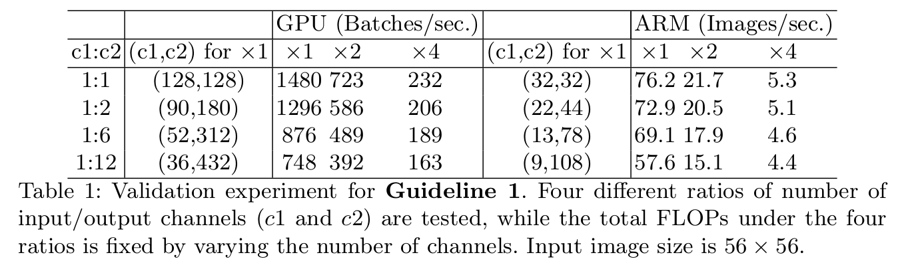
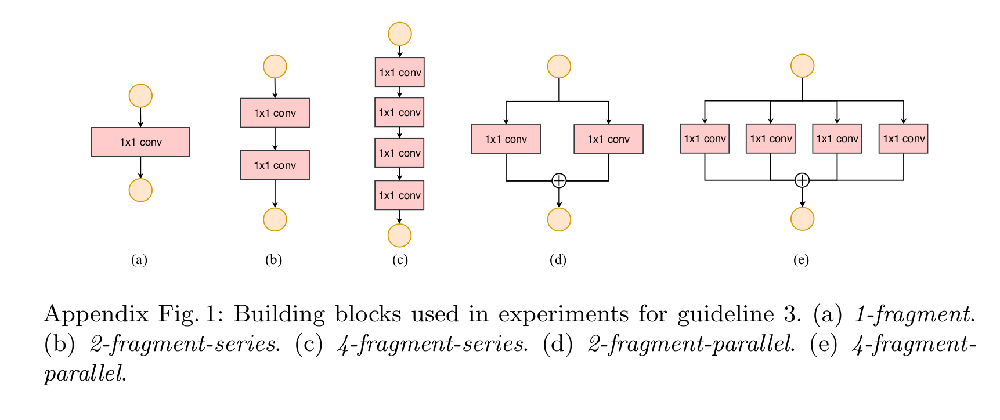
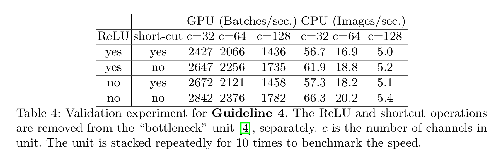
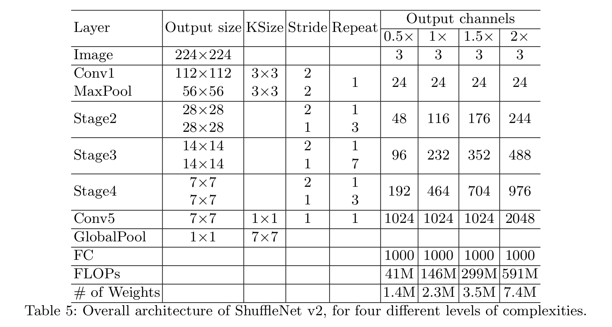
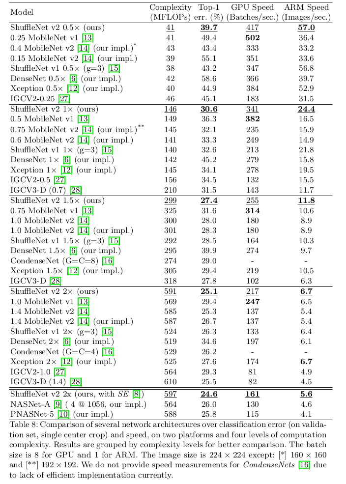
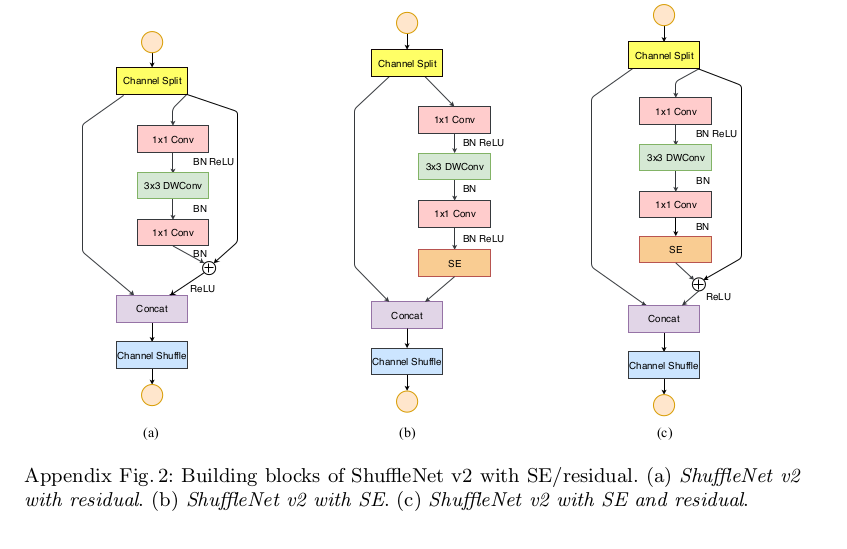
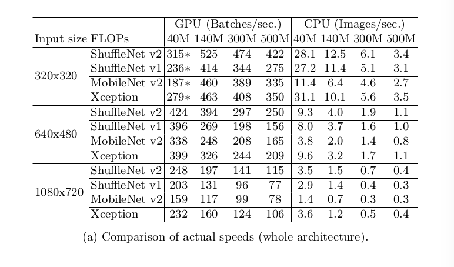

ShuffleNet V2: Practical Guidelines for Efficient CNN Architecture Design
=

# 1. Introduction
深度卷积神经网络(CNNs)的架构已经发展了多年，变得越来越精确和快速。自AlexNet[1]的里程碑式工作以来，ImageNet分类准确率显著提高，新结构包括 VGG[2]、GoogLeNet[3]、ResNet[4,5]、DenseNet[6]、ResNeXt[7]、SE-Net[8]和自动神经架构搜索[9,10,11]等。

除了准确率，计算复杂度是另一个重要考量。显示实际的任务通常目标是在有限的计算预算下获得最佳准确率（例如，自动驾驶需要低延迟）。这激发了一系列致力于轻量级架构设计和更好的速度-准确性权衡的工作，包括Xception[12]、MobileNet[13]、MobileNet V2[14]、ShuffleNet[15] 和 CondenseNet[16]等。组卷积和 depth-wise 卷积在这些工作中起着关键作用。

为了衡量计算复杂度，一个广泛使用的度量是浮点计算量（或者FLOPs， multiply-adds 数量）。它是一种近似，但是通常不等价于我们实质上关心的 _直接（direct）_ 度量，例如速度或延迟。如此的差异在先前的工作[17,18,14,19]中被注意到。例如， MobileNetV2[14] 远远快于 NASNET-A[9]，但是它们有相近的 FLOPs 。这一现象在图1(c)(d)中得到了进一步的说明，图1(c)(d)中显示了具有相似失败的网络具有不同的速度。因此，仅使用FLOPs作为计算复杂度的度量是不够的，可能会导致次优设计。

间接(FLOPs)和直接(speed)指标之间的差异可以归结为两个主要原因。第一，有几个重要的因素，对速度有相当大的影响，没有被 FLOPs 考虑到。一个因素是 _memory access cost（MAC）_ 。在组卷积等特定操作中，此类成本构成了运行时的很大一部分。他可以是具有强计算能力的设备的瓶颈，例如 GPU 。这种成本在网络架构设计期间不应当被简单地忽略。另一个是 _degree of parallelism_ 。在相同 FLOPs下，具有高并行度的模型远快于具有低并行度的模型。

第二，具有相同 FLOPs 的操作可能有不同的运行时，这取决于平台。例如，张量分解广泛用于早期工作[20,21,22]以加速矩阵乘法。然而，尽管[22]中的分解将 FLOPs 降低了 75%，但是 最佳的工作[19]发现这种[22]中的分解在 GPU 甚至更慢。我们研究了这个问题，并发现这是因为最近的 CUDNN 库专门为 $3 \times 3$ 卷积进行优化。我们不能想当然地认为 $3 \times 3$ 卷比 $1 \times 1$ 卷积慢 9 倍。

有了这种观察，我们提出高效的网络架构设计时需要考虑的两个原则。 **第一，应当使用直接度量（例如速度）而不是间接度量（如FLOPs）。第二，如此的独立需要在目标平台评估。**

这项工作中，我们遵循两个原则，并提出一个更有效的网络架构。

# 2. Practical Guidelines for Efficient Network Design
我们在两种广泛采用的，并对CNN库进行了工业级的优化硬件进行了研究。我们注意到，我们的 CNN 库比多数开源库更有效。因此，我们确保我们的观察和结论是可靠的，并且在工业上有显著的意义。

- GPU. 使用单个 NVIDIA GeForce GTX 1080Ti 。卷积库为 CUDNN 7.0 。我们还激活了CUDNN的标杆函数，分别为不同的卷积选择最快的算法。

- ARM. 使用 Qualcomm Snapdragon 810 。我们使用高度优化的基于neon的实现。单个线程用于计算。

其他设置包括： 全优化选项(例如张量融合，用于减少小操作的开销)被打开。输入图像大小为 $224 \times 224$ 。每个网络随机初始化，并评估 100 次。使用平均运行时间。   

为了初始化我们的研究，我们分析两种最佳网络（ShuffleNetV1 和 MobileNetV2）的运行时性能。它们在 ImageNet 分类任务上都是高度有效和准确的。它们可以广泛用于如移动的低端设备。尽管我们仅分析这两个网络，但是我们注意到它们是当前研究趋势的代表。它们的核心是组卷积和 depth-wise 卷积，其也是其他最佳网络的关键组件，如 ResNeXt、Xception、MobileNet 和 CondenseNet 。

整体运行时被分解为不同的操作，如图 2 所示。我们注意到 FLOPs 度量仅考虑了卷积部分。尽管这一部分最耗时间，但是其他操作（包括数据 I/O 、数据洗牌和逐元素操作（AddTensor、 ReLU 等））也是占据相当客观的时间。因此，FLOPs 对于高效网络架构设计不够准确。

基于这种观察，我们从几个不同方面对运行时（或速度）进行详细分析，并推导出几个用于高效网络架构设计的指导。

**G1）Equal channel width minimizes memory access cost(MAC).** 现代网络通常采用深度可分离卷积，其中 pointwise 卷积（即 $1 \times 1$ 卷积）占用最多的复杂度。我们研究 $1 \times 1$ 卷积核的形状。其形状被两个参指定： 输入通道数 $c_1$ 和输出通道数 $c_2$ 。令 $h$ 和 $w$ 为特征图的空间尺寸，$1 \times 1$ 卷积的 FLOPs 为 $B = hwc_1c_2$ 。

简单起见，我们假设计算设备的缓存足够存储全部特征图和参数。因此，内存访问成本（MAC）或者数内存访问操作的次数为 $\mbox{MAC} = hw(c_1 + c_2) + c_1c_2$ 。注意，这两个项分别对应于输入/输出特征图和核权重的内存访问。

有均值不等式，我们有

$$\mbox{MAC} \ge 2\sqrt{hwB} + \frac{B}{hw}  \tag 1$$

因此，MAC 的下界由 FLOPs 给出。当输入和输出通道数相等时，达到下界。

结论是理论上的。事实上，许多设备的缓存都不足够大。同时，现代计算库通常采用复杂阻塞策略来充分利用缓存机制。因此，真实的 MAC 可能偏离理论值。为了验证上述结论，进行如下的实验。通过重复堆叠 10 个构建块组成的基准测试网络。每个块包含两个卷积层。第一个卷积包含 $c_1$ 个输入通道和 $c_2$ 个输出通道，而第二卷积则相反。

表 1 报告了，当固定总计的 FLOPs 时，变化的比例 $c_1 : c_2$ 下的运行速度。很明显，当 $c_1 : c_2$ 接近 $1 : 1$ 时，MAC 变得更小并且网络的评估速度更快。

**G2) Excessive group convolution increases MAC.** 组卷积是现代网络架构的核心。它同将所有通达之间的密集卷积改为稀疏（仅在通道的组中进行卷积）降低了计算复杂度（FLOPs）。一方面，它允许在给定 FLOPs 的情况下使用更多的通道，并且增加网络的容量（因此有更优的准确率）。另一方面，然而，通道数的增加导致更多的 MAC 。

形式上，遵循 **G1** 和公式 1 中的符号，$1 \times 1$ 卷积的 MAC 和 FLOPs 之间的关系为：

$$
\begin{alignat}{2}
\mbox{MAC} &= hw(c_1 + c_2) + \frac{c_1c_2}{g}  \\
&= hwc_1 + \frac{Bg}{c_1} + \frac{B}{hw}
\end{alignat} \tag 2
$$

其中 $g$ 为组的数量，$B = hwc_1c_2/g$ 为 FLOPs 。很容易发现，考虑到固定的输入形状 $c_1 \times h \times w$ 和计算成本 $B$ ，MAC 随 $g$ 的增加而增加。

为了在实践中研究这种影响，通过堆叠 10 个 pointwise 组卷积层来构建基准测试网络。表 2 报告了在固定总计 FLOPs 时，使用不同分组数量的运行速度。很明显，在 GPU 上，使用 8 个组的卷积使用的时间几乎比使用 1 个组的卷积（标准的密集卷积）多了两倍，而在 ARM 上则慢 30% 。这主要由于增加了 MAC 。我们注意到，我们的实现已经过特殊优化，并比逐组计算的普通卷积快。

因此，我们认为 _基于目标平台和任务，组的数量应当仔细选择。简单地使用较大组数是不明智的，因为这可能使用更多的通道，而增加的准确率收益很容易被逐渐增加的计算成本超过。_

**G3) Network fragmentation reduces degree of paramllelism.** GoogLeNet 和自动生成架构中，“多路径”结构在每个网络块中广泛采用。许多小型操作（这里称为“碎片操作（fragmented operator）”）被使用，而不是少量大型操作。例如，NASNET-A 中，碎片操作的数量（即一个块中的单个卷积或池化操作的数量）为 13 。相比之下，在标准的如 ResNet 的结构，这个数量为 2 或者 3 。

尽管如此的碎片结构已被证明对于准确率是有益的，但是他可能降低效率，因为它对如 GPU 的强并行计算能力的设备是不友好的。它也引入了额外的开销，如内核启动和同步。

为了量化网络碎片如何影响效率，我们评估一系列具有不同碎片度的网络块。具体地，每个构建块由 1 到 4 个 $1 \times 1$ 卷积组成，其按顺序或并行排列。块结构见附录。每个块重复堆叠 10 次。表 3 的结果表明显著减小 GPU 的速度，例如 4 碎片（4-fragment）的结果比 1 碎片结构慢 4 倍。在 ARM 上，速度也相应变慢。

**G4) Element-wise operations are non-negligible.** 如图 2 所示，在如 ShuffleNetV1 和 MobileNetV2 的轻量模型中，逐元素操作占据客观的时间，特别在 GPU 上。这里，逐元素操作，包括ReLU、AddTensor、AddBias 等。它们有较小的 FLOPs ，但相对较大的 MAC 。具体地，我们也将 depth-wise 卷积视为逐元素操作，因为它也有较高的 MAC/FLOPs 比例。

对于验证，我们使用 ResNet中的 “瓶颈”单元（$1 \times 1$ 卷积，接着是 $3 \times 3$ 卷积，然后是 $1 \times 1$ 卷积）进行实验。ReLU 和 快捷操作被移除。不同变体的运行时如表 4 。在ReLU和快捷被移除之后，我们观察到在 GPU 和 ARM 上都获得大约 20% 的加速。

**Conclusion and Discussions** 基于上述指南和经验研究，我们总结到一个有效的架构应当 **1）使用平衡的卷积（相等的通道宽度）；2）应当意意识到使用组卷积的成本；3）应到减小碎片度；4）一个岛减小逐元素操作。** 这些理想的属性依赖于平台特性(例如内存操作和代码优化)，这些特性超出了理论的 FLOPs 范围。在实际的网络设计中应考虑这些因素。

最近在轻量神经网络架构方面的进步主要基于 FLOPs 度量，并没有考虑上述特性。例如，ShuffleNetV1 严重依赖组卷积（违背 G2），而类似瓶颈的构建块（违背 G1）。MobileNetV2 使用颠倒的瓶颈结果，违背 G1 。它在薄特征图上使用 depthwise 卷积和 ReLU ，这违背 G4 。自动生成结构高度碎片化，违背 G3 。

# 3 ShuffleNet V2: an Efficient Architecture
**Review of ShuffleNet v1.** ShuffleNet 是一种历史最佳架构。它广泛用于低端设备，如移动设备。它启发我们的工作，因此，首先回顾并分子它。

根据 ShuffleNetV1 ，轻量网络主要的挑战是在给定计算预算（FLOPs）下仅有有限的通道是负担得起的。为了减小通道数，而不增加降低 FLOPs，shuffleNetV1 采用两种技术： pointwise 组卷积和瓶颈结构。然后，引入“通道混淆”操作以确保不同通道组之间的信息交流，并提高准确率。这种构建块如图3（a）（b）所示。

如第 2 节讨论的，Pointwise 组卷积和瓶颈结构都增加 MAC（G1 和 G2）。这种成本不可忽略。快捷连接中的逐元素“加法”也是不愿看到的（G4）。因此，为了获得高模型容量和效率，关键问题是如何维持较大数量且等宽的通道，既不存在密集卷积，也不存在过多的组。

**Channel Split and ShuffleNet V2** 为此，我们引入了一个简单的操作，称为通道分割。如图3（c）所示。在每个单元开始之处，$c$ 个特征通道的输入被分为两个具有 $c - c'$ 和 $c'$ 通道的分支。遵循 G3 ，一个分支认为恒等映射。另一个分支由三个相同输入和输出通道的卷积组成，这是为了满足 G1 。两个 $1 \times 1$ 卷积不再是分组的，这部分遵循 G2 ，因为分组操作仍产生两个组。

在卷积之后，两个分支被拼接。因此，通道的数量保持不变（G1）。然后，如 ShuffleNetV1 的相同的通道操作用于确保两个分支之间的信息交流。

在打乱通道后，从下一个单元开始。注意，ShuffleNetV1 中 “add” 操作不再存在。如 ReLU 和 Depthwise 卷积的操作仅存在与一个分支中。同时，三个连续的逐元素操作，“Concat”、“Channel Shuffle” 和 “Channel Split” ，融合成单个逐元素操作。根据 G4 ，这改变是受益的。

为逐渐降低下采样，单元被轻微地修改，并如图 3（d）所示。通道分割被移除，因此，输出通道数加倍。

所提出的构建块（c）（d），以及产生的网络称为 ShuffleNet V2 。基于上述分析，我们总结到，这种架构设计是高度有效的，因为它遵循所有的设计指南。

这种构建块重复地堆叠以构建整体网络。为了简明起见，我们设置 $c' = c/2$ 。综合网络结构与 ShuffleNet v1 相似，如表 5  。仅存在一个不同之处： 额外的 $1 \times 1$ 卷积层添加到全局瓶颈池化之前以混合特征，这在 ShuffleNetV1 中是不存在的。与 ShuffleNetV1 相似，每个块中的通道数量被缩放以生成不同复杂度的网，标记为 $0.5 \times$ 、$1 \times$ 等。

**Analysis of Network Accuracy** ShuffleNetV2 不仅有效，而且准确。有两个主要原因：

第一，每个块的高效率确保可以使用更多的通道特征通道和更大的网络容量。

第二，每个块中，一半的特征通道（当 $c' = c/2$时）直接通过块，并与下一个块相连。这可以视为一种特征重用，与 DenseNets 和 CondenseNet 相似。

在 DenseNets 中，为了分析特征重用模式，绘制了层之间的权重的 $l1$ 范数，如图 4（a）所示。很明显，相邻层之间的连接比其他层更强壮。这意味着，所有层之间的密集连接可以引入冗余。最近的 CondenseNet 支持这种观点。

ShuffleNet V2 中，很容易证明第 $i$ 个构建块和第 $i+j$ 个构建块之间“直接连接”的通道数为 $r^j$ ，其中 $r = (1 - c')/c$ 。换句话说，特征重用的数量随着块之间的距离增加而衰减。在远距离的块中，特征重用变得更弱。图 4（b）绘制了与（a）相似的图像，注意，（b）中的模式与（a）相似。

因此，ShuffleNetV2 的结构实现了这种功能类型的特征重用模式。它与DenseNet[6]中一样，具有重用特性以获得高精确度的优点，但是与前面分析的一样，它的效率要高得多。这在实验中得到了验证，表8。

# 4 Experiments

