Improving Object Localization with Fitness NMS and Bounded IoU Loss
=

# Abstract
我们证明，许多检测方法的目的只是识别一个足够精确的边界框，而不是最好的可用的。为了处理这个问题，我们提出一种简单简单而快速的修改到已有的方法，称为Fitness NMS 。利用DeNet模型对该方法进行了测试，在不损失评估率的前提下，获得了定位精度更高的显著改进的MAP，并可与Soft NMS结合使用，进行进一步的改进。接下来，我们推导一种新颖的边界框回归损失，它基于一组更符合IoU最大化目标的IoU上界，同时仍具有良好的收敛性。根据这些新颖之处，我们研究了RoI聚类方案，以提高DeNet广发模型变化的评估率，并分析了不同输入图像维数下的定位性能。我们得到了MSCOCO和TITAN X (Maxwell)的33.6%@79Hz和41.8%@5Hz的mAP。源代码可从： https://github.com/lachlants/denet 获得。

# 1. Introduction
多类对象检测定义在定位实例边界框和分类它们的内容的联合任务上。本文中，我们处理边界框定位问题，其随着视图中对象数量的增加，这个问题变得越来越重要。特别是，通过确定一个更好的拟合边界框，当前方法可以更好地解决视图中惟一实例的位置、尺度和数量。现代对象检测方法最常用基于CNN的边界框回归和分类阶段，接着是一个Non-Max Suppression方法来识别唯一的对象实例。

在R-CNN[7]中引入了边界框回归，使每个感兴趣的区域(RoI)能够估计更新的边界框，从而更好地匹配最近的真实实例。已有研究表明，该任务可以通过多个边界框回归阶段[5]、增加区域建议网络[16][14]中RoI锚点的数量(或仔细选择)、增加输入图像分辨率(或使用图像金字塔)[13][14]进行改进。另外，DeNet[19]方法通过改进边界宽回归前采样RoI的定位，提高了精度。这是通过一种新的基于角点的RoI估计方法实现的，它取代了许多其他方法中使用的典型区域建议网络(RPN)[18]。这种方法是实时操作的，证明了改进的精细对象定位，并且不需要用户定义的锚边界框。尽管我们只是用DeNet演示了我们的结果，但我们相信所提出的新特性同样适用于其他检测器。

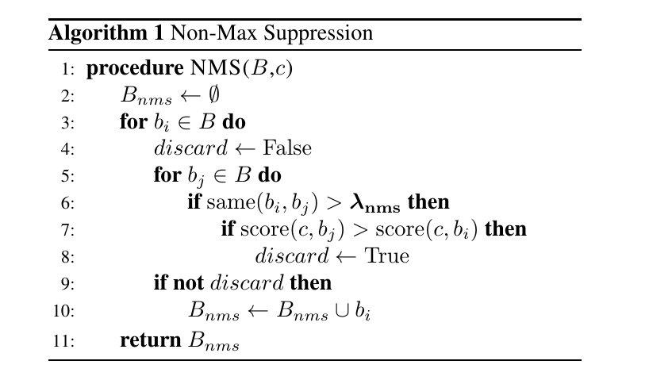

尽管非最大抑制非常简单，但它提供了高效的检测聚类，目标是识别惟一的边界框实例。两个函数 $same(\cdot)$ 和 $score(\cdot)$ 以及用于定义的常量 $\lambda_{nms}$ 定义了这种方法的行为。通常，$same(b_i, b_j) = IoU(b_i, b_j)$ 和 $score(c, b_i) = \Pr(c|b_i)$ ，其中 $b_i, b_j$ 是边界框，$c$ 是相应的类。概念上，$same(\cdot)$ 使用IoU来测试两个边界框是否与相同的真实实例最关联的。同时 $score(\cdot)$ 函数用于选择哪个边界框应当保留，在这种情况下，为具有最大置信度的当前类。最近的工作提出了降低相关的检测分数，而不是丢弃检测[1]，直接从数据[8][9]学习NMS函数。

相比之下，我们研究对 $score(\cdot)$ 和 $same(\cdot)$ 函数的修改，而不是改变整体的NMS算法。利用 Fitness NMS，我们修改 $score(\cdot)$ 函数为更好地选择边界框，其最大化与ground-truth之间的估计IoU，并利用Bounded IoU Loss，我们修改输入到 $same(\cdot)$ 的训练以提供紧凑的聚类。根据这些新特性，我们提供了RoI聚类和输入图像大小的分析。

# 2. Experimental Setup
## 2.1. Operating Parameters and Definitions
这里我们介绍一些重要的参数和定义，在整个论文中使用：
- **Sampling Region-of-Interest(RoI):** 分类之前的边界。仅适用于两阶段检测器（例如R-CNN 变体等）。
- **Intersection-over-Union（IoU）:** 连个边界框交集的面积除以两个边界框并集的面积。
- **Matching IoU（$\Omega$）:** 表示模型生成的边界框与groundtruth边界框之间的必要IoU重叠，然后认为它们是相同的检测。较高的匹配IoU表明对精细对象定位的需求增加。通常的，有两个匹配的 IoU，一个在训练期间（$\Omega_{train}$）使用，一个在测试期间（$\Omega_{test}$）使用。训练匹配 IoU （$\Omega_{train}$） 用于构建采样RoI的目标概率分布，例如在DeNet中，给定ground-truth实例 $(c_t, b_t)$ ，如果 $\mbox{IoU} \ge \Omega_{train}$ ，则 $\Pr(c_t|b_s)=1$ 。对于PASCAL VOC， $\Omega_{test} = 0.5$ ，而MSCOCO考虑一个范围 $\Omega_{test} \in [0.5, 0.95]$ 。
- **Clustering IoU（$\lambda_{nms}$）:** 表示通过Non Max Suppression移除一个边界框之前，两个边界框之间需要的 IoU ，例如如果 $\mbox{IoU}(b_0, b_1) > \lambda_{nms}$ 和 $\Pr(c|b_0) > \Pr(c|b_1)$ ，则检测器移除 $hit(c, b_1)$ 。在DeNet模型中，默认值为 $\lambda_{nms} = 0.5$ ，然而，我们在一些如图所示中改变这个因子。

## 2.2. Datasets， Training and Testing
对于验证实验，我们结合PASCAL VOC2007 $trainval$ 和 VOC 2012 $trainval$ 数据集来组成训练数据，并在PASCAL VOC 2007 $test$ 上测试。对于测试，我们在MSCOCO $trainval$ 上训练，并使用 $test-dev$ 数据集验证。遵循DeNet和SSD，所有的计时结果提供了一个Nvidia TITAN X (Maxwell) GPU cuDNN v5.1和批量大小为8。此外，除非其他说明，使用与DeNet论文[19]中相同的学习调度、超参数、增强方法等。

# 3. Fitness Non-Max Suppression
在表1和表2中，我们提供了DeNet-34 (skip)[19]模型的mAP，该模型使用各种匹配的IoU进行训练(保持所有其他变量不变)。我们观察到，增加训练匹配IoU可以在较大的测试匹配IoU的情况下显著提高MAP，而代价是有较低的匹配IoU。我们特别注意到，通过选择测试匹配IoU范围中心附近的训练匹配IoU, MSCOCO的MAP@[0.5:0.95]提高了1.2%。这些结果证明了许多检测方法中的一个问题，即当 $\Omega_{train} = \Omega_{test}$ 时，它们仅在单一的匹配IoU上运行。当我想要检测器提供最佳可用的边界框，而不仅仅是一个充分（sufficient）的边界框时，这个属性提出了问题，即我们想要选择最大化IoU的边界框，而不仅是满足 $\mbox{IoU} > \Omega_{test}$ 。在接下来的工作中，我们假设这个问题源于应用的实例估计方法，即作用于类概率的非最大抑制。

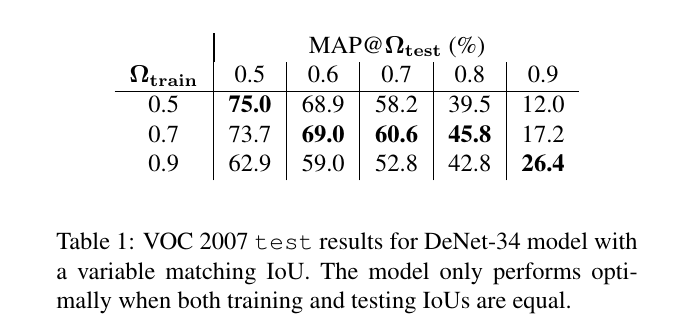

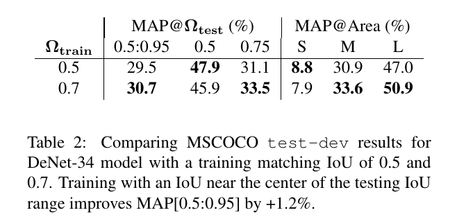

## 3.2. Detection Clustering
为了指明边界框 $b_j$ 的得分，许多检测模型（包括DeNet）应用：
$$score(c,b_j) = \Pr(c|b_j) \tag 1$$
其中 $\Pr(c|b_j)$  提供实例 $(c,b_j)$ 位于图像groundtruth赋值范围的概率。实践中，训练分布 $\Pr(c|b_j)$来指示groundtruth实例 $(c,b_t)$ 是否有重叠满足 $\mbox{IoU} > \Omega_{train}$ 。遵循类估计，应用NMS算法到 边界框 $b$ 上的 $score(c,b)$ 以是被最可能的唯一实例候选集合（见算法1）。在通常的生产场景中，聚类 IoU $\lambda_{nms}$ 手工优化以获得验证集中预定义数量的输出检测中的最大召回率。在这种背景下，NMS算法的目标是减少输出检测数量（通过去重）的同时最大化期望匹配IoU（单一或范围内）的召回率。

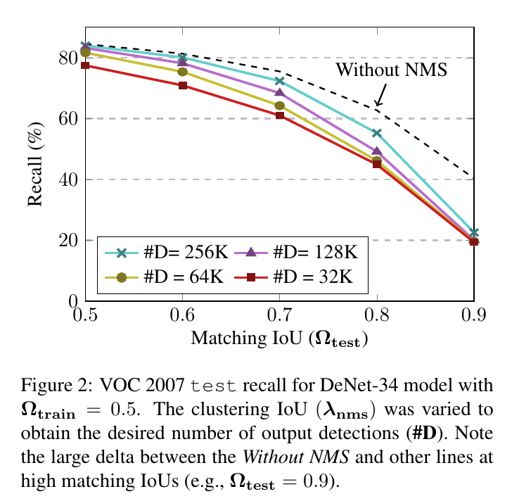

在图2中，我们展示具有 DeNet-34（skip）模型的标准NMS算法在不同聚类 IoU （$\lambda_{nms}$） 和匹配 IoU（$\Omega_{test}$） 下的性能。注意，_Without NMS_ 的线表示召回率的上界并有数量级更多的检测，即大约2.5M。我们观察到，当 $\Omega_{train} = \Omega_{test} = 0.5$ 时，这种方法执行得很好，随着检测的加入，很快收敛到 $Without NMS$ 线，例如在 _Without NMS_ 和32K检测之间有大约7%的召回率差距。然而，随着更多的定位精度 $\Omega{test} \gg 0.5$ 性能恶化和收敛缓慢检测。特别是，我们注意到，当测试通过NMS算法剔除时，$\Omega{test} = 0.9$ 的召回率从接近40％，下降到不到20％。高匹配IoU下 _Without NMS_ 线和其他结果之间的差距表明正确的边界框在RoI预测期间识别，然而，NMS算法会快速丢弃它们。

这些结果认为将NMS朴素地应用到当前的检测模型对于高定位准确率来说是次优的。我们认为这种现象部分源于DeNet魔心使用单个匹配 IoU训练的事实，即训练期间，如果采样边界框 $b_s$ 与ground-truth实例 $(c_t, b_t)$ 之间的重叠 $\mbox{IoU}(b_s, b_t) \ge 0.5$，那么 $\Pr(c=c_t|b_s)=1$ 。这使得类分布很难区分好IoU还是坏IoU的边界框，因为无论IoU是0.5还是0.9，它都被训练为等于1等等。

## 3.3. Novel Fitness NMS Method
为了处理上一节描述的问题，我们提出使用额外的期望 $fitness$ 项来增强公式1：
$$score(c,b_i) = \Pr(c|b_j)E[f_j|c] \tag 2$$
其中，在本文中， $f_j$ 称为 $fitness$ ，它是表示边界框 $b_j$ 和任意重叠的ground-truth实例之间的 IoU 的随机变量，$E[f_j|c]$ 为给定类 $c$ 时，$f_j$ 的期望值。使用这个公式， 在聚类算法中，具有较大IoU估计重叠和类概率的边界框将得到优先考虑。

在我们的实现中，适应度 $f_j$ 可以取 $F$ 值(本文 $F=5$ )，通过如下映射:
$$\rho_j = \max_{b\in B_T} \mbox{IoU}(b_j, b) \tag 3$$
$$f_j =\lfloor F(2\rho_j - 1)\rfloor \tag 4$$
其中 $0 \le \rho_j \le 1$ 为 $b_j$ 与groundtruth边界框 $B_T$ 之间的最大IoU重叠。如果 $\rho_j$ 小于0.5，边界框 $b_j$ 分配没有关联 $fitness$ 的 $null$ 类。根据这些定义，期望值为：
$$E[f_j|c] = \sum_{n=0}^{n<F} \lambda_n \Pr(f_j=n|c) \tag 5$$
其中 $\lambda_n = \frac{1}{2} + \frac{n}{2F}$ 为与 $f_j=n$ 的 $fitness$ 相关的最小IoU重叠。从监督的训练数据中估计 $\Pr(f_j|c)$ 时，我们研究两种变体：  
- **Independent Fitness （$I_F$）：** 模型 $\Pr(c|b_j)$ 和 $\Pr(f_j|c)$ 相互独立，并且假设 $fitness$ 与类独立，即 $\Pr(f_j|c) = \Pr(f_j)$ 。对于训练，我们将预训练的DeNet模型的最后一层替换为估计 $\Pr(f_j|b_j)$ 和 $\Pr(c|b_j)$ 的层，两者通过单独的交叉熵损失联合优化。这种方法需要一个额外的超参数，$fitness$ 的权重设置为0.1 。使用这种方法，模型为每个RoI产生 $|C| + |F| + 2$ 个输出。  
- **Joint Fitness（$J_F$）:** 使用 $\Pr(c,f_j|b_j)$ 联合估计 $fitness$ 和 类，并应用如下识别：
$$score(c, b_j) = \sum_{n=0}^{n<F}\lambda_n \Pr(c, f_j=n|b_j) \tag 6$$
对于训练，我们将预训练的DeNet模型的最后层替换为联合估计的 $\Pr(c, f_j|b_j)$ 层而不是估计 $\Pr(c|b_j)$ 。请注意，softmax在class和fitness上都是标准化的。训练不需要额外的超参数，并且使用原始层相同的成本权重。由于 $null$ 没用关联的 $fitness$ ，所以该方法要求每个RoI有 $|C||F| + 1$ 个模型输出。  

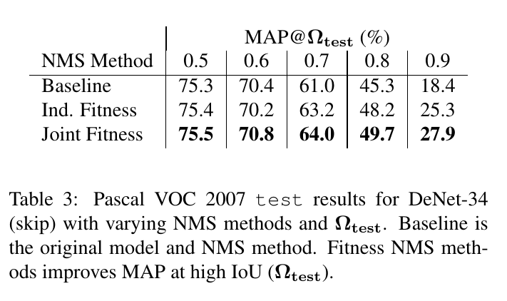

在表3中，我们比较了在一系列匹配的IoU（$\Omega_{test}$）上使用新的Fitness NMS方法增加的DeNet-34（skip）模型在的Pascal VOC 2007 test上的MAP。基线模型从头已训练模型上重新训练使得所有变体经过相同数量的训练epoch 。

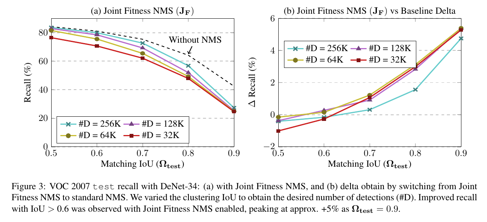

Joint Fitness NMS方法在高匹配IoU上显示出明显的领先优势，低匹配IoU没有可观察到的损失。图3中，我们提供了Joint Fitness NMS方法的召回率，以及Joint Fitness NMS和相同模型基线之间召回率差距。这些结果直接证明了通过Fitness NMS方法在精细定位精度下获得的各种操作点的召回率得到改善，粗定位损失可忽略不计。

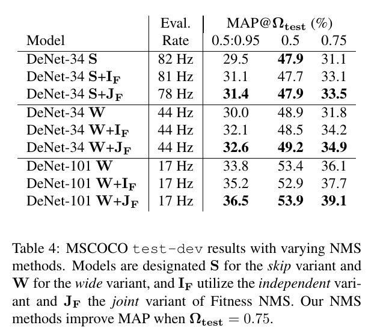

表4中，我们提供了使用Fitness NMS方法增强的DeNet-34（skip）、DeNet-34（wide）和DeNet-101（wide）模型在MSCOCO $test-dev$上测结果。Independent Fitness方法在 $\Omega_{test}=0.5$时，有微弱的精度损失，以及在$\Omega_{test}=0.75$上有显著的提高。 然而，Joint Fitness NMS方法在 $\Omega_{test}=0.5$上没有可测量的损失，并在 $\Omega_{test}=0.75$时提供了更大的改进。特别是，这些方法为大型对象提供了明显的改进，大型对象很可能具有许多相关的采样RoI。DeNet-101模型从$independent$到$joint$产生较大的改进，这表明它提供的增加的建模能力可以更好地与$joint$方法一起使用。总体而言，两种Fitness NMS方法对 MAP@[0.5：0.95]的显着改善在1.9-2.7％之间。

由于最终softmax中值的增加（401对81），观察到Joint Fitness NMS的评估率略有下降。将 $joint$ 变体应用到一阶段检测器将可能产生更大的评估率惩罚，这是由于在当前的设计更多数量的softmax（每个候选RoI一个）。这些应用中，$independent$ 变体可能是更好的替代。

### 3.3.1 Applying Soft-NMS
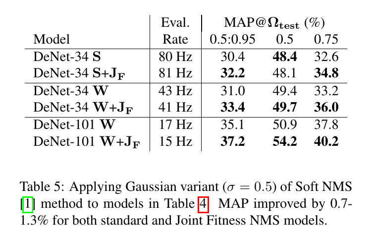

表5中，我们展示Fitness NMS方法可以与SoftNMS方法并行使用。我们的结果表明，对于使用标准和Fitness NMS方法的模型，MAP在0.7和1.3％之间有所改善。这突出表明Soft NMS和Fitness NMS方法解决了切向问题。注意，本文的后续模型没有使用SoftNMS。

# 4. Bounding Box Regression
本节中，检测模型中边界框回归的角色。然后，我们基于一组上界得出新的边界框回归损失，其更好地匹配最大化IoU的目标，同时保持梯度下降优化器的良好收敛性质（平滑性，鲁棒性等）。

## 4.1. Same-Instance Classification
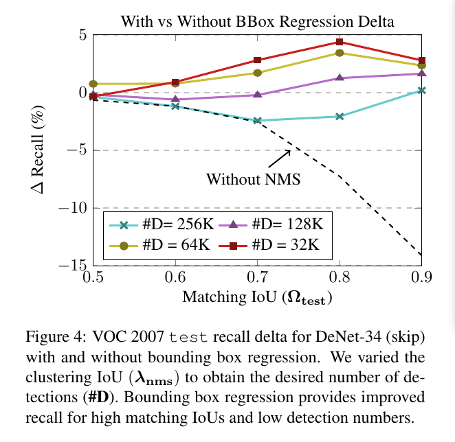

自从在R-CNN中引入后，边界框回归为许多两阶段和一阶段方法提供了改进的定位。通过边界框回归，每个RoI能够识别更新的边界框，该边界框更好地匹配最近的groundtruth实例。与R-CNN衍生方法相比，由于DeNet中采样RoI的准确性提高，因此自然会假设对边界框回归的需求减少。然而，我们在图4中证明了相反的情况，图4提供了使用和不启用边界框回归的图2中的模型获得的召回变化。我们观察到对于大多数数据点启用了边界框回归的提高的召回率，除了在高匹配IoU下没有NMS和256K线。这些结果表明，RoI可以提高召回率，然而，因为应用NMS（其他线），回归边界框执行更好。此外，这些结果表明，在典型操作条件下（红线和黄线），边界框回归在DeNet模型中仍然很重要。

我们提出通过边界框回归得到的改进的召回率使得DeNet模型主要不是由于改进了各个边界框的位置和尺寸，而是由于它与NMS算法的相互作用。即，为了测试两个RoI$(b_0,b_1)$是否与相同实例最好的关联，那么我们检查是否有 $\mbox{IoU}(\beta_0,\beta_1) > \lambda_{nms}$ ，其中$(\beta_0,\beta_1)$是关联的更新边界框（在边界框回归之后）。因此，如果 $b_0$ 和 $b_1$ 共享相关的最近邻groundtruth实例，则它们更有可能满足与启用的边界框回归的比较。因此，边界框回归对于估计杂乱场景中的唯一实例尤其重要，其中采样RoI可以轻松地重叠多个真实实例。

## 4.2. Bounded IoU Loss
这里，我们提出一种新的边界框损失，并将其与目前R-CNN中使用的损失比较。这种新的损失旨在最大化RoI和关联groundtruth边界框之间的IoU重叠，同时为梯度下降优化提供良好的收敛属性。

给定R-CNN公式中常用的采样RoI $b_s = (x_s, y_s, w_s, h_s)$ 、关联groundtruth目标 $b_t = (x_t, y_t, w_t, h_t)$ 和估计边界框 $\beta=(x,y,w,h)$，有如下的成本函数：
$$
\begin{alignat}{2}
\mbox{Cost}_x &= L_1(\frac{\Delta x}{w_S}) \tag 7 \\
\mbox{Cost}_w &= L_1(\ln(\frac{w}{w_t})) \tag 8
\end{alignat}
$$ 
其中 $\Delta x = x - x_t$ ，$L_1(z)$ 为Huber Loss（也称之为smooth L1损失）。请注意，为简洁起见，我们将此分析限制在X位置和宽度，Y位置和高度方程可以用适当的替换来识别。Huber损失定义为：
$$
L_{\tau}(z) = 
\begin{cases}
\frac{1}{2} z^2  & |z| < \tau \\
\tau |z| - \frac{1}{2} \tau^2 & \mbox{otherwise}
\end{cases} \tag 9
$$
理想地，我们训练边界框回归以直接最小化IoU，例如$\mbox{Cost}=L_1(1 - \mbox{IoU}(b, b_t))$ ，然而，由于高度非线性、多自由度和IoU函数中零梯度的多个区域的存在，CNN难以最小化这个损失。作为替代，我们考虑一组成本函数，定义为：
$$\mbox{Cost}_i = 2 L_1(1 - \mbox{IoU}_B(i, b_t)) \tag{10}$$
其中 $\mbox{IoU}(b,b_t)\le \mbox{IoU}_B(i,b_t)$为具有自由参数 $i\in\{x,y,w,h\}$的IoU函数的上界。我们通过考虑无约束自由参数可达到的最大IoU来构造上界，例如当 $y=y_t$、$w=w_t$以及$h=h_t$时，$\mbox{IoU}_B(x,b_t)$ 提供了IoU作为 $x$ 的函数。我们获得如下的IoU函数的边界：
$$
\begin{alignat}{2}
\mbox{IoU}_B(x,b_t) &= \max(0, \frac{w_t - 2|\Delta x|}{w_t + 2|\Delta x|})  \tag{11} \\
\mbox{IoU}_B(w,b_t) &= \min(\frac{w}{w_t}, \frac{w_t}{w}) \tag{12}
\end{alignat}
$$

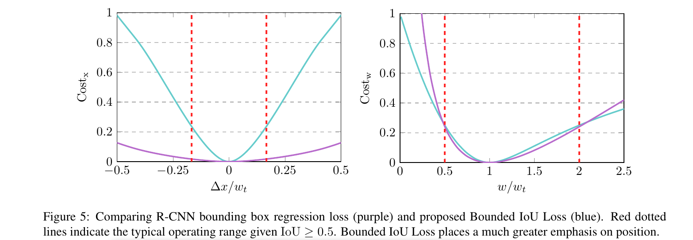

表5中，我们比较了原始R-CNN成本函数和所提出的Bounded IoU Loss。由于边界框回归仅应用到边界框，其有 $\mbox{IoU}(b_s,b_t) \ge 0.5$，一下限制适用：
$$
\begin{alignat}{2}
\frac{|x_s - x_t|}{w_t} &\le \frac{1}{6} \tag{13} \\
\frac{1}{2} \le \frac{w_s}{w_t} &\le 2 \tag{14}
\end{alignat}
$$
注意，这些限制可以通过应用上述推导的位置和尺度边界获得，并且$\mbox{IoU}_B \ge \mbox{IoU} \ge 0.5 \Longrightarrow\mbox{IoU}_B \ge 0.5$ 。假设估计的边界框 $\beta$ 有比采样边界框 $b_s$ 根号的IoU，我们在图5中给出了这些上界。我们观察到所提出的边界框成本函数与原始算法的成本函数有相同的形状，然而，所提出的位置成本函有不同的形状，并且在操作范围有明显更大的跨越。此外，位置成本在敏感性上是鲁棒的，即当 $|\Delta x| \rightarrow \infty$ 时，成本接近常量，而不是如原始成本那样发散，这可能证明较大位置差的应用的优势。这种分析认为利用最大化IoU的宗旨，应该更加强调位置，而不是原始R-CNN成本所暗示的。虽然未在本文中进行测试，但我们注意到R-CNN位置成本可以更改为 $\mbox{Cost}_x = 15 L_{0.16}(\Delta x/ w_s)$，以在定义的工作范围内获得非常相似的形状。

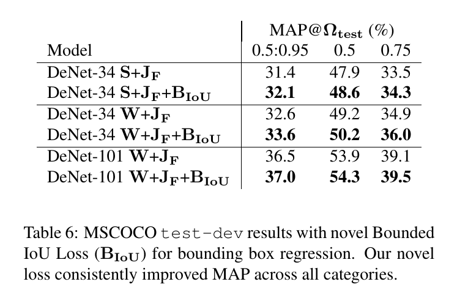

表6中，我们强调具有Bounded IoU Loss（$B_{IoU}$）的DeNet模型的性能。除了将边界框回归成本因子从1.0变为0.125，该模型都使用与Joint Fitness 模型相同的训练。通过将几次迭代后的边界框回归训练损失的大小与先前获得的值（未使用参数搜索）相匹配来确定该值。我们观察到所有模型（尤其是DeNet-34变体）的不同匹配阈值（$\Omega_{test}$）的持续改进。

# 5. RoI Clustering
wide variant DeNet模型生成一个 $128 \times 128$ 空间分辨率的角分布，产生67M个候选边界框[19]。为了适应越来越多的候选，原始DeNet模型将RoI的数量从576增加到2304，从而对评估率产生显着的不利影响，例如，相对原始模型，DeNet-34（wide）观察到评估率降低近50％。为了改善这个问题，我们研究两种简单而快速的聚类方法，一个是在角分布上应用NMS，另一个是将NMS应用到输出边界框。在角NMS方法中，当识别到类型 $k$ 在位置 $(x,y)$ 的角时，即 $\Pr(s|k,y,x) > \lambda_C$，算法检查在局部区域 $(2m+1) \times (2m+1)$ 是否有最大概率。

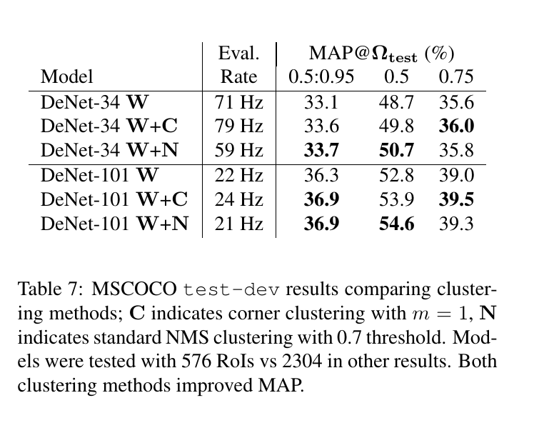

表7中，针对DeNet wide 模型，我们比较了角聚类方法、标准的NMS方法（0.7的阈值）和RoI数量减小到576时没有聚类。结果表明，由于所需的RoI分类数量减少，评估率提高了30％至80％。我们发现两种聚类方法在没有聚类的情况下得到了改进，并获得了非常相似的MAP@[0.5：0.95]结果，但是，由于CPU负载增加，标准NMS方法略微变慢。相对于NMS方法，角聚类方法在高匹配IoU时表现稍好，而在低匹配IoU时表现更差。

# 6. Input Image Scaling
到目前为止，我们的模型已经在低输入图像尺寸下进行了演示，即将最大输入尺寸重新调整为512像素。相比之下，现有技术的检测器通常使用输入图像，其中最小边调整为600或800像素。这种较小的输入图像为我们的模型提供了改进的评估率，但是以对象定位精度为代价。 在下文中，我们放宽了对评估率的约束，以证明当计算资源受到较少约束时的定位精度。

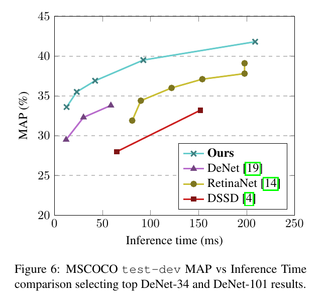

