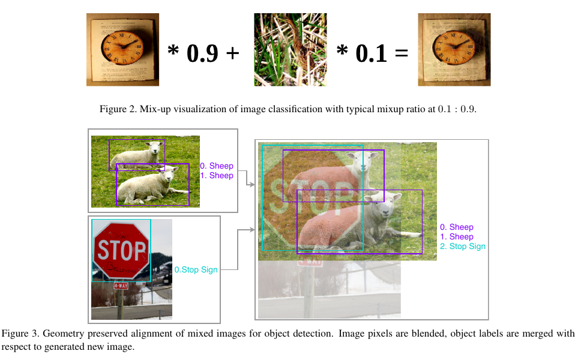
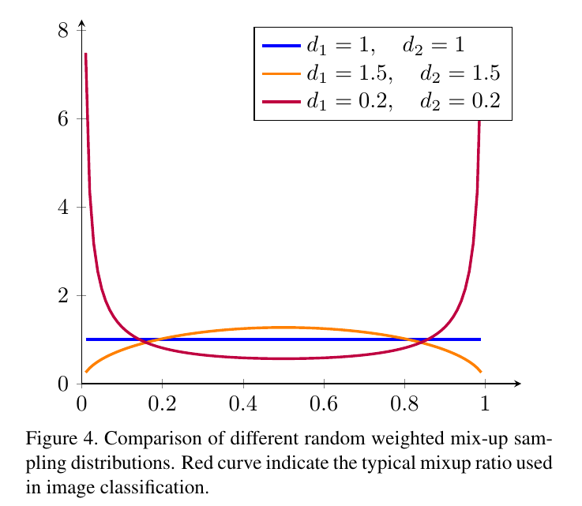
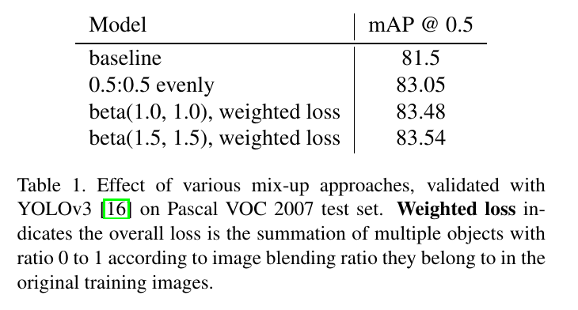
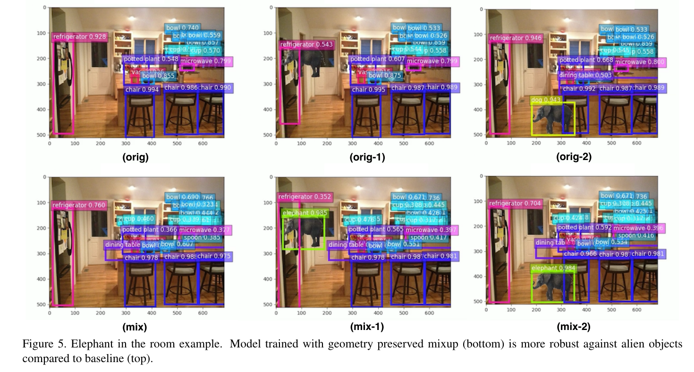
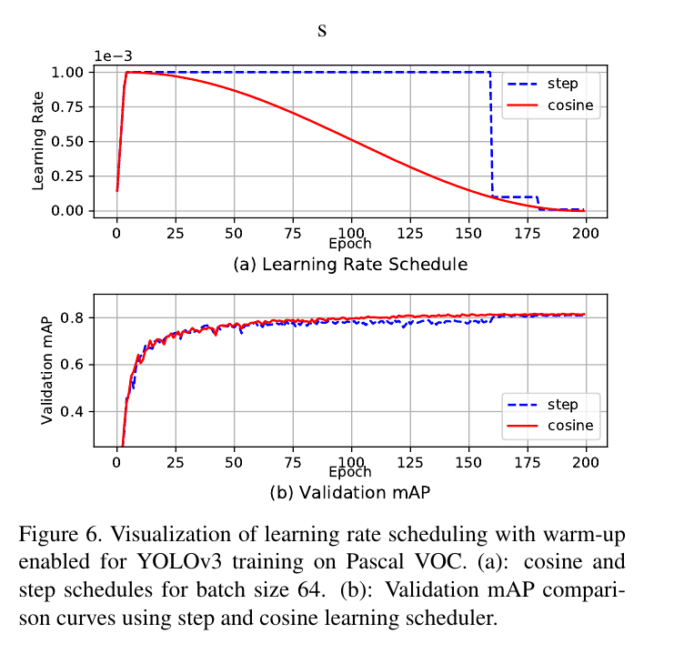
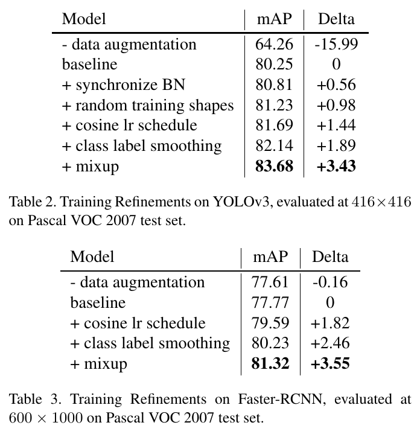
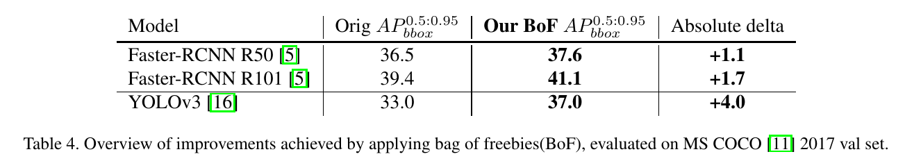
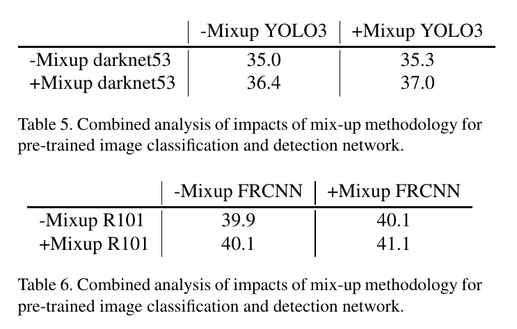

Bag of Freebies for Training Object Detection Neural Networks
=

# 1. Introduction
对象检测无疑是计算机视觉领域最前沿的应用之一，吸引了各个领域的研究人员的关注。最近的历史最佳检测器，包括单（SSD和YOLO）或多阶段的RCNN类神经网络，都是基于图像分类骨干网络，例如VGG、ResNet、Inception和MobileNet系列。

然而，由于相对较高的模型容量和训练复杂度，对象检测吸引了较少的注意力，并且从最近的训练调整研究中获益较少。更糟糕的是，不同的检测网络正在挑选自己的训练管道而没有明确的初始化、数据预处理和优化分析，导致采用最新技术的大量混乱被证明可以解除图像分类任务。

本文中，我们专注于探索有效的方法，可以提高流行的对象检测网络的性能，而不会带来额外的计算成本。我们首先探索对象检测的mixup技术。不同于[23]，我们认识到有利于空间保持变换的多目标检测任务的特殊性质，因此提出了一种用于目标检测任务的视觉上连贯的图像混合方法。其次，我们探索详细的训练管道，包括学习率策略、权重衰减和异步 BatchNorm 。接着，我们通过逐步堆叠它们来训练单个和多个阶段的对象检测网络来调查我们的训练调整的有效性。

我们主要贡献可以总结如下：  
1） 我们是第一个系统地评估各种训练启发式在不同对象检测管道中应用的方法，为今后的研究提供了有价值的实践指导。  
2） 我们提出了一种用于训练对象检测网络的视觉连贯图像混合方法，该方法被证明在提高模型泛化能力方面非常有效。  
3） 在不改变网络结构和损失函数的情况下，我们在基于现有模型的30％绝对平均精度改进中实现了高达5％的成功率。 我们成就是免费的，没有额外的推理费用。  
4） 我们扩展了对象检测数据增强领域的研究深度，显着增强了模型泛化能力，有助于减少过度拟合问题。实验还揭示了可以在不同网络结构中一致地提高对象检测性能的良好技术。

# 2. Related Work
在本节中，我们将简要讨论有关图像分类和启发式对象检测技巧的相关工作。

## 2.1. Scattering tricks from Image Classification
图像分类是所有计算机视觉任务的基础。与流行的物体检测和语义分割模型相比，分类模型便宜，因此吸引了大量研究人员来进行原型设计。在本节中，我们简要介绍此前开展这项工作的工作。学习率热身启发式[6]被引入以克服极大的小批量大小的负面影响。有趣的是，尽管在典型的对象检测训练中使用的小批量大小远不及图像分类中的尺度（例如10k或30k [6]），但是大量的锚尺寸（高达30k）有效地有助于批量尺寸。逐步升温启发式对于YOLOv3 [16]至关重要，就像在我们的实验中一样。有一系列方法试图解决深度神经网络的脆弱性。[21]中引入了label smoothing，其修改了交叉熵损失中 hard ground truth 标签。Zhang等人[23]提出mixup来减轻对抗性扰动。学习率降低的余弦退火策略在[13]中提出，以响应传统的步骤策略。He等人通过探索一些技巧，在训练准确性方面取得了显着的进步[8]。在这项工作中，我们深入研究了在对象检测的背景下由图像分类引入的启发式技术。

## 2.2. Deep Object Detection Pipelines
大多数最先进的基于深度神经网络的物体检测模型分别来自多阶段和单阶段管道，分别从R-CNN [4]和YOLO [15]开始。在单阶段管道中，预测由单个卷积网络生成，因此保留空间对齐（除了YOLO在末尾使用完全连接的层）。然而，在多阶段管道中，例如Fast R-CNN和Faster R-CNN，最终预测是根据在特定兴趣区域（RoI）中采样和汇集的特征生成的。RoIs通过神经网络或确定性算法（例如选择性搜索[22]）传播。这种主要差异导致数据处理和网络优化的显着差异。例如，由于单阶段管道缺乏空间变化，空间数据增强对于SSD[12]中证明的性能至关重要。由于缺乏探索，许多训练细节是一个系列独有的。在这项工作中，我们系统地探索可能有助于提高两个管道性能的互利调整和技巧。

# 3. Technique Details
在本节中，我们提出了一种用于对象检测的视觉连贯图像混合方法，并引入了数据处理和训练调度器，用于系统地改善物体探测器的模型性能。

## 3.1. Visually Coherent Image Mixup for Object Detection
由Zhang等人[23]介绍的混合物被证明在减轻分类网络中的对抗性扰动方面是成功的。Zhang等人[23]所提出的混合比例的分布服从（$a=0.2, b=0.2$）beta分布。大多数混淆都是这种beta分布几乎没有噪音。受Rosenfeld等人[18]中的启发式实验的启发，我们关注的是在对象检测中发挥重要作用的自然共现物体呈现。半对抗物体斑块移植方法不是传统的攻击方式。通过应用更复杂的空间变换，我们引入了自然图像呈现中常见的遮挡、空间信号扰动。

在我们的经验实验中，继续增加混合中使用的混合比率，结果帧中的对象更加生动和与自然呈现一致，类似于低FPS电影中通常的过渡帧。图像分类和这种高比例混合的视觉比较分别如图2和图3所示。特别地，我们使用几何保留对齐来进行图像混合，以避免在初始步骤中扭曲图像。我们还选择具有更多视觉相干比率 $a \ge 1$ 且 $b \ge 1$ 的beta分布，而不是遵循图像分类中的相同实践，如图4所示。

我们还使用Pascal VOC数据集上的YOLOv3网络进行实验性测试经验混合比分布。表1显示了采用检测混合的实际改进。$\alpha$ 和 $\beta$ 都等于 1.5 的beta分布比都等于1.0和固定比例混合的模型略好。

为了验证视觉连贯混合的有效性，我们通过室内房间图像滑动大象图像patch，进行了“Elephant in the room”[18]的相同实验。我们在COCO 2017数据集上使用相同的设置（除了模型混合是使用我们的mixup方法）训练两个 YOLOv3模型。我们在图5中描述了一些惊人的发现。

## 3.2. Classification Head Label Smoothing
对于每个对象，检测网络通常使用softmax函数计算所有类的概率分布：

$$p_i = \frac{e^{z_i}}{\sum_j e^{z_j}} \tag 1$$

其中， $z_i$ 是直接来自用于分类预测最后的线性层的非规范 logits 。对于训练时的对象检测，我们只通过将输出分布 $p$ 与ground truth分布$q$与交叉熵进行比较来修改分类损失

$$L = \sum_i q_i \log p_i  \tag 2$$

$q$ 通常是one-hot分布，其中正确类的概率为1，而所有其他类的概率为 0 。然而，Softmax函数当 $z_i \gg z_j， \forall j \ne i$ 时，才会接近这个分布，但是永远不会达到这个分布。这鼓励模型对其预测过于自信并且容易过度拟合。

Label smoothing 由 Szegedy等[21]提出作为一种正则化形式。我们使用下式平滑ground truth分布：

$$q_i' = (1-\epsilon)q_i + \frac{\epsilon}{K} \tag 3$$

其中 $K$ 为类的总数，$\epsilon$ 为很小的常量。这种技术通过最大和最小logits之间的差异来衡量，减小模型的信心。

在Sigmoid输出为0到1.0的情况下，如YOLOv3 [16]，通过校正目标范围的上限和下限，标签平滑甚至更简单，如公式3所示。

## 3.3. Data Pre-processing
与图像分类领域不同，其网络对图像几何变换非常宽容。实际上鼓励这样做以提高泛化准确性。然而，对于对象检测图像的预处理，我们需要谨慎行事，因为检测网络对此类转换更为敏感。

我们通过实验回顾了以下数据增强方法：
- 随机集合变换。包括随机裁剪（具有限制）、随机扩张、随机水平翻转和随机调整（使用随机插值）。
- 随机颜色扰动，包括亮度、hue、饱和度和对比度。

就检测网络的类型而言，存在用于生成最终预测的两个管道。第一个是单阶段检测器网络，其中最终输出有特征图的每个单一像素生成，例如SSD和YOLO网络产生与输入图像的空间形状成比例的检测结果。第二个是基于多阶段提议和采样的方法，遵循Fast-RCNN，生成大量ROI候选并以固定数量采样，通过在特征图上重复裁剪相应区域来产生检测结果，并且预测数量与固定采样数成比例。由于基于采样的方法在特征图上重复巨大的裁剪操作，因此它取代了随机裁剪输入图像的操作，因此这些网络不需要在训练阶段应用广泛的几何增强。

## 3.4. Training Scheduler Revamping
在训练期间，学习率通常从相对较大的数字开始，并在整个训练过程中逐渐变小。例如，步骤安排是最广泛使用的学习率安排。使用步骤调度，在达到预定义的时期或迭代之后，将学习速率乘以低于1的常数。例如，Faster-RCNN的默认学习安排为，在60k迭代是乘以比例0.1 。相似地，YOLOv3使用相同的比例0.1在40k和45k迭代时减小学习率。步调度器具有明显的学习速率转换，这可能导致优化器在接下来的几次迭代中重新稳定学习动量。相比之下，Loshchilov等[13]提出了更平滑的余弦学习率调整。余弦调度根据0到pi的余弦函数的值来缩放学习率。
它以缓慢降低大学习率开始，然后快速降低学习速度，最后以微小的斜率结束，降低小学习率直到达到 0 。

热身学习率是在初始训练迭代期间避免梯度爆炸的另一种常用策略。Warm-up学习率对几种对象检测算法至关重要，例如YOLO v3， 在最初的迭代中，其具有来自负例的主导梯度，其中sigmoid分类得分被初始化为约0.5并且对于多数预测而偏向 0 。

使用余弦调度和适当预热的训练导致更好的验证准确性，如图6所示，通过应用余弦学习速率衰减实现的验证mAP在训练中始终优于步进学习速率调度。由于学习速率调整的频率较高，因此逐级衰减的平台现象也较少，验证性能会暂停一段时间，直到学习率降低。

## 3.5. Synchronized Batch Normalization
近年来，大量的计算要求迫使训练环境装备多个设备（通常是GPU）以加速训练。尽管在训练期间响应较大的批量大小处理不同的超参数，但由于实现细节，批量标准化[10]引起了多设备用户的注意。尽管在多个设备（GPU）上工作的批量标准化的典型实现很快（没有通信开销），但它不可避免地减小了批量大小并在计算期间导致略微不同的统计信息，这可能降低性能。这在ImageNet分类等标准视觉任务中并不是一个重要问题（因为每个设备的批量大小通常足以获得良好的统计数据）。然而，在某些任务中，批量大小通常非常小（例如，每个GPU 1个）会损害性能。最近，Peng等人用Pen等人[14]的分析证明了对象检测中同步批量标准化的重要性。在这项工作中，我们回顾了同步批量标准化与YOLOv3 [16]的重要性，以评估相对较小的批量大小对每个GPU的影响，因为训练图像形状明显大于图像分类任务。

## 3.6. Random shapes training for single-stage object detection networks
自然训练图像是具有多种形状的。为了适应内存限制以及运行更简单的批，许多单阶段对象检测网络使用固定形状训练。为了降低过拟合风险，并提高网络预测的泛化能力，我们遵循Redom等人[16]提出的随机形状训练方法。具体而言，大小为 $N$ 的mini-batch被调整为 $N \times 3 \times H \times W$ ，其中 $H$ 和 $W$ 是公约数 $D = randint(1, k)$ 的倍数。例如，我们在训练 YOLOv3时，使用 $H = W \in {320, 352, 384, 416, 480, 512, 544, 576, 608}$ 。

# 4. Experiments
为了比较对象检测的所有调整的增量改进，我们分别使用YOLOv3 [16]和Faster-RCNN [17]作为单级和多级管道的代表。为了适应大规模的训练任务，我们使用Pascal VOC [2]进行精细分级技巧评估，使用COCO [11]数据集进行整体性能提升和泛化能力验证。

**Pascal voc** 按照Fast-RCNN [3]和SSD [12]中使用的常用设置，我们使用Pascal VOC 2007 trainval和2012 trainval进行训练，使用2007测试集进行验证。结果以Pascal VOC开发套件[2]中定义的平均精度报告。对于YOLOv3模型，我们始终如一地测量416×416分辨率下的平均精度（mAP）。如果启用随机形状训练，YOLOv3模型将以320×320到608×608的随机分辨率进行增量，增量为32×32，否则它们始终使用固定的416×416输入数据进行训练。更快的RCNN模型采用任意输入分辨率。 为了调节训练记忆消耗，输入图像的短边调整为600像素，同时确保长边小于1000像素。Faster-RCNN模型的训练和验证遵循相同的预处理步骤，除了训练图像有0.5的水平翻转作为附加数据增加的机会。 我们的秘籍（BoF）对YOLOv3和Faster-RCNN的增量评估分别详见表2和表3。

**MS COCO** COCO 2017比Pascal VOC大10倍，与PASCAL VOC相比含有微小物体。 我们使用MS COCO来验证我们在这项工作中的技巧包的概括。我们使用与Pascal VOC类似的训练和验证设置，除了将Faster-RCNN模型调整为800×1300像素以响应较小的对象。 结果如表4所示。

**Impact of mixup on different phases of training detection network** 混合可以应用于对象检测网络的两个阶段：1)使用混合预训练分类网络骨干；2）使用所提出的用于对象检测的视觉连贯图像混合训练检测网络。我们使用基于Darknet 53层的YOLO3 [16]实现和基于表5和表6中的Faster-RCNN [17]的ResNet101 [7]来比较结果。虽然结果证明了通过将混合应用于训练阶段的一致性改进，但值得注意的是，在两个阶段中应用混合可以产生更大的增益，因为 $1 + 1> 2$ 。

