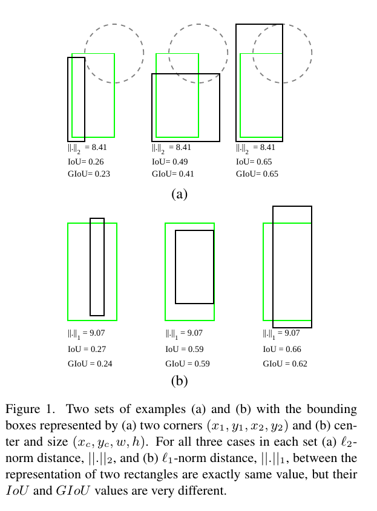
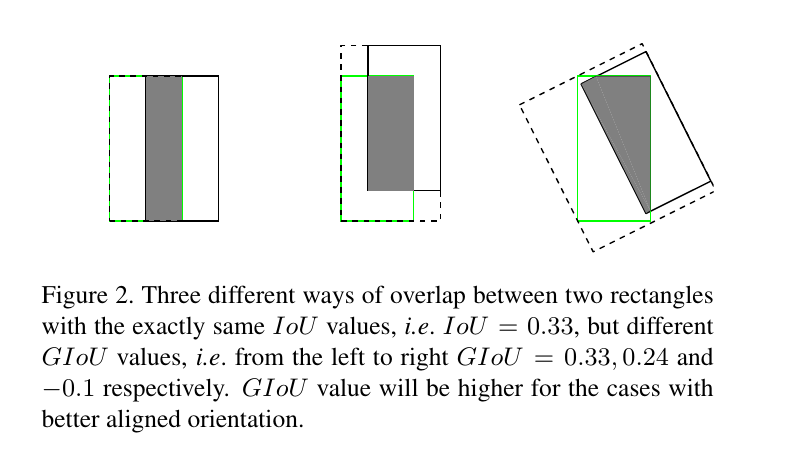
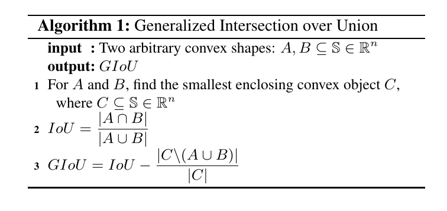
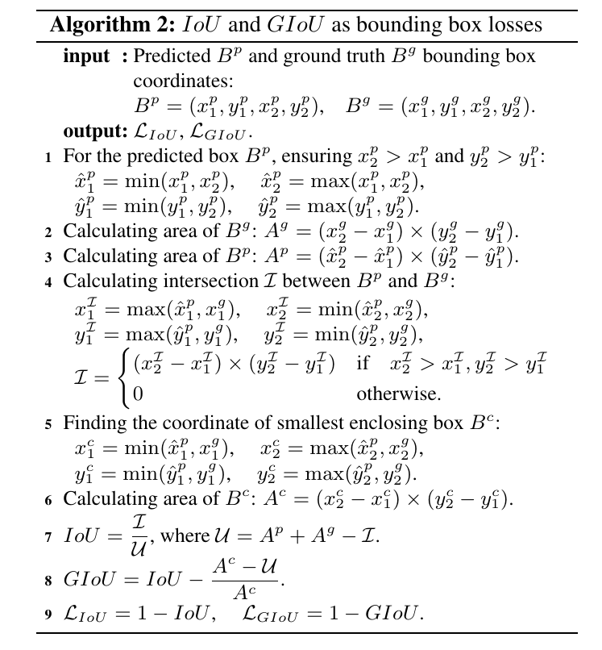
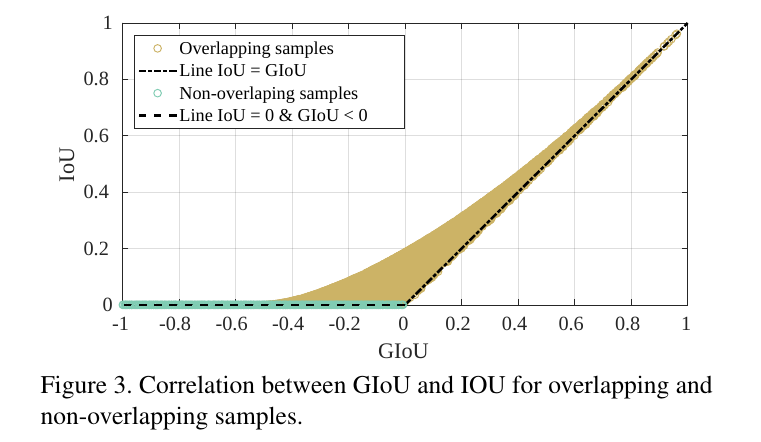

Generalized Intersection over Union: A Metric and A Loss for Bounding Box Regression
=

# Abstract
IoU是对象检测基准中最流行的评估度量。然而，优化常用的回归边界框参数的距离损失和最大化度量值之间存在差距。度量最优的目标是度量自身。在轴对齐的2D边界框中，已被证明IoU可以直接用作回归损失。然而，IoU有一个平台，使得在非重叠边界框的情况下优化是不可行的。本文中，我们通过引入广义版本作为新损失和新指标来解决IoU的弱点。通过将这种通用IoU（GIoU）作为一种损失纳入最先进的对象检测框架，我们使用基于标准、基于IoU和基于GIoU的新的性能度量对流行对象检测基准测试上的性能取得了一致的改进，如PASCAL VOC和MS COCO。

# 1. Introduction
边界框回归是许多2D/3D计算机视觉任务中的最主要的部件之一。如目标定位、多对象检测、对象跟踪和实例级分割等任务依赖准确的边界框回归。利用深度神经网络提高应用性能的主要趋势是提出更好的架构骨干[15,13]或更好的策略来提取可靠的局部特征[6]。然而，一个被广泛忽视的改进机会是取代替代回归损失（例如“l1”和“l2 -norms”为）为基于IoU计算的度量损失。

IoU（也是熟知的Jaccard指数）是比较两个任意形状之间相似度的最常用度量。IoU在比较下将对象的形状属性（如两个边界框的宽、高和位置）编码到区域属性，然后计算一个关注其面积（或体积）的标准度量。由于这种吸引人的特性，用于评估分割[2,1,25,14]、物体检测[14,14]和跟踪[11,10]的所有性能测量依赖于该度量。

然而，可以证明最小化常用的损失（例如 $l_n$-norm）、定义在2D / 3D中两个边界框的参数化表示以及提高其IoU值之间没有强烈的相关性。例如，考虑图1（a）中简单的2D场景，其中预测边界框（黑色矩形）和ground-truth边界框（绿色矩形）由它们的左上角和右下角表示，即$(x_1, y_1, x_2, y_3)$ 。为了简单起见，假设两个边界框的一个角之间的距离（例如 $l_2$-norm）是固定的。因此，因此，任何预测的边界框，其中第二个角位于以绿色矩形的第二个角为中心的固定半径的圆上（由灰色虚线圆圈表示）将具有与地面实况框完全相同的 $l_2$-norm 距离；然而，它们的IoU值可以明显不同（图1（a））。相同的结论可以扩展到任意其他表示和损失，例如图1（b）。直观的是，对于这些类型的目标而言，良好的局部最优可能不一定是IoU的局部最优。此外，与IoU相比，基于前面的参数化表示定义的 $l_n$-norm 对于问题的尺度不是不变的。为此，有几对具有相同重叠水平的边界框，但由于不同的尺度（例如perspective），会有不同的对象值。此外，一些表示可能在用于表示的不同类型的参数之间缺乏正则化。例如，在中心和大小的表示中，$(x_c,y_c)$ 定义在位置（location）空间，而 $(w,h)$ 属于大小（size）空间。随着涉及参数的增多，复杂度也增加。为了缓解上述一些问题，最佳的对象检测器引入锚框的概念作为假设良好的初始猜测。他们还定义了一个非线性表示[19,5]，以朴素地补偿尺度变化。即使有这些手工改变，在优化回归损失和IoU值之间仍然存在差距。

本文中，我们探索两个轴对齐矩形或者通常是两轴对齐的n-orthotope之间的IoU计算，其具有直接的解析解，与普遍的观点相反，在这种情况下，IoU可以反向传播[24]，即它可以直接用作优化的目标函数。因此，优选使用IoU作为2D对象检测任务的目标函数。鉴于优化度量本身与代理损失函数之间的选择，最佳选择是度量本身。然而，IoU作为度量和损失有两个主要问题：（i）如果两个对象没有重叠，IoU值为零，并不会反应出两个形状相互之间的距离。在没有重叠对象的情况下，如果IoU用作损失，它的梯度为零，并且不能优化；（ii）IoU无法正确区分两个对象的不同对齐方式。更准确地，具有相同交集水平的、在几个不同方向重叠的两个对象的IoU恰好是相等的（图2）。因此，IoU函数值没有反应出现的两个对象是如何重叠的。我们将进一步在论文中阐述这个问题。

本文中，我们通过将这个概念扩展到非重叠的情况来处理IoU的两个弱点。我们确保这种推广（a）遵循与IoU相同的定义，即将比较的对象的形状属性编码到区域属性；（b）维持IoU的尺度不变性，以及（c）确保在重叠的情况下，与IoU强烈相关。我们引入IoU的推广版本，称为GIoU，作为比较两个任意非凸形状的新度量。我们也提供了一种计算两个轴对齐矩形之间GIoU的解析解，在这种情况下允许它被用作损失。将GIoU损失纳入最先进的对象检测算法，我们使用标准（即基于IoU的[4,14]）不断提高其在流行对象检测基准测试中的性能，如PASCAL VOC [4]和MS COCO [14]。 ，以及新的基于GIoU的性能度量标准。

本文的主要贡献总结如下：
- 我们引入这种推广版本的IoU作为比较两个任意形状的度量。
- 我们提供一种解析解，用于将GIoU作为两个轴对齐矩形或n-orthotope之间的损失。
- 我们将GIoU纳入最流行的对象检测算法，例如Faster R-CNN、Mask R-CNN 和 YOLO v3，并证明它们在标准的对象检测基准上的性能提升。

# 2. Related Work
**Object detection accuracy measures:** IoU是对象检测中使用的评估度量。它用于确定预测集合中的true positive 和 false positive。当使用IoU作为评估度量时，必须选择准确率阈值。例如，在PASCAL VOC挑战中，广泛报告的检测准确率衡量（即mean Average Precision：mAP）基于固定的IoU阈值（即0.5）计算。然而，IoU阈值的任意选择没有完全反应不同方法的定位性能。任意高于阈值的定位准确率都被公平对待。为了使这种性能测量对IoU阈值的选择不那么敏感，MS COCO基准挑战平均多个IoU阈值的mAP 。

**Bounding box representations and losses:** 在2D对象检测中，学习边界框参数至关重要。文献中提出多种边界框表示和损失。Redmon等人在YOLO v1 [19]中提出了对边界框参数的直接回归，并用一个小的调整来预测边界框大小的平方根，以弥补尺度灵敏度。Girshick等人在R-CNN中通过预测使用选择性搜索算法计算的边界框的位置和大小偏移来参数化边界框表示。为了缓解表示的尺度敏感性，边界框大小的偏移定义在对数空间（log-space）。然后，用 $l_2$-norm（也是熟知的MSE损失）作为目标来优化。后来，在Fast R-CNN中，Girshick提出$l_1$-smooth损失，使其对异常值更具鲁棒性。Ren等人[22]提出使用密集的先验边界框（即anchor），接着是回归边界框位置和大小的微小变化。然而，由于明显的正类和负类之间的不平衡，这使得训练边界框得分更加困难。为了缓解这个问题，作者后来引入focal loss[13]，其与我们文章的主要焦点正交。

多数流行的对象检测器使用上述的边界框表示和损失的某种结合。这些相当大的努力在对象检测方面取得了显着的进步。我们表明，使用GIoU可能有一些机会进一步改进定位，因为它们的边界框回归损失并不直接代表核心评估指标，即IoU。

**Optimizing IoU using an approximate or a surrogate function:** 在语义分割任务中，已经做了一些努力来使用近似函数[18]或替代损失[17]来优化IoU。相似地，对于对象检测任务，最近的工作[8,24]尝试将IoU直接或间接纳入以更好地执行边界框回归。然而，它们在非重叠情况下在优化IoU时存在近似或平台。本文中，我们通过引入推广版本的IoU来处理IoU的弱点，其直接将IoU作为对象检测问题的损失。

# 3. Generalized Intersection over Union
比较两个任意形状（体积）$A，B \subseteq \Bbb{S} \in \Bbb{R}^n$之间相似性的IoU 如下获得：

$$IoU = \frac{|A \cap B|}{|A \cup B|} \tag 1$$

使得这种相似性度量在评估许多2D / 3D计算机视觉任务时很受欢迎的两种吸引人的特点如下所示：
- IoU作为距离（例如 $L_{IoU} = 1 - IoU$）是一种度量（通过数学定义）[9]。它意味着 $L_{IoU}$ 满足度量的所有特性，例如non-negativity，identity of indiscernibles，symmetry和triangle inequality。
- IoU 对于问题的尺度是不可变的。这意味着两个任意形状 $A$ 和 $B$ 之间相似性与它们的空间 $\Bbb{S}$ 是独立的（证明见补充材料）。

然而，IoU有两个弱点：
- 如果 $|A \cap B| = 0$ ，那么 $IoU(A, B) = 0$ 。在这种情况下， $IoU$ 没有反映两个形状是彼此相邻还是彼此相距很远。
- 两种形状的不同对齐的 $IoU$ 值是相同的，只要它们在每种情况下的交集的体积（面积）相等即可。因此， $IoU$ 没有反应出现的两个对象是如何重叠的（图2）。

为了处理这些问题，我们提出一种一般的扩展到 $IoU$ ，称为Generalized Intersection over Union $GIoU$ 。

对于两种任意的凸形状（体积） $A,B \subseteq \Bbb{S} \in \Bbb{R}^n$ ，我们首先找出包含 $A$ 和 $B$ 的最小的凸形状 $C \subseteq \Bbb{S} \in \Bbb{R}^n$ 。对于比较两种特定类型的几何形状，$C$ 可以来自相同的类型。例如，两个任意的椭球体， $C$ 可以是包含它们的最小椭球。然后计算除 $A$ 和 $B$ 外 $C$ 所占体积(面积)除以 $C$ 所占总体积(面积)的比值。这表示一个标准化度量，它关注于 $A$ 和 $B$ 之间的体积(面积)。最后，$GIoU$ 通过从 $IoU$ 值减去这个比例而获得。$GIoU$ 的计算如算法1总结。

$GIoU$ 作为一种新的度量有如下性质：
1. 与 $IoU$ 相似，$GIoU$ 作为一种距离，例如 $L_{IoU} = 1 - GIoU$ ，包含度量的所有性质，如非负性、不可分辨恒等式、对称性和三角形不等式。
2. 与 $IoU$ 相似，$GIoU$ 对于问题的尺度是不变的。
3. $GIoU$ 是 $IoU$ 的下界，即 $\forall A, B \subseteq \Bbb{S}$， $GIoU(A,B) \le IoU$ ，并且当 $A$ 和 $B$ 有更强的形状相似度以及更接近时，这个下界更紧，即 $\lim_{A \rightarrow B} GIoU(A, B) = IoU(A, B)$ 。
4. $\forall A, B \subseteq \Bbb{S}$ , 有 $0 \le IoU(A, B) \le 1$ ，但是 $GIoU$ 有一个对称范围，即 $\forall A, B \subseteq \Bbb{S}$ ，有 $-1 \le GIoU(A, B) \le 1$ 。

  - I） 与 $IoU$ 相似，仅当两个对象完美覆盖，其值为1 ，即若 $|A \cup B| = |A \cap B|$ ，有 $GIoU = IoU = 1$ 。
  - II） 当两个形状占据的区域 $A \cup B$ 和包围形状的体积（面积）$|C|$ 倾向零时， $GIoU$ 的值逐渐接近 -1 ，即 $\lim_{\frac{|A \cup B|}{|C|} \rightarrow 0} GIoU(A, B) = -1$ 。
5. 与 $IoU$ 相比，$GIoU$ 不仅仅关注重叠面积。当 $A$ 和 $B$ 之间的相对位置不一致时，包围形状 $C$ 中两个对称形状 $A$ 和 $B$ 之间的空隙会增大（图2）。因此，$GIoU$ 值可以更好地反应两个对称对象是如何重叠的。

我们关心最后一个属性的原因是，反映两个形状之间的方向变化的度量允许对原本相同的结果进行区分。

总之，这种推广保持 $IoU$ 的主要特性，同时修正它的弱点。因此，在二维/三维计算机视觉任务中使用的所有性能指标中，$GIoU$ 都可以作为 $IoU$ 的适当替代品。本文中，我们只关注二维目标检测，在二维目标检测中，我们可以很容易地推导出 $GIoU$ 的解析解，并将其应用于度量和损失。对非轴对齐的3D案例的扩展留作以后的工作。

## 3.1 GIoU as Loss for Bounding Box Regression
目前为止，我们引入 $GIoU$ 作为任意两个形状的度量。然而，与IoU的情况一样，对于计算任意两个形状之间的交集和/或对于寻找最小的封闭凸对象，没有解析解。

有幸的是，对于2D对象检测任务，其中该任务比较两个轴对齐的边界框，我们可以证明 $GIoU$ 有直接的解。在这种情况下，交集和最小包围对象都有矩形形状。可以看出，它们顶点的坐标仅仅是被比较的两个边界框中的一个的坐标，这可以通过使用 $min$ 和 $max$ 函数比较每个顶点的坐标来实现。要检查两个边框是否重叠，还必须检查一个条件。因此，我们有一个精确的解来计算 $IoU$ 和 $GIoU$ 。

由于反向传播 $min$、 $max$ 和 piece-wise 线性函数（例如ReLU）是可行的，可以看出算法2的每一分量都有一个良好的导数。因此，$IoU$ 或 $GIoU$ 可以直接用作损失（即$L_{IoU}$ 或 $L_{GIoU}$），对于优化基于对象检测器的深度神经网络，其是作为度量的最优选择。然而，在所有的非重叠情况下，$IoU$ 梯度为零，这影响训练质量和收敛率。此外，使用特性3，我们可以证明$GIoU$ 与 $IoU$ 有强烈的相关性，特别是在高 $IoU$ 值时。我们通过获取两个2D矩形参数中的10K个随机样本，在图3中量化展示了这种相关性。在图3中，我们也观察到低重叠的情况，例如 $IoU \le 0.2$ 和 $GIoU \le 0.2$，与 $IoU$ 相比，$GIoU$ 有机会作出更大的改变。为此，与 $IoU$ 相比，在这些情况下，$GIoU$ 在任何可能的状态下都可能具有更陡的梯度。因此，优化作为损失的 $GIoU$， 相比$L_{IoU}$ ，$L_{GIoU}$ 可以是更好的选择，而不论最终弄个使用的哪种基于 $IoU$ 的性能测量。

**Loss Stability:** 我们还研究是否存在任何极端情况，使损失不稳定/未定义给定任何值的预测输出。

考虑ground-truth边界框， $B^g$ 面积大于零的矩形，即 $A^g > 0$ 。算法2（1）和算法2（4）的条件分别确保预测面积 $A^p$ 和交集 $\cal{I}$ 是非负值，即对于 $\forall B^p \in \Bbb{R}^4$ ，有 $A^p \ge 0$ 和 $\cal{I} \ge 0$ 。因此，$B^p =(x_1^p, y_1^p, x_2^p, y_2^p) \in \Bbb{R}^4$ 的任意预测值的交集 $\cal{U} > 0$ 。这确保任意输出的预测值的 $IoU$ 的分母非零。此外，对于 $B^p = (x_1^p, y_1^p, x_2^p, y_2^p) \in \Bbb{R}^4$ 的任意值，并集总是大于交集，即对于 $\forall B^p \in \Bbb{R}^4$，有 $0 \le L_{IoU} \le 1$ 。

为了检查 $L_{GIoU}$ 的稳定性，额外的项（即 $\frac{A^C - U}{A^C}$）应当总是一个定义的有界值。可以很容易看出，对于所有的预测值，最小的包围框 $B$ 不能小于 $B^g$ 。因此， $\frac{A^C - U}{A^C}$ 的分母总是正的非零值，因为对于 $\forall B^p \in \Bbb{R}^4$，有 $A^C \ge A^g$ 和 $A^g \ge 0$ 。此外，最小包围框的面积不会小于任意预测值的并集，即对于 $\forall B^p \in \Bbb{R}^4$，有 $A^C \ge U$ 。因此，$GIoU$ 的额外项是正的并且有界。因此，$L_{GIoU}$ 始终是有界的，即对于 $\forall B^p \in \Bbb{R}^4$ ，有 $0 \le L_{GIoU} \le 2$ 。

# 4. Experimental Results
我们通过将新边界框回归损失 $L_{GIoU}$ 纳入最流行的2D对象检测器（例如Faster R-CNN、Mask R-CNN和YOLO v3）来评估它。为此，我们将默认的回归损失替换为 $L_{GIoU}$ ，即我们替换Faster/Mask-RCNN中的 $l_1$-smooth 和YOLO v3中的MSE。我们也比较了基线损失与 $L_{IoU}$ 。

**Dataset.** 我们在两个标准的对象检测基准（即PASCAL VOC和MS COCO）挑战上训练所有检测基线和报告所有结果。他们的训练方案和评价的细节已在他们自己的章节中提供。

**PASCAL VOC 2017.** Pascal Visual Object Classes基准测试是广泛用于分类、对象检测和语义分割的数据集之一。它由9963张图片组成，一半对一半用于训练和测试，其中来自20个预定义类别的对象已经用包围框进行了注释。

**MS COCO.** 另一中用于图像描述、识别、检测和分割的流行基准测试是更新的Microsoft Common Objects in Context（MS-COCO）。COCO数据集包含超过200,000个跨训练、验证和测试集的图像，其中包含来自80个类别的超过500,000个带注释的对象实例。

**Evaluation protocol.** 本文中，我们采用与MS COCO 2018相同的性能度量来报告所有的结果。这包括这包括计算不同类别标签上 $IoU$ 阈值的平均平均精度(mAP)，$IoU$ 阈值用以确定真阳性和假阳性。用于这种基准测试的主要性能度量通过 $AP$ 表示，其为跨越不同 $IoU$ 阈值的平均 mAP，即 $IoU = \{.5,.55,\cdots, .95\}$ 。此外，我们修改评估脚本，以使用 $GIoU$ 而不是 $IoU$，作为确定true positive和false positive的度量。因此，我们通过平均跨越 $GIoU$ 的不同阈值的 $GIoU$ （$GIoU = \{.5,.55,\cdots, .95\}$）来报告AP的另一种值。我们也报告$IoU$ 和 $GIoU$ 阈值等于 0.75的mAP，如表中的 AP75 。

所有检测基线使用MS COCO 2018数据集测的测试集来评估，其中对于评估，标注是不可访问的。因此，这种情况下，我们仅能使用标准性能测量（即 $IoU$）来报告结果。

## 4.1 YOLO v3

