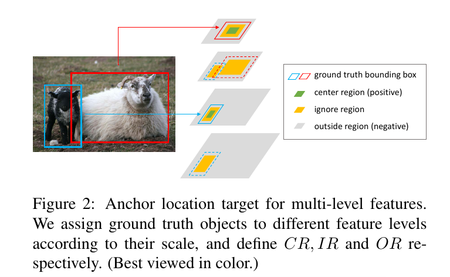
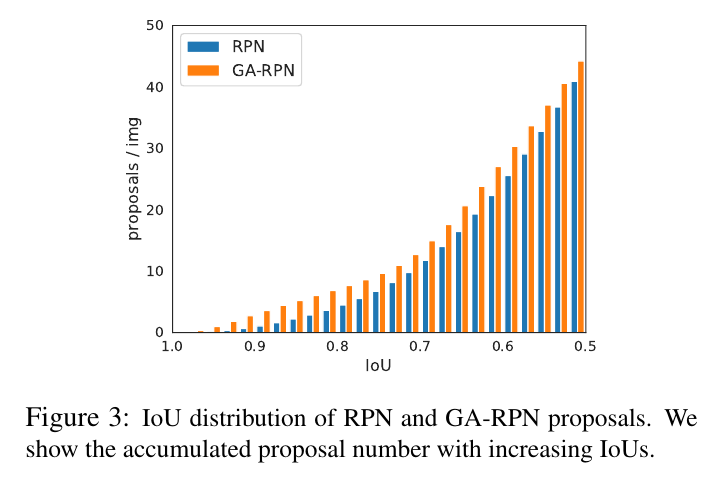
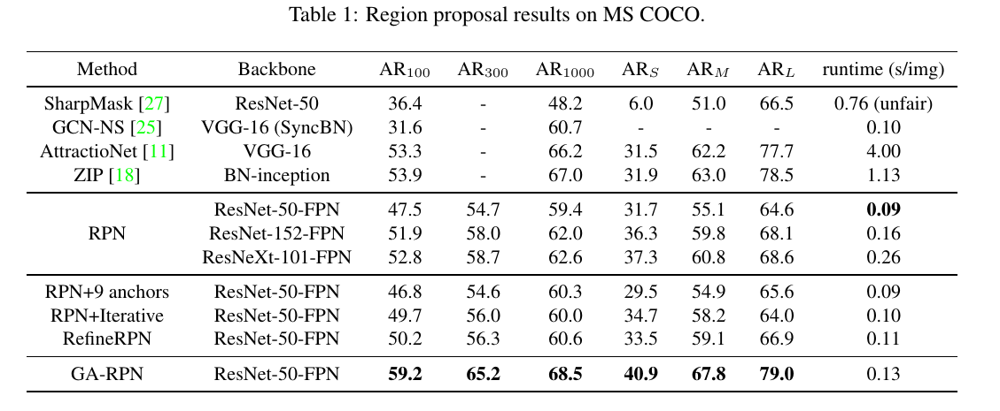
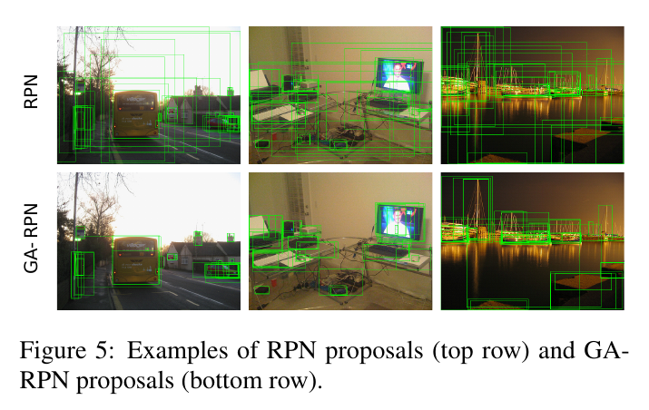
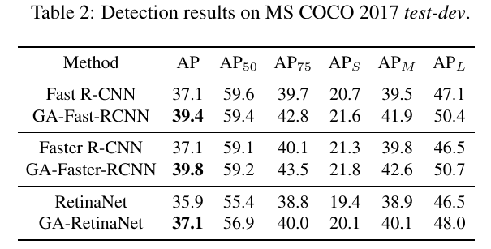
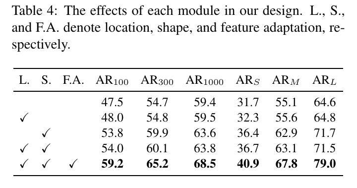
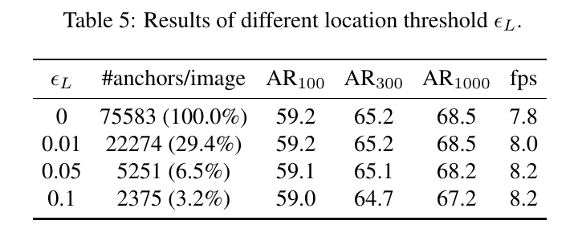
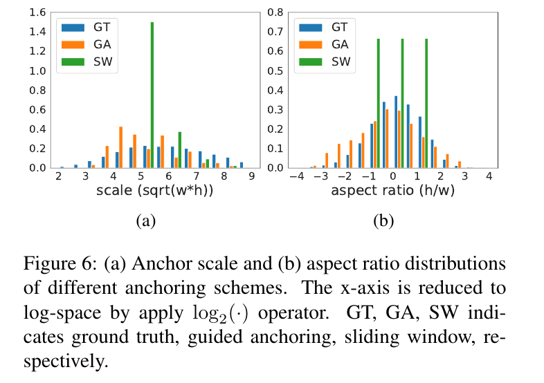
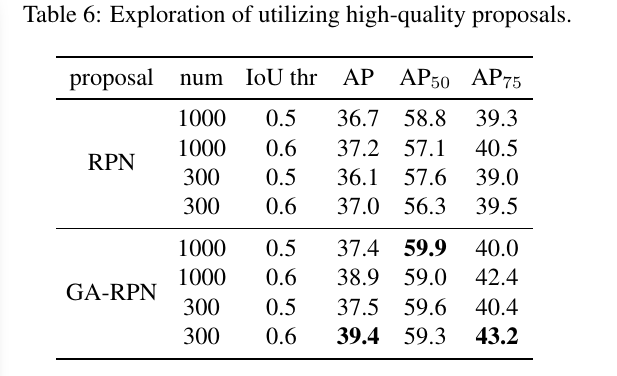

Region Proposal by Guided Anchoring
=

# Abstract
区域锚点是现代物体检测技术的基石。最先进的检测器主要依赖于密集锚方案，其中锚点在空间域上均匀地采样，锚具有预定义的一组尺度和纵横比。本文中，我们回顾了这一基础阶段。我们的研究表明，他可以更加有效且高效的完成。具体而言，我们提出一种替代方案，称为 GuidedAnchoring，其利用语义特征来指导锚的构建。所提出的方法联合预测感兴趣的对象中心可能出现的位置以及不同位置的尺度与纵横比。在预测锚点形状的顶部，我们通过特征调整模块减轻特征的不一致性。我们还研究使用高质量的提案来提高检测性能。这种锚构建方案可以无缝集成到提议方法和检测器中。使用GuidedAnchoring，我们在MS COCO上的召回率提高了9.1％，锚点数量比RPN基线少90％。我们也在 Faster R-CNN、Faster R-CNN 和 RetinaNet中采用Guided Anchoring，检测mAP分别提高2.2%、 2.7% 和 1.2% 。

# 1. Introduction
锚是预测提议（针对两阶段检测器）或者最终边界框（针对一阶段检测器）的回归参考和分类候选。现代检测器管道通常以密集分布的锚点的大型集合开始。以 Faster RCNN（一种流行的对象检测框架）为例，它首先根据锚点的密集集合生成区域提议，然后将它们分类为特定的类，并通过边界框回归细化它们的位置。

合理锚设计有两个一般规则：对齐和一致性。首先，为了使用卷积特征作为锚表示，锚中心需要与特征图像素对齐。其次，由于特征图不同区域的感受野和语义域是一直的，所以跨越不同位置的锚的尺度和形状应当是一直的。滑动窗口是遵循这种规则的简单而广泛采用的锚方案。对于大多数检测方法，锚通过如此一种均匀的方案定义，其中特征图的每个位置与预定义尺度和纵横比的 $k$ 个锚关联。

基于锚的检测管道在基准测试和真实实际系统被证明是高校的。然而，上述均匀锚固案不一定是制备锚的最佳方式。这种方案导致两个困难：（1）必须为不同的问题预先定义一组固定宽高比的整齐锚。错误的定义会妨碍检测器的速度与准确率。（2）为了保持对提议足够高的召回率，需要大量的锚，而大多数锚点对应于与利益对象无关的错误候选者。大量锚点可能导致显着的计算成本，尤其是当管道在提议阶段涉及大量分类器时。

本文中，我们提出一种更加有效的方法来准备锚点，旨在缓减手工选择先验的问题。我们方法受对象在图像平面上不是均匀分布的启发。对象的比例也与图像内容、场景的位置和几何形状密切相关。遵循这种直觉，我们的方法以两个步骤生成稀疏锚点：首先识别可能出现对象的子区域，然后确定不同位置的尺度和纵横比。

可学习的锚形状很有前途，但它打破了上述一致性规则，因此为学习锚表示提供了新的挑战，以便进行准确的分类和回归，锚点的尺度和纵横比现在是可变的而不是固定的，因此不同的特征地图像素必须学习适合相应锚点的自适应表示。为了解决这个问题，我们引入一个高校的模块来适应基于锚几何形状的特征。

我们使用前面提及的Guided Anchoring 和特征调整方案来构成Guided Anchoring Region Proposal Network（GA-RPN）。由于动态预测锚点，我们的方法获得 9.1% 的召回率提高，并且比采用密集锚方案的RPN基线少90%的锚。通过预测尺度和纵横比，而不是基于预定义的列表固定它们，我们的方案可以更高效的处理高或者宽的对象。除了区域提议之外，Guided Anchoring方案可以轻松地集成到任何依赖锚的检测器中。我们的方案获得了一致性的性能提高。例如，在COCO数据集上，GA-Fast-RCNN、GA-Faster-RCNN和GA-RetinaNet相比它们具有滑动窗口的基线综合mAP分别提高了 2.2%、 2.7% 和 1.2% 。此外，我们还探索高质量提议的使用，以及提出一种使用 GA-RPN 提议的微调调度，这可以提高任何已训练的模型的性能，例如，仅在3个epoch中，将完全收敛的Faster R-CNN模型的性能从37.4%提高到39.6% 。

本文的主要贡献为如下几个方面：
1. 我们提出一种新的建锚方案，能够预测除了密集和预定义锚之外的非均匀和任意形状的锚。
2. 我们用两个分解条件分布来形成联合锚分布，并分别设计两个模块进行建模。
3. 我们研究了特征与对应锚对齐的重要性，并设计了一个锚调整模块来细化基于隐含锚形状的特征。
4. 我们调查两阶段检测器中高质量提议的使用，并提出一种方案来提高以训练模型的性能。

# 2. Related Work
**Classical object detectors.** 滑动窗口范例，其中分类器应用于密集图像网格，具有悠久的历史并且在经典计算机视觉中主导对象检测领域。许多早期进展与更强大的手工特征密切相关，如直方图梯度图（HOG）[4]，SIFT [24]和积分通道特征[6]。

**Two-stage object detectors.**

**Single-stage object detectors.**

**Cascaded classification and regression.**

**Comparison and difference.** 我们将我们所提出的方法与传统方法之间的差异总结如下。（i）首先，先前的方法（单级，两级和多级）仍然通过滑动窗口依赖于密集且均匀的锚。我们丢弃了滑动窗口方案，并提出更好的方法来引导构建锚与生成稀疏锚，这在以前没有被探索过。（ii）级联检测器采用超过一个阶段来逐步细化边界框，这通常导致更多的模型参数，并减慢推理速度。这些方法采用RoI Pooling或RoI Align 来为边界框提取对齐的特征，这对提议生成或单阶段检测器来说太昂贵。（iii）无Anchor的方法（如DenseBox）通常有简单的管道，并最终在单一阶段产生最终的检测结果。由于锚的缺席和进一步的基于锚的精炼，它们缺乏处理复杂场景和案例的能力。我们关注的是稀疏和非均匀的建锚方案，以及高质量提议的使用来提升检测性能。为了达到这个目标，我们不得不解决在基于锚方法中指出的不对齐和不一致问题。此外，此外，[17]假设分割掩码注释作为监督，其大小预测用于对多个特定规模网络的输出进行加权求和。（iv）一些单发检测器通过多个回归和分类来细化锚。我们的方法有明显的不同之处，我们没有逐步精炼锚，相反，我们预测锚的分布，其分解为位置和形状。传统的方法没有考虑锚和特征之间的对齐，因此它们多次回归锚点（通过$[x, y, w, h]$表示），并打破了对齐和一致性。相反，我们强调这两个规则的重要性，因此我们仅预测锚的形状，而固定锚中心，并适应基于预测形状的特征。它们的分类目标是确定是否一个锚与一些ground truth 的重叠大于阈值。但是，我们的位置分支为了预测一个点是否接近对象中心，而不是任何特定锚的标签。

# 3. Guided Anchoring
锚是现代对象检测管道的基础。主流的框架，包括两阶段和一阶段方法，主要依赖 _均匀（uniform）_ 范围内的锚。具体而言，一组预定义尺度和纵横比的锚部署在大小为 $W \times H$ 、步长为 $s$ 的特征图上。这种方案不是有效的，因为许多锚被放置于感兴趣对象不可能出现的地方。此外，如此手工选择的先验不切实际的假设为对象的一组固定形状（即尺度和纵横比）。

本文中，我们旨在开发一种更有效的建锚方案，以便根据对象的位置和形状的不均匀分布来安排可学习形状的锚。Guided Anchoring方案如下工作。对象的位置和形状可以通过一个4元组$(x, y, w, h)$ 来特征化，其中 $(x, y)$ 是中心的空间位置， $w$ 为宽度， $h$ 为高度。假设我们从给定的图像 $I$ 中绘制对象，然后它的位置和形状可以视为遵循条件 $I$ 的分布，如下：

$$p(x, y, w, h | I) = p(x, y | I)p(w, h | x, y, I)  \tag 1$$

这种分解获得两种重要的直觉：（1）给定图像，对象可能仅存在某个区域；（2）对象的形状（即尺度和总很比）与其位置紧密相关。

遵循此公式，设计了一个锚生成模块，如图1中的红色虚线所示。这一模块是有定位和形状预测两分支组成的网络。给定图像 $I$ ，我们首先推导出特征图 $F_I$ 。在 $F_I$ 的顶部， _位置预测_ 分支产生一个概率图，其表明对象可能出现的位置，同时 _形状预测_ 分支预测位置依赖的形状。给定两个分支的输出，我们通过选择预测概率高于特定阈值的位置，以及每个所选位置最可能的形状。因为锚的形状可以变化，不同位置的特征应当捕获不同范围内的视觉内容。考虑到这点，我们进一步引入特征调整模块，其根据锚的形状采用特征。

上面描述的锚生成过程是基于单个特征图。对象检测的最新进展表明，在不同级别的多个特征上操作通常是有帮助的。因此，我们也开发了一个多级锚生成方案，其收集了多个特征图的锚，遵循FPN架构。注意，在我们的设计中，锚生成参数在所有涉及的特征级别上共享，因此这种方案是参数高效的。

## 3.1. Anchor Location Prediction
如图1所示，锚预测分支产生与输入特征图 $F_I$ 相同大小的概率图 $p(\cdot | F_I)$ ，其中每个实体（entry） $p(i,j|F_I)$ 对应 $I$ 的坐标为 $((i + \frac{1}{2})s, (j + \frac{1}{2})s)$ 的位置，其中 $s$ 为特征图的步长，即相邻锚之间的距离。实体（entry）的值表明对象中心在该位置出现的概率。

在我们的公式中，概率图 $p(i, j|F_I)$ 使用子网络 $\cal{N}_L$ 预测。该网络将 $1 \times 1$ 卷积应用到基本特征图 $F_I$ 上以获得对象存在性得分图，然后，它通过一个逐元素的sigmoid函数转换为概率值。虽然，更深的子网络可以做出更准确的预测，但是我们通过实验发现一个卷积层后接一个sigmoid变换在效率和准确率上取得很好的平衡。

根据结果概率图，然后，我们通过选择对应概率值高于预定阈值 $ \epsilon_L$的那些位置来确定可能存在对象的活动区域。这一过程可以过滤掉 90% 的区域，同事仍能保持相同的召回率。如图4所示，如天空和海洋的区域被排除，同时锚密集地集中在人和冲浪板周围。由于不需要考虑排除的区域，我们用掩模卷积[19,31]代替随后的卷积层，以获得更有效的推理。

## 3.3. Anchor Shape Prediction
在确定对象可能出现的位置之后，我们下一步是确定在某个位置可能存在的对象的形状。这通过锚形状分支（图1（c））完成。该分支完全不同于传统的边界框回归，因为它没有改变锚的位置，并不会引起锚和锚特征之间的不对齐。具体而言，给定特征图 $F_I$ ，该分支将预测每个位置的最佳形状 $(w, h)$ ，即 与最近邻的ground-truth边界框产生最高 IoU 的形状。

虽然，我们的目标是预测宽 $w$ 和高 $h$ 的值，我们经验上发现直接预测这两个数值是不稳定的，这是由于它们具有较大的范围。相反，我们采用如下的变换：

$$w = \sigma \cdot s \cdot e^{dw}, h = \sigma \cdot s \cdot e ^{dh} \tag 2$$

形状预测分支输出 $dw$ 和 $dh$ ，然后，按上述方法映射到 $(w, h)$ ，其中 $s$ 是步长，$\sigma$ 是经验尺度因子（我们的实验中， $\sigma = 8$）。注意非线性变换将输出空间从大约为 $[0, 1000]$ 映射到 $[-1, 1]$ ，产生一个更容易而稳定的学习目标。在我们的设计中，我们使用一个子网络 $\cal{N}_S$ 进行形状预测，其由一个 $1 \times 1$ 卷积层组成，该卷积层产生包含 $dw$ 和 $dh$ 值的两个通道图，并且还有一个公式（2）中的逐元素变换层。

注意，这种设计不同于传统建锚的关键在于每个位置仅与一个动态预测的形状关联，而不是一组预定义的形状。我们的实验表明，由于位置和形状的紧密联系，我们的方案获得比基线更高的召回率。同时，值得注意的是我们的方案允许任意的纵横比，并因此能更好捕获极端高或宽的对象，例如火车和滑雪板。

## 3.3. Anchor-Guided Feature Adaptation
在采用滑动窗口方案的传统RPN或单阶段检测器中，锚在整个特征图上是均匀的，即它们在每个位置共享相同的形状和尺度。因此，特征图可以学习一致的表征。在我们的方案中，然而，锚的形状因位置而异。在这个条件下，我们发现遵循先前的约定[30]可能不是一个好的选择，其中全卷积分类器统一应用于特征映射。理想上，较大锚的特征应当编码较大区域的内容，而较小锚的特征相应的有更小的作用域（scope）。遵循这种直觉，我们进一步设计了 _anchor-guided feature adaptation_ 组件，其将根据底层锚形状变换各个位置的特征，如：

$$f_i' = \cal{N}_T(f_i, w_i, h_i)  \tag 3$$

其中 $f_i$ 是第 $i$ 个位置的特征， $(w_i, h_i)$ 是相应的锚形状。对于如此依赖位置的变换，我们采用 $3 \times 3$ 的可变性卷积层来实现 $\cal{N}_T$ 。如图1所示，我们首先从锚形预测分支的输出预测偏移场，然后将可变形卷积应用于具有偏移的原始特征映射以获得 $f_I'$ 。在调整的特征图顶部，我们然后执行进一步的分类和边界框回归。

## 3.4. Training
**Joint objective.** 所提出的架构使用多任务损失端到端的优化。除了传统的分类损失 $\cal{L}_{cls}$ 和回归损失 $\cal{L}_{loc}$ 外，我们为锚位置 $\cal{L}_{loc}$ 和 $\cal{L}_{shape}$ 引入两个额外的损失。它们使用如下损失联合优化：

$$\cal{L} = \lambda_1 \cal{L}_{los} + \lambda_2 \cal{L}_{shape} + \cal{L}_{cls} + \cal{L}_{reg} \tag 4$$

**Anchor location targets.** 为了训练锚位置分支，对于每幅图像，我们需要一个二值标签图，其中1表示用于放置锚的有效位置，而0表示无效位置。在这项工作中，我们采用采用ground-truth边界框来引导二值图生成。特别地，我们希望在目标中心放置更多的锚，同时远离中心的锚更少。首先，我们将ground-truth边界框 $(x_g, y_g, w_g, h_g)$ 映射到相应的特征图尺度，并获得 $(x_g', y_g', w_g', h_g')$ 。我们将 $\cal{R}(x, y, w, h)$ 表示为矩形区域，其中心为 $(x, y)$ 、大小为 $w \times h$ 。我们希望将锚放置与ground-truth对象的中心以获得更大的初始 IoU，因此，我们为每个边界框定义了三个类型的区域。

1. 中心区域 $CR = \cal{R}(x_g', y_g', \sigma_1 w', \sigma_1 h')$ 定义边界框的中心区域。$CR$ 中的像素分配为正样本。
2. 忽略区域 $IR = \cal{R}(x_g', y_g', \sigma_2 w', \sigma_2 h') \ CR$  是 $CR$ 之外的更大区域（$\sigma_2 > \sigma_1$）。$IR$ 中的像素被标记为 “ignore”，并在训练期间被排除。
3. 外部区域（Outside Region）$OR$ 是除 $CR$ 和 $IR$ 外的整个特征图。$OR$ 中的像素被视为负样本。

先前的工作[16]（DenseBox）提出“gray zone” 以平衡采样，其与我们的位置目标有相似的定义，但是仅在单一特征图上工作。由于我们使用FPN的多个特征级别，我们也考虑相邻特征图的影响。具体而言，每个级别的特征图应仅针对特定尺度范围的对象，因此仅当特征图与目标对象的尺度范围匹配时，才在特征图上指定 $CR$ 。相邻层的相同区域设置为 $IR$ ，如图2所示。 $CR$ 通常考虑真个特征图的一小部分，因此我们使用 **Focal Loss** 来训练定位分支。

**Anchor shape targets.** 有两个步骤来确定每个锚的最佳形状目标。首先，我们需要将锚匹配到ground-truth边界框。接着，我们将计算最优的形状 $\hat{w}$ 和 $\hat{h}$ ，其能最大化锚和所匹配的ground-truth边界框之间的 IoU 。

先前的工作[30]（Faster RCNN）将候选锚分配给ground-truth边界框，其产生的锚具有最大IoU值。然而，这一过程在我们的案例中是不可用的，因为我们的锚的 $w$ 和 $h$ 不是预定义的，而是变化的。为了克服这个问题，我们定义可变锚 $a_{wh} = (x_0, y_0, w, h)$ 和 ground-truth 边界框 $gt=(x_g, y_g, w_g, h_g)$ 之间的IoU（表示为 vIoU）如下：

$$vIoU(a_{wh}, gt) = \max_{w > 0, h > 0} IoU_{normal}(a_{wh}, gt) \tag 5$$

其中 $IoU_{normal}$ 为通常定义的 IoU，而 $w$ 和 $h$ 是可变的。注意，对于任意的锚位置 $(x_0, y_0)$ 和 ground-truth $gt$ ， $\mbox{vIoU}(a_{wh}，gt)$ 的解析表达式复杂，难以在端到端网络中高效实现。因此，我们使用一种替代方案来估计它。给定 $(x_0, y_0)$ ，我们对 $w$ 和 $h$ 的一些常见值进行采样，以模拟所有 $w$ 和 $h$ 的枚举。然后，我们计算这些采样锚和 $gt$ 之间的IoU，并使用最大值作为 $\mbox{vIoU}(a_{wh}, gt)$ 的估计。在我们的实验中，我们采样 9 对不同尺度和纵横比的 $(w, h)$ 来作为准确率和有效性的平衡。我们最终将位置 $(x_0, y_0)$ 分配给ground-truth，其产生最大的 vIoU。

我们采用约束的 IoU 损失[32]（bounded IoU loss）来最大化anchor和对应ground-truth之间的 IoU，而不是直接回归最优的形状 $\hat{w}$ 和 $\hat{h}$ 。损失与原始论文中的定义几乎相同，除了我们仅优化 $w$ 和 $h$ ，而不是 $\{x, y, w, h\}$ ，因为锚的位置是固定的。

## 3.5. The Use of High-quality Proposals
通过所提出的引导锚定方案（GA-RPN）增强的RPN可以产生比传统RPN更高质量的提议。我们探索如何通过如此高质量提议的使用来提高传统两阶段检测器的性能。首先，我们研究RPN和GA-RPN生成的提议的IoU分布，如图3所示。GA-RPN比起RPN提议有两个显著的优势：（1）正提议的数量较大，（2）高IoU提议的比例明显更多。一个直接的想法是使用所提出的GA-RPN替换已存在模型中的RPN，并端到端训练模型。然而，这个问题并不重要，采用与以前完全相同的设置只能带来有限的增益（例如，小于1点）。根据我们的观察，使用高质量建议的先决条件是根据提议分布调整训练样本的分布。因此，我们设置更高的正负阈值，并当使用GA-RPN训练检测器时，使用比RPN更少的样本。

除了端到端训练，我们发现GA-RPN提议能够通过微调计划来增强已训练的两阶段探测器。具体而言，给定已训练的模型，我们丢弃区域提议生成组件（例如RPN），并使用预计算的GA-RPN提议来微调模型几个时期（默认为3个时期）。GA-RPN提议也被用于推理。这种简单的微调方案可以进一步提高性能，只需要几个时期的时间成本。

# 4. Experiments
## 4.1. Experiments Setting
**Dataset.** 我们在挑战性的MS COCO 2017基准测试上执行实验。我们使用训练集训练，并在验证集上报告性能。检测结果在test-dev上报告。

**Implementation details.** 如果没有其他说明，我们在所有实验中使用ResNet-50与FPN作为骨干网络。作为一个共用惯例，我们调整图像的大小为 $1333 \times 800$ ，而没有改变纵横比。在定义 $CR$ 和 $IR$ 进行锚位置预测时，我们设置 $\sigma_1 = 0.2$ ， $\sigma_2 = 0.5$ 。在多任务损失函数中，我们仅设置 $\lambda_1 = 1$ ， $\lambda_2 = 0.1$ 来平衡位置和形状预测分支。我们使用8个GPU的同步SGD，每个小批量共有16个图像（每个GPU 2个图像）。我们以0.02的初始学习率共训练12个时期，并在8个时期和11个时期时减小10倍。运行时间在TITAN X GPU 上测量。

**Evaluation metrics.** RPN的结果使用 Average Recall （AR）测量，其为不同 IoU 阈值（从0.5到0.95）上召回率的平均。每幅图像100、 300 和 1000 个提议的 AR 表示为 $AR_{100}$ 、 $AR_{200}$ 和 $AR_{1000}$ 。小型、中型和大型对象的AR（$AR_S$、 $AR_M$ 和 $AR_L$） 在1000个提议上计算。检测结果使用标准的COCO度量，其为0.5到0.95 IoU 时的平均 mAP。

## 4.2. Results
我们首先通过比较GA-RPN与RPN基线和先前提到的最佳区域提议方法之间的召回率来评估我们的建锚方案。同时，我们也比较了一些RPN变体。“RPN + 9 anchors” 表示在每个特征层使用3个尺度和3个纵横比，这遵循[20]（FPN）。“RPN+Iterative” 表示连续地使用两个RPN头部，并在它们之间应用一个额外的 $3 \times 3$ 卷积层。“RefineRPN”表示与[36]（RefineDet）相似的结构，其中使用FPN之前和之后的特征回归和分类两次。

## 4.3. Ablation Study
**Model design.** 我们在我们的设计中消除了不同的组件，从而研究每个组件的有效性，包括位置预测、形状预测和特征调整。结果如表 4 .

**Anchor location.** 位置阈值 $\epsilon_L$ 控制锚分布的稀疏性。采用不同的阈值将产生不同数量的锚。为了揭示 $\epsilon_L$对效率和性能的影响，我们改变阈值并比较以下结果：每个图像的平均锚点数，最终提议的召回和推理运行时间。根据表5，我们能够观察到多数背景区域的对象性得分接近0，因此一个较小的 $\epsilon_L$ 可以减少锚点数量超过90％，召回率只有轻微下降。值得注意的是RPN的头部仅是一个传统层，因此加速不明显。然而，锚的数量的显着减少提供了使用较重的头部执行更有效推断的可能性。

**Anchor shape.** 我们将我们方法生成的锚点集与预定义形状的滑动窗口锚点进行比较。由于我们的方法仅在特征图的每个位置预测一个锚，而不是不同尺度和纵横比的 $k$ （在我们的基线中 $k=3$） 个锚，总计的锚数量减小到 $\frac{1}{k}$ 。我们在图6中呈现了我们锚和滑动窗口锚的尺度和纵横比的分布。结果表明，Guided Anchoring方案相比预定义的锚尺度和形状，有巨大的优势。预测锚覆盖更加宽范围的尺度和纵横比，其与ground-truth有相似的分布，并提供一个初始锚点池，其对ground-truth对象具有更高的覆盖率。

**Feature adaption.** 功能调整模块大大提高了提议召回率，证明了特征一致性的补救措施至关重要。我们认为这种提高不仅来自采用可变形卷积，而且来自使用锚尺度形状预测的设计来预测可变形卷积层的偏移的结果。如果我们仅简单地在锚生成后添加可变形卷积层，AR100/AR300/AR1000 的结果分别为 56.1/62.4/66.1，这落后于我们的设计。 

**The use of high-quality proposals.** 尽管具有高质量提议，训练良好的检测器仍是一个不寻常的问题。采用完全相同的设置只能带来有限的增益。如图3所示，GA-RPN提议提供了更多的高 IoU 的候选。这表明我们实际上可以使用更少的提议来训练检测器。为了研究这个问题，我们实验了使用 RPN 或 GA-RPN 提议的 Fast R-CNN。我们训练具有不同数量提议的Fast R-CNN，并采用不同的IoU阈值来为前景/背景分配标签。

根据表6中的结果，我们观察到：（1）较大的IoU阈值对于利用高质量提议很重要。通过集中于较高IoU的正样本，假阳性将更少，并且分类的特征更具辨别力。由于在训练期间，分配负标签的IoU阈值小于0.6，$AP_{0.5}$ 将减小，而高IoU的AP将大幅增加，并且总计的AP更高。（2）在高召回率的前提下，训练和测试期间使用更少的提议可以使学习受益。更少的提议导致更低的召回率，但是将简化学习过程，因为没有低得分提议的难样本。当使用RPN提议训练时，如果仅使用300个提议训练，检测器的性能将减小，因为召回率不够，并且许多对象将会丢失。然而，GA—RPN确保即使更少的提议也有高召回率，因此训练300个提议仍可提升最终的mAP 。

