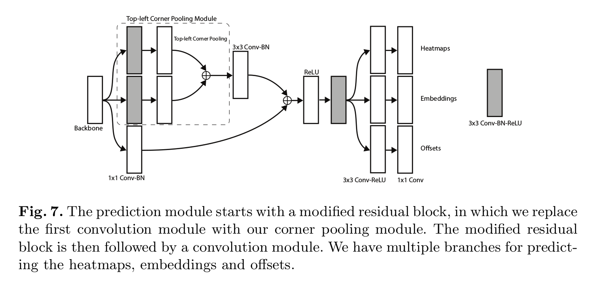
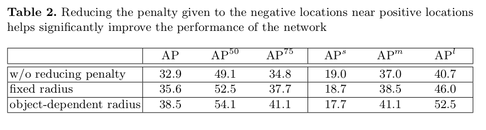
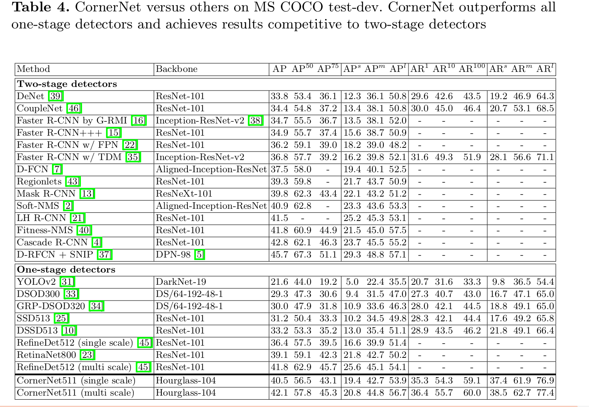

CornerNet: Detecting Objects as Paired Keypoints
=

# 1 Introduction
使用锚框有两个缺点。第一，我通常需要非常大的锚框集合，例如 DSSD 中有超过 40k 的锚框， RetinaNet 超过 100k 。这是因为检测器训练来分类每个锚框是否与 ground-truth 框充分重叠，并且需要大量锚框来确保与最多的 ground-truth 框重叠。因此，仅有很小部分锚框与 ground-truth 重叠；这造成正负锚框之间的巨大不平衡，并且减慢训练。

第二，使用锚框引入许多超参数和设计选项。这些包括：有多少边界框、什么尺寸和什么纵横比。这些选择主要是通过ad-hoc启发式方法进行的，并且当与多尺度架构结合使用时会变得更加复杂，其中单个网络在多个分辨率下进行单独预测，每个尺度使用不同的特征和它自己的一组锚箱[25，10,23]。

本文引入 CornerNet ，一种新的用于对象检测一阶段方法，其可以消除锚框。我们将一个对象检测为一对关键点——边界框的左上角和右下角。我们使用单一的卷积网络以预测 **相同对象类别所有实例的左上角热图、所有右下角热图和每个检测到的角的嵌入向量。** 嵌入用于对属于同一对象的一对角进行分组 - 训练网络以预测它们的类似嵌入。我们网络极大地简化网络输出，并消除设计锚框的必要。我们方法受 Newell等人[27]提出的 associative embedding method 启发，该方法在多人人体姿态估计背景下检测和分组关键点。图 1 展示了我们方法的综合管道。

CornerNet 的另一个新颖部分是 _corner pooling_ ，一种新型池化层，其帮助卷积神经网络更好地定位边界框的角。边界框的角通常位于对象的外部——考虑圆的情况以及图2中的示例。在如此的案例中基于局部证据，角点不能定位。相反，为了确定在一个像素卫视是否有左上角点，我们需要水平向右寻找对象的最上的边界，并且垂直向下寻找最左的边界。这个启发了我们的角池化层： 它需要两个特征图； 在每个像素位置，它最大池化从第一个特征图到右侧的所有特征向量，最大池化直接从第二个特征图到下界的所有特征向量，然后将两个池化结果加到一起。一个例子如图3所示。

我们假设检测角落比边界框中心或提议更好的两个原因。第一，因为边界框的中心依赖对象的全部 4 条边，所以难以定位，而定位角点仅依赖两条边，因此更容易，甚至在使用角池化时，更是如此，角池化编码关于角定义的一些显示的先验知识。第二，角点提供了更加密集地离散化边界框空间： 我们仅需要 $O(wh)$ 的角来表示 $O(w^2h^2)$ 个可能锚框。

我们证明了在 MS-COCO 上 CornerNet 的有效性。CornerNet 获得了 42.1% 的 AP，优于所有已存在的一阶段检测器。此外，通过消融研究，我们证明角池化是 CornerNet 获得领先性能的关键。

# 2 Related Works
。。。
DeNet是一种两阶段检测器，其不使用锚点框生成 RoI 。首先确定米格位置属于边界框左上角、右上角、左下角或右下角的可能性。然后，通过枚举所有可能的角点组合生成 RoI ，并遵循标准的两阶段方法来分类每个 RoI 。我们的方法完全不同于 DeNet 。第一，DeNet 没有确定两个角是否来自相同的对象，并且依赖一个自检测网络来拒绝劣质的 RoI 。相比之下，我们的方法以一阶段方法，其使用单一的 ConvNet 来检测和分组角点。第二，DeNet 在与用于分类的相关区域的手动确定的位置处选择特征，而我们的方法不需要任何特征选择步骤。第三，我们引入角点池化，一种用于增强角点检测的新型层。

我们的方法受 Newell等人[27]在多人姿态估计背景下的 Associative Embedding 工作的启发。Newell等人提出在单个网络中检测和分组人体关节的方法。他们的方法中，每个检测到的人体关节有一个嵌入向量。关节根据他们的嵌入向量之间的距离距离进行分组。据我们所知，我们是第一个将对象检测任务视为同时检测和分组角点的任务。另一个新颖之处是角点池化层有助于更好地定位角点。我们也修改了沙漏架构，并添加 focal loss 变体来帮助更好地训练网络。

# 3 CornerNet
## 3.1 Overview
在 CornerNet 中，我们将对象检测为关键点对——边界框的左上角和右下角。一个卷积网络预测两组热图以表示不同对象类别的角点，一组用于左上角，另一组用于右下角。网络也预测每个检测到角的嵌入向量，使得来自同一个对象的两个角的嵌入之间的距离很小。为了产生更紧凑的边界框，网络也预测偏移以轻微地调整角点的位置。使用预测热图、嵌入和偏移，我们可以使用一个简单的后处理算法来获得最终的边界框。

图4提供了 CornerNet 的概览。我们使用沙漏网络作为 CornerNet 的骨干网络。沙漏网络后是两个预测模块。一个模块用于左上角，而另一个模块用于右下角。每个模块在预测热图、嵌入和偏移之前，使用其自己的角点池化模块来池化来自沙漏网络的特征。不同于其他对象检测器，我们不使用来自不同尺度的特征检测不同大小的对象。

## 3.2 Detecting Corners
我们预测两组热图，一组用于左上角，另一组用于右下角。每组热图有 $C$ 个通道，其中 $C$ 是对象类别的数量，并且其大小为 $H \times W$ 。不存在背景通道。每个通道的二值掩模指示一个类的角点位置。

对于每个角，有一个 ground-truth 正类位置，而所有其他位置是负类。在训练期间，我们减少给予正位置半径内的负位置的惩罚，而不是同等地惩罚负位置。这是因为，如果福焦点检测对与它们的代表性 ground-truth 边界框接近，它们仍能够产生与 ground-truth 边界框充分重叠的边界框（如图5）。我们确保半径内的角点对生成的边界框与 ground-truth 边界框之间至少有 $t$ 的 IoU ，以此来确定半径的大小（在所有试验中，我们设置 $t$ 为 0.7）。给定半径，减少惩罚量由一个非标准化的 2D 高斯 $e^{-\frac{x^2+y^2}{2\sigma^2}}$ 给出，其中心为正类位置，$\sigma$ 为半径的 $1/3$ 。

令 $p_{cij}$ 为预测热图中类 $c$ 在位置 $(i,j)$ 处的得分，并令 $y_{cij}$ 为使用非标准化高斯增强的 “ground-truth” 热图。我们设计 focal loss 的变体为：
$$
L_{det} = -\frac{1}{N}\sum_{c=1}^C\sum_{i=1}^H\sum_{j=1}^W
\begin{cases}
(1 - p_{cij})^{\alpha}\log(p_{cij}) & \mbox{ if } y_{cij} = 1 \\
(1 - y_{cij})^\beta(p_{cij})^\alpha \log(1 - p_{cij}) & \mbox{ otherwise }
\end{cases} \tag 1
$$

其中 $N$ 为图像中对象数量，$\alpha$ 和 $\beta$ 为超参数，其控制每个点的贡献（我们在试验中设置 $\alpha$ 为 2 ，$\beta$ 为 4）。对于以 $y_{cij}$ 编码的高斯冲击，$(1-y_{cij})$ 项减少了 ground-truth 位置周围的惩罚。

许多网络使用下采样层以聚合全局信息，并减小计算量。当它们以全卷积的形式应用到图像时，输出大小通常小于图像。因此，图像中的位置 $(x,y)$ 被映射到热图位置 $(\lfloor\frac{x}{n}\rfloor, \lfloor\frac{y}{n}\rfloor)$ ，其中 $n$ 为下采样因子。当我们将位置从热图映射回输入图时，一些精度将会丢失，其可能极大地影响小边界框和它们的 ground-truth 的 IoU 。为了处理这个问题，我们预测位置偏移以在将它们映射会输入分辨率之前轻微地调整角点位置。
$$o_k = (\frac{x_k}{n} - \lfloor\frac{x_k}{n}\rfloor, \frac{y_k}{n} - \lfloor\frac{y_k}{n}\rfloor) \tag 2$$
其中 $o_k$ 为偏移，$x_k$ 和 $y_k$ 分别为角 $k$ 的 $x$ 和 $y$ 坐标。特别地，我们预测一组有所有类左上角共享的偏移，以及另一组有右下角共享的偏移。对于训练，我们在 ground-truth 角点位置使用 smooth L1 loss：
$$L_{off} = \frac{1}{N}\sum_{k=1}^N \mbox{SmoothL1Loss}(o_k, \hat{o}_k)  \tag 3$$

## 3.3 Grouping Corners
多个对象可能出现在一幅图像中，因此，可能会检测到多个左上角和右下角。我们需要确定左上角和右下角对是否来自同一个边界框。我们的方法受 Associative Embedding 启发，其用于多人姿态估计任务。Associative Embedding 检测所有人的关节，并为每个检测到的关节生成一个嵌入。它们基于嵌入见的距离分组关节。

Associative Embedding 的思想对我们的任务也是适用的。网络为每个检测到的角点预测一个嵌入向量，使得如果左上角和右下角属于同一个边界框，那么它们的嵌入的距离应当很小。然后，我们可以基于左上角和右下角的嵌入的距离分组这些角。嵌入的实际值是不重要的。仅嵌入之间的距离用于分组角点。

我们遵循 Associative Embedding ，并使用 1 维嵌入。令 $e_{t_k}$ 为对象 $k$ 左上角的嵌入，$e_{b_k}$ 为右下角的嵌入。如[26]，我们使用 “pull” 损失来训练网络以分组角，而 “push” 损失来分离角点：
$$L_{pull} = \frac{1}{N}\sum_{k=1}^N[(e_{t_k} - e_k)^2 - (e_{b_k - e_k})^2] \tag 4$$
$$L_{push} = \frac{1}{N(N-1)}\sum_{k=1}^N\sum_{j=1, j \ne k}^N \max(0, \Delta - |e_k - e_j|)  \tag 5$$
其中 $e_k$ 为 $e_{t_k}$ 和 $e_{b_k}$ 的均值，我们设置 $\Delta$ 为 1 。与偏移损失相似，我们仅将损失应用到 ground-truth 角位置。

## 3.4 Corner Pooling
如图2所示，通常没有角点存在的局部视觉证据。为了确定一个像素是否是左上角，我们需要水平向右寻找最上的边界，垂直向下寻找最左的边界。因此，提出 _corner pooling_ 通过编码显示的先验知识以更好地定位角点。

假设我们需要确定位置 $(i, j)$ 是否是左上角。令 $f_t$ 和 $f_l$ 为左上角池化层的输入，令 $f_{t_{ij}}$ 和 $f_{l_{ij}}$ 分别为 $f_t$ 和 $f_l$ 中位置 $(i, j)$ 处的向量。对于 $H \times W$ 的特征图，角池化层首先最大池化 $(i,j)$ 和 $(i, H)$ 之间的所有特征向量到一个特征向量 $t_{ij}$ ，最大池化 $f_l$ 中 $(i,j)$ 和 $(W,j)$ 之间的所有特征向量到一个特征向量 $l_{ij}$ 。最终，将 $t_{ij}$ 和 $l_{ij}$ 加到一起。这种计算可以表示为如下公式：
$$
t_{ij} = \begin{cases}
         \max(f_{t_{ij}}, t_{(i+1)j}) & \mbox{ if } i < H \\
         f_{t_{Hj}}  & \mbox{ otherwise}
         \end{cases}  \tag 6
$$

$$
l_{ij} = \begin{cases}
         \max(f_{l_{ij}}, l_{i(j+1)}) & \mbox{ if } j < W \\
         f_{l_{iW}}  & \mbox{ otherwise}
         \end{cases} tag 7
$$
其中我们应用逐元素最大操作。$t_{ij}$ 和 $l_{ij}$ 够通过如图6的动态规划有效计算。

我们以相似的方式定义右下角最大池化层。它池化 $(0,j)$ 和 $(i,j)$ 之间的所有特征向量以及 $(i,0)$ 和 $(i,j)$ 之间的所有特征向量，最后将池化结果相加。角池化层用于在预测模块中预测热图、嵌入和偏移。

预测模块的架构如图 7 所示。模块的第一个部分是残差块的修改版本。在修改的残差块中，我们用角池化层模块替换第一个 $3 \times 3$ 卷积模块，其首先通过两个 128 通道的 $3 \times 3$ 卷积模块（conv+BN+ReLU）处理来自骨干网络的特征， 然后使用角池化层。遵循残差块的设计，然后我们将池化特征馈入一个 256 通道的 $3 \times 3$ Conv-BN 层，并添加投影快捷方式（shortcut）。这种修改后的残差块后接一个 256 通道的 $3 \times 3$ 卷积模块，以及 3 个 Conv-ReLu-Conv 层以产生热图、嵌入和偏移。

## 3.5 Hourglass Network
CornerNet 使用沙漏网络作为其骨干网络。沙漏网络在人体姿态估计中首次引入。它由一个或多个沙漏模块组成的全卷积网络。沙漏网络首先通过一系列卷积和最大池化层下采样输入特征。然后，通过一系列上采样和卷积层将特征上采样回原始分辨率。由于细节在最大池化层中丢失，所以添加 skip 层以将细节带回到上采样的特征。当多个沙漏模块在网络中堆叠时，沙漏模块可以重新处理特征以捕获更高级别的信息。这种属性使得沙漏网络是对象检测的理想选择。事实上，许多当前的检测器已经采用与沙漏网络相似的网络。

我们的沙漏网络由两个沙漏组成，并且我们对沙漏模块的架构作出一些修改。我们仅使用步长 2 来减小特征分辨率，而不是使用最大池化层。我们将特征分辨率减小 5 倍，并沿着 $(256, 383, 384, 384, 512)$ 来增加特征通道的数量。当我们上采样特征时，我们使用两个残差模块，接着是最近邻上采样。每个 skip 连接也由 2 个残差块组成。中间的沙漏模块有 4 个 512 通道的残差模块。在沙漏模块之前，我们使用步长为 2、通道为 128 的 $7 \times 7$ 卷积模块和步长为 2 、通道为 256 的残差块将输入分辨率减小 4 倍。

遵循[28]，我们也在训练过程中添加中间监督。然而，我们不会将中间预测添加回网络，因为我们发现这伤害网络的性能。我们应用一个 $3 \times 3$ Conv-BN 模块到第一个沙漏模块的输入和输出。然后，通过逐元素加法将它们融合，接着是 ReLU 和 256 通道的残差块，其然后用作第二的沙漏模块。沙漏网络的深度为 104 。不同于许多其他的最佳检测器，我们仅使用整个网络的最后一层的特征进行预测。

# 4 Experiments
## 4.1 Training Details
我使用 PyTorch 实现 CornerNet 。网络在 PyTorch 的默认设置下随机初始化，而没有任何额外数据的预训练。由于我们使用 focal loss ，我们遵循[23]设置预测角热图的卷积层的偏差。在训练期间，欧密设置网络的输入分辨率为 $511 \times 511$ ，这产生 $128 \times 128$ 的输出分辨率。为了减小过拟合，我们采用标准的数据增强技术，包括水平翻转、随机缩放、随机检测和随机颜色扰动，颜色扰动包括亮度、饱和度和对比度。最后我们对输入图像使用 PCA 。

我使用 Adam 来优化全部训练损失：
$$L = L_{det} + \alpha L_{pull} + \beta L_{push} + \gamma L_{off} \tag 8$$
其中 $\alpha$ 、 $\beta$ 和 $\gamma$ 分别为 pull 、push 和 偏移损失的权重。我们设置 $\alpha$ 和 $\beta$ 为 0.1 ，$\gamma$ 为 1 。我们发现 $\alpha$ 和 $\beta$ 的值为 1 或者更大都会导致较差的性能。我们使用 49 的批大小，并在 10 个 Titan X （PASCAL）GPU （4张图像用于 master GPU，其余的GPU各5张图像）上训练。为了节省GPU资源，在我们的消融实验中，我们训练网络进行250k次迭代，学习率为 $2.5 \times 10^{-4}$ 。当我们将我们的结果与其他检测器进行比较时，我们训练了额外的 250k 迭代，并在对话 50k 迭代中，将学习率减小到 $2.5 \times 10^{-5}$ 。

## 4.2 Testing Details
在测试期间，我们使用简单的后处理算法来从热图、嵌入和偏移中生成边界框。我们首先在角热图上使用3×3最大赤虎层，然后应用非最大抑制（NMS）。然后从热图中选择前 100 个左上角和前 100 个右下角。角的位置通过相应的偏移调整。我们计算左上角和右下角嵌入之间的 L1 距离，距离大于 0.5 的对或者包含不同类别的角点被拒绝。左上角和右下角的平均得分作为检测得分。

我们维持图像的原始分辨率，并在传入 CornerNet 之前填充零，而不是将图像调整到固定大小。原始图像和翻转后的图像都用于测试。我们结合原始和翻转图像的检测，并应用 soft-nms 以抑制冗余检测。仅报告前 100 个检测。在 Titan X （PASCAL）CPU 上的平均推理时间为 224ms 。

## 4.3 MS COCO

## 4.4 Ablation Study
**Corner Pooling**

**Reducing penalty to negative locations** 对于固定半径，设置半径为 2.5 。

**Error Analysis**

## 4.5 Comparisons with state-of-the-art detectors

