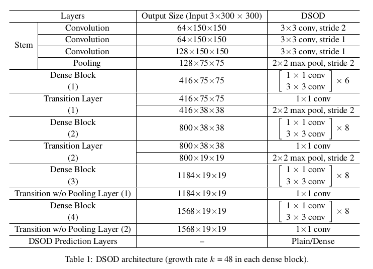

DSOD: Learning Deeply Supervised Object Detectors from Scratch
=

# 1 Introduction
为了获得良好的性能，大多数先进检测系统使用ImageNet预训练的网络进行微调。这种微调视为迁移学习，使用预训练的模型进行微调至少有两个好处：（1）存在许多可用的取得最佳性能的深度模型，可用非常方便地将其重用于对象检测。（2）微调可以迅速生成最终的模型和需要比分类任务更少的实例级标注训练数据。

然而，当在预训练模型中使用预训练网络时，也有些严重局限：（1）结构设计空间有限（Limited structure design space）。预训练网络模型大多数基于ImageNet分类任务，这类网络通常包含大量参数。已存在的对象检测器直接使用预训练网络，并且导致在控制/调整网络结构灵活性很少（尽管网络结构改变很小）。计算资源的需求也受到繁重的网络结构的限制。（2）学习偏差（Learning bias）。因为分类和检测任务之间的损失函数和类别分布是不同的，因此作者认为这将产生不同的搜索/优化空间。因此，因此，学习可能偏向于对检测任务不是最佳的局部最小值。（3）领域不匹配（domain mismatch）。众所周知，微调可以缓解由于不同的目标类别分布造成的差距。然而，当源域（ImageNet）与目标域存在巨大的不匹配时，如深度图像，医学图像等，仍然是一个严重的问题[7]。

本文的工作受到下面两个问题的启发：第一，从头训练对象检测网络有可能吗？第二，如果第一个答案是肯定的，那么在保持高检测准确度的同时，是否有任何原则来设计资源有效的对象检测网络结构？为了达到这个目标，作者提出深度监督对象检测器（DSOD: Deeply Supervised Objection Detectors），它是一种简单而高效的框架，该框架可以从头学习。DSOD非常灵活，因此我们可以针对不同的计算平台（如服务器，台式机，移动设备甚至嵌入式设备）定制各种网络结构。

我们贡献一系列设计DSOD的准则。一个关键点是深度监督（deep supervision），它受[18, 35]启发。在[35]中，Xie等提出Holistically-Nested（整体上嵌套）的结构用于边缘检测，其中包括侧输出（side-output）层到基础网络的每个卷积阶段，以进行明确的深度监督。本文不是使用具有侧输出层的多个切入损失（cut-in loss）信号，而是通过DenseNet[10]中提出的密集分层连接隐式地采用深度监督。密集连接不仅在骨干子网络中使用，而且还在前端多尺度预测层中使用。图1说明了前端预测层的结构比较。这种多分辨率预测图的融合和重用有助于保持或甚至提升最终预测准确率，同时在一定程度上减少模型参数。

本文主要的贡献如下：   
1. 提供DSOD，它是世界上第一个可以从头开始训练对象检测网络的框架，具有最先进的性能。
2. 们介绍并验证了一系列原则，从头开始逐步消融研究，设计有效的对象检测网络。
3. 证明DSOD可以在三个标准的基准测试上（PASCAL VOC2007，2012和MS COCO）获得最优性能，而且有实时处理速度和更具影响的模型。

# 2 Related Work
**Object Detection.** 最优的基于CNN的对象检测方法可以划分成两组：（1）基于区域提议的方法（ii）无提议的方法。

基于提议的方法包括R-CNN、Fast R-CNN、Faster R-CNN和R-FCN。R-CNN首先使用选择性搜索生成潜在的对象区域，然后在这些提议区域执行分类。R-CNN需要较高的计算开销，这是因为每个区域被CNN网络单独地处理。Fast R-CNN和Faster R-CNN通过共享计算改善计算效率和使用神经网络生成区域提议。R-FCN通过移除全连接层和为最终检测使用位置敏感得分图进一步提升速度和准确率。

最近提出无提议方法（如YOLO和SSD）用于实时检测。YOLO使用单个前向卷积网络直接预测对象类别和位置。相较于基于区域提议的方法，YOLO不再需要第二阶段的逐区域分类操作，这使得它很快。SS在几个方面改善了YOLO，包括（1）使用小卷积滤波器预测类别和边界框位置的锚点偏移；（2）使用金字塔特征在不同尺度预测；（3）使用默认框和纵横比调整不同对象形状。本文提出的DSOD建立在SSD框架之上，因此，DSOD继承了SSD的速度和准确率优势，同时产生更小和更灵活的模型。

**Network Architecture for Detection.** 已经投入了大量精力来设计用于图像分类的网络架构。出现了许多不同的网络，如AlexNet、VGGNet、GoogLeNet、ResNet和DenseNet。同时，集中正则化技术也被引入用于进一步加强模型能力。多数检测方法直接使用预训练的ImageNet方法作为骨干网络。

一些其他工作设计特定的骨干网络结构用于对象检测，但是仍然需要使用ImageNet分类数据预训练网络。例如，YOLO定义一个具有24个卷积层，后面是两个全连接层的网络。YOLO9000通过提出新的称为Darknet-19的网络改进YOLO，它是一个简化版本的VGGNet。Kim等提出PVANet用于对象检测，它有简化的“Inception”块组成。Huang等（Speed/accuracy trade-offs for modern convolutional object detectors）研究不同网络结构和检测框架的组合，并发现使用Inception-ResNet-v2的Faster R-CNN获得最高的性能。本文中，也考虑网络结构用于通用对象检测。然而，在ImageNet上预训练不再是DSOD需要的。

**Learing Deep Models from Scratch.** 据我们所知，没有从头训练的对象检测器。与现有解决方案相比，所提出的方法具有非常有吸引力。《Fully convolutional densenets for semantic segmentation》证明了精心设计的网络结构可以在不使用预先训练的模型的情况下超越最先进的解决方案。它通过添加上采样路径来恢复全部输入分辨率，从而将DenseNets扩展到完全卷积网络。

# 3 DSOD
## 3.1 DSOD Architecture
**Overall Framework.** DSOD的网络结构可以划分为两个部分：骨干子网络用于特征提取，以及前端（front-end）子网络在多尺度响应图上进行预测。骨干子网络是深度监督的DenseNets [10]结构的变体，其由茎块（stem block），四个密集块，两个过渡层和两个过渡w/o池层组成。前端子网络（front-end subnetwork）（或者称为DSOD预测层）将多尺度预测响应与精细的密集结构融合在一起。图1说明了所提出的DSOD预测层以及SSD中使用的多尺度预测图的平铺结构[21]。表1详细介绍了DSOD网络结构。我们在下面详细说明每个组件和相应的设计原则。

**Principle 1: Proposal-free.** 我们研究了所有的最优的基于CNN的对象检测器，并且发现它们可以划分为三个类别。第一，R-CNN和Fast R-CNN需要外部的对象提议生成器（如选择性搜索）。第二，Faster R-CNN和R-FCN需要集成区域提议网络（RPN）来生成对应更少的区域提议。第三，YOLO和SSD是单发（single-shot）且无提议的方法，其处理对象位置和边界框为回归问题。我们观察到仅无提议方法（第三个类型）可以在没有预训练模型的情况下成功收敛。我们推测这是在其他两种方法中由于RoI（感兴趣区域）池化 - RoI池化为每个区域提议生成特征，这阻碍了梯度从区域级平滑地反向传播到卷积特征图。基于提议的方法适用于预先训练的网络模型，因为参数初始化对于RoI池化之前的那些层是有利的，而对于从头开始的训练则不是这样。

**Principle 2: Deep Supervision.** 深度监督学习的有效性在GooLeNet、DSN、DeepID3等中被证明。其中心思想是提供集成对象性函数作为早期隐藏层的直接监督，而不仅仅是输出层。这种多隐藏层的“伴侣（companion）”或“辅助（auxiliary）”对象性函数能够减轻“vanishing（消失）”梯度问题。这个无提议检测框架包含分类损失和位置损失。显式解决方案需要添加复杂的侧输出层，以在检测任务的每个隐藏层引入“伴随”目标，类似于《Holistically-nested edge detection》。在这里，我们通过称为密集分层连接的优雅和隐式解决方案赋予深度监督，如DenseNets [10]中所介绍的。当块中的所有前面的层连接到当前层时，块被称为密集块。因此，DenseNet中的早期层可以通过跳过连接从目标函数接收额外的监督。尽管在网络顶部仅需要单个损失函数，但包括较早层的所有层仍然可以共享未受阻碍的监督信号。 *Transition w/o Pooling Layer.* 引入这个层是为了增加密集块的数量而不减少最终特征图的分辨率。在DenseNet的原始设计中，每个过渡层包含下采样特征图的池化操作。如果想要保持相同的输出比例，则密集块的数量是固定的（在所有DenseNet架构中为4个密集块）。transition w/o pooling layers消除DSOD架构中密集块数量的限制，并且也能用于标准的DenseNet。

**Principle 3: Stem Block.** 受Inception-v3和v4启发，我们定义茎块（stem block），它是3个 $3\times3$ 卷积层后跟 $2\times2$ 最大池化层。第一个卷积层的步长为2，其他两个卷积层步长为1 。我们发现添加这种简单的茎结构可以显著改善检测性能。我们推测，相比于DenseNet原始设计（步长为2的 $7\times7$ 卷积层，和 $3\times3$ 的最大池化层），茎块能减少原始输入图像的信息损失。我们将在4.1.2节证明stem块对检测的贡献是显著的。

**Principle 4: Dense Prediction Structure.** 图1显示了普通结构（如SSD）与我们在前端子网络中提出的密集结构的比较。SSD将预测层设计为不对称沙漏结构。对于 $300 \times 300$ 的输入图像，6个尺度的特征图用于预测对象。Scale-1特征图来自于骨干子网络的中间层，其具有最大的分辨率（ $38 \times 38$ ）是为了处理图像中小对象。剩下的5个尺度为骨干网络的顶部。然后，在两个连续的特征图尺度之间采用具有瓶颈结构的平坦过渡层（用于减少特征图的数量的1×1转换层加上3×3转换层）[33,9]。

*Learning Half and Reusing Half.* 在SSD的平坦结构中（如图1），每个后面尺度直接由相邻的先前尺度过渡。我们提出密集结构用于预测，其融合多尺度信息。为简单起见，我们限制每个尺度为预测特征图输出相同数量的通道。在DSOD中，每个尺度（除了Scale-1），一半的特征图是使用一系列卷积层由先前尺度学习得到，同时剩下的一般特征图直接由连续的高分辨率特征图下采样而来。下采样块由 $2 \times 2$ 、 $stride=2$ 的最大池化，后跟一个 $1 \times 1$ 、 $stride = 2$ 的卷积层。池化层目的是在联结期间匹配分辨率到当前尺寸。$1 \times 1$ 卷积层减少输出通道到 $50%$ 。为了考虑降低计算成本，将池化层放置在 $1 \times 1$ 卷积层之前。这个下采样块实际上为每个尺度带来了来自其所有先前尺度的多分辨率特征图，这与DenseNets中引入的密集分层连接基本相同。对于每个尺度，我们仅学习一般的新特征图和重用剩下的先前特征图的一半。这种密集的预测结构使用更少的参数产生更准确的结果。

## 3.2 Training Settings
因为DSOD特征图的每个尺度联结多个分辨率，所以我们采用L2归一化技术[22]在所有输出上将特征范数缩放到20。注意SSD仅在Scale-1使用这种归一化。大多数训练策略遵循SSD，包括数据增强、默认框的尺度和纵横比以及损失函数（如用于定位的smooth L1损失和用于分类的softmax损失），然而我们有自己的学习率方案和mini-batch大小设置。

# 4 Experiments
## 4.1 Ablation Study on PASCAL VOC2007
首先研究每个组件和DSOD框架的设计原则。表2和表3总结了主要结果。我们使用DSOD300设计了几种控制实验用于消融研究。除非检查某些组件或结构，否则将对所有实验施加一致的设置。在这项研究中，我们使用VOC 2007 trainval和2012 trainval（“07 + 12”）的综合训练集训练模型，并测试VOC 2007测试集。

### 4.1.1 Configurations in Dense Blocks
我们首先研究骨干子网络中密集块的不同配置的影响。
**Compression Factor in Transition Layers.** 我们比较了在DenseNet过渡层中的两种压缩因子值（ $\theta=0.5, 1$ ）。结果如表3的第2、 3行。压缩因子 $\theta = 1$ 意味着在过渡层中没有特征图减少，而 $\theta = 0.5$ 意味着一半的特征图减少。结果表明 $\theta = 1$ 产生的mAP比 $\theta = 0.5$ 高2.9% 。

**# Channels in bottleneck layers.** 如表3（第4和4行）所示，我们观察到更宽的瓶颈层（更多的响应图通道）极大地改善性能（4.1%mAP）。

**# Channels in the 1st conv-layer.** 我们观察到第一个conv层中的大量通道是有益的，这带来了1.1％的mAP改进（表3第4和第5行）。

**Growth rate.** 发现大的增长率 $k$ 要好得多。当 $k$ 以 $4k$ 的瓶颈通道从16增加到48时，我们观察到表3中（第5、 6行）4.8%的改善。

### 4.1.2 Effectiveness of Design Principles
**Proposal-free Framework.** 我们从头训练如Faster R-CNN和R-FCN的基于提议的框架。然而，训练中我们尝试的网络结构（VGGNet、ResNet、DenseNet）都收敛失败。我们进一步尝试使用无区域框架SSD训练对象检测器。虽然训练收敛，但是相比于微调预训练模型，获得更糟糕的结果（对于VGG 得到69.9%），如表4所示。这种实验验证我们选择无提议框架的设计原则。

**Deep Supervision.** 然后，我们使用深度监督从头训练对象检测器。我们的DSOD获得77.7%的mAP，这比使用VGG16（69.6％）从头开始训练的没有深度监督的SSD300S好得多。它也比通过微调SSD300（75.8%）的结果更好。这证实了深度监督的原则。

**Transition w/o Pooling Layer.** 我们比较没有这个设计层（只有3个密集块）和设计层（我们设计中有4个密集块）的情况。骨干网络是DS/32-12-16-0.5 。结果如表3 。使用 _Transition w/o pooling layer_ 带来 1.7% 的性能提升，这证实这种层的有效性。

**Stem Block.** 如表3，stem块将性能从74.5%提升到77.3% 。这验证了我们的猜想，即使用词干块可以保护原始输入图像的信息丢失。

**Dense Prediction Structure.** 我们从三个方面分析密集预测结构： 速度、准确和参数。如表4，在Titan
X GPU上，使用前端结构的DSOD运行略慢于平坦结构（17.4fps vs 20.6fps），这是由于来附加的下采样块的开销。然而密集结构将mAP从77.3%提升到77.7% ，同时将参数从18.2M降到14.8M 。表3（第9、 10列）给出更详细的结果。我们也尝试替换SSD的预测层为提出的密集预测层。VOC 2007测试集的准确率从75.8%（原始SSD）提升到76.1% （使用预训练模型），并且在没有预训练的情况下，准确率从69.6%提升到70.4% 。这验证了密集预测层的有效性。

**What if pre-traing on ImageNet?** 有趣的是，在ImageNet上预先训练了骨干网络的DSOD性能。我们在ImageNet上训练一个轻量的骨干网络 DS/64-12-16-1 ，其在验证集上获得66.8%的top-1准确率和87.8%的top-5准确率。在经过“07+12”trainval集微调整个检测框架后，我们在VOC2007测试集上获得70.3%的mAP 。相应的从头训练解决方案获得70.7%的准确率，其甚至略好于微调的模型。

### 4.1.3 Runtime Analysis
表4第6列为推理速度。使用 $300 \times 300$ 的输入，完整的具有平坦结构的DSOD可以在单个Titan X GPU上以48.6ms（20.6fps）处理一张图像，具有密集预测结构的DSOD以57.5ms（17.4fps）处理一张图像。作为对比，ResNet-50-R-FCN需要90ms（11fps），ResNet-101-R-FCN需要110ms（9fps），VGGNet-R-FCN需要21.7ms（46fps）。

## 4.2 Results on PASCAL VOC 2007
模型的训练是基于VOC2007的trainval和VOC2012trainval的并集。batch size = 128 ，8个Titan X GPU，我们使用技巧通过在两次训练迭代中累积梯度来克服GPU内存约束，这已经在Caffe平台上实现[14]。初始学习率设置为0.1 ，并且每20k迭代后除以10 ，共训练100k迭代。weight decay = 0.0005， momentum = 0.9， 卷积层使用“Xavier”初始化。结果如表4 。

## 4.3 Results on PASCAL VOC2012
前30k迭代学习率为0.1，然后没20k迭代学习率除以10 。共训练110 k 。

## 4.4 Results on MS COCO
batch size = 128 ， 前80k迭代学习率为0.1，然后没60k迭代除以10 。共训练320k 。结果如表6 。

