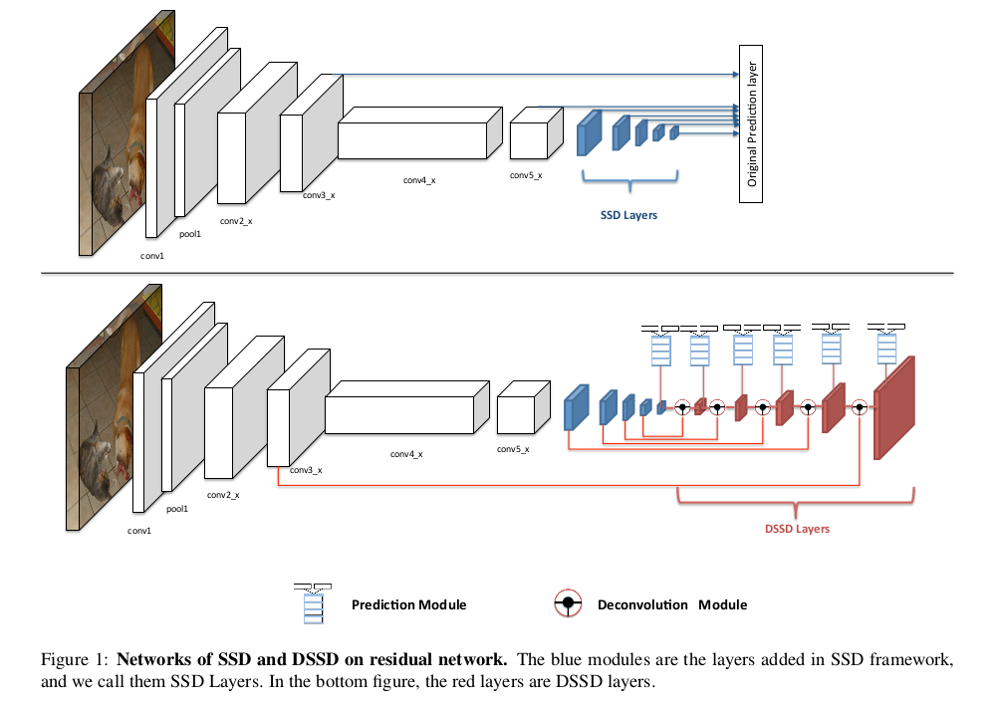
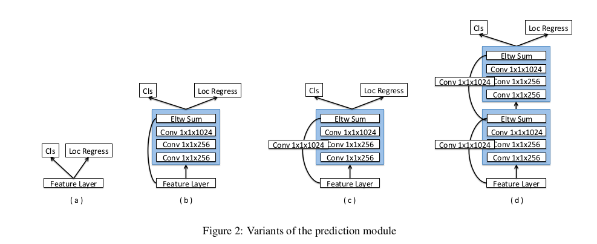
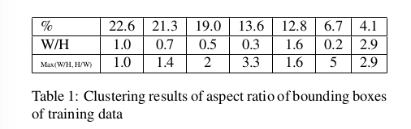
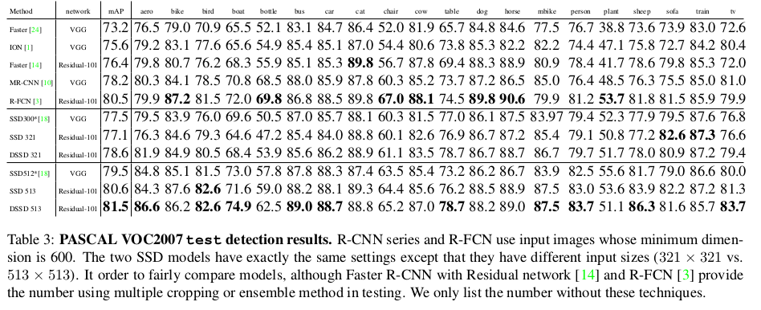
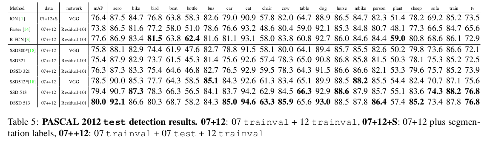

DSSD: Deconvolutional Single Shot Detector
=

# 1 Introduction
本文的主要贡献是将额外的上下文引入到最先进的一般对象检测中的方法，其组合了ResNet-101和SSD，并使用反卷积层在对象检测中引入大尺度上下文，并提高准确率，特别是针对小对象。模型架构为“encoder-decoder” 式的沙漏状结构。

# 3 Deconvolutional Single Shot Detection(DSSD) model

## 3.1 Using Residual-101 in place of VGG
第一个修改是使用Residual-101替换VGG，如图1所示。这里在conv5_x之后添加层，并使用conv3_x、conv5_x和额外层预测得分和边界框偏移。但这并不能改善结果。

**Prediction module**  
在原始的SSD中，目标函数直接应用于选择的特征图，并在conv4_3层使用L2标准化层，这是因为梯度的大量纲。MS-CNN指出改善每个任务的子网络可以提高准确率。遵循这种原则，为每个预测层添加一个残差块（如图2（c））。同时，尝试原始的SSD方法（a）、有skip connection的残差块（b）和两个连续残差块（d）。

**Deconvolutional SSD**  
 为了在检测中包含更高级的上下文，移动预测到反卷积层替换原始的SSD设置，高效的构建对称沙漏网络结构，如图1下面的结构。虽然沙漏模型在encoder和decoder阶段包含对称的层，但是DSSD让decoder中的卷积层变得很薄，这是由于（1）检测是视觉中一个基本的任务，并且可能需要为下游任务提供信息。因此，速度是一个重要的因素。构建对称的结构意味着推断速度加倍。（2）不存在使用ILSVRC CLS-LOC数据预训练的包含解码器的预训练模型，因为分类使用的整个图像的标签，而不是检测的局部区域标签。反卷积层的一个重要方面是计算成本，尤其是在除了反卷积过程之外还添加来自先前层的信息时。

**Deconvolutional Module**  
使用反卷积模块结合早期特征图和反卷积层，如图3 。

**Training**  
遵循SSD的训练策略。首先，匹配默认框，对于ground-truth，仅匹配具有最高重叠的默认框和Jaccard重叠大于阈值（如0.5）的默认框。没有匹配的默认框中，基于置信度损失采样，使得正负样本之比为 $1:3$ 。然后最小化定位损失（Smooth L1）和置信度损失（softmax）。由于没有如R-CNN的特征或者像素重采样，所以依赖扩展数据增强（随机裁剪、颜色扭曲和随机翻转）。SSD的数据增强非常有效，特别对于小对象。

在默认框的选择上作了小改变，为了了解训练数据（PASCAL VOC 2007和2012 trainval）中边界框的纵横比，在训练框上运行K-means聚类，其中框面积的平方根作为特征。并通过实验发现7个聚类簇时表现最佳。因为SSD框架将输入调整为正方形并且大多数训练图像更宽，所以大多数边界框更高并不奇怪。根据此表，我们可以看到大多数边界框纵横比都在1-3的范围内。 因此，决定再添加一个宽高比1.6，并在每个预测层使用 $(1.6,2.0,3.0)$ 。

# 4 Experiments

**Base network**  
遵循R-FCN，将conv5阶段的有效步长从32改为16，以增加特征图分辨率。然后遵循àtrous算法[15]，对于内核尺寸大于1的conv5阶段的所有卷积层，将它们的膨胀率从1增加到2以修复由减小的步幅引起的“空洞”。遵循SSD，使用Residual块来添加一些额外的层，以减少特征图的大小。图表2 。

**PASCAL VOC 2007**  
使用2007 trainval和2012 trainval训练模型。  
对于原始的SSD模型，使用batch size为32、输入 $321 \times 321$ 的输入，输入为 $513 \times 513$ 是batch size 为20 。前40k学习率为 $10^{-3}$，接着20k，学习率为 $10^{-4}$，最后 10k 学习率为 $10^{-5}$ 。使用训练好的SSD模型作为DSSD的预训练模型。第一阶段，通过固定原始SSD的所有权重，仅训练额外的反卷积层权重。前20k学习率为 $10^{-3}$ ，接着10k学习率为 $10^{-4}$ 。第二阶段，微调整个网络，前20k学习率为 $10^{-3}$ ，后20k学习率为 $10^{-4}$ 。表3给出了结果。

**Ablation Study on VOC2007**  

**PASCAL VOC 2012**   
使用 07+12的数据训练。对于SSD模型，前60k学习率为 $10^{-3}$，接着30k为 $10^{-4}$，最后10k学习率为 $10^{-5}$ 。对于DSSD，使用训练好的SSD作为预训练模型，根据表4的消融分析，仅需要训练阶段1，训练反卷积，前30k迭代学习率为 $10^{3}$ ， 然后20k学习率为 $10^{-4}$，结果如表5 。

**COCO**  
使用48的batch size（4张P40 GPU）训练SSD321， 使用20的batch size训练SSD513 。前160k学习率为 $10^{-3}$ ，接着60k学习率为 $10^{-4}$ ，最后 20k 学习率为 $10^{-5}$ 。根据观察，batch size 小于16， 并且在4个GPU上训练在batch normalization中造成不稳地结果和损害准确率 。

使用训练好的SSD作为DSSD的预训练模型。第一阶段，仅训练反卷积，前80k学习率为 $10^{-3}$ ，再继续训练50k，学习率为 $10^-{4}$ 。不进行第二阶段的训练，这是根据表4的结果。

**Inference Time**  
为了加速推理，在测试时，使用如下的公式移除网络的批归一化层。
$$
\begin{alignat}{0}
y = scale(\frac{(wx+b) - \mu}{\sqrt{var + \epsilon}} + shift)  \tag 1   \\
\hat{w} = scale(\frac{w}{\sqrt{var + \epsilon}})  \tag 2  \\
\hat{b} = scale(\frac{b-\mu}{\sqrt{var + \epsilon}}) + shift \tag3  \\
y = \hat{w} x + \hat{b}  \tag 4
\end{alignat}
$$
其中 $\epsilon = 10^{-5}$ 。

