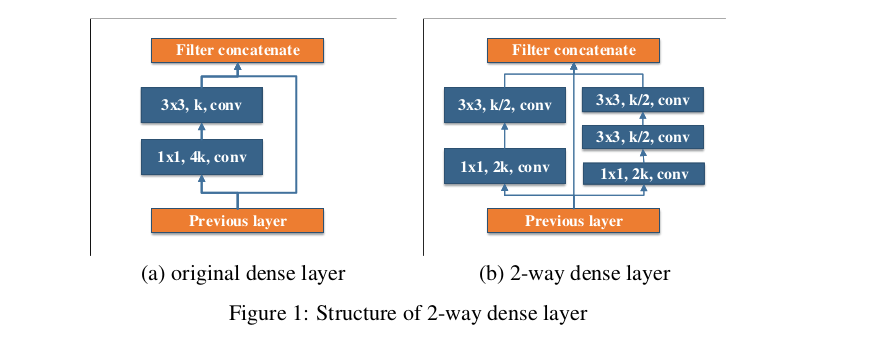
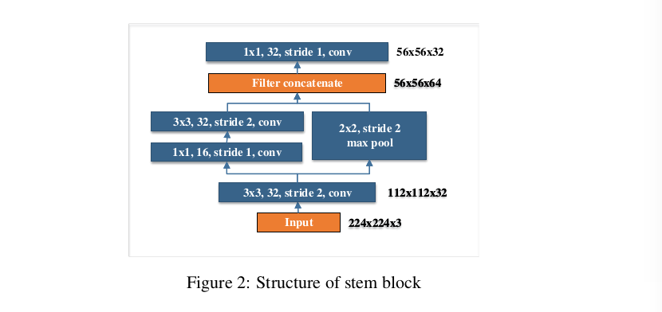
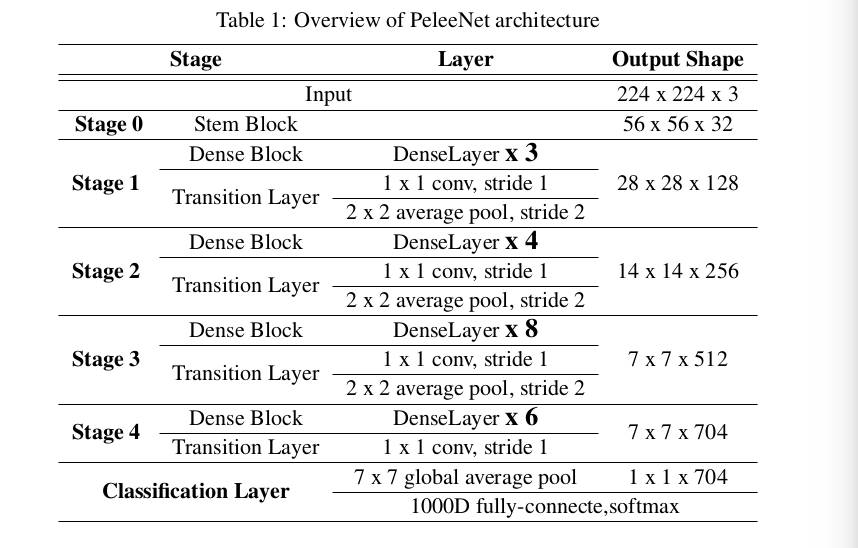
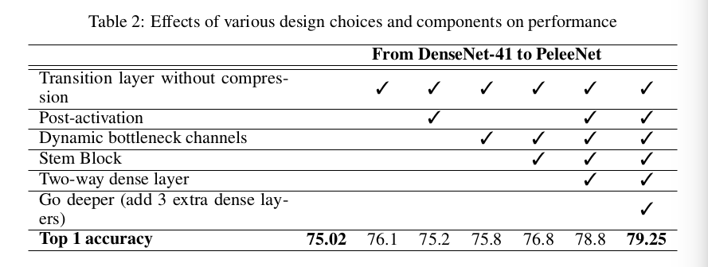
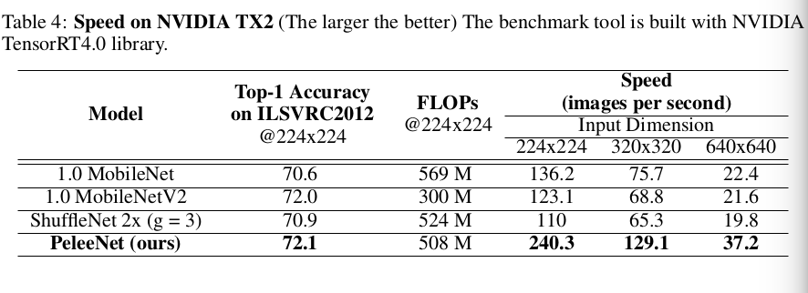
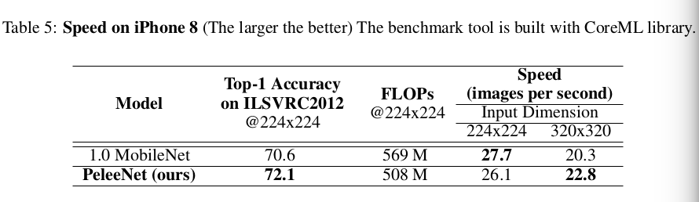
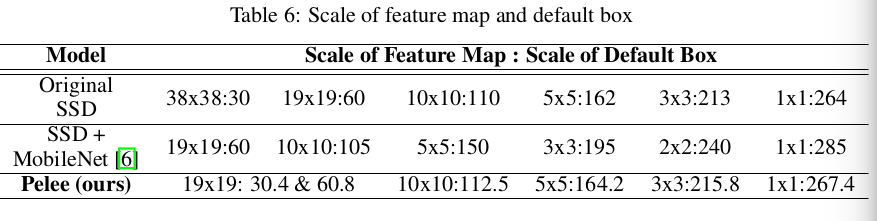

Pelee: A Real-Time Object Detection System on Mobile Devices
=

# 1. Introduction
在严格限制内存和计算预算的情况下，人们越来越关注运行高质量的CNN模型。许多创新的架构，如MobileNets、ShuffleNet、NASNet-A、MobileNetV2，在最近几年被提出。然而，然而，所有这些架构都严重依赖于深度可分的卷积[5]，缺乏有效的实现。同时，很少有研究将有效模型与快速物体检测算法结合起来[6]。

本研究试图探索用于图像分类任务和目标检测任务的高效CNN架构的设计。它列出了一些主要贡献如下：

**我们提出用于移动设备的DeneseNet的变体，称为 PeleeNet 。** PeleeNet 遵循 DenseNet 的连接模式和一些关键设计原则。它还旨在满足对内存和计算预算的严格限制。Stanford Dog 数据上实验结果表明，我们所提出的 PeleeNet 的准确率比原始的 DenseNet 架构高 5.05% ， 比MobileNet 高 6.53% 。PeleeNet 在 ImageNet ILSVRC 2012 数据集上也取得令人注目的结果，其 Top-1 准确率为72.1% ，比 MobileNet 高 1.6% ，更关键的是其模型大小仅为 MobileNet 的66% 。PeleeNet 的关键特点如下：
- **Two-Way Dense Layer** 受 GooLeNet 启发，我们使用 2-way 密集层来获得不同尺度的感受野。一路使用 $3 \times 3$ 卷积核，另一路使用两个堆叠的 $3 \times 3$ 卷积以学习到目标的世界模式，结果如图 1 。

- **Stem Block** 受 Inception-v4 和 DSOD 启发，我们设计在第一个密集层之前设计了一个茎干（stem）块，其结构如图2 。该茎干块可以有效地改善特征表达能力而不会过多地增加计算成本 —— 优于其他更昂贵的方法，例如，增加第一卷积层的通道或增加生长速率。

- **Dynamic Number of Channels in Bottleneck Layer** 另一个两点是瓶颈层中通道的数量根据输入的形状变化，而不是原始 DenseNet 中使用的固定的 4 被增长率。在 DenseNet 中，我们观察到前几个密集层中，瓶颈层的通道数远大于其输入通道数，这意味着，在这些层中，瓶颈层增大了计算成本，而不是减少计算成本。为了维持结构的一致性，我们仍然将瓶颈层添加到所有的密集层中，但是数量根据输入形状动态调整。相比原始的 DenseNet 结构，我们的实验表明这种方法可以节约 28.5% 的计算成本，这仅对准确率造成很小的影响。

- **Transition Layer without Compression** 我们的实验表明 DenseNet 所提出的压缩因子损害特征表达。在过渡层中，我们始终保持输出通道数与输入通道数相同。

- **Composite Function** 为了提高实际速度，我们使用“post-activation”（Convolution-BN-ReLU） 作为混合函数，而不是 DenseNet 中使用的预激活（pre-activation）。对于后激活，所有批量归一化层都可以在推理阶段与卷积层合并，这可以大大加快速度。我们也在最后一个密集块之后添加 $1\times 1$ 卷积层以获得更强的表征能力。

**我们优化了Single Shot MultiBox Detector（SSD）[13]的网络架构以实现速度加速，然后将其与PeleeNet相结合。** 我们所提出的系统，称为 Pelee ，在 PASCAL VOC 2007 上获得 76.4% mAP，在 COCO 上获得 22.4 % mAP 。在准确率、速度和模型大小方面优于 YOLOv2 。为平衡速度和准确性而提出的主要改进是：
- **Feature Map Selection** 我们以不同于原始SSD的方式构建物体检测网络，并精心选择 5 个尺度的特征图（ $19 \times 19$ ， $10 \times 10$ ， $5 \times 5$ ， $3 \times 3$ 和 $1 \times 1$ ）。 为了降低计算成本，我们不使用 $38 \times 38$ 特征映射。

- **Residual Prediction Block** 我们遵循[16]提出的设计思想，鼓励在特征提取网络中传递特征。对于用于检测的每个特征图，我们在执行预测前构建残差块（ResBlock），ResBlock 的结构如图4 。

- **Small Convolutional Kernel for Prediction** 残差预测块使得使用 $1 \times 1$ 卷积核预测类别得分和边界框偏移称为可能。我们的实验表明使用 $1 \times 1$ 核的准确率和使用 $3 \times 3$ 核几乎一样。然而， $1 \times 1$ 核使得计算成本减小 21.5% 。

我们为NVIDIA TX2嵌入式平台和iPhone 8上的不同高效分类模型和不同的一阶段目标检测方法提供基准测试。

# 2 PeleeNet: An Efficient Feature Extraction Network
## 2.1 Architecture

PeleeNet 的架构如表1 。整个网络由茎干块和4个阶段的特征提取器组成。处理最后一个阶段，在每个阶段的最后一层为步长为 2 的平均池化层。四阶段结构是大型模型设计中常用的结构。ShuffleNet 使用 3 阶段结构，并在每个阶段的开始处缩小特征图大小。尽管这可以有效地减小计算成本，但是我们任务早期特征对于视觉任务非常重要，并且过早减少特征图大小会削弱表征能力。前两个阶段中的层数被特定地控制到可接受的范围。

## 2.2 Ablation Study
### 2.2.1 DataSet
我们构建了自定义的 Stanford Dog 数据集用于消融研究。 Stanford Dogs 数据集包含 120 中狗的图像。该数据集是使用ImageNet中的图像和标注构建的，用于细粒度图像分类。我们相信用于这种任务的数据集是足够复杂的以致于能够评估网络架构的性能。然而，在原始的 Stanford Dog 数据集中，仅有 14580 张训练图像，且大约每个类有 120 张图像，这不足以从头训练模型。我们没有使用最初的 Stanford Dogs，而是根据Stanford Dogs中使用的ImageNet构建了ILSVRC 2012的子集。训练数据和验证数据都是从ILSVRC 2012数据集中精确复制的。在接下来的章节中，Stanford Dogs 表示 ILSVRC 2012 数据集的子集，而不是原始的数据集。该数据集包含：
- 120 个类；
- 150466 张训练图像；
- 6000 张验证图像。

### 2.2.2 Effects of Various Design Choices on the Performance
我们构建了类似 DenseNet 的网络，称为 DenseNet-41，作为基线模型。该模型与原始的 DenseNet 有两个不同之处。第一个是，第一个卷积层的参数，DenseNet-41 第一个卷积层的参数为 24 而不是 64 ， 核大小从 $7 \times 7$ 变为 $3 \times 3$ 。第二个是，每个密集块的层数调整到满足计算预算。

本节的所有模型使用 PyTorch 以 mini-batch 大小 256 训练 120 个 epoch 。我们遵循 ResNet 的大多数参数设置和超参数。表 2 展示了不同设计选择的有效变体的性能。我们可以看到，在结合所有这些设计选项后，PeleeNet 在 Stanford Dogs 上获得 79.25% 的准确率，这比 DenseNet-41 高 4.23% ，并且有更少的计算成本。

## 2.3 Results on ImageNet ILSVRC 2012
在 2 个 GPU 上使用 PyTorch 以 mini-batch 大小 512 训练 PeleeNet 。该模型采用余弦学习率退火进行训练，类似于[18]和[19]所使用的计划。初始学习率设为 0.18 ，并且 epoch 总量为 120 。r然后，我们使用初始学习率 $5-3$ 微调 20 epoch 。其他超参数与 Stanford Dogs 数据集使用的超参数相同。

**Cosine Learning Rate Annealing** 学习率以余弦形状衰减（epoch $t(t \le 120)$ 的学习率设置为 $0.5 \times lr \times (\cos(\pi \times t / 120) + 1)$ ）。

从表 3 可以看出，PeleeNet 实现了比 MobileNet和 ShuffleNet 更高的精度，模型大小不超过它们的 66％ 且计算成本更低。 PeleeNet 的模型大小仅为 VGG16 的 $1/49$ 。

## 2.4 Speed on Real Devices

# 3. Pelee: A Real-Time Object Detection System

## 3.2 Results on VOC 2007
批大小为 32 。初始学习率设置为 0.005 ，然后在 80k 和 100k 迭代时较小 10 倍。总迭代次数为 120K 。

### 3.2.1 Effects of Various Design Choices

### 3.2.2 Comparison with Other Frameworks

## 3.3 Results on COCO
使用 COCO train+val 数据集训练模型， 使用 test-dev2015 集评估。批大小为 128 。首先，在 70k 迭代中使用学习率 $10^{-2}$ ，接着在 10k 迭代和 20k 迭代时分别使用学习率 $10^{-3}$ 和 $10^{-4}$ 继续训练。结果如表 9 。

## 3.4 Speed on Real Devices

