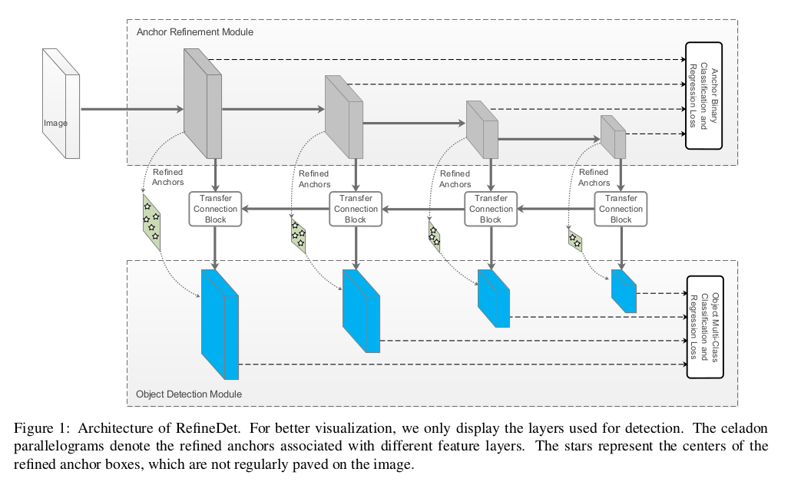
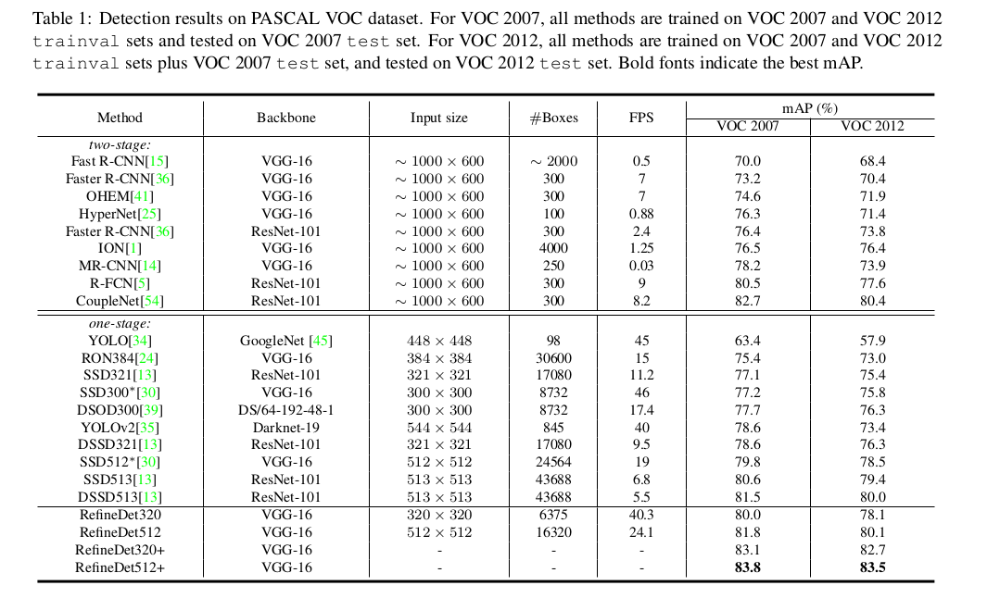
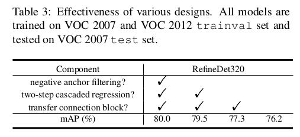

Single-Shot Refinement Neural Network for Object Detection
=

# 1 Introduction
一阶段方法通过对位置、尺度和纵横比进行规则和密集采样来检测物体。这种方法的主要优势是高计算效率。然而，它的检测准确率通常落后两阶段方法，一个主要原因是由于类别不平衡问题。

一阶段方法中的一些最近方法旨在解决类不平衡问题，以提高检测精度。《RON:reverse connection with objectness prior networks for object detection》在卷积特征映射上使用对象先验约束来显着减少对象的搜索空间。《Focal loss for dense object detection》通过重塑标准交叉熵损失来解决类不平衡问题，以便将训练集中在一组稀疏的硬实例（hard example）上并降低分配给容易分类（well-classified）的样本的损失。《 $S^3FD$ : Single shot scale-invariant face detector》设计max-out标签机制以从类别不平衡中减小假阳性（false positive）。

在我们看来，当前最佳的两阶段方法，如Faster R-CNN、R-FCN和FPN，比起一阶段方法有三个优势： （1）使用采样启发式处理类别不平衡的两阶段结构；（2）使用两步级联回归对象边界框参数；（3）使用两阶段特征描述对象。本文中，设计了一种新颖的对象检测框架，称为RefineDet，以继承两种方法（即一阶段和两阶段方法）的优点并克服它们的缺点。它通过使用两个互联的模块来改善一阶段方法框架，这两个模块是锚点精炼模块（ARM: anchor refinement module）和对象检测模块（ODM: object detection module）。具体地，ARM设计用于（1）确定和移除负anchor以减少用于分类的搜索空间，（2）粗糙地调整anchor的位置和大小为后续回归器提供更好的初始化。ODM将精炼锚点作为前者的输入，以进一步改进回归并预测多类标签。如图1，这两个相互连接的模块模仿两级结构，从而继承了上述三个优点，高效率地产生准确的检测结果。此外，还设计了转移连接块（transfer connection block: TCB）来转移ARM中的特征到预测ODM中对象的位置、大小和类别。多任务损失函数可以确保端到端地训练整个网络。

本文的主要贡献如下：
1. 引入一种新颖的一阶段框架用于对象检测，其有两个互联的模块（即ARM和ODM）组成，这产生比两阶段方法更好的性能，同时维持一阶段方法的高效率。
2. 为了确保效率，设计了TCB用于转移ARM中的特征以处理更具挑战性的任务，即预测ODM中准确的对象位置、大小和类标签。
3. RefineDet在通用对象检测（即PASCAL VOC2007,VOC2012和MS COCO）上获得最佳结果。

# 2 Related Work
**Classical Object Detector.** 早期的对象检测方法是基于滑动窗口，它使用手工设计的特征和分类器在密集的图像网格中寻找对象。作为其中一个最成功的方法，《Rapid object detection using a boosted cascade of simple features》使用Haar特征和AdaBoost训练一系列级联分类器用于人脸检测，以高效率实现令人满意的精度。DPM [12]是另一种流行的方法，它使用多尺度可变形零件模型的混合来表示高度可变的对象类，在PASCAL VOC上维持最高结果数年。

**Two-Stage Approach.**

**One-Stage Approach.**

# 3 Network Architecture

ARM旨在确定和移除负anchor以减小搜索空间用于后续回归器，而ODM旨在基于精炼anchor回归准确的对象位置和预测多类别标签。ODM由TCB的输出和预测层（即，具有3×3内核大小的卷积层）组成，其产生对象类的分数和相对于精细的锚框坐标的形状偏移。

**Transfer Connection Block.** 为了链接ARM和ODM，引入TCB来转换来自ARM的不同层的特征到ODM需要的形式，使得ODM可以共享来自ARM的特征。值得注意的是，从ARM中，仅在与锚相关联的特征图上使用TCB。TCB的另一种功能是通过添加高层特征到转移特征以集成大尺度上下文来提升检测准确率。为了匹配它们之间的维度，使用反卷积操作扩大高层特征，并以逐元素的方式相加。然后，我们在求和之后添加卷积层以确保用于检测的特征的可辨别性。TCB的结构如图2 。

**Two-Step Cascaded Regression.** 当前一阶段方法依赖基于不播能够尺度的特征层来预测对象的位置和大小的一步回归，这在某些场景（特别是小对象）下是不准确的。本文提出两步级联回归策略来回归对象位置和大小。即，使用ARM调整anchor的位置和大小为ODM中的回归提供更好的初始化。具体地，具体来说，将 $n$ 个锚框与特征图上的每个规则划分的单元格相关联。每个锚框的初始位置相对于其相应单元的初始位置是固定的。在每个特征图单元，预测精制锚箱相对于原始平铺锚点的四个偏移量和两个置信度分数，表明这些框中存在前景物体。因此，在每个特征图单元产生 $n$ 个精炼锚框。

在获得精炼锚框之后，将它们传递给ODM中相应的特征图以进一步生成对象类别和准确的对象位置和大小，如图1所示。精炼anchor的过程与原始的SSD相似，精炼过程预测 $c$ 个类别得分和4个偏移值。

**Negative Anchor Filtering.** 为了早期拒绝分类良好的负锚并减轻不平衡问题，设计了一种负锚过滤机制。具体地，在训练阶段，对于一个精炼锚框，如果其负类置信度大于预设的阈值 $\theta$ （即，设置 $\theta = 0.99$），就在ODM中丢弃该锚框。同时，在推理阶段，如果精炼锚框被赋予大于 $\theta$ 的负置信度，则它将在ODM中被丢弃以进行检测。

# 4 Training and Inference
**Data Augmentation.** 使用SSD中提出的几种数据增强策略来构建一个适应对象变化的鲁棒模型。也就是说，随机扩展并使用额外的随机光度失真[20]裁剪原始训练图像并翻转以生成训练样本。

**Backbone Network.** 在RefineDet中使用VGG-16和ResNet-101作为骨干网络，它们使用ILSVRC CLS-LOC数据集上预训练。与DeepLab-LargeFOV相似，通过子采样参数将VGG-16的fc6和fc7转换成卷积层conv_fc6和conv_fc7 。因为conv4_3和conv5_3相比于其他层有不同的特征尺度，使用L2_normalization将conv4_3和conv5_3缩放到10和8 ，然后在反向传播中学习尺度。同时，为了捕获高层信息和驱动对象检测，还在截断的VGG-16的末尾添加了两个额外的卷积层（即conv6_1和conv6_2）以及一个额外的残差块（即res6）到截断的ResNet-101的末尾。

**Anchors Design and Matching.** 为了处理不同尺度的对象，为VGG-16和ResNet-101选择歩幅大小为 $8, 16, 32, 64$ 像素的4个特征层，对应集中不同尺度的anchor用于预测。每个特征图关联一个特定尺度的anchor（即，尺度是相应层的总歩幅大小的4倍），并且有3个纵横比（即0.5,1.0和2.0）。遵循 $S^3FD$ 中不同层anchor尺度的设计，这确保不同尺度的anchor在图像上有相同的平铺密度。同时，在训练期间，根据jaccard重叠[7]确定锚点和ground-truth框之间的对应关系，并相应地端对端地训练整个网络。具体地，首先将每个ground-truth与具有最佳重叠分数的锚框匹配，然后将锚框与任何重叠高于0.5的ground-truth匹配。

**Hard Negative Mining.** 在匹配步骤之后，大多数anchor框是负的，即使对ODM也一样，其中一些容易分类的负anchor在ARM中被拒绝。与SSD相似，使用hard negative mining消除极端的前景-后景的类别不平衡（即，选择一些最高损失值的负anchor使得正负比例为 $1:3$ ），而不是使用所有的负anchor或随机选择负anchor。

**Loss Function.** RefineDet的损失函数由两部分组成，即ARM损失和ODM损失。对于ARM，为每个锚分配一个二进制类标签（对象与否），并同时回归其位置和大小以获得精确的锚。之后，将负置信度小于阈值的精炼锚框传递给ODM以进一步对象类别和准确的对象位置和大小。使用这些定义，损失函数定义为：
$$
\begin{align}
\cal{L}(\{p_i\}, \{x_i\}, \{c_i\}, \{t_i\} = \frac{1}{N_{arm}}(\sum_iL_b(p_i, [l_i^\ast \ge 1])  \\
+ \sum_i[l_i^\ast \ge 1]\cal{L}_r(x_i, g_i^\ast))  \\
+ \frac{1}{N_{odm}}(\sum_i \cal{L}_m(c_i, l_i^\ast)  \\
+ \sum_i[l_i^\ast \ge 1] \cal{L}_r(t_i, g_i^\ast))
\end{align}  \tag 1
$$

其中， $i$ 是mini-batch中anchor的索引， $l_i^\ast$ 是anchor $i$ 的ground-truth类别标签， $g_i^\ast$ 是anchor $i$ 的ground-truth的位置和大小。 $p_i$ 和 $x_i$ 是ARM中的anchor $i$ 为对象的预测置信度和anchor $i$ 的精炼坐标。 $c_i$ 和 $t_i$ 是ODM中预测对象类和边界框坐标。 $N_{arm}$ 和 $N_{odm}$ 是ARM和ODM中正类anchor的数量。二值分类损失 $\cal{L}_b$ 两个类别的交叉熵/对数损失（object vs. not object），并且多分类损失 $\cal{L}_m$ 是对类别置信度的softmax损失。与Fast R-CNN相似，使用smooth L1损失作为回归损失 $\cal{L}_r$ 。当条件为正（ $l_i^\ast \ge 1$ ）时，方括号指示函数 $[l_i^\ast \ge 1]$ 输出1，否则为0 。因此， $\sum_i[l_i^\ast \ge 1]\cal{L}_r$ 指示回归函数忽略负anchor。注意，如果 $N_{arm} = 0$ ，设置 $\cal{L}_b(p_i, [l_i^\ast \ge 1]) = 0$ ， $\cal{L}_r(x_i, l_i^\ast) = 0$ ;并且如果 $N_{odm} = 0$ ， 设置 $\cal{L}_{m} = 0$ ， $\cal{L}_r(t_i, g_i^\ast) = 0$ 。

**Optimization.**  使用预训练的VGG-16和ResNet-101，添加的额外层使用“Xavier”初始化。batch size = 32 ， momentum = 0.9 ，weight decay = 0.0005 。初始学习率为 $10^{-3}$ ，对于不同数据集使用略微不同的学习率衰减策略。

**Inference.** 在推理阶段，ARM首先使用负置信度大于阈值 $\theta$ 过滤掉规则平铺的anchor ，并且然后精炼余下下锚的位置和大小。之后，ODM使用这些精炼anchor，并且每幅图像输出前400个高置信度检测。最后，应用非最大抑制，每个类别的jaccard重叠为0.45，并保留每个图像的前200个高可靠检测以产生最终检测结果。

# 5 Experiments
## 5.1 PASCAL VOC 2007
所有模型在VOC2007和VOC2012训练验证集上训练，并在VOC2007测试集上测试。前80k迭代学习率为 $10^{-3}$ ，在后面的20k和20k时学习率衰减到 $10^{-4}$ 和 $10^{-5}$ 。结果如表1 。

### 5.1.1 Run Time Performance
如表1所示，RefineDet在输入大小为 $320 \times 320$ 和 $512 \times 512$ 时，处理每张图像需要24.8ms（40FPS）和41.5ms（24.1FPS）。

### 5.1.2 Ablation Study

## 5.2 PASCAL VOC 2012
使用VOC2007训练验证集和测试集 + VOC2012训练测试集（21503张图像），在VOC2012测试集（10991张图像）上测试。batch size = 32 ，前160k次迭代学习率为 $10^{-3}$ ，后面40k和40k迭代学习衰减为 $10^{-4}$ 和 $10^{-5}$ 。结果如表1 。

## 5.3 MS COCO
batch size = 32 ， 前280k迭代学习率为 $10^{-3}$ ，后面80k和40k迭代学习分别为 $10^{-4}$ 和 $10^{-5}$ 。结果如表7 。

## 5.4 From MS COCO to PACSL VOC2007
本节研究MS COCO上预训练的模型对PASCAL VOC2007的影响，如表4 。

