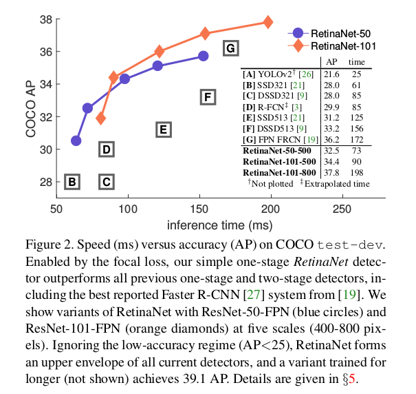
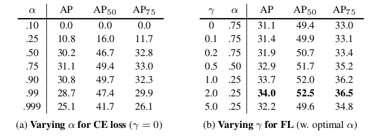
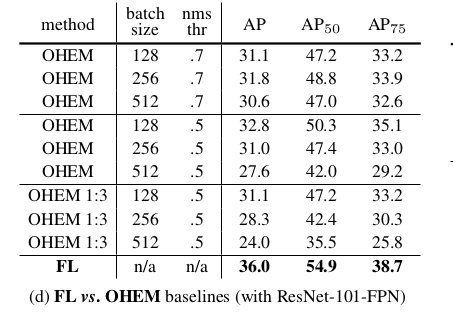

Focal Loss for Dense Object Detection
=

# 1 Introduction
一阶段检测能否获得与两阶段检测器相似的准确率吗？一阶段检测器是应用于对象位置、尺度和纵横比的规则而密集采样。训练期间的类别不平衡是妨碍一阶段检测其获得最佳准确率的主要障碍。

在R-CNN类检测其中，类别不平衡被两阶段级联和启发式采样处理。其提议生成阶段逐渐将候选对象的数量缩小到很小的数量（例如1-2k），其过滤掉了最可能的背景样本；第二阶段为分类，启发式的采样，例如固定前景背景之比为 1:3 ，或者使用在线难样本挖掘（OHEM）。

相比之下，一阶段检测器必须处理图像中规则采样的大量候选对象位置。实际上，密集覆盖空间位置、尺度和纵横比的数量大约为 100k 。同时使用了相似的启发式采样，但是容易分类的背景样本仍然处于主导地位，因此这种采样是无效的。

本文中，提出一种新的损失函数来扮演一个更有效的替代先前处理类别不平衡的方法。损失函数是动态缩放的交叉熵损失，其中缩放因子随着错误类别的增加的置信度衰减到0 ，如图 1 。直观上，这种缩放因子可以自动减小易分样本的贡献，并且逐渐聚焦到难分样本。图2是与其他方法的比较。

# 3 Focal Loss
从交叉熵开始介绍 _Focal Loss_ ，对于二分类的交叉熵（CE）为：
$$
CE(p, y) =
\begin{cases}
-\log(p) & \mbox{ if } y = 1  \\
-\log(1-p) & \mbox{otherwise}
\end{cases}  \tag 1
$$
其中 $y \in \{\pm 1\}$ 指明ground-truth类， $p \in [0, 1]$ 是模型在类标签 $y = 1$ 时的估计概率。为了标记方便，定义 $p_t$ :
$$
p_t =
\begin{cases}
p & \mbox{ if } y = 1  \\
1 - p  & \mbox{otherwise}
\end{cases}  \tag 2
$$
并且重写 $CE(p, y) = CE(p_t) = -\log(p_t)$ 。

这种CE损失如图1蓝色的曲线。这种损失的一个值得注意的特性，可以很容易地从其图中看出，即使是容易分类的例子（ $p_t \gg .5$ ）也会导致非平凡的损失。当总结大量易分样本时，这些小的损失值可以压倒罕见的类。

## 3.1 Balanced Cross Entropy
常见的用于处理类别不平衡的方法是为类1引入权重因子 $\alpha \in [0, 1]$ ，类 $-1$ 则为 $1 - \alpha$ 。在实践中，$\alpha$ 可以通过设置类频率的逆或者被视为超参数以通过交叉验证来设置。为了符号方便，将 $\alpha_t$ 定义为类似于定义 $p_t$:
$$CE(p_t) = -\alpha_t \log(p_t)  \tag 3$$
这种简单的扩展处理了多数类和少数类的不平衡。

## 3.2 Focal Loss Definition
在密集探测器的训练过程中遇到的巨大的类不平衡压倒了交叉熵损失。*容易分类的负样本占据损失函数的主要部分，并主导梯度。虽然 $\alpha$ 平衡了正/负样本的重要性，但它并没有区分易分/难分样本。* 相反，我们建议重塑损失函数，以减小易分样本的损失，从而集中训练难分样本。

添加一个调节因子（modulating factor）$(1 - pt)^\gamma$ 到交叉熵损失，可调聚焦(tunable focusing)参数 $\gamma \ge 0$。定义焦点损失为：
$$FL(p_t) = -(1 - p_t)^\gamma \log(p_t)  \tag 4$$
图1展示了几个 $\gamma \in [0, 5]$ 值。焦点损失有两个特性：
- 当一个样本被误分，并且 $p_t$ 很小时，调节因子接近1，并且损失不受影响。当 $p_t \rightarrow 1$ ，调节因子趋近0，并且容易分类的样本的损失被down-weighted。
- 聚焦参数 $\gamma$ 平滑地调整易分被加权的速率。当 $\gamma = 0$ 时，FL 等价于 CE ，并且随着 $\gamma$ 的增加，调节因子的作用同样增加（我们发现 $\gamma = 2$ 在我们的实验中效果最好）。

直观地，调制因子减少了易分样本的损失贡献，并扩展了样本接收低损失的范围。例如，当使用 $\gamma = 2$ 时，以 $p_t = 0.9$ 分类的样本比CE低100倍的损失，当 $p_t \approx 0.968$ 时低1000倍。这反过来又增加了纠正错误分类的例子的重要性（当 $p_t \le 0.5, \gamma = 2$ 时，其损失被减小最多4倍）。

在实践中，使用Focal Loss的 $\alpha$ 平衡变体：
$$FL(p_t) = -\alpha_t (1 - p_t) ^ \gamma \log(p_t)  \tag 5$$
注意，损失层的实现将用于计算 $p$ 的sigmoid操作与损失计算相结合，从而产生更大的数值稳定性。

## 3.3 Class Imbalance and Model Initialization
无论 $y = -1  \mbox{ or } 1$ ，二分类模型都被初始化为等概率输出。在这种初始化下，类别不平衡的存在，由于高频类别主导全部损失，并引起训练早期的不稳地。为了解决这个问题，在训练开始时引入由模型估计稀有类（前景）的 $p$ 值的“先验”概念。用 $\pi$ 表示这个先验，并设置它使得模型的稀有类样本的估计值 $p$ 很低，例如0.01 。

## 3.4 Class Imbalance and Two-stage Detectors
两阶段方法通过（1）两阶段级联（2）有偏差的小批量采样（正负样本 $1:3$ ）来处理类别不平衡。

# 4 RetinaNet Detector

**Feature Pyramid Network Backbone:** 采用ResNet-FPN作为骨干网络，金字塔层级从 $P_3$ 到 $P_7$ ，其中 $l$ 表示金字塔层级（$P_l$ 的分辨率比输入小 $2^l 倍$） 。所有金字塔层级有 $C = 256$ 个通道，详细设计如FPN 。 $P_6$ 通过 $3\times3$ ，步长为2的卷积在 $C_5$ 上产生， $P_7$ 通过应用ReLU后跟 $3\times3$ ，步长为2的卷积在 $P_6$ 上产生 。与FPN不同，（1）出于计算原因，不使用更高分辨率的 $P_2$ ；（2） $P_6$ 通过带步长的卷积计算，而不是下采样；（3）使用 $P_7$ 改善大尺度对象的检测。

**Anchors:** Anchors具有平移不变形， $P_3$ 到 $P_7$ 的面积分别为 $32^2$ 到 $512^2$ ，金字塔的每级都有纵横比 $\{1:2, 1:1, 2:1\}$ 。为了比FPN更密集的尺度覆盖，在每个级别，向原始3个纵横比锚点的尺寸中添加 $\{2^0, 2^{1/3}, 2^{2/3}\}$ 的锚。因此，每级包含 $A = 9$ 个anchor，它们的覆盖范围从32个像素到813个像素 。

每个anchor分配长度为 $K$ 的one-hot分类目标向量，其中 $K$ 是对象类别的数量，并且4个向量的边界框回归目标。匹配规则为：IoU阈值为0.5，大于0.5则为前景，背景的IoU在 $[0, 0.4)$ 内。因为每个anchor最多被分配一个对象边界框，所以将其长度为 $K$ 的标签向量中的相应条目（entry）设置为1，将所有其他条目设置为0。IoU值在 $[0.4, 0.5)$ 的anchor则忽略。边界框回归计算的是anchor和分配的对象框之间的偏移。

**Classification Subnet:** 分类子网络预测 $A$ 个anchor和 $K$ 个对象类别在每个空间位置中存在对象的概率。它是一个小型的FCN，其参数在所有的金字塔层级中共享。给定来自金字塔层级的 $C$ 通道特征图，子网络应用4个 $3 \times 3$ 、C个滤波器的卷积，并后接ReLU激活，最后是一个 $KA$ 通道的 $3\times3$ 卷积。最后使用sigmoid激活来输出 $KA$ 个二值预测，其结构图图3（c）。本文中 $C = 256$ ， $A = 9$ 。

相较于RPN，本文的对象分类分支更深，且仅使用 $3\times3$卷积，并且不与边界框回归分支共享参数。

**Box Regression Subnet:** 边界框回归子网络是另一个小型的FCN，旨在回归每个anchor与其附近的ground-truth之间的偏移。它的设计与分类子网络相同，除了最后的卷积产生 $4A$ 个线性输出，如图3（d）。

## 4.1 Inference and Training
**Inference:** 为了提高速度，在将检测器置信度设置为0.05后，我们仅解码每FPN级别最多1k最高得分预测的边界框预测。并将这些预测合并，并使用阈值为0.5的NMS产生最终预测。

**Focal Loss:** Focal Loss 在所有大于100k个anchor上计算，并由分配ground-truth 的anchor的数量规范化，而不是所有的anchor，这是由于大多数anchor是易分的负样本并且在focal loss下获得可忽略不计的损失值。本文设置 $\gamma = 2, \alpha = 0.25$ 时工作最佳，但是这两个超参数都有较高鲁棒性的取值范围，图表1 。

**Initialization:** 本文实验了 ResNet-50-FPN和Res-101-FPN，都使用ImageNet1k预训练。新添加到RetinaNet的层（除最后一层外）使用偏差 $b = 0$ 和 $\sigma = 0.01$ 的高斯分布初始化。分类子网络的最后一层中，偏差初始化为 $b = -\log((1 - \pi) / \pi)$ ，其中 $\pi$ 表明开始训练时，每个anchor标记为前景的置信度应约为 $\pi$ ，本文使用个 $\pi = 0.01$ 。如3.4节介绍的，此初始化可防止大量背景锚点在第一次训练迭代中生成大的，不稳定的损失值。

**Optimization:** 使用8个GPU训练，每个GPU输入两幅图像。初始学习率为0.01，并迭代90k；在60k和80k迭代时除以10 。仅使用水平翻转增强图像。weight decay = 0.0001， momentum = 0.9 。使用focal loss和smooth L1损失之和训练。表1（e）为速度与准确率的比较。

# 5 Experiments
- Balanced Cross Entropy: 如表1a所示，使用 $\alpha$ 平衡的交叉熵的影响。  

- Focal Loss: 表1b给出了focal损失的影响。   

- Analysis of the Focal Loss:

- Online Hard Example Mining(OHEM):

# Appendix A: Focal Loss*
一种与Focal loss相当的替代方案，具体地址，定义 $x_t$ 如下：
$$x_t = yx  \tag 6$$
其中 $y \in \{\pm 1\}$ 是否为ground-truth。显著可以重写 $p_t = \sigma(x_t)$ 。当 $x_t > 0$ 时，样本正确分类，此时 $p_t > 0.5$ 。

因此可以定义如下：
$$p_t^\ast = \sigma(\gamma x_t + \beta)  \tag 7$$
$$FL^\ast = -\log(p_t^\ast ) / \gamma  \tag 8$$
$FL^\ast$ 有两个参数， $\gamma$ 和 $\beta$ ，控制损失曲线的坡度（steepness）和平移，如图5 ， 表3是不同配置时的检测结果。

