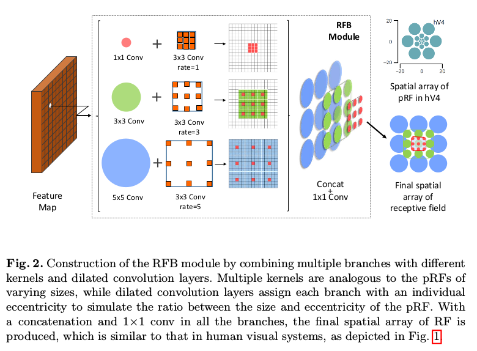
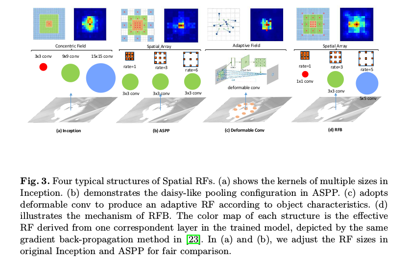
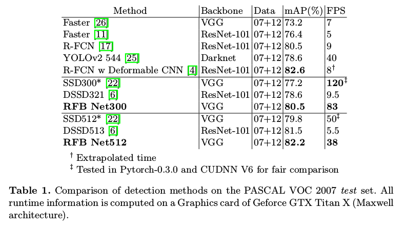
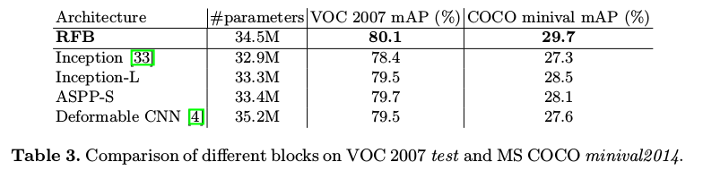
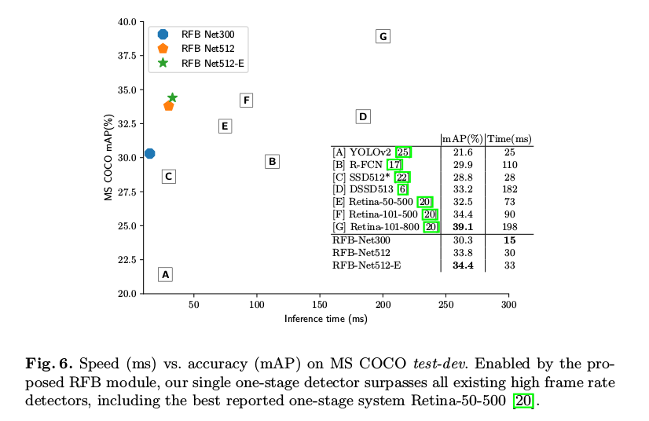

Receptive Field Block Net for Accurate and Fast Object Detection
=

# 1 Introduction
最近几年，基于区域的CNN及其其代表性更新后代，例如Fast R-CNN和Faster R-CNN，在Pascal VOC [5]，MS COCO [21]和ILSVRC [27]等主要挑战和基准测试中持续提升了物体检测的性能。他们将此问题表述为两阶段问题并构建典型的管道，其中第一阶段假设给定图像内的类别无关的对象提议，第二阶段根据基于CNN的深度特征对每个提议进行分类。通常认为，在这些方法中，CNN表示起着至关重要的作用，并且所学习的特征期望提供高辨别力的编码对象特性和良好的鲁棒性，尤其是对于适度的位置偏移（通常由不准确的框引起）。FPN、Mask R-CNN等基本上是使用高计算成本的深度神经网络，使得它们遭受低推理速度的困扰。

为了加速检测，一种一阶段框架出现了，其对象提议生成阶段被丢弃。虽然YOLO和SSD展示了实时处理的能力，但是牺牲了准确性。最近，DSSD和RetinaNet实质上改善准确率得分，不幸的是它们的性能提升依靠非常深的ResNet-101，这限制了效率。

根据上面的讨论，为了构建快速而强大的检测器，合理的替代方案是通过引入某些手工制作的机制来增强轻量级网络的特征表示，而不是顽固地加深模型。另一方面，神经科学中的一些发现揭示，在人类视觉皮层中，population Receptive Field（pRF）的大小是其视网膜定位图中偏心率的函数，虽然定位图之间会变化，但它在每个定位图中随着偏心率的增加而增加[36]，如图1所示。它有助于彰显靠近中心区域的重要性并提升小空间位移带来的不灵敏度。而一些浅层的descriptor利用这一机制在matching image patches方面也取得了较好的效果。

关于当前的深度学习模型，他们通常在特征图上使用规则采样网格将 $RF$ 设置为相同大小，这可能会导致特征可辨性和稳健性方面的一些损失。Inception[33]考虑了多种尺寸的RF，它通过启动具有不同卷积内核的多分支CNN来实现这一概念。其变体[32,31,16]在对象检测（在两阶段框架中）和分类任务中实现了竞争性结果。$ASPP$ 也采用相同的思想捕获多尺度信息。它在顶部特征图上应用了几个具有不同膨胀率的并行卷积，以改变采样点到采样中心的距离，这在语义分割中是有效的。但是这些特征仅具有来自相同内核大小的先前卷积层的均匀分辨率，并且与菊花形状的卷积层相比，所得特征往往不那么独特。

受人类视觉系统的 $RF$ 结构的启发，本文提出一种新颖的模块，即Receptive Field Block（RFB），来加强从轻量CNN模型学习到的深度特征，使得他们能够为快速而准确的检测器作出贡献。具体而言，RFB利用具有与不同尺寸的RF相对应的变化核的多分支池化，应用扩张的卷积层来控制它们的偏心率，并且将它们重新整形以生成最终表示，如图2所示。

本文的贡献：
1. 提出 $RFB$ 模块来模拟人类视觉系统中 $RF$ 大小和偏心率的配置，旨在增强轻量CNN网络的深度特征。
2. .将SSD的顶端卷积层换为基于RFB-Net的检测器，在控制计算损失的情况下提升明显。
3. 在VOC和COCO数据集上获得了实时处理速度，并通过将其连接到MobileNet证明其通用能力。

# 2 Related Work
**Two-stage detector:**    

**One-stage detector:**   

**Receptive field:** 实际上，几项CNN工作中也是用到 $RF$ ，如Inception家族、ASSP和Deformable CNN 。

Inception块在相同的中心采用不同核大小的多个分支以捕获多尺度信息。然而，所有的卷积核在相同的中心采样，需要更大的核来达到相同的采样覆盖率，从而失去一些关键的细节。

对于ASPP，膨胀卷积改变着采样点到采样中心距离，但是这些特征具有均匀的分辨率，并且这些分辨率来自相同核大小的先前卷积层。

Deformable CNN学习单个对象的独有的分辨率，不幸的是它有ASPP相同的缺点。

RFB的确不同于它们，并且它突出菊花形配置中 $RF$ 大小和偏心率的关系，其中更大的权重分配给更小内核更靠近中心的位置，称它们比更远的更重要。图3展示4中不同典型空间 $RF$ 结构。另一方面，Inception和ASPP没有成功用于改善一阶段检测器，而RFB展示了一种使用其在这个问题中优势的有效方法。

# 3 Method
## 3.1 Visual Cortex Revisit
在过去的几十年中，功能性磁共振成像（fMRI）以毫米为单位非侵入性地测量人类大脑活动，并且 $RF$ 建模已成为用于预测响应和阐明大脑计算的重要感官科学工具。由于人类神经科学仪器经常观察到许多神经元的汇集反应（pooled response），因此这些模型通常被称为 $pRF$ 模型[36]。基于 fMRI 和 pRF建模，有可能研究皮层中许多视野图的关系。 **在每个视野图中，研究人员发现 $pRF$ 和偏心率（eccentricity）之间的正相关性，同时在视野图中相关系数是变化的，如图1 。**

## 3.2 Receptive Field Block
所提出的 $RFB$ 是多分支卷积块。它的内部结构可以分成两个部分： **不同核的多分支卷积层和后面的膨胀池化或者卷积层** 。前一部分与Inception相同，负责模拟多种尺寸的 $pRF$ ；后一部分模仿人类视觉系统中 $pRF$ 尺寸和偏心率的关系。图2展示了RFB及其对应的空间池化区域图。

**Multi-branch convolution layer:** 根据CNN中 RF 的定义，应用不同核获得多尺寸 RF 的是一种简单而自然的方式，这应该优于具有固定大小的RF。

本文采用Inception系列中的Inception V4和Inception-ResNet V2。再具体一点，首先，在每个分支中使用瓶颈结构，使用 $1 \times 1$ 卷积减少特征图中通道的数量，然后加上一个 $n \times n$ 卷积层。然后，用2个堆叠的 $3 \times 3$ 卷积层代替 $5 \times 5$ 卷积层，以减少参数和更深的非线性层。同理，使用 $1 \times n$ 和 $n \times 1$ 卷积替换原始的 $n \times n$ 卷积。最终，使用ResNet和Inception-ResNet V2中shortcut。

**Dilated pooling or convolution layer:** 这种概念最初在DeepLab中引入，也成为atrous卷积层。这种结构的最基本意图是生成更高分辨率的特征图，在具有更多上下文的更大区域捕获信息，并且保持相同的参数量。这种设计已迅速证明能够胜任语义分割[3]，并且在一些着名的物体检测器中也被采用，例如SSD [22]和R-FCN [17]，以提高速度和/或精度。

本文使用膨胀卷积模拟人类视觉皮层中pRF的偏心率的影响。图4展示多分支卷积层和膨胀池化或卷积层的两种组合。在每个分支处，特定内核大小的卷积层之后是具有相应膨胀的池化或卷积层。内核大小和膨胀与视觉皮层中pRF的大小和离心率具有相似的正函数关系。最终，所有分支的特征图被连接在一起，合并成空间池化或卷积数组，如图1所示。

RFB的具体参数，例如，核尺寸，每个分支的扩张和分支的数量，在检测器内的每个位置处略有不同，这将在下一部分中阐明。

## 3.3 RFB Net Detection Architecture
所提出的RFB Net检测其重用多尺度和一阶段的SSD框架，其中RFB模块被嵌入用以提取来自轻量骨干网络的特征，使得检测器更加准确以及仍然足够快速。由于RFB的特性，其很容易集成到CNN中，可以保持SSD的架构。其架构如图5 。

**Lightweight backbone:** 使用ILSVRC CLS-LOC上预训练的VGG16作为骨干网络，并将VGG16的fc6和fc7转换为具有子采样参数的卷积层，并且它的pool5层从 $2 \times 2-s2$ 改为 $3 \times 3-s1$ 。膨胀卷积用于填补空洞，所有的dropout层以及 fc8 层被移除。

**RFB on multi-scale feature maps:** 在原始的SSD中，在基础网络之后是级联卷积层，以形成一系列具有连续递减的空间分辨率和递增视野的特征图。本文中，保持SSD中相同的级联结构，但是具有相对大分辨率的特征图的前端卷积层被替换为RFB模块。在基本版本的RFB中，使用单一结构设置消除偏心率的影响。由于pRF的大小和偏心率在视觉图之间不同，相应地调整RFB的参数以形成RFB-s模块，其模拟浅人类视网膜图中较小的pRF，并将其置于conv4 3特征之后，如图4和图5所示。最后介个卷积层保持不变，是因为它们的特征图的分辨率太小不足以使用 $5 \times 5$ 的大卷积核。

## 3.4 Training Settings
使用SSD相同的数据增强策略，hard negative mining、默认框的尺度和纵横比以及损失函数。同时略微修改学习率方案。

# 4 Experiments
## 4.1 Pascal VOC 2007
使用2007 trainval集和2012 trainval 集训练RFB Net。batch size = 32 。原始SSD中初始学习率为 $10^{-3}$，但由于损失剧烈波动造成训练过程不稳定。本文使用“warmup”策略，在前5个epoch中，学习率从$10^{-6}$ 逐渐增加到 $10^{-3}$ 。在“warmup”之后，回到原始的学习率安排，在150和200epoch之后除以10 。共训练250个epoch 。weight decay = 0.0005， momentum = 0.9 。 结果如表1 。

## 4.2 Ablation Study

## 4.3 Microsoft COCO
前5个epoch中，学习率从 $10^{-6}$ 增加到 $2 \times 10^-{-3}$ 。在80和100epoch是除以10，120 epoch时结束训练。

