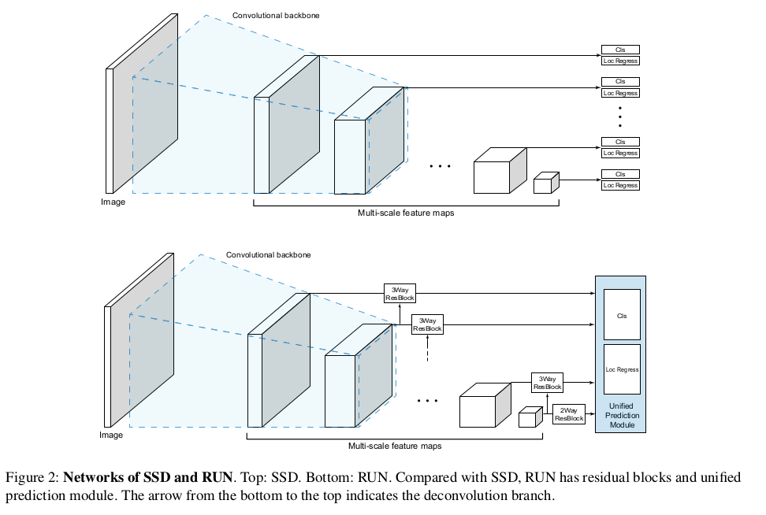
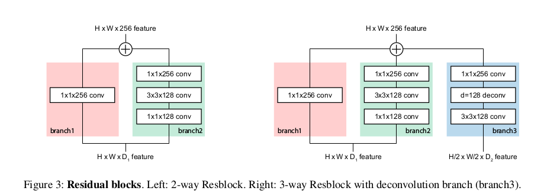
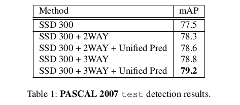
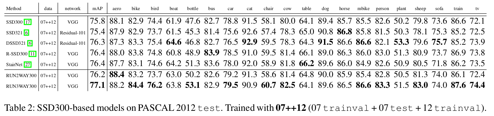
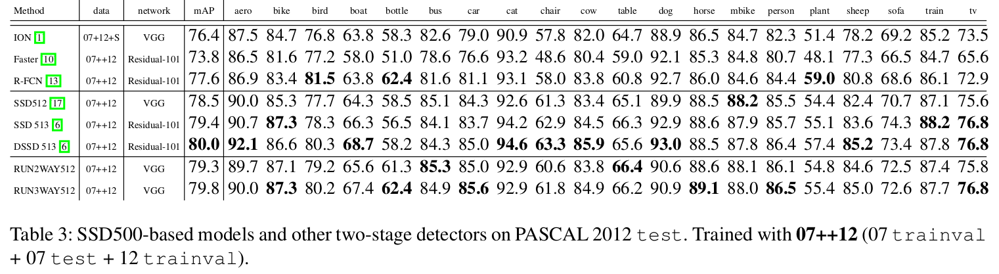
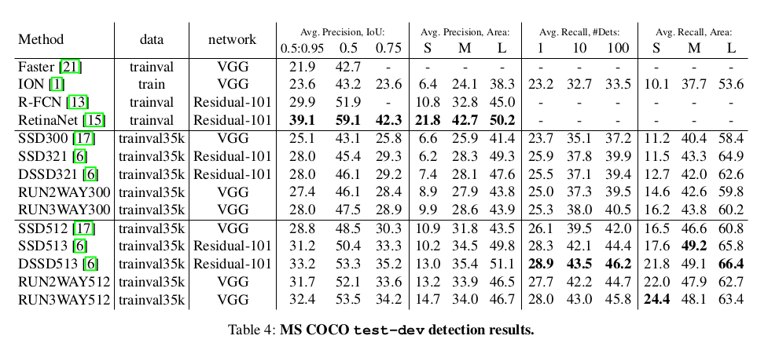
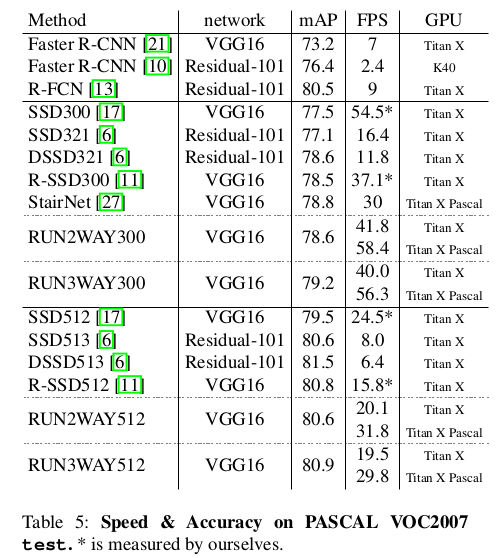
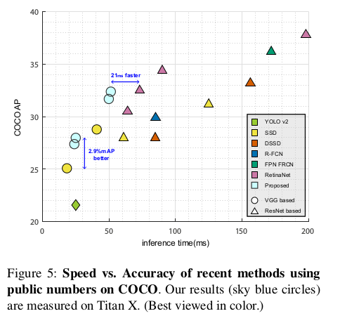

Residual Features and Unified Prediction Network for Single Stage Detection
=

# 1 问题
SSD的每个预测模块由 $3 \times 3$ 卷积滤波器在每层独立地检测边界框，它们不能反映不同尺度近似的纹理信息。这将造成“Box-in-Box”问题，如图1 。

# 2 Residual Feature and Unified Prediction Network(RUN)

## 2.1 Residual Feature Maps
最近设计用于物体检测的CNN模型利用骨架网络，该骨架网络最初被设计用于解决图像分类问题。尽管检测网络可以端到端训练，但是骨干网络通常使用用于图像分类问题的权重初始化。网络中用于图像分类的特征和预测可以用如下的数学公式表达：
$$
\begin{align}
x_n = \cal{F}_n(x_{n-1}) = (\cal{F}_n \circ \cal{F}_{n-1} \circ \cdots \circ \cal{F}_1)  \tag 1  \\
Scores = \cal{P}(x_n)  \tag 2
\end{align}
$$
其中 $I$ 是输入图像， $x_n$ 是第 $n$ 级特征图， $\cal{P}$ 是预测函数， $\cal{F}_n$ 是非线性变换（如卷积、池化、ReLU等）的组合。这里顶部特征图 $x_n$ 学习高层抽象信息， $x_n (k < n)$ 随着 $k$ 的减小有更多的局部和低层信息。

SSD使用几个不同的特征值直接作为独立预测模块的输入来计算对象位置和分类得分，可以表示为如下公式：
$$
Detection = \{ \cal{P_1}(x_{s_1}), \cal{P_k}(x_{s_2}), \cdots,\cal{P_k}(x_{s_k}) \}  \tag 3
$$
其中 ${s_1}$ 到 ${s_k}$ 是用于多尺度预测的源特征图的索引， $\cal{P}_k$ 是函数，该函数输出具有不同位置和得分的多个对象。结合式（1）和（3），有
$$
Detection = \{ \cal{P_1}(x_{s_1}), \cal{P_k}(x_{s_1}^{s_2}), \cdots,\cal{P_k}(x_{s_1}^{s_k}) \}  \tag 4
$$
其中 $\cal{F}_a^b \triangleq (\cal{F}_b \circ \cdots \circ \cal{F}_{a+1})(x_a)$ 。这里，更早的特征图 $x_{s_1}$ 需要学习高层抽象来提升 $\cal{P_1(x_{s_1})}$ 的性能。同时，它还需要学习局部特征，以便有效地将信息传输到下一个特征图。这不仅是学习变得困难，还引起综合性能的衰减。

为了解决这个问题，SSD在conv4_3和预测模块之间添加L2归一化层，这一操作可以减小来自预测模块梯度的量纲（magnitude）影响。但这不足以解决全部问题，为了满足维持低级信息的同时同时具有学习高级抽象的灵活性的这种矛盾的要求，需要在训练阶段分离和解耦骨干网络和预测模块。

本文提出一种新的架构，其可以将预测模块从骨干网络中解耦，如图2 。使用了3-way ResBlock（如图3），而不是直接将预测模块连接到特征图。
在其所有分支中都使用卷积层和非线性激活。这阻止了预测模块的梯度直接流向骨干网络的特征图。此外，它清楚地区分了用于预测的特征和要传递到下一层的特征。换句话说，所提出的Resblock起到了学习用于对象检测的高级抽象的作用，而包含低级特征的骨干网络被设计为从高级检测信息中完整无缺。这种设计有助于改善SSD[17]的特征结构，强制它不要学习高级抽象并保持低级图像功能。

同时，在SSD中用于小尺寸对象检测的更早层（如conv4_3）的深度非常浅。因此，在SSD中，由于在预测中使用的标正能量不充足，所以不能很好地检测小对象。为了补充这个问题，在ResBlock的branch2中使用了3×3卷积层，如图3所示，以反映外围上下文信息。

图3右侧的Branch3包含一个翻卷积层，它输入是连续层的特征图。最终，所提出结构可以表示为：
$$
\begin{align}
Detection = \{ \cal{P_1}(\hat{x}_{s_1, s_2}), \cal{P_2}(\hat{x}_{s_2, s_3}),  \\
\cdots, \cal{P_{k-1}}(\hat{x}_{s_{k-1}, s_k}), \cal{P}_k(\hat{x}_{s_k}) \}
\end{align}  \tag 5
$$
其中 $\hat{x}_{a, b} = \cal{B}_1(x_a) + \cal{B}_2(x_a) + \cal{B}_3(x_b)$ ，$\hat{x}_a = \cal{B}_1(x_a) + \cal{B}_2(x_a)$ 。这里 $\cal{B}_1, \cal{B}_2$ 和 $\cal{B}_3$ 表示branch1、branch2和branch3 。

## 3.2 Unified Prediction Module
检测不同尺寸的对象被视为对象检测中一个重要问题。在传统方法[26]、[3]、[4]中使用单个分类器来预测从图像金字塔中提取的多尺度特征图。也有在单幅输入图像上使用多个分类器的方法。后者减少了用于计算特征图的计算量。然而，它需要每个对象尺度设计单独的分类器。

SSD中，由于每个特征图不仅长度不同，而且隐含的上下文信息也不同，所以每个尺度的特征图使用了单独的预测模块。为了高效地学习不同尺度的预测层，需要不同尺度的输入对象，使得SSD可以极大地特征检测新能。图3展示了集中对象检测器。

# 4 Experiment
**Ablation Study on Pascal VOC2007** 使用VOC2007 trainval和VOC2012 trainval训练网络。batch size = 32 。对与训练2-way模型，使用初始学习率为 $10^{-3}$ ，在80k和100k迭代时除以10 ，共训练129k 。对于3-way模型，固定预训练的2-way模型权重（预测模块除外），使用 $10^{-3}$ 的学习率微调网络40k，接下来20k学习率为 $10^{-4}$ ，最后10k学习率为 $10^{-5}$ 。结果如表1 。   

**PASCAL VOC12** 使用07trainval + 07test + 12trainval 训练网络。首先，进行了应用2-way ResBlock与统一预测相结合的实验，然后，在冻结所包含的2-way ResBlock的权重之后，使用具有统一预测的3-wayResBlock执行另一个实验。结果如表2和表3 。

**COCO** 对于2-way 模型，前240k，迭代学习率为 $10^{-3}$ ； 接下来120k，学习率为 $10^{-4}$ ；最后40k，学习率为 $10^{-5}$ 。对于3-way模型，前120k，学习率为 $10^{-3}$ ；接下来60k，学习率为 $10^{-5}$ ；最后20k，学习率为 $10^{-5}$ 。结果如表4 。

**Speed vs. Accuracy**

