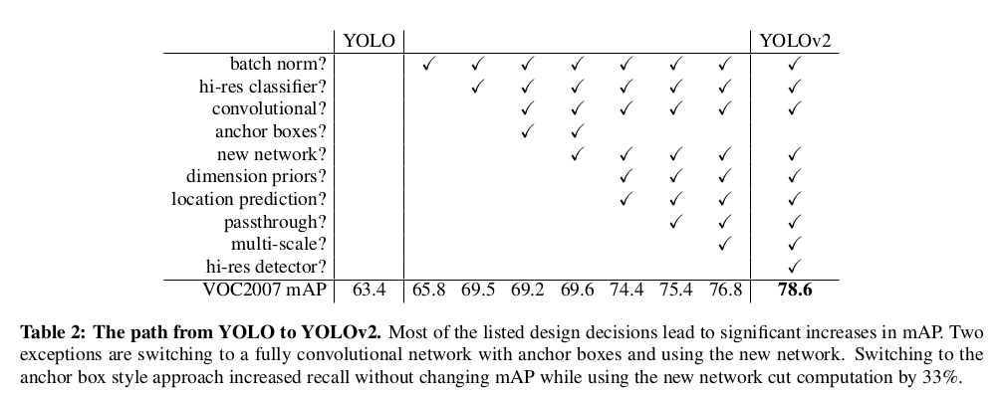
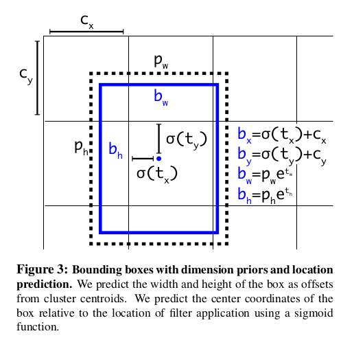
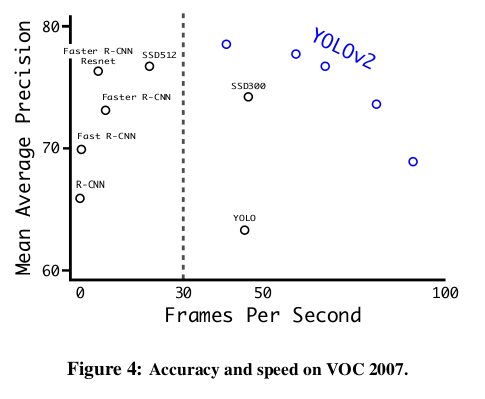

YOLO9000: Better, Faster, Stronger
=

# 1 Better
YOLO相对于最先进的检测系统存在各种缺点。与Fast R-CNN相比，YOLO存在显著数量的定位误差。与基于区域的方法相比，YOLO的召回率相对较低。因此，本文关注改善召回率和定位误差，同时保持分类准确率。

**Batch Normalization.** 添加批归一化。

**High Resolution classifier.** 对于 YOLOv2，首先使用 $448 \times 448$ 的分辨率在ImageNet上微调10 epoch。然后再微调检测网络。这获得大约 4% 的mAP增加。

**Convolutional with Anchor Boxes.** Anchor 机制显著提升检测性能。其通过预测坐标偏移（而不是坐标值）使得网络更容易学习。

删除YOLO的全连接层，并使用anchor预测边界框。首先，删除一个池化层使网络输出具有更高的分辨率。同时将输入大小缩减为 416，而不是448 ，这可以产生奇数输出大小，使得对象只有一个中心单元（因为较大的对象可能覆盖多个单元格）。输出特征图大小为 $13 \times 13$ 。

当移动到锚框时，还将类预测机制与空间位置接偶偶，而不是预测每个锚框的类和对象性。遵循YOLO，对象性预测仍是预测ground-truth和提议框之间的IoU，类别预测为给定存在一个对象的前提下，预测该类的条件概率。

anchor使得预测的召回率增加：没有anchor时，得到69.5的mAP和81%的召回率，而使用anchor时，获得69.2的mAP和88%的召回率。

**Dimension Clusters.** 通过维度聚类来获得anchor的基本设置。

本文使用标准的k-mean聚类，距离公式为
$$d(box, centroid) = 1 - IoU(box, centroid)$$

本文选择 $k = 5$ 来平衡模型复杂度和高召回率。

**Direct location prediction.** 当使用anchor框的YOLO时，遭遇第2个问题：模型不稳定（model instability），特别是早期迭代时。大多数的不稳定来源于预测 $(x, y)$ ，在区域提议网络中，网络预测值 $t_x$ 和 $t_y$ 与中心坐标 $(x, y)$ 预测如下：
$$
x = (t_x * w_a) - x_a \\
y = (t_y * h_a) - y_a
$$
例如， $t_x = 1$ 的预测会将边界框向右平移anchor框的宽度， $t_x = -1$ 的预测会将边界框向左平移相同的量。这个公式是不加约束的，因此任何anchor框可以在图像的任意点结束，而无视哪个位置预测边界框。随机初始化的模型将会花费较长时间来稳定预测敏感的偏移。

不同于预测偏移，遵循YOLO的方法，并预测网格单元中相应位置坐标。ground-truth的的边界处于0和1之间，本文使用哦logistic激活限制网络的预测处于该范围。

网络每个单元预测5个边界框，网络为每个边界框预测听歌坐标值：$t_x$ 、 $t_y$ 、 $t_w$ 、 $t_h$ 和 $t_o$ 。如果单元离图像左上角的偏移为 $(c_x, c_y)$ 并且边界框先验的宽高分别为 $p_w, p_h$ ，然后相应的预测为：  
$$
\begin{alignat}{0}
b_x = \sigma(t_x) + c_x  \\
b_y = \sigma(t_y) + c_y  \\
b_w = p_w e^{t_w}  \\
b_h = p_h e^{t_h}  \\
\Pr(object) * IoU(b, object) = \sigma(t_o)
\end{alignat}
$$

**Fine-Grained Features.** 修改后的YOLO在 $13 \times 13$ 的特征图上检测。 只需添加一个passthrough图层，它可以从26 x 26分辨率的早期图层中获取特征。直通层通过将相邻特征堆叠到不同的通道而不是空间位置，将较高分辨率的特征与低分辨率特征连接起来，类似于ResNet中的恒等映射。这将 $26 \times 26 \times 512$ 的特征图转换为 $13 \times 13 \times 2048$ 的特征图。

**Multi-Scale Training.** 训练时，每10个batch时，从 $\{320, 352, ..., 608\}$ （即从320到608，间隔为32，共计32中共尺度）随机选择一种尺度。

**Further Experiments.**

# 2 Faster
**Darknet-19.** 如表6 。

Darknet-19 有72.9%的top-1 准确率，91.2%的top-5准确率。

**Training for classification.** 使用ImageNe-1k训练160 epoch。学习率从0.1开始，使用多项式衰减策略，powe为4 。weight decay = 0.0005， momentum = 0.9 。数据增强包括：随机裁剪、旋转、hue、饱和度、曝光度变换。

在进行上述 $224 \times 224$ 的输入图像初始训练后，使用 $448 \times 448$ 的输入图像进行微调 10 个epoch， 且学习率为 $10^{-3}$。

**Training for detection.** 通过删除最后一个卷积层来修改这个网络以进行检测，并且添加三个包含1024个滤波器 $3×3$ 卷积层，且每个 $3\times3$ 卷积之后是1×1卷积层，最终的 $1\times1$ 卷积包含需要检测的输出数量。对于VOC，预测5个边界框，每个框包含5个坐标值和20个类别。同时，添加passthrough层。

网络训练160 epoch，初始学习率为 $10^{-3}$ ，在60和90个epoch时分别除以10 。momentum = 0.9， weight decay = 0.0005 。逐渐增强与SSD相似：随机裁剪、颜色变换等。

# 3 Stronger
作者提出在分类和检测数据上联合训练，该方法使用标签为检测的图像来学习特定于检测的信息，例如边界框坐标预测和对象，以及如何对常见对象进行分类。它使用仅带有类标签的图像来扩展它可以检测的类别数。

在训练期间混合检测和分类数据。当网络看到标记为检测的图像时，可以基于完整的YOLOv2损失函数进行反向传播。 当它看到分类图像时，只反向传播架构中特定于分类的部分的损失。

这种方法存在一个问题，检测数据只有常见的对象和普通标签，而分类数据有更宽更深的标签范围。ImageNet包含上百种狗，如果要想在两个数据集上训练，则需要连贯的方式来融合这些标签。

大多数分类方法使用一个跨越所有可能类的softmax层来计算最终的概率分布。使用softmax假定类是互斥的。 这给组合数据集带来了问题，例如，您不希望使用此模型组合ImageNet和COCO，因为类“Norfolk terrier”和“dog”不是互斥的。

我们可以使用多标签模型来组合不假设互斥的数据集。 这种方法忽略了我们对数据所知的所有结构，例如所有COCO类都是互斥的。

**Hierachical classification.** ImageNet标签来自WordNet，WordNet是构建概念及其相关性的语言数据库。在WordNet中，“Norfolk terrier” 和 “Yorkshire terrier” 是“terrier” 的下义词，“terrier”是一种猎狗。大多数分类方法都假设标签采用扁平结构，但是对于组合数据集，结构正是我们所需要的。

WordNet的结构是有向图，而不是树，因为语言很复杂。 例如，“狗”既是一种“犬”，也是一种“家畜”，它们都是WordNet中的同义词。 我们不是使用完整的图结构，而是通过从ImageNet中的概念构建分层树来简化问题。

为了构建这个树，我们检查了ImageNet中的视觉名词，并查看它们通过WordNet图形到根节点的路径，在本例中是“物理对象”。许多同义词只有一条通过图形的路径，所以首先我们将所有这些路径添加到树中。 然后我们迭代地检查我们剩下的概念，并尽可能少地添加生长树的路径。 因此，如果一个概念有两条通向根的路径，一条路径将三条边添加到树中，另一条路径只添加一条边，我们选择较短的路径。

最终的结果是WordTree，一个视觉概念的分层模型。 为了使用WordTree进行分类，我们预测每个节点的条件概率，以获得该synset的每个下位词的概率。 例如，在“terrier”节点，我们预测：
$$
\begin{alignat}{0}
\Pr(Norfolk terrier|terrier) \\
\Pr(Yorkshire terrier|terrier)  \\
\Pr(Bedlington terrier|terrier)  \\
...
\end{alignat}
$$

如果我们想要计算特定节点的绝对概率，我们只需遵循通过树到根节点的路径并乘以条件概率。 因此，如果我们想知道图片是否是Norfolk terrier，我们计算：
$$
\begin{alignat}{0}
\Pr(Norfolk terrier) = \Pr(Norfolk \ terrier|terrier)  \\
∗\Pr(terrier|hunting dog)  \\
∗ . . .∗    \\
∗\Pr(mammal|P r(animal)  \\
∗\Pr(animal|physical \ object)  \\
\end{alignat}
$$

出于分类目的，我们假设图像包含一个对象： $\Pr(physical \ object)= 1$ 。

为了验证这种方法，我们在使用1000类ImageNet构建的WordTree上训练Darknet-19模型。 为了构建WordTree1k，我们添加了所有中间节点，将标签空间从1000扩展到1369 。在训练期间，我们将地面实况标签传播到树上，这样如果图像被标记为“Norfolk terrier”，它也会被标记为 “狗”和“哺乳动物”等。为了计算条件概率，我们的模型预测了1369个值的向量，并且我们计算了相同概念的所有合成集的softmax，参见图5。

**Dataset combination with WordTree.** 以合理的方式将多个数据集组合在一起。 我们只是将数据集中的类别映射到树中的同义词集。 图6显示了使用WordTree组合ImageNet和COCO标签的示例。 WordNet非常多样化，因此我们可以将此技术用于大多数数据集。

**Joint classification and detection.** ImageNet是一个更大的数据集，所以我们通过对COCO进行过采样来平衡数据集，这样两个数据集的比例为 $4:1$ 。

使用3个anchor。对于分类损失，我们仅反向传播等于或高于标签相应级别的损失。 例如，如果标签是“狗”，我们会将任意的误差分配给树中更下方的预测，“德国牧羊犬”与“金毛猎犬”，因为我们没有这些信息。
