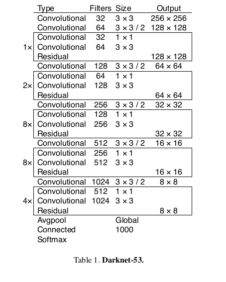
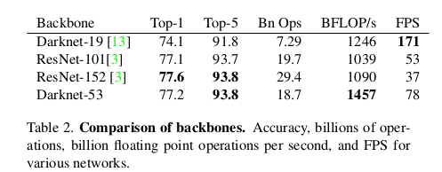
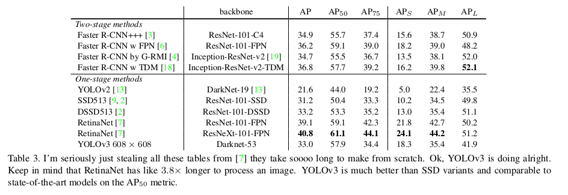

YOLOv3: An Incremental Improvement
=

# 1 The Deal
## 1.1 Bounding Box Prediction
遵循YOLO9000，使用维度聚类（dimension cluster）选择anchor 。网络预测每个边界框的4个坐标值： $t_x, t_y, t_w, t_h$ 。如果单元到图像左上角的偏移为 $(c_x, c_y)$ ，并且边界框先验的宽和高为 $p_w, p_h$ ，然后相应的预测为：
$$
\begin{alignat}{0}
b_x = \sigma(t_x) + c_x  \\
b_y = \sigma(t_y) + c_y  \\
b_w = p_w e^{t_w}  \\
b_h = p_h e^{t_h}
\end{alignat}
$$
训练期间使用平方误差和损失。如果某些坐标预测的ground-truth是 $\hat{t}_*$，则梯度是ground-truth值减去预测： $\hat{t}_* - t_*$。 YOLOv3使用logistic回归预测每个边界框的对象性得分。**如果一个边界框先验（anchor）与ground-truth对象的重叠率大于所有其他的先验，则这个先验框为 1 。如果边界框先验不是最佳的，而且预测ground-truth的重叠大于某个阈值，则忽略这些预测，遵循Faster R-CNN，本文选择阈值为 0.5 。** 如果未将边界框先验分配给基础事实对象，则它不会导致坐标或类预测的损失，只会导致对象性损失。

## 1.2 Class Prediction
每个框使用多标签分类预测边界框可能包含的类。 我们不使用softmax，因为我们发现它不利于良好的性能，而简单地使用独立的逻辑分类器。在训练期间，我们使用 **二元交叉熵损失进行类预测** 。

当我们转向更复杂的领域（如Open Images Dataset [5]）时，这个公式会有所帮助。 在这个数据集中有许多重叠的标签（即女人和人）。使用softmax强制假设每个边界框只有一个类，而通常不是这种情况。 多标签方法可以更好地模拟数据。

## 1.3 Predictions Across Scales
YOLOv3在三个不同尺度预测边界框，与FPN相似。向基本特征提取器添加了几个卷积层。最后一个预测了三维张量——其编码边界框，对象和类预测。本文的COCO试验中，每个尺度预测3个 $N \times N \times [3 * (4 + 1 80)]$ 的张量。

接下来，从前面的2层获取特征图，然后将其上采样 2×。还从网络中较早的位置获取了一个特征图，并使用逐元素加法将其与上采样特征合并。这种方法可以获取更加有意义的来自上采样特征的语义信息和早期特征图的细粒度信息。然后，添加几层卷积来处理融合的特征，并预测相似的张量。

k-means聚类得到anchor。我们只是任意选择9个簇和3个尺度，然后在刻度上均匀地划分簇。在COCO数据集上的簇为 (10 × 13), (16 × 30), (33 × 23), (30 × 61), (62 × 45), (59 ×
119), (116 × 90), (156 × 198), (373 × 326) 。

## 1.4 Feature Extractor

运行时间在Titan X上以 $256×256$ 测量。

## 1.5 Training
训练策略与YOLOv2相似。

# 2 How We Do
表3为YOLOv3和其他框架的对比。

# 3 Things We Tried That Didn't Work
**Anchor box $x, y$ offset predictions.** 我们尝试使用常规锚框预测机制，您可以使用线性激活将x，y偏移预测为框宽度或高度的倍数。我们发现这种形式降低模型的稳定性，且工作不是很好。

**Linear $x, y$ predictions instead of logistic.** 尝试使用线性激活来直接预测 $x, y$ 的偏移，而不是logistic激活。这导致了mAP发生2个点的下降。

**Focal loss.** 尝试使用Focal loss，它使得mAP降低2个点。YOLOv3可能已经对焦点损失试图解决的问题具有鲁棒性，因为它具有单独的对象性预测和条件类预测。

**Dual IoU thresholds and truth assignment.** Faster R-CNN在训练期间使用两个IoU阈值。作者尝试了相同的策略，但是结果不佳。
