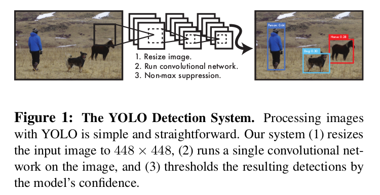

You Only Look Once: Unified, Real-Time Object Detection
=

# 1 Introduction
人类瞥了一眼图像，立即知道图像中的物体，它们在哪里以及它们如何相互作用。当前的检测系统重新利用分类器来执行检测。将对象检测重新定义为单一的回归问题，直接从图像像素到边界框坐标和类概率。使用这个系统，你仅需在图像中看一次，就能预测存在的对象是什么以及它在哪里。如图1 ， YOLO仅使用单个卷积网络同时预测多个边界框和类别概率。

YOLO的好处：

1. YOLO非常快。因为将检测定义为一个回归问题，所以不需要复杂的pipeline 。在测试时，简单地将图像输入神经网络，从而预测检测情况。在Titan XP上有45帧。

2. YOLO在作出预测时，通过全局理解图像。不同于滑动窗口和基于区域提议的技术，在训练和测试时，YOLO观察整幅图像，因此清楚地编码类别的纹理和外观信息。Fast R-CNN是一种顶级检测方法[14]，它错误地描述对象中的背景补丁（patches），因为它无法看到更大的上下文。与Fast R-CNN相比，YOLO背景误差的数量不到一半（即False Positive 低）。

3. YOLO学习对象的一般化表征。由于YOLO具有高度可推广性，因此在应用于新域或意外输入时不太可能发生故障。

YOLO在准确率方面仍然滞后。虽然它可以快速识别图像中的对象，但它很难精确定位某些对象，特别是小对象。

# 2 Unified Detection
YOLO将图像划分为 $S \times S$ 的网格。如果对象的中心落在该网格中，则该网格单元就是此对象检测的响应。

每个网格单元预测这些框的 $B$ 个边界框和置信度得分。这些置信度得分反映模型对包含对象的边界框的信心程度，以及它对边界框预测的准确程度。形式上定义置信度为 $Pr(Object) * IOU_{pred}^{truth}$ 。如果网格中不存在对象，则置信度为0 。否则，希望置信度得分等于预测的边界框和ground-truth之间的联合交叉（IOU）。

每个边界框包含5个预测： $x, y, w, h$ 和置信度（confidence）。置信度预测表示预测框和任意ground-truth框之间的IoU。

每个网格单元还预测 $C$ 个条件类别概率 — $Pr(Class_i | Object)$ 。这些概率是以网格单元包含一个对象为条件的。仅为每个单元预测一组类概率，而不管框 $B$ 的数量。

在测试时，将条件类别概率和单个框的置信度相乘：
$$Pr(Class_i | Object) * Pr(Object) * IOU_{pred}^{truth}  \tag 1$$
这为每个边界框给出了类别特定的置信度得分。这些分数编码该类出现在框中的概率以及预测框与该对象的匹配程度。

为了在PASCL VOC上评估YOLO，使用 $S = 7, B = 2$ 。

## 2.1 Network Design

网络最后是两个全连接层，最终输出概率和坐标。输出张量为 $7 \times 7 \times 30$ 。

## 2.2 Training
在ImageNet上预训练。top-5准确率达到88% 。输入分辨率为 $448 \times 448$ 。

将边界框的宽高标准化到0和1之间。 $x$ 和 $y$ 参数化为特定网格单元位置的偏移，因此它们也在0和1之间。

激活函数为 leakey-ReLU ：
$$
\phi(x) =
\begin{cases}
x, & \mbox{if  } x > 0,  \tag 2 \\
0.1x, & \mbox{otherwise}
\end{cases}
$$

优化输出的平方误差和，因为平方误差和易于优化，但它并不完全符合最大化平均精度的目标。它将定位误差与分类误差相等地加权，这可能并不理想。此外，在每个图像中，许多网格单元不包含任何对象。 这将这些单元格的“置信度”分数推向零，通常会压制包含对象的单元格的梯度。 这可能导致模型不稳定，导致训练早期出现偏差。

为了解决这个问题，增加边界框坐标预测的损失，并减少了不包含对象的框的置信度预测损失。使用两个参数 $\lambda_{coord}$ 和 $\lambda_{noobj}$ 来完成，设置 $\lambda_{coord} = 5$ ， $\lambda_{noobj} = .5$

平方误差和也同样可以加大大边界框和小边界框中的误差。 这种误差度量应该反映出大边界框中的小偏差小于小边界框。 为了部分解决这个问题，预测边界框宽度和高度的平方根，而不是直接预测宽度和高度。

YOLO在每个网格单元预测多个边界框。在训练时，仅考虑与ground-truth有当前最大IoU的预测。损失函数为：
$$
\begin{alignat}{0}
\lambda_{coord}\sum_{i=0}^{S^2}\sum_{j=0}^{B}\Bbb 1_{ij}^{obj}[(x_i - \hat{x}_i)^2 + (y_i - \hat{y}_i) ^ 2]   \\
+\lambda_{coord}\sum_{i=0}^{S^2}\sum_{j=0}^{B}\Bbb 1_{ij}^{obj}[(\sqrt{w_i} - \sqrt{\hat{w}_i})^2 + (\sqrt{h_i} - \sqrt{\hat{h}_i}) ^ 2]   \\
+\sum_{i=0}^{S^2}\sum_{j=0}^{B}\Bbb 1_{ij}^{obj}(C_i - \hat{C}_i) ^ 2 \\
+\lambda_{noobj}\sum_{i=0}^{S^2}\sum_{j=0}^{B}\Bbb 1_{ij}^{obj}[(C_i - \hat{C}_i)^2 \\
+\sum_{i=0}^{S^2}\Bbb1_i^{obj}\sum_{c \in classes}(p_i(c) - \hat{p}_i(c)) ^ 2   \\
\end{alignat}    \tag 3
$$
其中 $\Bbb1_i^{obj}$ 表示对象是否出现在单元 $i$，$\Bbb1_{ij}^{obj}$ 表示单元格 $i$ 中的第 $j$ 个边界框预测器对该预测“负责”。注意，如果对象存在于该网格单元中，则损失函数仅惩罚分类错误（前面讨论的条件类概率）。如果该预测器对ground-truth框“负责”（即，该网格单元中具有任何预测器的最高IOU），它也仅惩罚边界框坐标误差。

使用VOC07和VOC12训练和验证数据训练135个epoch。batch size = 64， momentum = 0.9， weight decay = 0.0005 。

学习率设置： warmup策略，第一个epoch，从 $10^{-3}$ 缓慢上升到 $10^{-2}$ 。前75 epoch学习率为 $10^{-2}$ ，然后30 epoch的学习率为 $10^{-3}$ ，最后30 epoch学习率为 $10^{-4}$ 。第一个全连接层后添加一个dropout层，rate = 0.5 。对于数据增强，引入了高达原始图像大小的20％的随机缩放和平移。 还在HSV颜色空间中随机调整图像的曝光和饱和度达1.5倍。

## 3.2 Limitations of YOLO
YOLO对边界框预测施加了强烈的空间约束，因为每个网格单元只预测两个框，并且只能有一个类。此空间约束限制了模型可以预测的相邻对象的数量。模型对于成群出现的小物体检测不佳，例如成群的鸟类。

由于模型学习从数据中预测边界框，因此很难在新的或不寻常的宽高比或配置中推广到对象。我们的模型还使用相对粗略的特征来预测边界框，因为我们的架构具有来自输入图像的多个下采样层。

最后，当我们训练一个近似检测性能的损失函数时，我们的损失函数在小边界框中与大边界框相同地处理误差。大边界框中的小错误通常是良性的，但小边界框中的小错误对IOU的影响要大得多。 我们的主要错误来源是错误的本地化。
