Rethinking ImageNet Pre-training
=

# 1. Introduction
深度卷积神经网络[21,23]彻底改变了计算机视觉，可以说是由于发现在预训练任务中学到的特征表示可以将有用的信息迁移给目标任务[9,6,50]。近年来，一个成熟的范例是使用大规模数据（例如，ImageNet [39]）预训练模型，然后在通常具有较少训练数据的目标任务上微调模型。预训练为许多任务提供了最先进的结果，包括对象检测、图像分割和动作识别。

然后，通过在大规模的类似ImageNet的数据上预先训练“通用”特征表示，可以铺平“解决”计算机视觉的途径[44,30]。然而，这些实验的成功是混合的：虽然改进已观察到，对于对象检测，特别是它们很小且与预训练数据集大小的尺度不佳时。这条道路将“解决”计算机视觉是值得怀疑的。

本文通过探索相反的制度来进一步质疑预训练的范式：我们报告说，在通过随机初始化（“从头开始”）对COCO进行训练时，无需任何预训练即可实现具竞争性对象检测和实例分割准确率。更令人吃惊的是，我们通过 _使用基线系统[8,36,26,13]以及它们用于微调预训练模型的超参数_ 来获得这些结果。如果 **（i）我们使用合适的标准化技术来优化，以及（ii）我们训练模型足够长以补偿预训练的短板**，便会发现没有任何根本障碍阻止从头开始训练模型（图1）。

我们表明，COCO上的随机初始化训练可以与其ImageNet预训练相媲美，适用于涵盖平均准确率（Average Precision： AP，百分比）从40到50以上的各种基线。此外，我们发现，即使我们使用低至10％的COCO训练数据进行训练，这种可比性仍然存在。我们也发现我们能够从头训练大模型——ResNet-101的4倍——没有出现过拟合。基于这些实验和其他实验，我们观察到以下情况：
- （i）ImageNet预训练可以加速 _speed up_ 收敛，特别是训练早期，但是，随机初始化训练可以在一段时间训练后赶上，该时间与ImageNet预训练总量和微调计算大致相当——它必须学习预训练给出的低/中水平特征（如边缘，纹理）。由于在研究目标任务时经常忽略ImageNet预训练的成本，因此用短训练计划进行的“受控”比较可以掩盖随机初始化训练的真实行为。

- （ii）ImageNet预训练不能自动给出更好地正则化。当使用更少的图像（降到COCO的10%）训练时，我们发现必须选择新的超参数进行微调（从预训练）以避免过拟合。然后，当使用这些超参数从随机初始化开始训练时，模型可以匹配预训练的准确率，而没有任何额外正则化，即使仅有10%的COCO数据。

- （iii）当目标任务/指标对空间良好定位的预测更敏感时，ImageNet预训练没有任何好处。我们观察到从头开始训练时，高边界框重叠阈值的AP明显改善;我们也发现需要精细空间位置的关键点的AP，从头开始收敛速度相对较快。直观地说，基于分类（类似ImageNet的预训练）和位置敏感目标任务之间的任务差距可能会限制预训练的好处。

鉴于目前的文献，这些结果令人惊讶，并挑战了我们对ImageNet预训练效果的理解。这些观察结果表明，当社区没有足够的目标数据或计算资源来对目标任务进行训练时，ImageNet预训练是一种历史性的解决方法（并且可能会持续一段时间）。此外，由于易于进行的标注工作和预先训练模型的广泛可用性，ImageNet在很大程度上被认为是一种“免费”资源。但展望未来，当社区将继续提供更多数据和更快的计算时，我们的研究表明，收集数据和训练目标任务是一个值得考虑的解决方案，尤其是当源预训练任务与目标任务有显著差别时。本文为人们重新思考计算机视觉中类似ImageNet的预训练范例提供了新的实验证据和讨论。

# 2. Related Work
**Pre-training and fine-tuning.** 将深度学习应用于物体检测的最初突破（例如，R-CNN [9]和OverFeat [40]）是通过微调预先训练过ImageNet分类的网络来实现的。根据这些结果，大多数现代对象检测器和许多其他计算机视觉算法采用“预训练和微调”范例。最近的工作通过在比ImageNet大6倍（ImageNet-5K）、300倍（JFT）和3000倍（Instagram）的数据集预训练以进一步推动这种范例。虽然这一工作体现了图像分类迁移学习任务的显着改进，但对象检测的改进相对较小（在COCO上的+1.5 AP的规模，具有3000×更大的预训练数据[30]）。迄今为止，大规模预训练数据的边际收益迅速减少。

**Detection from scratch.** 在“训练前和微调”模式普遍存在之前，物体探测器在没有预训练的情况下进行了训练（例如，[31,38,45]） - 这一事实在今天有些被忽视。实际上，_不用惊奇对象检测器可以从头训练。_

鉴于R-CNN论文中预训练的成功，后面的分析[1]发现，当数据有限时，预训练在检测器的准确率方面起到重要作用，但是展示了 _使用更多检测数据从头训练是可能的_ ，并且能够获得90%的微调准确率，这为我们的结果作了铺垫。

随着现代物体探测器[9,15,8,36,35,28,26,13]在预训练范式演变下，人们认为从头开始训练是非平凡的，这成为了传统智慧。Shen等人[41]（DSOD）提出一套新的设计原则，以获得一个从头开始训练时优化精度的探测器。他们设计了一个受深度监督网络和密集连接驱动的专用检测器。DetNet和CornerNet也展示了从头训练检测器的结果。与DSOD相似，这些工作（DetNet和CornerNet）关注设计特定检测架构。然而，在DSOD、DetNet和CornerNet中，_几乎没有证据表明这些专用架构是从头开始训练模型所必需的。_

与这些论文不同，我们的重点是理解ImageNet预训练在非专用架构上的作用（即最初设计时不考虑从头开始训练的模型）。我们的工作表明，即使不进行任何架构专用化，通常也可以在从头开始训练时匹配微调精度。我们的研究是在“with vs. without pre-training”之间进行比较，在受控制的环境下，架构不是定制的。

# 3. Methodology
我们的目标是通过可以在没有ImageNet预训练的情况下完成的对照实验来消除ImageNet预训练的作用。鉴于这个目的，架构改进不是我们的目的；实际上，为了更好的理解ImageNet预训练能作出什么影响，希望能够在最小的修改下从头开始训练典型的架构。我们描述了我们认为必要的两个修改——与模型规范化和训练长度相关，下面将对此进行讨论。

## 3.1. Normalization
批归一化（BN）——用于训练现代网络的流行归一化方法，部分地使训练探测器从头开始困难。对象检测器通常使用高分辨率输入进行训练，这不同于图像分类器。这减少了批量大小受到内存的限制，小批量大小严重降低了BN的准确性[19,34,48]。如果使用预训练，可以避免这个问题，因为微调可以采用预训练批量统计作为固定参数[17]; 但是，从头开始训练时，冻结BN无效。

我们在最近的工作中研究了两种有助于缓解小批量问题的规范化策略：
- （i）组归一化（Group Normalization: GN）：作为最近所提出的替代BN方法，GN执行独立于批量维度的计算。GN的准确率对于批大小不明感。

- （ii）同步批量标准化（Synchronized Batch Normalization：SyncBN）：这是通过跨越多个设备（GPU）的批统计量的BN实现。当使用许多GPU时，这增加了BN的有效批量大小，这避免了小批量生产。

我们的实验表明GN和SyncBN都能确保检测模型从头训练。我们还报告说，使用适当的归一化初始化[16]，我们可以从没有BN或GN的随机初始化中训练具有VGG网络[43]的目标检测器。

## 3.2. Convergence
期望从随机初始化开始训练的模型与从ImageNet预训练初始化的模型具有相似的收敛速度是不现实且不公平。忽略这一事实可以得出关于从头开始训练的模型的真实能力的不完整或不正确的结论。

典型的ImageNet预训练涉及超过一百万次迭代的图像。除了从该大规模数据中学习的任何语义信息之外，预训练模型还学习了在微调期间不需要重新学习的低级特征（例如，边缘，纹理）。另一方面，当从头训练模型时，不得不学习低水平和高水平的语义，因此可能需要更多的迭代以使其很好的收敛。

有了这个动机，我们认为从头开始训练的模型必须训练的时间比典型的微调时间表要长。实际上，根据所提供的训练样本数量，这是一个更公平的比较。我们考虑“样本”的三个粗略定义 - 在所有训练迭代期间已经看到的图像，内容和像素的数量（例如，100个epoch的一个图像被计为100个图像级样本）。我们绘制样本数量上的比较，如图2 。

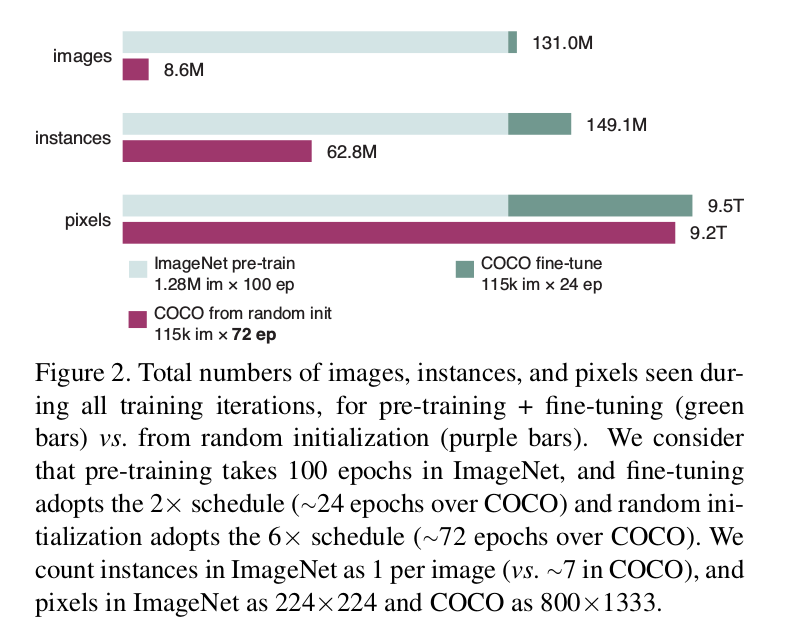

图2展示了在COCO上从头训练的迭代次数是其微调版本的三倍。尽管在COCO上使用更多次的迭代，但是，如果计算图像级样本，从头训练的案例需要样本仍然比其微调版本（100个epoch的128万张ImageNet图像占主导地位。）少。实际上，如果我们计算像素级样本（图2底部）样本的数量更加接近——使用更高分辨率的一系列对象检测器。我们的实验表明在图2的安排下，从头训练的检测器可以赶上它们的微调副本。 **这表明，从随机初始化到收敛良好需要足够大的总样本数（可以说是像素）。**

# 4. Experimental Settings
我们对基线系统进行了微小的更改，以精确定位从头开始进行训练的关键之处。总体而言，我们的基线和超参数遵循公开可用的Detectron代码[10]中的Mask R-CNN [13]，除了我们使用归一化并改变训练迭代次数。 实施如下。

**Architecture.** 我们研究ResNet或ResNext + FPN的Mask R-CNN。我们采用了与Mask R-CNN一起训练Region Proposal Networks（RPN）的端到端模式[37]。GN/SyncBN用于替换‘固定BN’（逐通道仿射）层。为了公平的比较，在本文中，微调模型（带有预训练）也使用GN或SyncBN进行调整，而不是冻结它们。它们的准确率比冻结的更高。

**Learning rate schedule.** Detectron中原始的Mask R-CNN模型微调90K次迭代（即，‘$1 \times$ schedule’）或者180K次迭代（‘$2 \times$ schedule’）。对于本文中的模型，我们调查更长时间的训练，并使用类似的术语，例如，所谓的“ $6\times$ schedule”具有540k迭代。遵循 ‘$1 \times$ schedule’ ，无论有多少总的迭代，我们始终分别在最后60K和20K迭代是将学习率减小10倍（即减小学习率总是在相同的迭代次数）。我们发现第一次（大）学习率的训练时间较长是有用的，但是对于较小的学习率进行较长时间的训练往往会导致过度拟合。

**Hyper-parameters.** 所有其他超参数遵循Detectron。具体地，初始学习率为0.02（使用线性warm-up）。weight decay 为0.0001， momentum为0.9 。所有模型在8个GPU上使用同步SGD训练，每个GPU输入mini-batch为2的图像。

默认情况下，Detectron中的Mask R-CNN不使用数据增强进行测试，只使用水平翻转增强训练。 我们使用相同的设置。 此外，除非另有说明，否则短边的图像尺度为800像素。

# 5. Results and Analysis
## 5.1. Training from scratch to match accuracy
我们第一次惊奇的发现是，当仅使用COCO数据时，从头训练的模型能够赶上微调模型的准确率。

在本小节中，我们在COCO train2017（118287张图像作为训练集，5000张图像作为验证集）上训练模型。我们评估用于对象检测的边界框（bbox）平均准确率（AP）和用于实例分割的掩模AP。

**Baselines with GN and SyncBN.** 当使用有GN的ResNet-50（R50）和ResNet-101（R101）骨干时，验证bbox的AP曲线如图1和图3，而使用SyncBN的R50时，如图4 。

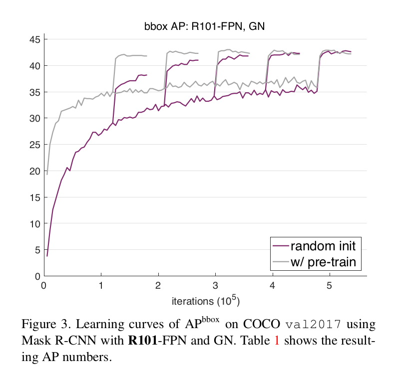

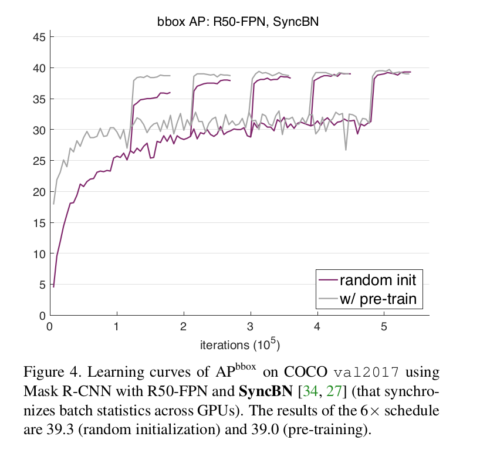

我们为每个案例研究五种不同的计划，即2倍到6倍的迭代。注意，请注意，我们在同一个图中覆盖了一个模型的五个计划。

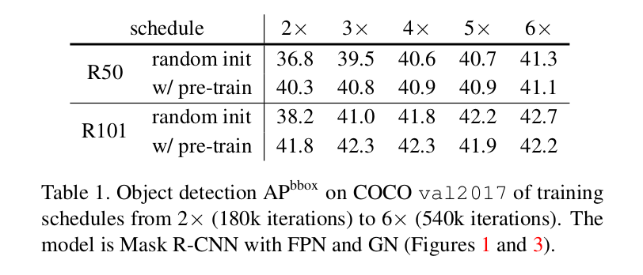

相似的现象，总结如下，与图1、3和4一致：
- （i）典型的微调时间表（2×）适用于具有预训练以收敛到接近最佳的模型（参见表1，'w/pre-train'）。但是这些计划不足以从头训练模型，并且，如果他们只进行短期训练，他们看起来就会逊色。

- （ii）如果使用 $5\times$ 或者 $6\times$ 的计划，从头训练的模型可以赶上它们的微调副本——当它们收敛到最佳时，它们的检测AP并不比它们的微调副本差。

在标准的COCO训练集中，ImageNet预训练主要有助于在训练早期加快目标任务的收敛，但很少或根本没有提高最终检测准确度的证据。

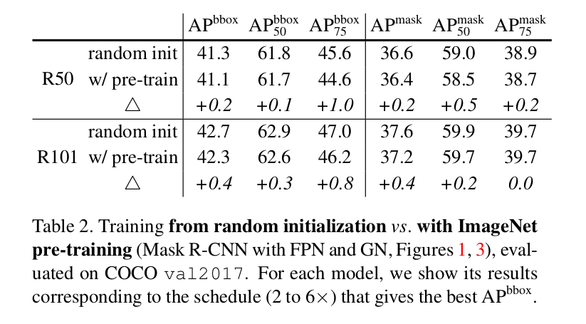

**Multiple detection metrics.** 在表2中，我们进一步比较，在IoU阈值为0.5（$AP_{50}$）和 0.75（$AP_{75}$），从头训练模型和预训练模型之间的不同度量，包括Mask R-CNN的box-level和segmentation-level AP 。

表2反映，从头开始训练和具有预训练的模型在各种标准下具有相似的AP度量，表明从头开始训练的模型不仅仅是追赶单个度量的机会。此外，对于 $AP_{75}^{bbox}$ 度量（使用高重叠阈值），从头训练比微调有明显的边界收益（1.0或者0.8AP）。

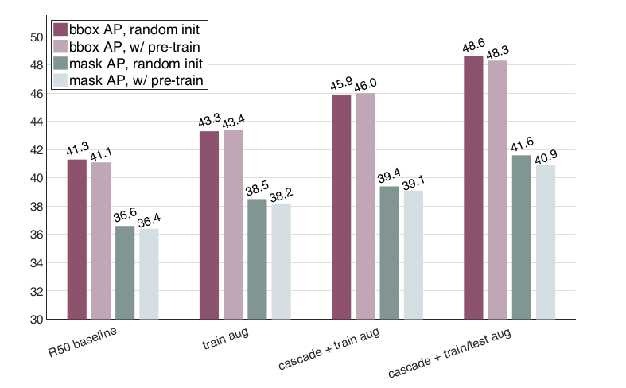
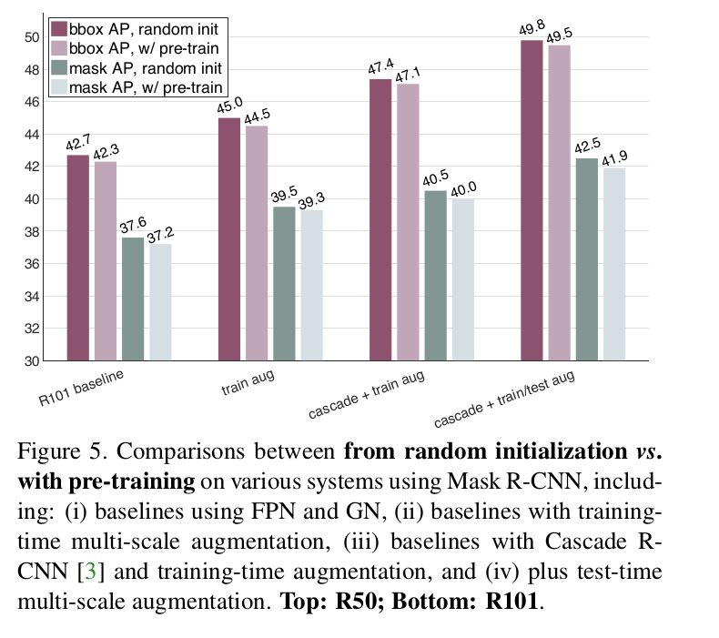

**Enhanced baselines.** 与图5相比，在各种增强基线中也观察到有和没有预训练的训练可以比较的现象。我们将实验消解如下：
- **Training-time scale augmentation：** 到目前为止，所有模型都经过训练，除了水平翻转外没有任何数据增加。接下来，我们使用在Detectron中实现的简单训练时间尺度增强：图像的短边是从 $[640,800]$ 像素中随机采样的。更强的图像增强需要更多的迭代以收敛，因此，当从头训练时，我们将计划增加到 $9 \times$ ，并且当从ImageNet预训练时，增加到 $6 \times$ 。   
图5（“train aug”）表明，在这个案例中，仍比较有和没有ImageNet预训练的模型。实际上，更强大的数据增强缓解了数据不足的问题，因此我们可以预期在这种情况下，具有预训练的模型具有较少的优势。

- **Cascade R-CNN：** 由于模型关注提高位置准确率，Cascade R-CNN附加两个额外的阶段到标准的两阶段Faster R-CNN系统。我们通过简单地添加一个mask头部到最后的阶段来实现Mask R-CNN的级联版本。为了节约从头训练模型的运行时间，我们从头训练没有级联的Mask R-CNN，并在最后270k次迭代中切换到级联模式，注意这不该最终的模型没有使用ImageNet预训练的事实。我们在尺度增强设置下训练Cascade R-CNN 。   
图5（“cascade + train aug”）有表明，有和没有ImageNet预训练的Cascade R-CNN模型有相似的AP值。关于位置的监督主要由目标数据集提供，而基于分类的ImageNet预训练不是明显有用的。因此，我们不希望ImageNet预训练在此设置中提供额外的好处。

- **Test-time augmentation：** 到目前为止，我们没有使用测试时间增强。接下来，我们通过结合从多个尺度变换的预测中，以进一步执行测试时间增强，如Detectron中实现的。  
从头训练的模型并不比它们的预训练副本糟。实际上，从头训练的模型甚至略好于这种案例——例如，对于R50的mask AP 是41.6（从头） vs. 40.9，而对于R101，为42.5 vs. 41.9 。

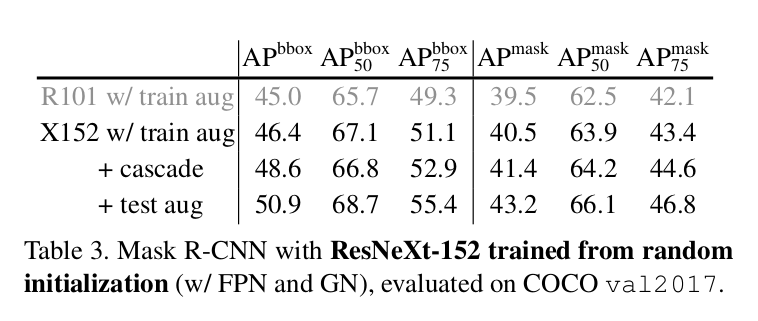

**Large model trained from scratch.** 我们也使用具有GN的ResNeXt-152 $8 \times 32d$ （简称‘X152’）从头训练一个更大的Mask R-CNN 。结果如表3 。

这个骨干的FLOP大约是R101的4倍。尽管实质上更大，但是该模型没有明显过拟合。当从随机初始化训练时，它在val2017获得50.9 bbox AP和43.2 mask AP的好结果。我们提交这个模型到COCO 2018竞赛，在test-challenge集上有51.3 bbox AP和43.6 mask AP。我们的bbox AP处于COCO 2017获奖者级别（50.5 bbox AP，[34]），是迄今为止同类产品中最高的（单一模型，没有ImageNet预训练）。

我们也使用ImageNet预训练的相同模型。它在val2017上的bbo/mask为50.3/42.5（对比从头训练的50.9/43.2）。有趣的是，即使更大的模型，预训练没有提高结果。

**vs. previous from-scratch results.** DSOD [41]通过使用专门针对从头开始的训练结果量身定制的架构报告了29.3 bbox AP。最近的CornerNet工作报告了没有使用ImageNet预训练的结果为42.1 bbox AP 。我们的各种版本的结果都比以前的更高。 我们再次强调，以前的工作[41,22]没有证据表明没有ImageNet预训练的模型可以像他们的ImageNet预训练对手一样好。

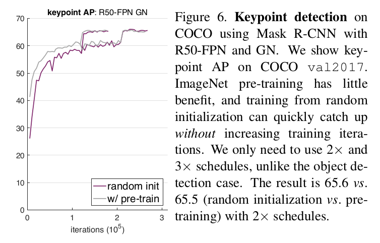

**Keypoint detection.** 我们也训练了用于COCO人体关键检测任务的Mask R-CNN。结果如图6 。在这个案例中，从头训练的模型可以很快赶上，甚至不增加训练迭代次数，它与其ImageNet预训练的副本是可比较的。关键点检测是对精细空间定位更敏感的任务。我们的实验表明，ImageNet预训练，其没有明显的位置信息，对关键点检测没有帮助。

**Models without BN/GN--VGG nets.** 到目前为止，我们的实验都是使用ResNet模型，其需要某种形式的激活规范化（例如BN或GN）。像VGG-16 [43]这样的浅层模型可以从头开始训练，无需激活归一化，只要使用正确的初始化归一化[16]。我们的下一个实验通过探索使用VGG-16作为主干从头开始训练Faster R-CNN的行为来测试我们的观察的一般性。

我们遵循原始的Faster R-CNN实现模型，以及其VGG-16架构；不使用FPN。我们使用标准的超参数，如0.02的学习率、0.1的学习率衰减和0.0001的权重衰减。在训练期间使用尺度增强。遵循前面的实验，我们在从头开始训练和微调训练时使用完全相同的超参数。我们使用相同的MSRA初始化[16]进行ImageNet预训练，并从头开始使用COCO。

具有预训练的基线模型能够在极长的 $9\times$ 训练计划之后达到35.6的最大bbox AP（训练更长时间导致AP的轻微降级）。这里我们注意到即使使用预训练VGG-16完全收敛也是很慢的。从头开始训练的模型达到类似的性能水平，在11x时间表之后最大bbox AP为35.2（训练时间越长，AP也越低）。这些结果表明，与标准的“预训练和微调”相比，我们采用“最小/无变化”（第3节）但采用良好的优化策略和长时间训练的方法足以在COCO上训练性能相对较高的探测器。”。

## 5.2. Training from scratch with less data
我们的第二个发现，更令人惊讶的是，由于数据显着减少（例如，约占COCO的1/10），从头开始训练的模型并不比预训练的模型差。

**35k COCO training images.** 我们使用大约 $1/3$ 的COCO训练数据（来自train2017的35K张图像，等价早期的val35K）开始我们的下一个研究。我们以有或者没有ImageNet预训练来训练我们的模型。

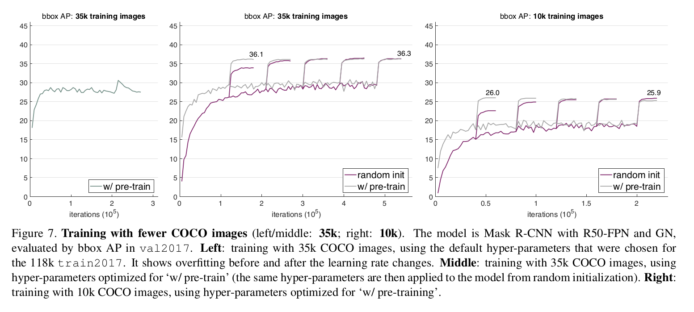

图7（左）是在118k COCO集合中选择的掩模R-CNN的超参数下使用ImageNet预训练的结果。这些超参数不是最优的，并且模型即使使用ImageNet与巡林也会遭遇过拟合。它表明 _ImageNet预训练不会自动帮助减少过拟合。_

为了获得健康的基线，我们在使用ImageNet预训练的模型上重做网格搜索超参数。图7中的灰色曲线（中间）显示了结果。 它具有最佳的36.3 AP和 6× schedule。

然后，我们使用为预训练案例选择的完全相同的新超参数从头开始训练我们的模型。这显然偏向于有利于预训练模型。 然而，尽管数据较少，但从头开始训练的模型具有36.3 AP并且与其预训练副本（图7，中间）相匹配。

**10k COCO training images.** 我们在10k COCO图像的较小训练集上重复相同的实验（即，小于完整COCO集的1/10）。同样，我们在使用ImageNet预训练的模型上对超参数进行网格搜索，并将它们应用于从头开始训练的模型。 我们缩短了这个小训练集的训练时间表（用x轴表示，图7，右）。

具有预训练的模型达到26.0 AP，具有60k迭代，但是在训练更多时略微降低。从头开始训练的对应模型在220k次迭代时具有25.9 AP，这是相当准确的。

**Breakdown regime: 1k COCO training images.** 在10k图像中从头开始的训练相对准确是令人惊讶的。 但是，正如我们接下来报告的那样，期望这种趋势将持续任意小的目标数据是不合理的。

在图8中，我们仅使用1k COCO训练图像（约1/100的完整COCO，再次针对训练前案例优化超参数）重复相同的实验集并显示训练损失。在优化方面（即减少训练损失），从头开始训练仍然不会更糟，但只会收敛得更慢，如前所述。然而，在这种情况下，训练损失不会转化为良好的验证AP：具有ImageNet预训练的模型具有9.9 AP而不是从零开始模型的3.5 AP。对于一个实验，我们还执行了网格搜索以优化从头开始的情况：结果提高到5.4 AP，但没有赶上。 由于严重缺乏数据，这是一种强烈过度拟合的迹象。

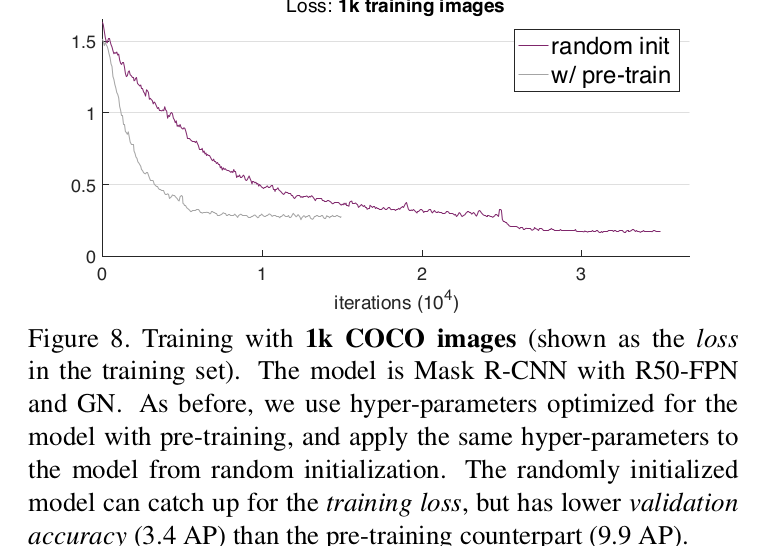

我们还使用3.5k COCO训练图像进行类似的实验。 使用预训练的模型的峰值为16.0 bbox AP，而训练对手的9.3 AP。 COCO数据集中的故障点是介于3.5k到10k之间的训练图像。

**Breakdown regime: PASCAL VOC.** 最后，我们报告了PASCAL VOC对象检测中的比较[7]。我们在trainval2007 + train2012上进行训练，并在val2012上进行评估。

使用ImageNet预训练，我们Faster R-CNN基线（使用R101-FPN，GN和仅训练时间增强）在18k迭代时具有82.7 mAP。 从头开始接受VOC训练的对手在144k次迭代中有77.6 mAP，甚至训练更长时间也没有赶上。

有15k VOC图像用于训练。但是这些图像平均每个图像有2.3个实例（vsCOCO的~7个）和20个类别（对比COCO的80个）。它们不能与相同数量的COCO图像直接比较。我们怀疑较少的实例（和类别）具有与培训数据不足相似的负面影响，这可以解释为什么从零开始对VOC的培训无法赶上COCO所观察到的。

# 6. Discussions
我们总结了我们实验的主要观察结果如下：
- _无需更改架构，即可从头开始对目标任务进行培训。_
- _从头训练需要更多的迭代以达到收敛。_
- _在许多情况下，从头开始的训练可能不比其ImageNet预训练对手差，最低可达10k COCO图像。_
- _ImageNet预训练可加快目标任务的收敛速度。_
- _ImageNet预训练并不一定有助于减少过度拟合，除非我们进入非常小的数据体系。_
- _如果目标任务对位置比对分类更敏感，则ImageNet预训练不会有所帮助。_

基于这些观察，我们提供了一些重要问题的答案，这些问题可能会鼓励人们重新思考ImageNet预训练：

**Is ImageNet pre-training necessary？** 不——如果我们有足够的目标数据（和计算）。我们的实验表明ImageNet有助于加速收敛，而对提高准确率不是必须的，除非目标数据集很小（例如，小于10K的COCO图像）。如果目标数据的数据集规模足够大，则直接训练目标数据就足够了。展望未来，这表明收集目标数据的标注（而不是预训练数据）对于提高目标任务性能更有用。

**Is ImageNet helpful?** Yes. ImageNet预训练一直是计算机视觉社区进步的关键辅助任务。它使人们能够在更大规模的数据可用之前看到显着的改进（例如，在VOC中持续很长时间）。 它还在很大程度上有助于规避目标数据中的优化问题（例如，在缺乏标准化/初始化方法的情况下）。此外，ImageNet预训练减少了研究周期，使得更容易获得令人鼓舞的结果 - 预训练的模型现在可以广泛免费获得，预训练的成本不需要反复支付，并且可以从预训练的权重进行微调收敛速度快于从头开始。们相信这些优势仍将使ImageNet无疑对计算机视觉研究有所帮助。

**Do we need big data?** Yes 。但是，如果我们考虑到收集和清理数据的额外工作，那么通用的大规模分类级预训练集并不理想 - 收集ImageNet的成本在很大程度上被忽略了，但是，当我们扩展这个范例时，“训练前+微调”范式中的“预训练”步骤实际上并不是免费的。 如果大规模分类级预训练的收益呈指数级递减[44,30]，那么在目标域中收集数据会更有效。

**Shall we pursuit universal representations?** 是。 我们相信学习通用表征是一个值得称道的目标。 我们的结果并不意味着偏离这一目标。 实际上，我们的研究表明社区在评估预训练的特征时应该更加小心（例如，对于自我监督的学习[5,47,33,32]），因为现在我们知道即使是随机初始化也可以产生出色的结果。
