Speed/accuracy trade-offs for modern convolutional object detectors
=

# 1. Introduction
本文的贡献：
- 我们提供了对现代卷积检测系统的简明调查，并描述了领先的卷积检测系统如何遵循非常相似的设计。
- 我们在Tensorflow中描述了我们灵活统一的三种元架构（Faster R-CNN，R-FCN和SSD）的实现，我们用它来进行大量实验，追踪不同检测系统、不同的元架构、特征提取器、图像分辨率等的准确率/速度权衡曲线。
- 我们的研究结果显示，使用更少的Faster R-CNN提议可以显着提高速度，而不会在准确性方面造成很大损失，从而使其与更快的同类产品、SSD和RFCN等竞争。我们证明，与Faster R-CNN和R-FCN相比，SSD的性能对特征提取器的质量不太敏感。我们在准确度/速度权衡曲线上确定了最佳点，其中精度的提高只能通过牺牲速度来实现（在此处提供的探测器系列中）。
- 我们报告的一些在文献中从未出现过的元架构和特征提取器组合。我们讨论了如何使用这些新颖的组合来训练2016年COCO对象检测挑战的获胜条目。

# 2. Meta-architectures
当前检测主流是基于anchor的方法，其最小化分类和回归损失。对于每个锚 $a$，首先找到最佳匹配的ground-truth框 $b$ 。如果找到如此的匹配，我们称 $a$ 为“正类锚” ，并给它分配（1）类标签 $y_a \in \{1, 2, \cdots, K\}$ 和（2）边界框 $b$ 相对于锚 $a$ 的向量编码（称为边界框编码 $\phi(b_a; a)$）。如果没有找到匹配，称 $a$ 为“负锚”，并将其类标签设置为 $y_a = 0$ 。如果对于锚 $a$ ，我们预测边界框编码 $f_{loc}(\cal{I}; a, \theta)$ 和 相应的类 $f_{cls}(\cal{I; a, \theta})$ ，其中 $\cal{I}$ 是图像，$\theta$ 是模型参数，然后 $a$ 的损失基于位置的损失和分类损失的权重和衡量：
$$
\begin{alignat}{2}
\cal{L}(a, \cal{I}; \theta) = & \alpha \cdot 1[a \mbox{ is positive}] \cdot l_{loc}(\phi(b_a;a) - f_{loc}(\cal{I};a, \theta))  \\
& + \beta \cdot l_{cls}(y_a, f_{cls}(\cal{I};a, \theta))
\end{alignat}  \tag 1
$$
其中 $\alpha, \beta$ 是定位和分类损失权重。

## 2.1. Meta-architectures
本文中，我们主要关注三种元架构：SSD、Faster R-CNN和R-FCN。
### 2.1.1 Single Shot Detector(SSD)
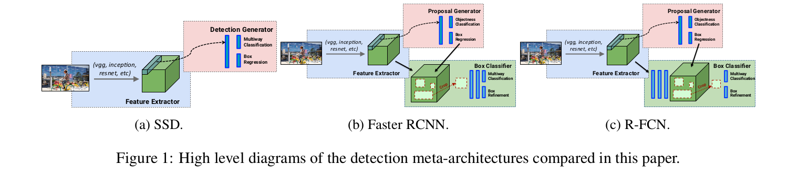

尽管SSD论文最近才发表（Liu et al。，[26]），但我们使用术语SSD来广泛地指代使用单个前馈卷积网络直接预测类和锚定偏移而不需要第二阶段的架构。 按建议分类操作（图1a）。根据这个定义，SSD元架构已经在许多文献中进行了探索[26]。Multibox和Faster R-CNN的RPN阶段使用这个方法预测类别无关的边界框提议。[33, 29, 30, 9]如SSD架构预测最终的类标签。

### 2.1.2 Faster R-CNN
在Faster R-CNN中，检测发生在两个阶段（如图1b）。第一个阶段，称为区域提议网络（RPN），图像通过一个特征提取器（如VGG-16）处理，并且在某些选定的中间层（例如，“conv5”）的特征用于预测类无关的框提议。第一阶段的损失函数采用等式1的形式，使用在空间、尺度和纵横比上平铺的锚点网格。

在第二个阶段中，这些边界框提议（通常为300个）用于从相同的中间特征图上剪裁特征，然后将提议依次输入剩下的特征值提取器（如“fc6” 和 “fc7”）以预测类和特定类的边界框。第二阶段的边界框分类的损失函数也使用公式1的形式，其使用RPN生成的提议作为锚。值得注意的是，人们不直接从图像中裁剪建议，并通过特征提取器重新运行裁剪块，这将是重复计算。然而，仍有部分计算必须每个区域运行一次，因此运行时间依赖RPN建议的区域数量。

自从2015年出现后，Faster R-CNN便极具影响力，并且已经导致了许多后续工作[2,35,34,46,13,5,19,45,24,47]（包括SSD和R-FCN）。值得注意的是，截至2016年11月，向COCO对象检测服务器提交的一半提交报告基于某种方式的Faster R-CNN系统。

## 2.2. R-FCN
虽然Faster R-CNN比Fast R-CNN快一个数量级，但是每个图像必须施加数百次特定区域的事实导致Dai等人[6]提出R-FCN（基于区域的全卷积网络）方法，与Faster R-CNN相似，但是相较于从相同层剪裁用于预测区域提议的特征，其从预测之前的最后特征层剪裁（图1c）。将裁剪推到最后一层的这种方法最小化了必须完成的每区域计算量。Dai等认为对象检测任务需要相应平移变化的位置表征，因此提出位置敏感剪裁机制来替换[10, 31]中使用的标准RoI池化操作和[5]中的可微分检测机制。他们表明，R-FCN模型（使用Resnet 101）可以在更快的运行时间内实现与Faster R-CNN相当的精度。最近，R-FCN模型也用于最近的TA-FCN模型中的实例分割[22]，该模型赢得了2016年COCO实例细分挑战。

# 3. Experimental setup
为了更好地执行比较，我们在Tensorflow中创建了一个检测平台，并在此平台上重新创建了SSD、Faster R-CNN和R-FCN元架构的训练管道。一个统一的框架允许我们轻松地在特征提取器架构、损失函数之间切换。接下来，我们讨论配置模型架构、损失函数和输入的方式。
## 3.1. Architectural configuration
### 3.1.1 Feature extractors
在所有的元架构中，首先将卷积特征提取器应用到输入图像以获取高层特征。特征提取器的选择至关重要，因为参数的数量和层的类型直接影响检测器的内存、速度和性能。我们在本文中选择了六个代表性特征提取器进行比较，除MobileNet [14]外，所有这些都具有开源Tensorflow实现，并对视觉社区产生了相当大的影响。

更加具体地，我们考下面的6个检测器。我们使用VGG-16、ResNet-101、Inception-v2、Inception-v3、Inception-ResNet-v2和MobileNet 。

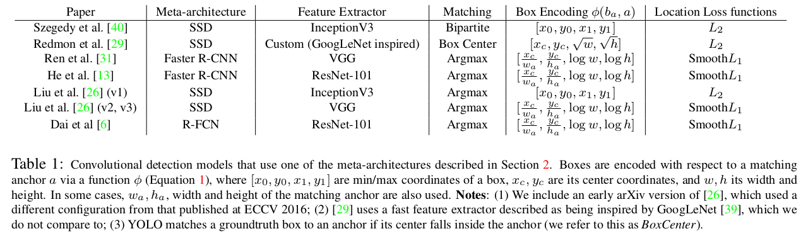

为了比较，先前工作中使用的特征提取器如表1 。值得注意的是，Inception网络从未在Faster R-CNN框架中使用，直到最近都没有开源。

### 3.1.2 Number of proposals
对于Faster R-CNN和R-FCN，我们还可以选择在测试时发送到边界框分类器的区域提议的数量。通常，这个数量在两种方法中都为300，但是一种节省计算的简单方法是发送更少的框提议，可能会降低召回率。我们的实验中，为了探索这种平衡，我们从10到300之间变化提议数量。

### 3.1.3 Output stride settings for ResNet and Inception ResNet
我们对Resnet-101的实现略有修改，有效输出步幅为16而不是32；我们通过将conv5_1层的步长修改为1（并在后面层使用atrous卷积以补偿减少的步长）而获得这种结果。对于Faster R-CNN和R-FCN，除了默认步长为16外，我们也实验了具有步长8个ResNet-101（将conv4_1块的步长修改为1）。相思地，我也实验了步长16和步长8的Inception ResNet版本。我们发现使用步长8而非16将mAP提高了5% ， 但是运行时间增加了63% 。

## 3.2. Loss function configuration
除了选择特征提取器之外，还可以选择配置损失函数（公式1），这可能会影响训练稳定性和最终性能。在这里，我们描述了我们在实验中做出的选择，表1再次比较了在其他工作中如何配置类似的损失函数。

### 3.2.1 Matching
确定每个锚点的分类和回归目标需要将锚点与ground-truth实例匹配。常见的方法包括贪婪的二分（Bipartite）匹配（例如，基于Jaccard重叠）或不需要二分的多对一匹配策略，但是如果锚和ground-truth之间的Jaccard重叠太低则丢弃匹配。我们称这些匹配策略分别为 _Bipartie_ 和 _Argmax_ 。在我们的实验中，我们使用Argmax匹配，并在每个元架构使用原始论文中建议的阈值设置。在匹配之后，通常存在采样过程，其被设计成使正锚和负锚的数量达到某个期望的比率。在我们的试验中，我们将这些比例固定为这些元架构论文中推荐的比例。

### 3.2.2 Box encoding
为了编码相应的ground-truth边界到其匹配的锚，我们使用边界框编码函数 $\phi(b_a;a) = [10 \cdot \frac{x_c}{w_a}, 10 \cdot \frac{y_c}{h_a}, 5 \cdot \log w, 5 \cdot \log h]$ （也在[11, 10, 31, 26] 中使用）。注意，注意，缩放乘子10和5通常用于所有这些先前的工作中，即使没有明确提及。

### 3.2.3 Location loss ($l_{loc}$)
遵循[0,31,26]，我们在所有实验中使用Smooth L1（或者Huber[15]）损失函数。

## 3.3. Input size configuration
在Faster R-CNN和R-FCN中，模型在缩放到较短边缘上的 $M$ 个像素的图像上训练，而在SSD中，图像总是被调整大小为固定形状 $M \times M$ 。我们探索在缩小图像上评估每个模型，作为以精度交换速度的方法。特别是，我们已经训练了每种模型的高分辨率和低分辨率版本。在“高分辨率”的设置中，我设置 $M=600$ ，而在“低分辨率”设置中，我们设置 $M=300$ 。在这两种情况下，这意味着SSD方法平均处理的像素少于Faster R-CNN或R-FCN模型，而所有其他变量保持不变。

## 3.4. Training and hyperparameter tuning
我们使用分布式集群上的异步梯度更新来联合训练所有模型端到端[7]。对于Faster RCNN和R-FCN，我们使用动量SGD以批大小为1（由于模型使用不同图像尺寸训练），而对于SSD，我们使用批大小为32（除了几个为内存原因减小批大小）的RMSProp训练。最后，我们为每个特征提取器单独地进行手工调整学习率方案。对于与文献（[31,6,13,26]）相匹配的模型配置，我们已经复制或超过了报告的mAP结果。

注意，对于Faster R-CNN和R-FCN，端到端方法略微不同于常用的4步训练计划。此外，我们使用Tensorflow的“crop_and_resize”，其使用双线性插值图像的一部分重新采样到固定大小的网格上，而不是使用[31,6]上的RoI池化层和位置敏感RoI池化层。这与[5]的可微裁剪机制、[12]的注意力模型和[17]的Spatial Transformer Network相似。然而，我们禁用了关于边界框坐标的反向传播，因为我们发现这在训练期间是不稳定的。

我们的网络在COCO数据集上训练，使用所有训练图像以及验证图像的子集，提供8000个验证示例。最后，在测试时，我们使用IoU阈值为0.6的非极大值抑制以及将所有框剪辑到图像窗口进行后处理检测。为了评估我们最终的检测，我使用官方的COCO API，在IoU阈 $[0.5:0.05:0.95]$ 测量mAP平均值，以及其他指标。

## 3.5. Benchmarking procedure
为了给我们的模型计时，我们使用配备32GB RAM，Intel Xeon E5-1650 v2处理器和一张Nvidia GeForce GTX Titan X GPU卡的机器。在GPU上报告计时的批量大小为1。调整用于计时的图像的大小，使得最小尺寸至少为 $k$ ，然后裁剪为 $k\times$ ，其中k基于模型为300或600。我们求500张图像的时间均值。

我们在计时中包含后处理（包括非最大抑制，目前仅在CPU上运行）。对于速度最快的模型，后处理可占用大约40毫秒的运行时间，目前将最大帧速率限制为每秒25帧。除此之外，这意味着虽然我们的时间结果彼此相当，但它们可能无法与文献中其他报告的速度直接比较。其他潜在差别包括硬件、软件驱动、框架（本文使用Tensorflow）和批大小（例如Liu等人[27]报告的计时，使用批大小为8）。最后，我们使用tfprof来测量模型在推理期间要求的全部内存，这提供了更多独立于平台的内存需求量度。我们还对三幅图像的内存测量值进行平均。

## 3.6. Model Details
表2总结了我们使用特征提取器。所有模型在ImageNet-CLS上预训练。我们详细介绍了如何使用下面的这些特征提取器训练物体检测器。
### 3.6.1 Faster R-CNN
我们遵循接近Faster R-CNN原始实现，但是使用Tensorflow的“crop_and_resize”操作，而不是标准的RoI池化。处理VGG之外，所有的特征提取器在卷积层之后使用批归一化。我们固定在ImageNet预训练期间估计的批归一化参数。我们使用动量为0.9的异步SGD训练Faster R-CNN。初始学习率依赖我们使用的特征提取器，解释如下。在900K迭代是减小学习率10倍，在1.2M迭代时减小另一个10倍。每个GPU每次迭代使用一张图像; RPN训练的批大小为256，而分类器训练的批大小为64。

- VGG： 我们从“conv5”层提取特征，它的步长为16像素。与[5]相似，我们裁剪并重新调整特征图到 $14 \times 14$ ，然后最大池化到 $7\times7$ 。初始学习率为 $5e-4$ 。

- ResNet-101： 我们从“conv4”块的最后一层提取特征。当使用atrous模式时，步长为8个像素，否则为16个像素。特征图被检测，并调整到 $14 \times 14$ ，然后最大池化到 $7\times7$ 。初始学习率为 $3-e4$ 。

- Inception V2： 我们从“Mixed_4e”层提取特征，其步长为16个像素。特征图被裁剪并调整到 $14\times14$ 。初始学习率为 $2e-4$ 。

- Inception V3： 我们从“Mixed_6e”层提取特征，其步长为16个像素。特征图被裁剪并调整到 $17\times17$ 。初始学习率为 $3e-4$ 。

- Inception ResNet： 我们从“Mixed_6e”层（包含其相关的残差层）提取特征。当使用atrous模式时，步长为8个像素，否则为16个像素。特征图被裁剪并调整到 $17\times17$ 。初始学习率为 $1e-3$ 。

- MobileNet： 我们从“Conv2d_11”层提取特征，其步长为16个像素。特征图被裁剪并调整到 $14\times14$ 。初始学习率为 $3e-3$ 。

### 3.6.2 R-FCN
我们尽量尽量接近R-FCN的实现，但是使用Tensorflow的“crop_and_resize”操作，而不是RoI池化从位置敏感得分图上裁剪区域。所有的特征提取器在卷积层后使用批归一化。我们固定在ImageNet预训练期间估计的批归一化参数。我们使用动量为0.9的异步SGD训练Faster R-CNN。在异步训练期间使用9个GPU。每个GPU每次迭代输入一张图像；RPN训练时的mini-batch大小为256 。截至本次提交时，我们没有VGG或Inception V3这样的特征提取器的R-FCN结果。

- ResNet-101： 我们从“block3”层提取特征。当使用atrous模式时，步长为8个像素，否则为16个像素。使用大小为 $7\times7$ 的空间区域裁剪位置敏感的得分图，并将其调整为 $21times21$ 。我们使用使用OHEM来采样一个大小为128的mini-batch以训练边界框分类器。初始学习率为 $3e-4$ 。在1M步时学习率减小10倍，1.2M步时减小另一个10倍。

- Inception V2： 我们从“Mixed_4e”层提取特征，其步长为16个像素。使用大小为 $3\times3$ 的空间区域裁剪位置敏感的得分图，并将其调整为 $12 \times 12$ 。我们使用使用OHEM来采样一个大小为128的mini-batch以训练边界框分类器。初始学习率为 $2e-4$ 。在1.8M步时学习率减小10倍，2M步时减小另一个10倍。

- Inception ResNet：我们从“Mixed_6a”层提取特征，其步长为16个像素。使用大小为 $7 \times 7$ 的空间区域裁剪位置敏感的得分图，并将其调整为 $21 \times 21$ 。我们使用来RPN的所有提议训练边界框分类。初始学习率为 $7e-4$ 。在1M步时学习率减小10倍，1.2M步时减小另一个10倍。
- MobileNet：我们从“Conv2d_11”层提取特征，其步长为16个像素。使用大小为 $3\times3$ 的空间区域裁剪位置敏感的得分图，并将其调整为 $12 \times 12$ 。我们使用使用OHEM来采样一个大小为128的mini-batch以训练边界框分类器。初始学习率为 $2e-3$ 。在1.6M步时学习率减小10倍，1.8M步时减小另一个10倍。

### 3.6.3 SSD
如主要论文所述，我们密切关注[26]的方法，以相同的方式生成锚点，并选择最低层次的卷积特征映射和较低层次的较高分辨率特征映射，然后添加一系列卷积层，空间分辨率衰减2倍，并用于预测。ResNet-101的特征图的选择略微不同，描述如下。

不同于[26]，我们在所有附加层使用批归一化，并使用标准差为 $\sigma = 0.03$ 的截断正态分布初始化其权重。除了VGG之外，我们也不执行“层规范化”（如[26]中所述），因为我们发现其他特征提取器不需要它。最后，我们采用使用11个机器的异步SGD分布式地训练。下面我们讨论我们考虑过的每个特征提取器的细节。截至本次提交时，我们没有针对Inception V3功能提取器的SSD结果，我们只有使用Resnet 101和Inception V2功能提取器的高分辨率SSD模型的结果。

- VGG： 遵循原文，我们使用conv4_3和fc7层，附加具有衰减空间分辨率、深度为512、256、256、256和256的5个额外卷积层。我们将 $L_2$ 规范化到conv4_3层，以将特征图的每个位置的特征范数缩放到一个可学习的尺度 $s$ ，其初始化为 20.0 。使用基学习率 $lr_{base} = 0.0003$ ，但是使用warmup学习率策略，其首先以 $0.8^2 \cdot lr_{base}$ 的学习率训练10K次迭代，接着 $0.8 \cdot lr_{base}$ 训练另一个 10K次迭代。

- ResNet-101： 我们使用来自“conv4”块最后一层的特征图。当使用atrous时，步长为8个像素，否则为16个像素。附加五个具有衰减空间分辨率的额外卷尺，其深度分别为512、512、256、256和128 。我们也实验了“conv5”块的最后一层的特征图，其mAP与“conv4”非常相似，但是计算成本更高。因此，我选择使用“conv4”块的最后一层。在训练期间，基学习率为 $3e-5$ 。使用与VGG相似的warmup学习率计划。

- Inception V2： 我们使用Mixed_4c 和 Mixed_5c ，附加4个具有衰减分辨、深度分别为512、256、256和128的额外卷积层。每个卷积层都是用ReLU6作为非线性激活函数。训练期间，使用基学习率 $0.002$ ，接着学习率每800K步衰减0.95 。

- Inception ResNet： 我们使用 Mixed_6a 和 Conv2d_7b，附加三个具有衰减分辨率、深度分别为512、256和128的额外卷积层。使用ReLU作为非线性激活函数。训练期间，使用基学习率0.0005，接着没800k步学习衰减0.95 。

- MobileNet： 我们使用conv_11 和 conv_13，附加四个具有衰减分辨率、深度分别为512、256、256和128的额外卷积层。使用ReLU6和批归一化作为非线性激活函数训练。在训练期间，使用0.004的基学习率，接着学习率每800K步衰减0.95 。

# 4. Results
## 4.1. Analyses
### 4.1.1 Accuracy vs time
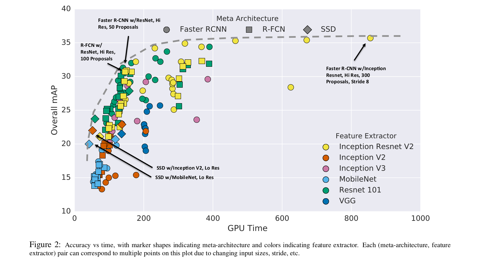

### 4.1.2 Critical points on the optimality frontier
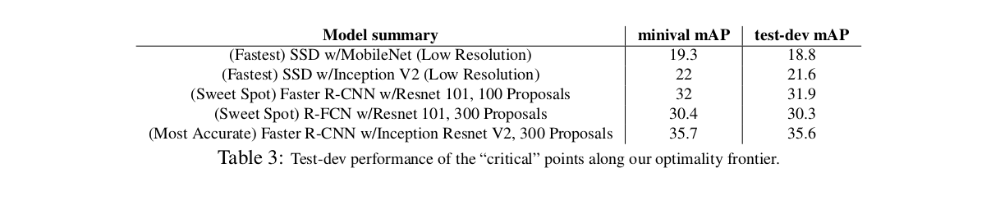

### 4.1.3 The effect of the feature extractor
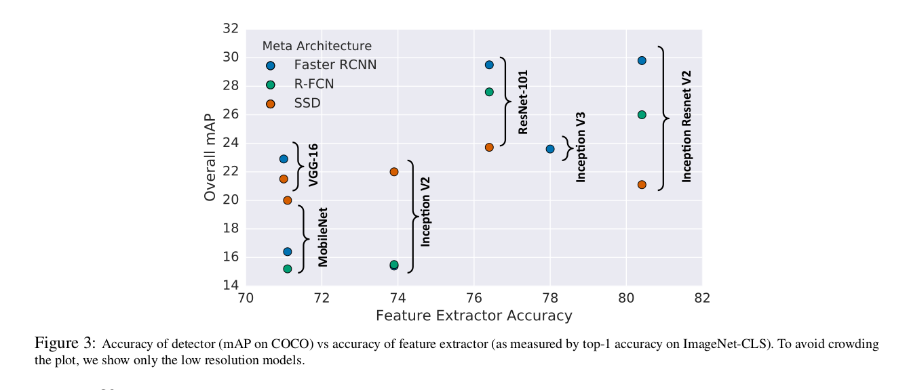

### 4.1.4 The effect of object size
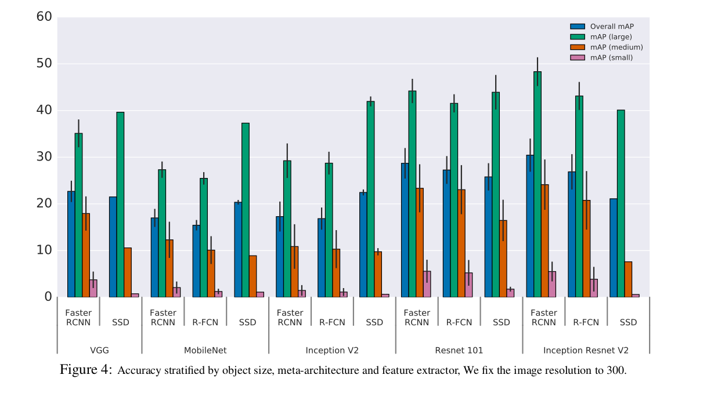

### 4.1.6 The effect of the number of proposals
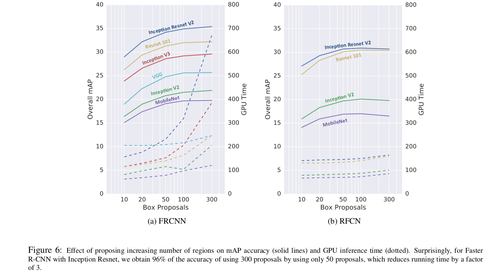

### 4.1.7 FLOPs analysis
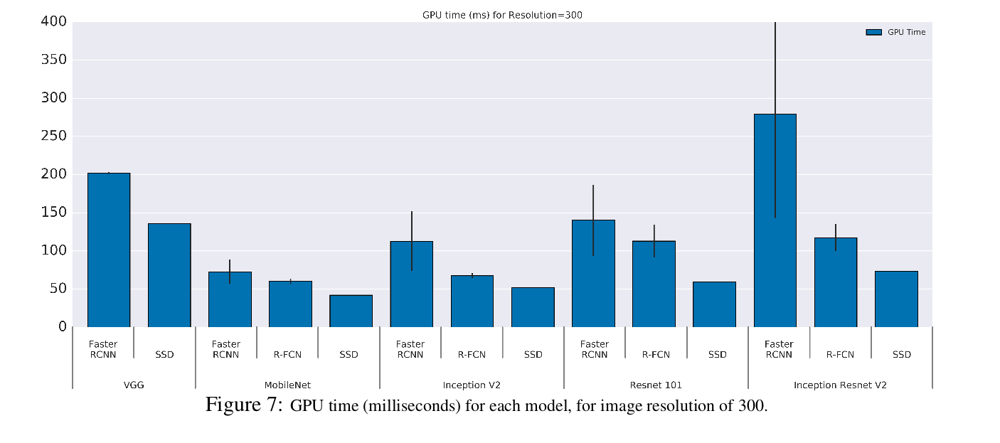

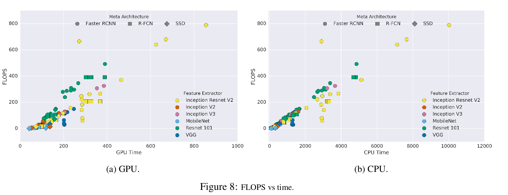

### 4.1.8 Memory analysis
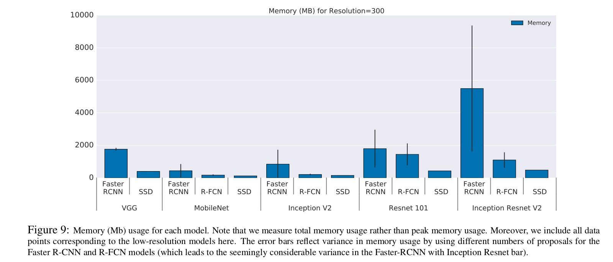

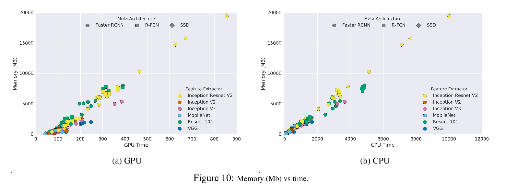

### 4.1.9 Good localization at .75 IOU means good localization at all IOU thresholds
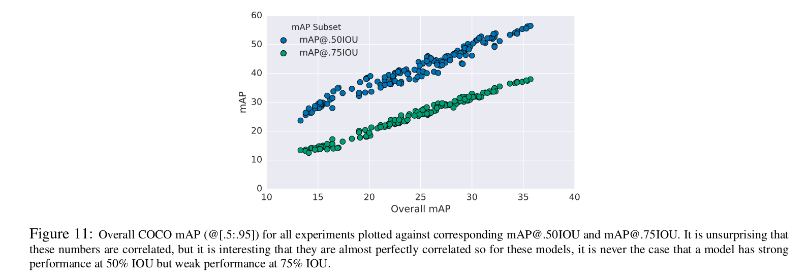

## 4.2. State-of-the-art detection on COCO
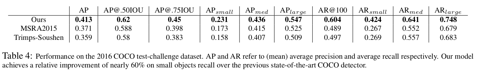

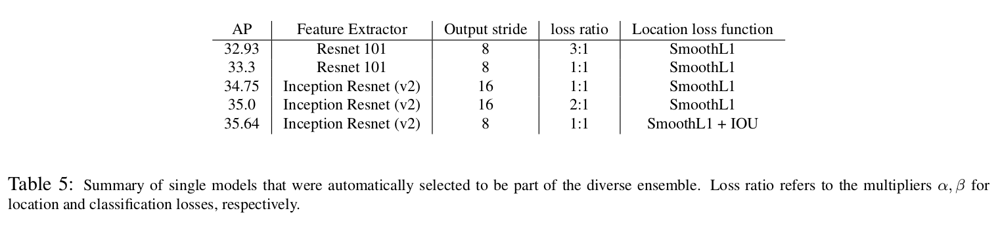

