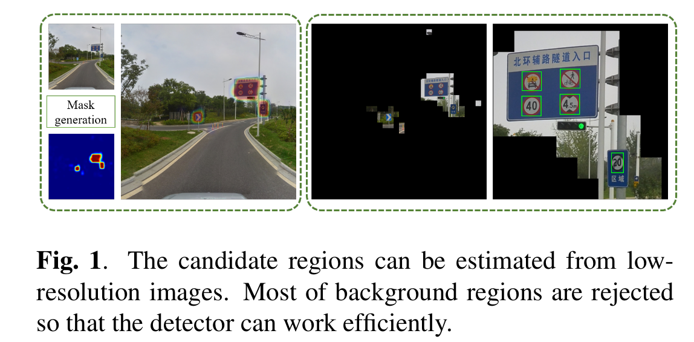

Cascade Mask Generation Framework for Fast Small Object Detection
=

# 1. Introduction
对象检测是计算视觉中的一个基础研究。这项任务旨在定位图像中的特定对象，并确定它们属于哪个类别。受深度学习在大尺度图像识别中的成功的驱动，许多基于 CNN 的对象检测框架在最近几年被提出。它们显著提高了主要多个基准测试的性能。

然而，小型对象检测仍然面临巨大挑战。主要原因是小对象的表征是不充分的。已有的基于 CNN 的检测方法通常在前馈神经网络中应用几个池化/下采样操作。在深度层中，特征表示的空间分辨率比输入图像中对象的分辨率小数十倍或百倍。有时，描述小型对象的有效信息在深度层中难以存在。

一种直接的解决这个问题的方案是扩大输入图像的大小。例如，特征大小是按比例放大的，而且特征表示更精细。然而，计算成本也成比例的增加，更多的计算成本浪费在无关的背景上，使得整个检测过程效率低下。

本文中，我们提出级联掩模生成框架来处理小型对象检测问题。在典型的道路信号检测应用中，我们注意到道路信号的大小大约仅占据完整图像的 0.7% ，而且剩下的区域主要是背景。提取背景的精细特征是没有必要的。受 RoI 卷积[1]的启发，在神经网络中进行卷积、池化、归一化等操作时，可以丢弃背景区域。在有限的 GPU 内存下，它可以节约大量时间，并允许我们传入一个更大尺寸的图像。

实现这种思想的关键问题是如何有效的定位无用的背景区域。幸运的是，多数背景（例如天空和道路）占据较大区域，并且即使输入图像很小，也能轻松地检测。因此，我们可以使用低分辨率的图像来估计一个不包括背景区域的掩码。然后，余下的区域可以以更高的分辨率进行处理，而无需花费太多成本。我们可以进一步采用一个级联的架构来过滤更多的区域。具体而言，输入图像被调整到多个尺度，并且它们按尺度升序处理。对于每个输入尺度，除了对象提议之外，还会为下一个尺度输入生成一个掩码。图 1 展示了所提出的框架的基本思想。

所提出的框架的好处有两点。一方面，它显著降低了计算成本。另一方面，早期阶段过滤掉 easy negative ，使得后面的阶段关注 hard negative example 。它隐式地实现了 hard example mining ，其已被证明可以提高训练效率。我们在 Tsing-Tencent 100K 道路信号基准测试上评估我所提出的框架。结果表明我们的框架能够比最先进的检测器在时间和精度上做出更好的权衡。

# 2. Related Work
对象检测已被广泛研究多年。最近，由于深度卷积神经网络（CNN）在图像分类上取得极大的成功，许多基于 CNN 的对象检测框架已被提出。它们可以在很大程度上超越手工制作特征的传统方法。通常，主流的基于 CNN 的对象检测框架可以划分为两类： 基于区域的检测器和单次检测器。

基于区域的方法将检测问题视为两个子问题。第一个是搜索图像空间中的候选区域，其因此被称为区域提议。然后这些提议通过强力的分类器划分为不同类别。两阶段框架使得基于区域的方法高度准确。相比之下，单次对象检测器在一步中集成定位和分类。它们基于提取的 CNN 特征直接回归置信度和边界框偏移。单次检测器的特定高度有效，但是它们的准确率不如基于区域的方法高。本文中，我们采用基于区域的检测器。

## 2.2. Small Object Detection
在对象检测任务中，目标对象可以非常小。实例包括交通标志检测、人脸检测和车牌检测。尽管小对象检测可以视为对象检测的实例，通用对象检测器在检测小对象时面临一些问题，如Zhang等人[13]提出的。这种不充分的特征表示是小对象检测的主要局限。为了克服这个问题，Zhang等[13]从浅层池化特征，并采用一个提升的森林分类器。Cai等[14]上采样特征以获得更精细的表示。Hu等[15]《Find tiny faces》使用多尺度输入处理不同大小的人脸。Li等人在[16]中提出了感知生成对抗网络（perceptual generative adversarial network P-GAN）模型来缩小小对象和大对象之间的表示差异。然而，这些方法仍然在无关背景上花费大量计算资源。我们的工作与他们的不同之处在于，我们尽量从昂贵的卷积运算中排除尽可能多的背景区域。

## 2.3. Multi-Scale Scheme
以往的研究已经证明，多尺度方案可以使检测器受益。一些研究[14,12,17]从不同尺度的层中提取和融合特征。由于多尺度方案获得的特征表示更加丰富，实现的精度通常较高，但代价是速度较低。

为了是检测器更有效，Gao等[19]使用一个低分辨率输入，并自适应地拒绝高分辨率输入。然而，它们拒绝了图像级的高分辨率输入，而不是 patch-level 。Chen等[1]在图像金字塔上训练弱分类器以过滤一些背景，其与我们有相同的思想。但是我们的工作中，掩模生成模块（mask generation module: MGM）与区域提议网络（RPN）共享相同的特征。因此，它可以嵌入到原始的检测框架中，而开销可以忽略不计。

# 3. Our Approach
## 3.1. Framework Overview
遵循 Faster R-CNN [9] ，我们使用多尺度输入构建基于区域的检测系统。对于最小的尺度，我们应用标准的 RPN[9] 来提取候选边界框。与此同时，下一个尺度的掩模通过 MGM 估计。MGM 和 RPN 共享相同的基卷积特征图。因此，相比标准的 RPN ，其仅引入很小的开销。

使用前一个尺度生成的掩码，当图像被输入到 CNN 时，背景区域被丢弃。对于余下的区域，我们使用几乎相同的实现作为最小输入： 标准 RPN 和 MGM 。注意，我们不需要估计最后输入的掩模。

区域提议用于 post-classification ，仅如 fast R-CNN 。我们采用 He等[20]提出的 RoI 对齐方法，从最大输入产生的最后一个卷积特征图中提取区域特征。Post-classifier 决定候选属于哪个类。完整框架如图 2 所示。

## 3.2. Mask Generation Module
分辨率 $H \times W$ 的每个图像都被划分为 $h \times w$ 网格。如果一个网格与 ground-truth 边界框重叠，它被设置为正类。相反，如果一个网格与ground-truth 边界框没有重叠，那么他被视为背景区域。我们的 MGM 的目标是生成如此的 $h \times w$ 的网格图。

由于多数对象检测数据仅提供边界框级注释数据，所有它难以进行密集预测。因此，我们设置 $h \times w$ 为 $32 \times 32$ 以进行粗糙预测。表 3 展示我们预测的一个案例。

给定边界框结合 $\{(x_{1i}, y_{1i}, x_{2i}, y_{2i})\}$ ，其中 $(x_{1i}, y_{1i})$ 和 $(x_{2i}, y_{2i})$ 为第 $i$ 个边界框的左上角和右下角，我们通过缩放和量化将它们映射到 $h \times w$ 的网格图：

$$x_{1i}' = \lfloor x_{1i} \frac{w}{W} \rfloor, y_{1i}' = \lfloor y_{1i} \frac{h}{H} \rfloor$$

$$x_{2i}' = \lfloor x_{2i} \frac{w}{W} \rfloor, y_{2i}' = \lfloor y_{2i} \frac{h}{H} \rfloor$$

然后，满足 $x_{1i}' \le x \le x_{2i}'$ 和 $y_{1i}' \le y \le y_{2i}'$ 的像素 $(x, y)$ 被设置为正类样本。没有包含在任何框中的像素被视为负类样本。

我们采用全卷积网络以生成掩模。它采用 $H \times W$ 图像作为输入，并生成一个 $h \times w$ 的热图。简单起见，如果有必要，在骨干网络的最后一个卷积层后添加池化层以产生分辨率为 $h \times w$ 的特征图。然后，我们添加两个 $1 \times 1$ 卷积层。其中一个用于提取掩码生成的特征，另一个用于生成概率图。事实上，MGM 的结构几乎与 RPN 相同。仅有的不同是，MGM 学习区域是否包含对象，而 RPN 学习对象的位置在哪里。

我们使用 softmax 损失以优化 MGM 。由于前景和背景的不平衡，我们使用全部正类样本和随机选择的一些样本，使得它们的比例为 $1:3$ 。请注意，所有样本都是在可用区域中选择的。这意味着如果一些区域被之前的掩模抹去，它们在训练过程中就会被忽略。

## 3.3. Detection Module
检测模块包含两个部分： RPN 和 Post-classifier ，与 Faster R-CNN 框架相似。由于我们使用多尺度输入，所以完整网络有多个 RPN ，并且仅有一个 post-classifier 。对于每个RPN，我们预先定义一个合适的锚点设置，例如，低分辨率RPN期望检测大对象，但忽略小对象。在区域提议之后，候选区从最大输入产生的特征图提取特征，并将它们传入 post-classifier 。由于一些区域被 MGM 丢弃，所以 RPN 不建议在正类区域之外的边界框。

## 3.4. Multi-task Loss Function
完整网络以端到端的方式训练以优化多任务损失函数：

$$L = \lambda_1 \sum_{i=1}^{K-1} L_i^{MGM} + \lambda_2 \sum_{i=1}^K L_i^{RPN} + \lambda_3 L^{R-CNN}$$

其中 $K$ 是阶段数量。$L_i^{MGM}$ 和 $L_i^{RPN}$ 分别为第 $i$ 个阶段 MGM 和 RPN 模块的损失函数。$L^{R-CNN}$ 为 post-classifier 的损失函数，其与[8]的定义相同。我们在实验中，设置损失权重 $\lambda$ 为 1 。

## 3.5. RoI Implementation
加速检测的核心思想是所有的神经操作都只在正类区域进行。因此，网络不需要处理背景，使得需要的计算资源显著减小。

为了便于实现，每幅图像被划分为网格，并且预处理阶段仅正类区域被存储到 GPU 内存中。他确保可以使用较大的图像作为输入。遵循 Caffe 和 Chen 等[1] ；我们将卷积操作转换为 BLAS 库的矩阵乘法。然而，不同于 Chen 等[1] ，我们在训练和测试中，采用 RoI 卷积。

## 4. Experiments
为了验证我们框架的有效性，我们旨在 Tsinghua-Tencent 100K 交通信号数据集上进行实验。它包含 30000 个交通信号实例。图像分辨率为 $2048 \times 2048$ ，但是交通信号一般小于 $32 \times 32$ 像素。数据集包含大于 200 中不同的交通信号。遵循 [22,16] 我们忽略类实例小于 100 的类。最终，我们保留 45 个类进行评估。

先前的工作[22,16]使用召回率和准确率作为评估度量。在这项研究中，我们是有用额外的 F1-meansure 作为评估独立以给出直观比较。实例被分为小型对象（ $area < 32^2$ 个像素）、中型对象（$32^2 < area < 96^2$） 和大型对象（$area > 96^2$） 。我们报告不同类型实例的检测性能。

## 4.2. Implementation Details
我们使用 VGG-16 网络作为骨干以进行特征提取。我们移除预训练的 VGG-16 网络的最后几个卷积块（conv5-x）。网络的步长为 8 ，其为原始设置的一般。由于更加细粒度的特征图，如此修改证明有助于检测小对象。我们的实验中，进一步研究早期阶段的网络罪数深度和复杂度不是必要的。因此，我们使用一个浅层网络，其在异地阶段采用 Inception 网络的第一个块。

我们比较不同尺度配置。因为高和宽总是相同的，所以我们仅使用 $s$ 来表示输入大小 $s \times s$ 。例如，一个输入分辨率为 $128 \times 128$、 $512 \times 512$ 和 $2048 \times 2048$ 的三阶段检测器表示为 $128-512-2048$ 。

在训练和推理阶段，我们设置 hard 阈值为 0.001，以抹去背景区域。为了避免在早期训练中有过多的正类区域，我们仅前向传播具有最高得分的前 $\alpha$ 比例的区域。在三阶段情况下，对于第一阶段的分辨率为 $128 \times 128$ 、$400 \times 500$ 和 $512 \times 512$ 的输入， $\alpha$ 设置为 40%、 20% 和 18% ，对于第二阶段输入，设置为 12% 。在两阶段情况下，我们设置 $\alpha$ 为 12% 。

我们的网络可端到端训练。然而，从最开始执行端到端训练是不稳定的。原因是 MGM 不同在早期训练很好地工作。为了处理这个问题，我们为 MGM 执行预训练。然后，端到端联合训练所有部分。

我们使用基于 Caffe 平台来实现该框架。网络使用随机梯度下降法训练。动量为 0.9 ，权重衰减为 0.0005 。所有模型在单个 NVIDIA GTX1080Ti GPU 上测试。

## 4.3 Detection Performance
我们使用官方的 Faster R-CNN 作为我们的基线检测器。为了公平比较，所有基线检测器和我们的级联架构有相同的骨干网络。

表 1 为输入大小对检测性能的影响。

## 4.4. Mask Generation Performance

## 4.5. Influence of RoI Percentage

## 4.6. Qualitative Results

