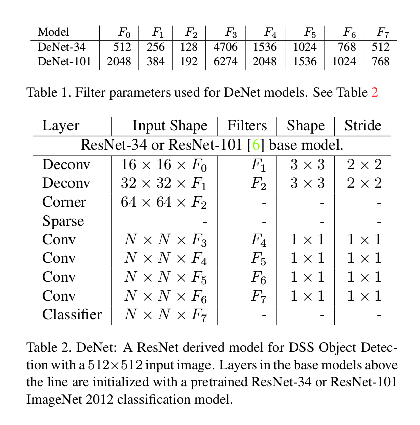
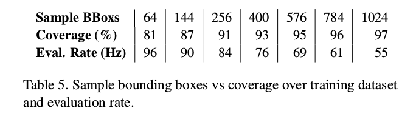
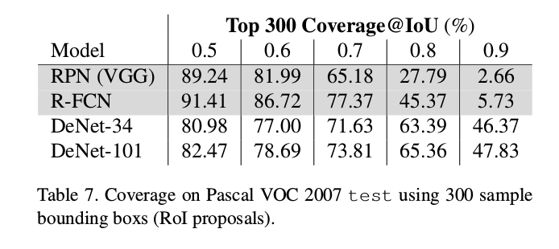
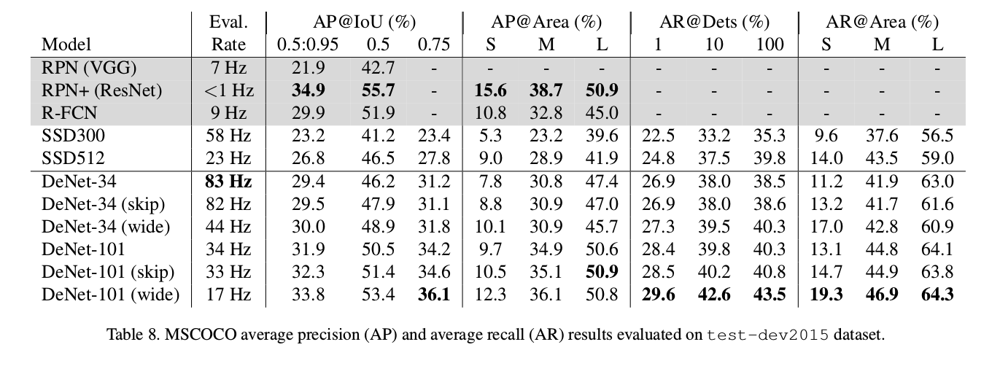
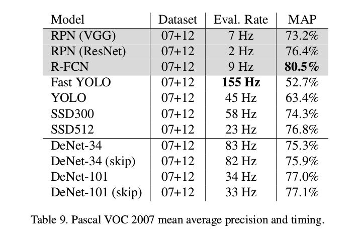

DeNet: Scalable Real-time Object Detection with Directed Sparse Sampling
=

# 1. Introduction
本文的贡献：
- 改进了对现代检测方法的理论理解和描述它们的通用框架，即定向稀疏采样（Directed Sparse Sampling）。
- 一种不需要手工定义参考（reference）边界框的新颖、快速、兴趣区域估计器。
- 反卷积层的新应用极大地提高了评估率。
- 我们的方法的六种实现证明了在一系列基准测试中的竞争性检测性能。

## 1.2 Probabilistic Object Detection
首先，我们架构概率化多类检测问题公式化为估计分布 $\Pr (s | B, I)$ ，其中 $s \in S \cap \{null\}$ 是表示类实例 $c \in C$ 或者 $null$ 类（表明没有实例）的存在性，其被边界框 $B = \{x, y, w, h\}$ 充分包围。这个公式包含了每个边界框仅被单一类实例占据的假设。我们注意到该定义不寻求执行实例分配，而是可以用作算法的输入，例如，Non-Max Suppression 。

给定合适的神经网络设计，我们断定 $\Pr(s|B)$ 可以由具有类边界框标注的训练数据中估计。然而，因为唯一边界框的数量由 $|B| \propto XYWH$ 给出，其中 $(X,Y)$ 是图像位置的数值，而 $(W,H)$ 是边界框尺寸的范围，因此，朴素的解决方案很快变得难以处理。例如，假设在ImageNet数据集中最通用的设置为 1000 个类和 $224 \times 224$ 的图像，并考虑图像中所有有效的边界框，表示这个分布大约需要 $629 \times 10^9$ 个值或者2.5TB的32位浮点值。这对于当前的硬件来说是难以处理的。

以定位精度为代价，对输出边界框进行二次采样是一种有效的方法。例如，例如，通过仔细的数据集依赖手动工程，Faster R-CNN和基于YOLO的方法将分布子采样到 有序的 $10^4$ 到 $10^5$ 个边界框[14] [15]。然后，通过线性回归仅估计局部区域中最可能的边界框来细化这些框。作为大规模子采样的替代方案，我们试图利用以下事实：由于遮挡和其他因素，我们期望非常小的边界框子集包含除 $null$ 类之外的类实例。因此，我们基于单个端到端CNN的最先进的回归能力开发了一种解决方案，该解决方案实时（或计算约束）的操作环境下，估计高度稀疏的分布 $Pr(s | B)$ 。

# 2. Directed Sparse Sampling (DSS)
我们使用术语定向稀疏采样来指代应用联合优化的两级CNN的方法，其中一个阶段估计用户定义的感兴趣值发生的可能位置，而另一个阶段稀疏地分类所识别的值，例如， 在基于R-CNN的模型（包括R-FCN和DeNet）中，我们估计最有可能包含非空类赋值的边界框，然后在这些边界框上运行分类。

## 2.1. Corner-based RoI Detector
在这里，我们介绍了进行有效感兴趣区域（RoI）估计的边界框角点估计的概念。在我们的方法中，通过估计图像中的每个位置包含 4 个角类型之一的实例的可能性，即 $\Pr(t | k,y,x)$ 来执行此任务，其中 $t$ 是表明在输入图像中的位置 $(x,y)$ 存在角 $k \in \{top \_left, top\_right, bottom\_left, bottom\_right\}$ 的二值变量。我们断言，由于问题的自然平移不变性，可以使用在边界框注释图像数据（例如MSCOCO [11]，Pascal VOC [1]等）上训练的标准CNN来有效地执行角分布的估计。

通过定义角分布，我们通过将朴素贝叶斯分类器应用于边界框的每个角来估计边界框 $B$ 包含实例的可能性：
$$\Pr(s \ne null | B) \propto \prod_k \Pr(t|k,y_k,x_k)  \tag 1$$
其中，$(x_k, y_k) = f_k(B)$ 表示每个角类型 $k$ 相关的边界框位置。为了易于实现，我们定义具有最大非 $null$ 概率 $\Pr(s\ne null | B)$ 的 $N \times N$ 的边界框为 _sampling bounding boxes_ $B_S$ 。用户定义的变量 $N$ 平衡模型可以处理的最大检测数量与计算和内存要求。

在估计可能的非 $null$ 边界框的情况下，我们将预定义长度的特征向量从角点检测器模型传递到最终分类阶段。因此，最终的分类阶段形式为 $f: \bar{\alpha}_B \rightarrow \Pr(s|B)$ ，其中 $\bar{\alpha}_B$ 通过 _sampling bounding boxes_ $B \in B_S$ 唯一确定的特征向量。特征与每个边界框唯一关联是重要的，否则分类器没有信息来区分具有相同 $\bar{\alpha}_B$ 的边界框。如何精确地构建特征向量仍然是一个争论性问题，然而，我们通过将除了边界框宽度和高度之外的相对于每个采样边界框（例如，边界框角，中心等）的预定义位置处的 _最近邻采样特征_ 连接在一起来构造 $\bar{\alpha}_B$ 。从特征向量中省略了边界框中心位置，使得分类器对图像偏移是无关的。

## 2.2. Training
在训练期间，最初向前传播模型以生成如前一小节中所述的采样边界框 $B_S$ 。此外，我们通过ground-truth 边界框和随机生成的样本来增强采样边界框。然后，我们将与采样边界框的增强集相关的激活 $\bar{\alpha}_B$ 传到余下的模型中，以产生最终的分类分布 $\Pr(s|B_S)$ 和更新边界框参数。采样边界框 $B_S$ 的集合在梯度估计期间为常量，以确保端到端训练，因此，角点检测器网络结合边界框分类和估计任务进行优化。由于前向传播是通常用于优化神经网络的基于反向传播的SGD策略中的必要预处理步骤，因此，DeNet方法不会对标准密集网络上的训练时间造成任何损失。

DeNet模型联合优化角点概率分布、最终分类分布和边界框回归，即
$$
\begin{alignat}{2}
Cost &= \frac{\lambda_t}{\Lambda_t} \sum_{k,y,x} \phi(t|k,y,x) \ln (\Pr(t|k,y,x)) \\
&+ \frac{\lambda_s}{\Lambda_s} \sum_{B\in B_S} \phi(s|B) \ln(\Pr(s|B))  \\
&+ \frac{\lambda_b}{\Lambda_b} \sum_i SoftL_1(\phi_{B,i} - \beta_i)
\end{alignat} \tag 2
$$
其中 $\phi(\cdots)$ 是ground-truth 角和分类分布， $\phi_{B,i} = \{x_i, y_i, w_i, h_i\}$ 为ground-truth边界框， $(\lambda_s, \lambda_t, \lambda_b)$ 是用户定义的指示每个部分相应强度的常量， $(\Lambda_s, \Lambda_t, \Lambda_b)$ 为将每个部分归一化到 1 的常量。 $SoftL_1$ 在[3]中定义，为smooth L1 损失。 角点分布 $\phi(t|k,y,x)$ 通过将每个ground-truth角映射到焦点图中单一位置来确定。检测分布 $\phi(s|B)$ 通过计算ground-truth边界框和采样边界框 $B_S$ 之间的 IoU 来确定。遵循标准的实践，回归目标边界框 $\phi_B$ 通过选择与ground-truth 边界框之间的最大IoU重叠来确定。

## 2.3. Detection Model
本文选择 34 层、21M 参数的ResNet-23模型（DeNet-34）和 101层、45M参数的ResNet-101模型（DeNet-101）。

对于每个基本模型，我们将输入大小修改为 $512 \times 512$ 像素，移除最终平均池和完全连接的层，并附加两个反卷积[13]层，然后是角点检测器。角点检测器负责生成角点分布，并通过在每个空间位置学习具有 $F_s$ 特征的线性投影生成特征采样图（feature sampling map）。反卷积[13]层有效地重新引入在基础模型中丢失的空间信息，使得特征图和角点概率分布可以以更大的空间分辨率定义，即 $64 \times 64$ ，而不是 $16 \times 16$ 。这导致每个采样边界框的最小尺寸为 $16\times16$ 像素。

在角落检测器之后是稀疏层，其观察由角落检测器识别的角并生成一组采样边界框（RoI）。这些 RoI 用于从 _feature sampling maps_ 中提取一组 $N \times N$ 的特征向量。本文中，我们从 4.2M 有效边界框中稀疏采样 $N^2$ 个边界框。通过提取与 $7 \times 7$ 网格相关联的最近邻采样特征加上边界框宽度和高度来构造特征向量。这产生 $7 \times 7 \times F_s + 2$ 个值的特征。我们发现最近邻采样是足够的，因为特征采样图具有与边界框角相同的，相对较高的空间分辨率。最后，特征向量通过相对浅的全连接的网络传播，以产生每个采样RoI的最终分类和微调边界框。

表1和表2描述了附加到基本模型的额外层，定义如下：
- **Conv：** 在输入激活上包含一系列2D滤波器。滤波器午安中通过方差为 $\sigma^2 = 2 / (n_f n_x n_y)$ 的正态分布 $\cal{N}(0, \sigma)$ 初始化，其中 $n_f$ 为滤波器数量， $(n_x, n_y)$ 是它们的空间形状。每个卷积后是批归一化和ReLU激活函数。

- **Deconv：** 反卷积 + ReLU激活。在这种情况下，它相当于放大两个空间维度然后应用Conv层。

- **Corner：** 通过 softmax 函数估计角点分布，并产生采样图。

- **Sparse：** 从角点分布中确定采样边界框，并从采样特征图中产生固定大小的采样特征。

- **Classifier：** 通过 softmax 函数将激活映射到期望的概率，并生成边界框目标。

对于DeNet-34，我们使用 ResNet-34 基础模型和 $F_s = 96$ 以产生4706个值的特征向量，以及总共 32M 的参数。对于 DeNet-101 模型，使用 ResNet-101，并将所有滤波器的数量增加大约 1.5 倍，这些改变产生6274个值的稀疏特征向量，以及总共 69M 参数。

### 2.3.1 Skip Layer Variant
作为扩展，我们考虑使用跳过层来扩充DeNet模型。在这种情况下，这些层将Deconv层与基本模型中具有相同空间维度的最终层相连接。我们的实现遵循[10]，每个跳过层执行源特征到目标特征维度的线性映射，并简单地相加以产生特征图（在激活之前）。

### 2.3.2 Wide Variant
在这个模型中，我们修改了跳过模型变体，通过添加另一个Deconv和skip层，为角和特征采样图使用 $128 \times 128$ 空间分辨率。我们也将 $N$ 增加到 48 以产生 2304 个 RoI 。在当前的实现中，由于增加的分类负担和用于识别RoI的CPU限制算法，该方法伴随着相当大的定时成本。 通过进一步的工程设计（例如重复数据删除），我们相信这些成本可以降低。

# 3. Implementation Details
## 3.1. Training methodology
所有实验中， 使用初始学习率为 0.1、momentum为0.9和 weight decay 为0.9（仅应用到权重） 的 Nesterov SGD 训练。 批大小为 128 ，每个 GPU 使用 32 个样本。学习率在 30 个 epoch 、60 个epoch 时除以10，共训练 90 个epoch 。

数据增强略。

## 3.2. Identifying Sampling Bounding Boxes（RoIs）
开发了一种简单的算法以快速地搜索 non-null 边界框的角点分布：
1. 搜索角点 $\{k, y, x\} \in C_{\lambda}$ 的角点分布，其中 $\Pr(t=1|k,y,x) > \lambda$ 。即搜索 $\Pr(t=1|k,y,x) > \lambda$ 的角点。
2. 对于每个角点类型，选择具有最大似然的 $M$ 个角 $C_M \subseteq C_{\lambda}$ ，即前 $M$ 个概率最大的角。
3. 通过匹配 $C_M$ 中的 top-left 的每个角与每个类型的 bottom-right 中的每个来生成一组唯一的边界框。
4. 在 top-left 集合里面和 bottom-right 集合里面任取两个组成一个边界框，通过式（1）计算这个边界框里面有物体的概率；
5. 使用 top-right 和 bottom-left 的角类型重复步骤2和3 。
6. 根据概率排序边界框，并保留前 $N^2$ 个最大概率的边界框以产生采样边界框 $B_S$ 。

由于在步骤1中剔除了绝大多数角落，因此该方法获得了超过普通的暴力方法的显着加速，即测试每个可能的边界框。

# 4. Results and Analysis
表3为各种模型的概览：

## 4.1. Hyperparameter Optimization

## 4.2. Timing Breakdown and Evaluation Rates

## 4.3. RoI Coverage Comparison

## 4.4. MSCOCO

## 4.6. Pascal VOC 2007

## 4.7. Pascal VOC 2012

