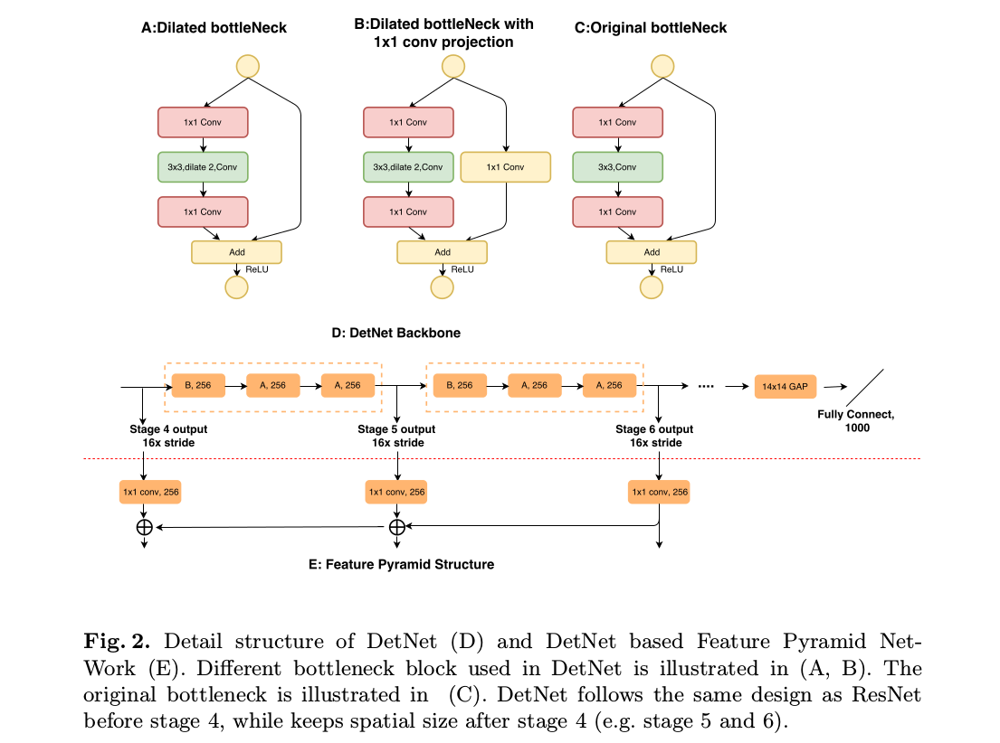
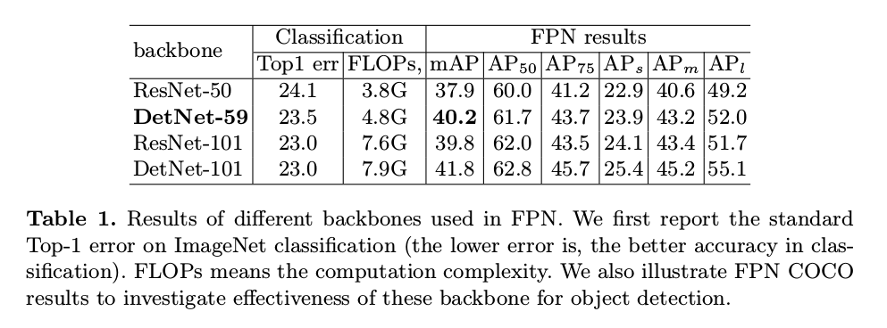
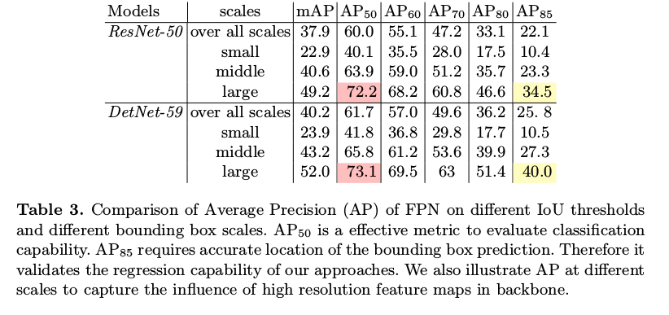
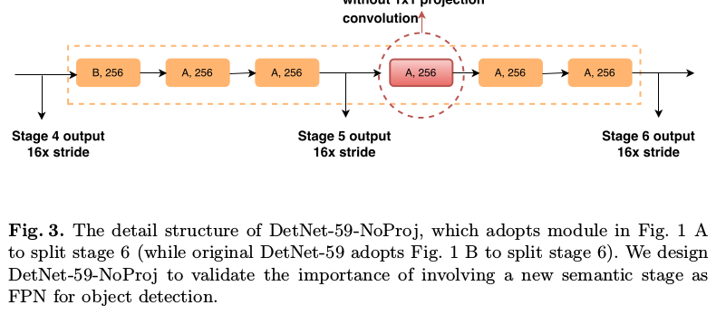
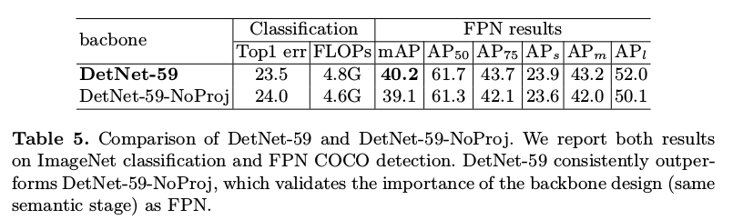
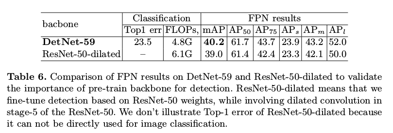
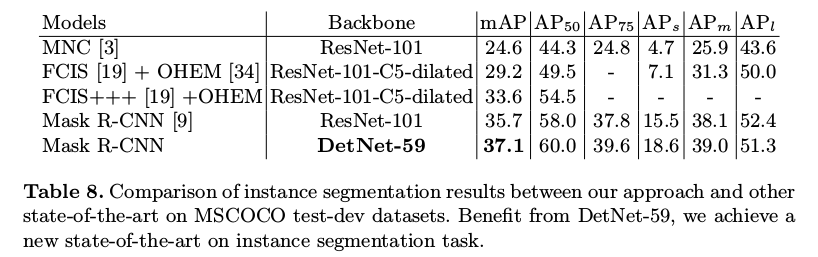

DetNet: A Backbone network for Object Detection
=

# 1 Introduction
大多数检测方法都是在ImageNet预训练的网络上微调。然而，在图像分类和对象检测问题之间存在差距，其不仅需要识别对象实例的类别而且还需要在空间上定位边界框。更具体地，在对象检测任务中使用分类骨干网络存在两个问题：（i）为了检测不同尺度的对象，最近的检测器（如FPN）相比用于分类的骨干网络包含额外的阶段。（ii）传统的骨干基于大的下采样因子，产生更大的感受野，这有益于视觉分类。然而，空间分辨率受到损害，这将无法准确地定位大对象并识别小对象。

贡献:
- 分析用于微调检测器的传统ImageNet预训练模型固有的缺点。
- 提出了一种名为DetNet的新型骨干，它通过保持空间分辨率和扩大感受野而专门为对象检测任务而设计。
- 在MS-COCO检测和实例分割上，基于低复杂度的DetNet59骨干获得最佳结果。

# 3 DetNet: A Backbone network for Object Detection
## 3.1 Motivation
最近的对象检测器依赖于一个骨干网络，它在ImageNet分类数据集上预训练。由于ImageNet分类任务不同于对象检测，对象检测不仅需要识别对象类别，而且需要从空间上定位边界框。由于如VGG16和ResNet的标准网络的特征图的空间分辨率逐渐减小，这种图像分类的设计准则不利于定位任务。一些如图1 A的FPN和膨胀技术被用到这些网络以维持空间分辨率。然而，当使用这些骨干网络训练时，仍然存在如下三个问题。

- _The number of network stages is different._ 如图1 B ，通常的分类网络包含5个阶段，每个阶段通过 2x 池化或步长为2的卷积下采样特征图。因此，输出特征图的分辨率是32倍的下采样。不同于传统的分类网络，特征金字塔检测器通常采用更多的阶段。例如，FPN中，添加附加的阶段 $P6$ 来处理更大的对象。RetinaNet以相同的方式添加 $P6$ 和 $P7$ 。显然，额外的阶段（如 $P6$）没有在ImageNet数据集上预训练。

- _Weak visibility (localization) of large objects._ 具有强语义信息的特征图相对于输入图像具有的步长为32，这带来较大的有效感受野，并导致ImageNet分类任务的成功。然而，大步长因子损害对象定位。在FPN中，大对象在更深层产生和预测，这些对象的边界可能太模糊以至于不能得打准确的回归。当更多的阶段加入到分类网络中后，这中情况会更糟，因为更多的下采样给对象带来更大的步长。

- _Invisibility (recall) of small objects._ 大步幅的另一个缺点是缺少小对象。随着特征图的空间分辨率降低并且集成了大的上下文信息，来自小对象的信息将容易减弱。因此，特征金字塔网络在浅层预测小对象。然而，浅层通常具有较低的语义信息，这不足以识别对象实例的类别。因此，检测器通常通过涉及来自更深层的高级表征的上下文信息来增强其分类能力。如图1 A所示，FPN通过bottom-up路径缓解这个问题。然而，如果小对象在更深层缺失，那么这些上下文信息同时也会减小。

为了解决这些问题，提出DetNet，其包含如下特点：（i）阶段的数量直接设计用于对象检测。（ii）经过使用了比传统分类网络更多的阶段（如阶段6和阶段7），但仍然保持特征的高空间分辨率，同时保持大感受野。

与用于物体检测的ResNet等传统骨干网络相比，DetNet具有多项优势。首先，DetNet与传统检测器使用的阶段数完全相同，因此可以在ImageNet数据集中预先训练像 $P6$ 这样的额外阶段。其次，收益与最后阶段的高分辨率特征图，DetNet在定位大对象的边界和寻找小对象方面更为强大。

## 3.2 DetNet Design
本文采用ResNet-50作为基线。为了公平地比较ResNet-50，保持与原始ResNet-50相同的阶段1,2,3,4 。

为对象检测制作高效且有效的主干存在两个挑战。一方面，保持深度神经网络的空间分辨率耗费极大地时间和内存。另一方面，减小下采样因子将导致较小的有效感受野，这将损害许多视觉任务，如图像分类和语义分割。

DetNet被设计用于处理两个挑战。具体地，DetNet遵循ResNet的懂第1阶段到第4阶段的相同设置。不同之处开始于第5阶段，图2 D为用于图像分类的DetNet。DetNet也可以轻松地扩展到深度。详细设计如下：
- 在骨干中引入额外的阶段（如 $P6$），其将用于如FPN中的对象检测。同时，在阶段4之后，固定空间分辨率为16倍的下采样。
- 因为阶段4后，空间分辨率被固定，为了引入新的阶段，在每个阶段的开始处，采用有 $1 \times 1$ 卷积投影的膨胀瓶颈（如图2 B）。这对于如FPN的多阶段检测器很重要。
- 使用具有膨胀的瓶颈作为基本网络块以有效地扩大感受野。因为膨胀卷积仍然耗费时间，所有在阶段5和阶段6保持与阶段4相同的通道（对于瓶颈块为256个输入通道）。这不同与传统骨干设计，传统骨干在后面阶段中加倍通道。

本文采用FPN结构，除了骨干外，保持FPN的其他结构不变。因为，在ResNet-50的阶段4之后，不再减小空间尺寸，所有简单地在top-down路径中将这些阶段的输出相加。

# 4 Experiments
## 4.1 Detector training and inference
8个Pascal TITAN XP GPU，使用weight decay = 0.0001和momentum = 0.9的synchronized SGD优化。每个GPU输入两张图像，因此有效batch-size为16 。将短边调整到800像素，长边限制到1333像素。通过在图像的右下角填充零来将小批量图像填充到相同的大小。初始学习率设置为0.02 ，120k和160k时分别乘以0.1 ，最终训练180k。在前500次迭代中，使用warmup策略，学习率从 $0.02 \times 0.3$ 增加到0.02 。

使用ImageNet预训练的权重初始化。固定骨干网络中阶段1的参数。Batch normalization在检测器微调时也要固定。仅采用简单水平翻转增强数据。对于提议生成，首先选择12000个最高得分的提议，然后通过NMS操作得到2000个RoI用于训练。在测试时，使用 6000/1000（6000个最高得分用于NMS，在NMS后输出1000个RoI）的设置。同时，采用Mask R-CNN中的RoI-Align 。

## 4.2 Backbone training and inference
遵循ResNeXt中的超参数和训练设置，使用ImageNet分类数据在8张Pascal TITAN XP GPU上，以批大小为256训练backbone 。遵循用于测试的标准验证策略，报告从256的短边图像上从中心剪裁 $224\times224$ 的单一图像的验证错误率。

## 4.3 Main Results
表1为DetNet-59在ImageNet分类数据上的准确率和其作为FPN的COCO检测结果。

