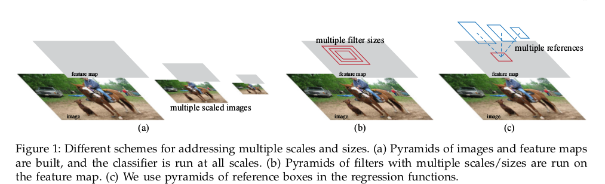
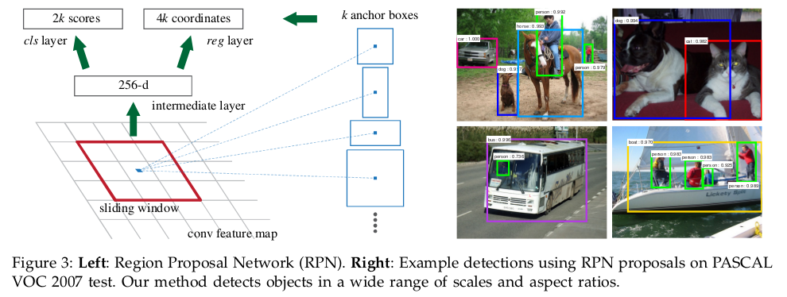

Faster R-CNN: Towards Real-Time Object Detection with Region Proposal Networks
=

# 1 Introduction
候选成为测试时计算的瓶颈。本文观察到被基于区域检测器使用的卷积特征图，如Fast R-CNN，也能够用于生成区域提议。在卷积层的顶部添加了一个Region Proposal Network(RPN)，RPN添加少量额外的卷积层，在卷积层同时回归标准网格中每个位置的区域边界和对象性得分。

RPN使用宽范围的尺度和纵横比来预测区域提议，其引入了 “anchor” 边界框，并将anchor作为多种尺度和纵横比的参考。该方案可以被认为是回归参考的金字塔（图1(c)），它避免了枚举多尺度或纵横比的图像或滤波器。

# 3 Faster R-CNN
两个部分：一是建议区域的全卷积网络，另一个是Fast R-CNN检测器。

## 3.1 Region Proposal Networks
RPN获取任意尺寸的图像作为输入，并输出矩形对象提议集合，每个提议包含一个对象性得分。为了生成区域提议，在最后一个共享卷积层输出的卷积特征图上滑动一个小网络。该小网络将输入卷积特征图的 $n \times n$ 空间窗口作为输入。每个特征图被映射到一个更低维特征（ZF为256-d，VGG为512-d，后跟一个ReLU）。这个特征被馈入两个兄弟全连接层——边界框回归（ $reg$ ） 和 边界框分类（ $cls$ ）。本文中使用 $n = 3$ ，注意输入图像的感受野是很大的（ZF和VGG分别为171和228）。这个迷你网络如图3（左）所示，全连接层被所有空间位置共享。该架构由 $n \times n$ 卷积层后接两个兄弟 $1 \times 1$ 卷积层自然地实现。

   

### 2.1.1 Anchors
在每个滑动窗口的位置，同时预测多个区域提议，其中每个位置的最大可能提议的数量表示为 $k$ 。因此，$reg$ 层有 $4k$ 个输出，它们编码 $k$ 个边界框的坐标。 $cls$ 层输出 $2k$ 个得分，它们估计每个提议对象或者非对象的概率。这 $k$ 个提议参数化为相关的 $k$ 个参考边界框，称之为锚（anchor），如图3（右）。本文使用3个尺度和3个纵横比，每个滑动位置产生 $k = 9$ 个锚。对于大小为 $W \times H$ 的卷积特征，共有 $WHk$ 个锚点框。

**Translation-Invariant Anchors**
Faster R-CNN的一个重要特性是平移不变性（translation invariant），并且是anchor和计算相关anchor提议的函数都是平移不变的。

**Multi-Scale Anchors as Regression Refrences**
本文基于anchor的方法是建立在anchor金子塔（pyramid of anchors）之上。Faster R-CNN通过参考不同尺度和纵横比的锚点框来分类和回归边界框。它仅依靠单一尺度的图像和特征图，并使用单一尺寸的滤波器（特征图上的滑动窗口）。由于多尺度设计的anchor，Faster R-CNN引入了多尺度。

### 2.1.2 Loss Function
训练RPN时，为每个anchor分配一个二值标签（是否为目标）。以两种方式分配正类标签：（i）与ground-truth有最高IoU值的anchor，（ii）与ground-truth的IoU值高于0.7的anchor。注意，一个ground-truth边界框可能分配正类标签给多个anchor。通常第二个条件已能满足对正样本的确定，但是仍采用第一个条件，是为了防止少量的ground-truth没有分配到正样本。负anchor为与ground-truth的IoU小于0.3的非正类anchor。其他的锚点框被忽略。

损失函数为：
$$
L(\{p_i\}, \{t_i\}) = \frac{1}{N_{cls}}\sum_i L_{cls}(p_i, p_i^* )  \tag 1  \\
+ \lambda \frac{1}{N_{reg}}\sum_i p_i^* L_{reg}(t_i, t_i^* )
$$
这里，$i$ 是mini-batch中anchor的索引， $p_i$ 是anchor $i$ 是对象的预测概率。如果anchor是正类，则ground-truth标签 $p_i^*$ 为1；反之，  $p_i^*$ 为0。$t_i$ 是预测边界框的4个参数化坐标向量，$t_i^*$ 是与ground-truth关联的正类anchor。分类损失 $L_{cls}$ 是两个类别（对象和非对象）的对数损失。对于回归损失，采用 $L_{reg}(t_i, t_i^*) = R(t_i - t_i^*)$，其中 $R$ 是鲁棒性的损失函数—— smooth $L_1$。$P_i^* L_{reg}$ 意味着仅对正类anchor激活回归损失。

损失函数的两项分别使用 $N_{cls}$ 和 $N_{reg}$ 规范化，并使用平衡参数 $\lambda$ 加权。本文中，$cls$ 项使用mini-batch大小（即 $N_{cls} = 256$ ）规范化， $reg$ 项被anchor位置数量（即 $N_{reg} \sim 2400$ ）规范化。默认设置 $\lambda = 10$。

对于边界框回归，采用如下的方法：
$$
t_x = (x - x_a) / w_a, t_y = (y - y_a) / h_a,  \\
t_w = \log(w / w_a), t_h = \log(h / h_a),  \\   \tag 2
t_x^* = (x^* - x_a) / w_a, t_y^* = (y* - y_a) / h_a,  \\
t_w^* = \log(w^* / w_a), t_h^* = \log(h^* / h_a)
$$
其中， $x, y, w, h$ 分别viashi边界框的中心坐标和他的宽度和高度。 $x, x_a, x^\ast$ 分别表示预测框、锚点框和ground-truth框。在本文的公式中，用于回归的特征在特征图上具有相同的空间大小（ $3 \times 3$ ）。 考虑到不同的大小，学习了一组 $k$ 个边界框回归量。 每个回归量负责一个比例和一个纵横比，并且 $k$ 个回归量不共享权重。 因此，由于锚的设计，即使特征具有固定尺寸/比例，仍然可以预测各种尺寸的边界框。

### 2.1.3 Training RPNs
RPN可以通过反向传播和随机梯度下降端到端的训练。 在一幅图像中，随机采样256个anchor来计算mini-batch的损失，其中正负anchor的比例为 $1:1$ 。如果正样本不足，就用负样本补足。

新添加层的初始化方法为均值为0，标准差为0.01的高斯分布。微调ZF-net的全部层和VGG从conv3_1之上的所有层。前60k mini-batch，学习率为0.001，后10k为0.0001。权重衰减为0.0005，momentum为0.9。

## 3.2 Sharing Features for RPN and Fast R-CNN
训练特征共享的网络：   
（i）*Alternating training.* 首先训练RPN，并使用这些提议训练Fast R-CNN。然后，使用Fast R-CNN调整的网络初始化RPN，并且此过程交替进行。

（ii）*Approximate joint training.* 将RPN和Fast R-CNN一同训练，两个阶段的损失被组合一起。但是这种方法忽略了提议的坐标也是网络的响应，因此是近似的。这种方法减少了大约 25-50% 的训练时间。

（iii）*Non-approximate joint training.*

**4-Step Alternating Training.**    
第一步，训练RPN，该网络用ImageNet预训练的模型初始化，并端到端微调，用于生成region proposal；

第二步，由imageNet model初始化，利用第一步的RPN生成的region proposals作为输入数据，训练Fast R-CNN一个单独的检测网络，这时候两个网络还没有共享卷积层；

第三步，用第二步的fast-rcnn model初始化RPN再次进行训练，但固定共享的卷积层，并且只微调RPN独有的层，现在两个网络共享卷积层了；

第四步，由第三步的RPN model初始化fast-RCNN网络，输入数据为第三步生成的proposals。保持共享的卷积层固定，微调Fast R-CNN的fc层。这样，两个网络共享相同的卷积层，构成一个统一的网络。

## 3.3 Implementation Details
输入图像短边为 $s = 600$，anchor的尺度为 $128^2, 256^2, 512^2$，纵横比为 $1:1, 1:2, 2:1$ 。    

对于典型的 $1000 \times 600$ 的图像，大致有20000（ $\approx 60 \times 40 \times 9$ ）个anchor。忽略掉超出图像边界的部分，每张图像有6000个anchor用于训练。

一些RPN提议是高度重合的。为了减少冗余，基于提议得分使用非极大值抑制（NMS）。NMS的IoU阈值为0.7，每幅图像保留大于2000个提议区域。NMS不会降低检测准确率，但是实质上减小了提议数量。在训练Fast R-CNN 时，使用了2000个RPN提议，但是测试时使用不同的数目。
