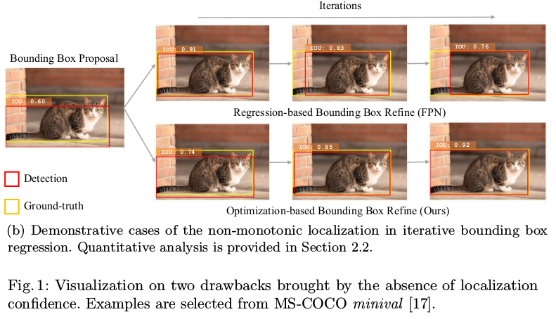
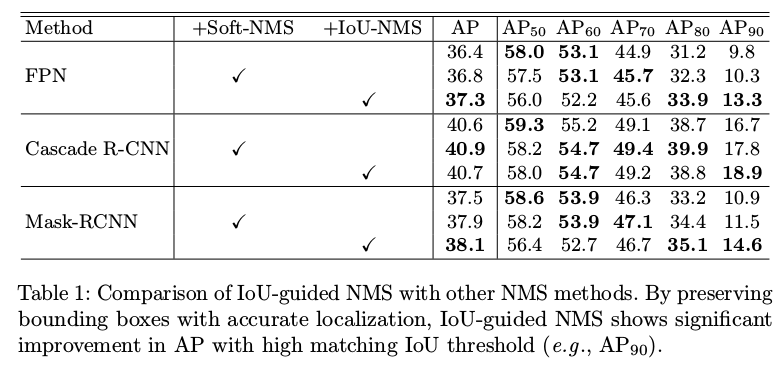
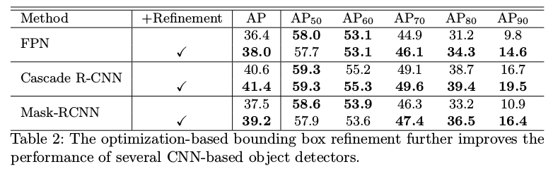

Acquisition of Localization Confidence for Accurate Object Detection
=

# 1 Introduction
基于两阶段的方法将对象检测视为一个多任务学习问题：1）从背景中区分前景对象提议，并给它们分配正确的标签；2）回归一组系数，这些系数通过最大化检测结果和ground-truth之间的IoU或者其他度量来定位对象。最终，冗余的边界框（同一个对象重复的检测）通过非极大值抑制删除。

分类和定位在如此的检测管道中的解决方式不同。具体地，给定一个提议，每个类别标签的概率自然扮演着提议的“分类置信度”的角色，边界框回归模块需要为提议找到最优变换来最好地拟合ground-truth。然而，“定位置信度”在循环中缺席了。

这带来两个缺点：（1）对重复检测的抑制忽略了检测准确性，而分类得分通常用作对提议进行排名的度量。图1（a）显示检测边界框具有较高的分类置信度，而与相应的ground-truth有较小的重叠。分类置信度和定位精度之间的不对齐（misalignment）可能导致精确定位的边界框在NMS过程中被不太准确的边界框抑制。（2）定位置信度的缺席造成广泛采用的边界框回归缺乏可解释性。Cascade r-cnn 使用非单调迭代边界框回归，即如果多次应用边界框，边界框可能退化输入边界框的定位（如图1（b））。

本文引入IoU-Net，其预测检测边界框和它们相应的ground-truth边界框之间的IoU，使网络意识到与分类模块类似的定位准则。这种简单的操作提供了上述问题的新的解决方案：  
1. IoU是一种用于准确定位的自然准则。可以用预测的IoU替换分类置信度作为NMS中的排名关键字。这项技术，称为IoU-guided NMS，有助于消除由误导性分类置信度引起的抑制失败。
2. 提出了一种基于优化的边界框细化过程，与传统的基于回归的方法相同。在推理期间，预测的IoU作为优化目标，也是定位置信度的可解释指示器。所提出的精确的RoI Pooling层使网络能够通过梯度上升来解决IoU优化问题。本文表明，与基于回归的方法相比，基于优化的边界框细化在经验上提供了对定位精度的单调改进。

# 2 Delving into object localization
## 2.1 Misaligned classification and localization accuracy
为了消除重复的边界框，NMS自从[4]以来一直是大多数物体探测器中不可或缺的组成部分。NMS以迭代的方式工作。每次迭代中，具有最大分类置信度的边界框被选中，而且它的相邻边界框使用一个预定义的重叠阈值消除。在soft-NMS算法中，边界框通过置信度累减的方式消除，产生更高的召回率。最近，提出几种基于学习的算法作为无参数NMS和soft-NMS的替代。《Non-maximum suppression for object detection by passing messages between windows》计算所有边界框的重叠矩阵，并执行affinity propagation clustering以选择聚类的样本作为最终检测结果。《Learning non-maximum suppression》提出GossipNet，它是基于边界框和分类置信训练NMS后处理网络。RelationNet提出一个端到端的网络学习检测边界框之间的关系。然而，这些基于参数的方法需要更多的计算资源，这限制它们的实际应用。

在广泛采用的NMS方法中，分类置信度用于边界框的排名，这可能是有问题的。本文可视化NMS之前所有检测边界框的分类置信度的分布，如图2（a），x轴是检测边界框和其匹配的ground-truth之间的IoU，y表示它的分类置信度。Pearson相关系数表示定位准确率和分来置信度不是很好的相关。

我们将其归因于大多数基于CNN的物体检测器在区分前景（正）样本和背景（负）样本时使用的目标。在训练期间，如果anchor与ground-truth边界框之间的IoU大于阈值 $\Omega_{train}$ ，检测边界框 $box_{det}$ 被认为是正类。这种目标可能与定位准确是不不对齐的。图1（a）显示了具有较高分类置信度的边界框具有较差的定位的案例。

回忆传统的NMS，当单一的对象有重复的检测时，具有最高分类置信度的边界框将被保留。然而，由于不对齐，更高定位的边界框可能在NMS中被抑制，这导致较差的对象定位。图3从数量上表明在NMS后正类边界框的数量。边界框以其与相匹配的ground-truth之间的IoU分组，仅具有最高得分的边界框被认为是正类。因此，No-NMS可以被认为是正类边界框的上界。可以看出，在传统的NMS过程中，定位置信度的缺席使得超过一般的 $IoU>0.9$ 检测边界框被抑制，这降低检测结果中的定位质量。

## 2.2 Non-monotonic bounding box regression
通常单个目标定位可以分成两种类别：基于边界框的方法和基于分割的方法。基于分割的方法旨在为每个实例生成像素级分割，而不可避免地需要额外的分割标注。本文关注基于编辑框的方法。

单个对象定位通常被公式化为边界框回归任务。核心思想是网络直接学习从边界框到其特定目标的变换（即缩放或平移）。本文通过实验表明基于FPN和Cascade R-CNN框架的迭代边界框回归的性能。每次迭代后的平均准确率（AP）如表图（a）和图4（b）的蓝色曲线。图4中的AP曲线表明，随着迭代次数的增加，定位精度的提高对于迭代边界框回归是非单调的。非单调性以及不可解释性给应用带来了困难。此外，如果没有检测到的边界框的定位置信度，我们就无法对精炼进行细粒度控制，例如对不同的边界框使用自适应迭代次数。

# 3 IoU-Net

## 3.1 Learning to predict IoU
如图5所示，IoU预测其从FPN获取视觉特征，并估计每个边界框的位置准确率（IoU）。_通过增加ground-truth来生成训练IoU-Net的边界框和标签，而不是从RPN中获取提议。_ **具体地，对于训练集中的所有ground-truth边界框，使用一组随机参数手动转换它们，产生候选边界框集。然后，移除与匹配的ground-truth之间的IoU小于 $\Omega_{train} = 0.5$ 的候选边界框。根据IoU均匀地采样训练集。这种数据生成过程从实验证明为IoU-Net带来更好的性能和鲁棒性。对于每个边界框，使用Precise RoI Pooling 层从FPN的输出提取特征。然后，将特征传入两层前馈网络用于IoU预测。为了获得更好的性能，我们使用了类别感知的IoU预测器。**

IoU预测器与大多数现有的基于RoI的探测器兼容。_standalone_ IoU 预测器的准确率可以在图2中找到。由于训练过程独立于特定检测器，因此对输入分布的变化（例如，当与不同检测器协作时）是鲁棒的。

## 3.1 IoU-guided NMS
通过新的IoU引导的NMS程序解决分类置信度和定位精度之间的不一致，其中分类置信度和定位置信度（IoU的估计）被解耦。简而言之，使用IoU而不是分类置信度作为边界框排名的关键字。与传统的NMS，与ground-truth具有最高IoU的边界框被选中，以消除所有与其重叠大于 $\Omega_{nms}$ 的边界框。为了确定分类得分，当一个边界框 $i$ 消除边界框 $j$ 时，使用 $s_i = \max(s_i, s_j)$ 更新边界框 $i$ 的分类得分 $s_i$ 。这一过程一个可以解释为置信度距离： 对于一组匹配相同ground-truth的边界框，为类标签选择最可信的预测。伪代码如算法1 。
****
算法1 IoU-guided NMS。在算法中，分类置信度和定位置信度被解耦。使用定位置信度（预测IoU）将所有检测到的边界框排序，并基于类似聚类的规则更新分类置信度。

输入： $\cal{B} = \{b_1, \cdots, b_n\}, S, I, \Omega_{nms}$
- $\cal{B}$ 是检测到的边界框的集合。
- $\cal{S}$ 和 $\cal{I}$ 分别是将边界框映射到它们的分类置信度和IoU估计（定位置信度）函数（神经网络）。
- $\Omega_{nms}$ 是NMS阈值。

输出： $\cal{D}$ ，具有分类得分的检测到的边界框的集合。   
1: $\cal{D} \leftarrow \phi$  
2: whike $\cal{B} \neq \phi$ do  
3: &nbsp;&nbsp;&nbsp;&nbsp; $b_m \leftarrow \arg \max \cal{I}(b_j)$  
4: &nbsp;&nbsp;&nbsp;&nbsp; $\cal{B} \leftarrow \cal{B} \setminus \{b_m\}$  
5: &nbsp;&nbsp;&nbsp;&nbsp; $s \leftarrow \cal{S}(b_m)$  
6: &nbsp;&nbsp;&nbsp;&nbsp; for $b_j \in \cal{B}$ do   
7: &nbsp;&nbsp;&nbsp;&nbsp;&nbsp;&nbsp;&nbsp;&nbsp; if $IoU(b_m, b_j) > \Omega_{nms}$ then  
8: &nbsp;&nbsp;&nbsp;&nbsp;&nbsp;&nbsp;&nbsp;&nbsp;&nbsp;&nbsp;&nbsp;&nbsp; $s \leftarrow \max(s, \cal{S}(b_j))$  
9: &nbsp;&nbsp;&nbsp;&nbsp;&nbsp;&nbsp;&nbsp;&nbsp;&nbsp;&nbsp;&nbsp;&nbsp; $\cal{B} \leftarrow \cal{B} \setminus \{b_j\}$  
10: &nbsp;&nbsp;&nbsp;&nbsp;&nbsp;&nbsp;&nbsp;&nbsp; end if  
11: &nbsp;&nbsp;&nbsp;&nbsp; end for
12: &nbsp;&nbsp;&nbsp;&nbsp; $\cal{D} \leftarrow \cal{D} \cup \{<b_m, s>\}$  
13: end while  
14: return $\cal{D}$
****

IoU-guided NMS 解决分类置信度和定位精度之间的不匹配。量化结果表明我们的方法优于传统的NMS和其他变体如Soft-NMS。使用IoU引导的NMS作为后处理器进一步将几种state-of-the-art对象检测的性能向前推进。

## 3.3 Bounding box refinement as an optimization procedure
边界框精炼的问题可以数学公式化为求最优的 $c^\ast$ ， s.t.
$$c^\ast = \arg \max_c crit(\mbox{transform}(box_{det}, c), box_{gt})  \tag 1$$
其中 $box_{get}$ 是检测到的边界框， $box_{gt}$ 是ground-truth边界框，**transform** 是以 $c$ 为参数，并转换给定边界框的边界框转换函数。 $crit$ 是两个边界框之间距离的度量标准。在原始的Fast R-CNN框架中， $crit$ 选择为坐标对数尺度上的smooth-L1距离，而在unit-box中，$crit$ 被选择为两个边界框之间的 ln(IoU) 。

基于回归的算法通过一个前馈神经网络直接估计最优解 $c^\ast$ 。然而，迭代边界框回归方法易受输入分布变化的影响[3]，并可能导致非单调的定位改进，如图4所示。为了处理这个问题，提出基于优化（optimization-based）的边界框精炼方法，该方法使用IoU-Net作为一种具有鲁棒性定位精度（IoU）的估计器。此外，IoU估计器可以用于作为早停条件，以实现具有自适应步骤的迭代精炼。

****
算法2 基于优化的边界框精炼

输入： $\cal{B} = \{b_1, \cdots, b_n\}, \cal{F}$, $T$, $\lambda$, $\Omega_1$, $\Omega_2$  
- $\cal{B}$ 是检测到的边界框集合，形式为 $(x_0, y_0, x_1, y_1)$ 。   
- $\cal{F}$ 是输入图像的特征图。  
- $T$ 是步数， $\lambda$ 是步长， $\Omega_1$ 是早停阈值， $\Omega_2 < 0$ 是定位衰减量（degeneration tolerance）。  
- 函数 PrPool 为给定的边界框提取特征表示，函数 IoU 表示通过IoU-Net得到的IoU估计。  

输出： 最终的检测边界框集合。  

1: $\cal{A} \leftarrow \phi$   
2: for $i = 1$ to $T$ do  
3: &nbsp;&nbsp;&nbsp;&nbsp; for $b_j \in \cal{B}$ and $b_j \notin \cal{A}$ do  
4: &nbsp;&nbsp;&nbsp;&nbsp; $grad \leftarrow \bigtriangledown_{b_j}IoU(PrPool(\cal{F}, b_j))$  
5: &nbsp;&nbsp;&nbsp;&nbsp; $PrevScore \leftarrow IoU(PrPool(\cal{F}, b_j))$   
6: &nbsp;&nbsp;&nbsp;&nbsp; $b_j \leftarrow b_j + \lambda \ast scale(grad, b_j)$  
7: &nbsp;&nbsp;&nbsp;&nbsp; $NewScore \leftarrow IoU(PrPool(\cal{F}, b_j))$  
8: &nbsp;&nbsp;&nbsp;&nbsp; if $|PrevScore - NewScore| < \Omega_1$ or $NewScore - PrevScore < \Omega_2$ then  
9: &nbsp;&nbsp;&nbsp;&nbsp;&nbsp;&nbsp;&nbsp;&nbsp; $\cal{A} \leftarrow \cal{A} \cup \{b_j\}$  
10: &nbsp;&nbsp;&nbsp;&nbsp;&nbsp;&nbsp;&nbsp;&nbsp; end if  
11: &nbsp;&nbsp;&nbsp;&nbsp; end for  
12: end for  
13: return $\cal{B}$
****
IoU-Net直接估计 $IoU(box_{det}, box_{gt})$ 。虽然所提出的精确RoI池化层能够计算相应边界框的IoU的梯度，但是我们可以直接使用梯度上升法找到方程1的最优解。如算法2所示，视IoU的估计为一个优化目标，通过计算出的梯度和最大化检测到的边界框和与之匹配的ground-truth之间的IoU来迭代地精炼边界框坐标。此外，预测到的IoU是每个边界框定位置信度的可解释性指示器，并有助于解释执行的变换。

在算法2的第6行，手动缩放对应具有该轴上的边界框大小的坐标的梯度（例如，使用 $width(b_j)$ 缩放 $\bigtriangledown_{x_1}$）。这等价于在对数尺度坐标 $(x/w, y/h, \log w, \log h)$ 上执行优化。为了坐标的初始化，也使用一步边界框回归。

**Precise RoI Pooling.** 本文引入精准RoI池化（简称PrRoI pooling）强化边界框回归精炼。它避免了任何的坐标量化，并在边界框坐标上具有连续梯度。给定RoI/PrRoI池化前的特征图 $\cal{F}$ （例如ResNet-50中的conv4），令 $w_{i,j}$ 特征图上某个离散位置 $(i, j)$ 出的特征。使用双线性插值，离散特征图可以被认为在任何连续坐标 $(x, y)$ 出连续：
$$f(x, y) = \sum_{i,j}IC(x, y, i, j) \times w_{i,j} \tag 2$$
其中 $IC(x, y, i, j) = \max(0, 1 - |x - i|) \times max(0, 1 - |y - j|)$ 是插值系数。然后，将RoI的bin表示为 $bin = \{(x_1, y_1), (x_2, y_2)\}$ ，其中 $(x_1, y_1)$ 和 $(x_2, y_2)$ 是左上角和右下角点的连续坐标。通过计算二阶积分，在给定bin和特征图 $\cal{F}$ 的情况下执行池化（例如平均池化）：
$$PrPool(bin, \cal{F}) = \frac{\int_{y_1}^{y_2}\int_{x_1}^{x_2}f(x,y)dxdy}{(x_2 - x_ 1)\times(y_2 - y_1)}  \tag 3$$
为了更好的理解，可视化了RoI池化，图6为RoIAlign和PrRoI Pooling：在传统的RoI Pooling中，连续坐标需要量化以计算bin中激活之和；为了消除量化误差，在RoIAlign中， 在bin中采样 $N = 4$ 个连续的点，表示为 $(a_i, b_i)$ ，并在采样点上执行池化。相比RoIAlign中的 $N$ 是预定义的，而且相应bin的大小不是自适应的，所提出的PrRoI池化直接基于连续特征图计算二元积分。

此外，基于公式（3），$PrPool(Bin, \cal{F})$ 相应的bin坐标是可微的。例如，$PrPool(Bin, \cal{F})$ 对于 $x_1$ 的偏导可计算为：
$$\frac{\partial PrPool(bin, \cal{F})}{\partial x_1} = \frac{PrPool(bin, \cal{F})}{x_2 - x_1} - \frac{\int_{y_1}^{y_2}f(x_1, y)dy}{(x_2 - x_1) \times (y_2 - y_1)}  \tag 4$$

## 3.4 Joint training
IoU预测其可以集成到标准的FPN管道以端到端的训练和推理。接下来使用 $backbone$ 表示用于图像特征提取的CNN架构， $head$ 表示用于到单个RoI的模块。

如图5所示，IoU-Net使用ResNet-FPN作为 $backbone$ ，其有一个用于构建特征金字塔的top-down结构。FPN 根据相应的尺度从特征金字塔的不同层提取RoI的特征。原始的RoI池化层被PrRoI池化层替换。对于网络头部，IoU预测器基于来自backbone的相同视觉特征，与R-CNN分支（包括分类和边界框回归）并行地工作。

使用ImageNet上预训练的ResNet初始化权重。所有新添加的层使用标准差为0.01或0.001的0均值高斯分布初始化。使用smooth-L1损失训练IoU预测器。IoU预测其的训练数据如3.1节中描述的方法单独地生成。IoU标签被标准化，使得其值分布于 $[-1, 1]$ 。

输入图像的短边调整到800px，长边调整到1200px。分类和回归分支，每幅图像使用来自RPN的512个RoI。使用批大小16进行训练。网络优化160k，学习率为0.01，训练120k后减小10倍。也使用warm up策略，前10k迭代中，学习率从0.004增加到0.01 。weigh decay = 1e-4 ，momentum = 0.9 。

在推理期间，首先应用边界框回归初始化坐标。为了加速推理，首先，在所有检测到的边界框上应用IoU-guided NMS 。100个具有最高分类得分的边界框使用基于优化的算法进一步精炼。设置 $\lambda = 0.5$ 作为步长（step size）， $\Omega_1 = 0.01$ 作为早停阈值（early-stop threshold）， $\Omega_2 = -0.01$ 作为定位衰减量（localization degeneration tolerance）， $T = 5$ 作为迭代次数。

# 4 Experiments
在MS-COCO检测数据集上进行实验。
## 4.1 IoU-guided NMS
表1比较了不同的NMS方法的检测结果。

## 4.2 optimization-based bounding box refinement
所提出的基于优化的边界框细化与大多数基于CNN的对象检测器[16,3,10]兼容，如表2所示。使用独立IoU-Net在原始管道之后应用边界框细化可以通过更准确地定位对象以进一步提高性能。  
  

## 4.3 Joint training

