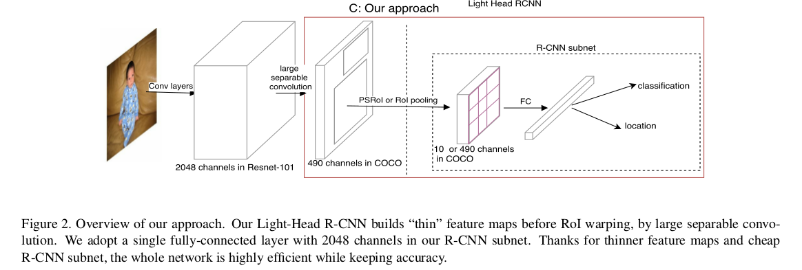
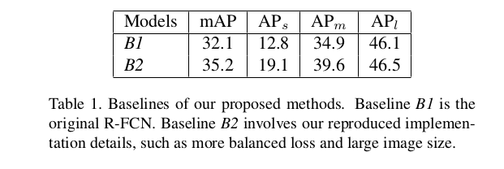
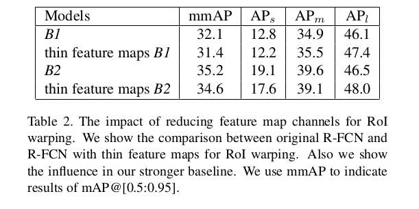
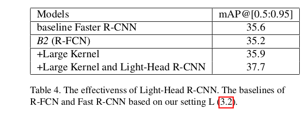

Light-Head R-CNN: In Defense of  Two-Stage Object Detector
=

# 1 Introduction

通常，为了获得最佳的准确率，两阶段方法设计非常重的头部。两阶段探测器通常具有（相对）慢速和高精度的特点。

两阶段检测器能够在效率和准确率上打败一阶段检测器吗？作者发现，Faster R-CNN和R-FCN有相似的特点：一个沉重的头部连接到骨干网络。例如，Faster R-CNN采用两个全连接层，或者ResNet的第5阶段用于RoI识别和回归。就每区域预测而言，这是耗时的，并且当使用大量提议时甚至会变得更糟。此外，在使用RoI池化后，特征通道的数量很大，这使得第一个全连接层消耗大量内存，并可能影响计算速度。不同于Fast/Faster R-CNN逐区域的使用子网络许多次，R-FCN尝试在所有RoI上共享计算，但是R-FCN需要产生一个非常大的额外的 $\# classes \times p \times p$ 的得分图通道，这也消耗内存和时间。

本文提出了light-head设计方案来构建一个高效同时准确的两阶段检测器。具体地，使用一个大核的可分离卷积产生小通道数 $\alpha \times p \times p$ 的“thin”特征图（ $\alpha \le 10$ ）。这样的设计极大地减少了接下来逐RoI子网络的计算量，并且是检测系统是内存友好的。

# 2 Related Works

**Accuracy perspective：** R-CNN使用例如 Selective Search、Edge Boxes、MGG等手工工程生成提议。Fast R-CNN联合训练分类和边界框回归。Faster R-CNN提出RPN生成提议，是CNN检测的里程碑是发展。Dai等人提出Deformable CNN 通过在没有监督的情况下学习额外的偏移来模拟几何变换。Lin等人提出了特征金字塔网络（FPN）[19]，它利用深层卷积网络的固有多尺度金字塔层次来构造特征金字塔。基于FPN，Mask R-CNN [7]通过添加与边界框识别并行的额外分支来进一步扩展掩模预测器。RetinaNet [20]是另一种基于FPN的单级检测器，它涉及Focal-Loss以解决由极端前景——背景比引起的类不平衡问题。

**Speed perspective:** R-CNN独立地将每个提议传入整个网络，极其耗时。He等人提出SPP-net，其所有候选框共享计算。Fast/Faster R-CNN通过统一的检测管道加速网络。R-FCN在RoI子网络中共享计算，在使用大量提议时加速推理。YOLO和YOLO v2将对象检测问题简化为回归问题，它们直接预测边界框及其关联的类别概率，但没有生成提议。SSD通过由不同层产生的多尺度预测提升检测性能。与基于边界框中心的检测器不同，DeNet [36]首先预测所有方框角落，然后快速搜索角落分布中的非平凡边界框。

总之，从准确性的角度来看，单级和双级探测器都具有接近速度的最先进精度。 然而从速度的角度来看，目标检测文献缺乏竞争性的快速两级检测器，而单级方法与几乎精度相匹配。

# 3 Our Approach
## 3.1 Light-Head R-CNN
### 3.1.1 R-CNN subnet
Faster R-CNN采用强有力的R-CNN，它使用两个全连接层或整个ResNet的stage 5 作为第二阶段的分类器，这有利于检测性能。然而计算也可能增加，特别是当对象提议的数量很大时。为了加速逐RoI子网络，首先，R-FCN为每个区域生成一组得分图，得分图的通道数是 $\#classes \times p \times p$ （ $p$ 是池化大小），然后沿每个RoI池化，并平均偷拍出最终预测。使用几乎无计算的R-CNN子网络，R-FCN通过在RoI共享得分图可与涉及更多计算而获得的结果比较。

如上所述，Faster R-CNN 和 R-FCN 存在非常中的Head，只是在不同的位置。从 **准确率** 方面来说，尽管Faster R-CNN擅长RoI分类，但是通常为了减少第一个全连接的计算量而使用全局平均池化，但这种功能池化对空间定位有害。对于R-FCN，在位置敏感得分池化之后直接池化预测结果，并且性能通常不如没有逐RoI计算层的Faster R-CNN那么强。从 **速度** 方面来说， Faster R-CNN独立地传递每个RoI到昂贵的R-CNN子网络，这放慢了网络的速度，尤其是当提议的数量很大时。R-FCN使用无成本的R-CNN子网络作为第二阶段检测器。但是R-FCN需要产生很大的得分图来进行RoI池化，整个网仍然是耗时/内存的。

### 3.1.2 Thin feature map forRoI warping
在将提议提交到R-CNN子网之前，使用RoI warping使特征图的形状固定。

在Light-Head R-CNN中，生成小通道数的特征图（薄特征图），后跟一个RoI warping。本文实验中，在薄特征图上的RoI warping 不仅能提升准确率，还能节约内存和计算。考虑到薄特征映射上的PSRoI池化，可以带来更多的计算以加强R-CNN并减少通道。此外，如果在薄特征图上使用RoI池化，则可以减少R-CNN开销并丢弃全局平均池化从而改善性能。此外，在不损失时间效率的情况下，可以使用用于精细特征图生成的大卷积。

## 3.2 Light-Head R-CNN for Object Detection

本文给出了两种设置：1）“L”验证集成大型骨干网络时的性能；2）“S”验证使用小型骨干网络的有效性和效率。除非特别强调，L和S使用相同的设置。

**Basic feature extractor.** 对于L，采用Res-101作为基本的特征提取器。另一方面，使用Xception似的网络用于S。Xception如表7，conv4和conv5的最后卷积快表示为 $C_4, C_5$ 。

**Thin feature map.** 在 $C_5$上应用较大的可分离卷积，其结构如图3。本文中，设置 $k$ 为 15 ， $C_{mid} = 64$ ，为 S 设置 $C_{mid} = 64$ ，为 L 设置 $C_{mid} = 256$ 。同时减小 $C_{out}$ 到 $10 \times p \times p$ 。收益于大核引起的更大的有效感受野，池化的特征图更加强大。

**R-CNN subnet.** 在R-CNN中仅采用单一的2048通道的全连接层，后面是两个兄弟全连接层用于预测RoI的分类和回归。由于在不同类之间共享回归，所以在回归中仅使用4个通道。得益于强大的RoI warping特征图，简单的Light-Head R-CNN也可以在保持效率的同时取得显着效果。

**RPN.** RPN是类别无关的滑动窗口检测器，它使用来自 $C_4$ 的特征。RPN预定义了一组anchor，纵横比为 ${1:2, 1:1, 2:1}$ ，五个尺度 ${32^2, 64^2, 128^2, 256^2, 512^2}$ 。在传入RoI预测子网络前，因为许多anchor之间严重重叠，所以使用NMS来减少提议。设置NMS的IoU阈值为0.7 。如果某个anchor与任意ground-truth 框的IoU大于0.7，那么给这个anchor分配正类标签。同时，如果其他的anchor与所有的ground-truth框的IoU小于0.3，则这些anchor的标签为负。

# 4 Experiments
评估数据为COCO数据集。

## 4.1 Implementation Details
8 GPU， SGD weight decay = 0.0001， momentum = 0.9 。每个GPU两张图像，在训练和测试时，每幅图像分别有2000和1000个RoI。通过在图像的右下角填充零来将小批量图像填充到相同的大小。前1,5M迭代学习率为0.01，后0.5M迭代学习率为0.001 。

所有的试验中，在stage 5 采用atrous和在线难样本挖掘（OHEM）。骨干网络使用ImageNet预训练。固定基础网络的stage 1 和stage 2的参数（包括批归一化）以更快的实验。除非另有说明，否则采用水平图像翻转增强。

## 4.2 Ablation Experiments
### 4.2.1 Baselines
首先使用Deformable R-FCN的超参数设置，表示为 $B1$，其在COCO mini-validation集上获得32.1%的mAP。

通过回顾基本设置，可以得到更强的基线，表示为 $B2$，有如下不同： （i）将短边调整为800像素，并将较长的最大尺寸限制为1200像素。（ii）在R-CNN中，回归损失肯定小于分类损失，因此，将R-CNN的回归损失 **翻倍** 以平衡多任务训练。（iii）选择256个基于损失排名的样本用于回归，在训练期间每幅图像使用2000个RoI，测试时使用1000个RoI。如表1所示。

### 4.2.2 Thin feature maps for RoI warping
（i）减少特征通道数为 490（ $10 \times 7 \times 7$ ）用于PSRoI 池化。（ii）由于修改特征图通道数，因此不能为最终预测直接进行投票，使用一个简单的全连接层用于最终预测。结果如表2 。

**Large separable convolution**  Light-Head用于RoI warping的特征图很小。原始实现中， $1 \times 1$ 卷积设计调整出一个较小的通道，这减小了特征图的容量。本文使用较大的可分离卷积夯实特诊图图，同时保持小通道。超参数为 $k = 15, C_{mid} = 256, C_{out} = 490$ 。表3为结果。

### 4.2.3 R-CNN subnet

## 4.3 Light-Head R-CNN: High Accuracy
遵循3.2节中的设置 L ，使用Mask R-CNN的RoIAlign用于PSPRoI池化。结果如表6 。在训练期间随机从 ${600, 700, 800, 900, 1000}$ 中采样尺度。最终替换NMS的阈值为0.5 （一般为0.3）。

表5总结了当前COCO test-dev上的历史最优性能检测其的结果。

## 4.4 Light-Head R-CNN: High Speed
更大的骨干网络（如ResNet-101）会放慢计算速度。构建一个34.1的top-1错误率的xception网络，其结构如表7 。遵循xception的设计，替换所有的卷积层为逐通道卷积，但是没有使用pre-activation设计。

更具体地，为了更快的推断速度，有如下改变： （i）替换L中的ResNet-101为小型xception网络。（ii）丢弃atrous算法，因为它需要更多的计算量。（iii）设置RPN网络为256通道，这是原始Faster R-CNN和R-FCN的一半。（iv）使用 $kernel_size = 15$ 的大型可分离卷积， $C_{mid} = 64, C_{out} = 490 (10 \times 7 \times 7)$ 。(v) 使用具有对齐技术的PSPooling池化。

