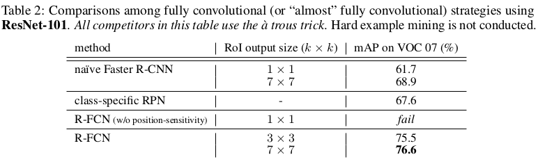
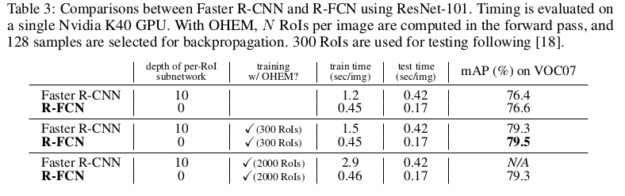
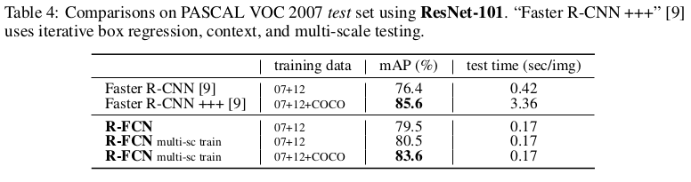
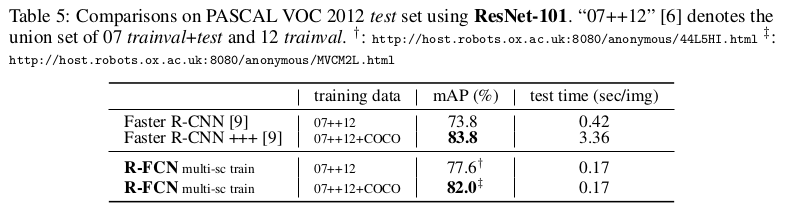
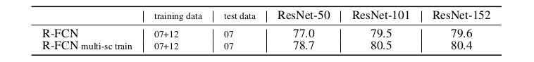
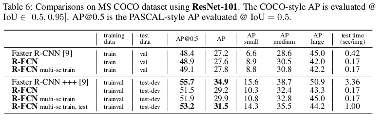

R-FCN: Object Detection via Region-based Fully Convolutional Networks
=

# 1 Introduction
ResNets和GoogLeNets都是设计为全卷积。通过类比，使用全卷积层在对象检测架构中构建共享的卷积子网看起来很自然，使得RoI-wise子网没有隐藏层。然而，正如在这项工作中经验性地研究的那样，这种天真的解决方案的检测精度相当低，与网络的优异分类精度不相符。为了解决这个问题，在ResNet论文[9]中，Faster R-CNN检测器[18]的RoI池化层不自然地插入两组卷积层之间--这创建了一个更深的RoI-wise子网，可以提高准确性，由于非共享的逐RoI计算导致低速成本。   

作者认为上述非自然设计是由于图像分类的平移不变性（translation invariance）增加与对象检测的相应的平移可变的（translation variance）的两难造成的。一方面，图像级分类任务满足平移变——图像内部物体的移动应该是不加区别的。另一方面，另一方面，对象检测任务需要在一定程度上是平移变化（translation-variant）的定位表示。例如，候选框内的对象的平移应该产生有意义的响应，用于描述候选框与对象重叠的程度。我们假设图像分类网络对平移的敏感度很低。为了处理这个问题，ResNet论文中的检测其在卷积中插入RoI池化层——这种区域特定（region-specific）的操作破坏啦平移不变性，并且，在不同区域进行评估时，*RoI层之后的卷积层不再具有平移不变性*。然而，这种设计牺牲了训练和测试的效率，因为它引入了数量客观的region-wise层（如表1）。

本文开放了基于区域的全卷积网络（R-FCN），它由共享的全卷积层组成。为了给FCN引入平移不变，作者使用一组专用卷积层作为FCN输出来构造一组位置敏感得分图（position-sensitive score map）。这些得分图中的每一个都编码了相应空间位置（例如，“对象的左侧”）的位置信息。在这个FCN的顶部，附加了一个位置敏感的RoI池层，它从这些得分图中获取牧羊信息，后面没有权重（卷积/ fc）层，如图1。

使用101层的Residual Net作为骨干网络，R-FCN在PASCAL VOC上获得83.6%的mAP，PASCAL VOC2012 获得82.0%的mAP。然而，R-FCN的速度比Faster R-CNN + ResNet-101块2.5到20倍，测试时间为170ms。

# 2 Our approach

**Overview.** 遵循R-CNN，采用两阶段对象检测策略：（i）区域提议，（ii）区域分类。使用RPN提取候选区域，RPN本身就是一个全卷积网络，并在RPN和R-FCN之间共享特征，图2。

给定提议区域（RoI），R-FCN被设计用于分类RoI为对象类别和背景。在R-FCN中可学习的权重是卷积层，并且在整幅图像上计算。最后的卷积层为每个类别产生一组 $k^2$ 个位置敏感得分图，因此输出层有 $k^2(C+1)$ 个通道（C是类别数量， $+1$ 表示背景）。 $k^2$ 得分图组对应于描述相对位置的 $k \times k$ 空间网格。例如，使用 $k \times k = 3 \times 3$，9个得分图编码对象类别的{左上角，上中心，右上角，......，右下角}的情况。

R-FCN以位置敏感RoI池化层结尾。这一层聚合最后卷积层的输出，并为每个RoI生成得分。位置敏感RoI池化进行选择性（selective）池化，并且每个 $k\times k$ bin聚合来自 $k \times k$ 得分图组中的仅一个得分图的响应。通过端到端训练，此RoI层负责管理最后一个卷积层，以学习专门的位置敏感分数图。

**Backbone architecture.** Backbone为ResNet-101，使用ImageN-1000预训练。ResNet-101中的最后一个卷积块是2048-d，附加一个随机初始化的1024-d 1×1卷积层以减小尺寸（确切地说，这将表1中的深度增加1）。然后使用 $k^2(C + 1)$ 通道的卷积层生成得分图。

**Position-sensitive score maps & Position-sensitive RoI Pooling.** 为了显示地编码每个RoI的位置信息，通过规则网格将每个RoI矩形划分为 $k\times k$ 个bin。对于大小为 $w \times h$ 的RoI矩形，bin的大小 $\approx \frac{w}{k} \times \frac{h}{h}$。R-FCN的最后一个卷积层为每个类别产生 $k^2$ 个得分图。在第 $(i, j)$ 个bin $(0 \le i, j \le k-1)$ 中，定义位置敏感RoI池化操作为池化第 $(i, j)$ 个得分图：
$$r_c(i, j | \Theta) = \sum_{(x, y) \in bin(i,j)} z_{i, j, c}(x + x_0, y + y_0 | \Theta) / n  \tag 1$$
其中 $r_c(i, j)$ 是第 $(i, j)$ 个bin对第 $c$ 个类别的池化响应， $z_{i,j,c}$ $k^2(C + 1)$ 得分图中的一个得分图， $(x_0, y_0)$ 表示RoI的左上角， $n$ 是bin中像素数，并且 $\Theta$ 表示网络中全部可学习的参数。第 $(i, j)$ 个bin的范围为 $\lfloor{i \frac{w}{k}} \rfloor \le x < \lceil(i+1) {\frac{w}{k}} \rceil$ 和 $\lfloor{i \frac{h}{k}} \rfloor \le y < \lceil(i+1) {\frac{h}{k}} \rceil$。

$k^2$ 个位置敏感得分在RoI中投票。本文简单地使用平均进行投票，并为每个RoI产生 $C+1$ 维向量： $r_c(\Theta) = \sum_{i,j}r_c(i,j|\Theta)$ 。然后计算类别的softmax响应： $s_c(\Theta) = e^{r_c} / \sum_{c'=0}^C e^{r_{c'}(\Theta)}$。   

以Fast/Faster R-CNN 相似的方法进行边界框回归。同样使用 $4k^2$ 维卷积层产生 $4k^2$ 向量，然后执行位置敏感RoI池化，每个RoI产生 $4k^2$ 维向量。，最后使用平均投票聚合成4维向量，使用这4维向量进行边界框回归。

注意，位置敏感 RoI池化之后，不再有可学习的层，实现几乎无成本的区域计算，加快训练和推理速度。

**Training.** 损失函数为： $L(s, t_{x, y, w, h}) = L_{cls}(s_{c^\ast}) + \lambda[c^\ast > 0]L_{reg}(t, t^\ast)$ ，这里， $c^\ast$ 是ground-truth标签（ $c^\ast = 0$ 表示背景）。 $L_{cls}(s_{c^\ast}) = -\log (s_{c^\ast})$ 是分类的交叉熵损失。 $L_{reg}$ 是smooth $L_1$ 损失的边界框回归， $t^\ast$ 表示ground-truth边界框。 $[C^\ast > 0]$ 是指示器，表示只对正样本计算边界框回归损失， $\lambda = 1$ 。正样本定义为与ground-truth的IoU重叠大于0.5的anchor，其他的为负样本。

在训练期间采用online hard example mining（OHEM）。**假设每幅图像有 $N$ 个提议，前向过程中，评估所有 $N$ 个提议的损失。然后，将所有 RoI （正类和负类）按损失排序，并选取 $B$ 个损失最高的 RoI。反向传播基于选择的样本执行。因为每个RoI的计算可以忽略，所以前向时间几乎不受 $N$ 影响，而 Fast R-CNN 的 OHEM 可能是两倍的计算时间。**

本文使用权重衰减为 0.0005，momentum为0.9. 默认使用单尺度计算：图像短边调整到600像素。每张GPU分配1幅图像，选择 $B = 128$ 个RoI进行反向传播。训练在8个GPU上进行，因此mini-batch为8。使用前20k学习率为0.001和后10k学习率为0.0001在VOC上微调 R-FCN。为了与RPN共享特征，采用4步交替训练。

**Inference.** 在测试时，评估300个RoI，最终的结果用NMS处理，IoU阈值为0.3 。

**Atrous and stride.** 将ResNet-101的有效歩幅从32减少为16，以增加得分图的分辨率。conv4及其之前的卷积层歩幅保持不变，conv5的歩幅修改为1，并且conv5中所有的卷积滤波器修改为atrous卷积。 RPN在conv4的顶部计算。

# 3 Experiments
## 4.1 Experiments on PASCAL VOC

表2比较了 **Naive Faster R-CNN** 、 **Classs-specific RPN** 、 **R-FCN without position-sensitivity** 和 **R-FCN** 。

表3比较了本文提出OHEM（ $N$ 个提议用于前向， $B$ 个用于反向传播）与原始 Faster R-CNN时间消耗。

**On the Impact of Depth**   

**On the Impact of Region Proposals**  

## 4.2 Experiments on MS COCO

前90k学习率为0.001，后30k为0.0001，mini-batch为8。扩展4步交替训练为5步（即增加一个RPN训练），可以轻微改善准确率。
