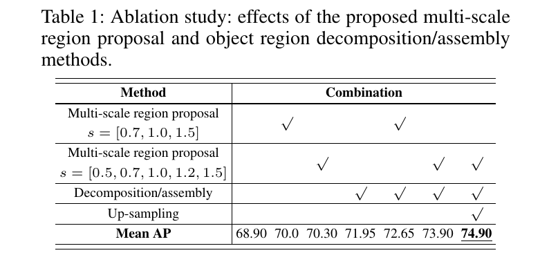
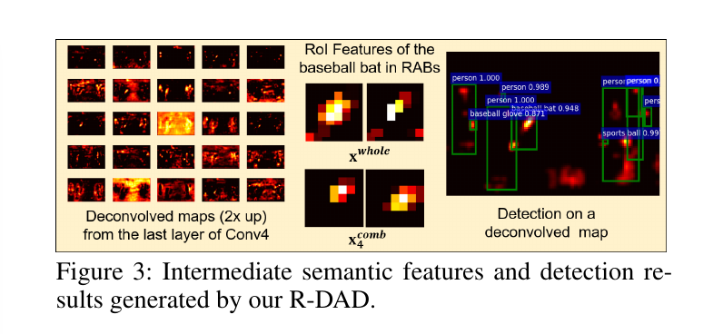
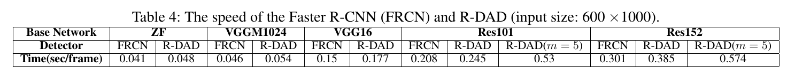

Object Detection based on Region Decomposition and Assembly
=

# Abstract
给予区域的对象检测推断图像中一个或多个类的对象区域。由于深度学习和区域提议方法最新进展，基于卷积神经网络（CNN）的目标检测器已经蓬勃发展并提供了有前景的检测结果。然而，遮挡和不准确的区域提议引起的对象的CNN特征低辨别性，检测准确率发生衰退。本文中，我们因此而提出一种区域分解（decomposition）和集成（assembly）检测器（R-DAD: decomposition and assembly detector）以进行准确的对象检测。

所提出的R-DAD中，我们首先将对象区域分解为多个小型区域。为了共同获得对象的整体外观和部分细节，我们在整个对象区域和分解区域中提取CNN特征。然后，我们通过一阶段一阶段的结合多个区域特征和区域集成块来学习对象及其部分的语义关系，并使用组合和高级语义特征进行对象分类和定位。此外，对于更准确的区域提议，我们提出一个多尺度提议层，其可以生成不同多种尺度的对象提议。我们将R-DAD集成到多个特征提取器，并证明了与最近的卷积检测器相比，PASCAL07/12和MSCOCO18的性能明显改善。

# Introduction
对象检测是为了找出跟定图像中的一个或多个对象类的实例。最近几年，通过结合对象提议算法和CNN，对象检测获得极大进步。最显著的工作是R-CNN框架。它们首先使用选择性搜索生成对象区域提议、提取区域的CNN特征以及使用类特定的SVM分类它们。然后，Fast RCNN使用特征共享和RoI池化提高R-CNN速度。最近的检测器将区域提议模块集成到CNN，以进一步提升训练和检测速度。因此，检测准确率可以通过区域提议和分类模块的联合学习得到加强。现代卷积检测器通常使用固定输入尺度来简化特征提取和对象检测过程。但是，即使是CNN对尺度变化具有鲁棒性，区域提议的准确性也经常因产生的提议和对象区域的不匹配而降低。此外，对于小物体检测，倾向于增加不匹配（Lin等人，2017a）。为了提高提议准确率，使用特征金字塔的多尺度特征用于生成更强壮的合成特征图。然而，特征化图像金字塔每个级别明显增加推理时间。在尝试减小检测复杂度的过程中，（Lin等人2017a；Fu等人2017）利用CNN的特征金字塔。

通常，检测失败通常是由遮挡对象引起的。在这种情况下，由于遮挡区域的部分细节缺失，因此可以显着减少被遮挡的CNN特征可区分性。这意味着利用整个对象区域的全局外观特征可能不足以准确地对对象进行分类和定位。

本文中，我们提出一种新颖的区域分解和集成检测器（R-DAA）来解决先前方法的局限。所提出的方法是基于：（1）_multi-scale-based region proposal_ 提高区域提议网络（RPN）的区域提议准确性，以及（2）_multi-region-based apperance model_ 共同描述对象的全局和部分外观。

在多尺度区域提议层，我们首先使用RPN生成区域提议，并重新缩放具有不同缩放因子的提议以覆盖对象大小的变化。然后，我们根据对象和非对象样本的比例来选择合适的区域提议进行训练和测试。我们的方法的主要好处是我们可以使用区域缩放处理对象大小的可变性而无需昂贵的图像或特征金字塔，同时使用区域采样保持适当数量的区域提议。此外，我们可以通过缩放区域提议来捕获局部和全局上下文线索。更具体地说，我们可以使用比原始区域更小的提以来捕获局部细节信息，并使用更大的提议来捕获对象和环绕区域之间的全局上下文。

为了改进特征的可辨别性，我们通过组合整个对象及其部分的特征来进一步执行基于多区域的外观学习。这种方法背后的思想是，每个特征图的最大响应是识别对象的强视觉线索。然而，我们也需要学习学习完整和分解区域之间的语义关心（即权重）以自适应地组合它们。例如，当对象的左边部分遮挡时，由于较少遮挡部分的特征更可靠，因此应调整权重以使用右部分的特征更多地用于对象检测。为此，我们提出区域集成块（Region Assembly Block：RAB），其集成多个区域的特征，使用RAB，我们首先通过逐步聚合部分特征的最大响应来学习部分特征图之间的关系并生成部分模型的组合特征图。然后，我们通过组合全局外观和部分外观特征来生成强壮的高级语义特征，并使用它们进行分类和定位。

总之，本文的主要贡献可以总结如下：（i）R-DAD架构的主张可以通过端到端的训练执行基于多尺度的区域提议和基于多区域的外观学习；（ii）在没有使用其他性能改善方法（例如：特征金字塔、多尺度测试、数据增强和模型集成）的情况下，在几个检测基准挑战上获得最佳结果——PASCAL07上获得81.2%的mAP，PASCAL12上获得82.0%的mAP以及MSCOCO18上获得43.1%的mAP；（iii）广泛实施具有各种特征提取器的R-DAD和彻底的消融研究，以证明R-DAD的有效性和稳健性。在这项工作中，我们首先将所提出的检测方法应用于Faster RCNN（Ren等人，2015），但我们相信我们的方法可以应用于其他卷积检测器（Girshick 2015; Bell等人2016; Kong等人。 2016; Dai等人2016）包括RPN，因为这些方法不依赖于网络结构。

# Related Works
受深度学习最新进展的启发，对象检测获得许多进步。特别地，由于卷积检测器允许高效特征提取和从图像像素到对象分类和定位的端到端训练，它变得越来越流行。特别地，大尺度对象分类的深度网络的显著改进也导致检测方法的改进。对于特征提取和对象分类，因此，最近的对象检测器是基于预先用大图像数据集训练的深度CNN（Simonyan和Zisserman 2014; He等人2016）构建的，并且与用于对象定位的区域提议和边界框回归网络相结合。在几项工作中，Faster-RCNN通过集成RPN和Fast-RCNN获得显著的性能提升，此外，（Redmon等人 2016；Liu等人 2016）通过从特征图上直接预测对象类和位置，而没有使用区域提议阶段来开发更快速的检测器。

为了改善检测和分割，可以利用不同分辨率和区域提取的多个特征。（Gidaris和Komodakis 2015）通过组合几种区域特征提高特征辨别性和多样性。（Zeng等人 2016）通过信息传递学习不同分辨率的特征图之间的关系和依赖。（Lin等 2017a）从自下而上和自上而下的路径连接卷积和反卷积（或上采样）特征，用于多尺度特征表示。HyperNet和ION拼接不同层的特征图，然后利用转换后的具有更多上下文和语义的图来预测对象。基本上，以前的基于多个特征图的工作关注（1）多区域表示以提高特征辨别性和多样性（2）多尺度表示以检测小尺寸的对象，而没有图像金字塔。尽管多数之前的具有多个特征图的检测方法关注两个问题中的一个，但是所提出的R-DAD可以有效地一起处理这两个问题。

## Region Decomposition and Assembly Detector
R-DAD的架构如图1所示。它主要包含特征提取、基于多尺度的提议（multi-scale-based region proposal: MRP）和对象区域分解与集成（RDA）极端。对于提取一般的CNN特征，与其他工作相似，我们使用ImageNet训练的分类网络。我们的案例中，为了证明我们的方法对于特征提取器的灵活性，我们将所提出的方法与几种特征提取器（ZF-Net、VGG16/VGGM1024-Net、ResNet101/152）集合。表3中，我们比较了具有不同特征提取器的检测器。然而，图1中，我们设计使用ResNet作为基础网络的架构。

在MRP网络中，我们生成不同大小的区域提议（即边界框）。通过使用RPN，我们首先生成区域边界框。然后，缩放生成的具有不同缩放因子的提议，以加强区域提议的多样性。在RoI采样层，根据前景和背景样本的平衡，我们选择它们中合适的边界框以进行训练和推理。

此外，我们在RDA网络中学习全局（即完整区域）和部分外观（即分解区域）模型。主要过程为，我们将完整对象区域分解为几个小型区域，并提取每个区域的特征。然后，我们融合几个部分模型，同时学习分解部分之间的强壮的语义依赖。最后，部分和全局外观模型之间的组合特征图用于对象回归和分类。

## Faster RCNN
我们简要地介绍Faster-RCNN，这是因为我们在这个框架上实现R-DAD。Faster-RCNN的检测过程可以分为两个阶段。第一个阶段中，输入图像调整到固定大小，并馈入特征提取器（即预训练的分类网络，例如VGG16或者ResNet）。然后，PRN使用某些选定中间级别的中级特征（例如VGG和ResNet的“conv4”和“conv5”）来生成与类无关的框提议及其置信度分数。

第二阶段中，边界框提议的特征通过RoI池化从相同的中间特征图采用以用作边界框提议。由于每个提议的特征提取通过裁剪先前提取的特征图简化，而没有额外的传播，速度得到极大提高。然后，边界框提议的特征依次传入其他更高层（例如“fc6”和接下来的“fc7”）来预测类和细化每个候选边界框的状态（即位置和大小）。

## Mult-scale region proposal （MRP） network
每个边界框可以表示为 $d = (x, y, w, h)$ ，其中 $x$ 、$y$ 、 $w$ 和 $h$ 是中心位置、宽和高。给定区域提议 $d$ ，具有缩放因子 $s(\ge 0)$ 的缩放边界框为 $d^s = (x, y, w \cdot s, h \cdot s)$ 。通过将不同的 $s$ 应用到原始边界框，我们可以生成具有不同大小的 $d^s$ 。图2展示了具有不同 $s$ 的缩放边界框，其中原始边界框 $d$ 有 $s=1$ 。在我们的实验中使用 $s = [0.5, 0.7, 1, 1.2, 1.5]$ 。

尽管不同尺度的边界框可以由Faster RCNN中的RPN生成，我们可以通过使用多尺度检测进一步增加区域提议的多样性。通过使用更大的 $s$ ，我们可以捕获目标周围的上下文信息（例如背景或者一个交互对象）。另一方面，通过使用更小的 $s$ ，我们可以研究更高分辨率的局部细节，并且它对于识别遮挡对象（其中完整的对象细节是不可用的）是有用的。不同 $s$ 的多尺度提议的有效性如表1 。

由于当使用9个锚和5个尺度因子时，“conv4”层中大小为 $63 \times 38$ 的特征图生成的大量提议（$63 \times 38 \times 9 \times 5$） ，利用所有提议训练的网络是不切实际的。因此，我们通过移除低自信度和与ground-truth重叠较低的提议来维持适当数量的提议（例如256）。然后，我们使mini-batch中的对象和非对象样本的比例相等，并使用mini-batch来微调图1中的检测器。

## Region decomposition and assembly（RDA） network
通常，特征的强力相应是识别对象的最重要的线索之一。对于MRP网络中的每个提议，我们因此而通过一阶段一阶段的如图1组合多个区域的特征来推断强壮线索。为此，我们需要学习可以表示不同部分特征之间语义关系的权重，并且使用权重来控制要在下一层中传播的特征的数量。

来自RPN区域提议通常假设覆盖整个对象区域。我们通过将 $d$ 分解为几个部分区域来生成更小的分解区域。我们是区域覆盖不同的对像部分，如图2所示。

从作为MRP网络输入的特征图，我们首先使用RoI池化为整个对象区域提取大小为 $h_{roi} \times w_{roi}$ 的变形特征 $x_l$ ，其中 $h_{roi}$ 和 $w_{roi}$ 是图的高和宽（对于ResNet，$h_{roi} = 14$ 、 $w_{roi}=14$）。在提取每个部位之前，我们首先使用双线性插值将特征图的空间分辨率上采样2倍。我们发现由于对象细节可以准确地捕获，所以这些更精细分辨率的特征图可以提高检测率，如图1所示。使用RoI池化，我们也提取大小为 $\lceil h_{roi}/2\rceil \times \lceil w_{roi}/2 \rceil$ 的变形特征图，并将它们表示为 $x_l^p$ ， $p \in \{left, right, bottom, upper\}$ 。

在前向传播中，我们使用大小为 $m_l \times m_l$ 的不同核 $w_{ij}^l$ 在大小为 $h_{l-1}^p \times w_{l-1}^p$ 的层 $l-1$ 上卷积部分特征，然后将卷积特征传递给一个非线性激活函数 $f(\cdot)$ 来获得一个大小为 $(h_{l-1}^p - m_l + 1) \times (w_{l-1}^p - m_l + 1)$ 的特征图 $x_{j,l}^p$ ：

$$x_{j,l}^p = f(\sum_{i=1}^{k_l} x_{i,l-1}^p * w_{ij}^l + b_j^l), l = 2, 3, 4 \tag 1$$

其中 $p$ 表示每个部分（left、right、bottom、upper）或者组合部分（left-right（l/r）、bottom-upper(b/u)和comb），如图1 。$b_j^l$ 为偏差因子，$k_l$ 为核的数量。$*$ 表示卷积操作。我们使用逐元素ReLU函数作为 $f(\cdot)$ 来缩放线性输入。

然后，合并不同区域的公式1中的双向输出 $x^p_l$ 和 $x_l^q$ ，该过程通过在每个通道上使用逐元素的max单元产生组合特征 $x^r_l$ :

$$x_l^4 = \max(x_l^p, x_l^q) \tag 2$$

$p$、$q$ 和 $r$ 也表示每个部分和组合部分，如图2所示。逐元素max单元用于融合 $x_l^p$ 和 $x_l^q$ 之间的信息，并产生相同大小的 $x_l^r$ 。因此，bottom-up特征图通过比较不同区域之间的特征来精炼，并仅保留强壮的语义特征。对象的整体特征传播过基础网络的几层（对于ResNet为“conv5 block”），并且最后一层中整个网络的外观特征 $x^{whole}$ 也与部分模型的组合特征 $x_3^{comb}$ 比较，然后精炼特征 $x_4^{comb}$ 与 $cls + 1$ 个神经元的对象分类层和 $4(cls + 1)$ 个神经元的边界框回归层连接，并且加1是由于背景类。

图3展示了学习好的 R-DAD的几层的语义特征。一些包含对象的强壮特征相应由我们的R-DAD提取。

3# R-DAD Training
对于训练R-DAD，我们利用来自ImageNet数据集的特征提取器（例如ResNet的“conv1-5”）的预训练和共享参数作为R-DAD的初始参数。然后，我们微调R-DAD的更高层（“conv3-5”）的参数
，同时保持更低层（即“conv1-2”）的参数。我们固定batch normalization的参数，其在ImageNet预训练期间学习。MRP和RDA网络的参数使用高斯分布初始化。

对于每个边界框 $d$ ，我们通过评估 IoU 来寻找最匹配ground-truth的边界框 $d^\ast$ 。如果一个边界框 $d$ 与任意 $d^\ast$ 的 IoU 大于 0.5 ，我们分配正标签 $o ^\ast \in \{1, \cdots, cls\}$ ，以及一个表示 $d^\ast$ 的四个参数化坐标的向量。如果IoU在0和1之间，我们分配负标签（0）。由R-DAD的输出层，为每个框 $d$ 预测4个参数化坐标和类标签 $\hat{o}$ 。调整的边界框 $\hat{d}$ 通过应用预测的回归参数生成。对于边界框回归，我们使用如下参数化：
$$
\begin{alignat}{2}
t_x &= (\hat{x} - x) / w \\ 
t_y &= (\hat{y} - y) / h \\
t_w &= \log(\hat{w} / w) \\
t_h &= \log(\hat{h} / h)
\end{alignat} \tag 3
$$
其中 $\hat{x}$ 和 $x$ 分别为预测边界框和锚框，（$y$、$w$、$h$ 相同）。相似地，$t^\ast = [t_x^\ast, t_y^\ast, t_w^\ast, t_h^\ast]$ 利用预测边界框和ground-truth边界框评估。然后，我们通过最小化公式4中的分类和损失来训练 R-DAD 。
$$L(o, o^\ast, t, t^\ast) = L_{cls}(o, o^\ast) + \lambda[o\ge1]L_{reg}(t, t^\ast) \tag 4$$

$$L_{cls}(o, o^\ast) = \sum_u \delta(u, o^\ast) \log(p_u) \tag 4$$

$$L_{loc}(t,t^\ast) = \sum_{u \in \{x,y,w,h\} \mbox{smooth}_{L1}}(t_v, t_v^\ast \tag 6)$$

$$
\mbox{smooth}_{L1}(z) = 
\begin{cases}
0.5 z^2 & \mbox{if } |z| \le 1 \\
|z| - 0.5 & \mbox{otherwise}
\end{cases}  \tag 7
$$

其中 $p_u$ 为类 $u$ 的预测分类概率。如果 $u = o^\ast$，则 $\delta(u,o^\ast) = 1$；否则 $\delta(u,o^\ast) = 0$ 。使用动量为 0.9 个SGD训练，在我们的实验中 $\lambda = 1$ 。

## Discussion of R-DAD
所提出的对象区域集成方法有几种好处。由于我们提取跨越对象部分特征图之间的空间位置的最大响应，与使用支持小区域（例如 $2\times2$）的最大池相比，我们可以将空间不变性更多地改进到没有深层次的特征位置。由于除了使用ReLU外，我们的RAB与maxout单元相似，RAB可以用作全局估计器，其可以近似任意连续函数。这表明对象特征配置的广泛变体可以通过深层次地结合我们的RAB表示。此外，由MRP网络生成的各种区域提议可以进一步提高对象之间的空间配置变化所引起的特征变化的鲁棒性。

# Implementation
我们将R-DAD应用到不同的特征提取器以证明它对基础网络的灵活性。通常，特征提取器影响检测器的准确率和速度。在这项工作中，我们使用5个不同的特征提取器，并将每个提取器与我们的R-DAD结合以相互间比较，如表3和表4 。我们在具有一个TITAN Xp GPU的PC上使用Caffe实现，而没有并行和分布训练。

## ZF and VGG networks
我们使用具有5个ZF的快速版本，其具有5个可共享的卷积和3个全连接层。我们也使用具有13个可共享卷积和3个全连接层的VGG16 。此外，我们利用与AlexNet相同深度的VGGM1024 。所有这些模型使用ILSVRC分类数据集预训练。

为了生成区域提议，我们将最后共享卷积层（ZF和VGGM1024为“conv5”、VGG16为“conv5_3”）的特征图馈入MRP网络。给定一组区域提议，我们也将最后层的共享特征图馈入RDA，通过组合分解区域的特征来学习高级语义特征。我们微调ZF和VGG1024的所有层，VGG16的conv3_1以上的层来比较我们的R-DAD与Faster RCNN。用于训练MRP和RAD网络的mini-batch的大小分布设置为256和64 。

## Residual networks
我们通过堆叠不同数量的残差块训练具有不用深度的ResNet。对于ResNet50/101/152，“conv1”到“conv4”块的层在Faster RCNN中共享。以相似的方式，我们使用“conv4”块的最后层的特征作为MRP和RDA网络的输入。我们微调MRP和RDA网络的层（包括“conv3-5”），同时冻结“conv1-2”层。当在每次迭代中训练MRP和RDA时，我们也使用相同的mini-batch大小（256/64）。

# Experimental results
我们在标准的检测基准测试数据集（PASCAL VOC07/12和MSCOCO18）上训练和评估我们的R-DAD。我们首先使用消融实验评估所提出的方法。然后，我们在数据集上比较R-DAD与现代检测器。

**Evaluation measure:** 我们使用每个类的平均准确率（AP），其为对象检测标准度量。它通过计算准确率召回率曲线下的面积来评估。我们也通过平均所有对象类的AP来计算mAP。当我们在PASCAL和COCO上评估AP和mAP，我们使用公开的代码或者这些竞赛的评估服务。

**Learning strategy:** 我们为每个验证使用不同的学习率。在VOC07上，我们使用学习率 $\mu = 1e-3$ 迭代50K，在接下来的20K迭代中使用 $\mu=1e-4$ 。对于VOC12验证，我们使用 $\mu = 1e-3$ 迭代70K，并继续使用 $\mu = 1e-4$ 迭代70K。对于MSCOCO验证，我们前700K和接下来的500K中使用 $\mu = 1e-4$ 和 $\mu=1e-5$ 。

## Ablation experiments
为了证明使用MRP和RDA网络的方法的有效性，我们执行几种消融研究。为了这个评估，我们使用VOC07+（trainval）集训练检测器，并在VOC07测试集上测试。

**Effects of proposed methods:** 在表1中，我们首先展示没有多尺度和多区域分解/集成方法的基线检测器（即Faster RCNN）和使用所提出方法检测器的mAP 。相比基线的mAP，当使用我们的方法时获得更好的检测率。我们也比较具有不同数量缩放因子的检测器的mAP。通过5种尺度，mAP略微提升。特别地，使用分解/集成方法可以将mAP提高3.05% 。使用上采样将mAP提高1% 。这表明在更精细分辨提取的部分特征产生更好的检测。因此，结合所提出的方法和基线将mAP增强了 6% 。

**Structure of the RDA network:** 为了确定RDA网络的最佳结构，我们通过改变其组件来评估mAP，如表2 。我们首先比较特征聚合方法。如图1，我们使用max单元结合每个极端不同区域的双向输出。我们使用加法或拼接逐个改变逐个单元。当在阶段3求和两个输出时，我们尝试融合不同系数的输出。求和 $[c_1 = \gamma, c_2 = 1]$ 表示 $x^{whole}$ 和 $x_3^{comb}$ 使用 $\gamma$ 和 1 的权重相加。这与恒等映射的概念相似。尺度参数 $\gamma$ 在训练期间学习。然而，我们发现求和特征图或使用恒等映射展现最小的提升。此外，拼接特征提高mAP，但是也增加内存使用和下一层的卷积复杂度。根据这个比较，我们验证在所有阶段使用max单元融合特征提供最佳mAP与计算复杂度。这种评估支持特征的最大响应是检测对象的强壮视觉线索的思想。

此外，为了确定有效感受野的大小，我们在RDA网络的阶段1和阶段2使用 $m = 5$ 来改变卷积核的大小。此外，我们也尝试d-dilated卷积滤波器来扩展感受野。然而，使用dilated卷积和 $5 \times 5$ 的卷积滤波器没有显著提高mAP。它表明，使用 $3 \times 3$ 的滤波器可以覆盖每个部分感受野，并有效地组合区域。

## Comparison with Faster-RCNN
**Accuracy:** 为了与Faster-RCNN（FRCN）比较，我们使用VOC07trainval（VOC07,5011张图像）和VOC12trainval集（VOC07++12,11540张图像）训练两个检测器。然后，我们在VOC07测试集（4952张图像）上测试它们。为了更公平比较，我们使用不同的特征提取器实现两种检测器。实现细节如前一节提到。表3表明两种检测器的比较结果。所有的R-DAD表现出比Faster RCNN更好的mAP。我们使用R-DAD将mAP提高大约 3 ~ 5% 。我们还确认使用具有更高分类精度的特征提取器可以提高检测率。

**Speed:** 表4中，我们比较了两种检测器的检测速度。由于速度依赖基础网络的大小，我们通过使用不同的基础网络来评估它们。我们也将区域提议的数量固定到300，如Fast RCNN所做的。我们的R-DAD的速度与FRCN的速度可以比较。确切地，为了减小检测复杂度，同时维持准确率，我们考虑到几个重要因素来设计R-DAD结构。我们发现RoI特征图的空间大小（$h_{roi}$ 和 $w_{roi}$）和卷积滤波器（$m$） 明显影响速度。当在RAB中使用 $h_{roi}=14$ 、$w_{roi}=14$ 和 $m=5$ 时，RAD的速度慢了 1.5x ~ 2.1x，但是增强仅大约0.2% ，如表2 。因此，我们确定添加MRP和RDA网络到Faster RCNN没有明显地增加复杂度。

# Detection Benchmark Challenges
在这项评估中，我们的R-DAD的性能在PASCAL VOC和MSCOCO服务器上评估。我们也将我们的检测得分传递到每个挑战的leaderboard。

**PASCAL VOC 2012 challenge:** 我们在PASCAL VOC 2012挑战上评估我们的R-DAD。对于训练我们的R-DAD，我们仅使用VOC07++12，并在VCO2012test（10911张图像）上测试。注意，我们没有使用额外数据，例如COCO数据集来提高mAP，如许多top排名团队所做的。

表5展示了这种结果。我们在最佳的卷积检测器上获得最好的mAP。此外，我们的检测器通过使用ResNet152模型获得更高的mAP。相比Faster RCNN和MR-CNN使用多区域方法，我们将mAP提高11.6%和8.1% 。

**MS Common Ojbects in Context(COCO) 2018 challege:** 我们参与MSCOCO挑战。该挑战检测80个目标类别。我们使用COCO风格的评估度量：mAP为在 $\mbox{IoU} \in [0.5:0.05:0.95]$ 上的平均、Small（S）、Medium（M）和Large（L）对象上的平均准确率/召回率 以及检测数量（#Det）上平均召回率。我们使用训练和验证图像（123K图像）的集合训练我们的R-DAD。然后，我们在test-dev（20K图像）上测试。为了增强小型对象的检测，我们使用12个锚，包括4个尺度（64、 128、 256、 512）和3个纵横比（1:1、 1:2 、2:1）。

表6比较了基于单个网络的检测器的性能。我们根据依赖区域提议的方法将检测划分为基于一阶段和两阶段的检测器。注意，我们的具有ResNet-50的R-DAD优于其他检测器。使用更高准确率的ResNet-101，R-DAD的性能进一步提高。

与这项挑战的获胜者Faster R-CNN+++（2015）和G-RMI相比，我们的检测产生更好的结果。值得注意的是，我们获得最佳的得分，而没有花里胡哨的操作（例如多尺度测试、hard example mining 、特征金字塔、模型集成等）。通过为具有ResNet50和ResNet101的R-DAD应用多尺度测试，我们可以将mAP分别提高到41.8%和44.9% 。如这项挑战的leaderboard，我们的R-DAD排在高位置。

在图4中，我们直接比较有/没有RDA网络的检测结果。当没有使用所提出的网络时，一些遮挡对象的检测失败（不准确的定位和false positive）发生。

