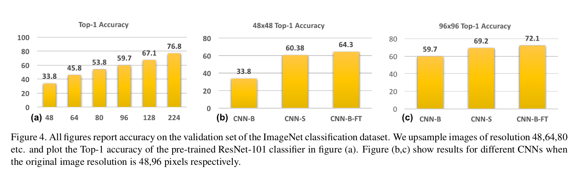
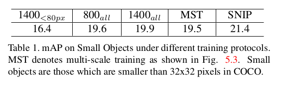
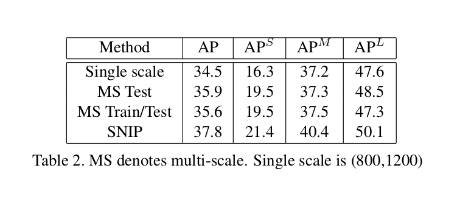
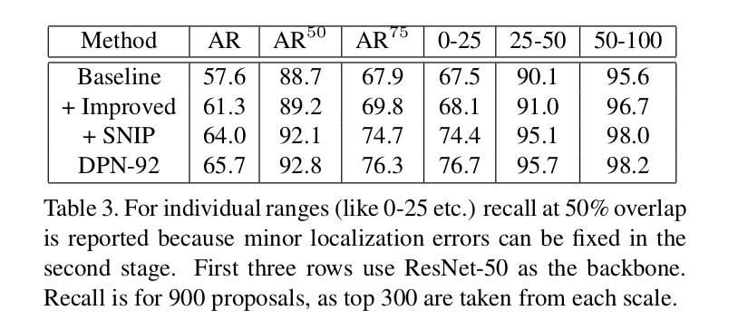

An Analysis of Scale Invariance in Object Detection – SNIP
=

# 1. Introduction
深度学习在ImageNet-1000分类数据集上的top-5错误率从15%降到2% 。然而，在COCO数据集（仅有80个类）上的最佳性能仅有63%——即使在50%的重叠（IoU）上。为什么对象检测比图像分类难这么多？

跨对象实例的巨大尺度变化，尤其是检测非常小的对象的挑战是性能差异背后的因素之一。有趣的是，相对于ImageNet（分类）与COCO（检测）中的图像的对象实例的中值尺度分别为0.554和0.106。因此，COCO中大多数对象实例小于图像面积的1% 。更糟糕的是，COCO中最小和最大10％的对象实例的尺度分别为0.024和0.472（导致比例变化几乎为20倍！），见图1。探测器需要处理的这种尺度变化是巨大的，并且代表了对卷积神经网络的尺度不变性的极端挑战。此外，当从预训练的分类网络微调时，分类和检测数据集之间的对象实例尺度中的不同也导致较大的域转移（domain-shift）。本文中，我们首先给出这些问题的证据，然后提出一种训练方案（称为Scale Normalization for Image Pyramid），其在COCO上产生最优结果的对象检测器。

为了缓解尺度变化和小物体实例引起的问题，已经提出了多种解决方案。例如深浅层特征的结合以检测小对象。dilated/deformable卷积用于增加感受野以检测大对象。多尺度推理等。

虽然这些结构上的创新有助于改善对象检测，但是预训练相关的问题仍待处理：
- **上采样图像以获得良好的物体检测性能是否至关重要？尽管检测数据集中典型的尺寸是 $480 \times 640$ ， 为什么将它们上采样到 $800 \times1200$ 是一种常见的做法？我们能不能在ImageNet上以低分辨率预训练更小步长的CNN，然后在检测数据集上微调以检测小对象实例？**
- **当从预训练的图像分类模型上微调对象检测器时，在适当地重新缩放输入图像后，是否应将训练对象实例的分辨率限制在较窄的范围内（从 $64\times64$ 到 $256 \times 256$ ）？ 或者，在上采样输入图像后，所有对象的分辨率（从 $16 \times 16$ 到 $800 \times 1000$， 在COCO中）参与训练？**

# 3. Image Classification at Multiple Scales
本节中，我们研究domain-shift的影响，它在训练期和测试间以不同分辨率的图像作为输入时被引入。我们执行这个分析是因为，历史最优检测器通常以分辨率 $800 \times 1200$ 训练，但推理在更高的分辨率 $1400 \times 2000$ 上执行以检测小对象。

首先，我们通过下采样原始的ImageNet图像获得 $48 \times 48$、 $80 \times 80$、 $96 \times 96$ 和 $128 \times 128$ 分辨率的图像。然后将它们上采样到 $224\times224$ ，并将其作为 $224 \times 224$ 以尺寸图像训练的CNN架构的输入，称为CNN-B（见图3）。图4（a）展示了具有ResNet-101骨干的CNN-B的top-1准确率。我们观察到，随着训练和测试图像之间的分辨率差异的增加，性能也随之下降。**因此，至少对于图像分类来说，对未对网络进行训练的分辨率进行测试显然是次优的。**

基于这个观察，一个简单的改善检测器在小对象性能方案是在ImageNet上以不同步长预训练分类网络。毕竟，CIFAR10（包含小对象）上获得最佳性能的网络架构便不同于ImageNet。ImageNet分类网络的第一个卷积层步长为2，接着是步长为2的最大池化层，这可能会消除小物体中存在的大部分图像信号。因此，我们将ResNet-101的第一层改为步长为1 的 $3\times3$ 卷积，并在 $48\times48$ 的图像上训练这个ResNet-101（称为CNN-S， 见图2）。相似地，对于 $96 \times 96$ 尺寸的图像，我们使用大小为 $5 \times 5$ ，步长为2的核训练 。采用标准的数据增强技术，如随机裁剪、颜色增强、并在70轮候终止颜色增强。如图4，这些网络（CNN-S）效果显著优于CNN-B。**因此，对于低分辨率图像预先训练具有不同体系结构的分类网络并且将它们用于低分辨率对象的对象检测是诱人的。**

另一种用于小物体检测的简单解决方案是在上采样的低分辨率图像上微调CNN-B以产生CNN-B-FT（图3）。如图4，上采样低分辨率图像的CNN-B-FT的性能比CNN-S好。该结果凭经验证明，在高分辨率图像上学习的滤波器对于识别低分辨率图像也是有用的。**因此，与其减小步长，更好的是将图像上采样2倍，然后微调以高分辨率图像预训练的网络。**

**在训练对象检测器时，我们既可以使用不同网络架构来分类不同分辨率的对象，也可以为所有分辨率使用单一架构。由于在ImageNet（或者其他更大的分类数据集）上预训练是有益的，并且在更大对象实例上学习的滤波器有助有分类更小的对象实例，上采样图像和使用高分辨率图像预训练的网络比用于分类小对象的专用网络更好。幸运的是，已有的对象检测器都是上采样图像以检测更小的对象，而不是使用不停的架构。**

# 4. Background
这一节中，我们讨论用于检测小对象的几个baseline。我们简要地描述Deformable-RFCN，其将在下面的分析中使用。D-RFCN在COCO上获得最佳单模型检测结果，并且是公开可用的，因此我们使用这个检测器。

Deformable-RFCN局域R-FCN检测器。它在conv5层中添加了可变形卷积，以自适应地改变网络的感知场，从而为不同尺度的对象创建尺度不变表征。在每个卷积特征图中，一个轻量的网络预测2D网格偏移，这是应用卷积核的空间子滤波器的空间位置。第二个变化是位置敏感得分图，网络预测了执行PSRoI-Pooling的每个位置敏感滤波器（取决于特征图）的偏移，而不是在卷积特征图（对于RoI）上池化一组固定的bin。

对于我们的实验，使用公开可用的Deformable-RFCN检测器以 $800 \times3 1200$ 的单一分辨率（在上采样之后）提取提议。它以ResNet-101作为骨干，并且以 $800 \times3 1200$ 的分辨率训练。在RPN中使用5个锚已生成提议。为了分类这些提议，我们使用无需位置敏感RoI池化的ResNet-50骨干的Deformable-RFCN。我们使用具有双线性插值的位置敏感RoIPooling，因为它在最后一层中将滤波器的数量减少了3倍。使用具有阈值为0.3的NMS。不使用RPN进行端到端训练，使用ResNet-50并消除可变形PSRoI滤波器可将训练时间缩短3倍，并节省GPU内存。

# 5. Data Variation or Correct Scale？

第3节的研究确认了训练和测试阶段分辨率的差异导致显著的性能下降。不幸地是，这种分辨率上的差异是当前检测管道的部分——由于GPU内存的限制，训练输入分辨率（$800 \times 1200$）比测试（$1400 \times 2000$）低（注意原始分辨率通常为 $640 \times 480$）。这节分析图像分辨率、对象实例的尺度和数据中变化对检测器性能的影响。我们在不同的设置下训练检测器，并在1400x2000图像上对它们进行评估，以检测小物体（COCO数据集中小于32x32像素），这只是为了梳理影响性能的因素。结果如表1 。我们首先使用两种不同分辨率 $800\times1200$ 和 $1400\times2000$ 训练所有对象实例的检测器，分别称为 $800_{all}$ 和 $1400_{all}$。如期望的，$1400_{all}$ 好于 $800_{all}$ ，因为前者在相同分辨率（$1400\times2000$）下训练和测试。然而，整个提升仅是很小的。为什么？为了回答这个问题，我们考虑在以如此大分辨率训练时，中型到大型对象实例放生了什么。它们会变得太大而难以正确分类！因此，较高分辨率的训练可以扩大小物体以便更好地分类，但会炸毁大中型物体，从而降低性能。因此，我们以 $1400 \times 2000$ 的分辨率训练另一个检测器（$1400_{<80px}$），同时忽略所有的大中型对象（原始图像中 $>80$ 像素）以消除极端大对象的负面影响。不幸的是，它甚至比 $800_{all}$ 更差。发生了什么？ **由于忽略了大中型物体（约占总物体实例的30％），我们失去了外观和姿势变化的重要来源，这比通过消除极端尺度物体所造成的伤害性能更多。** 最后，我们
最后，我们评估了通过在训练期间使用多个分辨率的随机采样图像获得尺度不变检测器的常见做法，称为MST。他可以确保实例在不同分辨率被观察，但是由于极大和极小对象实例的影响，其性能仍然较差（它的表现类似于 $800_{all}$ ）。**我们得出结论，使用适当缩放的对象训练检测器是很重要的，同时尽可能多地捕获对象实例的变化。**

# 6. Object Detection on an Image Pyramid
我们的目标是结合最好的两种方法，即在具有最大外观和姿势变化的情况下训练，同时将尺度限制在合理的范围内。我们通过一种新颖的构造来实现这一点，我们将其称为图像金字塔的尺度标准化（Scale Normalization for Image Pyramid：SNIP）。我们也讨论了使用有限GPU内存在图像金字塔上训练对象检测器的细节。

## 6.1 Scale Normalization for Image Pyramids
SNIP是MST的修改版本，其中仅具有预训练数据集（通常为224x224）的分辨率的对象实例用于训练检测器。在多尺度训练（MST）中，在不同分辨率下观察每个图像，因此在高分辨率（如1400x2000）下，大对象难以分类，并且在低分辨率（如480x800）下，小对象难以分类。幸运的是，每个对象实例都以几种不同的尺度出现，其中一些外观落在所需的尺度范围内。为了消除极端尺度的对象，要么太大，要么太小，**仅在落入期望尺度范围的对象执行训练，而余下的对象在反向传播中简单地忽略掉。** 实际上，SNIP在训练期间使用所有对象实例，这有助于捕获外观和姿势的所有变化，同时减少预训练网络的尺度空间中的域移位（domain-shift）。使用SNIP训练的检测器的评估结果如表1——它优于其他方法。这个实验强调了检测小对象的有效性。下面我们讨论SNIP的实现细节。

_为了训练分类器，所有ground-truth框都用于给提议分配标签。在训练期间，我们不会选择在特定分辨率上位于指定大小范围之外的提议和ground-truth边界框。在特定的分辨率 $i$ ，如果一个RoI的面积 $ar(r)$ 位于范围 $[s_i^c, e_i^c]$ 之中，它被标记为有效的，否则就是无效的。相似地，RPN也使用全部ground-truth框来给锚分配标签。最后，与无效ground-truth框的重叠大于0.3的锚将在训练中被排除。在测试期间，我们使用RPN为每个分辨率生成提议，并在每个分辨率独立地将它们分类，如图6 。预训练相似，在每个分辨率上。我们不选择位于指定范围之外的检测（非提议）。在分类和边界框回归之后，我们使用soft-NMS来组合来自多个分辨率的检测以获得最终的检测边界框，参考图6 。_

因为池化后RoI的分辨率与预训练网络匹配，所以网络在微调期间很容易学习。对于像R-FCN这样将RoI分成子部件并使用位置敏感滤波器的方法，这变得更加重要。例如，如果RoI的大小为48个像素（在conv5特征图中为3个像素），并且每个轴上有7个滤波器，那么特征图和滤波器之间的相应位置将丢失。

## 6.2. Sampling Sub-Images
在高分辨率图像上训练如ResNet-101或DPN-92这样的深度网络需要更多的GPU内存。因此，我们剪裁图像使得它们匹配GPU内存。我们的目的是生成最小数量的大小为 $1000 \times 1000$ 的覆盖所有小对象chip（子图）。这有助于加速训练，因为在没有小物体的情况下不需要计算。为此，在每幅图像中的随机位置生成大小为 $1000 \times 1000$ 的chip，直到图像中所有对象都被覆盖。因为chip是随机生成，并且提议框经常有一边在图像的边界上，为了加速采样过程，我们将chip捕捉到图像边界。我们发现，平均而言，为尺寸为 $1400 \times 2000$ 的图像生成1.7个大小为 $1000 \times 1000$ 的块。当图像的分辨率是 $800 \times 1200$ 或者 $480 \times 640$ 时，或者当图像中未包含小对象时，采样步骤是不需要的。随机裁剪不是我们观察到检测器性能改善的原因。为了验证这个问题，我们使用未裁剪的高分辨率图像（$1400 \times 2000$）训练ResNet-50（因为需要更少的内存），并没有观察到mAP的变化。

# 7. Datasets and Evaluation
我们在COCO数据集上评估我们的方法。COCO包含123000张图像用于训练，20288张图像用于评估。由于COCO评估服务器不提供召回建议，我们对118,000张图像进行训练，并报告其余5,000张图像（通常称为迷你套装）的召回情况。除非特别提到，小对象的面积小于 $32 \times 32$ ，中型对象的范围为 $32 \times 32$ 到 $96 \times 96$ ，大型对象的的面积大于 $96 \times 96$ 。

## 7.1. Training Details
使用3个分辨率 $(480, 800), (800, 1200)$ 和 $(1400,2000)$ 训练Deformable-RFCN，其中分辨率的第一个值用于图像的较短边，第二值是限制边的最大尺寸。对分类器执行7个时期的训练，同时训练RPN 6个时期。尽管使用交替训练来结合RPN和RCN可以导致轻微的准确率提高，但是我们单独训练RPN和RCN，并独立地评估它们的性能，这是因为在提取提案后，尝试不同的分类体系结构会更快。我们使用warmup学习率策略，在前1000次迭代中，学习率从0.00005增加到0.005 ，对于RPN在4.33个epoch时下降，RCN为5.33 。  

对于训练RCN，我们使用OHEM。石红MxNet在8个Nvidia P6000 GPU 上训练，每个GPU的批大小为1，并使用同步的SGD。**为了有效实现多GPU并行，在一个mini-batch中仅包含一个分辨率。因此，一幅图像在每个epoch中反向传播多次。** 注意，如果在一个特定分辨率中的有效范围内没有ground-truth框， 其图像分辨率对将在训练期间被忽略。对于不包含SNIP的基线，我们也在8或者9个epoch后评估它们的性能，但是我们观察到在7个epoch后性能最佳。  

对于分类器（RCN），在分辨率 $(1400, 2000)$ 的图像上，原始图像（未进行上下采样）的有效范围为 $[0, 80]$ ， $800 \times 1200$ 的分类为 $[40, 60]$ ， $(480, 800)$ 为 $[120, \infty]$ 。注意，在相邻范围中有40个像素的重叠。这是因为不清楚边界处的哪个分辨率是正确的。这些范围是在训练期间做出的设计决策，基于以下考虑：在重新缩放之后，有效RoI的分辨率与训练骨干CNN的分辨率没有显着差异。因为在RPN中，即使一个像素的特征图都可以生成一个提议（不同于PSRoI滤波器，其可以理想地映射到 $7\times7$ 的特征图），我们在 $(800, 1200)$ 上为RPN的有效范围使用一个有效的范围 $[0, 160]$ 。对于推理，RCN的每个分辨率的有效范围在minival集上获得。

## 7.2. Improving RPN
在如Faster-RCNN/R-FCN、Deformable-R-FCN的检测器中，RPN用于生成区域提议。如果与ground-truth框的重叠大于0.7，RPN便给anchor分配正类。我们发现当在conv4上使用带有15个锚点（5个刻度--32,64,128,256,512，步幅16，3个纵横比）的RPN时，当图像分辨率为800x1200时， 在COCO中只有30％的ground-truth框符合此标准。即使阈值变为0.5，也仅有58%的ground-truth框符合此标准。因此，对于超过40％的ground-truth框，重叠小于0.5的锚被指定为正（或忽略）。使用如FPN、Mask-RCNN的特征金字塔方法在更精细的分辨率（如conv3）使用RPN，因此这个问题在一定程度得到缓解。然而，conv4/conv5的较高级别特征可能无法捕获所需的语义表示，除非以多种分辨率对图像进行采样。

由于我们在多个分辨率上采样图像，并其仅反向传播相应分辨率的梯度，所以这个问题在一定程度上得到缓解。我们也联结conv4和conv5的输出以捕获不同特征图，并使用7个anchor尺度。更精细的特征组合与多层预测（如[21]FPN，[11]Mask R-CNN）应该可以进一步提高性能（在可变形R-FCN探测器的显着计算负担下）。

## 7.3. Experiments
首先，在如第4节描述的相同设置下，我们评估SNIP在分类（RCN）上的性能。如表2 。

对于RPN，具有ResNet-50网络的基线在conv4特征图上训练。从每个尺度中选择前300个提议，总共900个提议用于计算召回。平均召回率（在多个重叠阈值上平均，与mAP相似）更好，见表3 。

