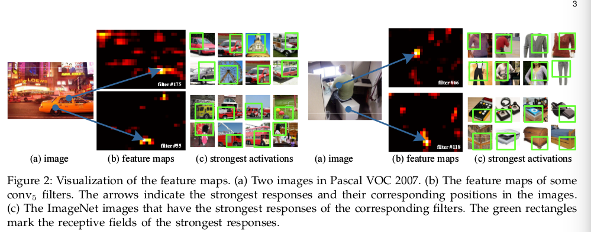
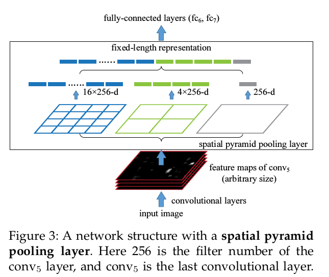
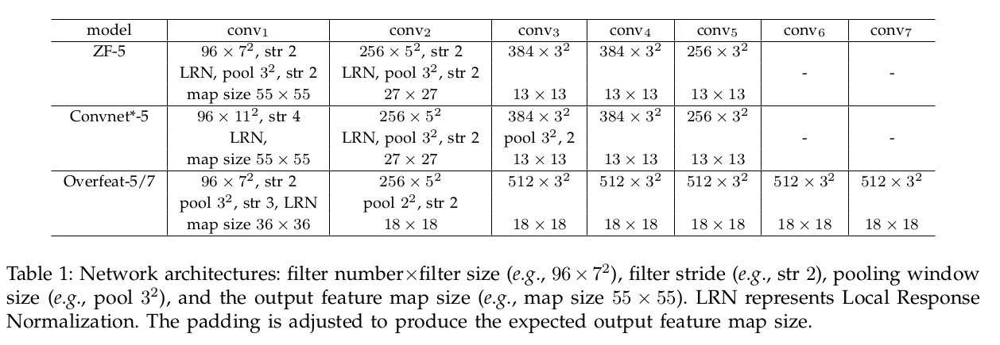

Spatial Pyramid Pooling in Deep Convolutional Networks for Visual Recognition
=

# 1 Introduction
面临的问题： 当前流行的CNN要求固定输入的图像尺寸（如 $224 \times 224$），这限制输入图像的纵横比和大小。通过缩放或扭曲的图像，可能引入了不必要的几何扭曲，如图1。识别的准确可能受到影响。此外，预训练的尺度可能不适合对象尺度的变化。

本文在卷积层的顶部添加SPP层，SPP层池化特征并生成固定长度的输出，然后将输出传入全连接层（或者其他分类层）。换句话说，在更深的网络层级阶段（卷积和全连接之间）执行信息“聚合（aggregation）”，从而避免了开始阶段的剪裁或扭曲，如图1（下）。   

SPP将图像由精细到粗超进行划分，并聚合它们中局部特征。在CNN流行之前，常用于分类和检测。SPP对于深度CNN有几个显著的性质：1）无论输入大小如何，SPP都能够生成固定长度的输出，而以前的深度网络[3]中使用的滑动窗口池不能；2）SPP使用多级空间区间（bins），而滑动窗口池仅使用单个窗口大小，多级池化对空间变形具有良好的鲁棒性；3）由于输入尺度的灵活性，SPP可以池化不同尺度的特征。

SPP使得输入尺度可变，增加模型尺度不变形，并能够减小过拟合。由此可以使用多尺度训练，产生更好的结果。

R-CNN中的特征计算是耗时的，因为它反复将深度卷积网络应用于每个图像的数千个扭曲区域的原始像素。本文表明，可以在整幅图像运行一次卷积层，这产生上百倍的加速。 SPP继承了CNN的能力和SPP的灵活性，可以得到显著的准确率和效果。本文的SPP-net速度是 R-CNN的24-102倍，同时获得更高的或者相当的准确率。利用EdgeBoxes [25]最近的快速提议方法，SPP-net处理图像仅需0.5秒（包括所有步骤）。   

# 2 Deep Netwotks with Spatial Pyramid Pooling
## 2.1 Convolutional Layers and Feature maps
  

## 2.2 The Spatial Pyramid Pooling Layer
卷积层接收任意输入大小，而分类（SVM/softmax）或全卷积层要求固定长度的向量。SPP通过池化局部空间来获得空间信息，bin的大小和图像大小成比例，因此，无论图像的大小如何，bin的数量都是固定的。

为了对任意大小的图像采用深度网络，用空间金字塔池化层替换最后的池化层（例如，在最后一个卷积层之后的 $pool_5$ ），如图3。在每个bin中，最大池化每个滤波器的响应。SPP的输出是 $kM$ 维的向量， $M$ 是bin的数量（ $k$ 是最后一个卷积层滤波器的数量）。

## 2.3 Training the Network
**Single-size training.** 输入固定尺寸： $224 \times 224$ 。
**Multi-size training.*** 输入： 180和224， 或者 [180,224]之间的均匀采样尺寸。 单尺度或者多尺度输入只出现在训练阶段。

# 3 SPP-net for Image Classification
## 3.1 Experiments on ImageNet 2012 Classification
### 3.1.1 Baseline Network Architecture

### 3.1.2 Multi-level Pooling Improves Accuracy
表2（b）使用单尺度训练，金字塔方案为 ${6 \times 6, 3 \times 3, 2 \times 2, 1 \times 1}$ （共计50个bin）。将金字塔设置为 ${4 \times 4, 3 \times 3, 2 \times 2, 1 \times 1}$ （共计30的bin），也能够得到相似的结果。

# 4 SPP-net for Object Detection
SPP-net仅从整幅图像中提取一次（可能是多尺度）特征，然后应用空间金字塔池化在每个特征图的候选窗口，从而池化出这个窗口的固定长度表征，如图5。由于耗时的卷积只应用一次，SPP-net可以以更快的量级运行。

spp-net从特征图区域提取逐窗口的特征，而R-CNN直接从图像区域提取。之前的工作中，DPM从HOG特征图窗口提取特征，可选择性搜索从编码的SIFT特征图中的窗口提取特征。Overfeat从深度卷积特征窗口提取，但是需要预定义的窗口大小。另一方面，SPP-net能够从深度卷积特征图的任意窗口提取特征。

## 4.1 Detection Algorithm
使用“快速”模式的选择性搜索在每幅图像中生成大于2000个候选窗口。然后将图像调整为 $\min(w, h) = s$ ，并从增幅图像提取特征图。使用 ZF-5（单尺度训练的）的SPP-net模型。金字塔设置为 ${1 \times 1, 2 \times 2, 3 \times 3, 6 \times 6}$ （共计50个bin），并且每个窗口生成12800-d（ $256 \times 50$ ）表征。然后，将这些表征传入全连接层。最后，为这些特征中每个类别，训练一个二值线性SVM分类器。  

SVM的训练： 使用groun-truth窗口产生的正样本和IOU小于0.3的区域作为负样本，其中移除与已存在负样本IOU大于0.7的窗口。然后使用标准的hadr negative mining训练SVM，花费一个小时。在测试时，使用SVM为每个候选区域评分，然后用NMS（阈值为0.3）来抑制重复区域。

使用多尺度训练时，图像被调整为 $min(w, h) = s \in S = {480, 576, 688, 864, 1200}$ ，并且在每个尺度计算 $conv_5$ 的特征图。
