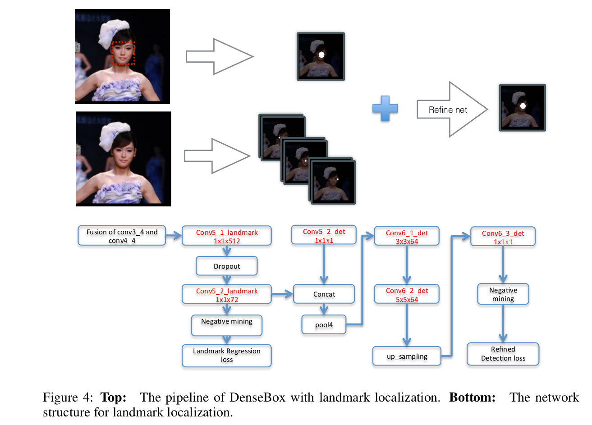

DenseBox: Unifying Landmark Localization with End to End Object Detection
=

# 1 Introduction
本文关注一个问题：一阶段的FCN在多大程度上可以执行对象检测？为此，我们提出了一种新型的基于FCN的对象检测器DenseBox，它不需要生成提议，并且能够在训练期间进行端到端的优化。DenseBox设计用于检测小尺度及严重重叠的对象，并使用hard negative mining来提升性能。通过联合多任务学习[1]进一步将landmark定位整合到系统中。

本文的贡献：
1. 我们证明了单个完全卷积神经网络，如果仔细设计和优化，可以非常准确和有效地检测严重的遮挡不同尺度的物体。
2. 我们表明，当通过多任务学习结合landmark定位时，DenseBox进一步提高了物体检测的准确性。

# 3 DenseBox for Detection

整个检测系统如表1所示。测试时，系统将 $m \times n$ 的图像作为输入，并输出5通道 $\frac{m}{4} \times \frac{n}{4}$ 的特征图。如果将输出坐标空间中目标边界框左上角和右下角点分别定义为 $p_t = (x_t, y_t)$ 和 $p_b = (x_b, y_b)$ ，那么位于输出特征图中的 $(x_i，y_i)$ 的每个像素 $i$ 描述具有5维向量 $\hat{t}_i = \{\hat{s}, \hat{dx^t} = x_i - x_t, \hat{dy^t} = y_i - y_t, \hat{dx^b} = x_i - x_b, \hat{dy^b} = y_i - y_b\}_i$ 的边界框，其中 $\hat{s}$ 是存在对象的置信度得分， $\hat{x^t}, \hat{y^t}, \hat{x^b}, \hat{y^b}$ 表示输出像素位置与目标边界框边界之间的距离。最后，输出特征图中的每个像素被转换成具有得分的边界框，并且将非最大抑制应用于分数超过阈值的那些边界框。

## 3.1 Ground-truth Generation
没有必要将整幅图像输入网络，因为这会花费最多的时间在用于背景计算。一种明智的策略是将图像裁剪成块，这种块中包含人脸及足够的背景用于训练。本文，使用单一尺度训练，并用多尺度评估。

通俗地说，所提出的网络以类似分割的方式训练。在训练期间，patch被剪裁并调整成 $240 \times 240$， 且在这些这些patch的中心位置包含人脸，人脸的高大约为50个像素。训练中输出的ground-truth是大小为 $60 \times 60$ 的5通道特征图，网络下采样因子为4 。ground-truth第一个通道的正类标签区域是一个半径为 $r_c$ 的实心圆，位于人脸边界框的中心。半径 $r_c$ 与边界框大小成比例，其缩放因子设置为输出坐标空间中边界框大小的0.3，如图2所示。其余4个通道填充了最近边界框的左上角和右下角之间的输出特征的像素位置之间的距离。

注意，如果多个人脸出现在一个patch中，且人脸落入某个尺度范围（本文为0.8到1.25），则将该人脸设置为正。其他人脸视为负样本。在ground-truth得分图的第一个通道中的像素，该通道表示类别置信度得分，初始化为 0 ，并在正类标签区域设置为 1 。这种ground-truth生成过程与分割任务相似。DenseBox的像素标签由感受野确定，如果输出像素标记为1，如果它满足约束条件，则其感受野包含大致位于中心且给定尺度的对象。由于每5个通道像素描述一个边界框，所以每个像素可以视为一个样本。

## 3.2 Model Design

网络架构衍生自VGG19，整个网络包含16个卷积层，前12个卷积层由VGG19初始化。conv4_4被传入4个 $1 \times 1$ 卷积层，其中前两个卷积层输出1个通道的特征图用于分类得分，后两个卷积预通过4个通道图测相应边界框位置。最后的 $1 \times 1$ 卷积层扮演滑动窗口式的全连接层。

**Multi-Level Feature Fusion.** 更大的感受野可以带来更丰富的上下文信息，预测就更加准确。本文设计的架构中，将conv3_4和conv4_4的特征图联结。conv3_4的感受野是 $48\times48$ ，几乎是训练中人脸的大小，而conv4_4有更大的感受野，大于为 $118\times118$ ，使得可以利用全局纹理和上下文来检测。

## 3.3 Multi-Task Training
使用预训练的VGG19初始化DenseBox，其他层使用Xavier初始化。网络包含两个兄弟分支，第一个输出成为目标对象的置信度得分 $\hat{y}$ 。给定ground-truth标签 $y^\ast \in \{0, 1\}$ ，分类损失定义为：
$$\cal{L}_{cls}(\hat{y}, y^\ast) = ||\hat{y} - y^\ast||^2  \tag 1$$
第二个输出分支是边界框回归损失 $\cal{L}_{loc}$ 。他的目标是最小化预测位置偏移 $\hat{d} = (\hat{d_{tx}}, \hat{d_{ty}}, \hat{d_{bx}}, \hat{d_{by}})$ 和目标 $d^\ast = (d_{tx}^\ast, d_{ty}^\ast, d_{bx}^\ast, d_{by}^\ast)$ 之间的 $L2$ 损失，公式为：
$$\cal{L}_{loc}(\hat{d}, d^\ast) = \sum_{x \in \{tx, ty, bx, by\}}||\hat{d_i} - d_i^\ast||^2  \tag 2$$

### 3.3.1 Balance Sampling
**Ignoring Grazy Zone.** 灰色区域定义为正类和负类区域的边缘，它既不是正也不是负，其损失权重应设置为 0 。对于输出坐标空间的每个非正类标签像素，只有在 $r_{near} = 2$ 像素长度内存在任何带有正标签的像素时，才将其忽略标志 $f_{ign}$ 设置为 1 。

**Hard Negative Mining.** 在反向传播阶段，将将输出像素的损失（公式（1））按降序排序，并分配前 1% 到hard-negative 。保持正负比为 $1:1$ ，在所有的负样本中，一半采样自hard-negative样本，而剩下的一半采样自non-hard negative样本。通常，为这些mini-batch中选中的像素设置标志 $f_{sel} = 1$ 。

**Loss with Mask.** 现在为每个样本 $\hat{t}_i = \{\hat{y}_i, \hat{d}_i\}$ 定义掩模 $M(\hat{t}_i)$ 作为上述的标志的函数：
$$
M(\hat{t}_i) =
\begin{cases}
0 & f_{ign}^i = 1 \mbox{ or } f_{sel}^i = 0  \\
1 & \mbox{ otherwise}
\end{cases}  \tag 3
$$
因此，最终的检测损失可以定义为：
$$\cal{L}_{det}(\theta) = \sum_i(M(\hat{t}_i)\cal{L}_{cls}(\hat{y}_i, y_i^\ast) + \lambda_{loc}[y_i^\ast > 0]M(\hat{t}_i)\cal{L}_{loc}(\hat{d}_i, d_i^\ast))  \tag 4$$

其中 $\theta$ 是网络的参数集，$[y_i^\ast > 0]$ 表示ground-truth得分 $y_i^\ast$ 是正类。本文中，将通过将回归目标 $d^\ast$ 除以标准对象的高实现规范化，这个高在ground-truth图中为 $50/4$ ，并且 $\lambda_{loc} = 3$ 。

**Other Implementation Details.** 在训练过程中，如果输入图像中心包含某个尺度的对象，则称这个patch为“positive path”。同时也在随机尺度剪裁一个随机patch，称为 “random patch” 。“positive patch”和“random patch”的比例为 $1:1$ 。此外，还随机扰动每个patch，如左右翻转、随机平移（25个像素）以及缩放（ $[0.8, 1.25]$ ） 。

batch size = 10 ，初始学习率为 0.001 ，每个100k迭代除以10 。weight decay = 0.0005， momentum = 0.9 。

## 3.4 Refine with Landmark Localization

如图4，添加另一个兄弟分支用于landmark定位。假设存在 $N$ 个landmark，则该分支输出 $N$ 个响应图，其每个像素代表那个位置是landmark的置信度得分。用于这个任务的ground-truth图形状与用于检测任务的ground-truth相似。对于一个landmark实例 $l_i^k$ （landmark $k$ 的第 $i$ 个实例），它的ground-truth是位于输出坐标空间中的第 $k$ 个响应图中的相应位置正类标签区域。注意，半径 $r_l$ 应该相对较小（例如，$r_l = 1$）以防止精度损失。与分类任务一样，landmark定位损失也为 $L2$ 损失，仍然使用negative mining和忽略上一节讨论的区域。

最终的输出精炼分支，将分类得分图和landmark定位图作为输入。如图4 ，最终的损失为：
$$\cal{L}_{full}(\theta) = \lambda_{det}\cal{L}_{det}(\theta) + \lambda_{lm}\cal{lm}(\theta) + \cal{\L_{rf}(\theta)} \tag 5$$
其中 $\lambda_{det}, \lambda_{lm}$ 分别为 $1, 0.5$ 。
