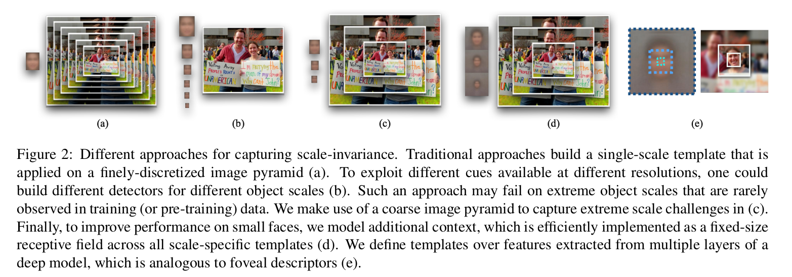
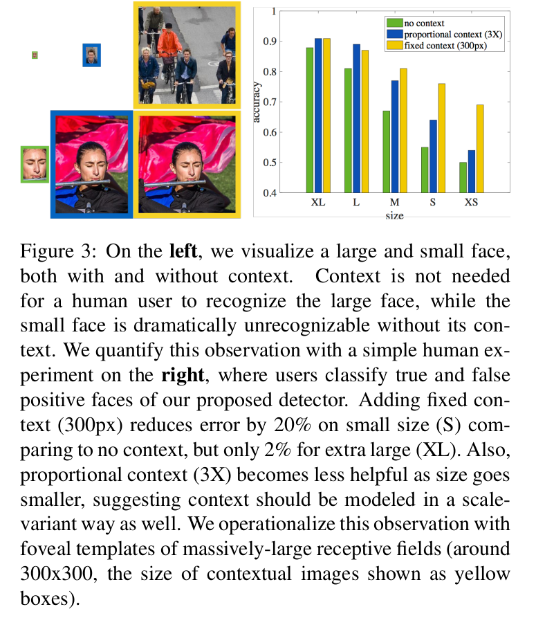
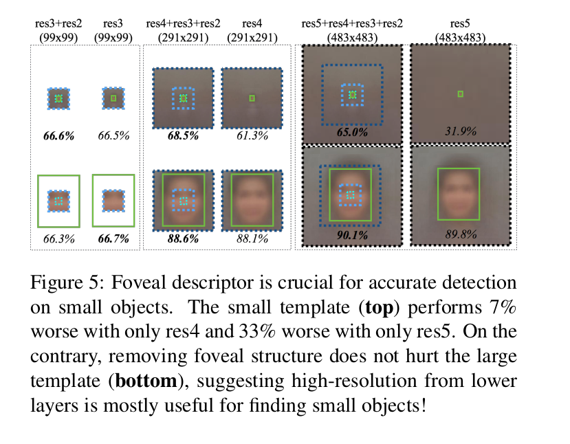
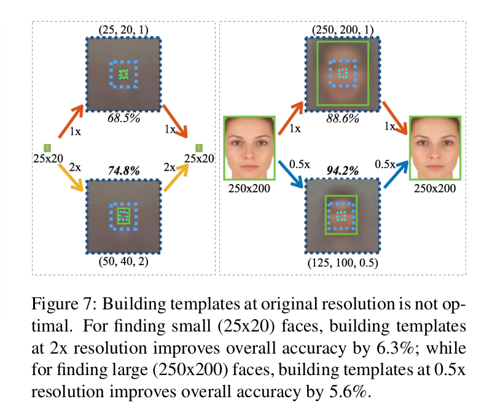
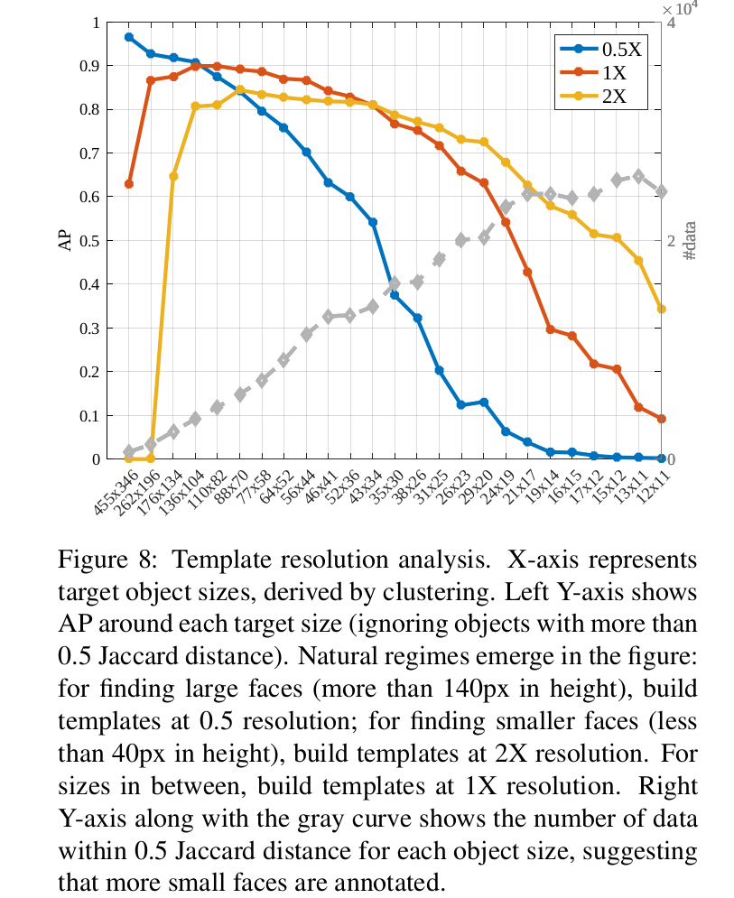
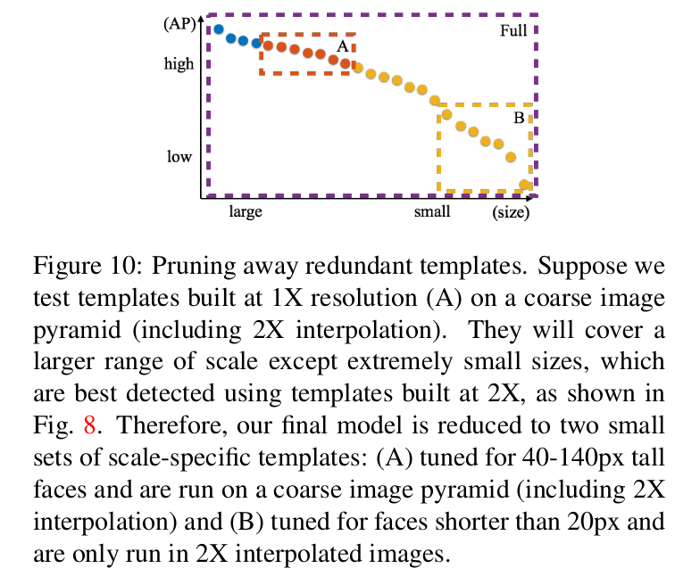
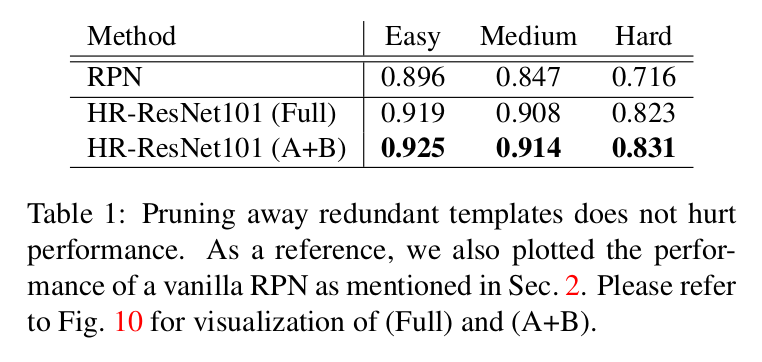
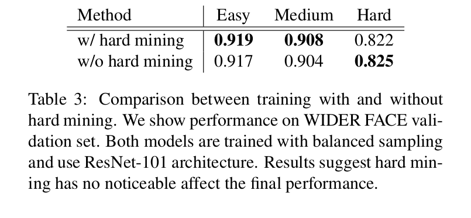

Finding Tiny Faces
==

# 1. Introduction
尽管在目标识别方面已经取得了巨大的进步，但仍然存在的挑战之一是检测小目标。在人脸检测的背景下，本文从尺度不变性、图像分辨率和上下文推理三个方面探讨了人脸检测中的问题。尺度不变是几乎所有当前识别和目标检测系统的基本特性。但是从实践的角度，尺度不变性不适用于分辨率有限的传感器:识别300px高人脸的提示与识别3px高人脸的提示在性质上是不同的。

**Multi-task modeling of scales:** 最近在对象检测方面的许多工作都使用了尺度规范化的分类器(例如，扫描窗口检测器运行在图像金字塔[5]上，区域分类器运行在“ROI”汇集的图像特征上[7,18])。当将区域调整为标准模板大小时，我们会问一个简单的问题——模板的大小应该是多少?一方面，我们想要一个可以检测小型人脸的小模板；另一方面，我们想要可以利用细节特征（或者说人脸局部）的大型目标以提高准确率。不同于“one-size-fits-all” 方法，我们训练适应不同尺度（和纵横比）的检测器。训练大量特定于尺度的检测器可能会导致缺乏针对单个尺度的训练数据以及在测试时运行大量检测器效率低下。为了解决这两个问题，我们以多任务的方式训练和运行特定于规模的检测器:它们使用在单个(深度)特征层次结构的多层上定义的特征。虽然这样的策略使得检测器对大的物体具有高精度，但寻找小的物体仍然是一个挑战。

**How to generalize pre-trained networks?** 对于寻找小物体的问题，我们提供了另外两个关键的见解。第一，分析了如何从预训练的深度网络中提取尺度不变特征。我们演示了现有的网络是为特定大小的对象(在像ImageNet这样的预训练数据集中遇到的对象)进行调优的。为了将从这些网络调优的特征扩展到具有新尺寸的对象，我们使用了一种简单的策略:在测试时通过插值和抽取调整图像的大小。虽然许多识别系统通过处理图像金字塔以一种“多分辨率”的方式应用时，我们发现插值金字塔的最低层对于查找小对象[5]特别重要。因此，我们的最终方法(图2)是一种精细的特定于尺度的检测器的混合，它以一种尺度不变的方式使用(通过处理图像金字塔来捕获大规模变化)。

**How best to encoded context?** 寻找小对象从根本上来说是具有挑战性的，因为对象上几乎没有可以利用的信号。因此，我们认为必须使用超越对象范围的图像证据。这通常表述为“上下文”。图3中，我们展示一种简单的人累实验，其中尝试分类真和假正类人脸（如我们的检测起给出的）。人类需要上下文来准确地分类小型人脸是非常清楚的。虽然这一观察结果在计算机视觉中是相当直观和高度探索的[16,22]，但众所周知，很难量化地证明上下文在识别中的好处[4,6,23]。其中的一个挑战似乎是如何有效地编码大图像区域。我们证明，从多层(也称为“超列”特征[8,14])中提取的卷积深度特征是有效的“foveal”描述器，可在大感受野捕获高分辨率细节和粗低分辨率线索(图2 (e))。我们证明foveal描述器（从更低的卷积层）的高分辨率组件对于图5中的准确定位是至关重要的。

**Our contribution:** 我们为寻找小型人脸提供了对图像的分辨率、对象的尺度和空间上下文深入分析。我们展示了在大型基准测试人脸数据集（FDDB和WINDER FACE）上最佳结果。特别是，与WINDER FACE的现有技术相比，我们的结果减少了2倍的误差(我们的模型产生81%的AP，而现有技术的范围为29-64%)。

# 2. Related work
**Scale-invariance:** 绝大多数识别管道关注于可追溯到SIFT[15]的尺度不变表示。当前的检测，如 Faster R-CNN ，也遵循这一理念，通过ROI池化或图像金字塔[19]提取尺度不变的特征。我们提供了对尺度变化模板的深入探索，这些模板以前被提出用于行人检测[17]，有时是在改进速度[3]的情况下。SSD[13]是利用尺度不变模板的给予深m
度特征的最近技术。我们的工作不同之处是我们进行小对象检测的上下文探索。

**Context:** 上下文是发现小型实例额关键，已在多种识别任务中被证明。在对象检测种，[2]在兴趣区域外堆叠空间RNN（IRNN[11]）建模上下文，并证明对小型对象检测有改进。在行人检测种，[17]使用 ground plane 估计作为上下文特征，并改善小型实例的检测。在人脸检测中，[28]同事池化人脸和身体周围的 RoI 特征以为检测评分，这显著提高综合性能。我们所提出的工作以尺度变化的方式（与[28]相反）利用大型局部上下文（对立面为全局上下文描述器[2,17]）。我们证明上下文对于发现低分辨率人脸最有用。

**Multi-scale representation:** 多尺度表示已被证明对于许多识别任务是有用的。[8,14,1]证明深度多尺度描述器（熟知的“hypercolumns”）对语义分割起作用。[2,13]展示这样的对象检测模型的改进。[28]池化多尺度 RoI 特征。我们的模型使用“hypercolumns”特征，指出精细尺度特征对定位小型对象最有用。

**RPN:** 我们的模型表面上类似于为特定对象类而训练的区域建议网络(RPN)，而不是一般的“对象”建议生成器[18]。这个重要的差异是我们使用 foveal 描述器（通过多尺度特征实现），我们通过交叉验证选择对象尺度和纵横比范围，并且我们的模型使用一个图像金字塔寻找一个极端的尺度。特别地，我们的用于寻找小型对象的方法利用调整的尺度特定检测器来插值图像。没有这些修改，小型人脸的性能减少超过 10% 。

# 3. Exploring context and resolution
在本节中，我们将对影响最终模型的问题进行探索性分析。为了展开讨论，我们提出以下简单的问题: 什么是寻找固定尺寸（ $25 \times 20$ ） 小型人脸的最佳方式？通过根据期望的输出显式地提出尺度变化，我们可以探究上下文和标准模板尺寸的作用。直觉上，上下文将是寻找小型人脸的关键。标准目标尺寸看起来是一个奇怪的探索尺度——既然我们希望找到大小为 25x20 的人脸，为什么还要定义一个大小为25x20以外的模板呢?我们的分析给出了一个令人惊讶的答案:何时以及为什么应该这样做。为了更好地理解我们的分析的含义，在此过程中，我们还对大型对象提出了类似的问题:找到固定大小(250x200)的大型人脸的最佳方法是什么?

**Setup：** 我们为构建固定尺寸（例如25x20）的人脸扫描窗口检测器探索不同的策略。我们讲固定尺寸的对象检测器视为 _binary heatmap prediction problem_ ，其中每个像素位置 $(x, y)$ 的预测热图描述固定尺寸的检测中心位于 $(x, y)$ 的置信度。我们使用 ResNet 训练热图预测器。我们利用从每个 res-block 的最后一层（即，res2cx、res3dx、res4fx、res5cx）提取的多尺度特征。我们从今以后称之为 （res2、res3、res4、res5）特征。训练管道的余下部分在第 5 节中讨论。

## 3.1 Context
图4给出了用于热图预测的感受野(RF)的大小，分析了上下文的影响。回想一下，对于固定大小的检测窗口，我们可以选择使用与此窗口相比具有任意大小感受的特征进行预测。因为子啊更高层的卷积特征倾向于更大的感受野（例如res4特征跨越 $291 \times 291$ 个像素），更小的感受野需要使用更底层的特征。我们见证了许多一般性倾向。添加上下文几乎总是有帮助的，尽管最终为小人脸(超过300x300像素)添加上下文会造成损害。我们验证了这是由于过拟合（通过检测训练和测试性能）。有趣的是，更小的感受野对更小的人脸更好，因为整个人脸是可见的——如果只找鼻尖，很难找到大脸。更重要的是，我们通过对比“tight” RF（限制到对象范围）的性能和具有额外上下文的“loose” RF 的最佳评分分析上下文的影响。小型人脸的准确率提高 18.9% ，同时，大型人脸的准确率提高 1.5 % ，与人类实验一直（这认为上下文对小型实例最有用）。我们的结果表明，我们可以为具有相同感受野(大小为291x291)的不同大小的检测器构建多任务模板，这对于多通道热图预测问题(其中每个特定于尺度的通道和像素位置都有自己的二进制损失)实现起来尤其简单。图5中，我们比较有和没有 foveal 结构的描述器，其展示了我们 foveal 描述器的高分辨率组件对于准确检测小型实例至关重要。

## 3.2 Resolution
我们现在探讨一个相当奇怪的问题。如果我们训练一个模板，该模板的大小有意地与要检测的目标对象不同，该怎么办?理论上，可以在上采样2倍（插值）的测试图像上使用“中间”尺寸的模板（ $50 \times 40$ ）来寻找小型人脸（ $25 \times 20$ ）。图2实际上表明了这种从 69% 到 75% 的显著性能提升结果。对于大型人脸，我们提出相反的问题：是否可以在下采样两倍的测试图像上通过运行一个调整用于“中间”尺寸人脸（ $125 \times 100$ ）的模板来寻找大型人脸？再一次，我们见证了从 89% 到 94% 的显著性能提升！

一种解释是，我们有用于不同对象尺寸的不同数量的训练数据，而我们期望那些有更多训练数据的尺寸有更好的性能。在“野外”数据集(如 WIDER FACE和COCO[12])中，一个反复出现的现象是，较小的物体数量远远超过较大的物体，部分原因是在固定大小的图像中可以标记更多的小物体。我们验证了 WIDER FACE 在的这种情况，如图 8（灰色曲线）。虽然不平衡的数据可以解释为什么使用中间尺寸的模板可以检测大型人脸（因为有更多的中间尺寸人脸用于训练），但是它不能解释小型人力蓝的检测结果。尽管存在少量的中间人脸训练样板，但使用中间尺寸的模板的性能仍然更好。

我们发现罪魁祸首在于预训练数据集(ImageNet)中对象尺度的分布。图5反应了ImageNet中 80% 的训练样本包含40到140px的中间尺寸对象。具体来说，我们假设预先训练的ImageNet模型(用于微调特定于尺度的检测器)针对该范围内的对象进行了优化，并且在可能的情况下，应该使标准大小的模板大小偏向于该范围内。我们在下一节中验证这种假设，其中我们描述用于构建具有不同标砖分辨率的尺度特征检测器的管道。

# 4. Approach： scale-specific detection
很自然地提出如下问题： 是否有一般策略用于选择特定对象尺寸的模板分辨率？我们证明可以利用多任务学习以“暴力（brute-force）”训练几种不同分辨率的模板，并贪心选择最佳的一个。事实证明，似乎存在一种与我们在上一节中的分析一致的总体策略。

首先，让我们定义一些符号。我们使用 $t(h,w,\sigma)$ 表示一个模板。如此的模板在分辨为 $\sigma$ 下被调整以检测大小为 $(h/\sigma, w/\sigma)$ 的对象。例如，图7右侧同时使用 $t(250,100,1)$ （顶部）和 $t(125,100,0.5)$ 来寻找 $250\times200$ 的人脸。

给定图像和边界框的训练数据集，我们可以定义一组大致覆盖边界框形状空间的标准边界框形状。本文中，我们通过聚类定义如此的标准形状，其基于公式（1）中的 Jaccard 距离推导：

$$d(s_i,s_j) = 1 - J(s_i, s_j) \tag 1$$

其中 $s_i = (h_i, w_i)$ ， $s_j = (h_j,w_j)$ 是边界框形状对，$J$ 表示标准的 Jaccard 相似度（IoU） 。

现在，对于每个目标尺寸 $s_i = (h_i,w_i)$ ，我们提出：什么 $\sigma_i$ 将最大化 $t_i(\sigma_ih_i, \sigma_iw_i,\sigma_i)$ ？为了回答这个问题，我们简单地为 $\sigma \in \sum$ 中的每个值训练独立的多任务检测模型，并每个对象尺寸采用最大的。我们绘制每个特定分辨率的多任务模型的性能，如图8中的彩色曲线。使用每个 $(h_i, w_i)$ 的最优 $\sigma_i$ ，我们重新训练一个具有“hybrid”分辨率的多任务模型（称之为HR），实际上，它遵循所有曲线的上包络线。有趣的是，对于不同的策略存在着自然的机制:为了找到大的对象(高度大于140px)，使用2倍更小的标准分辨率。为了找到小型对象（高度小于40px），使用2倍大的标准模板分辨率。其他的使用相同（1倍）分辨率。我们的结果几乎遵循ImageNet的统计量（图6），大部分对象都位于这个范围。

**Pruning:** 上一节中的hybrid-resolution多任务模型有些冗余。例如，模板 $(62,50,2)$ ，寻找 $31 \times 25$ 个面最优模板，是冗余的，因为存在模板 $(64,50,1)$ ，寻找 $64 \times 50$ 人脸的最优模板。我们可以裁剪掉这样的冗余吗？可以！我们请读者参阅图10中的标题以获得直观的描述。如表1所示，裁剪掉冗余模板导致一些小的改进。从本质上讲,我们的模型可以减少一小组特定尺度的模板(调整为40 - 140 px高的人脸),可以运行在一个粗糙的图像金字塔(包括2倍插值)，结合一组特定尺度的模板设计在2倍插值图像上寻找小型人脸(不到20px高)。

（图10:删除冗余模板。假设我们在一个粗糙的图像金字塔(包括2倍插值)上测试以1倍分辨率(A)构建的模板。它们将覆盖更大的范围，除了非常小的尺寸，这是构建在2倍插值图像上的最的检测使用模板，如图8所示。因此，我们最终的模型被简化为两组特定于尺度的模板:(A)对40-140px高的人脸进行优化，并在一个粗糙的图像金字塔上运行(包括2倍插值)；(B)对小于20px的人脸进行优化，只在2倍插值图像中运行。）

## 4.1 Architecture

我们在图9中可视化我们所提出的模型。我们训练二值多通道热图预测器以报告一个人脸尺寸范围（高度为40-90px）的对象置信度。然后，我们会发现大小不同的人脸都有一个粗糙的图像金字塔，其中重要的是，它包括一个2倍的上采样阶段，带有专用的热图，这些热图只能在这个分辨率下预测(例如，专为小于20像素的小人脸设计)。对于共享 CNN ，我们使用三个不同架构（ResNet101、ResNet50和VGG16）进行实验。尽管ResNet101的性能最好，但是在表2中包含了所有模型的详细比较。重要的是，我们的结果明显优于现有技术的所有模型在“硬”集（“hard” set）。

**Details:** 给定具有对象的 ground-truth 标注和模板的训练图像，我们定义正类位置为IoU阈值超过70%的标注，并且将负位置设置为重叠低于30%（其他位置通过讲梯度置为0以忽略）。注意，这会隐含着每个大型对象实例生成远比小型实例多的训练样本。因为这导致高度不平衡的二值分类训练集，我们使用平衡采样[7]和hard-example挖掘[21]来消除这种影响。我们发现，当后处理线性回归器对报告的边界框位置进行微调时，性能得到了提高。为了确保在于测试条件相似的数据上训练模型，我们随机调整训练数据 $\sum$ 分辨率范围,我们考虑在测试时的 $(0.5\times, 1\times, 2\times)$ 以及从每幅图像中的一个随机的固定大小的 $500 \times 500$ 像素的裁剪(利用批处理)中学习。我们在 WINDER FACE 训练集上以固定学习了 $10^{-4}$ 微调预训练的 ImageNet 模型，并在 WIDER FACE 验证集上和held-out测试集上评估性能 。为了生成最终的检测集合，我们将重叠阈值为30%的标准NMS应用到检测热图。 

# 5. Experiments
**WINDER FACE:** 我们在WINDER FACE训练集上训练具有25个模板的hybrid-resolution模型，并在held-out测试集上报告我们的性能。如图11所示，我们的 hybrid-resolution 模型（HR）在所有困难级别都获得最佳性能，但是最重要的是，在“hard”集上，它比之前的最佳结果高 17% 。注意，“hard”集包括所有小于10个像素的人脸，因此，在全部测试集上有更加准确地的代表性能。量化结果如图13所示。

**FDDB:** 我们将在WIDER FACE上训练的hybrid-resolution模型直接在FDDB上进行测试。我们out-of-the-box检测器（HR）在离散评分上优于所有已发布的结果。因为WINDER FACE有边框注释，而FDDB有边框椭圆，所以我们训练一个后自适应（post-hoc）椭圆回归器来将我们预测的边框转换为边框椭圆。使用后适应回归器，我们的检测器也在连续得分上获得最佳性能。我们的post-hoc回归器遵循10折交叉验证。图12中，我们绘制检测在有和没有椭圆回归器（ER）时的性能。量化结果如图14.

# A. Complete evaluation on WIDER FACE

图15中，我们可视化了WIDER FACE的验证集和测试集上准确率召回率曲线。

# B. More experimental details
**Multi-scale features** 受训练[20]（FCN）的方式 “FCN-8s at once” 的启发，我们用一个固定的常数来衡量建立在每一层上的预测器的学习率。具体而言，我们为 res4 使用缩放因子 1 ，为 res3 使用缩放因子 0.1 ，为 res2 使用 0.01 。我们的模型和[20]不同之处在于：我们的模型不是在原始分辨率预测，而是在res3特征的分辨率（与输入分辨率相比下采样了8倍）上进行预测。

**Input sampling** 我们首先以0.5、 1.0 和 2.0 倍随机重新调整输入图像。然后，我们在重新调整的图像上随机裁剪一个 $500 \times 500$ 的图像区域。我们裁剪超出图像边界时，我们使用 RGB 均值填充图像。

**Border cases** 与[18]相似，我们忽略检测窗口超过图像边界的热图位置的梯度。仅有的差异是，我们将填充的平均像素也视为图像边界。

**Online hard mining and balanced sampling** 我们在正样本和负样本上都采用 hard mining 。我们的实现相比[21]更简单高效。我们在分类损失上设置阈值（0.03）以过滤容易的位置。然后，我们为正类和负类都从余下损失超过阈值的位置中采样前128个位置。我们在表3中比较了有和没有hard mining的验证性能。

**Loss function** 我们的损失函数与[18]（faster r-cnn）有相同的方式。注意，我们也使用Huber损失作为边界框回归的损失

**Bounding box regression** 我们的边界框回归如[18]，并使用随机梯度下降联合分类进行训练。我们比较了有回归和没有回归的测试在WIDER FACE验证集上的性能。

**Bounding ellipse regression** 我们的边界椭圆回归如公式2：

$$
\begin{alignat}{2}
t_{x_c}^\ast &= (x_c^\ast - x_c) / w \tag2 \\
t_{y_c}^\ast &= (y_c^\ast - y_c) / h \tag3 \\
t_{r_a}^\ast &= \log(r_a^\ast / (h / 2)) \tag4 \\
t_{r_b}^\ast &= \log(r_b^\ast / (w / w)) \tag 5 \\
t_{\theta}^\ast & = \cot(\theta^\ast)  \\ tag7
\end{alignat}
$$

其中 $x_c^\ast, y_c^\ast, r_a^\ast, r_b^\ast, \theta^\ast$ 表示ground-truth的中心 $x, y$ 坐标、半轴和旋转角度。$x_c, y_c, h, w$ 表示预测边界框的中心坐标、宽高。离线学习边界椭圆线性回归，具有训练边界框回归的相同特性。

**Other hyper-parameters** 我们是哦弄固定学习了 $10^{-4$ 、权重衰减0.0005，momentum 为 0.9 。我们使用20张图像的批量大型，并随机从每幅图像的重新缩放版本中裁剪一个 $500 \times 500$ 的区域。一般而言，我们训练模型 50 epoch ，然后选择验证集上最佳性能的epoch。
