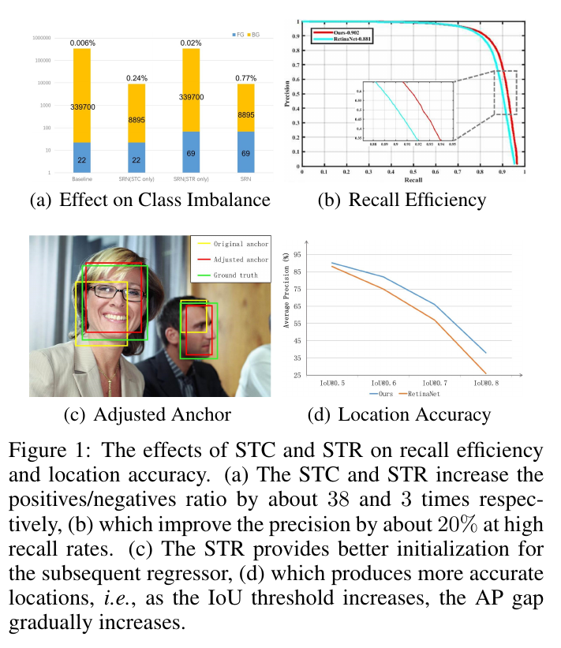
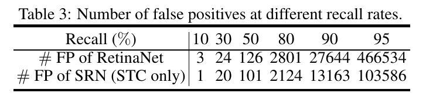
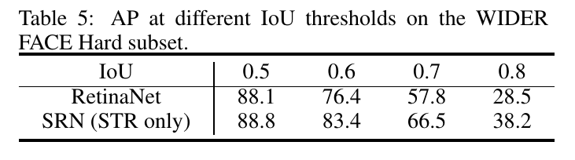

Selective Refinement Network for High Performance Face Detection
=

# Introduction
人脸检测是计算机视觉中长期存在的问题，具有广泛的应用，包括人脸对齐、人脸分析、人脸识别等。从Viola-Jones（Viola和Jones 2004）的开创性工作开始，人脸检测取得了很大进展。几个着名数据集上的表现已经得到一致改善，甚至趋于饱和。进一步提高人脸检测的性能已成为一个具有挑战性的问题。我们认为，在两个方面仍有改进的空间： （a）_recall efficiency_ ：false positive 需要在高召回率处减小；（b）_location accuracy_：边界框定位的准确率需要提高。这两个问题详述如下。

一方面，当前人脸检测算法的平均精确率（AP）已经非常高，但是在高召回率下精确度不够高，例如，如RetinaNet的图1（b）所示（Lin et al.117 2017b），当召回率等于 90% 时，精确率仅约为 50% （即一半的检测是 false positive），这我们定义 _low recall efficiency_ 。据Precision-Recall曲线的形状，它向右延伸得足够远，但不够陡峭。原因是现有算法更注重追求高召回率但忽略了过多false positive的问题。通过对基于锚点的人脸检测器进行分析，它们通过对一系列预设锚点进行分类和回归来检测面部，这些预设锚点是通过规则地平铺具有不同比例和纵横比的框的集合而生成的。为了检测小型人脸，例如小于 $16 \times 16$ 像素，有必要在图像上铺设大量小锚。这可以提高召回率，也引起极端的类不平衡问题，这是导致过多false positive的罪魁祸首。为了处理这个问题，研究人员提出几种解决方案。R-CNN类检测器通过两阶段级联和启发式采样处理类不平衡。作为单发检测器，RetinaNet提出focal loss，将重点训练难样本的稀疏结合，并减小分配给良好分类的样本的损失。RefineDet使用预设的阈值来过滤负锚以处理该问题。然而，RetinaNet考虑所以的样本，这也导致相当多的false positive。尽管RefineDet过滤掉大量简单的负样本，但是它在两个步骤上都使用hard negative mining，并没有充分利用负样本。因此，它们的召回效率都可以提高。

另一方面，人脸检测任务中定位准确性逐渐引起研究人员的注意。尽管当前的大多数人脸检测数据集的评估准则没有关注定位准确性，但是WIDER Face Chanllenge 采用 MS COCO 的评估准则，其更强调边界框位置的准确性。为了可视化这个问题，我们使用不同的 IoU 阈值来评估我们在WIDER Face数据集上具有RetinaNet训练的人脸检测器。如图1（d）所示，随着 IoU 阈值的增加，AP剧烈减小，表明边界框定位的准确性需要增加。为此，Gidaris等人提出在推理期间进行迭代回归以提高准确率。Cascade R-CNN通过使用不同 IoU 阈值的级联 R-CNN 来处理这个问题。RefineDet 将两步回归应用到单发检测器。然而，盲目地将多步回归添加到特定任务（即，人脸检测）通常会适得其反。

本文中，我们研究了两步分类和回归对不同检测层水平的影响，并提出了一种新颖的人脸检测框架，称为 Selective Refinement Network（SRN），其选择性地讲两步分类和回归应用到特定的检测层水平。SRN网络架构如图2，其包括两个关键模块，称为 Selective Two-step Classification（STC）和 Selective Two-step Regression。具体而言，STC被用于从检测层的低水平中过滤掉多数简单的负样本（如图1（a）所示），这包含88.9%的样本。如图1（b）所示，具有STC的RetinaNet在一定程度上提高召回效率。另一方面，STR的设计借鉴了级联思想，从高水平的检测层粗略调整锚点的位置和大小（如图1（c）所示），为后续的回归量提供更好的初始化。此外，我们设计 Receptive Field Enhancement（RFE）以提供更多样的感受野，从而更好的捕获极端姿势的人脸。在AFW，PASCAL face，FDDB和WIDER FACE基准测试方面进行了大量实验，我们设定了一种新的最先进的性能。

在总结中，我们对人脸检测研究做出了以下主要贡献：

- 我们提出了一个STC模块来过滤掉来自低层的大多数简单负样本，以减少分类搜索空间。
- 我们设计了一个STR模块，可以从高级层粗略调整锚点的位置和大小，为后续的回归量提供更好的初始化。
- 我们引入了一个RFE模块，为检测极端姿势面提供更多样化的感受野。
- 我们在AFW，PASCAL face，FDDB和WIDER FACE数据集上实现了最先进的结果。

# Selective Refinement Network
## Network Structure
SRN 的整体框架如图2所示。我们描述每个部分如下。

**Backbone.** 我们采用具有6个级别的特征金字塔结构ResNet-50作为 SRN 的骨干网络。从这4个残差块提取的的特征图分别表示为 C2、 C3、 C4 和 C5 。C6 和 C7 仅在 C5 之后使用两个简单的 $3 \times 3$ 卷积下采样提取。bottom-up和top-down路径之间的侧连接的结构与FPN相同。P2、 P3、 P4 和 P5 为从侧连接提取的特征图，分别对应 C2、 C3、 C4 和 C5，而P6和P7仅在P5之后通过两个简单的 $3 \times 3$ 的卷积层提取。

**Dedicated Modules.** STC 模块选择 C2、 C3、 C4、 P2、 P3 和 P4 来执行两步分类，而STR模块选择C5、 C6、 C7、 P5、 P6和P7来执行两步回归。RFE模块负责丰富用于预测对象分类和位置的特征的感受野。

**Anchor Design.** 在每个金字塔级，我们使用两个特定尺度（即， $2S$ 和 $2\sqrt{2} S$, 其中 $S$ 表示每个金字塔级的总步长）以及一个纵横比（即 1.25）的锚。总之，每个级别有 $A=2$个锚，它们覆盖了相对于网络输入图像的级别8到362像素的尺度范围。

**Loss Function.** 我们附加混合损失在深度架构的末尾，其利用焦点损失和smooth $L_1$ 损失的精神来驱动模型关注更难训练的样本以及学习更好的回归结果。

# Selective Two-Step Classification
在RefineDet中引入，两步分类是一种通过两步网络架构实现的级联分类，其中第一步使用预设的负阈值θ= 0.99过滤掉大多数简单的负锚以减少后续步骤的搜索空间。对于基于锚点的人脸检测器，有必要在图像上平铺大量小锚以检测小面，但这会导致正负样本之间的极端不平衡。例如，在具有 $1024 \times 1024$ 的 SRN 结构中，如果我们在每个锚点平铺2个锚，样本的数量将达到300k。其中，正类样本的数量只有几十个或更少。为了减少分类器的搜索空间，进行两步分类以减少false positive至关重要。

然而，没有必要在所有的金字塔级执行两步分类。因为平铺在三个更高层（即P5、P6和P7）上的锚仅占11.1％，相关特征更加充足。因此，在这三个更高金字塔级别上的分类任务相对容易。因此，对三个较高的金字塔等级应用两步分类是不必要的，并且如果应用，将导致计算成本的增加。相比之下，三个更低金字塔级别（即P2、P3和P4）拥有绝大多数样本（88.9％）并且缺乏足够的特征。迫切需要这些低金字塔等级进行两步分类，以减轻类不平衡问题并减少后续分类器的搜索空间。

因此，我们的STC模块选择C2、C3、C4、P2、P3和P4执行两步分类。如图1（a）所示的统计结果，STC将正负样本之比增加了38倍，从大约 $1:15441$ 到 $1:404$ 。此外，我们在两步都使用焦点损失以充分利用样本。不同于RefineDet，SRN在两步中共享相同的分类模块，因为他们有相同的任务来区分人脸和背景。在每个金字塔等级上应用两步分类的实验结果如表2所示。与我们的分析一致，三个较低金字塔等级的两步分类有助于提高绩效，而三个较高金字塔等级则无效。

STC的损失函数由两部分组成，即第一步和第二部的损失。对于第一步，我们计算选择用于执行两步分类的样本的焦点损失。而对于第二步，我们仅关注第一步过滤后余下的样本。有了这些定义，我们定义损失函数为：

$$
\begin{alignat}{2}
L_{STC}(\{p_i\}, \{q_i\}) &= \frac{1}{N_{s_1}}\sum_{i \in \Omega} L_{FL}(p_i, l_i^\ast) \\
&+\frac{1}{N_{s_2}}\sum_{i\in\Phi}L_{FL}(q_i, l_i^\ast)
\end{alignat} \tag 2
$$

其中 $i$ 为mini-batch中的锚索引，$p_i$ 和 $q_i$ 为在第1和第2步中锚 $i$ 为人脸的预测置信度，$l_i^\ast$为锚 $i$ 的ground-truth类标签， $N_{s_1}$ 和 $N_{s_2}$ 为第一和第二步中正类锚的数量， $\Omega$ 表示两步分类中选择的样本集合，$\Phi$ 为第一步过滤后余下的样本集。二值分类损失 $L_{FL}$ 为两个类（人脸 vs 背景）sigmoid 焦点损失。

# Selective Two-Step Regression
在检测任务中，使边界框位置更加准确始终是一个挑战性问题。当前的一阶段方法依赖于基于各种特征层的一步回归，这在一些具有挑战性的情况下是不准确的，例如，MS COCO风格的评估标准。最近几年，使用级联结构来执行多步回归是提高检测边界框准确率的有效方法。

然而，盲目地将多步回归添加到特定任务（即人脸检测）通常适得其反。实验结果（见表4）表明将两步回归应用到三个更低金字塔级别影响性能。这种现象背后的原因有两点：1）三个较低的金字塔等级与大量的小锚相关联，从而检测小脸，这些小型人脸被非常粗超的特征表示特征化，因此这些小型锚难以执行两步回归；2）在训练阶段，如果我们让网络过度关注低金字塔等级的困难回归任务，就会造成更大的回归损失，阻碍更重要的分类任务。

基于上述分析，我们选择性地在较高的三个金字塔级别执行两步回归。这种设计背后的动机是充分利用三个较高金字塔级别上大型人脸的细节特征以回归更准确的边界框位置，并使三个较低金字塔级别更注意分类任务。这种分而治之的策略使整个网络更有效。

STR的损失函数也由两部分组成，其表示如下：

$$
\begin{alignat}{2}
L_{STR}(\{x_i\}, \{t_i\}) &= \sum_{i\in \Psi}[l_i^\ast = 1] L_r(x_i, g_i^\ast) \\
&+ \sum_{i \in \Phi} [L_i^\ast = 1]L_r(t_i, g_i^\ast)
\end{alignat} \tag 2
$$

其中， $g_i^\ast$ 为锚$i$的ground-truth位置和大小，$x_i$ 为第一步中锚 $i$ 的精炼坐标，$t_i$ 为第二部中边界框的坐标， $\Psi$ 表示选择用于两步回归的样本集合，$l_i^\ast$ 和 $\Phi$ 为与 STC 相同的定义。与Faster R-CNN 相似，我们使用smooth $L_1$ 损失作为回归损失 $L_r$ 。方括号指示函数 $[l_i^\ast = 1]$ ，如果条件为真（即$l_i^\ast=1$，锚不为负），则输出 1 ；否则输出 0 。因此，$[l_i^\ast]=1L_r$ 表明对于负锚回归损失被忽略。

# Receptive Field Enhancement
目前，许多检测网络利用ResNet和VGGNet作为基本的特征提取模块，而二者都具有正方形感受野。感受野的单一性影响不同纵横比的对象的检测。这个问题在人脸检测中看起来不重要，因为在许多数据集中人脸注释的纵横比大约为 $1:1$ 。尽管如此，统计数据显示WIDER FACE训练集中有相当一部分面部长宽比大于2或小于0.5。因此，感受野和人脸纵横比之间存在不匹配。

为了处理这个问题，我们提出一个称为 Receptive Field Enhancement （RFE）的模块以在预测类和位置之前多样化特征的感受野。特别地，RFE替换了RetinaNet的类子网络和边界框子网络中的中间两个卷积层。RFE结构如图3所示。我们的RFE模块采用四分支结构，其受Inception块的启发。再具体一点，首先，我们使用 $1 \times 1$ 卷积层来减小通道数为先前层的四分之一。接着，我们使用 $1 \times k$ 和 $k \times 1$ （$k=3 \mbox{ 和 } 5$） 卷积层以提供矩形感受野。通过另一个 $1 \times 1$ 卷积层，将四个分支的特征图拼接到一起。此外，我们使用一个快捷路径保留先前层的原始感受野。

# Training and Inference
**Training Dataset.** 所有模型都是在WIDER FACE 数据集的训练集上训练。它由32203张图像上的，具有姿势、尺度、面部表情、遮挡和光照条件的变化的 393703个注释人脸边界框组成。数据集划分为训练集（40%）、验证集（10%）和测试集（50%），并基于EdgeBox的检测率定义了三种困难程度：Easy、 Medium 和 Hard。

**Data Augmentation.** 为了阻止过拟合以及构建一个鲁棒性的模型，使用几种数据增强策略以适应人脸变化，描述如下。
1） 将先前工作中引入的一些光度失真（Howard 2013）应用于训练图像。
2） 通过零填充操作在区间 $[1,2]$ 中使用随机因子扩展图像。
3）裁剪两个正方形patch，并随机选择一个用于训练。一个patch的大小是图像的短边，而另一个的大小是由图像的短边乘以区间 $[0.5, 1.0]$ 之间的随机数确定的。
4）随机翻转选择的patch，并将其调整为 $1024 \times 1024$ 以得到最终训练样本。

**Anchor Matching.** 在训练阶段，锚需要划分为正负样本。具体而言，锚使用 $\theta_p$ 的 IoU阈值分配ground-truth人脸边界框；如果它们的 IoU 位于 $[0, \theta_n)$ 中，则分配为背景。如果一个锚没有被分配，其具有的重叠可能位于 $[\theta_n, \theta_p)$ 中，在训练期间被忽略。经验上，在第一步中，我们设置 $\theta_n = 0.3$ 、$\theta_p = 0.7$ ；在第二步中，我们设置 $\theta_n = 0.4$ 、 $\theta_p=0.5$ 。

**Optimization.** SRN的损失函数仅仅是STC损失和STR损失之和，即 $L=L_{STC} + L_{STR}$ 。骨干网络由预训练的 ResNet-50 模型初始化，而所以新添加的参数由“Xavier”方法初始化。我们使用动力为0.9、权重衰减为0.0001以及批大小为32的SGD微调SRN。我们在前100 epoch中设置学习率为 $10^{-2}$ ，在接下来的20 epoch和10 epoch衰减为 $10^{-3}$ 和 $10^{-4}$ 。使用Pytorch实现SRN。

**Inference.** 在推理阶段，STC首先根据负置信度得分大于阈值  $\theta=0.99$ 过滤在金字塔级上规则平铺的锚，然后STR调整选择的锚的位置和大小。之后，第二步利用这些精炼的锚，并输出前2000个高置信检测。最后，我们使用0.5的Jaccard重叠的NMS为每幅图像生成前750个高置信检测，将其作为最终结果。

# Experiments
**Ablation Setting.**  

**Selective Two-step Classification.**  

**Selective Two-step Regression.**  

# Evaluation on Benchmark

