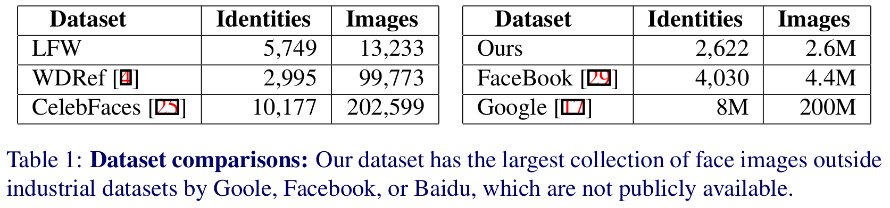
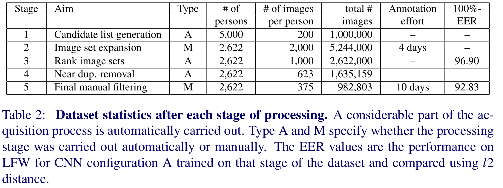
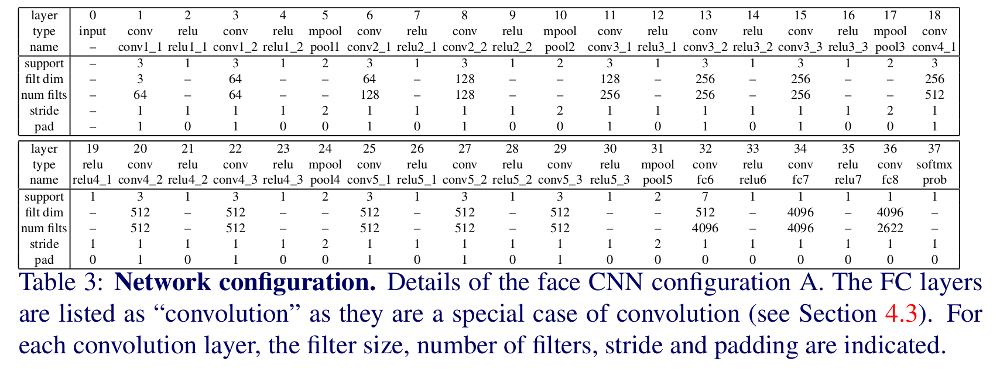
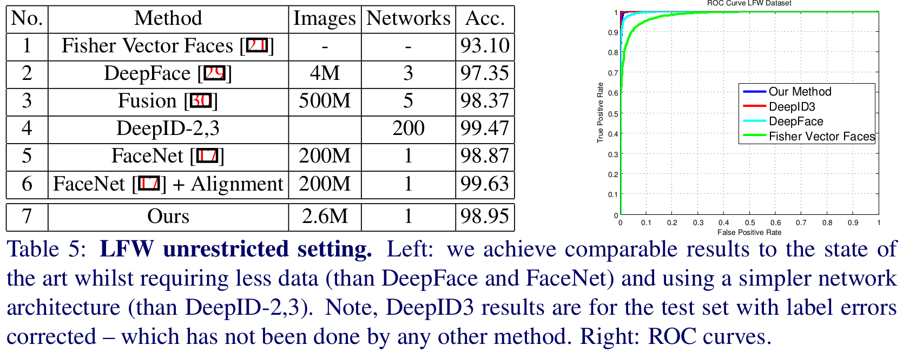
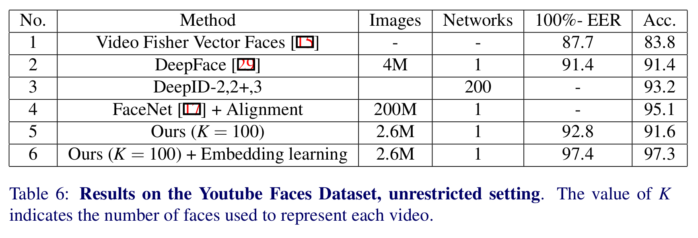

Deep Face Recognition
=

# 1 Introduction
卷积神经网络(Convolutional Neural Networks，简称CNNs)在计算机视觉领域掀起了一场风暴，极大地改善了许多应用领域的技术水平。这些方法成功的最重要因素之一是提供大量的训练数据。ILSVRC 为一般图像分类任务提供了这些数据。近年来，研究人员已经将数据集用于分割、场景分类和图像分割[12,33]。

然而，在人脸识别领域仍然缺乏大规模公开数据集，社区中最近的大多数进步仍然仅限于Facebook和谷歌等互联网巨头。例如，最近 Google 的人脸识别方法使用两亿张图像和800万个唯一身份训练。该数据集的大小几乎比任何公开的人脸数据集大三个数量级(见表1)。不用说，构建这么大的数据集超出了大多数国际研究小组的能力，尤其是在学术界。

本文有两个目的。第一个是提出一个过程来创建一个相当大的人脸数据集，同时只需要有限的人力进行注释。为此，我们提出了一种使用web上可用的知识库收集人脸数据的方法(第3节)。我们采用该过程构建超过2百万人脸的数据集，并免费提供给研究社区。第二个目的是研究人脸识别和验证的不用 CNN 架构，包括探索人脸对齐和度量学习，使用新的数据集进行训练。最近，许多人脸识别的工作提出了大量用于人脸的 CNN 架构的变体，而我们评估其中一些建模选择，以便从无关的细节中过滤出重要的内容。其结果是一种更简单而有效的网络架构，在所有流行的图像和视频人脸识别基准上都能获得接近最先进的结果(第5和第6节)。

# 2 Related Work

# 3 Dataset Collection
在这一节中，我们提出了一种多阶段策略，以有效地收集包含数百张示例图像的大型人脸数据集，用于数千个唯一身份(表1)。表2总结了这一过程的不同阶段以及相应的统计数据。下面各段将详细讨论各个阶段。

**Stage 1. Bootstraping and filtering a list of candidate identity names.** 构建数据集的第一阶段是获得将要获取人脸的候选身份的人名列表。这种思想集中在名人和公共图像上，例如演员或政客，这样就可以在网上找到足够多的不同的图片，同时也避免了下载图片时的隐私问题。通过从网络电影数据库(IMDB)名人列表中提取受欢迎程度排名的男性和女性，获得公众人物的初始名单。他的列表主要包含演员，与Freebase知识图[1]中的所有人相交，其中包含约50万个不同身份的信息，从而形成了一个由2.5万名男性和2.5万名女性组成的排名列表。这就形成了一个包含5K个已知知名人名(来自IMDB)的候选列表，其中包含了诸如种族、年龄、亲属关系等属性信息(来自知识图)。总共选择了5K的图像，以使后续的标注过程对一个小型标注团队是可管理的。

然后筛选候选列表，以删除没有足够不同图像的身份，并消除与标准基准测试数据集的任何重叠的身份。为为此，使用谷歌图像搜索下载每个名称的200张图像。然后将这200幅图像呈现给人类注释者(按顺序分为4组，每组50幅)，以确定哪些标识可以产生足够的图像纯度。具体而言，只有当对应的200幅图像集大约90%是纯图像时，才要求注释器保留该身份。纯度的缺乏可能是由于同音异义或形象的缺乏。过滤步骤将候选列表减小到3250个身份。接下来，任何出现在 LFW 和 YTF 数据集中的人名将被移除，以使可以在新数据集上训练，并仍在这些基准测试上公平地评估。以这种方式，获得最终包含2622个名人名称的列表。

**Stage 2. Collecting more images for each identity.** 2622个知名名称中的每一个都在 Google 和 Bing 图像搜索上查询，然后将关键字 “演员” 附加到人名。每个人名产生4次查询，并且每次查询产生500个结果，获得每个身份2000张图像。

**Stage 3. Improving purity with an automatic filter.** 此阶段的目标是使用分类器自动删除每个集合中的错误人脸。为了达到这个目的，每个身份的前50幅图像(基于下载集中谷歌的搜索排名)作为正训练样本，其他所有身份的前50幅图像作为负训练样本。使用Fisher向量脸描述器[15,20]对每个身份训练一个one-vs-rest线性支持向量机。然后使用每个标识的线性支持向量机对该身份的2,000张下载图像进行排序，并保留前1,000张图像(选择阈值1,000是为了在正向预测中提高精度)。

**Stage 4. Near duplicate removal.** 由两个不同的搜寻引擎所找到的同一幅图像，或由两个不同互联网地点所找到的同一幅图像的复本所产生的完全相同的复制品，均会被删除。接近的重复(例如，不同的图像只是在色彩平衡，或与文本重叠)也被删除。这是通过计算每个图像的VLAD描述符[2,9]，使用非常严格的阈值在每个标识的1,000幅图像中对这些描述符进行聚类，并在每个集群中保留单个元素来实现的。

**Stage 5. Final manual filtering.** 此时，有2622个身份，每个身份最多有1000个图像。最后一个阶段的目标是使用人工注释提高数据的纯度(精确度)。然而，为了减轻标注任务的负担，从而避免高昂的标注成本，标注人员可以再次使用自动排序。然而，这一次，一个多路CNN被训练使用[10]的AlexNet架构来区分2622个人脸身份;然后，softmax分数被用来通过降低成为一个内聚点的可能性来对每个身份集中的图像进行排序。为了加速标注人员的工作，每个身份的排序图像在 200 个block中展示，标注人员被要求验证block为一个整体。特别地，如果近似纯度大于 95% ，该block被声明为 good 。最后 good 图像的数量为 982803，其中约95%为正面，5%为侧面。

**Discussion.** 综上，这种使用互联网搜索引擎、使用已有人脸识别方法过滤数据和有限的人工内容关联的结合可以生成一个精确的大规模人脸数据集，并标注其身份。人工注释的成本非常小——所涉及的人工工作量总共只有14天左右，而到阶段4只需要4天。表1将我们的数据集与几个现有数据集进行了比较。

在上面的过程中已经做了很多设计选择。Freebase源可以被其他类似的源替代，比如DBPedia(结构化维基百科)和谷歌知识图。事实上，Freebase很快就会被关闭并被谷歌 Knowledge Graph 所取代。在图像收集方面，可以从 Wikimedia Commons、IMDB 等来源以及百度和Yandex等搜索引擎收集其他图像。删除与第一阶段LFW和YTF重叠的身份，以增加后续阶段的可用人数。可以更改阶段的顺序，以便在阶段2之前删除几乎重复的内容。在扩展方面，可以通过查看下载的图像之间成对距离的分布来自动化收集的第一阶段。一个高纯度的图像类应该表现出相当的单模态分布。

# 4 Network architecture and training
## 4.1 Learning a face classifier
最初,深度架构 $\phi$ 被考虑的问题引导识别 $N = 2,622$ 独特的个体，设置为 $N$ 分类问题。CNN 通过最后一个包含 $N$ 个线性预测 $W \in \Bbb {R}^{N\times D}, b \in \Bbb{R}^N$ 的全连接层，将每个训练图像 $l_t,t = 1,\cdots,T$ 与一个得分向量 $x_t = W \phi(l_t)+ b\in \Bbb{R}^N$ 。这些得分通过计算经验 softmax 对数损失 $E(\phi)=-\sum_t \log(e^{<e_{c_t}, x_t>}/\sum_{q=1,\cdots,N^{r^{<e_q,x_t>}}})$ 与 ground-truth 类身份 $c_t\in \{1, \cdots, N\}$ 比较，其中 $x_t = \phi(l_t) \in \Bbb{R}^D$ 、$e_c$ 表示类 c 的 one-hot 向量。

学习之后，分类器层 $(W, b)$ 可以移除，并得分向量可以使用欧式距离进行对比，以用于人脸身份验证。然而，通过使用“triplet loss”训练方案在欧几里得空间中对其进行优化以进行验证，分数可以显著提高，下一节将对此进行说明。虽然后者是获得良好综合性能的关键，但是引导网络作为一个分类器（如本节解释的）是训练更加容易和快速。

## 4.2 Learning a face embedding Using a triplet loss
Triplet-loss 训练目的是学习在最终应用上执行良好的得分向量，即通过比较欧式空间的人脸描述其进行身份验证。这与“度量学习”有相似的精神，并且与许多独量学习方法相似，它用于学习一种投影，这种投影既独特又紧凑，同时实现了维数的减少。

我们的 triplet-loss 思想上与[17]相似。CNN 的输出 $\phi(l_t) \in \Bbb R^D$ （预训练如 4.1 节所述）为 $l^2$ 泛化和使用仿射投影 $x_t = W' \phi(l_t) / ||\phi(l_t)||_ 2, W'\in \Bbb R^{L \times D}$ 映射到 $L \ll D$ 维空间。虽然这个公式类似于前面学习的线性预测器，但是有两个关键的区别。第一个是 $L \ne D$ 不等于类身份的数量，而是（任意）描述器的嵌入（我们设置为 $L = 1024$）。第二个是投影 $W'$ 被训练以最小化经验 triplet loss：

$$E(W') = \sum_{(a,p,n) \in T} \max \{0, \alpha - ||x_a - x_n||_ 2^2 + ||x_a - x_p||_ 2^2\}, x_i = W' \frac{\phi(l_i)}{||\phi(l_i)||_ 2} \tag 1$$

注意，不同于前一节，这里没有学习的偏置项。这里 $\alpha \ge 0$为固定的标量，表现学习边界，而 $T$ 为训练 triplet 的结合。一个三元组 $(a,p,n)$ 包含一个锚点人脸图像 $a$ 及一个正类 $p \ne a$ 和一个负类 $n$ 。投影 $W'$ 在在目标数据集（如LFW和YFT）上学习到的。

## 4.3 Architecture

## 4.4 Training
学习 $n$ 路人脸分类器(4.1节)遵循[10]的步骤，并根据[19]的建议进行修改。目标是找出网络参数以最小化 softmax 层之后的平均预测对数损失。

我们首先描述CNN A配置的过程，然后描述B和D配置的变体。使用 64 个样本的 mini-batch 和 0.9 的momentum稀疏的随机梯度下降优化。模型使用dropout和权重衰减正则化；后者的系数设置为 $5 \times 10^{-4}$ ，而在两个全连接层中dropout为 0.5 。初始学习率设置为 $10^{-2}$ ，然后当验证集的准确率停止增长时减小 10 倍。综上所述，模型使用三个减小的学习率进行训练。

CNN 中的滤波器权重通过均值为 0 ，标准差为 $10^{-2}$ 的高斯分布初始化，偏置项初始化为 0 。训练图像被缩放使得宽和高中的较小者等于 256 。训练期间，网络被随机裁剪成 $224 \times 224$ 像素块，并作为 CNN 的输入。数据进一步通过以 50% 的概率左右翻转；然而，我们不执行任何颜色通达增强。

CNN 配置 A 从头训练，而配置 B 和 D 从训练好的 A 开始。这通过将全连接层附加到 A 、随机初始化实现，然后训练后者以及（以较低学习率）再次微调网络。

为了学习使用 triplet-loss 的嵌入，网络冻结除实现辨别性映射的最后的全连接层外的所有层。然后使用固定学习率 0.25 学习 10 个 epoch 。这里的一个 epoch 包含所有可能的正类对 $(a, p)$ ，其中图像 $a$ 视为锚，$p$ 为期成对的正类样本。选择良好的三元组至关重要，应该在选择有用的(即具有挑战性的)样本和用太难的样本刺激训练之间取得平衡。这是通过将每对 $(a, p)$ 扩展到一个三元组 $(a, p, n)$ 来实现的，方法是随机采样图像 $n$ ，但只在违反三元组损失边界的图像之间进行采样。后者为 hard-negative mining 的形式，但是，它并不像结构化输出学习中经常做的那样，比选择最大限度地违反规则的样本更具侵略性(而且成本更低)。

在测试时，嵌入描述器 $W'\phi(l_t)$ 在欧式空间比较。在验证中，目的是告诉两个人脸图像 $l_1$ 和 $l_2$ 是否具有相同的身份；这是通过测试嵌入描述器之间的距离 $||W'\phi(l_1) - W'\phi(l_2)||_ 2$ 是否小于阈值 $\tau$ 。这个阈值不是由上面概述的训练程序提供的，而是在适当的验证数据上单独学习，以最大限度地提高验证的准确性(Acc-或正确分类对的比率)。

# 5 Datasets and evaluation protocols
在新数据集上训练，在 LFW 和 YTF 上评估。

# 6 Experiments and results
**Implementation Details.** 使用 MATLAB 的 MatConvNets 实现。

CNN $\phi(l_t)$ 包含除了线性类别预测器和 softmax 层的所有层，输出 $D = 4096$ 维的描述器向量。给定人脸图像 $l$ ，从四个角上剪裁4个 $224 \times 224$ 像素的块以及中心剪裁的块，并进行水平翻转（即总共10个块），然后平均这些块提取的特征向量。为了确保多尺度测试，人脸首先缩放成三个不同大小 $256, 384, 512$ ，剪裁过程在其中重复。人脸产生的描述器是所有这些特征向量的上的均值。

使用[14]中方法检测人脸。如果使用人脸对齐，然后使用[6]的方法计算人脸标志，以及使用 2D 相似度变换将人脸映射到标准位置 。

对于YTF视频，通过对每个视频中人脸的置信度进行排序，并选择前 $K$ 个人脸描述器，得到每个视频的 $K$ 个人脸描述器。正面是二维对齐的，但侧面人脸不使用对齐。最后用 $K$ 个人脸描述器的平均值来表示视频。

## 6.1 Component analysis
**数据集管理（Dataset curation）：**

## 6.2 Comparison with the state-of-the-art

