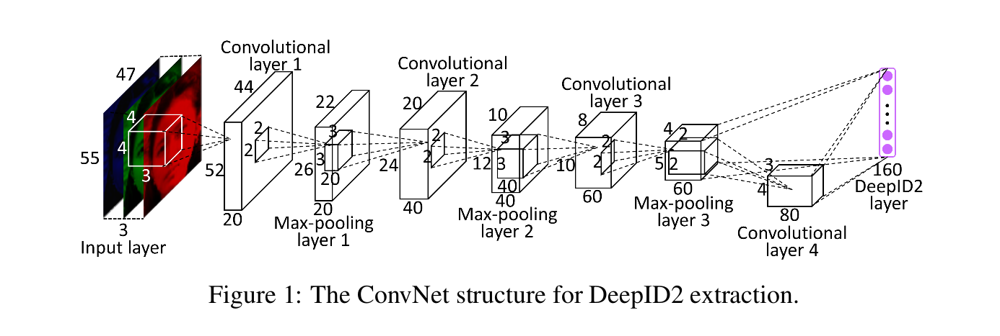
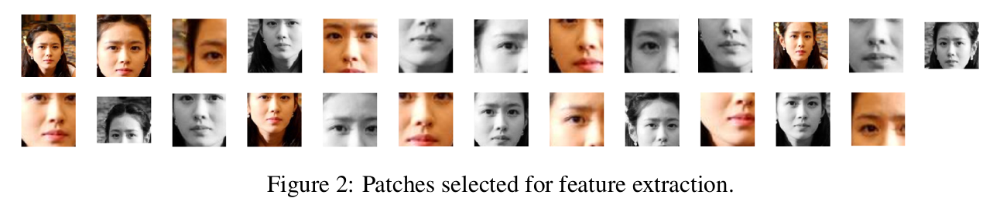
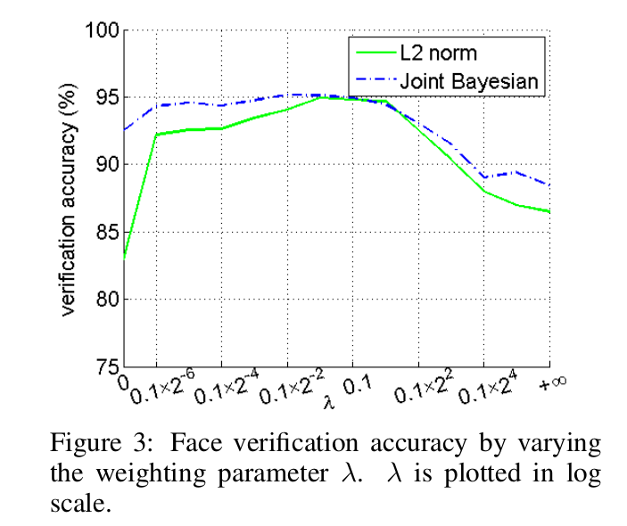
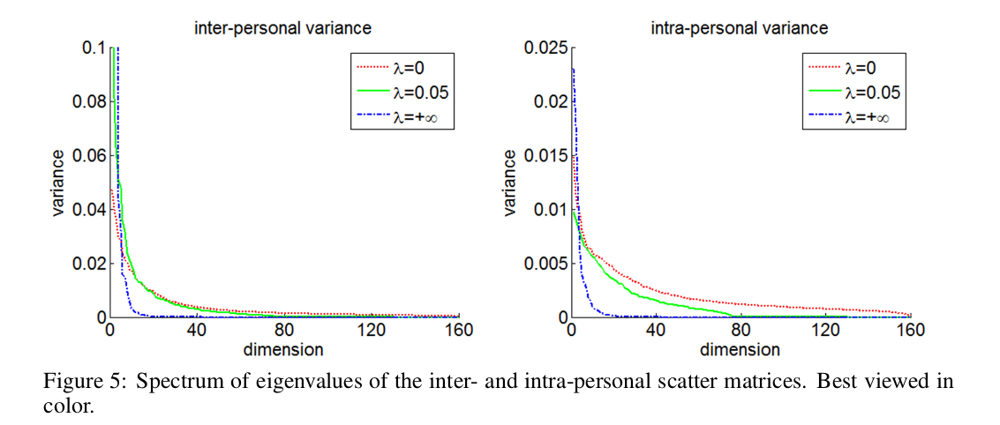
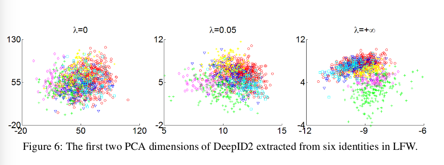
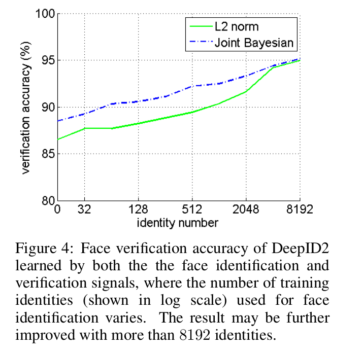
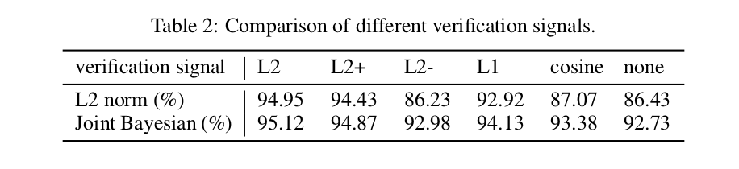
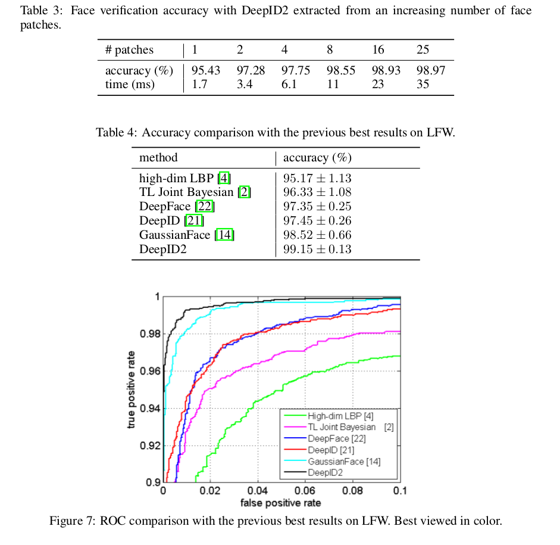

Deep learning face representation by joint identification-verification
=

# 1. Introduction
相同身份的人脸当以不同姿态、光照、表情、年龄和遮挡出现时，可能看起来非常不同。同一身份内的这种变化可能会压倒身份差异造成的变化，使人脸识别具有挑战性，尤其是在无约束条件下。因此，在扩大个体间差异的同时减少个体内的差异是人脸识别中一个永恒的话题。这可以追溯到早期的子空间人脸识别方法，如LDA [1]、Bayesian face[17]、统一子空间[23,24]。例如，LDA 通过使用两个线性子空间来估计个体间和个体内人脸的变化，并找出映射方向以最大化它们之间的比例。最近的研究也要么显示，要么因素地瞄准这个目标。例如，度量学习[6,9,15]将人脸映射到一些特征表示，使得相同身份的人脸相互接近，而不同身份的人脸仍然不同。然而，这些模型被它们的线性本质或浅层结构限制，同时个体间和个体内的变化是复杂、高度非线性以及在高维图像空间观察的。

这项工作中，我们展示深度学习提供了更加强力的工具来处理两种变化类型。由于其深度架构和大学习能力，通过层次的非线性映射可以学习有效的人脸识别特征。我们认为通过同时使用两种监督信号（即人脸识别和验证信号）学习如此特征是至关重要的，并称学习到的特征为 DeepIDentification-verification 特征（DeepID2）。识别为将输入图像分类为大量的身份类，而验证是将一对人脸分类为是否属于相同身份（即二值分类）。在训练阶段，给定具有识别识别信号的输入人脸图像，其 DeepID2 特征在学习的层次非线性特征表示的顶层隐含层提取，然后通过另一个函数 $g(\mbox{DeepID2})$ 映射到大量身份中的一个。在测试阶段，学习到的 DeepID2 特征可以泛化到其他任务（如人脸验证）以及训练数据中没有出现的新身份。由于身份监督信号必须被划分为不同的类别，因此，身份监督信号往往会导致不同身份之间的距离加深。因此，学习到的特征将具有丰富的身份相关或个体见变化。但是，由于不同的 DeepID2 可以通过函数 $g(\cdot)$ 映射到相同的身份，因此识别信号对同一身份提取的 DeepID2 的约束相对较弱。当 DeepID2 特征被推广到新的任务和测试中的新身份时，这就导致了 $g$ 不再适用的问题。我们通过使用一个额外的人脸验证信号来解决这个问题，其要求同相同的身份提取的每两个 DeepID2 向量相互接近，而不同身份提取的向量保持距离。DeepID2 的强每元素约束可以有效地减少个体内部的变异。另一方面，单独使用验证信号(即一次只识别一对DeepID2)在提取与身份相关的特征方面不如使用识别信号(即一次识别数千个身份)有效。因此，两种监督信号强调特征学习的不同方面，并且应该一起采用。

为了从不同的方面刻画人脸特征，从不同的人脸区域和分辨率中提取互补的DeepID2特征，并进行拼接以形成PCA降维后的最终特征表示。由于学习到的特征在不同的身份之间是多样的，而在相同的身份中是一致的，是接下来的人脸识别更加简单。使用学习到的特征表示和最近提出的人脸验证模型[3]，在具有挑战性和广泛研究的LFW数据集[11]上，我们实现了最高99.15%的人脸验证精度。这是第一次仅提供人脸区域的机器达到99.20%的人类准确率，并对整个LFW人脸图像(包括人脸区域和大背景区域)进行验证。

最近几年，针对深度学习的人脸识别已经做了大量的工作[5,10,20,27,8,22,21]。在深度学习工作中，[5,20,8]利用验证信号学习特征或深度指标，[22,21]利用识别信号学习特征，在LFW上达到约97.45%的准确率。我们的方法大大改进了最先进的技术。将分类与验证任务联合求解的思想应用于一般对象识别[16]中，重点提高对固定对象类的分类精度，而不是对隐藏特征表示的分类精度。我们的工作目标是学习能够很好推广到新类(身份)和验证任务中的特征，而训练集中身份的分类精度对我们来说并不重要。

# 2 Identification-verification guided deep feature learning
我们学习了深度卷积神经网络（deep ConvNets）[13]的变化特征。深度卷积网络中的卷积和池化操作是专门为从局部低层特征到全局高层特征分层提取视觉特征而设计的。我们的深度 ConvNets 与 [21] 中的结构相似。它包含四个卷积层，前三个卷积层后是 max-pooling 。为了学习不同数量的高级特性，我们不需要在更高卷积层[10]的整个特征图上共享权重。具体而言，我们的深度 ConvNets 的第三个卷积层中，神经元权重在每个 $2 \times 2$ 的局部区域局部共享。第 4 个卷积层中，其更近似地称为局部连接层（locally-connected layer），神经元之间的权重完全不共享。卷积神经网络在特征提取级联的最后一层提取一个 160 维的 DeepID2 向量。由于第 4 个卷积层比第 3 卷积层提取更全局的特征，所以 DeepID2 使用多尺度特征作为输入，形成称为多尺度卷积网络。我们为卷积层中的每个神经元使用修正线性单元（ReLU）。对于大型训练数据集，ReLU 比 Sigmoid 有更好的拟合能力。用于提取 DeepID2 的卷积网络结构如图 1 所示，给定大小为 $55 \times 47$ 的 RGB 输入。当输入区域的大小变化时，接下来层的图大小将立即变化。DeepID2 提取过程定义为 $f = \mbox{Conv}(x, \theta_c)$ ，其中 $\mbox{Conv}(\cdot)$ 是由卷积网络定义的特征提取函数，$x$ 为输入图像块，$f$ 为提取的 DeepID2 向量，而 $\theta_c$ 表示学习的卷积网络参数。

DeepID2 特征在两个监督信号下学习。第一个是人脸识别信号，其将每个人脸图像分类为 $n$ 个不同身份（例如 $n = 8192$）中的一个。在 DeepID2 层之后，使用 $n$ 路 softmax 层进行识别，输出 $n$ 个类的概率分布。网络被训练以最小化交叉上损失，其称为 identification 损失。其表示为

$$\mbox{Ident}(f,t,\theta_{id}) = -\sum_{i=1}^n p_i \log \hat{p}_i = -log \hat{p}_t \tag 1$$

其中 $f$ 为 DeepID2 向量，$t$ 为目标类，而 $\theta_{id}$ 表示 softmax 层参数。$p_i$ 为目标概率分布，其中，除目标类 $t$ 的 $p_t = 1$ 外，所有 $x$ 的 $p_i = 0$ 。$\hat{p}_i$ 为预测概率分布。为了同时准确地分类所有类，DeepID2 层必须形成辨别性的身份关联特征（即具有个体间变化的特征）。第二个是人脸验证信号，这就使得从相同人脸中提取的DeepID2具有相似性。验证信号直接正则化 DeepID2 ，并能有效地减小个体内部的变化。通常使用的约束包括 L1/L2 规范化和 Consine 相似度。我们基于 L2 规范化采用如下的损失函数，其最初被 Hadsell 等[7]提出以进行降维：

$$
\mbox{Verif}(f_i,f_j,y_{ij}, \theta_{ve}) =
\begin{cases}
\frac{1}{2} ||f_i - f_j||_ 2^2  & \mbox{if } y_{ij} = 1 , \\
\frac{1}{2} \max(0, m - ||f_i - f_j||)^2 & \mbox{if } y_{ij} = -1
\end{cases} \tag 2
$$

其中 $f_i$ 和 $f_j$ 为从对比的两个人脸图像中提取 DeepID2 向量。$y_{ij} = 1$ 意味着 $f_i$ 和 $f_j$ 来自相同的身份。在这种情况下，它最小化两个 DeepID2 向量之间的 L2 距离。$y_{ij} = -1$ 意味着不同的身份，公式（2）要求距离大于 margin $m$ 。$\theta_{ve} = \{m\}$ 为验证损失中学习到的参数。基于 L1 范数的损失函数与[16]有相似的公式。余弦相似度为：

$$\mbox{Verif}(f_i, f_j, y_{ij}, \theta_{ve}) = \frac{1}{2}(y_{ij} - \sigma(wd + b))^2 \tag 3$$

其中 $d = \frac{f_i \cdot f_j}{||f_i||_ 2 ||f_j||_ 2}$ 为 DeepID2 向量的余弦相似度，$\theta_{ve} = \{w, b\}$ 为可学习的缩放和平移参数，$\sigma$ 为 sigmoid 函数，$y_{ij}$ 为两个比较人脸图像是否属于相同身份的二值目标。所有三个损失在我们的试验中进行评估和比较。

我们的目标是学习特征提函数 $\mbox{Conv}(\cdot)$ 中的参数 $\theta_c$ ，而 $\theta_{id}$ 和 $\theta_{ve}$ 仅为训练期间引入传播识别和验证信号的参数。在测试阶段，仅 $\theta_c$ 用于特征提取。参数通过随机梯度下降更新。识别和验证梯度通过参数 $\lambda$ 加权。公式（2）中的 margin $m$ 是一个特例，其不同通过梯度下降更新，应为其梯度始终为负。相反，我们在训练期间自适应地更新 $m$ ，使得它是最近训练样本中的最低验证误差的阈值。我们的学习算法总结在表 1 中。

# 3 Face Verification
为了评估第 2 节中描述的特征学习算法。DeepID2 特征被嵌入到传统的人脸对齐、特征提取和人脸验证的人脸验证管道。我们首先使用最近提出的 SDM 算法[25]来检测 21 个人脸标志。然后根据检测到的标志通过相似度变换全局对齐人脸图像。我们剪裁 400 个人脸块，其更全局对齐的人脸和人脸标志的位置在位置、尺度、颜色通道和水平翻转上变化。因此，总共200个深度卷积网络提取 400 个 DeepID2 向量，每个深度卷积网络经过训练，分别提取每个人脸的一个特定贴片上的两个 160 维 DeepID2 向量及其水平翻转的对应人脸的 DeepID2 向量。

为了减小大量 DeepID2 特征中冗余，并是我们的系统实用，我们使用前向后向贪心算法[26]选取少量有效且互补的DeepID2向量(实验中为25个)，节省了测试过程中大部分的特征提取时间。图2所示为所选的25个patch，从中提取25个160维DeepID2向量，并连接到4000维DeepID2向量。4000 维向量进一步通过 PCA 压缩以进行人脸验证。

我们基于提取的 DeepID2 学习 Joint Bayesian 模型[3]以进行人脸验证。Joint Bayesian 已成功用于建模两个人脸是否属于同一个人的联合概率[3,4]。它将人脸的特征表示 $f$ 建模为个体间和个体内部变换之和，或者 $f = \mu + \epsilon$ ，其中 $\mu$ 和 $\epsilon$ 都建模为 Gaussian 分布，并由训练数据估计。人脸验证通过对数似率（ $\log \frac{P(f_1,f_2|H_{inter})}{P(f_1,f_2|H_{intra})}$ ）检验获得，其中分子和分母分别为个体间和个体内变化假设的两个人脸。

# 4 Experiments
我们在LFW数据集[11]上报告人脸验证结果，该数据集实际上是无约束条件下人脸验证的标准测试集。为了便于比较，算法通常报告LFW中给定的6000个人脸对的平均人脸验证精度和ROC曲线。虽然作为一个测试集是健全的，但对于训练来说是不够的，因为LFW中的大多数身份只有一个面孔图像。因此，我们依赖更大的外部数据集进行训练，就像最近所有高性能人脸验证算法所做的那样[4,2,22,21,14]。特别是，我们使用CelebFaces+数据集[21]进行培训，其中包含从互联网上收集的10177个名人的202599张面部图像。CelebFaces+和LFW中的人是相互排斥的。DeepID2特征从随机抽取的8192个CelebFaces+(称为CelebFaces+A)的人脸图像中学习，其余1985个人脸图像(称为CelebFaces+B)用于以下特征的选择和人脸验证模型的学习(Joint Bayesian)。当在 CelebFaces+A 上学习 DeepID2 时，CelebFaces+B 用作验证集以决定学习率、训练 epoch 和超参数 $\lambda$ 。之后，CelebFaces+B 被分为 1485 个身份的训练集和 500 个身份的验证集用于特征提取。最后，我们在完整的 CelebFaces+B 数据上训练 Joint Bayesian 模型，并在 LFW 上使用 Deep2 测试。我们首先利用单个深卷积网络从整个人脸区域提取DeepID2，对 4.1 ~ 4.3 节中特征学习的各个方面进行评估。然后构建最终的系统，并与4.4节中现有的最佳执行方法进行比较。

## 4.1 Balancing the identification and verification signals
我们调查识别和验证信号特征的交互学习，通过改变 $\lambda$ 从 0 到 $+\infty$ 。当 $\lambda = 0$ 时，验证信号消失，而仅识别信号有效。当 $\lambda$ 增加时，验证信号逐渐主导训练过程。在极端情况 $\lambda \rightarrow + \infty$ 时，仅验证信号保留。公式（2）中 L2 范数验证损失用于训练。图3分别通过将学习型DeepID2与L2范数和联合贝叶斯模型进行比较，得到了测试集的人脸验证精度。结果表明，无论是识别信号还是验证信号都不是学习特征的最优方法。相反，有效的特征是来自于两者的适当组合。

这种现象可以由个体间和个体内的变换的角度解释，其可通过 LDA 估计。根据 LDA ，个体见的散列矩阵（scatter matrix）为 $S_{inter} = \sum_{i=1}^c n_i \cdot (\bar{x}_i - \bar{x})(\bar{x}_i - \bar{x})^T$ ，其中 $\bar{x}_i$ 为第 $i$ 个身份的平均特征，$\bar{x}$ 为整个数据集的均值，$n_i$ 为第 $i$ 个身份的人脸图像的数量。个体内部的散列矩阵为 $S_{intra} = \sum_{i=1}^c\sum_{x\in D_i}(x - \bar{x}_i)(x-\bar{x}_i)^T$ ，其中 $D_i$ 为第 $i$ 个身份的特征集合，$\bar{x}_i$ 为相应的均值，$c$ 为不同身份的数量。个体间和个体内的方差是相应散列矩阵的特征值，如图 5 所示。相应的特征向量表示不同变化模式。特征方差的大小和多样性在识别中都很重要。如果所有的特征方差都集中在少量特征向量上，那么它表明个体间和个体内的变化是很低的。特征分别使用 $\lambda = 0, 0.05 \mbox{和 } + \infty$ 学习。每个给定 $\lambda$ 的特征方差通过相应的均值方差标准化。

当仅使用识别信号（$\lambda = 0$）时，学习到的特征包含个体间和个体内的变化，图两幅图中红色曲线的长尾所示。虽然不同个体间的变化有助于区别不同的身份，但是大而多样的个体内部的变化是噪声，并使人脸验证变得困难。当识别和验证信号都是使用适当的权重( $\lambda= 0.05$ )，个体间的多样性变化保持不变而变化在几个主要方向变得更大，如图中左边子图中的绿色曲线与红色曲线的比较。同时，个体内部的变换在多样性和度上都减小，如图中右子图的绿色曲线所示。因此，个体间和个体内的变化都在一个方向上改变使得人脸验证更加容易。当 $\lambda$ 进一步向无穷增加时，个体间和个体内的变化都只在几个主要方向上发生，没有识别信号，就不能形成多样化的特征。随着个体间变化的多样性降低，区别不同的身份变得困难。因此，性能衰减严重。

图 6 展示使用 $\lambda = 0, 0.05 \mbox{和} +\infty$ 学习的特征的两个 PCA 维度。这些特征来自LFW中人脸图像数量最多的6个身份，并且具有不同的颜色标记。此图进一步验证我们的观察。当 $\lambda = 0$ 时（左），不同的聚类簇由于个体内部的变化而混合，尽管簇中心实际上是不同的。当 $\lambda$ 增加到 0.05（中间）时，个体内部的变换显著减小，而簇变得可辨别。当 $\lambda$ 进一步增加到无穷时（右），金娟个体内部变化减小，但是簇中心也开始折叠，并且一些簇变得明显重叠（如图 6 右的红色、蓝色和青色），使它又难以区分。

## 4.2 Rich identity information improves feature learning
我们研究包含识别监督信号的身份信息是如何影响学习到的特征的。具体来说，我们的实验是将训练中用于识别的身份从32个成倍增加到8192个，而所有8192个训练身份一直在产生验证信号。由L2范数和联合贝叶斯得到的DeepID2在测试集上的验证精度随识别信号中使用的身份个数的变化情况如图4所示。它表明识别大量（例如8192）身份的关键是学习有效的 DeepID2 表示。这种观察与 4.1 节是一致的。增加的身份数量提供更加丰富的身份信息，并有助于形成具有多样个体间变化的 DeepID2 ，使不同身份的类中心更具辨别性。

## 4.3 Investigating the verification signal
如 4.1 节所示，中等强度的验证信号主要起到减小个体内部变异的作用。为了进一步验证这个结论，我们将所有样本对上的L2范数验证信号与仅约束正样本对或负样本对(分别表示为L2+和L2-)的范数验证信号进行比较。也就是说，L2+只会减小相同恒等式DeepID2之间的距离，而L2-只会增加不同恒等式DeepID2之间的距离，如果它们小于边值的话。利用L2范数和联合贝叶斯方法分别测量得到的DeepID2在测试集上的人脸验证精度如表2所示。并与L1范数和cos验证信号以及无验证信号(none)进行了比较。所有比较的标识信号都是相同的(对8192个标识进行分类)。

