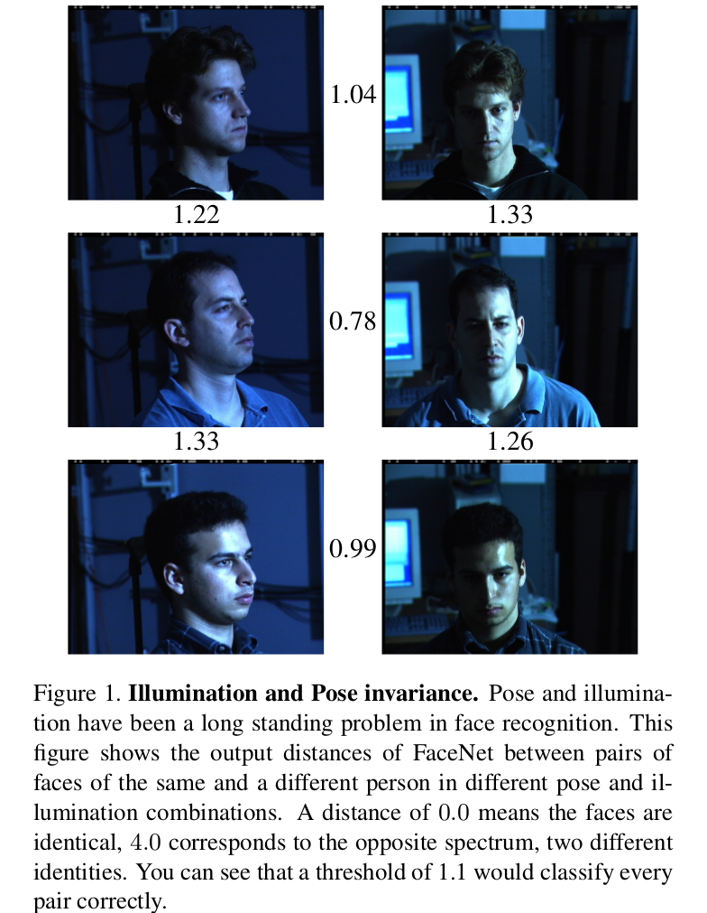
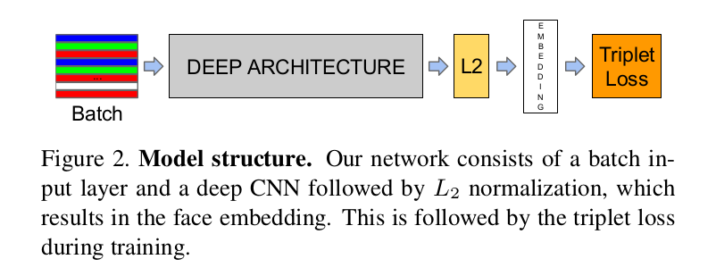
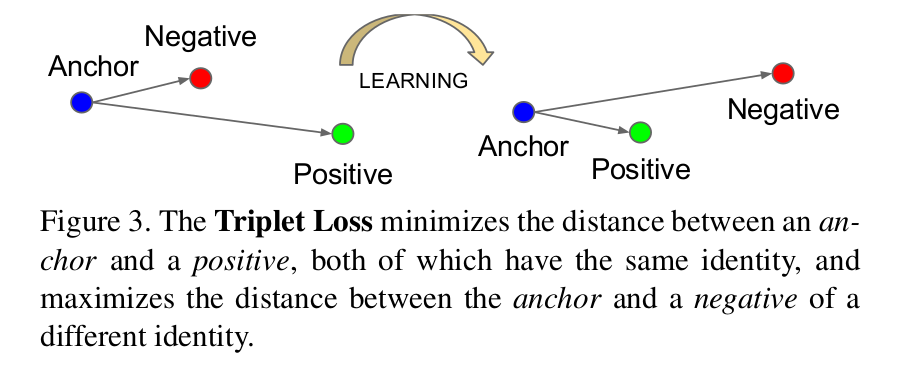
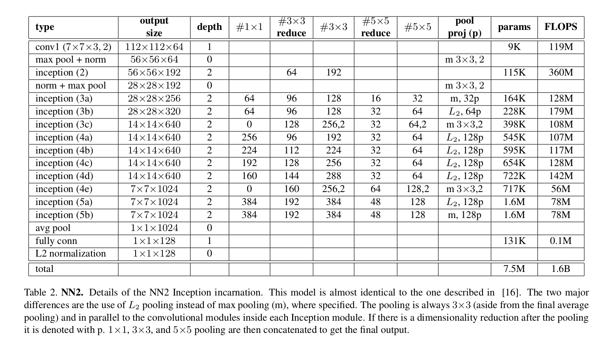

FaceNet: A Unified Embedding for Face Recognition and Clustering
=

# 1. Introduction
在本文中，我们提出了一个统一的人脸验证(这个人是同一个人吗)、识别(这个人是谁)和聚类(在这些人脸中找到普通人)的系统。我们的方法是基于使用深度卷积网络学习每幅图像的欧氏嵌入。对网络进行训练，使得嵌入空间中 L2 距离的平方直接对应于人脸相似性: 同一个人的脸距离较小，不同人的脸距离较大。

这种嵌入一旦产生，然后前面提到的任务变得直接： 人脸验证仅仅涉及对两个嵌入之间的距离进行阈值化；识别变成 k-NN 分类为题；而聚类可以使用现成的技术，如 k-means 或聚集聚类来实现。

以往基于深度网络的人脸识别方法都是使用经过一组已知人脸身份训练的分类层[15,17]，然后使用中间瓶颈层作为一种表示来泛化训练中使用的一组身份以外的识别。这种方法的缺点是它的间接性和低效率：人们必须希望瓶颈表示能够很好地推广到新的人脸；通过使用瓶颈层，每个人脸表示的大小通常非常大(有1000个维度)。最近的一些工作[15]使用主成分分析(PCA)降低了这个维度，但这是一个线性变换，可以很容易地在网络的一层学习。

与这些方法相比，FaceNet 直接使用基于 LMNN [19]的三元（triplet-based）损失函数将其输出训练为紧凑的 128-D 嵌入。我们的 triplet 由两个匹配的脸的缩略图和一个不匹配的脸的缩略图组成，损失的目的是在一定距离内将阳性对与阴性对分开。缩略图是人脸区域的紧密剪裁，除了缩放和平移，没有2D或3D对齐。

在学习[1]课程的启发下，我们提出了一种新颖的在线负样本挖掘策略，该策略保证了随着网络训练的进行，triplet 的学习难度不断增加。为了提高聚类准确率，我们也探索难正类挖掘技术（hard-positive mining），其鼓励单个人的嵌入的球形聚类。

我们的方法可以处理难以置信的可变性，如图1所示。所示为PIE[13]中的图像对，这些图像对以前被认为是人脸验证系统非常困难的。

# 2. Related Work
与最近其他使用深度网络的研究类似[15,17]，我们的方法是一种纯粹的数据驱动方法，直接从人脸像素中学习其表示。我们不是使用工程特征，而是使用一个大的有标签的人脸数据集来获得姿势、光照和其他变化条件下的适当不变性。

本文中，我们探索两种不同的深度网络架构，它们已被成功用于计算机视觉社区。两者都是深度卷积网络[8,11]。第一个架构是基于 Zeiler&Fergus[22] 模型，其由多个交错的卷积、非线性激活、局部响应标准化和最大池化层组成。为了受《Network in Network》的启发，添加额外几层 $1 \times 1 \times d$ 的卷积层。第二个架构是基于 Inception 模型。这些网络使用并行运行的几个不同的卷积和池化层以及将它们拼接的混合层。我们发现这种模型可以减小参数量 20 倍以上，并有在相当性能下减小 FLOPS 的潜力。

有大量的人脸验证和识别工作。回顾它超出了本文的范围，所以我们将只简要讨论最近最相关的工作。

[15,17,23]都采用多个阶段的复杂系统，它们将深度卷积网络与 PCA 集合以进行降维，并用 SVM 进行分类。

Zhenyao等人的[23]利用一个深度网络将人脸“扭曲”成一个典型的正面视图，然后学习CNN将每张脸分类为属于一个已知身份。为了进行人脸验证，将网络输出中的PCA与SVMs集合结合使用。

Taigman等人[17]提出了一种多阶段方法，将人脸对齐到一个通用的三维形状模型中。训练一个多类网络以在超过4000个身份上执行人脸识别。作者也实验了称为 siamese 的网络，其中然直接优化两个人脸之间的 $L_1$ 距离。它们在LFW(97.35%)上的最佳性能源于使用不同对齐和颜色通道的三个网络的集成。这些网络的预测距离（基于 $\chi^2$ 核的非线性 SVM 预测）使用一个非线性 SVM 组合。

Sun 等人[14,15]提出一种紧凑而相对便宜的计算网络。他们使用 25 个这种网络的集成，每个操作位于不同的人脸块上。为了在 LFW 上的最终性能（99.47%），作者结合了 50 个响应（规则和翻转）。采用主成分分析和有效对应嵌入空间线性变换的联合贝叶斯模型[2]，他们的模型不需要 2D/3D 对齐。网络通过使用分类和验证损失的组合进行训练。验证损失与我们采用的 triplet 损失相似，其中最小化相同人脸之间的 $L_2$ 距离，并迫使不同身份的脸之间的距离保持一定的距离（margin）。主要的区别是，只有对图像进行比较，而三元组损失鼓励了相对距离约束。

Wang等人在使用[18]对图像进行语义和视觉相似性排序时，也发现了类似的损失。

# 3. Method
FaceNet 使用一个深度卷积网络。我们讨论两种不同的核心架构：ZF 网络和 Inception 网络。这些网络的细节见 3.3 节。

考虑到模型的细节，并将其视为一个黑框(参见图2)，我们方法的最重要部分在于整个系统的端到端学习。为此，我们使用了三元组损失失，它直接反映了我们想在人脸验证、识别和聚类中实现的目标。即，我们争取一个从图像 $x$ 到特征空间 $\Bbb R^d$ 的嵌入 $f(x)$ ，使得所有人脸之间的平方距离，在独立成像条件下，相同身份之间的距离很小，而不同身份人脸对之间的平方距离很大。

尽管我们不直接与其他损失比较，例如使用正负对的损失（如[14]DeepID2中公式（2）使用的），我们详细 triplet 损失更适合人脸验证。DeepID2[14]中的损失的动机是鼓励一个身份的所有人脸被投影到嵌入空间的一个点上。然而，triplet 损失试图在从一个人到所有其他人脸之间的人连队上建立一个边界（margin）。这使得一个身份的脸可以位于一个流形（manifold）上，同时也加强了与其他身份的距离，从而提高了对其他身份的识别能力。

下一节描述 triplet 损失，以及如何在规模上有效地学习它。

## 3.1. Triplet Loss
该嵌入使用 $f(x) \in \Bbb R^d$ 表示。它将图像 $x$ 嵌入到 $d$ 维欧式空间。因此，我们将这个嵌入约束到 $d$ 为额超球面（hypersphere），即 $||f(x)||_ 2 = 1$ 。该损失受[19]中最近邻分类场景的启发。这里，我们希望确保，一个特定人的图像 $x_i^a (anchor)$ 更接近同一个人的所有其他图像 $x_i^p(positive)$ ，而不是任何其他人的任意图像 $x_i^n(negative)$ ，如图 3 所示。

因此，我们
$$
\begin{alignat}{2}
||x_i^a - x_i^p||_2^2 + \alpha &< ||x_i^a - x_i^n||_2^2, \\
& \forall(x_i^a,x_i^p,x_i^n)\in\cal T
\end{alignat}
$$

其中 $\alpha$ 为加在正类和负类对之间的边界。$\cal T$ 为训练集中所有可能的三元组集合，并有基 $N$ 。

然后，被最小化的损失为

$$L = \sum_i^N\left[||x_i^a - x_i^p||_ 2^2 - ||x_i^a - x_i^n||_ 2^2 + \alpha\right]_ + \tag 2$$

生成所有可能的三元组将产生许多容易满足的三元组(即满足式(1)中的约束)。这些三元组对训练没有帮助，收敛速度较慢，因为它们仍然会通过网络。关键是要选择活跃的而且可以对改进模型做出贡献的硬三元组（hard triplet）。下一节讨论我们使用的三元组选择的不同方法。

## 3.2. Triplet Selection
为了保证快速收敛，选择违反式(1)中三元组约束的三元组是至关重要的。这意味着，给定 $x_i^a$ ，我们需要选择 $x_i^p(hard positive)$ 使得 $\arg\max_{x_i^p} ||f(x_i^a) - f(x_i^p)||^2_2$ ，相似地选择 $x_i^n(hard negative)$ 使得 $\arg\min_{x_i^n}||f(x_i^a) - f(x_i^n)||_ 2^2$ 。

在整个训练集中计算argmin和argmax是不可行的。此外，它可能会导致糟糕的训练，因为贴错标签和成像不佳的人脸将主导硬正类和负类。有三种明显的选择来避免这个问题：

- 每 $n$ 步脱机生成三元组，使用最新的网络检查点并计算数据子集上的 argmin 和 argmax 。

- 在线生成三元组。这可以通过从一个小批处理中选择硬的正类/负类样本来实现。

在这里，我们将重点放在在线生成上，并按照数千个样本的顺序使用大型 mini-batch 处理，并且只计算 mini-batch 中的 argmin 和 argmax 。我们的实验中，我们采样训练数据使得每个身份在每个 mini-batch 中大约有 40 张人脸被选中。此外，添加随机采样的负样本到每个 mini-batch 。

我们不是选中最难的正类，而是使用 mini-batch 中的所有 anchor-positive 对，同时仍选中硬负样本。在小批量中，没有硬 anchor-positive 对与所有 anchor-positive 对的逐一比较，但是我们在实践中发现，所有 anchor-positive 方法在训练开始时更稳定，收敛速度更快。

我们还研究了离线生成三元组与在线生成三元组的结合，它可能允许使用更小的批大小，但实验是不确定的。

在实践中，选择最困难的负样本会在早期的训练中导致糟糕的局部极小值，特别是它会导致模型崩溃(即 $f (x) = 0$ )。为了处理这个问题，可以选择 $x_i^n$ 使得

$$||x_i^a - x_i^p||_ 2^2 < ||x_i^a - x_i^n||_ 2^2 \tag 3$$

我们成这种负样本为 $semi-hard$ ，因为它们离锚点的距离比正样本远，但仍然很难，因为平方距离接近 anchor-positive 距离。这些负样本位于边界 $\alpha$ 内部。

如前面所述，正确的三元组选择对快速收敛至关重要。一方面，我们想要使用小型的 mini-batch，因为这倾向于在 SGD 期间提高收敛。另一方面，实现细节使数十到数百样本的批量更加有效。然而，关于批大小的主要约束是我们从小批中选择硬相关三元组的方式。在大多数实验中，我们使用大约1800个样本的批大小。

## 3.3. Deep Convolutional Networks
在我们所有的实验中，我们使用标准的反向传播[8,11]和AdaGrad[5]对CNN进行随机梯度下降(SGD)训练。在大多数实验中，我们从0.05的学习率开始，然后降低这个学习率来完成模型。模型随机初始化，并在 CPU 集群上训练 1000 到 2000 小时。在500h的训练后，损失的减少(和准确性的提高)会急剧下降，但是额外的训练仍然可以显著提高性能。边界 $\alpha$ 设置为 0.2 。

我们使用了两种类型的体系结构，并在实验部分更详细地探讨了它们的优缺点。它们的实际区别在于参数和 FLOPS 的不同。最佳模型可能因应用的不同而不同。我们的所有模型使用修正线性单元作为非线性激活函数。

第一类（如表 1 所示）在 ZF 架构的标砖卷积之间添加 $1 \times 1 \times d$ 的卷积层（如[9]所建议），并产生 22 层深的模型。它共有 140 个百万的参数，并且每幅图像需要大约 1.6 个百万的 FLOPS。

第二个类使用的是基于 GoogLeNet 风格的 Inception 模型。该模型减少了大约 20 倍参数（6.6M-7.5M），减少 5 倍的 FLOPS （500N-1.6B）。这些模型中的一些在大小（深度和滤波器数量）上急剧减小，因此它们能够在移动电话上运行。NNS1 有 26M 参数，并且每幅图像仅需 220M FLOPS 。NNS2 有 4.3M 参数和 20M FLOPS 。表 2 描述详细描述了我们的最大网络 NN2 。NN3 有相同的架构，但是输入图像减小到 $160 \times 160$ 。NN4 输大小仅为 $96 \times 96$ ，因此极大地减小 CPU 的需求（285M FLOPS vs. NN2 的 1.6B ）。除了减少输入的大小，它在更高的层中不使用 $5 \times 5$ 的卷积，因为感受域到那时已经太小了。一般情况下，我们发现 $5\times5$ 的卷积在整个过程中都可以被删除，只需要稍微降低精确度。图4比较了我们所有的模型。

# 4. Datasets and Evaluation
我们在4个数据集上评估我们的方法，除了原生的 Labelled Faces 和YouTube Faces，我们在人脸验证任务上评估我们的方法。即，给定一对人脸图像，平方 $L_2$ 距离 $D(x_i, x_j)$ 用于确定相同和不同的分类。所有相同身份的人脸对 $(i, j)$ 用 $\cal P_{same}$ 表示，而所有不同身份的人脸对用 $\cal P_{diff}$ 表示。

我们定义所有 _true accepts_ 为

$$\mbox{TA} = \{(i, j) \in \cal{P}_{same}, \mbox{with } D(x_i, x_j) \le d\} \tag 4$$

这些是以阈值 $d$ 正确分类为相同的人脸对 $(i, j)$ 。相似地，

$$\mbox{FA} = \{(i, j) \in \cal{P}_{diff}, \mbox{with } D(x_i, x_j) \le d\} \tag 4$$

为错误分类为相同人脸（_flase accept_）的所有对的集合。

给定人脸距离 $d$ 的 validation rate  $\mbox{VAL}(d)$ 和 false accept rate $\mbox{FAR}(d)$ 我们定义为

$$\mbox{VAL}(d)=\frac{|\mbox{TA}(d)|}{|\cal{P}_{same}|}$$

和

$$\mbox{FAR}(d)=\frac{|\mbox{FA}(d)|}{|\cal{P}_{diff}|}$$ 
