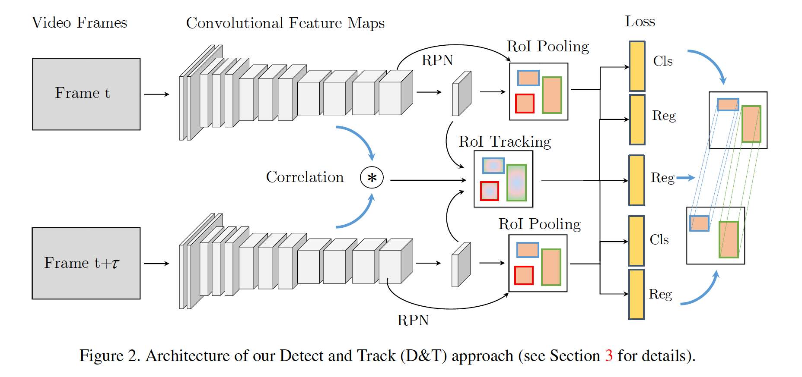
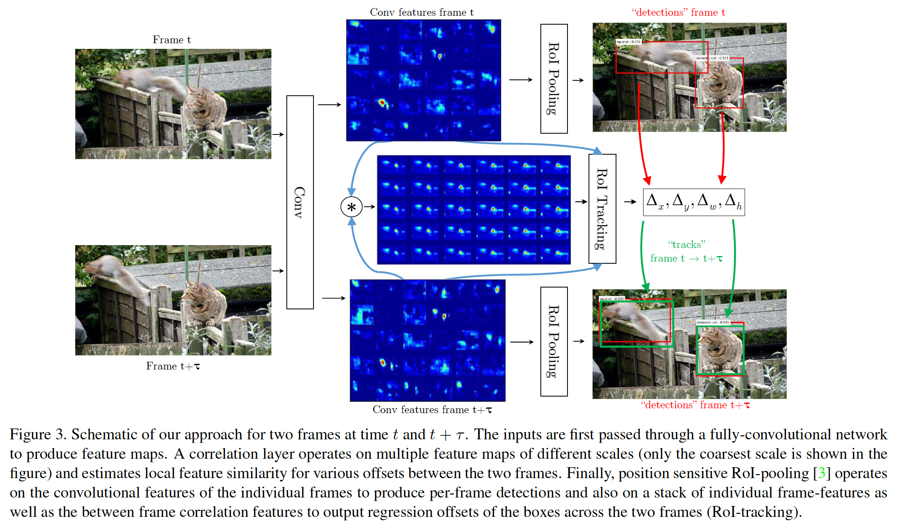
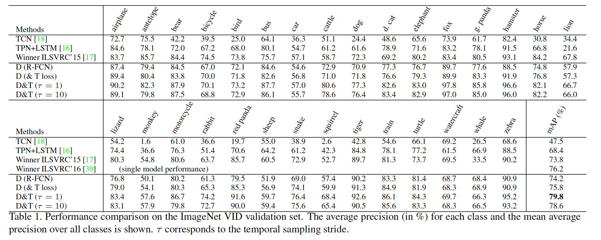

## Detect to Track and Track to Detect

### 摘要

​		用于视频中目标类别的高精度检测和跟踪的最新方法包括复杂的多个阶段解决方案，并且每年变得越来越麻烦。在本文中，我们提出了一个ConvNet架构，该架构可以联合执行检测和跟踪，以简单有效的方式解决任务。

​		我们的贡献有三个方面：（i）我们建立了一个ConvNet架构，用于同时检测和跟踪，使用基于帧的目标检测和跨帧轨道回归的多任务目标函数；（ii）我们引入了关联特征来表示跨时间的目标共现（co-occurrence），以在跟踪过程中帮助ConvNet；（iii）我们基于跨帧跟踪链接帧级别检测，以在视频级别产生高精度检测。我们用于时空目标检测的ConvNet架构是在大型ImageNet VID数据集上进行评估的，该数据集可实现最新的结果。与上一届ImageNet挑战赛的胜出方法相比，我们的方法可提供更好的单模型性能，并且在概念上更为简单。 最后，我们证明，通过增加时间跨度，我们可以大大提高跟踪器速度。

### 1. 引言

​		近年来，图像中的目标检测受到了广泛的关注，并取得了巨大的进步，这主要归功于深度卷积网络[12、19、21、36、37]及其基于区域的后代[3、9、10、31]的出现。在视频的目标检测和跟踪的案例中，最近的方法主要使用检测作为第一步，其次是后处理方法，例如应用跟踪器以传播随时间检测得分。“tracking by detection”范式的这种变化已经取得了令人瞩目的进展，但主要是帧级检测方法。

​		最近，视频中的目标检测引起了人们的关注，特别是自ImageNet [32]视频目标检测挑战（VID）引入以来。与ImageNet目标检测（DET）挑战不同，VID以图像序列显示目标，并带来额外挑战：（1）大小，视频提供的帧数非常庞大（VID拥有约130万张图像，而DET中约为400K或COCO中为100K [22]），（ii）运动模糊，快速相机或目标运动，（iii）质量，网络视频片段的质量通常比静态图像低，（iv）部分遮挡：由于目标/视角位置变化以及（v）姿态，视频中经常看到非常规的目标对摄像机姿势。在图1中，我们展示VID数据集的图像。

​		为了解决这个挑战性任务，ImageNet [32]视频检测挑战中的最新热门条目在帧级检测器的顶部使用了详尽的后处理。例如，ILSVRC15的优胜者[17]使用两个多阶段的Faster R-CNN[31]检测框架、上下文抑制、多尺度训练/测试、ConvNet跟踪器[38]、基于光流的得分传播和模型集成。

​		本文中，我们提出一种统一的方法来解决现实视频中的目标检测问题。我们的目标是通过同时使用ConvNet进行检测和跟踪来直接推断多帧上的“ tracklet”。为了达到这个目的，我们建议用跟踪公式扩展R-FCN [3]检测器，该公式受当前基于相关性和回归的跟踪器的启发[1，13，25]。我们使用基于检测和跟踪的损失端到端训练全卷积架构，并称我们的联合检测和跟踪的方法为D&T。网络的输入包含多帧，其首先传入ConvNet（例如ResNet-101[12]）以产生检测和跟踪任务共享的卷积特征。我们计算相邻特征响应之间的卷积互相关，从而估计不同特征尺度的局部位移。在特征之上，我们使用RoI池化层以分类与回归边界框提议以及回归跨帧边界框变换（平移、尺度和纵横比）的RoI跟踪层。最后，为了推断视频中的物体的long-term tube，我们基于轨迹来链接检测。

​		在大尺度ImageNet VID数据集上的评估表明，尽管概念上简单以及远远更快的速度，我们的方法能够获得比上一届LLSVRC16优胜者更好的单模型性能。此外，我们证明涉及跟踪损失可能改善特征学习，从而实现更好的静态目标检测，并且我们还提出了一种非常快的D＆T版本，该版本适用于时间跨度的输入帧。代码和模型见https://github.com/feichtenhofer/Detect-Track。

### 2. 相关工作

​		**目标检测**	当前流行的两族检测：基于区域提议的检测器，包括R-CNN、Fast R-CNN、Faster R-CNN和R-FCN；直接一步预测图像中边界框的检测器，例如YOLO和SSD。

​		我们的方法构建在R-FCN之上，R-FCN是一个简单而有效的框架，用于对具有全卷积性质的区域提议进行目标检测。在准确率方面，它与Faster R-CNN [31]竞争，后者使用按区域评估的多层网络（因此成本随着候选RoI的数量呈线性增长）。R-FCN通过引入位置敏感的RoI池化层（其在编码输入RoIs的空间下采样类得分的卷积特征上工作）来将区域操作推到网络的末端，从而降低了区域分类的成本。

​		**跟踪**	跟踪也是计算机视觉中一个被广泛研究的问题，其最新进展致力于在深层ConvNet特征上运行的跟踪器。在[26]中，在测试时微调ConvNet，以通过检测和边界框回归跟踪相同视频中的目标。在测试序列的样本上训练很慢，并且也不适用于目标检测的设置。其他方法使用预训练ConvNet特征来进行跟踪，并且通过相关性[1、25]或热图[38]或边界框[13]上的回归跟踪器，可以实现强大的性能。[13]中的回归跟踪器与我们的方法相关。它是基于Siamese卷积网络，可预测在上一张图像中心出现的目标在第二张图像中的位置。因为这个跟踪器预测边界框，而不仅仅是位置，它可以检测跟踪模板尺度和纵横比的变化。该方法的主要缺点是，它仅能处理单目标模板，并且它还依赖明显的数据增强来学习跟踪边界框所有可能的变换。[1]中的方法是相关跟踪器的一个案例，并启发我们的方法。这个跟踪器也使用全卷积Siamese网络，其以跟踪模板和搜索图像作为输入。来自最后的卷积层的卷积特征与发现相应图的中模板位置相关。许多相关跟踪器的缺点是，它们仅在单目标上工作，并不考虑目标尺度和纵横比的变化。

​		**视频目标检测**	动作检测也是一个相关的问题，近来受到越来越多的关注，主要是基于双流流ConvNets的方法[35]。[11]提出方法使用双流R-CNN来分类区域，并基于跨帧的动作预测及其空间重叠来连接它们。这种方法已被[33]和[27]所采用，其中R-CNN被Faster R-CNN取代，而RPN在外观和运动信息的两个流上运行。

​		一个感兴趣的领域是学习仅在弱监督的情况下检测和定位每帧（例如，视频共定位）。YouTube Object Dataset提出用于这个目的。

​		因为在ImageNet挑战中已引入视频任务中的目标检测，所以它获得大量关注。在[18]中，通过将跟踪器应用于基于帧的边框提议中，生成了tubelet提议。视频上的检测器得分由一维CNN模型重新评分。在他们相应的ILSVRC提交中，小组[17]根据帧之间的光流和对不在视频中top类别中的类别得分的抑制，将得分传播添加到附近的帧。最近的工作[16]引入了Tubelet提议网络，该网络在多个帧上回归静态目标提议，通过应用Faster R-CNN提取特征，最终由编码器-解码器LSTM处理。在深层特征流[40]中，识别ConvNet仅应用于关键帧，光流ConvNet用于通过流场将深层特征图传播到其余帧。 这种方法可以以很小的精度成本将检测速度提高5倍。该方法容易出错，主要是由于两个方面：第一，从关键帧到当前帧的传播可能是错误的；第二，关键中可能丢失当前帧的特征。最近，已经引入了用于视频目标检测的新的大规模数据集[29]，并在视频序列上添加了单个目标标注。

### 3. D&T方法

​		本节中，我们首先给出Detect and Track（D&T）方法的概貌（3.1节），该方法在给定两个（或更多）帧作为输入的情况下生成轨迹。然后，我们给出详细介绍，从R-FCN检测器基线开始（3.2节），并公式化跨帧边界框回归的目标函数（3.3节）；最后，我们介绍帮助网络跟踪过程的相关特征。

#### 3.1. D&T 概貌

​		我们旨在联合检测和跟踪（D&T）视频中的目标。图2展示了我们的D&T的架构。我们基于R-FCN [3]对象检测框架进行构建，该框架是全卷积以进行区域分类和回归，并将其扩展为多帧检测和跟踪。给定两幅高分辨率输入帧的集合，我们架构首先计算卷积特征图（例如ResNet-101特征），该特征图在检测和跟踪任务上共享。RPN用于根据预定义的候选框（即“ anchors” [31]）的存在可能性在每个帧中建议候选区域。基于这些区域，采用RoI池化来聚合中间卷积层产生的位置敏感得分和响应图，从而分别分类边界框与精炼它们的坐标（回归）。

​		我们引入一个回归期来扩展这个架构，这个回归器采用来自两帧（）的中间位置敏感回归图作为RoI跟踪操作的输入，RoI跟踪操作输出一帧到另一帧的边界框变换。因此，通过在同一提议区域中池化两帧中的特征，即可简单地实现帧之间的对应关系。我们通过利用跟踪损失扩展R-FCN的多任务目标函数来训练RoU跟踪任务，这个跟踪损失回归跨帧的目标坐标。我们的跟踪损失对groun-truth目标进行操作，并评估预测跟踪和ground-truth真实跟踪的坐标之间的soft L1范数[9]。

​		如此的跟踪形式可以视为[13]中的单目标跟踪器的多目标扩展，[13]训练卷积网络来从两针的特征上推断目标边界框。如此方法的一个缺点是，它没有利用平移等价，这意味着跟踪器必须从训练数据中学习所有可能的平移。因此，这样的跟踪器需要在训练期间使用额外的数据增强（人工缩放和平移边界框）。

​		基于相关滤波[2、4、14]的跟踪表示可以利用平移等价，因为相关与平移等价。最近的相关跟踪器[1、25]通常在高级卷积特征上运行，并计算跟踪模板与搜索图像（或者前一帧跟踪位置附近的局部区域）之间的互相关。得到的相关图测量了模板和搜索图像在水平和垂直方向上的所有圆形移动的相似性。因此，通过提取相关响应图的最大值，可以发现目标物体的位移。

​		与典型的在单个目标上工作的相关跟踪器不同，我们旨在同时跟踪多个目标。我们计算特征中所有位置的相关图，并让RoI跟踪在这些特征图上进行操作，以便更好地跟踪回归。我们的架构能够端到端训练，以视频中的帧作为输入，并产生目标检测及其跟踪。下一节将描述如何构建用于端到端学习目标检测和跟踪的架构。

#### 3.2. R-FCN中的目标检测和跟踪

​		我们的架构获取时间$t$时的帧$\mathbf{I}^t \in \mathbb{R}^{H_0 \times W_0 \times 3}$，并将其输入骨干ConvNet（即ResNet-101）以获得特征图$\mathbf{x}_l^t \in \mathbb{R}^{H_l \times W_l \times D_l}$，其中$W_l$、$H_l$和$D_l$为层$l$中对应的特征图的宽、高和通道数。在R-FCN[3]中，我们将最后卷积的有效步长从32个像素减小到16个像素，这通过将Conv5块的步长修改为单位空间步长，并且还利用膨胀卷积增加感受野。

​		我们的整个系统基于R-FCN [3]目标检测器，该检测器分两个阶段工作：第一，它使用RPN提取候选RoI；第二，它使用位置敏感RoI池化层将区域分类到不同的目标类别和背景。RoI池化层的输入来自一个具有输出$\mathbf{x}^t_{cls}$的额外卷积层，其在ResNet的最后一个卷积层上运行[12]。该层产生$D_{cls} = k^2(C+1)$的位置敏感得分图，该图对应于$k \times k$ 空间网格，该网格描述了在RoI池化操作中针对$C$个类别和背景中的每一个使用的相对位置。将softmax函数用于输出产生每个RoI的$C+1$个类的概率分布$p$。在第二个分支中，R-FCN在最后一个卷积层之后放置一个具有输出$x^t_{reg}$的兄弟卷积层，以进行边界框回归，再次对这组$D_{cls} = 4k^2$图执行位置敏感的RoI池操作，以进行类无关的边界框$b=(b_x, b_y, b_w, b_h)$的边界框预测 。

​		现在，我们考虑一对在时间$t$和$t+\tau$时的帧$\mathbf{I}^t, \mathbf{I}^{t+\tau}$，作为网络的输入。我们引入帧间边界框回归层，其在边界框回归特征的拼接（concatenation）$\{\mathbf{x}_{reg}^t, \mathbf{x}_{reg}^{t+\tau}\}$上进行位置敏感RoI池化，从而预测$t$到$t+\tau$的RoI的变换$\Delta^{t+\tau}=(\Delta_x^{t+\tau}, \Delta_y^{t+\tau}, \Delta_w^{t+\tau}, \Delta_h^{t+\tau})$。边界框回归器也使用的相关特征，在3.4节中进行了描述。 图3展示了这种方法。

#### 3.3. 多人检测和跟踪目标函数

​		为了学习这个回归器，我们扩展Fast R-CNN的多任务损失，该损失包含分类损失$L_{cls}$和回归损失$L_{reg}$，以及对跨越两帧的跟踪评分的额外项$L_{reg}$。对于单次迭代和$N$个RoI的批，网络预测softmax概率$\{p_i\}_{i=1}^N$、回归偏移$\{b_i\}_{i=1}^N$和跨帧的RoI跟踪$\{\Delta_i^{t+\tau}\}_{i=1}^{N_{tra}}$。我们的目标函数为：

$$\begin{align} L(\{p_i\}, \{b_i\}, \Delta_i) &=\frac{1}{N}\sum_{i=1}^N L_{cls}(p_i, c^{\ast}) \\ &+\lambda\frac{1}{N_{fg}}\sum_{i=1}^N[c_i^{\ast} > 0]L_{reg}(b_i, b_i^\ast) \\ &+\lambda\frac{1}{N_{tra}}\sum_{i=1}^{N_{tra}}L_{tra}(\Delta_i^{t+\tau}, \Delta_i^{\ast,t+\tau}). \end{align} \tag{1}$$

RoI的ground-truth类标签定义为$c_i^\ast$，并且其预测softmax得分为$p_{i,c^\ast}$。$b_i^\ast$为ground-truth回归目标，$\Delta_i^{\ast,t+\tau}$为跟踪回归目标。对于前景RoU，指示器函数$[c_i^\ast  > 0]$为1，对于背景RoI（$c_i^\ast = 0$），其为0。$L_{cls}(p_i, c^\ast) = -\log(p_{i,c^\ast})$为边界框分类的交叉熵损失，$L_{reg} \& L_{tra}$定义为[9]中的smooth L1函数的边界框和跟踪回归损失。平衡参数设置为[3、9]的$\lambda=1$。RoI到ground-truth的分配如下：如果RoI预ground-truth重叠大于等于0.5，那么分配类标签$c^\ast$和$b^\ast$，而仅给跟踪目标$\Delta^{\ast,t+\tau}$分配两帧中都出现的ground-truth目标。因此，对于训练batch中所有$N$个边界框，（1）中的第一项是激活的；对于$B_{bf}$个前景RoI，第二项是激活的；对于跨越两帧的跟踪相关的$N_{tra}$个ground-truth RoI，最后一项是激活的。

​		对于跟踪回归，我们使用R-CNN的边界框回归参数化[9、10、31]。对于单个目标，在帧$t$中有ground-truth边界框坐标$B^t = (B_x^t, B_y^t, B_w^t, B_h^t)$，相似地，帧$t+\tau$中也有$B^{t + \tau}$，表示水平和垂直坐标及其宽高。然后，目标$\Delta^{\ast,t+\tau}=\{\Delta_x^{\ast,t+\tau}, \Delta_y^{\ast,t+\tau}, \Delta_w^{\ast,t+\tau}, \Delta_h^{\ast,t+\tau}\}$为

$$\begin{align}\Delta_x^{\ast, t+\tau} &= \frac{B_x^{t +\tau} - B_x^t}{B_w^t} & \Delta_y^{\ast, t+\tau} &= \frac{B_y^{t+\tau} - B_y^t}{B_h^t} \tag{1} \\ \Delta_w^{\ast, t+\tau} &= \log(\frac{B_w^{t +\tau}}{B_w^t}) & \Delta_h^{\ast, t+\tau} &= \log(\frac{B_h^{t+\tau}}{B_h^t}) \tag{2}\end{align}$$

#### 3.4. 目标跟踪的相关特征

​		与典型的单目标模板上的相关跟踪器不同，我们旨在同时跟踪多个目标。我们在特征图上的所有位置为跟踪回归计算相关图。我们为特征图上的所有位置计算相关图，并令RoI池化材这些特征图上运行以进行跟踪回归。考虑到特征图中所有可能的圆形移位，将导致较大的输出维数，并且还会对太大的位移产生响应。因此，我们将相关限制到局部领域。这种思想最初在[5]中用于光流估计，其中引入了一个相关层，以帮助ConvNet匹配帧之间的特征点。相关层执行两个特征图$x_l^t, x_l^{t+\tau}$之间的逐点特征比较：

$$\mathbf{x}_{corr}^{t,t+\tau}(i,j,p,q)=\langle\mathbf{x}_l^t(i, j), \mathbf{x}_l^{t+\tau}(i+p, j+q)\rangle \tag{4}$$

其中$-d \le p \le d$ 和 $-d \le q \le d$ 是偏移量，用于比较由最大位移 $d$ 定义的特征图中位置 $i,j$ 周围的正方形邻域中的特征。因此，相关层的输出是大小为$\mathbf{x}_{corr}\in\mathbb{R}^{H_l \times W_l \times (2d + 1) \times (2d+1)}$。式（4）可以视为由 $d$ 定义的局部正方形窗口中的两个特征图的相关。我们计算conv3、conv4和conv5层的特征的局部相关性（我们在 $i，j$ 中使用2的步幅以在conv3相关中具有相同的大小）。我们在图4中展示了两个样本序列的这些特征。

​		为了将这些特征用于跟踪回归，我们可以通过将RoI池与第3.2节$\{\mathbf{x}_{corr}^{t,t +\tau},\mathbf{x}_{reg}^t, \mathbf{x}_{reg}^{t+\tau}\}$中的边界框功能堆叠在一起来对它们进行操作。

### 4. Linking tracklets to object tubes

​		高准确率目标检测的一个缺点是必须处理高分辨率输入图像，这对（深度）架构可以在一次迭代中处理的帧数施加了严格的限制（由于GPU硬件中的内存限制）。因此，不得不作出帧数与检测准确率之间的平衡。因为视频拥有大量冗余信息，并且目标通常在时间上平滑移动，所以我们可以使用我们的帧内跟踪来连接时间上的检测，并构建长期目标tube。为此，我们采用动作定位[11、27、33]中已建立的技术，该技术用于将时变检测链接到tube。

​		考虑到时间$t$时帧的类检测$D_i^{t,c}=\{x_i^t,y_i^t,w_i^t,h_i^t,p_{i,c}^t\}$，其中$D_i^{t,c}$是由$i$索引、宽为$w_i^t$与高为$h_i^t$的中心位于$(x_i^t,y_i^t)$的边界框，$p_{i,c}^t$为类 $c$ 的softmax概率。相似地，我们还有跟踪$T_i^{t,t+\tau}=\{x_i^t,y_i^t,w_i^t,h_i^t;x_i^t + \Delta_x^{t+\tau},y_i^t + \Delta_y^{t+\tau},w_i^t + \Delta_w^{t+\tau},h_i^t+\Delta_h^{t+\tau}\}$，其描述帧 $t$ 到 $t+\tau$ 的边界框变换。现在，我们可以定义一个逐类链接得分，其跨时间结合检测和跟踪：

$$s_c(D_{i,c}^t, D_{j,c}^{t+\tau}, T^{t,t+\tau}) = p_{i,c}^t + p_{j,c}^{t+\tau}+\psi(D_i^t,D_j,T^{t,t+\tau}) \tag{5}$$

其中逐对得分为

$$\psi(D_{i,c}^t, D_{j,c}^{t+\tau}, T^{t,t+\tau})=\begin{cases}1, & \mbox{ if } D_i^t, D_j^{t+\tau} \in T^{t,t+\tau} \\ 0, &\mbox{otherwise}.\end{cases} \tag{6}$$

这里，如果跟踪对应关系$T^{t,t+\tau}$与检测框$D_i^t,D_j^{t+\tau}$的IoU重叠大于0.5，则逐对$\psi$等于1。这是必要条件，因为跟踪回归器的输出没有必要与边界框回归器完全匹配。

​		然后，可以通过在视频持续时间$\mathcal{T}$内最大化得分来找到视频的最佳路径[11]：

$$\bar{D}_c^\star = \arg\max_{\bar{D}}\frac{1}{\mathcal{T}}\sum_{t=1}^{\mathcal{T}-\tau}s_c(D^t,D^{t+\tau}, T^{t,t+\tau}).\tag{7}$$

式（7）可以使用Viterbi算法[11]有效解决。一旦发现最优的$\bar{D}_c^\star$，从该组区域中删除与该tube相对应的检测，然后将（7）再次应用于其余区域。

​		在发现一个视频的类特定的tube $\bar{D}_c$ 之后，我们通过将tube中$\alpha=50%$的最高得分均值相加来重新加权该tube中的所有检测得分。我们发现总体性能对该参数具有很大的鲁棒性，当 $10％ \le \alpha \le 100％$ 中变化时，mAP变化小于0.5％。我们基于tube的简单重新加权旨在提高检测器发生故障的正类边界框的分数。使用tube的最高分数进行重新加权是一种非最大抑制的形式。它也受到Canny边缘检测器中的磁滞跟踪的启发。我们的重新加权假设检测器最多在半个tube内失效，并提高了跟踪器的鲁棒性，尽管性能对所选比例（$\alpha$）并不敏感。请注意，我们的方法将tube强制跨越整个视频，并且为简单起见，我们没有及时修剪任何检测。删除沿tube分数较低的检测结果（例如[27、33]）可以明显改善结果，但我们将其留待以后的工作。 在以下部分中，我们的方法将应用于视频对象检测任务。

### 5. 实验

#### 5.1. 数据集采样和验证

​		我们在ImageNet VID上评估我们的方法，该数据集包含30个类、3862个训练视频和555个验证视频。视频中的目标有ground-truth边界框和跟踪ID。因为测试集上的ground-truth没有公布，所以我们在验证集上评估30个类的mAP。

​		ImageNet VID上的30个目标类别是ImageNet DET数据集上200个类的子集。因此，我们遵循先前的方法[16、17、18、40]，并在ImageNet VID和DET集（仅使用来自30个 VID类的数据）的交集上训练检测器。由于DET集包含每个类别的样本数量很大的变化，因此我们从DET中每个类别最多采样2k张图像。我们还通过每个视频仅使用10帧来对VID训练集进行二次采样。 二次采样可降低DET中主要类别的影响（例如DET训练集中有56K图像用于狗类）和VID训练集中非常长的视频序列。

#### 5.2. 训练和测试

**RPN**	我们将两个兄弟卷积层附加到步长缩减的ResNet-101，从而在15个anchor（5个尺度和3个纵横比）上进行提议分类和边界框回归。正如[31]中所示，我们还从5个尺度中提取提议，并应用具有IoU阈值为0.7的NMS来选择每帧中的前300个提议进行R-FCN检测的训练和测试。我们发现在完整的ImageNet DET上预训练以增加召回率；因此，我们的RPN首先在ImageNet DET的200个类上预训练，然后在仅有30个类的ImageNet DET和VID的交集上微调。我们的每幅图像的300个提议在ImageNet VID验证集上获得96.5%的召回率。

**R-FCN**	我们的R-FCN检测器的训练与[3、40]相似。我们使用conv5中具有膨胀卷积的步长缩减的ResNet-101以及OHEM。将随机初始化的$3\times3$、膨胀率为6的卷积附加到conv5上以降特征维度减小到512[40]（原始的R-FCN中，是没有膨胀率的$1\times1$卷积层，并输出1024维）。对于目标检测和边界框回归，两个兄弟$1\times1$卷尺提高$D_{cls}=k^2(C+1)$和$D_{reg} = 4k^2$输入到位置敏感RoI池化层。我们使用$k\times k = 7 \times 7$空间网格以编码如[3]的相关位置。

​		在训练和测试时，我们使用短边为600个像素的单尺度图像。在SGD训练中，我们使用的batch size为4，以及60K迭代中使用的学习为$10^{-3}$，接着20K迭代中使用的学习率为$10^{-4}$。对于测试，我们应用IoU阈值为0.3的NMS。

**D & T**	为了训练我们的D＆T架构，我们从上面的R-FCN模型开始，然后在整个ImageNet VID训练集上对其进行进一步微调，并在每次迭代中从不同的视频中随机采样一组两个相邻帧。在彼此的迭代中，我们还从ImageNet DET训练集中进行采样，以避免将我们的模型偏向VID训练集中。从DET集采样时，由于没有可用序列，我们通过网络发送相同的两个帧。除了不会忘记DET训练集中的图像之外，这还有一个额外的有益效果：让我们的模型更喜欢小运动而不是大运动（例如[13]中的跟踪器从均值为零的Laplacian分布中采样运动增强偏向小位移的回归跟踪器）。我们的相关特征（4）在具有最大位移$d=8$的conv3、conv4和conv5，而在 $i,j$上步长2用于计算conv3相关。对于训练，我们在前40K迭代中使用的学习率为$10^{-4}$，后20K中使用的学习率为$10^{-5}$，batch_size 为4。测试期间，我们的架构用于时间步长为$\tau$的序列，预测检测 $D$ 和它们之间的跟踪 $T$ 。对于目标中心跟踪，我们使用回归得到的帧边界框作为RoI跟踪层的输入。我们在跟踪链接步骤之前使用边界框投票[8]执行非极大抑制，以将每个图像和每个类别的检测次数减少到25。然后在等式（7）中使用这些检测来提取tube和相应的检测框将按照第4节中介绍的重新加权进行评估。

#### 5.3. 结果

​	