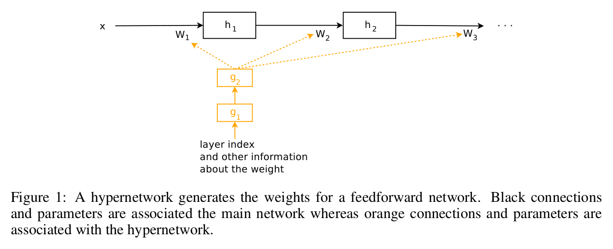

HyperNetworks
=

# 1 Introduction
在这项工作中，我们考虑使用一个小网络（称为“hypernetwork”）来生成大网络（称为主网络（main network））权重的方法。主网络的行为与一般神经网络相同: 它学习将一些原始输入映射到它们所期望的目标的过程，而 hypernetwork 采用一组包含权重结构信息的输入，并为该层生成权重(参见图1)。

HypertHEAT （Stanley等，2009）是 hypernetwork 的一个例子，其中输入是主网络中每个权重的一组虚拟坐标。在这项工作中，我们将重点介绍一种更强大的方法，其中输入是一个描述给定层的所有权重的嵌入向量。我们的嵌入向量可以是固定的参数，这些参数也可以在端到端训练中学习到，允许在一个层内和主网络的各个层之间进行近似的权重共享。此外我们，我们的嵌入向量可以由我们的 hypernetwork 动态地生成，允许循环网络的权值随时间步长而变化，并适应输入序列。

我们通过实验研究了 hypernetwork 在一定情境下的行为，发现 hypernetwork 可以很好地与批归一化和层归一化等技术相结合。我们的主要结果是，hypernetwork 可以为 LSTM 生成非共享的权重，其比标准的 LSTM 版本更好。在Character Penn Treebank 、 Hutter Prize Wikipedia数据集的语言建模任务中，LSTM 的 hypernetwork 接近历史最佳结果。在 IAM handwriting Dataset 的手写生成任务中，LSTM的 hypernetwork 具有较高的定量和定性结果。在 CIFAR-10 图像分类任务中，当 hypernetwork 用于生成深度卷积网络的权重时，获得与历史最佳模型相比可接受的结果，同时有更少的参数。此外，对于简单的任务，我们证明LSTM的 hypernetwork 为大型的、生产级的神经机器翻译模型提供了性能提升。

# 2 Motivation and Related Work
我们的方法是受到进化计算方法的启发，在进化计算中，很难在包含数百万权重参数的大搜索空间中直接操作。一种更有效的方法是进化一个更小的网络来为一个更大的网络生成权重结构，这样搜索就被限制在更小的权重空间内。这种方法的一个实例是 HyperHEAT 框架中的工作。在 HyperHEAT 框架中，Compositional Pattern-Producing Networks（CPPNs）是用来定义更大的主网络的权重结构的。与我们工作紧密相关的是一个简化的 HyperHEAT 变体，其中结构是固定的，权重是通过离散余弦变换(Discrete Cosine Transformer： DCT)演化出来的，称为压缩权重搜索（Compressed Weight Search）。与我们的方法更密切相关的是可微模式产生网络(Differentiable Pattern Producing ：DPPNs)，其中结构是进化的，但权重是学习的 (Fernando et al.， 2016)， 以及 ACDC-Networks (Moczulski et al.， 2015)，其中线性层是用DCT压缩的，参数是学习的。

然而，多数使用这些方法报告的结果处于较小的尺度，也许是因为它们训练都很慢，而且需要启发式才能有效。我们的方法和 HyperHEAD 之间的差异是，hypernetwork 与 主网络使用梯度下降端到端的训练，所以更加有效。

除了端到端学习之外，在模型灵活性和训练简洁性方面，我们的方法在压缩权重搜索和HyperNEAT之间取得了很好的平衡。首先，我们认为在 Compressed Weight Search 中使用的 Discrete Consine Transform 可能太简单，并且使用 DCT 对于多数模型是不合适的。其次，虽然 HyperHEAD 更佳哦灵活，但是，在HyperNEAT中，对架构和权重进行改进对于大多数实际问题来说都是一种 overkill 的做法。

甚至在 HyperHEAD 和 DCT 之前的工作，Schmidhuber 提出了快速权重的概念，其中一个网络可以为另一个网络产生上下文相关的权重变化。在当时，为了证明前馈网络的快速权重，进行了小规模的实验，但可能由于缺乏现代计算工具，循环神经网络版本主要被提到作为一个思想实验(Schmidhuber, 1993)。随后的一项工作展示了快速权重的实际应用(Gomez & Schmidhuber, 2005)，通过进化学习生成器网络来解决人工控制问题。一个网络与另一个网络交互的概率是（Jaderberg等，2016；Andrychowicz等，2016）的中心思想，特别是（Denil等，2013；Yang等，2015；Bertinetto等，2016；De Brabandere等，2016），其中卷积网络中的特定参数被另一个网络预测。然而，这些研究没有探索这些方法对循环网络的使用，这是我们工作的主要贡献。

本工作的重点是通过将层嵌入向量作为输入，生成卷积网络和循环网络等实际架构的权值。然而，我们的 hypernetwork 也可以通过将坐标信息作为类似于 DPPN 的输入，为全连接的网络生成权重。使用这个设置，hypernetwork 可以近似地恢复卷积结构，而不需要明确地被告知要这样做，类似的结果由“进化卷积”得到。这个结果在附录A.1中描述。

# 3 Methods
在本文中，我们将卷积网络和循环网络视为频谱的两端。一端，递归网络可以看作是各层之间的权重共享，由于梯度的消失，使得递归网络变得不灵活，难以学习。另一端，卷积网络具有不共享权重的灵活性，但在网络较深的情况下会有冗余的参数。Hypernetwork 可以视为一种松弛权重共享的形式，因此可以处理两端之间的平衡。有关静态和动态超网络的概念图，请参见附录A.2。

## 3.1 Static Hypernetwork： A Weight Factorization Approach for Deep Convolutional Networks
首先，我们将描述如何构造一个 hypernetwork 来生成前馈卷积网络的权值。在典型的深度卷积网络中，多数模型参数位于卷积层的核中。每个核包含 $N_{in} \times N_{out}$ 的滤波器，而每个滤波器维度为 $f_{size} \times f_{size}$ 。假设这些参数存储在一个矩阵 $K^j \in \Bbb R^{N_{in} f_{size} \times N_{out}f_{size}}$ ，其中 $j=1,\cdots, D$ ， $D$ 为主卷积网络的深度。对于每层 $j$ ，hypernetwork 接收一个层嵌入 $z^j \in \Bbb R^{N_z}$ 作为输入，并预测 $K^j$ ，其通常写为如下形式：

$$K^j = g(z^j), \forall j =1, \cdots, D \tag 1$$

我们注意到，这个矩阵 $K^j$ 可以分解为 $N$ 片具有维度为 $f_{size} \times N_{out} f_{size}$ 较小的矩，每个片的核表示为 $H_i^j \in \Bbb R^{f_{size} \times N_{out}f_{size}}$ 。因此，在我们的方法中，hypernetwork 是两层的线性网络。hypernetwork 的第一层输入向量 $z^j$ ，并将其线性映射到 $N_{in}$ 的输入，该输入具有 $N_{in}$ 个不同的矩阵 $W_i \in \Bbb R ^{d \times N_z}$ ，偏差向量 $B_i \in \Bbb R^d$ ，其中 $d$ 为 hypernetwork 中隐藏层的大小。为了我们的目的，我们使 $d$ 等于 $N_z$ ，尽管它们可以不同。hypernetwork 的最后一层是线性操作，其使用大小为 $d$ 的输入向量 $a_i$ ，并使用一个一般的张量 $W_{out} \in \Bbb R^{f_{size} \times N_{out} f_{size} \times d}$ 和偏置矩阵 $B_{out} \in \Bbb R^{f_{size} \times N_{out} f_{size}}$ 将其线性地映射到 $K_i$ 。最终核 $K^j$ 与每个 $K_i^j$ 联结。因此，$g(z^j)$ 写为如下形式：

$$
\begin{alignat}{7}
&a_i^j = W_i z^j + B_i, & \forall i =1, \cdots, N_{in}, \forall j = 1,\cdots,D  \\
&K_i^j = \langle W_{out}, a_i^j \rangle ^1 + B_{out}, & \forall i = 1, \cdots, N_{in}, \forall j =1,\cdots, D \\
&K^j = \left(K_1^j, K_2^j, \cdots, K_i^j, \cdots, K_{N_{in}}^j\right), & \forall j =1, \cdots, D
\end{alignat} \tag 2
$$

在我们的公式中，可学习的参数是 $w_i, b_i, w_{out}, b_{out}$ 和所有 $z^j$ 。在推理期间，该模型简单地利用训练过程中学习到的层嵌入 $z^j$ ，在卷积主网中再现层 $j$ 的核权重。另一个副作用是，hypernetwork 中可学习参数的数量将远远低于主要的卷积网络。事实上，hypernetwork 中可学习参数的总量为 $N_z \times D + d \times (N_z + 1) \times N_i + f_{size} \times N_{out} \times f_{size} \times (d+1)$ ，而主卷积网络的参数为 $D \times N_{in} \times f_{size} \times N_{out} \times f_{size}$ 。

我们构造 $g(\cdot)$ 的方法类似于Xia et al.(2010)提出的分层半可分矩阵（hierarchically semiseparable matrix）方法。注意，尽管两层线性 hypernetwork 似乎是多余的，因为它等价于一层超网络，但 $W_{out}$ 和 $B_{out}$ 是共享的这一事实使我们的两层超网络比一层超网络更紧凑。更具体地说,一个单层 hypernetwork 具有 $N_z \times N_{in} \times f_{size} \times N_{out} \times f_{size}$ 个可学的参数通常比一个两层 hypernetwork 多。

上述公式假定网络架构由具有相同维度的核组成。事实上，深度卷积网络的架构通常有不同维度的核组成。典型地，在许多设计中，核维度是基本大小的整数倍。这确实是残差网络家族架构的情况(He et al.， 2016a)，我们稍后将进行的实验就是这种设计的一个例子。在我们的实验中，虽然残差网络的核不具有相同的维数，但是每个核的 $N_i$ 和 $N_out$ 维数是 16 的整数倍。为了修改使用该体系结构的方法，我们让 hypernetwork 为这个基本大小为16的核生成核，如果我们需要某个层的更大的核，我们将把多个基本核连接在一起，形成更大的核。

$$K_{32 \times 64} =
\left(
\begin{array}{cccc}
  K_1 & K_2 & K_3 & K_4 \\
  K_5 & K_6 & K_7 & K_8
\end{array}
\right) \tag 3
$$

例如，如果我们需要生成 $N_i = 32$ 和 $N_out = 64$ 的核，我们将把8个基本核平铺在一起。每个基本核都是由唯一的 $z$ 嵌入生成的，因此较大的核将用 8 个嵌入来表示。因此，在尺寸上更大的核需要更多的嵌入向量。对于串联的核的可视化，请参见附录A.2.1。图2显示了由ConvNet学习的用于分类MNIST数字的核与由为ConvNet生成权重的超网络学习的核之间的相似性。

