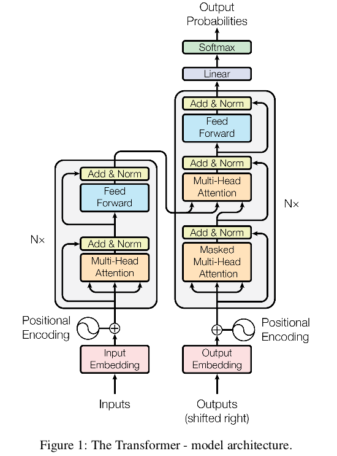
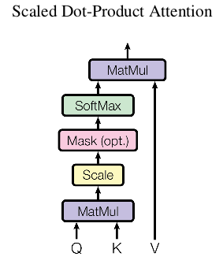
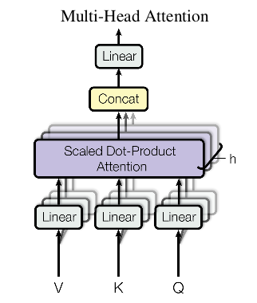

# Attend is All You Need

## 1 Introduction
递归神经网络，尤其是LSTM和门控神经网络（gated recurrent neural network），作为序列建模和转导问题（transduction problem）的最先进方法，已被牢固确立。递归模型通常考虑输入和输出序列符号位置的因子计算。在计算时间内对齐位置（align position），它们生成一个隐藏状态序列$h_t$，作为先前隐藏状态 $h_{t-1}$ 的函数和位置t的输入。这种固有的顺序性排除了训练样本中的并行性，这在更长的序列中变得至关重要，因为内存现在了样本之间的批处理。最近的工作通过分解[21]和条件计算[32]在计算效率方面取得了显著的提高，同时后者也提高了模型性能。然而，顺序计算的基本约束仍然存在。   
注意力机制已成为各种引人注目的序列建模和转导模型的一个组成部分，它允许对依赖建模而不考虑输入或输出序列的距离。    
本文提出Transformer，这种模型架构避免了递归，而是完全依赖于注意力机制来绘制输入与输出之间的全局依赖关系。Transformer允许更多的并行化，并8个P100 GPU上训练12小时，到达翻译质量的一个新水平。

## 2 Background
减少序列计算的目标也形成了Extended Neural GPU[16]，ByteNet[18]和ConvS2S的基础，它们都使用卷积神经网络作为基本构件块，对所有的输入和输出位置并行计算隐藏表征[12]。在这些模型中，_将两个任意输入或输出位置的信号联系起来需要的操作数量随着位置之间的距离增加而增加，_ ConvS2S是线性增加的，而ByteNet是对数增加。这使得学习远距离位置之间的依赖变得更加困难。在Transformer中，这种操作减少可以减少到常数，尽管由于注意加权位置的平均降低了有效分辨率，这是我们在3.2节中所描述的用多头注意力抵消的效果。    
自注意力（self-attention），有时也成为内部注意力（intra-attention），它是将单个序列不同位置关联起来以计算序列表征的注意力机制。自注意力已成功用于不同的任务，包括阅读理解、抽象概括等。  
端到端的记忆网络（memory network）基于循环注意力机制，而不是蓄序列对齐的递归，并且证明了在简单的语言问题回答和语言建模任务中表现良好。  
Transformer是第一个完全依靠自注意力来计算输入和输出表征，而不需要使用序列对齐-RNN或者卷积。  

## 3 Model Architecture
大多数具有竞争力的神经序列翻译模型都是encoder-decoder结构[5,2,35]。这里，encoder将符号表示序列输入 $(x_1, ..., x_n)$ 映射到连续表征序列 $z = (z_1, ..., z_n)$ 。给定$z$,decoer一次生成一个符号的输出序列 $(y_1, ..., y_m)$ 。在每一步中，模型都是自回归（auto-regressive）[10]，在生成下一个时，将之前的生成符号作为附加输入使用。    
Transformer遵循这个整体架构，在编码器和解码器中都仅使用堆叠的自注意力和point-wise的全连接层，分别显示在下图的左右部分。

### 3.1 Encoder and Decoder Stacks
- _Encoder_ 编码器由$N=6$个相同层组成。每一层有两个子层：第一层是多头注意力机制（Multi-Head Self-Attention Mechanism），第二层是一个简单的、逐位置（position-wise）的全连接前馈网络。在两个子层的周围都是用残差连接，并跟一个layer normalization[1]。即，每一个子层的输出是 $LayerNorm(x + SubLayer(x))$ ，其中 $SubLayer(x)$ 是子层的实现函数。
为了方便残差连接，模型中的所有子层以及嵌入层都产生 $d_{model}=512$ 维度的输出。  
- _Decoder_ 解码器也由 $N=6$ 个相同的层组成。除了编码器中使用的两个子层外，编码器还插入了第三个子层，它在编码器的输出上执行多头注意力，并跟一个layer normalization。我们还修改了解码器堆栈中的自注意子层，以防止位置被注意到后续的位置。这种masking，结合输出嵌入被一个位置偏移的事实，确保位置i的预测只能依赖于小于i位置的已知输出。

## 3.2 Attention
注意力函数可以描述为将查询（query）和键值对（key-value pair）集合映射到输出，其中查询、键、值和输出都是向量。输出被计算为值的加权和，其中分配给每个值的权重由查询的兼容函数与相应键计算。

### 3.2.1 Scaled Dot-Product Attention
  
Scaled Dot-Product Attention的输入为 $d_k$ 维的查询和键，以及 $d_v$维的值。我们计算所有键和查询的点积，然后除以 $\sqrt{d_k}$ ，并应用一个softmax函数以获得值的权重。   
在实际过程中，我们将查询集合打包成一个矩阵Q以同时计算注意力函数。将键和值也打包成矩阵K和V。我们计算如下的矩阵输出：
$$Attention(Q, K, V) = softmax(\frac{QK^T}{sqrt{d_k}})V$$
两种最常用的注意力是加法注意力（additive attention）[2]，和点乘注意力（dot-product(multiplicative)）。除了缩放因子 $\frac{1}{\sqrt{d_k}}$ 外，点乘注意力和我们的算法相同。加法注意使用有单个隐藏层的前馈网络组成的兼容函数计算。虽然两种注意力在理论复杂度上相似，但是点乘注意力实际上更加快速，并有更高效的空间，这是因为它是通过高度优化的矩阵乘法实现的。     
虽然对于较小的 $d_k$ 值，两种注意力机制有相似的表现，但对于较大的 $d_k$ ，加法注意力更优于乘法注意力。为了抵消这种影响，我们使用 $\frac{1}{\sqrt{d_k}}$ 缩放点乘。

### 3.2.2 Multi-Head Attention
我们没有使用 $d_{model}$ 维的键、值和查询来执行单一注意力，而是发现使用不同的、学习到的线性投影将查询、键和值投影到 $d_k$ 、$d_k$ 和 $d_v$ 维h次是有益的。在这些查询、键和值的投影版本中并行地执行注意力函数，产生 $d_v$-维输出值。这些值被拼接(concatenated)并再次投影，产生最终的输出，如下图。   
    
多头注意力允许模型联合关注来自不同位置的不同表征子空间的信息。使用一种单一的注意力头，平均会抑制这种情况。    
$$MultiHead(Q, K, V) = Concat(head_1, ..., head_h)W^O$$
其中 $head_i = Attention(QW_i^Q, KW_i^K, VW_i^V)$ ，并且映射为参数矩阵 $W_i^Q \in \Bbb{R}^{d_{model} \times d_k}$, $W_i^K \in \Bbb{R}^{d_{model} \times d_k}$, $W_i^V \in \Bbb{R}^{d_{model} \times d_v}$ 和 $W_i^Q \in \Bbb{R}^{hd_v \times d_{model}}$。    
本文中，我们采用 $h = 8$ 个并行注意力层或头（head），都使用 $d_k = d_v = d_{model}/h = 64$ 。由于每个头减少的维度，总共的计算成本与使用全部维度的单头注意力相似。

### 3.2.3 Applications of Attention in our Model
Transformer以三种方式使用多头注意力：   
- 在“encoder-decoder attention”层，查询来源于先前解码器层，而记忆键和值来自编码器的输出。这允许解码器的每个位置关注输入序列的所有位置。这模拟了序列到序列模型（如[38,2,9]）中典型的注意力机制。  
- 编码器包含自注意力层。在自注意力层中，所有的键、值和查询来自相同的位置，本文中是来自编码器的先前层。编码器的每个位置能够关注编码器先前层的所有位置。
- 相似地，解码器中的自注意力层允许解码器的每个为关注解码器的所有位置直到并包含该位置（_即只访问当前位置之前的位置_）。为了保持自回归性（auto-regressive property），我们需要阻止解码器中的左向信息流。我们通过屏蔽（masking）（设置 $-\infty$ )softmax输入中所有不合法连接的词来实现scaled dot-product attention。

## 3.3 Position-wise Feed-Forward Networks
除了注意力子层外，解码器和编码器的每层中包含一个全连接的前馈网络，它分别并相同地应用于每个位置。这包含里那个线性变换，其中有一个ReLU激活。
$$FFN(x) = max(0, xW_1 + b_1)W_2 + b_2$$   
虽然线性变换在不同位置上相同的，但是从一层到另一层使用不同参数。另一种描述这种变换的方式是两个核大小为1的卷积。输入和输出的维度是 $d_{model} = 512$，并且中间层的维度为 $d_{ff}=2048$。

## 3.4 Embeddings and Softmax
与其他序列转导模型相似， 我们使用学习到的嵌入将输入符号和输出符号转换成 $d_{model}$ 维的向量。我们也使用学习到的线性变换和softmax函数将解码器输出转换为预测下一个符号的概率。在我们的模型中，在两个嵌入层和pre-softmax线性变换之间共享权重矩阵。在嵌入层中，这些权重乘以 $\sqrt{d_{model}}$ 。

## 3.5 Position Encoding
因为我们的模型没有包含递归或者卷积，为了让模型利用序列的顺序，我们必须向序列中注入关于符号相对或绝对位置的一些相关位置。为此，我们将“位置编码（positional encodings）”添加到堆叠编码器和解码器底部的输入嵌入，这使得这两部分能够相加。位置编码有很多选择--学习的和固定的。   
本文中，我们使用不同序列的 $sin$ 和 $cos$ 函数：
$$ PE_{(pos, 2i)} = sin(pos/10000^{2i/d_{model}})$$
$$PE(pos, 2i+1) = cos(pos/10000^{2i/d_{model}})$$  
其中 $pos$ 是位置， $i$ 是维度。即，每个位置编码的维度对应与正弦曲线（sinusoid）。波长形成从 $2\pi$ 到 $10000\cdot 2 \pi$ 的几何级数。我们选择这种函数是因为，我们假设它允许模型易于学习相关位置，因为对于任何固定偏移 $k$ ， $PE_{pos + k}$ 能够表示为 $PE_{pos}$ 的线性函数。    
我们还尝试使用学习的位置嵌入，并发现这两个版本产生几乎相同的结果（如表3的（E）行）。我们选择了正弦曲线版本，因为它可以允许模型外推到比训练期间遇到的序列长度更长的序列长度。

# 4 Why Self-Attention
在本节中，我们将自注意力层的各个方面与通常在循环和卷积层中使用的将可变长度符号表征序列 $(x_1, ..., x_n)$ 映射到相等长度序列 $(z_1, ..., z_n) (x_i,z_i \in \Bbb{R}^d)$ 的进行比较，例如在典型的解码器或编码器中使用的隐藏层。有三个必要条件（desiderata）启发我们使用自注意力。    
一个是每层的总共计算复杂度。另一个是可以并行化的计算数量，通过所需的最小序列操作来测量。   
第三个是网络中长范围依赖（long-range dependencies）之间的路径长度（path length）。学习长范围依赖是许多序列转导任务中的一个关键挑战。影响学习这种依赖的一个关键因素是前向和反向信号必须在网络中传播的长度。在输入和输出序列中任意位置组合之间的这种路径长度越短，就越容易学习到长范围依赖[12]。因此，我们还比较了不同层类型组成网络中任意两个输入和输出位置之间的最长路径长度。   
  
表1给出了自注意力以常数序列执行操作连接所有位置，然而循环层需要 $O(n)$ 序列操作。在计算复杂度方面，当序列长度n小于表征维度d时，自注意力层比循环层快速，这经常在最优的机器翻译模型中使用，例如word-piece[38]和byte-pair[31]表征。为了改善涉及非常长序列时任务的计算性能，可以将自注意力限制为仅考虑以相应输出位置为中心的输入序列中的大小为r的领域。这将最大路径长度增加到 $O(n/r)$ 。   
核宽度 $k < n$ 单一的卷积层不能连接输入和输出位置的所有对。这样做需要在连续核的情况下堆叠 $O(n/k)$ 卷积层，或者膨胀卷积的情况下需要 $O(log_k(n))$ [18]，这增加了网络中任意两个位置的最长路径长度。然而，可分离卷积将计算复杂度降低到 $O(k \cdot n \cdot d + n \cdot d^2)$ 。然而，即使 $k = n$ ，可分离卷积的复杂性也等于自注意层和逐点前馈层的组合，这是我们在模型中采用的方法。

# 5 Training
## 5.1 Training Data and Batching
标准的WMT 1024 英语-德语数据集，包含4500000个语句对。语句使用byte-pair编码，有大约37000个符号的共享源-目标词汇表。
对于英语 - 法语，我们使用了大得多的WMT 2014英语 - 法语数据集，该数据集由36M个句子组成，并将符号分成32000个word-piece词汇表[38]。句子对按照近似的序列长度进行批处理。每个训练批包含一组句子对，包含大约25000个源符号和25000个目标符号。
## 5.2 Hardware and Schedule
8 NVIDIA P100 GPU训练。训练基本模型100000次或者12小时，每次迭代需要0.4秒。对于大模型，每次迭代时间为1.0秒，训练300000次（3.5天）。
## 5.3 Optimizer
使用 $\beta_1 = 0.9, \beta_2=0.98, \epsilon = 10^{-9}$。学习率为：
$$lrate = d_{model}^{-0.5} \cdot min(step\_num \cdot warmup\_steps^{-0.5})$$
这对应于为第一个warmup_steps训练步骤线性地增加学习速率，然后与步数的负平方根成比例地减小它。 我们使用了warmup_steps = 4000。
## 5.4 Regularization
使用三种正则化策略。
- _Residual Dropout_ 在加到子层输入和归一化层之前，将dropout应用到每个子层的输出。此外，我们还将dropout应用到解码器和编码器堆叠的嵌入和位置编码之和上。对于基模型，我们使用dropout率 $P_{drop} = 1$ 。
- _Label Smoothing_ 在训练期间，我们采用标签平滑值 $\epsilon_{ls} = 0.1$ [36]。这有点模糊，因为使得模型学习更加不确定，但是提高了准确率和BELU得分。

# 6 Results
# 6.2 Model Variations

