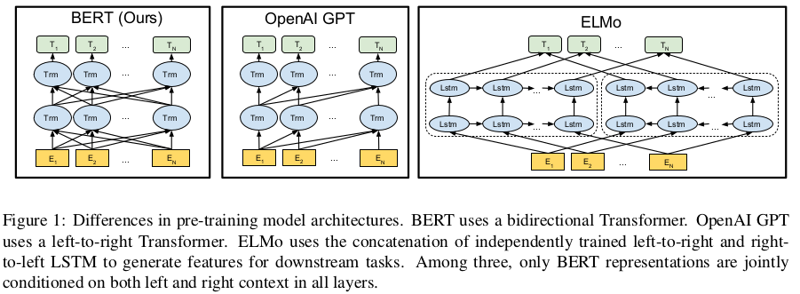
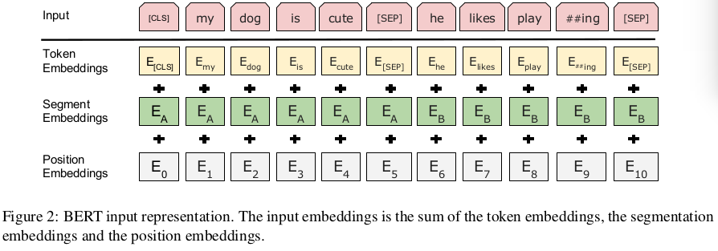
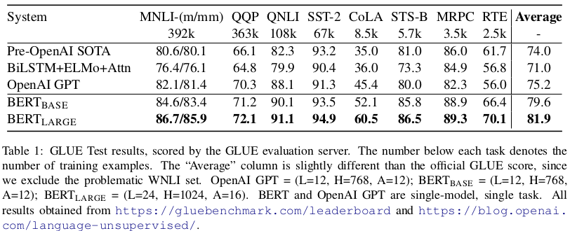
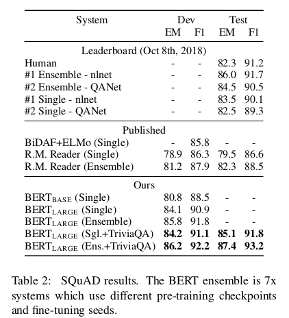
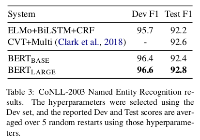
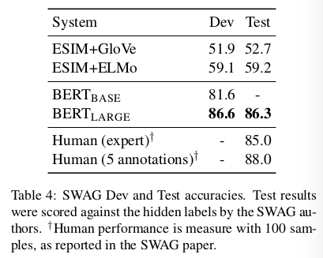
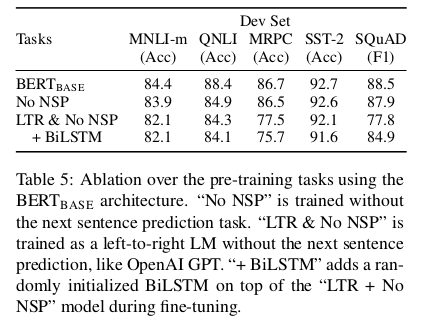
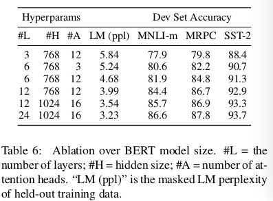

BERT: Pre-training of Deep Bidirectional Transformers for Language Understanding
========================================

# 1 Introduction
语言模型被证明对于改善许多NLP任务是有效的。这些任务包括语句级任务，如自然语言推理和释义（inference and paraphrasing），旨在通过整体分析语句来预测语句之间的关系，以及字符（token）级任务，如命名实体识别（named entity recognition）和SQuAD问答，其中模型需要生成字符级的细粒度输出。   
存在两种策略将预训练语言表征应用到下游任务：feature-based和fine-tuning。feature-based的方法，例如ELMo（《Deep contextualized word representations》），使用包含预训练表征作为额外特征的任务特点架构（tasks-specific）。fine-tuning方法，例如Generative Pre-trained Transformer（OpenAI GPT），引入最小特定任务参数（minimal task-specific parameters），并通过简单地微调预训练参数来训练下游任务。在之前个工作中，两种放入在训练期间共享了一样的目标函数，其中它们使用无方向的语言模型（unidirectional language model）来学习一般语言表征。   
_我们认为当前技术严重限制了预训练表征的能力，特别是针对微调（fine-tuning）方法。主要限制是标准语言模型是无方向的（unidirectional），而这限制啊了预训练期间架构的选择。_ 例如，在OpenAI GPT中，作者使用从左至右的架构，其中在Transformer的自注意力层的每个符号仅能关注它先前的符号。这样的限制对于语句级任务是次优化的（sub-optimal），并且，当应用于基于微调的方法到字符级任务时，可能是破坏性的，例如SQuAD问答，它处理来自两个方向的上下文是至关重要的。   
本文中，我们提出BERT改善基于微调的方法：Bidirectional Encoder Representation from Transformer。BERT通过提出一种新的预训练目标来处理线圈提出的无方向限制：“masked language model”（MLM）。_MLM随机屏蔽（mask）输入中的一些字符（token），并且目标是仅基于屏蔽词的上下文来预测原始词汇表的id。_ 与从左至右的语言模型的预训练不同，MLM目标允许表征融合（fuse）左边和右边的上下文，这允许预训练一个深度双向Transformer。除屏蔽语言模型（masked language model），我们还引入了“next sentence prediction”任务，它联合预训练文本对（text-pair）表征。    
本文的贡献：
- 我们强调双向预训练对于语言表征的重要性。与《Improving language understanding with unsupervised learning》不同，它使用无向语言模型用于预训练，BERT使用屏蔽语言模型来保证预训练的深度双向表征。也不同于《Deep contextualized word representations》，它使用由独立训练的从左到右和从右到左LM的浅层连接。
- 我们证明预训练表征消除了对重型工程任务特定表征的需要。BERT是第一在大尺度语句级和字符级任务上取得最优性能的基于微调的表征模型。    
- BERT在11个NLP任务上获得最优性能。   

# 2 Related Work
预训练生成语言表征有很长的历史，我们在本节中简要地介绍最流行的方法。   
## 2.1 Feature-based Approaches
几十年来，学习广泛适用的词语表达一直是一个活跃的研究领域，包括非神经网络和神经网络方法。预训练词嵌入被作为现代NLP系统的集成部分，提供了从头开始学习嵌入显著改进。    
这些方法已被推广到较粗糙的粒度，例如句子嵌入（Kiros等，2015; Logeswaran和Lee，2018）或段嵌入（Le和Mikolov，2014）。与传统的词嵌入一样，这些学习到的表征通常也用作下游模型的特征。  
ELMo归纳了沿不同维度的传统词嵌入的研究。他们提出从语言模型中提取上下敏感（context-sensitive）特征。 当上下文词嵌入与现有的任务特定的架构集合是，ELMo推动了几项主要NPL基准测试的最新技术，包括SQuAD的问答、情绪分析和命名实体识别。   
## 2.2 Fine-tuning Approaches
从语言模型（language model： LM）迁移学习的最新趋势是在LM目标上预先训练一些模型架构，然后对有监督的下游任务的相同模型进行微调（Dai和Le，2015; Howard和Ruder，2018; Radford） 等人，2018年）。这些方法的优点是仅需要从头学习少量的参数。至少部分归功于这种优势，OpenAI GPT从GLUE基准中获得了许多语句级任务上的最优结果。  
## 2.3 Transfer Learning from Supervised Data
虽然无监督预训练的优势在于可获得的数据量几乎无限，但也有工作表明从具有大型数据集的监督任务中可以有效地迁移，例如自然语言推断（Conneau等，2017）和机器翻译（McCann et al。，2017）。在NLP之外，计算机视觉研究也强调从大型预训练模型中迁移学习的重要性，其中一种有效的方法是微调ImageNet上预训练的模型。

# 3 BERT
本节中介绍BERT及其详细实现。
## 3.1 Model Architecture
BERT的模型架构是基于《Attention is all you need》的一种多层双向Transformer编码器。本文实现的Transformer与《Attention is all you need》中的试下完全一致。   
本文中，用L表示Transformer块数，H表示隐藏大小，并且自注意力头数为A。在所有情况下，设置前馈/滤波器大小为 $4H$，即当 $H = 768$时，前馈/滤波器大小为3072；当 $H = 1024$时，为4096。本文主要介绍了两种大小的模型：
- $BERT_{BASE}$：$L=12, H=768, A=12, Total Parameters=110M$
- $BERT_{LARGE}$: $L=24, H=1024, A=16, Total Parameters=340M$

$BERT_{BASE}$ 被选择为OpenAI GPT相同模型大小以便于比较。_BERT Transformer的关键之处在于使用了双向自注意力，而GPT Transformer使用每个字符仅关注其左边部分的限制自注意力。_ 我们注意到，在文献中，双向Transformer通常被称为“Transformer encoder”，而仅左上下文的被称为“Transformer decoder”，因为它可以用于文本生成。图1是BERT、OpenAI GPT和ELMo的比较。
  

## 3.2 Input Representation
输入表征是指能够在一个标记序列中明确表示单个文本语句或者一对文本语句（例如：[问题，回答]）。对于给定的标记，它的输入表征通过相应的标记、分割和位置嵌入构成。图2给出了输入表征的只管表示。
   
具体为：
- 使用有30000个标记的词汇表的WordPiece嵌入。我们使用##表示split word pieces（分词）。
- 我们学习的位置嵌入，支持的序列最长可以达到512个标记。  
- 每个序列的第一个标记始终是特殊的分类嵌入（[CLS]）。相应标记的最终隐藏状态（即，Transformer的输出）被作为分类任务的聚合序列表征（aggregate sequence representation）。对于非分类任务，这个向量被忽略。   
- 语句对被打包到一起成为单个序列。我们以两种方式区分这种语句。第一，我们使用一个特殊标记（[SEP]）分割它们。第二，我们添加一个学习到的语句A嵌入到第一个语句的每个标记，以及一个语句B嵌入到第二个语句的每个标记。  
- 对于单个语句输入，我们仅使用语句A嵌入。   

## 3.3 Pre-training Tasks
与《Deep contextualized word representations》和《Improving language understanding with unsupervised learning》不同，我们并没有使用传统的从左至右或从右至左的语言模型来预训练BERT。相反，我们使用两种新颖的无监督预测任务来预训练BERT。

### 3.3.1 Task #1: Masked LM
直觉上讲，有理由相信深度双向模型（deep bidirectional model）比从左至右模型或者从左至右和从右至左模型的浅层连接更严格。不幸的是，标准的条件语言模型尽可从左至右或从右至左预训练，而双向条件允许每个单词在多层上下稳重间接地“看到他自己（see itself）”。   
为了训练深度双向表征，我们采用随机mask一定比例输入标记的直接方法，并且仅预测这些屏蔽的标记。我们称这个过程为"masked LM"(MLM)。在这种情况下，相应掩模标记（mask token）的最终隐藏向量被馈入词汇表上的输出softmax，与在标准LM一样。在我们的所有试验中，我们在每个蓄力中随机屏蔽所有WordPiece标记的15%。与降噪自编码器相比，我们只预测掩模的单词而不是重建整个输入。  
尽管这允许我们获得双向预训练模型，但是这种方法有两个缺点。首先，我们正在创建 _预训练和微调之间的不匹配_ ，因为在微调期间从未看到[MASK]标记。为了缓解这个问题，我们并不总是用实际的[MASK]标记替换“masked”单词。相反，训练数据生成器（training data generator）随机选择15%的标记，例如在语句“my dog is hairy”选择了“hairy”。然后执行如下过程：
- 数据生成器将执行以下操作，并不总是用[MASK]替换所选单词：
  - 80%的时间：用[MASK]标记替换单词，例如，my dog is hairy -> my dog is [MASK]。
  - 10%的时间：用随机单词替换单词，例如，my dog is hairy -> my dog is apple。
  - 10%的时间：保持单词不改变，例如，my dog is hairy -> my dog is hairy。这样做的目的是将表示偏向于实际观察到的单词。

Transformer 编码器并不知道它将要求哪些单词将被用于预测或者哪些单词会被随机单词替换，因此它被强制用于保持 _每个_ 输入标记的上下文表征分布。此外，因为随机替换仅发生在所有标记的1.5%（即15%中的10%），这似乎不会损模型的语言理解能力。   
第二个缺点是使用MLM在每个batch中仅有15%的标记被用于预测，这表明需要更多的预训练步骤才能达到收敛。在5.3节中，我们证明MLM的收敛速度略慢于从左到右的模型（预测每个标记），但MLM模型的实证改进远远超过增加的训练成本。   

### 3.3.2 Task #2: Next Sentence Prediction
许多重要的下游任务，例如Question Answering（QA）和自然语言推理（Nature Language Inference），都是基于理解两个文本语句之间的 _关系_，这不能通过语言模型直接捕获。为了训练能够理解语句关系的模型，我们预训练一个二值化的 _下一个语句预测（next sentence prediction）_ 任务，该任务能够从任何单语语料库中简单生成。具体地，当从预训练样本中选择语句A和B时，50%的时间B是A之后的实际下一个语句，而50%的时间是语料库中的一个随机语句。例如：   

Input = [CLS] the man went to [MASK] store [SEP] he bought a gallon [mask] milk [SEP]

LABEL = IsNext

Input = [CLS] the man [MASK] to the store [SEP] penguin [MASK] are flight ##less birds [SEP]

Label = NotNext   

我们完全随机地选择NotNext语句，而最终预训练的模型获得了97%-98%的准确率。尽管它很简单，但我们在5.1节中证明，预测这项任务对QA和NLI都非常有益。   

## 3.4 Pre-training Procedure
预训练过程遵循现有的语言模型预训练文献。使用BooksCorpus（800M单词）和English Wikipedia（2500M单词）连接而成的预训练语料库。对于维基百科，我们仅提取文本段落，并忽略列表、表格和标题。至关重要的是使用文档级预料而不是洗牌的语句级语料库，例如Billion Word Benchmark，为了提取长的连续序列。    
为生成每个训练输入序列，我们从语料库采样量文本范围，这我们称之为“语句（sentences）”，即使它们通常比单个语句长（但也有更短的）。第一个语句接收A嵌入，而第二个接收B嵌入。50%的时间B是A之后的实际下一个语句，而50%的时间B是随机语句，这在“下一语句预测”任务中完成。它们被采样使得联合长度小于512个标记。在WordPiece标记化之后应用LM掩模，具有15％的均匀掩模率，并且不特别考虑部分word piece。    
我们以256个序列的批大小（$256 sequence * 512 tokens = 128000 tokens/batch$）训练1000000步，这在33亿数据库上大约40轮周期。我们使用学习率为 $1e-4$、 $\beta_1 = 0.9, \beta_2 = 0.999$的Adam，$L2$权重衰减为0.01，学习率在开始10000步热启动，并且使用学习率线性衰减。在所有层使用dropout概率为0.1。使用gelu激活而非标准的relu，这遵循OpenAI GPT。训练损失是掩模LM似然均值和下一语句预测均值之和。   
$BERT_{BASE}$的训练在Pod配置的4个云TPU上执行（共计16个TPU芯片）。 $BERT_{LARGE}$在16个云TPU上执行（共计64个TPU芯片）。每个预训练花费4天完成。

## 3.5 Fine-tuning Procedure
对于序列级分类任务，BERT微调是直接的。为了获得固定维度的输入序列的池化表征，我们为输入中的第一个标记采用最终隐藏状态（即，Transformer的输出），其结构对应于特殊的[CLS]词嵌入。我们将这个向量表示为 $C \in \Bbb{R}^H$。在微调期间添加的参数是分类层 $W \in \Bbb{R}^{K \times H}$，其中K是分类标签的数量。标签的概率使用标准的softmax（$P = softmax(CW_T)$）计算。所有的BERT参数和W联合微调用于最大化正确标签的对数概率。对于span-level和token-level的预测任务，这上述过程必须以任务特定的方式轻微修改。   
对于微调，除了批大小、超参数和训练周期数，大多数模型的超参数与预训练相同。dropout概率始终保持为0.1。最优的超参数值是任务特定的，但是一下范围的可能值在所有任务上工作很好：
- Batch size: 16, 32
- Learning rate(Adam): 5e-5, 3e-5, 2e-5
- Number of epochs: 3, 4

我们也发现大型数据集（例如100k+标签的训练样本）比小型数据集对超参数不敏感得多。微调通常十分迅速，因此，简单地对上述参数进行详尽的搜索并选择在开发集上表现最佳的模型是合理的。

## 3.6 Comparison of BERT and OpenAI GPT
与BERT最具可比性的现有预训练方法是OpenAI GPT，它在大型文本语料库中训练从左到右的Transformer LM。实际上，BERT中的许多设计决策都被有意地选择为尽可能接近GPT，以便可以最小化地比较这两种方法。这项工作的核心论点是3.3节中提出的两个新的预训练任务占了大多数经验改进，但我们注意到BERT和GPT如何训练之间还存在其他一些差异：
- GPT在BooksCorpus（800M单词）上训练；BERT在BooksCorpus（800M单词）和维基百科（2500M单词）上训练。
- GPT使用语句分割（sentence separator）（[SEP]）和分类标记（[CLS]），它们仅在微调期间引入；BERT在预训练阶段学习[SEP]、[CLS]和语句A/B的嵌入。
- GPT以32000单词的批大小训练1M步；BERT以128000单词的批大小训练1M步。
- GPT在所有的微调实验中使用一样的5e-5的学习率；BERT选择任务特定的微调学习率，这在开发集上表现最佳。为了分离这些差异的影响，我们在5.1节进行了消融实验，证明大多数改进实际上来自新的预训练任务。

# 4 Experiments
在本节中，我们将介绍11个NLP任务的BERT微调结果。
## 4.1 GLUE Datasets
General Language Understanding Evaluation（GLUE）基准测试是不同自然语言理解任务的集合。大多数GLUE数据已存在许多年，单数GLUE的目的是（1）使用规范的Train、Dev和Test划分来分发数据集，（2）设置评估服务器以缓解评估不一致和测试集过拟合的问题。GLUE不会为测试集分发标签，并且用户必须上传他们的预测到GLUE服务器进行评估，并限制提交的次数。  
GLUE基准测试包含如下的数据集：    
- MNLI  Multi-Genre Nature Language Inference是大尺度、crowdsourced entailment分类任务。给定语句对，目标是预测与第一个语句对应的语句，无论这个语句是否是entailment、contradiction或者neutral（蕴含关系、矛盾的或者中性的）。
- QQP Quora Question Pairs是一个二值分类任务，其中目标是确定Quora上提出的两个问题是否在语义上是等价的。
- QNLI Question Natural Language Inference是Stanford问答数据集的一个版本，它被转换为一个二值分类问题。正样本是（question，sentence）对，它包含正确的回答，而负样本是来自不包含回答的某些段落的（question， sentence）对。   
- SST-2 Stanford Sentiment Treebank是一个二值单句分类任务，由从电影评论中提取的句子和人类注释的情感组成。
- CoLA Corpus of Linguistic Acceptability是二值单语句分类任务，其目标是预测英语句子是否在语言上可“可接受（acceptable）”。
- STS-B Semantic Textual Similarity Benchmark是来源于新闻标题和其他源的语句对集合。它们用1到5的分数进行标注，表示两个句子在语义上的相似程度。
- MPRC Microsoft Research Paraphrase Corpus是由从在线新闻源获取的语句对组成，并且人工注释语句对中语句是否在情感上等价。
- RTE Recognizing Textual Entailment是一个类似于MNLI的二元包含任务，但训练数据少得多（Bentivogli等，2009）。
- WNLI Winograd NLI是一个源自（Levesque等，2011）的小型自然语言推断数据集。GLUE网页指出，该数据集的构建存在问题，并且每个已提交给GLUE的经过培训的系统的表现都比预测多数类别的65.1基线准确度差。因此，我们将这一组排除在OpenAI GPT的公平性之外。 对于我们的GLUE提交，我们总是预测大多数类。

### 4.1.1 GLUE Results
为了微调GLUE，我们表示第3节中描述的输入序列或序列对，并使用与第一个输入标记（[CLS]）相对应的最终隐藏向量 $C \in \Bbb{R}^H$ 作为聚合表征，如表2（a）和（b）。在微调期间引入仅有的参数是分类层 $W \in \Bbb{R}^{K \times H}$，其中K是标签的数量。我们计算C和W的标准分类损失，即 $log(softmax(CW^T))$。
  

对于所有GLUE任务，我们对数据使用32和3个周期的批量大小。对于每一个任务，我们运行了5e-5,4e-5,3e-5和2e-5的学习率的微调，并选择了在Dev set上表现最好的那个。此外，对于 $BERT_{LARGE}$，我们发现在小数据上微调有时会出现不稳定（即有时运行会产生衰减结果），因此我们运行几次随机重启，并选择在开发集上取得最佳结果的模型。我们注意到GLUE数据集分布不包括测试标签，我们只为每个 $BERT_{BASE}$和 $BERT_{LARGE}$ 提交了一个GLUE评估服务器提交。   

  

$BERT_{BASE}$ 和 $BERT_{LARGE}$ 在所有任务上的表现均优于所有现有系统，相对于最先进的技术，平均准确度提高了4.4％和6.7％。注意 除了注意力掩模外，$BERT_{BASE}$ 与OpenAI GPT在模型架构上几乎一样。对于规模最大，报道最广泛的GLUE任务——MNLI，BERT的绝对精度提高了4.7％，超过了最先进水平。在官方GLUE排行榜上，$BERT_{LARGE}$ 得分为80.4，而排名靠前的排行榜系统OpenAI GPT在撰写之日获得72.8分。   

## 4.2 SQuAD v1.1
Stanford Question Answering Dataset（SQuAD）是100k众包问/答对的集合。给定从包含回答的维基百科上的问题和段落，任务是预测段落中答案文本范围。例如：
- Input Question:
where do water droplets collide with ice crystals to form precipitation?
- Input Paragraph: ... Precipitation forms as smaller droplets colaesce via collision with other rain drops or ice crystals within a cloud. ...
- Output Answer: within a cloud

范围预测任务的类型与GLUE语句分类任务有轻微的不同，但是我们可以直接了当地使用BERT来完成SQuAD任务。与GLUE一样，我们将输入问题和段落表示为单个打包序列，问题使用A嵌入，而段落使用B嵌入。在微调阶段添加的新参数仅仅是开始向量（start vector）$S \in \Bbb R^H$和结束向量（end vector）$E \in \Bbb{R}^H$。令来自BERT的第i个输入标记的最终隐藏向量表示为 $T_i \in \Bbb{R}^H$，如表3（c）所示。然后，将单词i作为答案范围的开始的概率，由 $T_i$ 和S之间的点积计算，然后是段落中所有单词的softmax：
$$P_i = \frac{e^{S \cdot T_i}}{\sum_j e^S \cdot T_j}$$

相同的公式用于回答范围的结束，并且最大得分范围用作预测。训练目标是正确开始和结束位置的对数似然。  
我们使用5e-5的学习率和32的批大小训练3轮。在推断期间，因为结束预测不以开始为条件，我们添加了结束必须在开始之后的限制，但是没有其他启发式方法。标记化的标记范围与原始未标记输入对齐以进行评估。  
   
表2给出了结果。SQuAD使用严格的测试程序，提交者必须手动联系SQuAD组织者，在隐藏的测试集上运行他们的系统，因此我们只提交了最好的系统进行测试。

## 4.3 Named Entity Recognition
为了评估标记打标签任务的性能，我们在CoNLL 2003命名实体识别（NER）数据集上微调BERT。这个数据集包含200k训练单词，它们标注为 _Person, Organization, Location, Miscellaneous, 或者other（未命名实体）_。
为了微调，我们将每个标记i的最终隐藏表征 $T_i \in \Bbb{R}^H$ 馈入NER标签集上的分类层。预测不以周围的预测为条件（即非自回归和非CRF）。为了使其与WordPiece标记化兼容，我们将每个CoNLL标记化输入词提供给我们的WordPiece标记化器，并使用与第一个子标记相对应的隐藏状态作为分类器的输入。例如：  
```
Jim    Hen    ##son was a puppet ##eer   
I-PER  I-PER  X     O   O O      X
```
其中不为X作出预测。因为WordPiece标记化边界是输入已知部分，所以这在训练和测试是完成。如表3（d）。套管（cased）的WordPiece模型用于NER，而无套管（uncased）的模型用于所有其他任务。结果如表3。
  

## 4.4 SWAG
Situations With Adversarial Generations(SWAG)数据集包含113k语句对的完整示例，其评估基于常识的推理。给定视频字幕数据集中的句子，任务是在四个选项中决定最合理的延续。例如：
```
A girl is going across a set of monkey bars. she

(i) jumps up across the monkey bars.
(ii) struggles onto the bars to grab her head.
(iii) gets to the end and stands on a wooeden plank.
(iv) jumps up and does a back flip.
```
将BERT应用到SWAG数据集与GLUE的应用相似。对于每一个样本，我们构建四个输入序列，每个包含给定语句（语句A）和可能延续（continuation）（语句B）的联结。我们引入仅有的任务特定参数是一个向量 $V \in \Bbb{R}^H$，它与最终聚合表征 $C_i \in \Bbb{R}^H$的点积表示每个选项i的得分。概率分布是四个选项的softmax:
$$P_i=\frac{e^{V \cdot C_i}}{\sum_{j=1}^{4}e^{V \cdot C_j}}$$  
我们以2e-5的学习率和16的批大小微调模型3轮。结果如表4。给定视频字幕数据集中的句子，任务是在四个选项中决定最合理的延续。
  
# 5 Ablation Studies
虽然我们已经展示了非常强大的实证结果，但到目前为止所呈现的结果并未孤立BERT框架各个方面的具体贡献。在本节中，我们将对BERT的多个方面进行消融实验，以便更好地了解它们的相对重要性。
## 5.1 Effect of Pre-training Tasks
我们的核心主张之一是BERT的深度双向性，这是通过掩模LM预训练实现的，是BERT与以前的工作相比最重要的改进。为了给出这一主张的证据，我们评估了两个使用完全相同的预训练数据、微调方案和Transformer超参数的新模型，如 $BERT_{BASE}$:
1. No NSP: 使用“masked LM”（MLM）训练，但是没有“next sentence prediction”（NSP）任务的模型。
2. LTR & No NSP: 使用Left-to-Right（LTR）LM，而非MLM训练的模型。在这种情形中，我们预测每一输入单词，并不应用任何掩模。我们在微调阶段应用left-only限制，是因为我们发现使用left-only-context预训练并用双向上下文微调会更糟糕。此外，这个模型不包含NSP任务。这直接与OpenAI GPT比较，但是使用我们更大的训练数据集、输入表征和微调方案。



## 5.2 Effect of Model Size


## 5.3 Effect of Number of Training Steps
图4显示了从已经预训练了k步的检查点进行微调后的MNLI Dev精度。 这使我们可以回答以下问题：
1. Question: BERT是否真地需要大量预训练（128000words/batch × 1000000 steps）来获取较高微调准确率？
Answer: 是的， 当训练1M steps与训练500k steps比较时，$BERT_{BASE}$ 获得几乎1.0%的额外准确率。
2. Question: MLM预训练是否别LTR预训练收敛慢，因为仅有15%的单词在每个批中被预测，而不是全部？
Answer: MLM模型的收敛速度略慢于LTR模型。然而，就绝对精度而言，MLM模型几乎从一开始开始就优于LTR模型。
