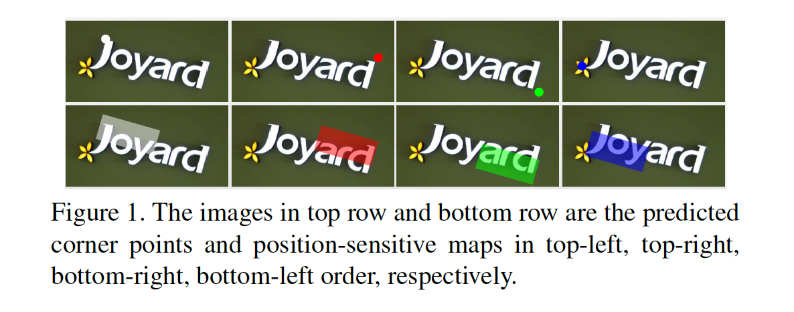
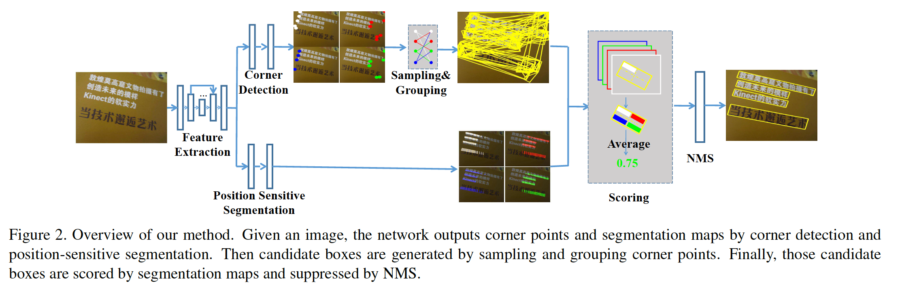
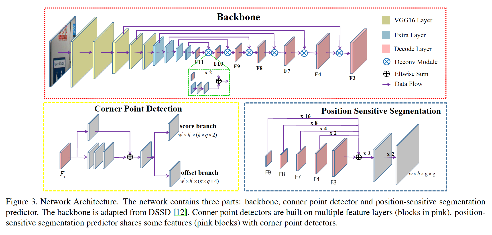
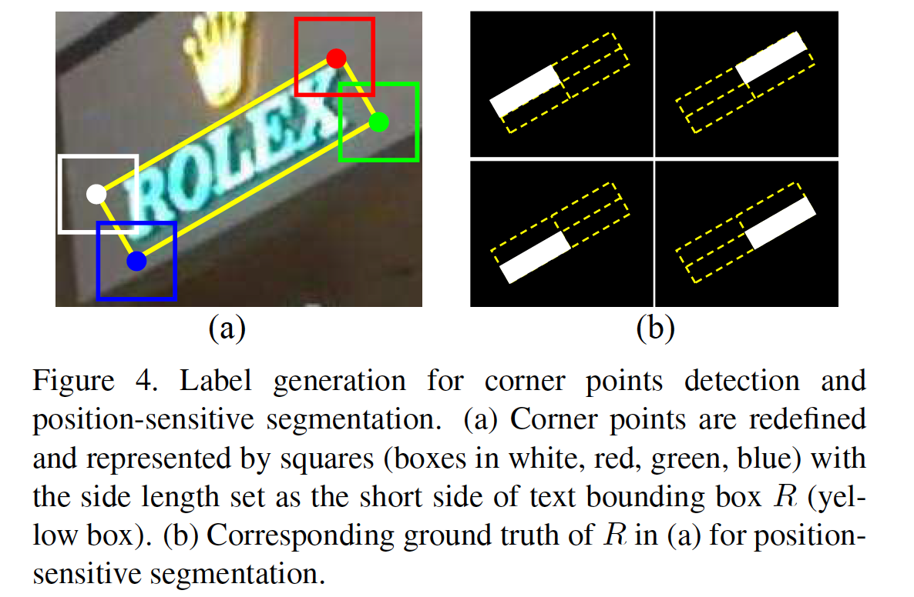
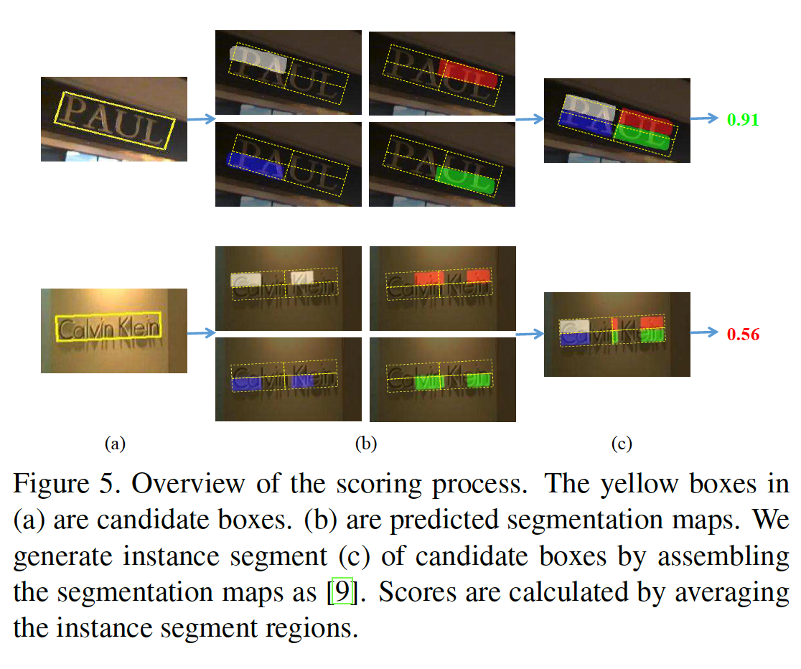
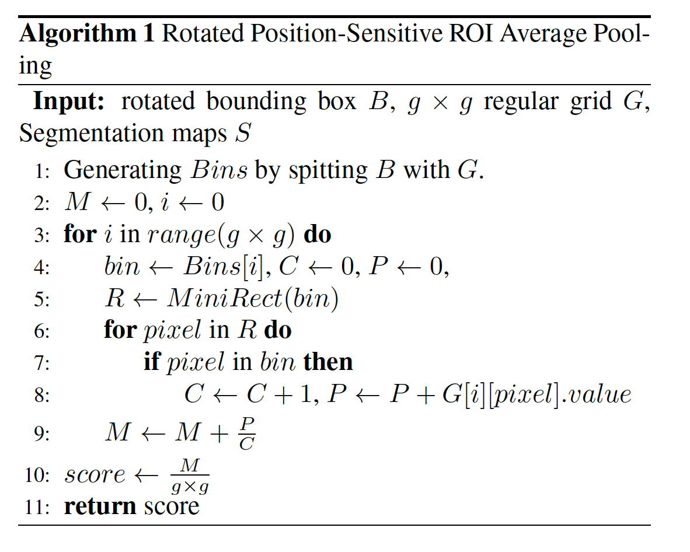
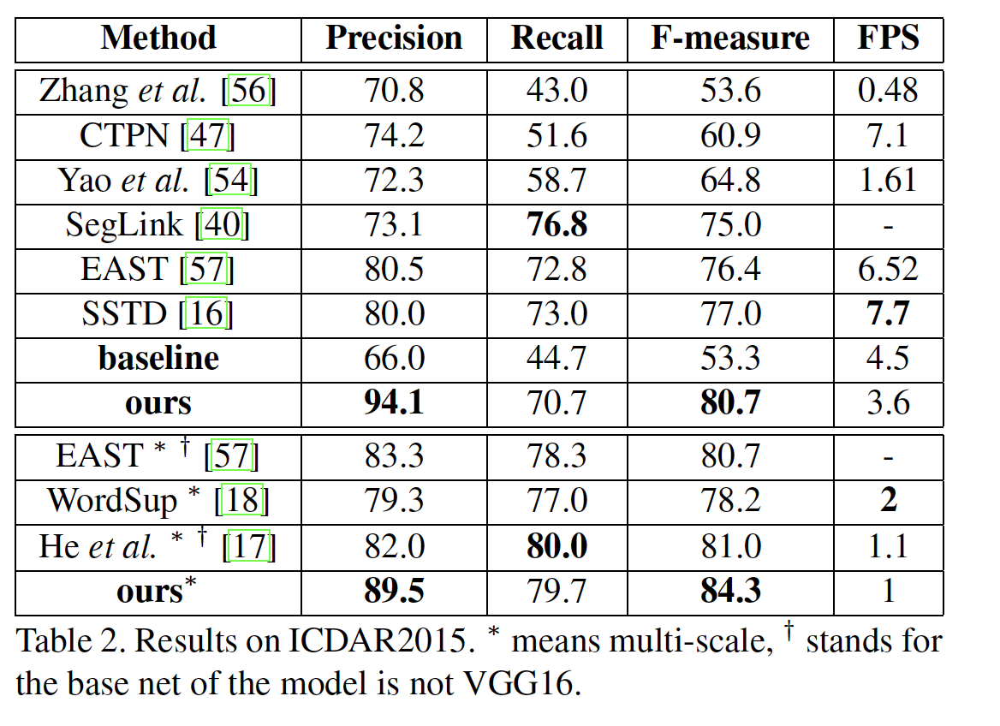
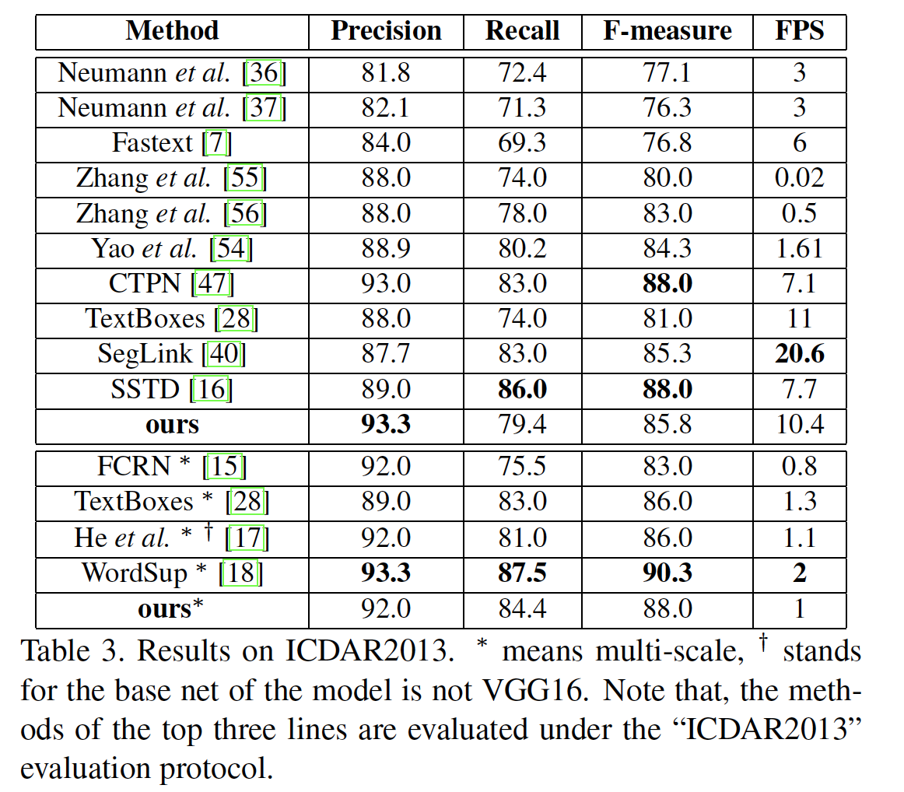
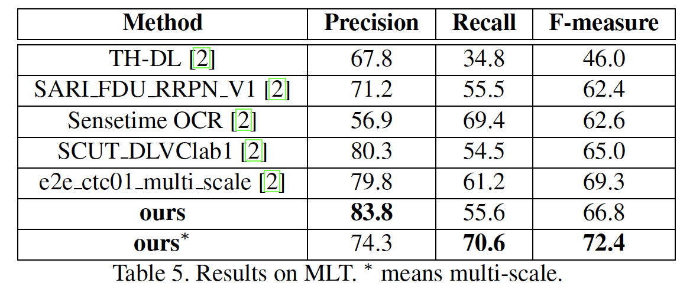
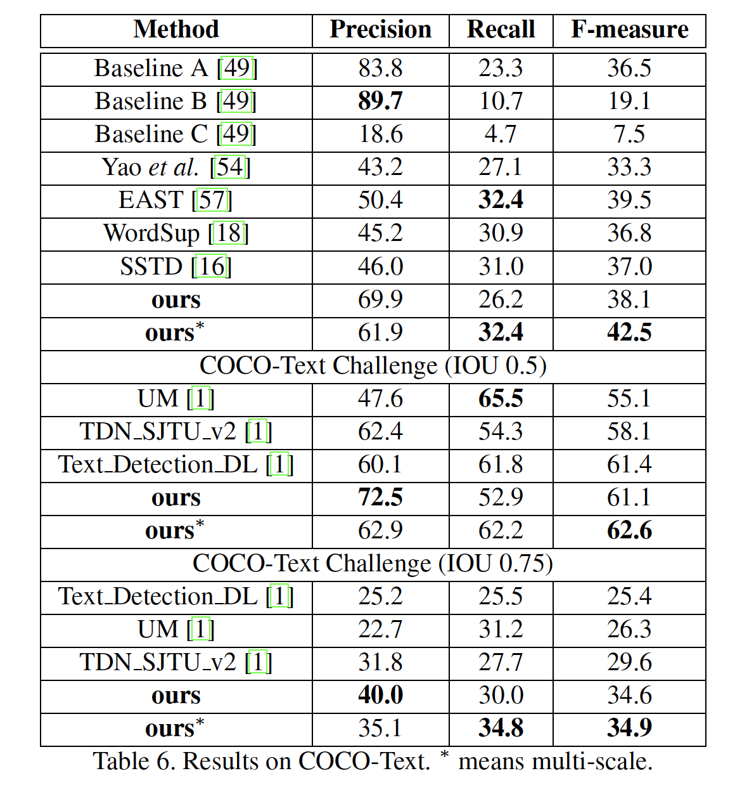

## Multi-Oriented Scene Text Detection via Corner Localization and Region Segmentation

### 摘要

​		先前的基于深度学习的最佳场景文本检测方法可以大致分为两类。第一类将场景文本视为一般对象的一种，并遵循一般目标检测范式以通过回归文本框位置来定位场景文本，但是却受到场景文本的任意方向和大型长宽比的困扰。第二类直接分割文本区域，但是大多数需要复杂的后处理。本文中，作者提出结合两种方法同时避免它们缺点的方法。作者提出通过定位文本边界框角点并在相关位置分割文本区域来检测场景文本。在推理阶段，通过采样和组合角点生成候选边界框，其通过分割图和进一步评分，以及NMS进行抑制。与先前的方法相比，本文的方法可以自然地处理长定向文本，而不需要复杂的后处理。ICDAR2013、ICDAR2015、MSRA-TD500、MLT和COCO-Text上的实验证明，所提出的算法在准确率和效率方面都更好和有效。基于VGG16，在ICDAR2015上获得84.3%的F值，在MSRA-TD500上获得81.5%的F值。

### 1. 引言

​		场景文本检测的挑战主要源自外部和内部因素。外部因素来自环境（例如噪声、模糊和遮挡），其也是扰动通用目标检测的主要问题。内部因素是有场景文本的特性和变化引起的。与通用目标检测相比，场景文本检测更加复杂，因为：1）自然图像中存在的场景文本可能具有任意方向，因此边界框还可以是旋转矩形或四边形；2）场景文本的边界框的纵横比变化显著；3）因为组成场景文本的可以是字符、单词或文本行，当定位边界框时，算法可能混淆。

​		文本检测可以分成两个分支。第一分支是基于通用目标检测器（SSD、YOLO和DenseBox），例如TextBoxes、FCRN和EAST。第二个分支是基于语义分割，其生成分割图，并通过后处理产生最终的文本边界框。

​		本文的动机主要来自两个观察：1）可以通过角点确定矩形，而不管大小、纵横比或者矩形的方向；2）区域分割图可以提供文本的有效位置信息。因此，算法首先检测文本区域的角点（左上、右上、右下、左下，如图1所示），而不是文本边界框。接着，预测位置敏感得分图（见图1），而不是如[56]和[54]中的文本/非文本图。最后，通过采样和分组检测到的焦点来生成边界框，然后通过分割信息消除不合理的边界框。所提出的方法的管道见图2。

​		所提出的方法的关键优势如下：1）因为通过采样和分组角点来检测场景文本，所以该方法可以自然地处理任意方向的文本；2）因为检测点，而不是文本边界框，所以该方法自发地避免长宽比变化很大的问题；3）利用位置敏感分割，无论实例是字符、单词或者文本行，都可以很好地分割文本实例；4）本文的方法中，候选框的边界有角点确定。与由锚或文本区域回归文本边界框相比，本文的方法产生的边界框更加准确，特别是针对长文本。

​		本文方法在ICDAR2015、MSRA-TD500和MLT上获得的F值分别为84.3%、81.5%和72.4%，并且每秒能够处理10.4幅（大小为$512 \times 512$）图像。

​		本文的贡献有四个方面：（1）提出一种新的场景文本检测器，其结合目标检测和分割的思想，它可以端到端训练和评估；（2）基于position-sensitive RoI pooling，提出rotated position-sensitive RoI pooling层，其可以处理任意方向提议；（3）本文的方法可以同时处理多方向场景文本中的挑战（例如旋转、变化的纵横比、非常接近的实例），这是前面方法所遭遇的；（4）该方法在准确率和效率方面，都获得更好或竞争性的结果。

### 2 与FCIS的区别

​		本文也采用position-sensitive segmentation map来预测文本区域。与InstanceFCN和FCIS相比，本文方法三个关键差异：1）利用position-sensitive ground-truth 直接优化网络；2）本文的position-sensitive map可以同时用于预测文本区域和得分提议，这与使用两种position-sensitive map（inside和outside）的FCIS不同；3）本文所提出的Rotated Position-Sensitive RoI Average Pooling可以处理任意方向的提议。

### 3. Network

#### 3.1. Feature Extraction

​		骨干采用预训练的VGG16网络，并利用如下的考量设计：1）场景文本的大小变化剧烈，因此骨干必须有足够的能力很好地处理这些问题；2）自然场景的背景很复杂，所以特征应更好地包含更多上下文。受FPN [29]和DSSD [12]在这些问题上取得的良好性能的启发，本文采用FPN/DSSD架构的主干来提取特征。

​		详细的讲，将VGG16的fc6和fc7转换为卷积层，将它们分别称为conv6和conv7。然后，在conv7上堆叠几个额外的卷积层（conv8、conv9、conv10、conv11）来扩大提取的特征的感受野。之后，在top-down路径种使用DSSD提出的几个反卷积模块（图3）。为了很好地检测不同大小的文本，作者级联从conv11到conv3的256个通道的反卷积模块（重用conv10，conv9，conv8，conv7，conv4，conv3的特征），总共构建6个反卷积模块。除了conv11的特征外，称这些输出特征为$F_3$、$F_4$、$F_7$、$F_8$、$F_9$、$F_{10}$和$F_{11}$。最后，由conv11和反卷积模块提取的具有丰富特征表示的特征将用于检测角点并预测位置敏感图。

#### 3.2. Corner Detection

​		对于给定的旋转矩形边界框$R=(x,y,w,h,\theta)$，存在顺时针的四个角点（左上角、右上角、右下角、左下角）并且可以表示为二维坐标$\{(x_1, y_1), (x_2, y_2),(x_3, y_3), (x_4, y_4)\}$。为了方便地检测拐角点，这里用水平正方形$C =(x_c,y_c, ss，ss)$重新定义以及表示角点，其中$x_c$、$y_c$是角点的坐标（例如$x_1$、$y_1$表示左上角）以及水平正方形的中心。$ss$是旋转矩形边界框$R$的短边的长度。

​		遵循SSD和DSSD，利用default box检测角点。与SSD或DSSD的方式不同，其中每个default box输出相应候选框的分类得分和偏移，角点检测更加复杂，因为在相同位置可能超过一个角点（例如一个位置可能同时是两个框的左上角和右下角）。因此，在本文的情况下，default box应当输出与四种角点对应的4个坐标边界框的分类得分和偏移。

​		本文采用DSSD[12]中的预测模块以在两个卷积分支中预测得分和偏移。为了减少计算复杂度，所有卷积的滤波器数设置为256。对于每个单元中具有$k$个default box的$m\times n$的特征图，“score” 分支和“offset”分支分别为每个default box的每种角点输出2个得分和4个偏移。这里，“score”分支的2表示角点在该位置是否存在。总之，“score”分支和“offset”分支为$k \times q \times 2$和$k \times q \times 4$，其中$q$表示角点的类型。默认情况下，$q$等于4。

​		在训练阶段，遵循SSD中的default box和ground truth框的匹配策略。为了检测不同大小的场景文本，作者在多层特征上使用多种尺寸的default box。所有default box的尺度见表1所示。default box的纵横比设置为1。

#### 3.3.  Position-Sensitive Segmentation

​		在前面的基于分割的文本检测方法中，生成分割图来表示每个像素属于文本区域的概率。但是，由于文本区域的重叠和文本像素的预测不正确，得分图中的那些文本区域始终无法彼此分开。为了得到分割图中的文本边界框，[56、54]中执行了复杂的后处理。

​		受InstanceFCN的启发，使用position-sensitive segmentation来生成文本分割图。与先前的文本分割方法不同，其生成相对位置。详细的讲，对于文本边界框$R$，使用$g \times g$的规则网格将文本边界框划分为4个bin（即对于$2 \times 2$的网格，文本区域可以分为4个bin，也就是左上角、右上角、右下角和左下角）。对于每个bin，使用分割图来确定该图中的像素是否属于这个bin。

​		作者在统一的网络中构建position-sensitive分割与焦点检测。重用$F_3$、$F_4$、$F_7$ 、$F_8$、$F_9$，并在构建一些卷积，这些卷积在$F_3$、$F_4$、$F_7$ 、$F_8$、$F_9$之上，并遵循角点检测分支（见图3）的残差块架构。所有这些块的输出通过具有尺度因子1、2、4、8、16的双线性插值调整到$F_3$的尺度。然后，将这些相同尺度的输出相加以生成更丰富的特征。进一步，通过两个连续的$Conv1\times1-BN-ReLU-Deconv2\times2$的块扩大融合特征的分辨率，并将最后一个反卷积层的核设置为$g \times g$。因此，最终position-sensitive map 具有$g \times g$个通道，以及与输入图像相同的大小。本文中，默认情况下，设置$g$为2。

### 4. 训练和推理

#### 4.1. 训练

##### 4.1.1  标签生成

​		对于每幅输入样本，首先将每个ground-truth文本框转换为最小覆盖文本框区域的矩形，然后确定4个角点的相关位置。

​		确定旋转矩形相关位置的规则如下：1）左上和左下角点的x坐标必须分别小于右上和右下角点的x坐标；2）左上和右上角点的y坐标必须分别小于左下和右下角点的y坐标。此后，原始的ground-truth可以表示为具有角点相关位置的旋转矩形。为了简便，角旋转矩形表示为$R=\{P_i | i \in \{1, 2, 3, 4\}\}$，其中$P_i = (x_i, y_i)$为左上、右上、右下、左下顺序的旋转矩形的角点。使用$R$生成角点检测和position-sensitive segmentation的标签。对于角点检测，首先计算$R$的短边，使用水平正方形表示4个角点，如图4（a）（**正方形的边长为旋转矩形$R$的短边长度**）。对于position-sensitive segmentation，利用R生成文本/非文本的逐像素掩膜。首先利用与输入图像相同的尺度初始化4个掩膜，设置所有像素值为0。然后，利用$2 \times 2$的规则网格将$R$划分为4个bin，并为每个bin分配一个掩膜，例如左上的bin为第一个掩膜。此后，将这些bin的所有像素设置为1，如图4（b）所示。

##### 4.1.2  优化

​		损失函数定义为：

$$L = \frac{1}{N_c} L_{conf} + \frac{\lambda_1}{N_c}L_{loc} + \frac{\lambda_2}{N_s}L_{seg} \tag{1}$$

其中$L_{conf}$和$L_{loc}$分别是角点检测模块中预测置信度得分的score分支和预测位置的offset分支的损失函数。$L_{seg}$是position-sensitive segmentation损失函数。$N_c$是正default box的数量，$N_s$是分割图中的像素数。$N_c$和$N_s$用于规范化角点检测和分割的损失。$\lambda_1$和$\lambda_2$是三个任务的平衡因子。默认情况下，将$\lambda_1$和$\lambda_2$分别设置为1和10。

​		score分支使用交叉熵损失：

$$L_{conf} = CrossEntropy(y_c, p_c) \tag{2}$$

其中$y_c$是所有default box的ground-truth，1表示正类，0表示其他。$p_c$是预测得分。考虑到正负样本之间的极端不平衡，类别均衡化是必须的，所以使用OHEM，正负训练样本之比为$1:3$。

​		offset分支采用smooth L1 损失：

$$L_{loc} = SmoothL1(y_l, p_l) \tag{3}$$

其中$y_l$是offset分支的ground-truth，$p_l$是预测偏移。$y_l$通过default box $B=(x_b, y_b, ss_b, ss_b)$和角点框$(x_c, y_c, ss_c, ss_c)$计算。

​		通过最小化Dice损失训练position-sensitive segmentation：

$$L_{seg} = 1 - \frac{2y_sp_s}{y_s + p_s} \tag{4}$$

其中$y_s$是position-sensitive segmentation的标签，$p_s$是分割模块的预测。

#### 4.2. 推理

##### 4.2.1 Samping and Grouping

​		推理阶段，利用预测位置、短边和置信度得分产生许多角点。保留高得分的点（默认情况下大于0.5）。在NMS之后，基于相关位置信息组成4个角点。

​		通过采样和分组预测的角点生成候选边界框。理论上，两个点可以构成一个旋转矩形，以及垂直于线段的一边可以由两个点组成。对于预测点来说，短边是已知的，因此可以通过对角点集里的两个角点进行任意采样和分组来形成旋转矩形，例如（左上角、右上角），（右上角、右下角），（左下角，右下角）和（左上角，左下角）对。

​		使用几种先验规则来过滤掉不合适的对：1）相对位置关系不可侵犯，例如在（左上角，右上角）对中的左上角点的x轴必须小于右上角点的x轴；构建的旋转矩形的最短边必须大于一个阈值（默认为5）；3）角点对中的两点的短边$ss_1$和$ss_2$必须满足：

$$\frac{\max(ss_1, ss_2)}{\min(ss_1, ss_2)} \le 1.5 \tag{5}$$

##### 4.2.2 Scoring

​		在采样和分组角点之后，生成大量候选边界框。受InstanceFCN[9]和RFCN[10]的启发，通过position-sensitive segmentation map对候选边界框评分。该过程如图5所示。

​		为了处理旋转文本边界框，作者采用[10]中Position-Sensitive RoI 池化层，并提出**Rotated Position-Sensitive RoI Average pooling layer**。具体而言，对于旋转边界框，将边界框划分为$g \times g$ bin。然后，利用最小覆盖bin的区域为每个bin生成矩形。遍历最小矩形中的所有像素，并计算bin中所有像素的均值。最后，通过平均$g \times g$ bin的均值获得旋转边界框的得分。详细过程见算法1。

​		过滤掉较低的分的候选框，默认下，设置阈值$\tau$为0.6。

### 5. 实验

​		五个公开数据集：ICDAR1025、ICDAR2013、MSRA-TD500、MLT、COCO-Text，并与其他最佳方法比较。

#### 5.1. 细节

​		**Training**	在SynthText上预训练，然后在其他数据集上微调（但COCO-Text除外）。使用Adam优化模型，学习率固定为$1e-4$。在预训练阶段，在SynthText上训练模型1个周期。微调阶段，迭代次数根据数据集的大小决定。

​		**Data Augmentation**	使用SSD相同的数据增强方式。从输入图像上以SSD的方式随机采样patch，然后将采样的patch调整为$512 \times 512$。

​		**Post Processing**	NMS是本文方法的最后一步。将NMS的阈值设置为0.3。

​		使用PyTorch实现，所有实验在标准的工作平台（Intel（R）Xeon（R）CPU E5-2650 v2 @ 2.30.GHz；GPU：Titan Pascal；RAM：64GB）。在4个GPUS上以24的皮大小训练模型，并在1张GPU以1的皮大小评估模型。

#### 5.2. 检测定向文本

​		在ICDAR2015数据集上测试模型任意方向文本检测的能力。在ICDAR2015和ICDAR2013数据集上微调模型500个周期。注意，为了更好地检测定向文本，在最后15个周期中，以0.2的概率随机旋转patch 90到-90度。测试时，将$\tau$设置为0.7，将输入图像调整为$768 \times 1280$。遵循[57、18、17]，还在ICDAR2015上使用多尺度输入评估模型，默认情况下多尺度输入为$\{512 \times 512, 768 \times 768, 768 \times 1280, 1280 \times 1280\}$。

​		本文模型与其他最佳方法的比较如表2。为了探索检测角点的方法和直接回归文本框之间的增益，作者使用相同的设置训练了表2中的“baseline”网络。baseline包含与本文方法相同的骨干以及SSD/DSSD中检测模块。本文方法花费很少的时间成本，极大地提高了准确性（53.3％ vs 80.7％）。

#### 5.3. 检测水平文本

​		在ICDAR2013数据集上评估检测水平文本的能力。基于微调的ICDAR2015模型，进一步在ICDAR2013数据集上微调60个周期。测试时，输入图像调整为$512 \times 512$。也是用多尺度输入评估模型。

#### 5.4. Detecting Long Oriented Text Line

​		在MSRA-TD500上，评估本文方法检测很长和多语言文本行的性能。还使用HUST-TR400作为训练数据，因为MSRA-TD500仅包含300张训练图像。利用SynthText上预训练的模型初始化，然后微调240个周期。测试阶段，输入图像大小为$768 \times 768$，将$\tau$设置为0.65。比较结果见表4。

#### 5.5. 检测多语言文本

​		在MLT上验证本文方法检测多语言文本的能力。在SynthText预训练的模型上微调120个周期。当进行单尺度测试时，将图像的大小设置为$768 \times 768$。作者在线评估本文的方法，并与排行榜上的一些公开结果进行比较[2]。 如表5所示，本文的方法优于所有竞争方法至少3.1％。

#### 5.6. 泛化能力

​		为了评估方法的泛化能力，使用ICDAR2015上微调的模型在COCO-Text上测试。将测试图像大小设置为$768 \times 768$。结果见表6。没有利用训练，在COCO-Text上，本文方法获得42.5%的F值，比其他竞争者好。

