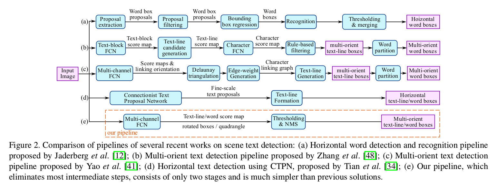
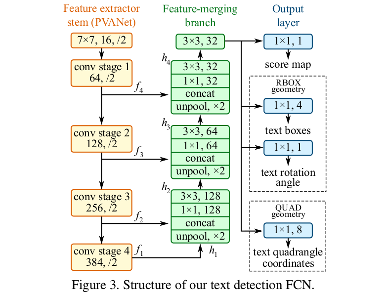
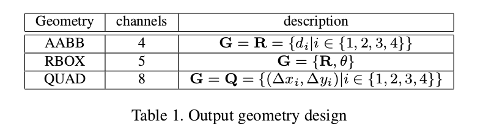
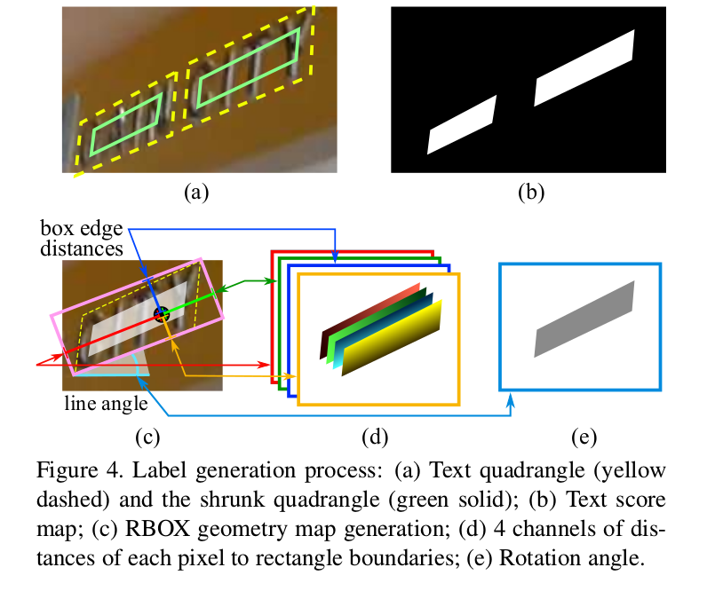
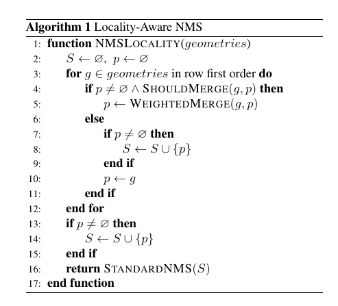
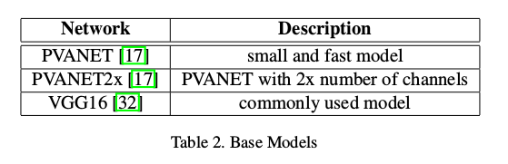
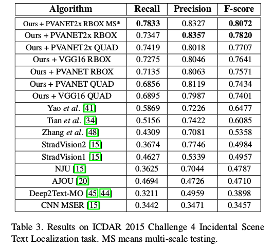
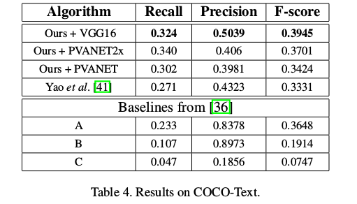
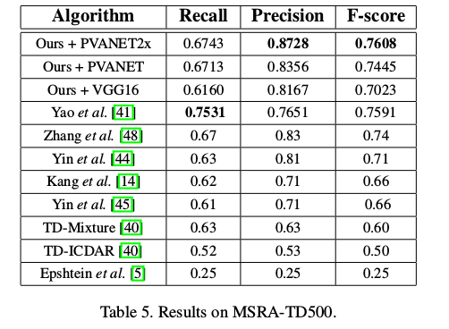

EAST: An Efficient and Accurate Scene Text Detector
=

# 1. Introduction
无论是传统还是基于深度神经网络的方法通常包含几个阶段和部分，其可能是次优和耗时的。因此这些方法的准确率和效率仍然难以满足。本文提出一种仅包含两个阶段的快速而准确的场景文本检测管道。这种管道利用全卷积网络（FCN）直接产生单词或者文本线级预测，不包含冗余和较慢的中间步骤。产生的文本预测（可以是旋转矩形，也可以是四边形）被送入非极大值抑制以产生最终结果。相比于已存在的方法，所提出的算法获得显著加强的性能，同时运行更快。

本文的贡献包括一下三个方面：
- 我们提出的场景文本检测方法包含两个阶段：全卷积网络和NMS融合阶段。FCN直接产生文本区域，不包括冗余和耗时的中间步骤。
- pipeline可以灵活地生产单词级或文本线级预测，其几何形状可以是旋转框，也可以是四边形，这依赖于特定的任务。
- 所提出的算法在准确率和速度上都由于历史最佳方法。

# 2. Related Work
传统方法依靠手工设计的特征。基于Stroke Width Transform（SWT）和Maximally Stable Extremal Regions（MSER）的方法通常通过边缘检测（edge detection）或极值区域提取（extremal region extraction）来搜索字符候选。Zhang等[47]使用文本的局部对称特性，并设计不同的特征用于文本区域检测。FASText[2]是一种快速文本检测系统，它调整和修著名的FAST关键点检测器以进行笔划提取。然而，这些方法在准确率和适应性方面，远落后基于深度神经网络的方法，特别是在处理具有挑战性场景，例如低分辨率和几何扭曲。

最近，场景文本检测已进入深度神经网络的新时代。黄等人[11] 首先使用MSER找到候选区域，然后使用深度卷积网络作为强大的分类器来修剪假阳性。Jaderberg等人以滑动窗口的形式扫描图像，并使用卷积神经网络模型为每个尺度产生密集的热图。后来，Jaderberg等人采用CNN和ACF来捕获单词候选，并使用回归进一步精炼候选。Tian等人开发了垂直anchor，并构建CNN-RNN联合模型以检测水平文本线。不同这些方法，张等人提出使用FCN以产生热图，并使用部分映射以进行方向估计。这些方法在基准测试上获得令人兴奋的性能，但是，如图2（a-d）所示，它们大多包含讴歌阶段和部分，例如通过后续过滤、候选聚合、线组成和单词划分移除false positive。多个阶段和组件可能需要进行详尽的调整，从而导致次优性能，并增加整个流水线的处理时间。

# 3. Methodology
## 3.1. Pipeline

我们的pipeline如图2（e）所示。该算法遵循DenseBox的设计，其中将图像馈入FCN，并聚合像素级文本得分图的多个通道和几何性。

其中一个预测通道是像素值在 $[0, 1]$ 之间的得分图。其余通道表示从每个像素的角度包围该单词的几何。分数代表在相同位置预测的几何形状的置信度。

我们为两种文本区域（旋转框：RBOX，四边形：QUAD）的几何形状进行了实验，并为每个几何设计不同的损失函数。然后将阈值应用到每个预测的区域，其中得分超过预定义阈值的几何被视为有效的，并且被保存以用于后面的非极大值抑制。NMS的结果视为管道的最终输出。

## 3.2 Network Design
在设计用于文本检测的神经网络时，几个因素必须被考虑。由于单词区域（如图5所示）剧烈地变化，确定较大单词的存在性需要来自神经网络的后期阶段的特征；而预测包围较小单词区域的准确几何性需要早期层的低级信息。因此，网络必须使用来自不同层的特征以满足这些要求。HyperNet[19]在特征图上满足这些条件，但在大特征映射上合并大量通道会显着增加后续阶段的计算开销。

为了处理这个问题，我们采用来自U-Net的观点以渐进地融合特征图，同时保持较小的上采样分支。最终得到的网络既可以利用不同级别的功能，又可以保持较低的计算成本。

我们模型的示意图如图3所示。模型可以分解成三个部分：特征提取器stem、 特征融合分支（branch）和输出层。

stem可以是ImageNet数据集上预训练的卷积神经网络，包含交错卷积和池化层。四个级别的特征图（表示为 $f_i$）从stem上提取，其大小分别为输入图像的 $\frac{1}{32}$、 $\frac{1}{16}$、 $\frac{1}{8}$ 和 $\frac{1}{4}$ 。我们的实验中，也采用著名的VGG16模型，其中提取的特征图从pooling-2到pooling-5 。

在特征图融合分支中，我们渐进地融合它们：
$$
g_i =
\begin{cases}
unpool(h_i) & \mbox{ if } i \le 3  \\
conv_{3 \times 3}(h_i) & \mbox{ if } i =4
\end{cases}  \tag 1
$$
$$
h_i =
\begin{cases}
f_i  & \mbox{ if }  i = 1  \\
conv_{3\times3}(conv_{1 \times 1}([g_{i-1}; f_i])) & \mbox{ otherwise}
\end{cases}  \tag 2
$$
其中 $g_i$ 是融合基， $h_i$ 是融合的特征图， 操作 $[\cdot; \cdot]$ 表示沿通道轴联结。在每个融合阶段，最后阶段的特征图首先馈入unpooling层以加倍其尺寸，然后将它们拼接到当前特征图。接着，使用 $conv_{1\times1}$ 以降低通道数和减小计算量，后跟一个conv_{3\times3}融合信息以产生该融合阶段的输出。最后的融合阶段中，conv_{3\times3} 层产生融合分支的最终特征图，并将其馈入输出层。

每个卷积层的输出通道数如图3 。我们保持分支中的卷积的通道数较小，其在stem上仅添加少量的计算开销，使得网络计算高效。最终输出层包含若干conv_{1\times1}操作以将32个通道的特征映射投影到1通道的得分图 $F_s$ 和多通道几何图 $F_g$ 中。几何输出可以使RBOX，也可以是QUAD，如表1 。

对于RBOX，几何性通过四通道的轴对齐边界框（axis-aligned bounding box: AABB）$R$ 和 1通道的旋转角度 $\theta$ 表示。$R$ 的公式与DenseBox中的公式相同，其中4个通道分别表示从像素位置到矩形的顶部、右侧、底部、左侧边界的4个距离。

对于QUAD $Q$ ，使用8个数表示从四边形的角顶点 $p_i|i \in \{1, 2, 3, 4\}$ 到像素位置的坐标偏移。每个距离偏移包含两个数 $(\Delta x_i, \Delta y_i)$ ，几何性输出包含8个通道。

## 3.3. Label Generation
### 3.3.1 Score Map Generation for Quadrangle
不失一般性，特征图上的四边形正类区域设计为原始区域的大致缩放版本，如图4（a）所示。

对于四边形 $Q = \{p_i | i\in\{1, 2, 3, 4\}\}$ ，其中 $p_i = \{x_i, y_i\|$ 顺时针顺序的四边形的顶点。为了缩放 $Q$ ，首先为每个顶点 $p_i$ 计算一个参考长度（reference length） $r_i$ ：
$$
\begin{alignat}{10}
r_i = \min(D(p_i, p_{(i \mod 4) + 1}), \\
D(p_i, p_{(p_i, p_{(i+3) \mod 4}) + 1}))
\end{alignat}
\tag 3
$$
其中 $D(x_i, y_i)$ 是 $p_i$ 和 $p_j$ 的 $L_2$ 距离。

首先，缩放四边形两条较长的边，然后缩放两条较短的边。对于两条相对的边对，通过比较它们长度的均值来确定“较长”的对。对于每条边 $<p_i, p_{(i \mod 4) + 1}>$ ，我们通过将两个端点沿着边缘向内移动 $0.3r_i$ 和 $0.3r（i \mod 4）+1$ 来缩小它。

### 3.3.2 Geometry Map Generation
如3.2节讨论的，几何图可以是RBOX或QUAD中之一。RBOX的生成过程如图4（c-e）所示。

对于文本区域以QUAD风格（例如ICDAR2015）标注的文本区域，首先，生成覆盖文本区域的、具有最小面积的旋转矩形。然后，对于正类得分的每个像素，计算它到文本框的4个边界的距离，并将它们放到RBOX ground-truth的4个通道中。对于QUAD ground-truth，在8通道几何图中具有正分数的每个像素的值是其四边形的4个顶点的坐标偏移。

## 3.4. Loss Functions
损失函数为
$$L = L_s + \lambda_g L_g  \tag 4$$
其中 $L_s$ 和 $L_g$ 分别表示得分图和几何性的损失， $\lambda_g$ 是两个损失的权重。本文，设置 $\lambda_g$ 为 1 。

### 3.4.1 Loss for Score Map
在大多数历史最优的检测管道中，训练图像通过平衡采样和hard negative mining精心处理，以解决目标物体的不平衡分布[9,28]。这样做可能会提高网络性能。然而，使用如此的技术不可避免地引入不可微阶段和更多参数调整以及更复杂的管道，其与我们的设计原则矛盾。

为了简化训练过程，我们使用[38]中引入的类平衡交叉熵，由下式给出
$$
\begin{alignat}{0}
L_s = balanced-xent(\hat{Y}, Y^\ast) \\
=-\beta Y^\ast \log \hat{Y} - (1 - \beta)(1 - Y^\ast) \log(1 - \hat{Y})
\end{alignat}  \tag 5
$$
其中 $\hat{Y} = F_s$ 是得分图的预测， $Y^\ast$ 是ground-truth。参数 $\beta$ 是正类和负类样本之间的平衡因子，由下式给出
$$
\beta = 1 - \frac{\sum_{y^\ast\in Y^\ast} y^\ast}{|Y^\ast|}  \tag 6
$$

### 3.4.2 Loss for Geometries
 文本检测的一个挑战是自然图像中的文本大小剧烈变化的。直接使用 L1或L2损失用于回归引导损失的偏向更大和更长的文本区域。由于我们需要为大和小的文本区域生成准确的文本几何预测，回归损失应该是尺度不变的。因此，我们在RBOX的AABB部分使用IoU损失，以及为QUAD回归使用尺度规范的smoothed-L1损失。

 **RBOX** 对于AABB部分，我们采用Unitbox中的IoU损失，因此针对不同尺度的对象是不变的。
 $$L_{AABB} = -\log IoU(\hat{R}, R^\ast) = -\log \frac{|\hat{R} \cap R^\ast|}{|\hat{R} \cup R^\ast|} \tag 7$$
其中 $\hat{R}$ 表示预测的AABB几何，而 $R^\ast$ 是其对应的ground-truth。很容易知道交集矩形 $\hat{R} \cap R^\ast$ 的宽和高为
$$
\begin{align}
w_i = \min(\hat{d}_2, d_2^\ast) + \min(\hat{d}_4, d_4^\ast) \\
h_i = \min(\hat{d}_1, d_1^\ast) + \min(\hat{d}_3, d_3^\ast)
\end{align} \tag 8
$$
其中 $d_1$ 、$d_2$ 、 $d_3$ 和 $d_4$ 表示像素到对应矩形的顶部、右侧、底部和左侧边界的距离。并集区域为
$$|\hat{R}\cup R^\ast| = |\hat{R}| + |R^\ast| - |\hat{R} \cap R^\ast| \tag 9$$
因此，交/并都可以轻松地计算。接下来，旋转角度损失计算如下
$$L_{\theta}(\hat{\theta}, \theta^\ast) = 1 - \cos(\hat{\theta} - \theta^\ast) \tag {10}$$
其中 $\hat{\theta}$ 为旋转角度的预测，$\theta^\ast$ 表示ground-truth。最终，综合几何损失为AABB损失和角度损失的权重和，计算如下
$$L_g = L_{AABB} + \lambda_{\theta} L_{\theta}  \tag{11}$$
其中 $\lambda_{\theta}$ 设置为 10 。

请注意，无论旋转角度如何，我们都会计算 $L_{AABB}$ 。当角度完美预测时，这可以视为四边形IoU的近似。虽然在训练期间并非如此，但它仍然可以为网络施加正确的梯度以学习预测 $\hat{R}$ 。

**QUAD** 我们通过添加额外的设计用于单词四边形的规范化项来扩展smooth-L1损失，其在一次检测中通常比较长。令 $Q$ 的所有坐标值为一个有序集合
$$C_Q = \{x_1, y_1, x_2, y_2, \cdots, x_4, y_4\}  \tag{12}$$
然后损失可写为
$$
\begin{alignat}{0}
L_g = L_{QUAD}(\hat{Q}, Q^\ast)  \\
=\min_{\tilde{Q}\in P_{Q^\ast}}\sum_{c_i\in C_Q, \tilde{c}_i \in C_{\tilde{Q}}} \frac{smooth_{L1}(c_i, \tilde{c}_i)}{8 \times N_Q^\ast}
\end{alignat}  \tag{13}
$$
其中规范化项 $N_{Q^\ast}$ 是四边形的短边长度，由下式给出
$$N_{Q^\ast} = \min_{i=1}^4 D(p_i, p_{(i \mod 4) + 1}) \tag{14}$$
并且 $P_Q$ 是所有的具有不同顶点顺序的 $Q^\ast$ 的等价四边形。由于公共训练数据集中的四边形注释不一致，因此需要这种排序排列。

## 3.5. Training
网络使用Adam优化器端到端训练。为了加速学习，我们均匀地从图像上剪裁 $512 \times 512$ 的块以组成大小为32的mini-batch。Adam的学习率从 $1e-3$ 开始，每27300个mini-batch时衰减十分之一，并停止于 $1e-5$ 。网络训练至性能停止提升。

## 3.6. Locality-Aware NMS
为了构成最终结果，阈值处理后留下来的几何形状应该由NMS合并。朴素的NMS算法时间复杂度为 $O(n^2)$ ，其中 $n$ 是候选几何形状的数量，这是不可接受的，因为我们正面临来自密集预测的数以万计的几何形状。

假设来自附近像素的几何图形往往高度相关，我们建议逐行合并几何图形，同时在同一行中合并几何图形时，我们将迭代地合并当前遇到的几何图形和最后合并的几何图形。这种改进的技术在最佳场景中以 $O(n)$ 运行。尽管最坏的情况与朴素的情况相同，只要位置假设成立，算法在实践中运行得足够快。 该过程总结在算法1中。

值得注意的是，在 $W_{EIGHTED}M_{ERGE}(g, p)$ 中，合并四边形的坐标通过两个给定四边形的得分进行加权平均。再具体一点，如果 $a=W_{EIGHTED}M_{ERGE}(g, p)$, $a_i = V(g)g_i + V(p)p_i$， $V(a) = V(g) + V(p)$ ，其中 $a_i$ 是 $a$ 中下标为 $i$ 的坐标之一， $V(a)$ 是几何 $a$ 的得分。

实际上，“平均（averaging）”而非“选择（selecting）”几何形状存在一个微妙的差异，就像在标准NMS程序中那样，作为投票机制，这反过来在馈入视频时引入稳定效果。尽管如此，我们仍然采用“NMS”这个词来进行功能描述。

## 4.2. Base Networks
表2给出了几种即网络

