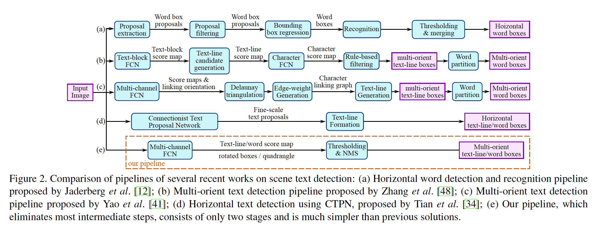
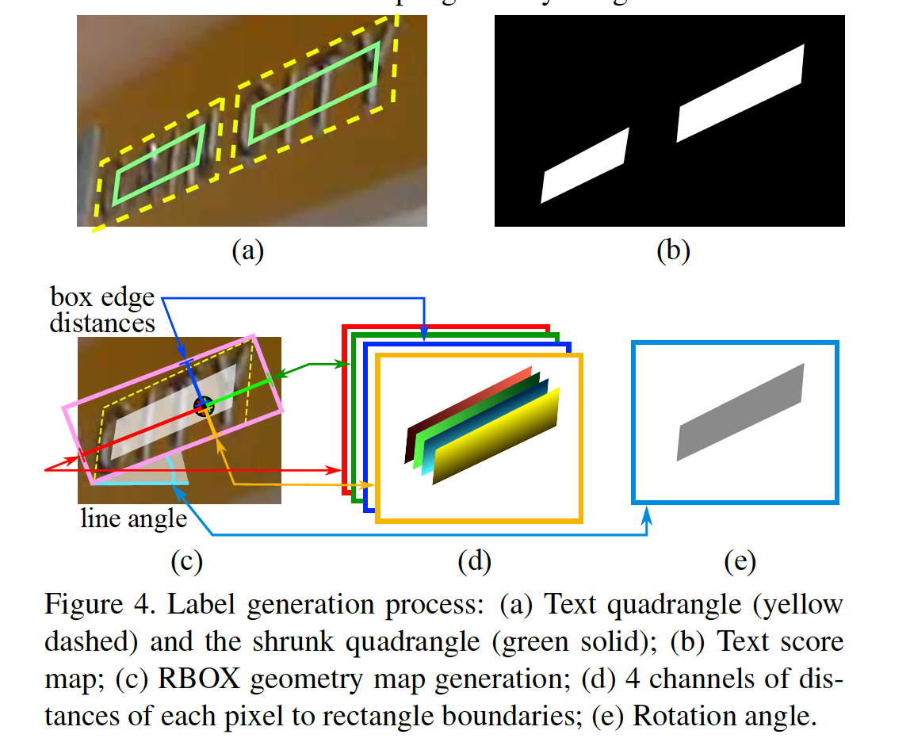
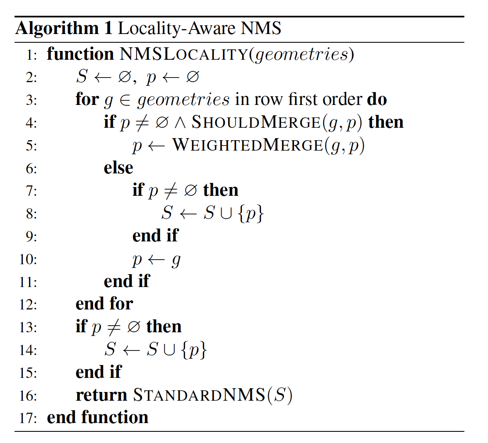
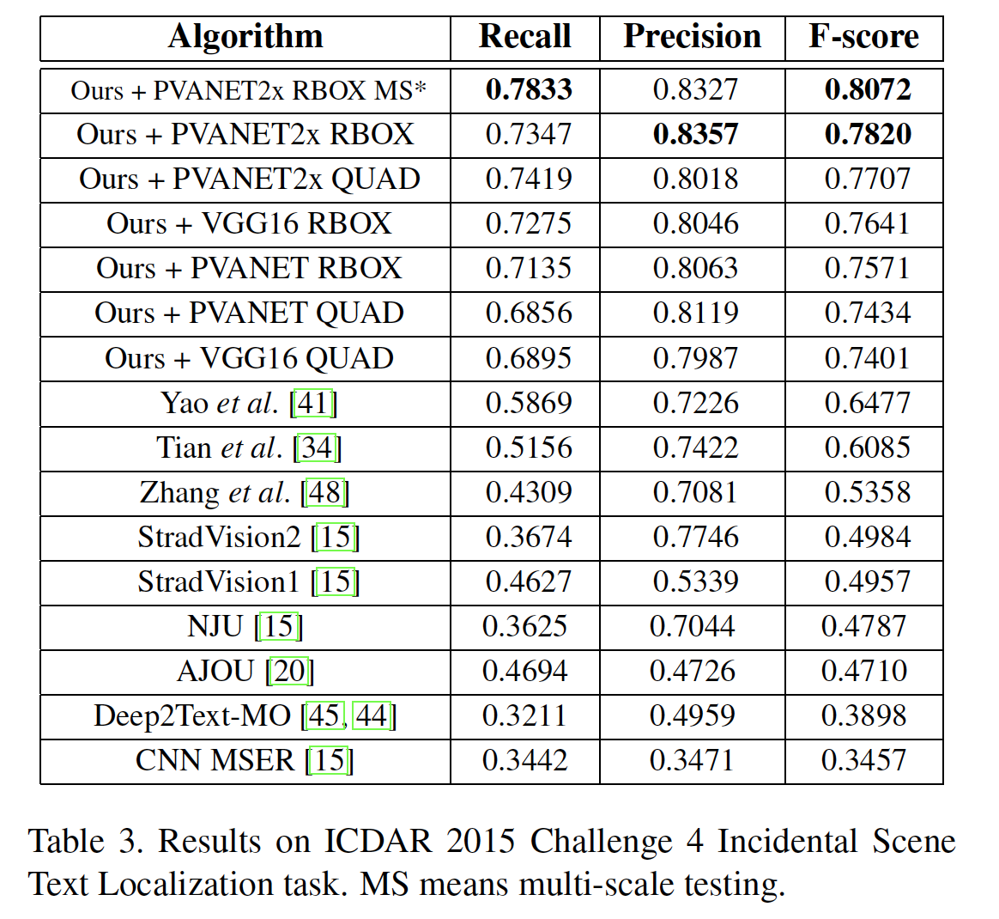

## EAST: An Efficient and Accurate Scene Text Detector

### Abstract

​		以前的场景文本检测方法已经在各种基准测试中取得了可喜的性能。但是，即使在配备有深度神经网络模型的情况下，它们在处理具有挑战性的场景时通常也达不到要求，因为总体性能取决于管道中多个阶段和组件的相互作用。本文中，我们提出一种简单而强力的管道，其在自然场景中产生快速而准确的文本检测。该管道直接预测单幅图像中任意方向和四边形形状的单词或文本行，从而通过单个神经网络消除了不必要的中间步骤（例如候选聚合和单词划分）。我们管道的简单性使您可以集中精力设计损失函数和神经网络架构。标准数据集（包括ICDAR2015、COCO-Text和MSRA-TD500）上的实验证明所提出的算法，在准确率和效率方面明显优于历史最佳的方法。在ICDAR2015数据上，所提出的算法在720p分辨率上以13.2fps的速度获得0.7820的F-score。

### 1. 本文贡献

- 提出一种场景文本检测方法，其包含两个阶段：全卷积网络（FCN）和NMS融合阶段。FCN直接产生文本区域，不包括多余且耗时的中间步骤。
- 管道可以灵活地生成字级或行级预测，根据特定应用，其几何形状可以旋转为方框或四边形。
- 所提出算法在准确率和速度方面都有雨历史最佳方法。

### 2. 方法

#### 2.1. Pipeline

​		我们的管道的如图2（e），算法遵循DenseBox的一般设计，其中图像馈入FCN，并生成多个通道的像素级文本得分图和geometry。预测通道之一是得分图，其像素值位于$[0,1]$之间。其余通道表示从每个像素的角度将单词括起来的几何形状。得分表示同一位置预测的几何形状的置信度。

​		我们为文本区域试验了两种几何形状（旋转边界框（rotated box：RBOX）和四边形（quadrangle：QUAD）），并为每个几何形状设计了不同的损失函数。然后将阈值用于每个预测区域，其中得分高于预定义的阈值的几何形状视为有效，并留下来用于后面的NMS。NMS后的结果作为管道的最终预测。

#### 2.2. 网络设计

​		设计文本检测的神经网络时，必须考虑几个因素。因为单词区域变化剧烈（如图5），要确定大型单词的存在，就需要神经网络后期阶段的特征；而预测包含小型单词区域的准确几何形状需要早期阶段的低级信息。因此，网络必须使用不同层的特征来吗俎这些需求。我们采用U-shape的思想来渐进地融合特征图，同时保持上采样分支较小。最终得到了一个既可以利用不同级别的功能又可以保持少量计算成本的网络。

​		我们的模型的示意图如图3所示。模型可以分解为三个部分：特征提取器stem、特征融合分支和输出层。

​		stem可以时ImageNet预训练的卷积网络，具有交织的卷积层和池化层。从stem上提出特征图的四层（表示为$f_i$），它们的尺寸分别是输入图像的$\frac{1}{32}$、$\frac{1}{16}$、$\frac{1}{8}$和$\frac{1}{4}$。图3中，PVANet是著名的VGG16模型，其中提取pooling-2到pooling-5的特征图。

​		在特征融合分支中，我们渐进式的融合它们：

$$g_i=\begin{cases}\mbox{unpool}(h_i) &\mbox{if } i\le3 \\ \mbox{conv}_{3 \times 3}(h_i) &\mbox{if } i=4\end{cases}\tag{1}$$

$$h_i = \begin{cases}f_i &\mbox{if } i=1 \\ \mbox{conv}_{3\times 3}(\mbox{conv}_{1\times1}([g_{i-1};f_i])) & \mbox{otherwise} \end{cases}\tag{2}$$

其中$g_i$是融合基，$h_i$为融合特征图，$[\cdot;\cdot]$表示沿通道轴拼接。在每个融合阶段，后一阶段的特征图首先馈入unpooling层以加倍尺寸，然后与当前特征图拼接。接着，使用一个$\mbox{conv}_{1\times1}$减小通道数和计算，接着是用一个$\mbox{conv}_{3\times3}$来融合信息以产生这一融合阶段的最终输出。最后的融合阶段之后，$\mbox{conv}_{3\times3}$产生融合分支的最终特征图，并将其馈入输出层。

​		每个卷积的输出通道数如图3所示。 我们保持分支中的卷积通道数较小，这仅在stem之上添加了小部分的计算，使网络保持计算高效。最后的输出层包含几个$\mbox{conv}_{1\times1}$，它们将32通道的特征图映射到1通道的得分图$F_s$和多通道几何形状图$F_g$。几何形状输出可以是RBOX或QUAD，总结在表1中。

​		对于RBOX，几何形状表示轴对齐的边界框（AABB）$\mathbf{R}$和1通道的旋转角度$\theta$。$\mathbf{R}$的形式与[9]相同，其中4个通道分别表示像素位置到矩形上、右、下和左边界的距离。

​		对于QUAD $\mathbf{Q}$，我们使用8个数来表示四边形的四个角$\{p_i|i\in\{1,2,3,4\}\}$到像素位置的偏移。因为距离偏移包含两个数$(\Delta x_i, \Delta y_i)$，所以几何形状输出包含8个通道。

#### 2.3. Label Generation

##### 2.3.1	Score Map Generation for Quadrangle

​		不失一般性，我们仅考虑几何形状是四边形的情况。得分图上四边形的正类区域设计为原始图的缩小版本，如图4（a）所示。对于一个四边形$\mathbf{Q}=\{p_i|i\in\{1,2,3,4\}\}$，其中$p_i=\{x_i,y_i\}$是四边形中顺时针方向的顶点。为了缩小$\mathbf{Q}$，我们首先为每个顶点计算一个参考长度（reference length）$r_i$：

$$\begin{align}r_i = \min(&D(p_i, p_{(i\mod 4)+1}), \\ &D(p_i, p_{((i+3) \mod 4) + 1}))\end{align} \tag{3}$$

其中$D(p_i, p_j)$是$p_i$和$p_j$之间的$L_2$距离。

​		我们首先缩小四边形的两个较长边，然后缩小两个较短边。对于每对相反的变，我们通过比较它们长度的均值来确定谁更长。对于每条边$\langle p_i, p_{(i \mod 4) + 1} \rangle$，我们通过沿边缘向内分别移动两个端点$0.3r_i$和$0.3r_{(i \mod 4)+1}$来缩小它。

​		RBOX的生成过程如图4（c-e）。

##### 2.3.2	Geometry Map Generation

​		对于文本区域标注为QUAD风格（例如ICDAR2015）的数据集，我们首先生成旋转的矩形，其以最小的面积覆盖该区域。然后，对于每个具有正类得分的像素，我们计算其到文本框4个边界的距离，并将它们放置到RBOXground-truth的4个通道中。对于QUAD ground-truth，8通道几何形状图中具有正类得分的每个像素的值为其到四边形4哥顶点的偏移。

#### 2.4. Loss Functions

​		损失函数可以表示为

$$L = L_s +\lambda_g L_g \tag{4}$$

其中$L_s$和$L_g$分别表示得分图和几何形状的损失，$\lambda_g$权重是两个损失的重要性。本文中，我们设置$\lambda_g$为1。

##### 2.4.1	Loss for Score Map

​		在大多数最先进的检测管道中，训练图像通过平衡采样和硬性负挖掘进行仔细处理，以解决目标对象的不平衡分布[9，28]。这样做可能会改善网络性能。 但是，使用这样的技术不可避免地会引入不可微的阶段和更多的参数来进行调整以及更复杂的管道，这与我们的设计原理相矛盾。

​		为了简化训练过程，我们使用[38]中引入的类平衡交叉熵：

$$\begin{align}L_s &= \mbox{balanced-xent}(\hat{\mathbf{Y}}, \mathbf{Y}^\ast) \\ &=-\beta \mathbf{Y}^\ast \log \hat{\mathbf{Y}} - (1-\beta)(1-\mathbf{Y}^\ast)\log(1-\mathbf{\hat{Y}})\end{align} \tag{5}$$

其中$\hat{\mathbf{Y}} = F_s$是得分图的预测，$\mathbf{Y}^\ast$是ground-truth。参数是正负样本之间的平衡参数：

$$\beta = 1 - \frac{\sum_{y^\ast \in \mathbf{\mathbf{Y}^\ast}}y^\ast}{|\mathbf{Y}^\ast|}\tag{6}$$

##### 2.4.2	Loss for Geometries

​		文本检测的一大挑战是自然场景中的文本大小变化剧烈。直接使用L1或L2算好进行回归将导致损失偏向更大、更长的文本区域。因为我们需要准确地预测大型和小型文本区域的几何形状，所以回归损失应当是尺度不变的。因此，我们在RBOX的AABB部分采用IoU损失，为QUAD回归使用尺度归一化的smoothed-L1损失。

**RBOX**	对于AABB部分，我们采用[46]中的IoU损失，因为它对于不同尺度的目标是不变的。

$$L_{\mbox{AABB}}=-\log \mbox{IoU}(\hat{\mathbf{R}}, \mathbf{R}^\ast) = \log \frac{|\hat{\mathbf{R}} \cap \mathbf{R}^\ast|}{|\hat{\mathbf{R}}\cup\mathbf{R}^\ast|}\tag{7}$$

其中$\mathbf{\hat{R}}$表示预测的AABB，$\mathbf{R}^\ast$表示其对应的ground-truth。很容易地看出，交集矩形$|\mathbf{\hat{R}}\cap \mathbf{R}^\ast|$为

$$\begin{align}w_i & = \min(\hat{d}_2, d_2^\ast) + \min(\hat{d_4}, d_4^\ast) \\ h_i &= \min(\hat{d}_1, d_1^\ast) + \min(\hat{d}_3, d_3^\ast)\end{align} \tag{8}$$

其中$d_1$、$d_2$、$d_3$和$d_4$分别是其到相应矩形的上、右、下和左边界的距离。并集区域为

$$|\hat{\mathbf{R}} \cup \mathbf{R}^\ast| = |\hat{\mathbf{R}}| + |\mathbf{R}^\ast| - |\hat{\mathbf{R}} \cap \mathbf{R}^\ast|. \tag{9}$$

因此，交/并面积都可以轻松计算。接下来，旋转矩形的损失计算为

$$L_\theta(\hat{\theta}, \theta^\ast)= 1-\cos(\hat{\theta} - \theta^\ast). \tag{10}$$

其中$\hat{\theta}$是旋转角度的预测，$\theta^\ast$表示ground-truth。最后，综合损失是AABB损失和角度损失的加权和：

$$L_g = L_{AABB} + \lambda_\theta L_\theta. \tag{11}$$

其中$\lambda_\theta$设置为10。

**QUAD**	通过添加为单词四边形设计的额外归一化项，我们扩展了[6]中提出的平滑L1损失，该单词通常在一个方向上更长。令$\mathbf{Q}$的坐标为一个有序集合

$$C_\mathbf{Q} = \{x_1, y_1, x_2, y_2, \cdots, x_4, y_4\} \tag{12}$$

然后，损失可以写为：

$$\begin{align}L_g &= L_{QUAD}(\hat{\mathbf{Q}}, \mathbf{Q}) \\ &=\min_{\tilde{Q}\in P_{\mathbf{Q}^\ast}} \sum_{c_i\in C_\mathbf{Q}, \tilde{c}_i\in C_{\tilde{Q}}}\frac{\mbox{smoothed}_{L1}(c_i - \tilde{c}_i)}{8 \times N_{\mathbf{Q}^\ast}}\end{align} \tag{13}$$

其中，归一化项$N_{\mathbf{Q}^\ast}$是四边形的短边长度，

$$N_{\mathbf{Q}^\ast} = \min_{i=1}^4 D(p_i, p_{i \mod 4} + 1), \tag{14}$$

而$P_{\mathbf{Q}}$是具有不同顶点顺序的$Q^\ast$的所有等价四边形的集合。由于公共训练数据集中的四边形注释不一致，因此需要这种顺序排列。

#### 3.5. Training

​		网络使用ADAM优化器端到端地训练。为了加速训练，从图像上均匀采样$512\times512$的裁剪块来组成大小为24的minibatch。ADAM的学习率从$1e-3$开始，每27300个mini-batch后衰减到十分之一，到$1e-5$时停止。训练网络直到性能不在提升。

#### 3.6. Locality-Aware NMS

​		为了形成最终结果，应通过NMS合并阈值后仍存在的几何形状。朴素的NMS算法时间复杂度为$O(n^2)$（其中$n$是候选几何形状的数量），这是不可接受的，因为我们面临着由密集预测产生的成千上万的几何形状。

​		在相邻像素的几何图形倾向于高度相关的假设下，我们建议逐行合并几何形状，并且在合并同一行中的几何形状时，我们将迭代地合并当前遇到的几何形状与最后合并的几何形状。在最佳场景中，改进技术的时间复杂度为$O(n)$。即使它的最坏情况与朴素一样，只要保持局部性假设，该算法在实践中也足够快地运行。该过程总结在算法1中。

​		值得注意的是，在$\mbox{WEIGHTED}(g,p)$中，合并的四边形的坐标通过两个给定的四边形的得分的加权平均。具体而言，如果$a=\mbox{WEIGHTED}\mbox{MERGE}(g,p)$，那么$a_i=V(g)g_i + V(p)p_i$和$V(a)=V(g)+V(p)$，其中$a_i$是$a$的下标为$i$的坐标之一，$V(a)$是几何形状$a$的得分——（**这一过程仅仅是合并得分图**）。

​		实际上，我们有一个微妙的区别，我们是“平均”而不是“选择”几何形状，就像在标准NMS过程中那样，它起着投票机制的作用，反过来在馈送视频时引入了稳定效果。尽管如此，在功能描述上我们仍然采用“NMS”一词。

### 3. Experiments

​		为了比较所提出的算法与已有的方法，我们根据三个公共基准进行了定性和定量实验：ICDAR2015、COCO-Text和MSRA-TD500。

#### 3.1. Benchmark Datasets

​		**ICDAR 2015** 用于ICDAR 2015 Robust Reading Competition[15]的Challenge 4 。它包含1500张图像，其中1000张图像用于训练，余下的图像用于测试。文本区域通过四边形的四个顶点标注，对应本文中的QUAD几何形状。我们还通过拟合具有最小面积的旋转矩形来生成RBOX输出。这些图像是Google Glass偶然拍摄的。因此，场景中的文本可以位于任意方向，或者遭遇运行模糊和低分辨率。我们还使用ICDAR 2013的229张训练图像。

​		**COCO-Text** 是迄今为止最大的文本检测数据集。它重用了MS-COCO数据集的图像。总共标注了63686张图像，其中选择43686张作为训练集，余下的20000张图像作为测试集。单词区域以轴对齐边界框（AABB）的形式标注，这是RBOX的特例。对于这个数据集，我们设置$\theta$为0。我们使用与ICDAR2015相同的数据处理和测试方法。

​		**MSRA-TD500** 包含300张训练图像和200张测试图像的数据集。文本区域具有任意方向和语句级标注。与其他数据集不同，它包含英文和中文文本。文本区域以RBOX格式标注。因为训练图像的数量太小而不足以学习深度模型，我们还利用HUSTTR400数据集[39]中的400张图像作为训练数据。

#### 3.2. Base Networks

​		因为除了COCO-Text外，与通用目标检测数据集相同，所有文本检测数据集相对较小，因此，如果将单个网络用语所有基准测试，那么可能遭遇过拟合或者欠拟合。我们使用三种不同的基网络、不同输出几何形状进行实验，在所有数据集上评估所提出的网络。这些网络总结在表2中。

​		**VGG16** 广泛用作基网络。该网络有两个缺点：（1）该网络的感受野较小，$\mbox{conv5_3}$的输出中的每个像素仅有196的感受野；（2）它是一个相当大的网络。

​		**PVANET** 是[17]引入的轻量网络，它旨在替代Faster-RCNN [28]框架中的特征提取器。由于对于GPU来说太小了，无法充分利用计算并行性，因此我们还采用了PVANET2x，它使原始PVANET的通道增加了一倍，从而利用了更多的计算并行性，同时运行速度比PVANET稍慢。细节见4.5节。最后的卷积层的输出的感受野是809，这远大于VGG16。

#### 3.3. Qualitative Results

#### 3.4. Quantitative Results

​	使用多尺度（0.5、0.7、1.0、1.4和2.0）测试。

#### 3.5. Speed Comparison

​		NVIDIA Titan X Maxwell architecture、 Intel E5-2670 v3 @ 2.30GHz CPU、720p输入。

