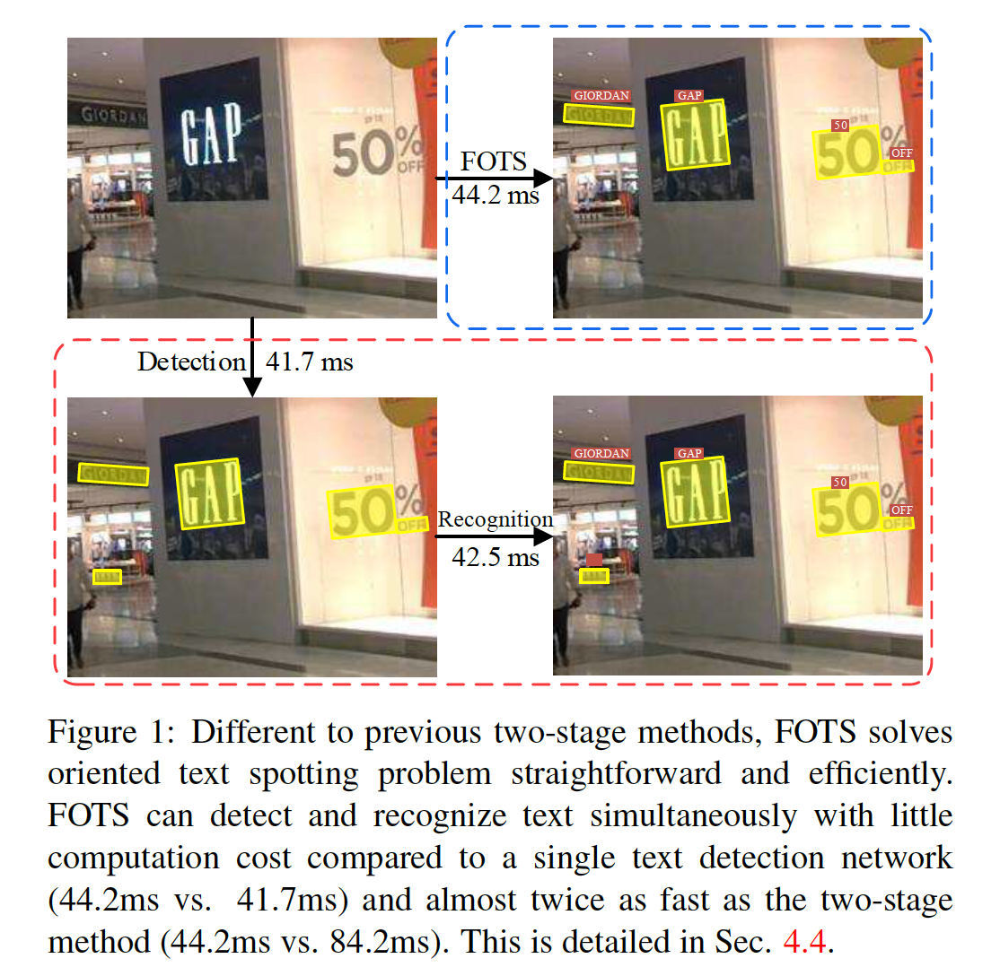
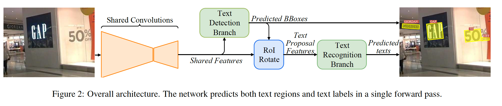
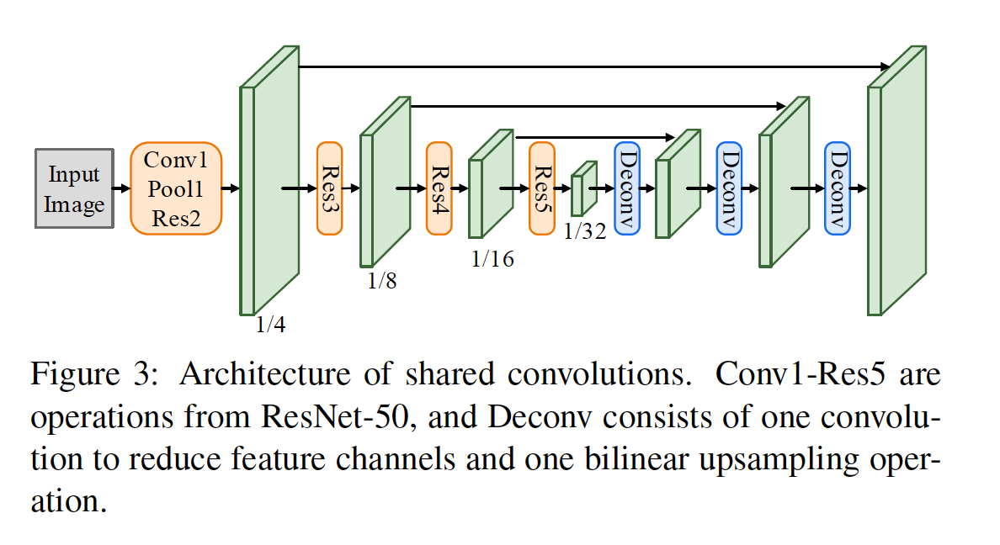
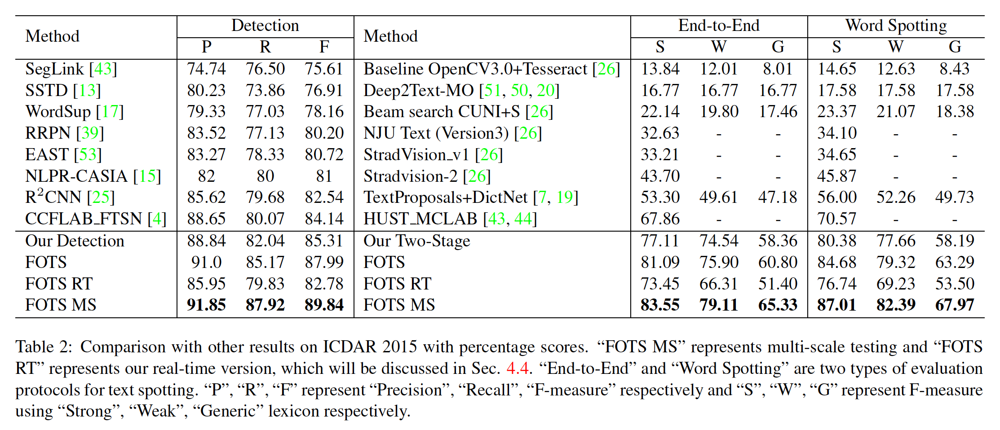
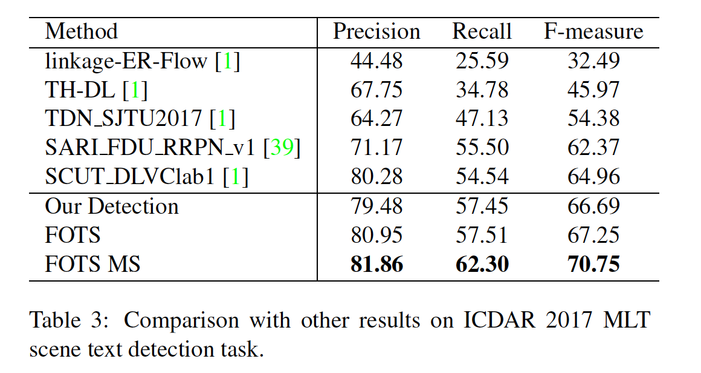
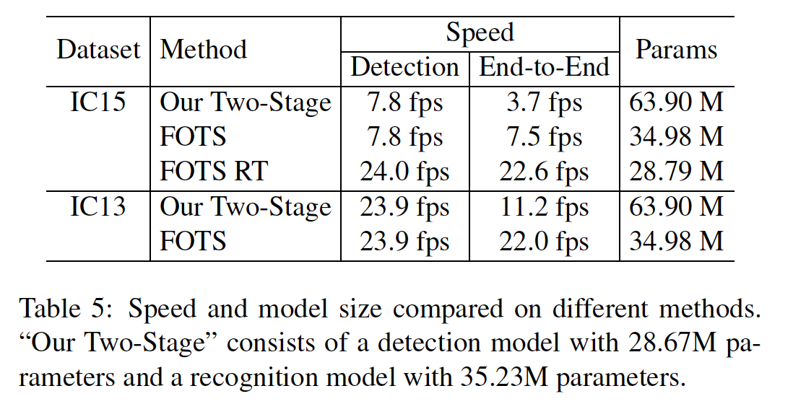

## FOTS: Fast Oriented Text Spotting with a Unified Network

### Abstract

​		附带场景文本spotting被认为是文档分析社区中最困难和最有价值的挑战之一。大多数已有的方法将文本检测和识别视作独立的任务。在这项工作中，作者提出一种统一的端到端的可学习的Fast Oriented Text Spotting（FOTS）网络，其同时进行检测和识别，并且在两个任务之中共享计算和视觉信息。具体而言，引入RoIRotate来共享检测和识别之间的卷积特征。受益于卷积共享策略，与基线文本检测网络相比，FOTS几乎没有计算开销，并且联合训练方法使该方法比那些两个阶段的方法表现更好。在ICDAR2015、ICDAR2017 MLT和ICDAR2013数据集上的实验表明，所提出的方法明显好于历史最佳方法，这进一步使作者能够开发出第一个实时定位的文本识别系统，该系统在保持ICDAR 2015文本识别任务的同时，保持22.6 fps的速度，比以前所有最新技术的结果高出5％以上。

### 1. Introduction

​		在文本识别中，在文本区域的顶部逐个进行用于顺序预测的网络[44，14]。 特别是对于具有多个文本区域的图像，这会导致沉重的时间成本。 另一个问题是它忽略了在检测和识别中共享的视觉线索之间的相关性。 单个检测网络无法通过文本识别中的标签进行监督，反之亦然。

​		本文中，作者提出同时考虑文本检测和识别。它产生可以端到端训练的fast oriented text spotting system（FOTS）。与先前的两阶段文本识别方法相比，本文的方法通过卷积神经网络学习更好的特征，这些特征在文本检测和文本识别之间共享。由于特征提取通常花费大部分时间，因此它将计算范围缩小到单个检测网络，如图1所示。连接检测和识别的关键是ROIRotate，其根据定向检测边界框从特征图上获得特征。

​		架构如图2所示。特征图首先利用共享卷积提取特征图。基于全卷积网络的定向文本检测分支构建在特征图之上，以预测检测边界框。RoIRotate算子从特征图上提取与检测结果相应的文本提议特征。然后将文本提议馈入RNN编码器和Connectionist Temporal Classification（CTC）解码器进行文本识别。因为网络中所有模块都是可微的，所以整个系统可以端到端训练。

​		本文的贡献：

- 提出端到端的可训练框架进行快速的文本识别。通过共享卷积特征，网络可以在几乎没有增加开销的情况下同时检测和识别文本，其产生实时速度。
- 引入RoIRotate，它是一种新的可微算子，其从卷积特征图上提取定向文本区域。这种操作将文本检测和识别统一到一个端到端的管道。
- FOTS在许多文本检测和text spotting基准上大大超越了最新方法，包括ICDAR 2015 [26]，ICDAR 2017 MLT [1]和ICDAR 2013 [27]。

#### 与《Towards end-to-end text spotting with convolutional recurrent neural networks》[33]的区别

​		[33]提出一种端到端的text spotting 方法，其使用受RPN启发的文本提议网络进行文本检测，以及使用具有注意力机制的LSTM进行文本检测。

区别：（1）本文引入RoIRotate，以及使用完全不同的文本检测算法来解决更复杂、更困难的场景，而[33]仅适合水平文本。（2）在速度和性能方面，本文的方法远比[11]好，特别是几乎没有成本的文本识别步骤确保text spotting实时运行，而[33]花费900ms来处理$600 \times 800$像素的输入图像。

### 2. 方法

​		FOTS是一种端到端的可训练框架，其同时检测和识别自然场景图像中的所有单词。它包含四个部分：shared convolution、text detection branch、RoIRotate operation 和 text recognition branch。

#### 2.1. Overall Architecture

​		本文的框架如图2所示。文本检测分支和识别分支的共享卷积特征，共享网络的架构如图3所示。共享网络的骨干是ResNet-50。受FPN的启发，网络拼接低级特征图和高级特征图。由共享卷积产生的特征图的分辨率是输入图像的$1/4$。文本检测分支使用共享卷积产生的特征输出密集的逐像素的文本预测。利用文本检测分支产生的定向文本区域提议，所提出的RoIRotate将对应的共享特征转换为固定高度的表示，同时保持原始区域的纵横比。最后，文本识别分支识别区域提议中的单词。CNN和LSTM用于编码文本序列信息，后面是一个CTC解码器。表1展示了文本识别分支的结构。

#### 2.2. 文本检测分支

​		本文采用全卷积网络作为文本检测器。由于自然场景图像中存在大量小型文本边界框，在共享卷积中，将特征图的大小从原始图像的$1/32$上采样到$1/4$。提取共享特征后，应用一个卷积以输出要呈现的文本的密集逐像素预测。第一个通道计算每个像素为正类样本的概率。与[53]相似，**原始文本区域的缩小版中像素视为正类**。对于每个正类样本，用四个通道预测其到包含该像素的上、下、左、右边的距离，而最后一个通道预测相关边界框的方向。最后，使用阈值和NMS到这些正类样本而产生最终检测结果。

​		在我实验中，作者观察到许多类似于文本笔划的模式很难分类，例如栅栏、格子等。因此，实验中使用OHEM更好地区分这些模式，这还解决了类不平衡问题。在ICDAR2015数据集上，将F值提高大约2%。

​		检测分支的损失函数包含两个部分：文本分类和边界框回归。文本分类可以视为下采样得分图上的逐像素分类损失。仅将原始文本区域的缩小版视为正类区域，而边界框和缩小版之间的区域视为“NOT CARE”，不会对分类损失作出贡献。将得分图中由OHEM选择的正类元素集表示为$\Omega$，分类损失函数可以表示为：

$$\begin{align}L_{\mbox{cls}}&=\frac{1}{|\Omega|}\sum_{x\in\Omega}H(p_x, p_x^\ast) \\ &=\frac{1}{|\Omega|}\sum_{x\in\Omega}(-p_x^\ast \log p_x - (1 - p_x^\ast)\log(1-p_x))\end{align}\tag{1}$$

其中$|\cdot|$是集合中元素的数量，$H(p_x,p_x^\ast)$表示得分图的预测$p_x$与表示文本或非文本的二值标签$p_x^\ast$之间的交叉熵损失。

​		对于分类损失，采用IoU损失和旋转角损失，因为它们对目标形状、尺度和方向具有鲁棒性：

$$L_{\mbox{reg}}=\frac{1}{|\Omega|}\sum_{x\in\Omega}\mbox{IoU}(\mathbf{R}_x, \mathbf{R}_x^\ast) + \lambda_\theta(1 - \cos(\theta_x, \theta_x^\ast)) \tag{2}$$

这里，$\mbox{IoU}(\mathbf{R}_x, \mathbf{R}_x^\ast)$是预测边界框$\mathbf{R}_x$与ground-truth $\mathbf{R}_x^\ast$之间的IoU损失。第二项是旋转角损失，其中$\theta_x$和$\theta_x^\ast$分别表示预测方向和ground-truth方向。实验中，将超参数$\lambda_\theta$设置为10。

​		因此，完整的检测损失可以写为：

$$L_{\mbox{detect}}=L_{\mbox{cls}} + \lambda_{\mbox{reg}}L_{\mbox{reg}}\tag{3}$$

其中超参数$\lambda_{reg}$平衡两项损失，实验中，将其设置为1。

#### 2.3. RoIRotate

​		RoIRotate对定向的特征区域进行变换以获得轴对齐的特征图，如图4所示。这项研究中，固定输出高度，并保持纵横比不变以处理文本长度的变化。与RoI pooling和RoIAlign相比，RoIRotate提供更通用的RoI提取特征操作。作者比较RRPN中的RRoI池化。RRoI池化通过最大池化将旋转区域转换为固定尺寸的区域，并使使用双线性插值来计算输出的值。这种操作避免RoI和提取特征之间的不对齐，此外，它还使输出特征的长度可变，这更适合于文本识别。

​		这一过程可以分为两个步骤。首先，通过文本提议的预测或ground-truth计算仿射变换参数。然后，将仿射变换分别应用于每个区域的共享特征图，并获得文本区域的标准水平特征图。第一步可以表示为：

$$t_x = l \ast \cos \theta - t \ast \sin\theta - x \tag{4}$$

$$t_y = l \ast \cos\theta + l \ast \sin\theta - y\tag{5}$$

$$s = \frac{h_t}{t + b}\tag{6}$$

$$w_t = s \ast (l + r) \tag{7}$$

$$\begin{align}\mathbf{M} &= \begin{bmatrix}\cos \theta & -\sin\theta &0 \\ \sin\theta &\cos\theta & 0 \\0 &0 &1 \end{bmatrix}\begin{bmatrix}s &\theta &0 \\ 0 &s &0 \\ 0 &0 &1\end{bmatrix}\begin{bmatrix}1 &0 & t_x \\ 0 &1 &t_y \\0 &0 &1\end{bmatrix}\\&=s\begin{bmatrix}\cos\theta &-\sin\theta &t_x\cos\theta -t_y \sin\theta \\ \sin\theta &\cos\theta &t_x\sin\theta + t_y \cos\theta \\ 0 &0 &\frac{1}{s}\end{bmatrix}\end{align}\tag{8}$$

其中$\mathbf{M}$是仿射变换矩阵。$h_t,w_t$表示放射变换后特征图的高度（本文的设置中等于8）和宽度。$(x,y)$表示共享特征图中像素点的坐标，$(t,b,l,r)$分别表示像素点到文本提议的上、下、左、右边的距离，$\theta$表示方向。通过ground truth或检测分支废除$(t,b,l,r)$和$\theta$。

​		利用变换参数，使用放射变换可以轻易产生最终的RoI特征：

$$\begin{pmatrix}x_i^s \\ y_i^s \\ 1\end{pmatrix} = \mathbf{M}^{-1}\begin{pmatrix}x_i^t \\ y_i^t \\ 1 \end{pmatrix}\tag{9}$$

对于$\forall i \in [1, \cdots, h_t],\forall j \in [1, \cdots, w_t], \forall \in [1, \cdots, C]$，

$$V_{ij}^c = \sum_{n}^{h_s}\sum_{m}^{w_s}U_{nm}^ck(x_{ij}^s - m; \Phi_x)k(y_{ij}^s - n;\Phi_y)\tag{10}$$

其中$V_{ij}^c$是通道$c$上位置$(i,j)$处的输出值，$U_{nm}^c$是通道$c$上位置$(n,m)$处的输入值。$h_s,w_s$表示输入的共度和宽度，$\Phi_x,\Phi_y$是通用采样核$k()$的参数，其定义插值方法，本文中是双线性插值。事实上，文本提议的宽度可能变化，所以将特征图填充到最长宽度，并忽略识别损失函数的填充部分。

​		Spatial transformer network[21]以相同的方式使用仿射变换，但是通过不同的方法获得仿射参数，并且主要用于图像域（即变换图像自身）。RoIRotate采用共享卷积产生的特征图作为输入，并生成所有文本提议的特征图，固定高度和保持纵横比不变。

​		与目标检测不同，文本识别对检测噪声非常敏感。预测区域中很小的误差会剪掉几个字符，其对网络训练有害，因为训练期间使用ground-truth文本区域，而不是预测文本区域。在测试时，使用阈值和NMS来过滤预测文本区域。在RoIRotate之后，将变换的特征馈入文本识别分支。

#### 3.4. 文本识别分支

​		文本识别分支旨在使用贡献卷积提取以及RoIRotate变换的特征来预测文本标签。考虑文本区域中标签序列的长度，通过与原始图像共享卷积，LSTM的输入特征沿宽度轴仅减少了两倍（如第3.2节中所述为1/4）。否则，将消除紧凑文本区域中的可辨别特征，尤其是那些狭窄形状的字符。文本识别分支包含类似VGG的序列卷积，仅沿高度轴缩减的池化，一个双向LSTM [42，16]，一个全连接和最终的CTC解码器[9]。

​		首先，将空间特征馈入几个序列卷积，使用维度缩减的眼高度轴的池化来提取更高级特征。简单起见，这里，报告基于VGG风格的序列层的结果，如表1所示。

​		接着，将提取的更高级特征图$\mathbf{L} \in \mathbb{R}^{C \times H \times W}$转置为时间为主的形式（序列$\mathbf{l}_1, \cdots, \mathbf{l}_W \in \mathbb{R}^{C\times H}$），并馈入RNN进行编码。这里，使用双向LSTM（每个方向有$D=256$个输出通道）以捕获输入序列特征的长期依赖。然后将每个方向上的每个时间步处计算隐藏状态$\mathbf{h}_1, \cdots, \mathbf{h}_W\in \mathbb{R}^D$相加，并馈入一个全连接，其给出符号类$S$上每个状态的分布$\mathbf{x}_t \in \mathbb{R}^{|S|}$。为了避免如ICDAR2015的小型训练数据集上产生过拟合，在全脸机层之前使用dropout。最后，使用CTC将逐帧的分类得分转换为标签序列。给定每个$\mathbf{h}_t$的$S$上的概率分布$\mathbf{x}_t$，grountd-truth标签序列$y^\ast = \{y1,\cdots,yT^\}，T \le W$、标签 $\mathbf{y}^\ast$ 的条件概率是与[9]一致的所有路径的概率之和：

$$p(\mathbf{y}^\ast | \mathbf{x}) = \sum_{\pi \in \mathcal{B}^{-1}(\mathbf{y}^\ast)}p(\pi|\mathbf{x})\tag{11}$$

其中$\mathcal{B}$定义为从具有空白的可能标签和重复标签集合到$\mathbf{y}^\ast$的多到一映射。在整个训练集上，训练过程尝试最大化式（11）之和的对数似然函数。遵循[9]，识别损失可以写为：

$$L_{\mbox{recog}}=-\frac{1}{N}\sum_{n=1}^N\log p(\mathbf{y}_n^\ast|\mathbf{x}) \tag{12}$$

其中$N$是输入图像中的文本区域的数量，$\mathbf{y}_n^\ast$为识别标签。

​		将式（3）中的检测损失$L_{\mbox{detect}}$组合，完整的损失函数为：

$$L = L_{\mbox{detect}}  +  \lambda_{\mbox{recog}}L_{\mbox{recog}}\tag{13}$$

其中超参数$\lambda_{\mbox{recog}}$控制两个损失之间的平衡。实验中，$\lambda_{\mbox{recog}}$设置为1。

#### 2.5. 实现细节

​		使用ImageNet数据集训练的模型作为预训练模型。训练过程包含两个步骤：首先使用Synth800k数据集训练网络10个周期，然后采用真实数据集微调模型至收敛。对于不同的任务采用不同的训练数据集。ICDAR2015和ICDAR2017 MLT数据中一些模糊文本区域标记为“DO NOT CARE”，在训练中被忽略。

​		数据增强对于深度学习的鲁棒性非常重要，特别是当真实数据有限时。首先，将图像的长边从640像素调整到2560像素。接着，在$[-10^\circ, 10^{\circ}]$范围内随机旋转图像。然后，图像的高度以0.8到1.2的尺度重新缩放，而宽度保持不变。最后，从变换的图像上随机裁剪$640 \times 640$的样本。

​		作者采用OHEM，对于每幅图像，选择512个hard negative sample、512个random negative sample和所有正类样本进行分类。因此，正负样本之比从$1:60$增加到$1:3$。对于边界框回归，从每幅图像选择128个hard negative sample和128个random positive sample进行训练。

​		测试时，从文本检测分支得到预测文本区域，所提出的RoIRotate将阈值和NMS应用于这些文本区域，并将选定的文本特征提供给文本识别分支以获取最终识别结果。对于多尺度测试，组合所有尺度的结果，并再次使用NMS获得最终结果。

### 3. 实验

​		使用三个最新的公开基准测试（ICDAR2015、ICDAR2017MLT和ICDAR2013）评估本文的方法。

​		**ICDAR 2017 MLT**是大型的多语言文本数据集，其包含7200张训练图像、1800张严重图像和9000张测试图像。该数据集由来自9种语言的完整场景图像组成，并且该数据集中的文本区域可以处于任意方向，因此它更具多样性和挑战性。该数据集不包含text spotting 任务，因此作者仅报告文本检测结果。使用训练集和验证集训练模型。

#### 3.1. 与两阶段方法的比较

​		为了验证联合文本检测和识别任务可以彼此受益，作者构建了一种两阶段系统，独立训练文本检测和识别模型。检测网络为移除作者所提出的识别分支网络，相似地，移除检测网络得到识别网络。对于识别网络，从源图像上裁剪的文本行区域用作训练数据。

​		如表2、3、4所示，FOTS明显比文本定位任务中“Our Detection”和text spotting中的“Our Two-Stage”好。结果表明联合训练策略将模型参数推进到更好的收敛状态。

​		FOTS在检测方面表现更好，因为文本识别监督可以帮助网络学习详细的字符级特征。为了详细分析，作者总结了四种文本检测中的常见问题，**Miss：**missing some text regions，**Split：**wrongly splitting a whole text region to several individual parts，**Merge：**wrongly merging several independent text region together。如图5所示，与“Our Detection”相比，FOTS极大地减小所有这四类误差。

#### 3.4. 速度和模型大小

​		对于ICDAR 2015，FOTS采用$2240 \times 1260$大小的图像作为输入，“Our Two-Stage”方法使用$2240 \times 1260$的图像进行检测，以及裁剪的高度32个像素进行识别。如ICDAR 2013，将输入大小的更长大小调整为920，并且也使用32个像素高度的图像patch进行识别。为了获得实时速度，“FOTS RT”将ResNet-50替换为ResNet-34，并使用$1280\times720$的图像作为输入。模型才TITAN XP GPU上使用Caffe进行测试。