## Look More Than Once: An Accurate Detector for Text of Arbitrary Shapes

### 摘要

​		过去的场景文本检测方法在过去的几年里有了长足的进步。但是，受CNN感受野以及诸如采用矩形边界框或四边形的简单表示来描述文本的限制，因此，在处理更具挑战行的文本实例（例如极长的文本和任意形状的文本）时，过去的工作可能存在短板。为了处理这两个问题，我们提出新的文本检测器（成为LOMO），其多次定位文（或者说LOok More than Once）。LOMO包含direct regressor（DR）、iterative refinement module（IRM）和shape expression module（SEM）。首先，通过DR分支生成四边形格式的文本提议。然后，IRM通过基于初步提议中提取的特征块的迭代式地精炼逐步感知整个长文本。最后，引入SEM来结合文本实例的几何特征（包括文本区域、文本中心线和边界偏移等）以重构出更精确的不规则文本表示。在几种公开基准测试（包括ICDAR2018-RCTW、SCUT-CTW1500、Total-Text、ICDAR2015和ICDAR17-MLT）上的最佳结果证实了LOMO惊人的健壮性和有效性。

### 1. 引言

​		场景文本检测由于其在场景理解、产品搜索、自动驾驶等现实世界中的广泛应用而受到学术界和工业界的广泛关注。定位文本区域时任何文本理解系统的前提，并且它的质量极大影响文本识别的性能。最近，随着CNNs的复兴，一般的目标检测算法都取得良好的性能。但是，场景文本的特定属性（例如颜色、尺度、方向、纵横比和形状上的显著变化）使其明显不同于通用目标。大多数已有的文本检测方法[14、15、24、42、8]在文本实例具有规则形状和纵横比的受控环境中取得了良好的性能，例如ICDAR 2015[12]中的案例。然而，由于CNN的有限感受野以及文本表示的形式，这些方法不能检测更复杂的场景文本，特别是诸如ICDAR2017-RCTW[31]、SCUTCTW1500[39]、Total-Text [2] 和 ICDAR2017-MLT [26]中的极长文本和任意形状文本。

​		当检测极长文本时，过去的文本检测方法（如EAST和Deep Regression）不能提供完整的边界框提议，如图1（a）中的蓝色框所示，因为整个文本实例的大小远超文本检测器的感受野大小。CNN不能编码充足的信息以捕获长距离依赖。在图1（a）中，网格中的区域主要表示对应颜色的中心点的感受野。图1（a）中蓝色四边形表示主流单发检测器[42、8]中的预测边界框。主流方法迫使检测器只需一次感知就可以定位不同长度的文本，这与人类视觉系统中通常需要多次观察（LOok More than Once:  LOMO）的情况相反。如[11]所述，对于长文本实例，人类第一眼仅看到部分，然后多次观察直到看到完整的文本行。

​		此外，大多数已有的方法为文本实例采用相对简单的表示（例如轴对齐的矩形、旋转矩形或四边形），在处理如图1（b）所示的弯曲或波浪形文本时，可能会出现不足。简单的表示会覆盖大量的非文本区域，这不利于整个OCR引擎的后续文本识别。如图1（b）的右图所示，对于不规则文本的更灵活的表示可以显著地提高文本检测的质量。

​		为了解决上述两个问题，我们在改进的单发文本检测器（即direct regressor: DR）的基础上引入了迭代求精模块（iterative refinement module: IRM）和形状表达式模块（shape expression module: SEM）。通过IRM和SEM的集成，提出的LOMO架构可以进行端到端的训练。对于长文本实例，首先，DR生成文本提议；然后，IRM通过一次或多次回归坐标偏移量，精确地细化出接近实际情况的四边形提议。如图1（a）中所示，黄色和粉红色点的感受野分别覆盖文本实例的左和右角的点。依靠位置注意力机制，IRM可以感知这些位置，并细化更接近整个标注的输入提议，其由图1（a）的右图所示。有关IRM的详细信息，请参阅3.3节。对于不规则的文本，用四个角坐标表示难以精确估计几何特性，并且可能包含较大的背景区域。受Mask R-CNN和TextSnake的启发，SEM回归文本实例（即文本区域、文本中心线和相应边界偏移）的几何特性。礼哟哦那个这些特性，SEM可以重建更精确的多边形表达式，如图1（b）的右图所示。第3.4节描述的SEM能有效地拟合任意形状的文本，即水平、多方向、弯曲和波浪形的文本。

​		这项工作的贡献总结如下：（1）我们提出迭代精炼模块（iterative refinement module），其提高长场景文本检测的性能；（2）引入实例级的形状表示模块（instance-level shape expression module）来解决检测任意形状场景文本问题；（3）具有迭代精炼和形状表示模块的LOMO可以端到端训练，并在几种基准测试（包括不同形式（方向、长、多语言和曲线）文本实例）上获得最佳性能。

### 2. 相关工作

​		随着深度学习的流行，大多数已有的场景文本检测器是基于深度神经网络的。根据它们在自然场景图像中处理文本的基本元素，这些检测器可以大致分为三类：基于组件的方法、基于检测的方法和基于分割的方法。

​		**基于组件的方法** 首先检测单独的文本部分或字符，然后利用一系列后处理步骤将它们组成单词。CTPN[34]采用Faster R-CNN[29]的框架以生成密集而紧凑的文本组件。在[30]中，将场景文本分解为两个可检测的元素，即文本分割和链接（text segment 和 link），其中链接可以表示两个相邻分割是否属于同一单词以及是否应当将它们链接到一起。WordSup[10]和Wetext[33]为字符检测器提出两种不同的弱监督学习方法，其大大减轻利用不充分的字符级标注训练的难度。Liu等[19]将文本图像转换为随机流图，然后对其进行马尔可夫聚类，预测实例级边界框。但是，由于分步生成单词/行的限制，这种方法在复杂背景下的鲁棒性较差。

​		**基于检测费方法**通常采用一些流行的目标检测框架，并在单词或行级标注上建模。TextBoxes[14]和RRD[15]调整SSD的锚的纵横比，以处理不同纵横比的文本。RRPN[24]提出旋转提议来覆盖多方向场景文本。但是，EAST[42]和Deep Regression[8]直接以逐像素的形式检测四边形的单词，而没有使用锚和提议。由于它们的端到端设计，这些方法可以最大化单词级标注，并且容易在标准基准上获得高性能。因为文本纵横比的巨大变化（特别是非拉丁文本），以及CNN的有效感受野，这些方法不足以处理长文本。

​		**基于分割的方法**主要受语义分割方法的启发，并且将边界框中的所有像素是为正类区域。这些方法的最大好处是提取任意形状文本的能力。Zheng等[40]首先使用FCN来提取文本块，然后利用MSER[27]的统计信息获取文本线。为了更好分离相邻文本实例，[35]将每个像素分类为三个类别：非文本、文本边界和文本。TextSnake[21]和PSENet[13]进一步提供新颖的热图，即文本中心线热图来分离不同的文本实例。这些方法是基于无提议的实例分割，其性能受分割结果的鲁棒性的强力影响。

​		我们的方法集成基于检测和基于分割方法的优势。我们提出LOMO，其包含Iterative Refinement Module（IRM）和Shape Expression Module（SEM）。IRM可以插入任意单发文本检测器，以处理长文本检测的难题。受Mask R-CNN[5]启发，我们引入SEM来处理任意形状的文本。SEM是基于区域的方法，其比上述基于区域方法更有效率以及更具鲁棒性。

### 3. 方法

​			在本节中，我们详细描述LOMO的框架。首先，我们简要地介绍我们的方法，给出一个关于look more than once的具体概念。接着，我们LOMO的核心模块，包括direct regressor（DR）、iterative refinement module（IRM）和shape expression module（SEM）。最后，介绍训练和推理细节。

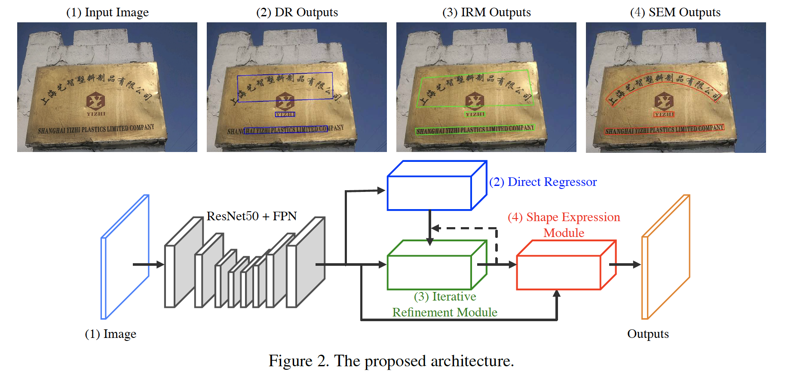

#### 3.1. 概览

​		我们的方法的网络架构见图2。架构可以分为四个部分。首先，通过将图像馈入骨干网络提取三个分支（包括DR、IRM和SEM）的共享特征。我们骨干网络是带有FPN的ResNet50，其中有效融合stage-2、stage-3、stage-4和stage-5的特征图。因此，共享特征图的大小为输入图像的1/4，并且通道数为128。其次，我们采用direct regression网络，其与EAST[42]和Deep Regression[8]相似，作为我们的direct regressor（DR）分支以每像素的方式预测单词或文本行四边形。由于感受野的限制，DR分支通常无法检测到如图2（2）中蓝色四边形所示的极长文本。因此，引入IRM分支来处理这个问题。IRM可以从DR的输出或其自身迭代地精炼输入提议，从而使输出更接近ground-truth边界框。根据不同场景的需要，3.3节中描述的IRM进行一次或多次精炼操作。利用IRM的帮助，初步的文本提议被改进以更完整地覆盖文本实例，如图2（3）所示的绿色四边形。最后，为了获得紧凑的表示，特别是非规则文本，其中四边形提议形式容易覆盖更多的背景区域，SEM通过学习文本表示的几何特性（包括文本区域、文本中心线和边界偏移（中心线和上/下边界框线之间的距离））来重构文本实例的形状表示。SEM的细节在3.4节中介绍，图2（4）中红色多边形为直观视觉结果。

#### 3.2. Direct Regressor

​		受[42]的启发，采用全卷积子网络作为文本direct regressor。基于共享特征图，计算文本/非文本的密集预测通道，以指示作为文本的像素级置信度。与[42]相似，原始文本区域缩小版本中像素视作正类。对于每个正样本，8个通道预测其偏移值，该偏移值为该像素到包含该像素的四边形的4个角。DR分支的损失函数包含两项：文本/非文本分类项和位置回归项。

​		我们将文本/非文本分类项视为1/4下采样得分图上的二值分割任务。与其直接使用dice-coefficient损失，我们提出一个尺度不变的版本来改善DR在感受野大小下检测文本实例时的尺度泛化能力。尺度不变的dice-coefficient函数定义为：

$$L_{cls} = 1 - \frac{2 \ast sum(y \cdot \hat{y} \cdot w)}{sum(y \cdot w) + sum(\hat{y} \cdot w)}, \tag{1}$$

其中$y$为0/1标签图，$\hat{y}$为预测得分图，以及$sum$为2D空间的累积函数。此外，式（1）中的$w$为2D权重图。正位置的值通过标准化常数$l$除以它们所属四边形的较短边来计算，而负位置的值设置为1.0。在我们的实验中，将$l$设置为64。

​		此外，我们采用smooth $L_1$损失来优化位置回归项$L_{loc}$。将这两个项组合到一起，DR的整体损失函数可以写为：

$$L_{dr} = \lambda L_{cls} + L_{loc}, \tag{2}$$

其中超参数$\lambda$平衡两个损失项，我们的实验中，将其设置为0.01。

#### 3.3. Iterative Refinement Module

​		IRM的设计继承自仅有一个回归任务的基于区域的目标检测器。但是，我们使用RoI transform layer[30]来提取输入文本四边形的特征块，而不是使用RoI池化或RoI对齐层。与后两个方法相比，前者可以提取四边形提议的特征块，同时保持纵横比不变。此外，正如第1节所分析的，靠近角点的位置可以在同一感受野内感知到更精确的边界信息。因此，引入角注意力机制来回归每个角的坐标偏移。

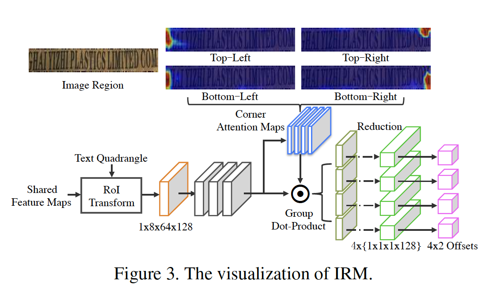

​		详细结构见图3。对于一个文本四边形，我们将共享的特征图提供给RoI transform layer，然后获得$1 \times 8 \times 64 \times 128$ 的特征块。此后，使用3个$3 \times 3$ 的卷积层进一步提取丰富上下文，即$f_r$。接下来，使用一个$1 \times 1$卷积层和sigmoid层学习4个角注意力图，称为$m_a$。每个角的注意力图上的值表示支持相应角点偏移回归的贡献权重。利用$f_r$和$m_a$，可以通过group dot production和sum reduction operation来提取4个角的回归特征：

$$f_c^i = reduce\_sum(f_r \cdot m_a^i,axis=[1,2]) | i=1,\cdots,4,\tag{3}$$

其中$f_c^i$表示第$i$个角回归特征，它的形状为$1\times 1\times1\times128$，$m_a^i$为第$i$个学习到的角注意力图。最后，$4$个头部（每个头部包含两个$1\times1$卷积层）根据角点回归特征$f_c$预测输入四边形和groundtruth文本框之间的4个角点的偏移量。

​		在训练阶段，保留$K$个来自DR的检测四边形，角回归损失可以表示为：

$$L_{irm}=\frac{1}{K \ast 8}\sum_{k=1}^K\sum_{j=1}^8 smooth_{L_1}(c_k^j -\hat{c}_k^j),\tag{4}$$

其中$c_k^j$表示第$k$对检测四边形和ground-truth四边形之间的第$j$个坐标偏移，$\hat{c}_k^j$为相应的预测值。如图3所示，四个角注意力图上强响应表示对各自角点回归的高度支持。顺便说一句，如果IRM能够连续带来好处，它可以在测试期间执行一次或多次的细化。

#### 3.4. Shape Expression Module

​		四边形的文本表示难以准确描述不规则形状的文本实例，特别是曲线或波浪形文本，如图1（b）。受Mask R-CNN[5]的启发，我们提出基于提议的shape expression module（SEM）来解决这个问题。SEM是RoI transform layer之后的全卷积网络。在SEM中回归三种文本几何特性（包括文本区域、文本中心线和边界偏移（文本中心线和上/下文本边界线之间的偏移））来重构准文本实例的准确形状表示。**Text region**是二值掩膜，其中前景像素（即多边形标注中的像素）标记为1，背景像素标记为0。**Text center line**也是基于文本多边形标注的边缩小（side-shrunk）版本的二值掩膜。**Border offsets**为四通道图，它们在文本行图的相应位置的正响应区域内具有有效值。正如图4（a）中中心线例子（红点）所示，我们画一条垂直于其切线的法线，该法线与上下边界线相交，得到两个边界点（即粉红色和橙色）。对于每个红点，通过计算其自身到其相关边界点的距离获得4个边界偏移。

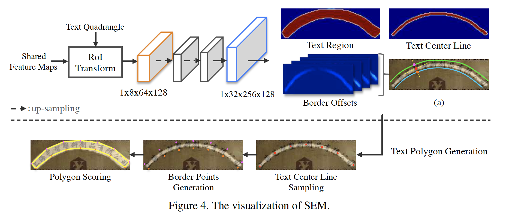

​		SEM的结构见图4，在RoI transform layer之后是两个卷积阶段（每个阶段包含一个上采样层和两个$3 \times 3$卷积层），然后我们使用6个输出通道的$1\times 1$ 卷积来回归所有文本属性图。SEM的目标函数定义如下：

$$L_{sme} = \frac{1}{K}\sum^K(\lambda_1 L_{tr} + \lambda_2 L_{tcl} + \lambda_3L_{border}), \tag{5}$$

其中$K$表示IRM中保留的文本四边形数量，$L_{tr}$和$L_{tcl}$分别为文本区域和文本中心线的dice-coefficient损失，$L_{border}$为smooth $L_1$损失。本文实验中，$\lambda_1$、$\lambda_2$和$\lambda_3$分别设置为0.01、0.01和1.0。

​		**Text Polygon Generation：**我们提出灵活的文本多边形生成策略来重构任意形状的文本实例表示，如图4所示。策略包含三步：文本中心线采样、边界点生成和多边形评分。首先，在中心线采样中，我们在预测的文本中心线图上从左至右以相等间隔采样$n$个点。根据SCUT-CTW1500[39]中的标签定义，考虑到数据集的复杂性，在曲线文本检测实验4.5中，将$n$设置为7，在使用四边形标注标签的基准[12、26、31]中处理文本检测时设置为2。之后，考虑到相同位置的四个边界偏移图提供的信息，我们可以基于采样中心线的点确定相应的边界点。如图4（Border Points Generation）所示，获得7个上边界框点（粉红）和7个下边界框点（橙色）。通过顺时针方向连接所有边界点，我们可以获得完整的文本多边形表示。最后，我们计算多边形中的文本区域响应的均值作为新的置信度得分。

#### 3.5. Training and Inference

​		我们使用如下损失函数以端到端的形式训练所提出的网络：

$$L = \gamma_1 L_{dr} + \gamma_2 L_{irm} + \gamma_3 L_{sem}, \tag{6}$$

其中$L_{dr}$、$L_{irm}$和$L_{sem}$分别表示DR、IRM和SEM的损失。权重$\gamma_1$、$\gamma_2$和$\gamma_3$平衡三个模块，在我们的实验中，将它们都设置为3。

​		训练分为两个阶段：warming-up和fine-tuning。在warming-up中，我们使用合成数据集训练DR分支10个周期。以这种方式，DR可以生成高召回率的提议，以覆盖真实数据中的大多数文本实例。在fine-tuning阶段，我们在真实数据集上微调三个分支大约10个周期，数据集包括ICDAR2015 [12]、ICDAR2017-RCTW [31]、SCUT-CTW1500 [39]、Total-Text [2]和ICDAR2017-MLT [26]。IRM和SEM分支都是用相同的提议，该提议通过DR分支生成。使用NMS保留前$K$个提议。由于DR一开始表现不佳，影响IRM和SEM分支的收敛，在实际应用中，我们用随机扰动的GT文本四边形代替50%的前$K$个提议。注意，IRM仅在训练期间进行一次精炼。

​		在推理阶段，DR首先生成四边形的得分图和几何图，NMS接着生成初步提议。接下来，提议和共享特征图被传入IRM进行多步精炼。精炼的四边形和共享特征图馈入到SEM以生成准确的文本多边形和置信度得分。最后，使用阈值$s$删除低置信度的多边形。在我们的实验中，将$s$设置为0.1。

### 4. 实验

​		为了比较LOMO与现有的最佳方法，我们对五个公共场景文本检测数据集（ICDAR2015 [12]、ICDAR2017-RCTW [31]、SCUT-CTW1500 [39]、Total-Text [2]和ICDAR2017-MLT [26]）进行深入的实验。评估协议分别介于[12、26、31、39、2]。

#### 4.1. 数据集

​		本文用于实验的数据集简要介绍如下：

...

#### 4.2. 实现细节

​		训练过程分为两步，如3.5节所述。在warming-up步中，我们使用Adam优化器来训练模型，学习率为$10^{-4}$，学习率衰减因子为0.94。fine-tuning中，学习率重新初始化为$10^{-4}$。对于所有数据集，我们随机裁剪文本区域，并将它们调整为$512 \times 512$。裁剪图像的区域在四个方向（$0^\circ$、$90^\circ$、$180^\circ$和$270^\circ$）进行随机旋转。所有实验在如下配置的标准工作站上进行，CPU: Intel(R) Xeon(R) CPU E5-2620 v2 @ 2.10GHz x16，GPU: Tesla K40m，RAM: 160 GB。在训练期间，我们将4个gpu上的批处理大小设置为8，DR分支生成的检测到的提议数$K$设置为每个gpu 24个。推理阶段，在1个GPU上，将batch size设置为1。在保持原始高宽比的情况下，预测一个较长尺寸的图像的总时间成本为224毫秒。

#### 4.3. 消融研究

​		我们进行几项消融实验来分析LOMO。结果见表1、表2、图6和表3所示。

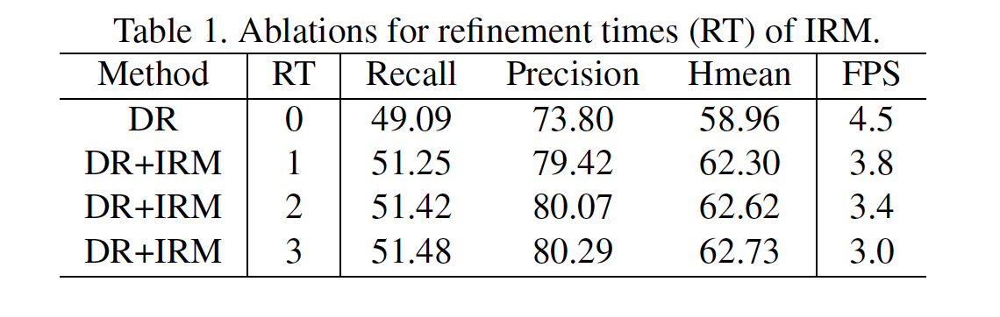

​		**IRM的讨论：**IRM在ICDAR2017-RCTW上的评估见表1。我们使用Resnet50-FPN作为骨干，并且将文本图像更长边固定到1024，同时保持纵横比不变。如表1所示，与没有IRM的DR分支相比，将RT设置为1、2和3分别将Hmean提高3.34%、3.66%和3.77%。这证明IRM对精炼长文本检测的极大有效性。为了快速的推理，余下的实验中，将RT设置为2。

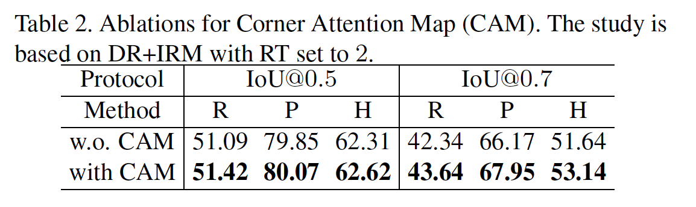

​		**Corner Attention Map：**LOMO利用IRM中的角注意力图。为了公平比较，我们基于没有角注意力图的DR+IRM生成模型，并在ICDAR2017-RCTW上评估其性能。结果见表2。

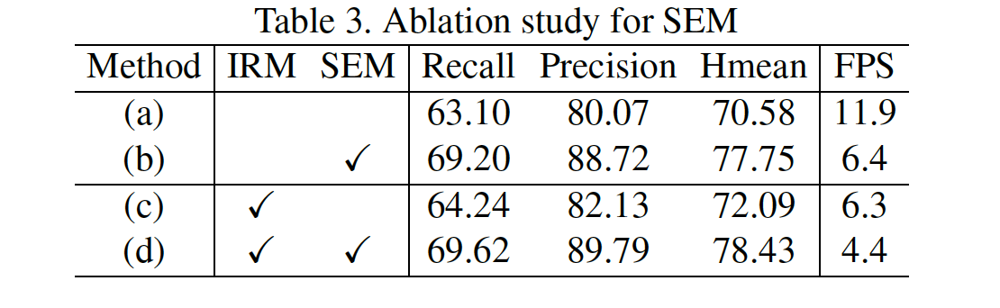

​		**Benefits from SEM：** 我们在SCUT-CTW1500上评估SEM的收益，见表3。

​		**中心线中样本点的数量：** 后面的实验中，将样本点数设置为7。

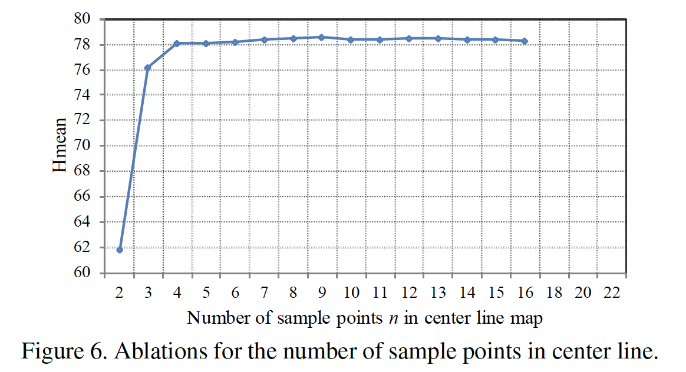

#### 4.4. 长文本基准上的评估

​		我们评估LOMO在ICDAR2017-RCTW上检测长文本案例的性能。训练期间，在fine-tuning中，我们使用数据集中的所有训练图像。对于单尺度测试，如果输入图像的更长边大于1024，我们将图像的更长边调整为1024，并且保持纵横比不变。对于多尺度测试，调整的图像的更长边的尺度包含512、768、1024、1536和2048。表4列出了量化结果。LOMO获得62.3%的Hmean，比最佳的单尺度方法RRD高6.6%。由于多尺度测试，LOLO MS进一步将Hmean提高到68.4%。使用多尺度测试，LOMO MS进一步将Hmean提高到68.4%。LOMO的一些检测结果见图5（a）和（b）。

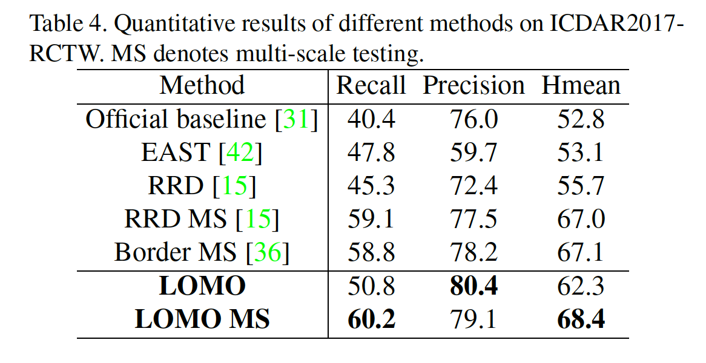

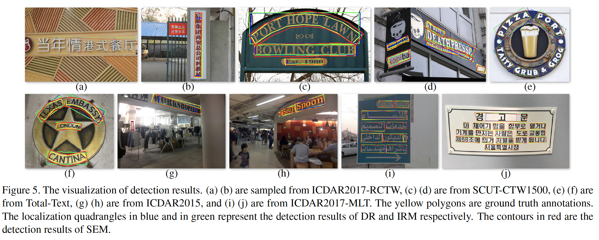

#### 4.5. Evaluation on Curved Text Benchmark

​		我们在SCUT-CTW1500和Total-Text（包含许多任意形状的文本实例）上评估LOMO的性能一验证检测任意形状文本的能力。训练期间，我们在大约10个周期时，停止微调，并且仅使用训练图像。所有定量结果见表5。利用SEM的帮助，LOMO在SCUT-CTW1500和Total-Text上获得最佳结果，并大幅领先已有的方法（即CTD+TLOC、TextSnake）。此外，在SCUT-CTW1500和Total-Text上，多尺度测试进一步将Hmean分别提高2.4%和1.7%。曲线文本检测的可视化见图5 (c) (d) (e) (f)。

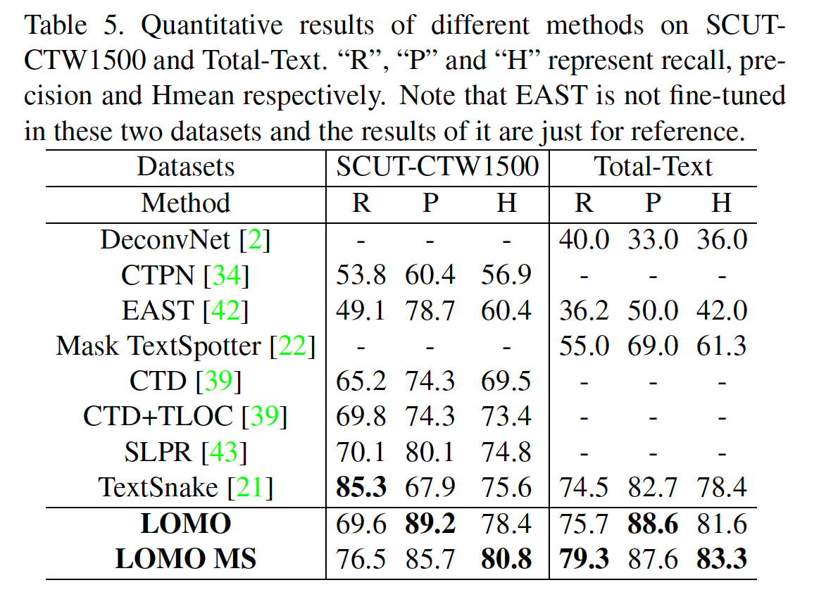

#### 4.6. Evaluation on Oriented Text Benchmark

​		我们在ICDAR2015数据集上比较最佳结果。对于单尺度测试，我们将更长边的尺度设置为1536。在多尺度测试中，更长边设置为1024、1536和2048。所有结果见表6。检测结果见图5（g）（h）。

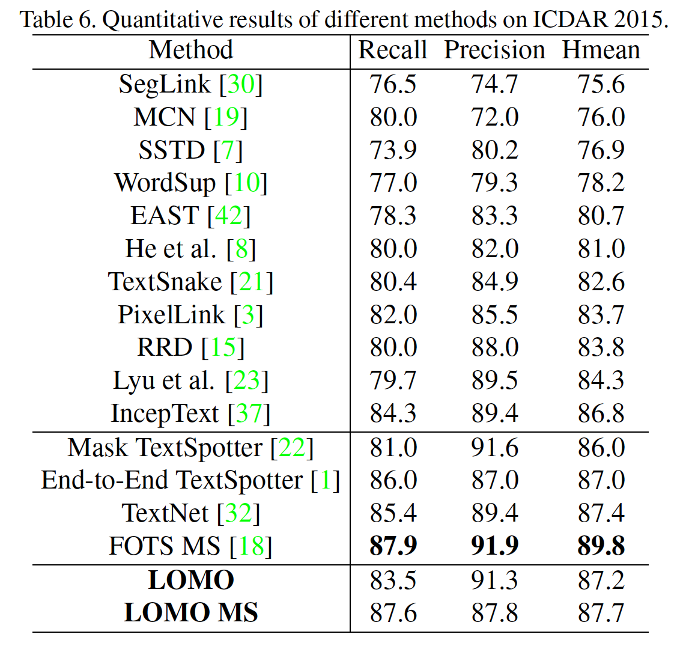

#### 4.7. Evaluation on Multi-Lingual Text Benchmark

​		为了验证LOMO在多语言场景文本检测上的泛化能力，我们在ICDAR2017-MLT上评估检测结果。检测器在SynthText预训练模型上微调10个周期。推理阶段，对于单尺度测试，将更长边设置为1536；对于多尺度测试，更长边包含512、768、1536和2048。如表7所示，与大多数现有方法[9、23、36、41]相比，LOMO在单尺度测试中具有领先的性能，但Border[36]和AFN-RPN[41]除外，这些方法没有指明所使用的测试尺度。多语言的可视化结果见图5（i）（j）所示。