## Detecting Oriented Text in Natural Images by Linking Segments

### Abstract

​		大多数最新的文本检测方法特定于水平拉丁文本，并且对于实时应用而言不够快。我们介绍了一种Segment Linking（SegLink），一种面向文本的检测方法。主要思想是将文本分解为两个局部可检测的元素，即segment和link。segment覆盖单词或文本行的定向边界框。link连接两个相邻的segment，其表示它们属于相同单词或文本行。通过端到端训练的全卷积神经网络在多个尺度密集地检测两种元素。通过link组合segment来产生最终的检测。与之前的方法相比，SegLink提高准确率、速度以及易于训练。在ICDAR2015 Incidental（Challenge 4）基准测试样获得75%的F-score，大幅领先先前的最佳模型。在$512\times512$分辨率的图像上能以20FPS的速度运行。此外，没有作任何修改的情况下，SegLink能够检测非拉丁文（例如中文）的长行。

### 1. Introduction

​		通用目标检测不适合文件检测的原因：（1）单词/文本行边界框的纵横比通常比通用目标的大。一些非拉丁文的单词之间没有空格，因此有更大的编辑框纵横比。（2）与一般目标不同，文本通常有清晰的方向定义。产生定向边界框对于文本检测器非常重要。然而，大多数通用目标检测方法不是设计用于产生定向边界框。

​		作者提出将长文本分解为两个更小、局部可检测的元素，即segment和link。如图1所示，segment时覆盖部分单词（为简单起见，这里使用“单词”，但是segment在包含多个单词的文本行上也可以无缝使用）的定向边界框；link连接一对相邻的segment，其表明它们属于同一单词。在上述定义下，通过大量segment以及它们之间的link定位一个单词。在检测期间，通过卷积神经网络在输入图像上密集地检测segment和link。然后，根据segment组合segment以构成整个单词。

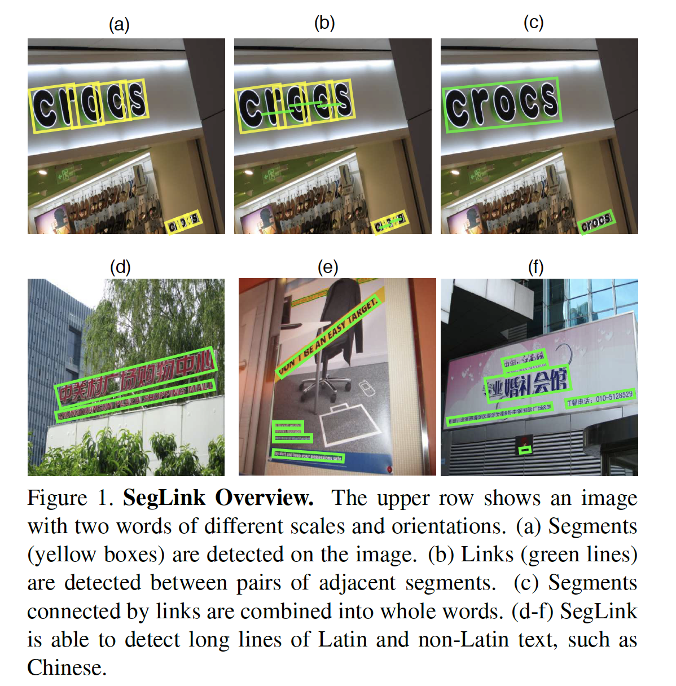

​		这种方法的主要优点是，现在可以在本地检测到长而定向的文本，因为两个基本元素都可以在局部检测到：**检测segment不需要观察到整个单词**。并且link也不需要，因为可以从局部上下文推断出两个segment的连接。此后，可以非常灵活和高效地检测任何长度和方向的文本。

​		作者提出使用FCN来同时检测segment和link，使用VGG-16作为backbone，并添加几个额外卷积层。添加卷积预测器到6个特征层以检测不同尺度的segment和link。为了处理冗余检测，我们引入两种类型的link，即within-layer link和cross-layer link。within-layer link将segment连接到其同一层的相邻segment。另一方面，cross-layer连接到更低层中的相邻link。这样，就可以连接相邻位置和尺度的segment。最后，作者使用深度优先搜索（DFS）算法找到连接的segment，并将它们组合成整个单词。

​		本文的主要贡献是一种新的segment-linking检测方法。通过实验，作者证明了所提出的方法相对于其他最新方法具有一些独特的优势：1）*Robustness* ：SegLink以简单而优雅的方式建模定向文本的结构，并具有针对复杂背景的鲁棒性。在ICDAR2015 Incidental（Challenge 4）上，SegLink大幅领先先前的方法（75% vs. 64.8%）。2）*Efficiency*：SegLink具有single-pass、全卷积设计，因此非常高效。每秒处理$512\times512$大小的图像超过20张。不作任何修改，SegLink可以检测如中文的非拉丁文本。

### 2. Segment Linking

​		SegLink利用CNN模型检测文本。给定大小为$w_I \times h_I$的输入图像$I$，模型输出固定数量的segment和link，然后通过它们的置信度得分过滤，并组合成整个单词边界框。边界框是旋转矩形，表示为$b=(x_b,y_b,w_b,h_b,\theta_b)$，其中$x_b$、$y_b$是中心坐标，$w_b$、$h_b$为宽度和高度，$\theta_b$为旋转角度。

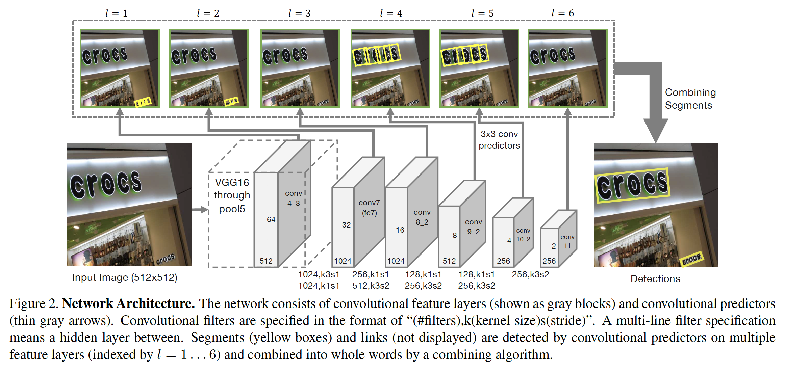

#### 2.1. CNN Model

​		图2展示了网络架构。网络使用预训练的VGG16作为其backbone（conv1到pool5）。遵循[14]，VGG16的全连接层替换为卷积层（fc6转换为conv6、fc7转换为conv7）。它们之后使用少量额外卷积层（conv8_1到conv11），其提取具有更大感受野的更深特征。

​		在6个特征层上检测segment和link，其为conv4_3、conv7、conv8_2、conv9_2、conv10_2和conv11。这些特征层提高不同粒度的高质量深度特征（conv4_3最精细，conv11最粗糙）。将$3\times3$的卷积预测器添加到6个特征层中的每一个，从而检测segment和link。通过$l=1,\cdots,6$索引特征层和预测器。

​		**Segment Detection**	Segment也是定向边界框，表示为$s=(x_s,y_s,w_s,h_s,\theta_s)$。通过估计一组default boxes 的置信度得分和几何偏移来检测segment。每个default box与特征图位置关联，并在该位置的特征上预测得分和偏移。为了简单起见，仅将一个default box与一个特征图位置关联。

​		考虑到特征图大小为$w_l\times h_l$的第$l$个特征层。此图上的位置$(x,y)$对应于图像上以$(x_a,y_a)$为中心的default box，其中

$$x_a = \frac{w_I}{w_l}(x + 0.5); y_a =\frac{h_I}{h_l}(y+0.5) \tag{1}$$

Default box的宽度和高度设置额为常量$a_l$。

​		卷积预测器为segment检测产生7个通道。其中，2个通道进一步使用softmax归一化得到$(0,1)$之间的segment得分。余下的5个通道是几何偏移。考虑特征图上的位置$(x,y)$，用$(\Delta x_s, \Delta y_s, \Delta w_s, \Delta h_s, \Delta \theta_s)$表示该位置沿深度的向量。然后，该位置的segment计算为：

$$x_s = a_l \Delta x_s + x_a \tag{2}$$

$$y_s = a_l \Delta y_s + y_a \tag{3}$$

$$w_s = a_l \exp(\Delta w_s) \tag{4}$$

$$h_s = a_l \exp(\Delta h_s) \tag{5}$$

$$\theta_s = \Delta \theta_s \tag{6}$$

这里，常量$a_l$控制输入segment的尺度。应根据第$l$层的感受野大小进行选择$a_l$。作者使用经验公式选择这个大小：$a_l = \gamma \frac{w_I}{w_l}$，其中$\gamma = 1.5$。

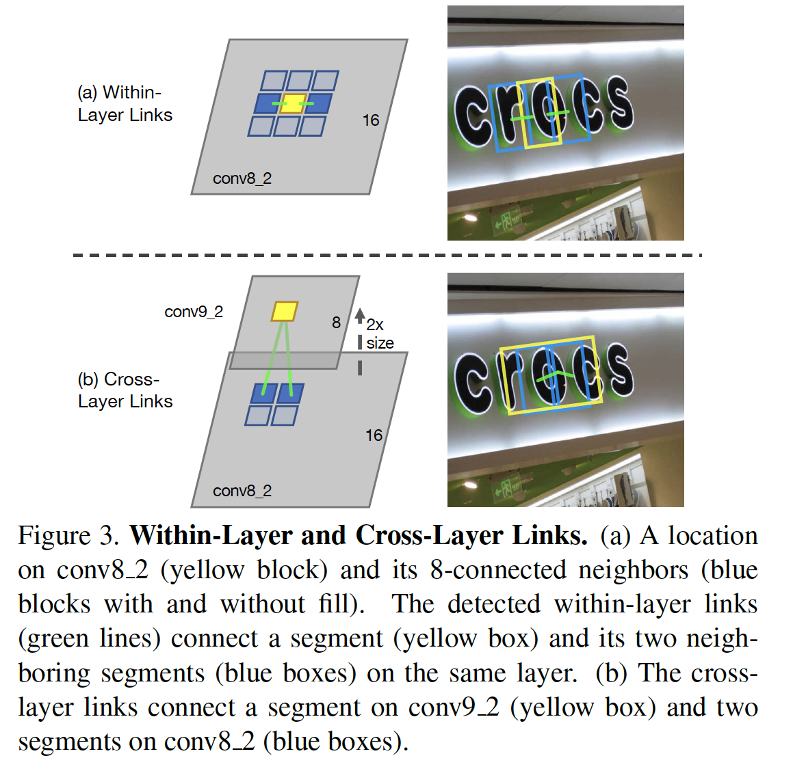

​		**Within-Layer Link Detection**	link连接一对相邻的segment，其表明它们属于同一单词。这里，相邻segment是相邻特征图位置上检测到的segment。Link不仅对于组合成整个单词是必要的，还有助于分割两个相邻的单词——相邻蛋吃之间，link应当预测为负类。

​		使用检测segment相同的特征检测segment之间的link。因为在特征图的一个位置上仅检测一个segment，所以可以通过它们的特征图位置$(x,y)$和层索引$l$来索引segment，表示为$s^{(x,y,l)}$。如图3a所示，将segment的within-layer neighbors定义为同一特征图中与其8个相连的近邻：

$$\mathcal{N}_{s^{(x,y,l)}}^w = \{s^{x',y',l}\}_{x-1 \le x' \le x+1, y-1 \le y' \le y+1}\diagdown s^{(x,y,l)} \tag{7}$$

当局部检测到segment时，一对相邻的segment在输入图像上也相邻。预测器为连接到8个连接的相邻segment的link输出16个通道。 每2个通道均经过softmax归一化以获得link得分。

​		**Cross-Layer Link Detection**	需在不同特征层的不同尺度上检测segment。每个层处理一个尺度范围。使这些范围重叠，以免在其边缘丢失尺度。但是结果是，可以同时在多层上检测到同一单词的segment，从而产生了冗余。

​		为了处理这个问题，进一步提出另一种类型的link，称为cross-layer link。cross-layer link连接相邻索引的两个特征层上的segment。例如，在conv4_3和conv7之间检测cross-layer link，因为它们的索引分别为$l=1$和$l=2$。

​		这种对的一个重要属性是，由于它们之间的下采样层（最大池化或步长为2的卷积），第一层的大小始终是第二层的两倍。注意这种属性仅当所有层都是偶数时成立。事实上，可以通过保证输入图像的宽度和高度可以整除128。例如将$1000\times800$的图像调整到$1024\times768$，这是最接近的有效尺寸。

​		如图3b所示，将segment的cross-layer neighbors定义为：

$$\mathcal{N}_{s^{x,y,l}}^c = \{s^{(x',y',l-1)}\}_{2x \le x' \le 2x+1, 2y \le y' \le 2y+1},\tag{8}$$

这是前一层中的segment。每个segment有4个cross-layer neighbor。通过两层之间的两倍大小关系来确保对应关系。

​		cross-layer link也通过卷积预测器检测。预测器为cross-layer link输出8个通道。每2个通道均进行softmax归一化，以产生cross-layer link的得分。在特征层$l=2,\cdots, 6$上检测cross-layer link，而$l=1$（conv4_3）除外，因为它没有前一特征层。

​		利用cross-layer link，不同尺度的segment可以连接以及向后组合。与传统的NMS相比，cross-layer link提供联合冗余的可训练方式。此外，它无缝地适合linking策略，并且易于在本文的框架下实现。

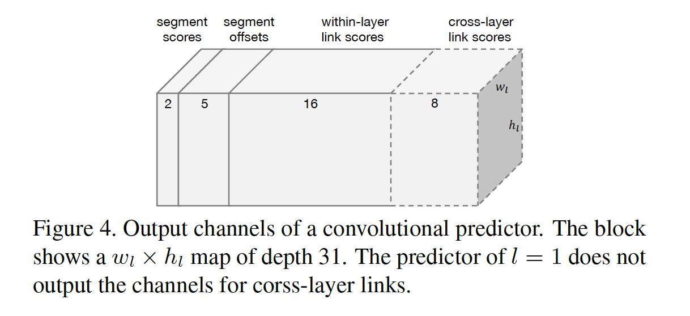

​		**卷积预测器的输出**	图4展示了卷积预测器的输出。预测器由卷积层实现，后跟一些softmax层，分别对segment和link得分进行归一化。 此后，网络中的所有层都是卷积层。

#### 2.2. Combining Segments with Links

​		在前向传播之后，网络产生大量segment和link（数量与图像的大小有关）。在组合之前，输出segment和link根据它们的置信度过滤。为segment和link设置不同的过滤阈值，分别为$\alpha$和$\beta$。根据经验，模型的性能对于这些阈值非常敏感。两个阈值与其最佳值之间的0.1个偏差都会导致小于1％的f值下降。

​		采用过滤后的segment作为节点（node），过滤后的link作为边（edge），在它们之上构建图（graph）。然后，对图形执行深度优先搜索（DFS）以查找其连接的组件。每个组件包含一组segment，其通过link连接。用$\mathcal{B}$表示连接组件，这个组件中的segment遵循算法1的组合过程。

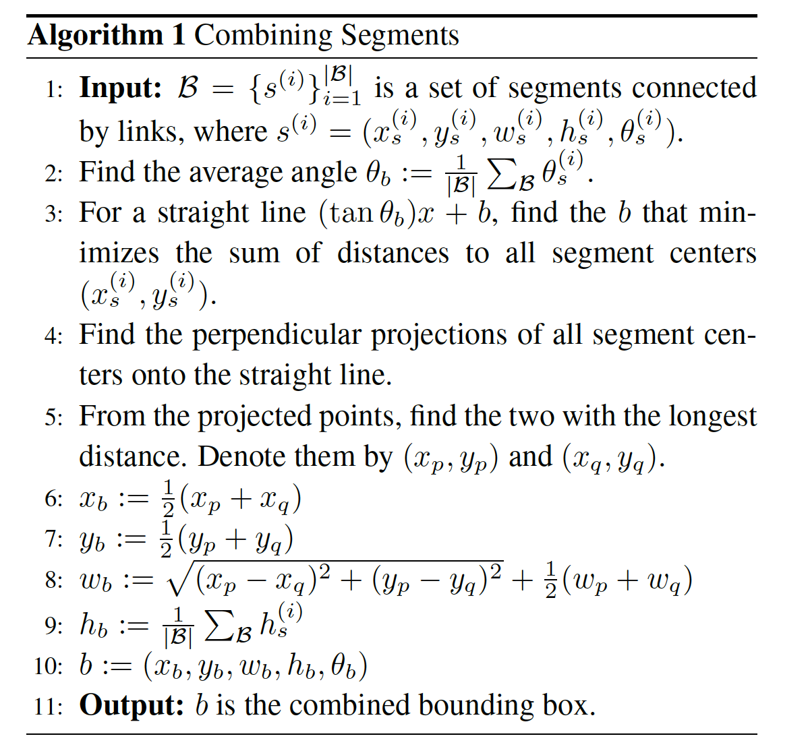

### 3. Training

#### 3.1. Groundtruths of Segments and Links

​		网络通过groundtruth segment和link直接监督训练。groundtruth包含所有的default box（即它们对应的segment的标签）的标签、到default box的偏移以及within-layer和cross-layer link的标签，这些标签根据groundtruth 单词边界框计算。

​		首先，假设输入图像中仅有一个groundtruth单词。当且仅当1）default box的中心在单词边界框的中心时；2）边界框的大小$a_l$和单词高$h$满足

$$\max(\frac{a_l}{h}, \frac{h}{a_l}) \le 1.5 \tag{9}$$

时，将default box标记为正类。否则，将default box标记为负类。

​		接下来，考虑多个单词的情况。如果default box没有符合上述标准的任何单词，那么将该默认框标记为负类。否则，标记为正类，并且匹配到大小最接近的单词，即式（9）中左手边中具有最大值的default box。

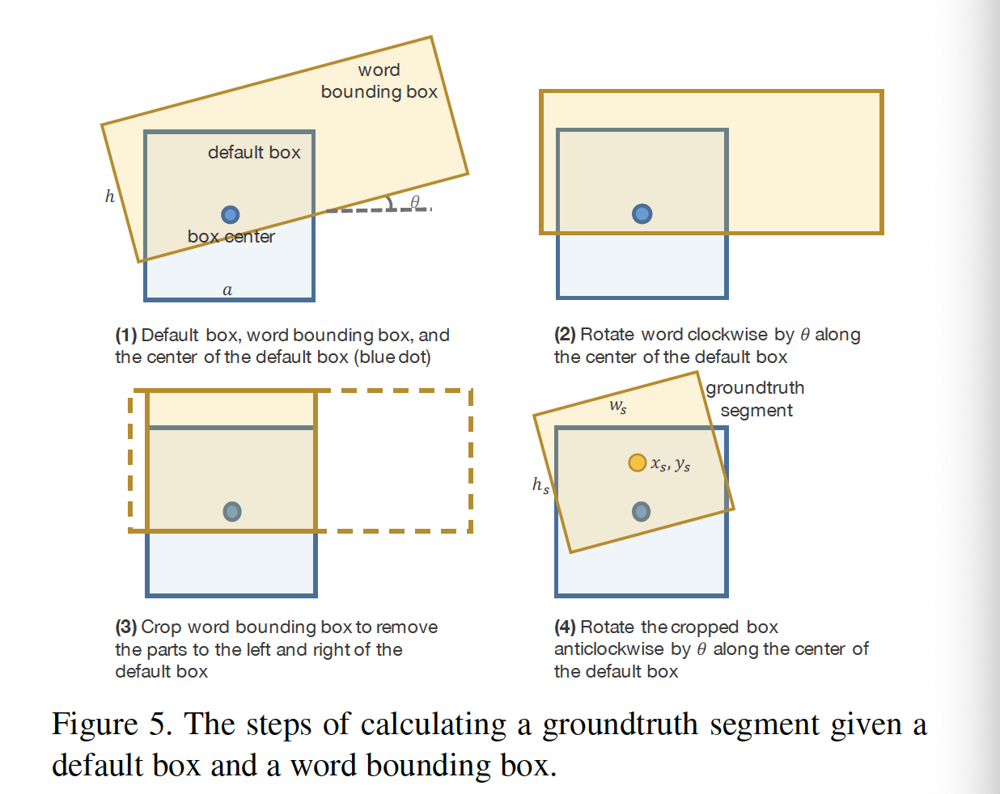

​		在正类default box处计算偏移。首先，遵循图5的步骤计算groundtruth segment。然后，求解式（2）到式（6）得到groundtruth偏移。

​		当且仅当1）连接到link的两个默认框都标记为正； 2）两个默认框都匹配相同的单词，则link（要么within-layer，要么为cross-layer）标记为正。

#### 3.2. Optimization

**Objective**：

$$\begin{align}L(\mathbf{y}_s, \mathbf{c}_s, \mathbf{y}_l, \mathbf{c}_l, \hat{\mathbf{s}}, \mathbf{s}) = &\frac{1}{N_s}L_{\mbox{conf}}(\mathbf{y}_s, \mathbf{c}_s) + \lambda_1 \frac{1}{N_s}L_{loc}(\hat{\mathbf{s}, \mathbf{s}}) \\ &+ \lambda_2\frac{1}{N_l}L_{\mbox{conf}}(\mathbf{y}_l, \mbox{c}_l)\end{align} \tag{10}$$

这里，$\mathbf{y}_s$是所有segment的标签。如果第$i$个default box标记为正类，那么$\mathbf{y}_s^{(i)} = 1$，否则为零。相似地，$\mathbf{y}_l$为link的标签。$L_{\mbox{conf}}$为预测到的segment和link得分（分别为$\mathbf{c}_s$和$\mathbf{c}_l$）上的softmax损失。$L_{\mbox{loc}}$为预测segment几何形状$\hat{\mathbf{s}}$和groundtruth$\mathbf{s}$上的smooth L1回归损失。segment分类和回归损失通过$N_s$归一化，$N_s$为正类default box的数量。link分类损失通过正类link $N_l$的数量归一化。实践中，权重常量$\lambda_1$和$\lambda_2$都设置为1。

**Online Hard Negative Mining**    对于segment和link，负类占据大多数训练样本。所以二者都是用Online Hard Negative Mining，负类和正类之比最多为$3:1$。

**Data Augmentation**	采用SSD和YOLO相似的在线数据增强策略。训练图像被随机裁剪为一个Jaccard最小重叠度为$o$且与任何groundtruth单词都重叠的patch。在批量加载之前，将crop的大小调整为相同的大小。对于定向文本，在单词的轴对齐边界框上进行增强。对于每个样本，重叠$o$从$0(没有限制)、0.1、0.3、0.5、0.7、0.9$中随机选择。crop的大小从原始图像大小的$[0.1, 1]$上随机选择。训练图像不进行水平翻转。

### 4. 实验

#### 4.1. 数据集

**SynthText in theWild (SynthText)** 包含800000张生成训练图像。它们是通过将自然图像与以随机字体，大小，方向和颜色呈现的文本混合而创建的。

**ICDAR 2015 Incidental Text (IC15) **包含1000张训练图像和500张测试图像，标注为四边形。

**MSRA-TD500 (TD500)** 是第一个关注定向文本的标准数据集，包含中文和英文文本，标注300张训练图像和200张测试图像。

**ICDAR 2013 (IC13)** 主要包含水平文本，以及一些略为有方向的文本。包含229张训练图像和233张测试图像。

#### 4.2. 实现细节

​		在SynthText上预训练，在真实数据上微调。通过momentum为0.9的标准SGD算法优化。对于训练和微调，在随机裁剪后，将图像调整为$384\times384$。因为模型是全卷积的，所以可以在某个尺寸训练，而以其他尺寸进行测试。batch size设置为32。在预训练中，前60k迭代中，学习率设置为$10^{-3}$，在余下的30k迭代中，衰减到$10^{-4}$。微调期间，学习率固定为$10^{-5}$进行5-10k次迭代。微调迭代次数依赖数据集的大小。

​		由于precision-recall的平衡和不同数据集上评估协议之间的差异，选择最佳的阈值$\alpha$和$\beta$来优化$f$值。除了IC15以外，阈值是通过网格搜索在保留验证集上以0.1步的方式在不同数据集上分别选择的。IC15没有提供离线的评估脚本，因此唯一方法是将多个结果提交给评估服务器。

​		本文的方法是用TensorFlow r0.11实现。训练设备为Intel Xeon 8核 CPU（2.8GHz）、4张Titan X图像卡和64GB RAM。

#### 4.3. Detecting Oriented English Text

​		首先，在IC15上评估SegLink。在IC15的训练数据集上微调预训练的模型10K次迭代。测试图像调整为$1280\times768$。segment和link阈值分别设置为0.9和0.7。

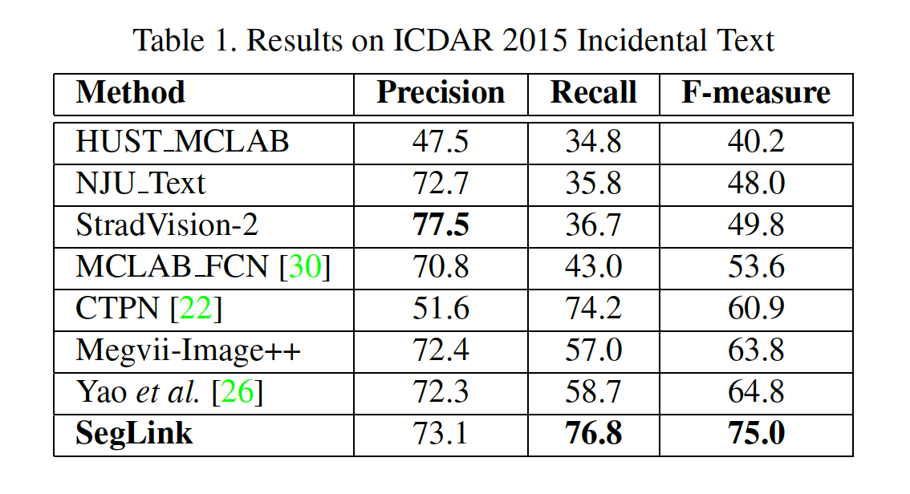

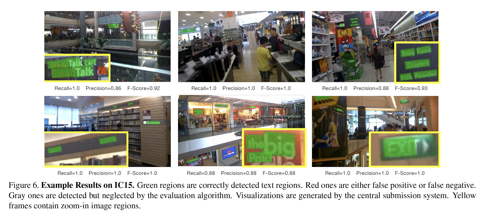

#### 4.4. Detecting Multi-Lingual Text in Long Lines

​		现在证明SegLink检测非拉丁脚本的长文本的能力。采用TD500进行实验，因为它包含定向、多语言文本。TD500训练集仅有300张图像，这不足以微调模型。作者将TD500和IC15的训练集混合，保证每个batch中有来自每个数据集一半的图像。微调预训练模型8k次迭代。测试图像调整为$768\times768$。阈值$\alpha$和$\beta$分别设置为0.9和0.5。性能得分通过官方的开发工具计算。

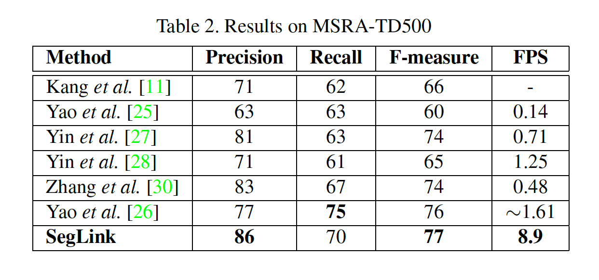

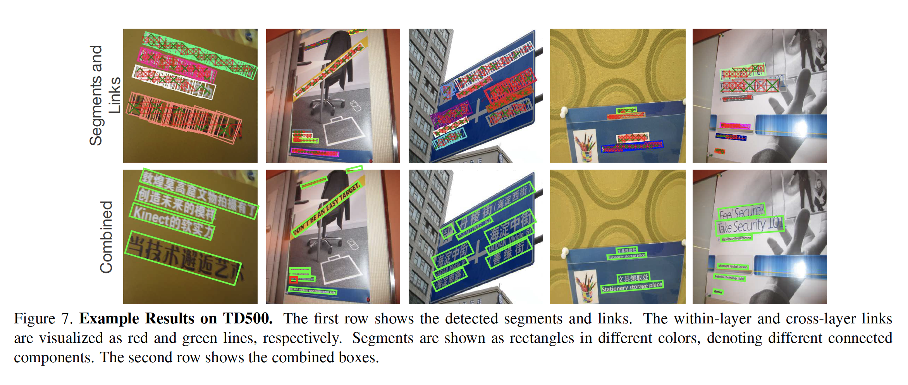

#### 4.5. Detecting Horizontal Text

​			在IC13和IC15上评估SegLink在水平文本数据集上的性能。在IC13和IC15的组合训练集上微调5k次迭代。因为IC13的大多数文本相对更大的尺寸，测试图像调整到$512 \times 512$。阈值$\alpha$和$\beta$分别设置为0.6和0.3。为了匹配提交格式，将检测到的定向边界框转换为其轴对齐的边界框。

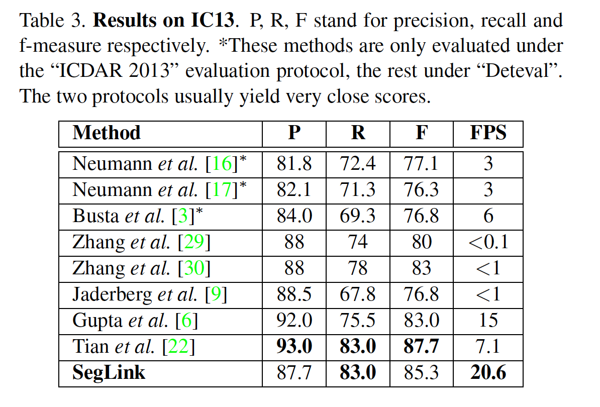

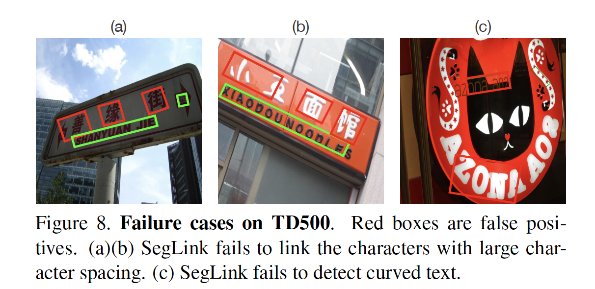