## TextSnake: A Flexible Representation for Detecting Text of Arbitrary Shapes

### 摘要

​		受深度神经网络和大尺度数据集的驱动，场景文本检测方法在过去几年取得长足进步，不断刷新各种标准基准测试的性能记录。但是，受描述文本采用的表示（轴对齐的矩形、旋转矩形或四边形）的限制，当处理更多的自由格式文本实例（比如曲线文本，这在实际场景中非常常见）时，现有的方法可能会有缺陷。为了处理这个问题，我为场景文本提出更灵活的表示（称为TextSnake），其能够有效表示水平、定向和曲线格式的文本实例。在TextSnake中，文本实例被描述为以对称轴为中心的有序、重叠的圆序列，每个圆都与潜在的可变半径和方向相关。通过FCN估计如此的几何特性。在实验中，基于TextSnake的文本检测器在Total text和SCUT-CTW1500这两个最新发布的基准测试（特别是自然图像中的曲线文本）以及广泛使用的数据集ICDAR 2015和MSRA-TD500上达到了最先进或可比的性能。具体而言，在Total-Text上，TextSnake的F-measure比基线高40%。

### 1	引言

​		最近几年，对于从自然场景中提取文本信息，也称为场景文本检测和识别，社区已见证大量的研究兴趣和努力[48]。驱动因素既有应用前景，也有研究价值。一方面，场景文本检测与识别在场景理解、产品搜索、自主驾驶等众多实际系统中发挥着越来越重要的作用。另一方面，场景文本的独特性，如颜色、比例、方向、纵横比和图案的显著变化，使其明显不同于一般对象。因此，提出特别的挑战，需要进行特别调查。

​		文本检测，作为文本信息提取流水线先决步骤，近年来随着深度神经网络和大型图像数据集的发展，得到长足的发展。大量创新工作[39、29、47、17、10、46、30、36、6、9、34、22、28、40、31]被提出，在标准基准上表现出色。

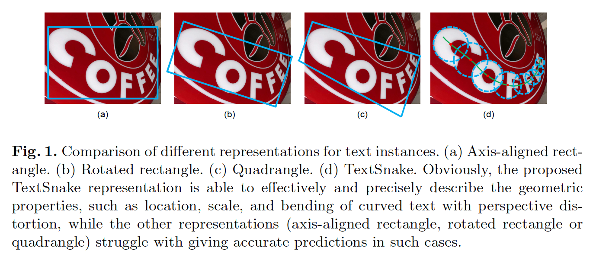

​		但是，大多数现有的文本检测方法都有一个很强的假设，即文本实例大致呈线性，因此采用相对简单的表示（轴对齐的矩形、旋转的矩形或四边形）来描述它们。尽管它们在标准基准上取得进步，但是，在处理不规则文本实例（例如曲线文本）时，这些方法可能存在短板。如图1所述，对于透视扭曲的曲线文本，传统的表示法难以精确估计几何性质。

​		事实上，曲线文本实例在真实生活中是非常常见的。本文中，我们提出更灵活的表示，其可以很好地拟合任意形状的文本，即水平、多方向和曲线形式的文本。这种表示法用一系列有序的、重叠的圆来描述文本，每个圆都位于文本区域的中心轴上，并且与可能可变的半径和方向相关联。由于它对复杂多样的文本结构具有很好的适应能力，就像一条蛇为了适应外部环境而改变形状一样，将其命名为TextSnake。文本实例的几何属性，即中心轴点、半径和方向，用一个全卷积网络（FCN）模型进行估计。除ICDAR2015和MSRA-TD500外，还在Total-Text和SCUT-CTW1500上验证TextSnake的有效性，这两个数据集是新发布的主要关注曲线文本的基准测试。所提出的算法在两种曲线文本数据集上都获得最佳性能，与此同时，在水平和多方向文本都比先前方法好，甚至是单尺度测试模式。具体而言，在F-measure中，TextSnake在Total-Text上比基线显著提高40.0%。

​		总之，本文的主要贡献有三个方面：（1）我们为任意形状的场景文本提出一种灵活而通用的表示；（2）基于这种表示，提出一种有效方法进行场景文本检测；（3）所提出的文本检测算法在几种基准测试（包括不同形式（水平、定向和曲线）的文本实例）上获得最佳性能。

### 2	相关工作

​		过去几年，场景文本检测领域中的最主流倾向是从传统方法迁移到基于深度学习的方法。本节中，我们回顾相关工作。综合调查请参考[41、48]。在深度学习之前，SWT和MSER是两种代表性工作，它们影响大量后续方法[42、11]。现代方法主要基于深度学习网络，其可以大致分为两类：基于回归和基于分割。

​		基于回归的文本检测方法[17]主要受通用目标检测框架的启发。TextBoxes采用SSD，并添加长默认框和滤波器以处理文本实例纵横比的显著变化。基于Faster-RCNN，Ma等[23]设计Rotation Region Proposal Network（RRPN）来检测自然图像中任意方向的文本。EAST[47]和Deep Regression[8]都直接以每像素的形式产生文本的旋转边界框或四边形。

​		基于分割文本检测方法将文本检测转换为语义分割问题，FCN[21]通常作为参考框架。Yao等[39]修改FCN以产生与文本不同属性（例如文本区域和方向）对应的多个热图。Zhang等[46]首先使用FCN来提取文本块，然后利用MSER从这些块中猎取字符候选。为了分割相邻的文本实例，[36]的方法将每个像素区分为三类：非文本、文本边界和文本。这些方法主要在将文本像素划分为不同实例的方式上有所不同。

​		上述方法在该领域的各种基准测试中取得了优异的性能。但是，大多数工作（除[39、6、15]）没有特别关注曲线文本。相比之下，本文所提出的表示适合任意形状（水平、多方向和曲线）的文本。它主要受[39、6]的启发，并且文本的几何属性也通过基于FCN的模型的多通道输出来估计。与[39]不同，我们的算法不需要字符集标注。此外，它与SegLink[29]有相同的思想，通过连续地将文本分解为局部组件，然后再将它们组合回文本实例中。与[45]类似，我们还检测文本实例的线性对称轴来进行文本定位。

​		该方法的另一个优点是能够精确地重建文本实例的形状和区域走向，从而大大方便后续的文本识别过程，因为所有检测到的文本实例都可以方便地转换成一个具有最小失真和背景的标准形式（参见图9中的示例）。

### 3	方法

​		本节中，我们首先介绍任意形状的文本的新表示。然后，描述方法和训练细节。

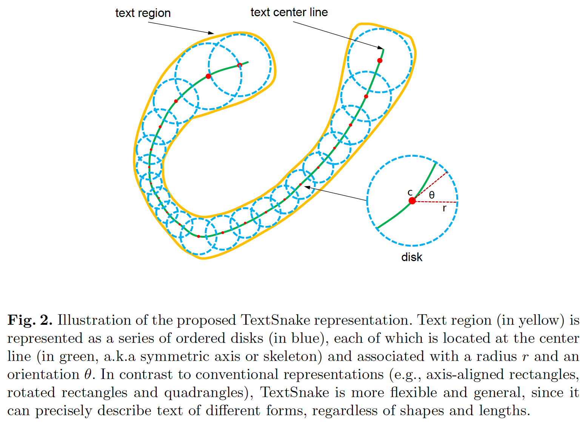

#### 3.1	表示

​		如图1所示，场景文本的传统表示（例如轴对齐的矩形、旋转矩形和四边形）难以精准描述不规则文本实例的几何属性，因为它通常假设文本实例大致上是线性格式，对于曲线文本不再成立。为了解决这个问题，我们提出灵活而通用的表示：TextSnake。如图2所示，TextSnake将文本实例表示为重叠的圆盘序列，其中每个圆盘位于中心线上，并与半径和方向关联。直觉上，TextSnake能够改变其形状以适应文本实例的变化，例如选择、缩放和弯曲。

​		数学上，文本实例$t$，包含几个特征，可以是视为有序列表$S(t)$。$S(t) = \{D_0, D_1, \cdots, D_i, \cdots, D_n\}$，其中$D_i$表示第$i$个圆盘，$n$为圆盘数量。每个圆盘$D$与一组几何属性相关，即$D=(c,r,\theta)$，其中$c$、$r$和$\theta$分别为圆盘$D$的中心、半径和方向。半径$r$定义为$t$的局部宽度的一半，方向$\theta$为中心$c$附近的中心线的切线方向。从这个意义上讲，文本区域$t$可以通过计算$S(t)$中圆盘的并集来轻松地重建。		

​		注意，圆盘与属于$t$的字符不是对应的。但是，$S(t)$中的几何属性可以用于校正不规则形状的文本实例，并将其转换为矩形、直线的图像区域，这对文本识别更为友好。

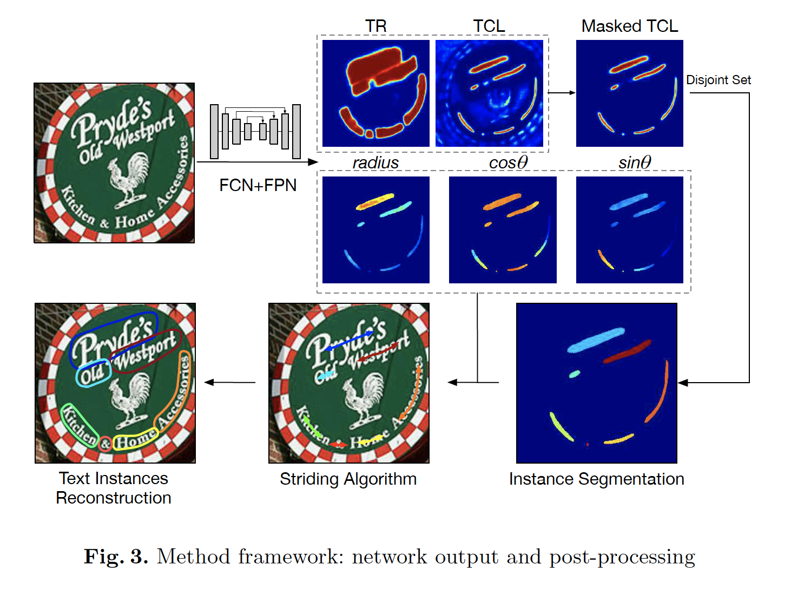

​		为了检测任意形状的我文本，我采用FCN模型来预测文本实例的几何属性。所提出方法的流水线如图3所示。基于FCN的网络预测文本中心线（text center line：TCL）和文本区域（text region：TR），以及几何属性，包含$r$、$cos\theta$和$sin\theta$。TCL图被TR图进一步mask，因为TCL自然是TR的一部分。为了进行实例分割，需要利用不相交集，这是TCL相互之间没有重叠的事实。采用跨步算法提取中心轴点列表，最终重构文本实例。

#### 3.3	网络架构

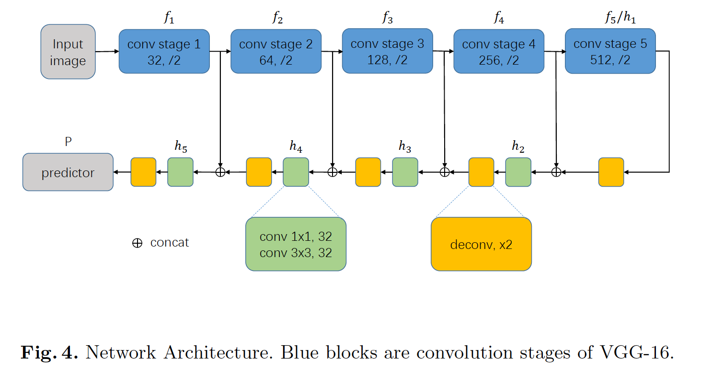

​		整个网络如图4所示。受FPN和UNet的启发，我们采用一种方案，其逐渐融合stem网络中不同层的特征。Stem网络可以是用于图像分类的卷积网络，例如VGG-16/18和ResNet。这些网络可以划分为5个阶段的卷积，和一些额外的全连接层（FC）。我们去除FC层，并在每个阶段之后将特征图输入到特征融合网络中。我们选择VGG-16作为stem网络，以便与其他方法进行直接、公正的比较。

​		对于特征融合网络，将多个阶段依次堆叠，每个阶段由一个融合单元组成，该单元由最后一个阶段提取特征图以及与之对应的stem网络层组成。融合单元由如下公式定义：

$$h_1 = f_5, \tag{1}$$

$$h_i = conv_{3\times3}(conv_{1\times1}[f_{6-i};UpSampling_{\times2}(h_{i-1})]), \mbox{for } i=2,3,4,5\tag{2}$$

其中$f_i$表示stem网络中第$i$阶段对特征图，$h_i$为对应融合单元的特征图。在我们的实验中，将上采样实现为deconvolutional层。

​		在融合之后，我们获得大小为输入图像$\frac{1}{2}$的特征图。我们使用额外的上采样层和2个卷积层产生密集预测：

$$h_{final} = UpSampling_{\times2}(h_5), \tag{3}$$

$$P = conv_{1\times1}(conv_{3 \times 3}(h_{final})) \tag{4}$$

其中$P \in \mathcal{R}^{h \times w \times 7}$，$TR/TCL$的logits有4个通道，后三个分别对应文本实例的$r$、$cons\theta$和$sin\theta$。作为额外的上采样层的结果，$P$与输入图像的大小一样。通过对TR/TCL采用softmax并正则化$cos\theta$与$sin\theta$使它们的平方和等于1，得到最终的预测结果。

#### 3.4	推理

​		在前向传播之后，网络产生TCL、TR和几何图。对于TCK和TR，我们分别使用$T_{tcl}$和$T_{tr}$的阈值化。然后，TR和TCL的交集给出最终的TCL预测。使用disjoint-set，我们可以将TCL像素有效分为不同文本实例。

​		最后，设计striding算法来提取有序点列表，该列表表示文本实例的形状，并且还重构文本实例区域。使用两种启发式方法过滤false positive文本实例：1）TCL像素的数量应至少是它们平均半径的0.2倍；2）重构的文本区域中至少一半的像素应分类为TR。

​		striding算法的过程如图5所示。它主要有3个行为，表示为Act(a)、Act(b)和Act(c)，如图6所示。首先，我们随机选择一个像素作为起始点，并中心化它。然后，搜索过程分成两个相反的方向，步长和中心化直到结束。该过程将在两个相反的方向上生成2个有序的点列表，这些点可以组合在一起，生成最终的中心轴列表，并准确描述形状。3个行为的细节如下。

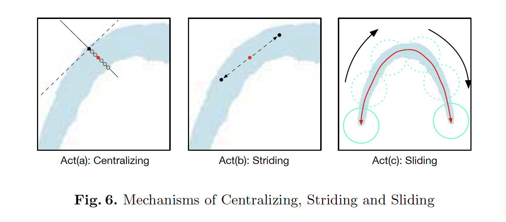

​		**Act(a) Centralizing**	如图6所示，给定TCL上的点，我们可以绘制切线和法线，分别表示为虚线和实线。使用几何图可以轻松完成此步骤。法线与TCL区域交点的中点为中心点。

​		**Act(b) Striding**	该算法在下一个点应用stride以进行搜索。利用几何图，计算每个stride的位移，两个方向分别表示为$(\frac{1}{2}r \times \cos\theta, \frac{1}{2}r \times \sin\theta)$和$(-\frac{1}{2}\times\cos\theta,-\frac{1}{2}\times\sin\theta)$。如果下一步是在TCL区域之外，我们会逐渐减小步幅，直到它进入内部，或者到达终点。

​		**Act(c) Sliding**	该算法遍历中心轴并沿其绘制圆。从$r$图中获得圆的半径。圆覆盖的区域表示预测的文本实例。

​		总体来看，利用几何图和精确描述文本实例的TCL，我们可以超越文本检测的范围，预测文本的形状和路径。此外，striding算法可以避免遍历所有相关像素。

#### 3.5	Label Generation

​		**Extracting Text Center Line**	对于三角形和四边形，很容易用代数方法直接计算TCL，因为在这种情况下，TCL是一条直线。对于超过4条边的多边形，要推导出一般的代数方法并不容易。

​		相反，我们提出一种方法，其基于文本实例为蛇形的假设，即它不会分叉成多个分支。对于蛇形文本实例，它的两个边缘分别是*head*和*tail*。靠近head和tail的两条边并行，但是方向相反。

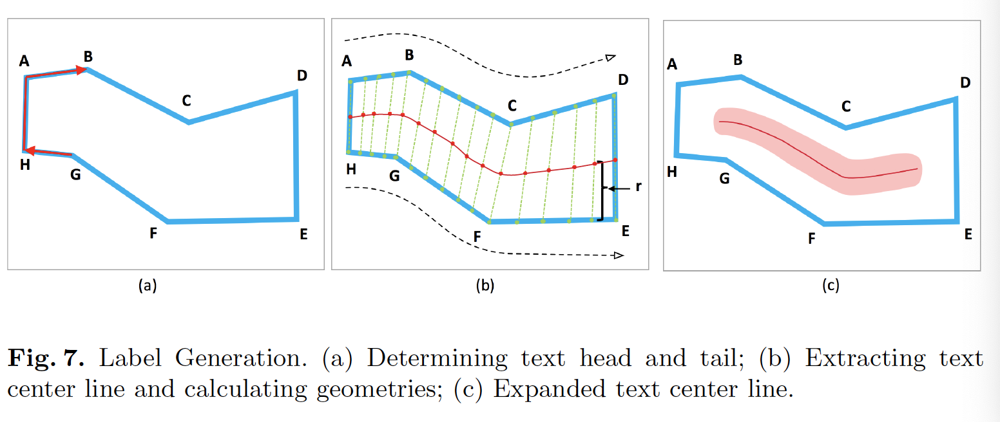

​		对于由一组由顺时针或逆时针顶点$\{v_0,v_1,v_2,\cdots,v_n\}$表示的文本实例$t$，我们将每条边$e_{i,i+1}$的测量（measurement）定义为$M(e_{i,i+1}) = \cos\langle e_{i+1,i+2},e_{i-1,i}\rangle$。直观地说，$M$最接近−1的两条边，例如图7中的$AH$和$DE$是头部和尾部。之后，在两条边线（如图7中的$ABCD$和$HGFE$）上采样相同数量的锚点。TCL点计算为相应锚点的中心点。我们将TCL的两端缩小$\frac{1}{2}r_{end}$像素，使得TCL在TR内部，并使网络很容易学会分离相邻的文本实例。$r_{end}$表示位于两端的TCL点的半径。最后，我们将TCL区域扩大$\frac{1}{5}r$，因为单个点难以处理噪声。

​		**Calculating $r$ and $\theta$**	对于TCL上的每个点：（1）$r$为TCL上点到边线上相应点的距离；（2）$\theta$是通过在TCL点附近拟合一条直线来计算的。对非TCL像素，为了方便起见，将它们相应的几何属性设置为0。

#### 3.6	Training Objectives

​		所提出的方法能够端到端训练，损失函数如下：

$$L = L_{cls} + L_{reg}, \tag{5}$$

$$L_{cls} = \lambda_1L_{tr} + \lambda_2L_{tcl}, \tag{6}$$

$$L_{reg} = \lambda_3L_r + \lambda_4L_{sin} + \lambda_5L_{cos}, \tag{7}$$

式（5）中的$L_{cls}$表示TR和TCL的分类损失，$L_{reg}$表示$r$、$\cos\theta$和$\sin\theta$的回归损失。式（6）中，$L_{tr}$和$L_{tcl}$为TR和TCL的交叉熵损失。为TR损失采用OHEM[32]，负类和正类样本之间的比例最多为$3:1$。对于TCL，我们仅考虑TR内像素，并没有采用平衡方法。

​		在式（7）中，回归损失（即$L_r$、$L_{sin}$和$L_{cos}$）计算为Smoothed-L1损失[4]：

$$\begin{pmatrix}L_r \\ L_{cos} \\ L_{sin}\end{pmatrix} = SmoothedL1\begin{pmatrix}\frac{\hat{r} -r}{r} \\ \hat{\cos\theta} - \cos\theta \\ \hat{\sin\theta} - \sin\theta\end{pmatrix} \tag{8}$$

其中$\hat{r}$、$\hat{\cos\theta}$和$\hat{\sin\theta}$分别为预测值，而$r$、$\cos\theta$和$\sin\theta$为相应的ground-truth。TCL外的几何损失设置为0，因为这些属性对于非TCL点没有意义。

​		在我们的实验中，权重$\lambda_1$、$\lambda_2$、$\lambda_3$、$\lambda_4$和$\lambda_5$设置为1。

### 4	实验

#### 4.1	数据集

​		**SynthText**[5]为包含大约800K合成图像的大尺度数据集。这些图像是通过将自然图像与随机字体、大小、颜色和方向渲染的文本混合而成的，因此这些图像非常逼真。我们使用这些数据集来预训练我们的模型。

​		**TotalText**[15]一种新发布的文本检测基准测试。除了水平和多方向文本实例外，数据集还特别具有曲线文本，这在其他基准数据集中很少出现，但在实际环境中却非常常见。训练图像有1255 张图像，测试集包含300张图像。

​		**CTW1500**[43]是另一个主要包含曲线文本的数据集。它包含1000张训练图像，500张测试图像。文本实例用14个顶点的多边形标注。

​		**ICDAR2015**被提议作为2015年鲁棒阅读竞赛[14]的挑战4，以进行偶然场景文本检测。有1000张训练图像，500张测试图像。这个数据集的文本实例标注为单词级的四边形。

​		**MSRA-TD500**[38]是具有多语言、任意方向和长文本线的数据集。它包含具有文本行标注的300张训练图像和200张测试图像。遵循先前工作[47、22]，我们还将HUST-TR400[37]的图像作为训练数据，因为它的训练集很小。

​		对于ICDAR2015和MSRA-TD500上的实验，我们根据方法的输出文本区域来拟合一个最小边界矩形。

#### 4.2	数据增强

​		图像被随机旋转，0.24到1.69的区域中裁剪，宽高比从0.33到3变化。此后，随机调整噪声、模糊和光照。我们确保增强图像上的文本仍然是可辨认的，如果它们在增强前是可辨认的。

#### 4.3	实现细节

​		我们的方法使用Tensorflow 1.3.0实现。网络在SynthText上预训练一个epoch，并在其他数据集上微调。采用Adam优化器。预训练阶段，学习率固定为$10^{-3}$。微调阶段，初始学习率设置为$10^{-3}$，每5000次迭代以0.8的速率指数衰减。微调期间，迭代次数由数据的大小决定。所有的实验都是在常规工作站（CPU: Intel(R) Xeon(R) CPU E5-2650 v3 @ 2.30GHz，GPU:Titan X，RAM: 384GB）上进行的。我们在2个GPU上以32的batchsize并行训练模型，并在一个GPU上评估模型，batchsize设置为1。超参数通过网格搜索调整。

#### 4.4	实验结果

​		**曲线文本（Total-Text和CTW1500）上的实验**	在这两个数据集上微调大约5k次迭代。Total-Text和CTW1500上的阈值$T_{tr}$、$T_{tcl}$分别设置为（0.4，0.6）和（0.4，0.5）。测试中，对于Total-Text，将所有图像缩放到$512 \times 512$，对于CTW1500，不调整图像，因为CTW1500中的图像很小（最大的图像只有$400 \times 600$）。为了公平比较，我们还在Total-Text和CTW1500上评估EAST和SegLink。两个数据上的不同方法的定量结果见表1.

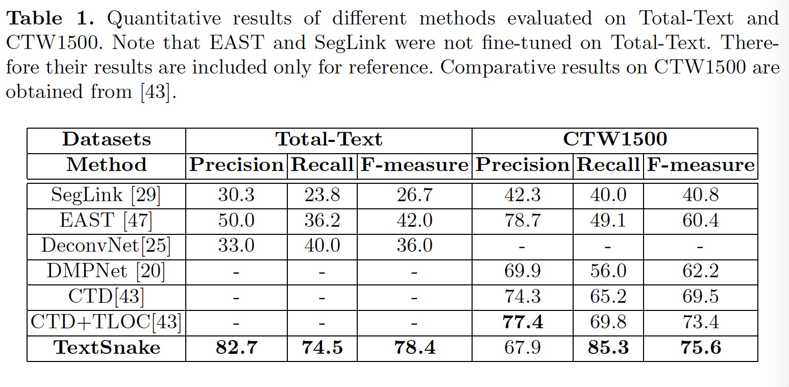

​		**Incidental Scene Text（ICDAR2015）上的实验**	在ICDAR2015上微调30K次迭代。在测试中，将所有图像调整到$1280\times 768$。$T_{tr}$、$T_{ctl}$设置为（0.4，0.9）。考虑到ICDAR 2015中的图像包含许多未标记的小文本，过滤掉短边小于10像素或面积小于300的预测矩形。

​		ICDAR2015上不同方法的量化结果见表2。仅使用单尺度测试，我们的方法比大多数竞争者（包含那些多尺度评估的方法）好。这证明所提出的表示TextSnake是通用的，并能稳定用于复杂场景中的多方向文本。

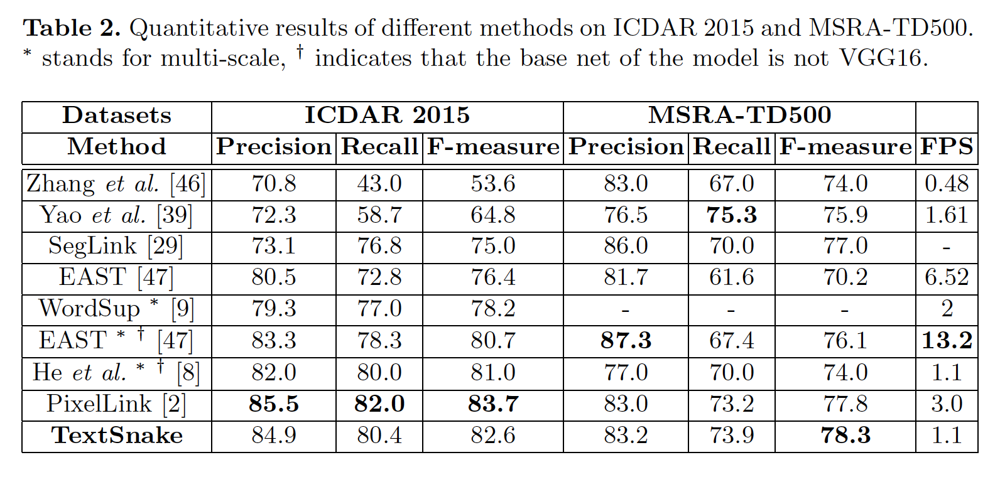

#### 4.5	分析和讨论

​		**文本实例的准确描述**	我们的方法与其他方法的区别在于它能够预测文本实例的形状和过程的精确描述（见图8）。

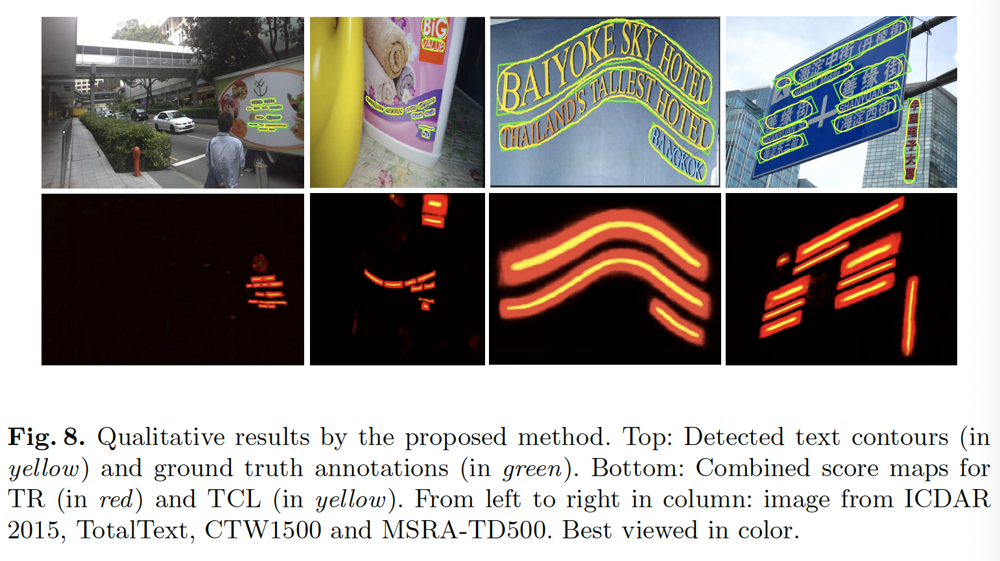

​		我们将这种能力归因于TCL机制。TCL可以视为一种骨架，其可以看作是支撑文本实例的骨架，而几何属性提供更多细节。文本作为书面语言的一种形式，可以看作是映射到二维表面上的信号流。当然，它应该遵循一个扩展的过程。

​		因此，我们提出预测TCL，其远比整个文本实例窄。它有两个优势：（1）一个纤细的TCL可以更好地描述过程和形状；（2）TCL直观上没有相互重叠，因此可以非常简单直接地进行实例分割，从而简化我们的流水线。

​		此外，图9所描述的，我们可以利用局部几何属性来描绘文本实例的结构，并将预测的曲线文本转换为标准格式，其可能极大地促进识别阶段。

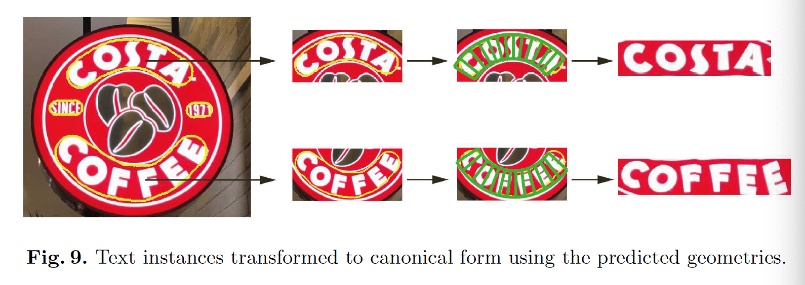

​		**泛化能力**	为了进一步验证我们的方法泛化能力，我们在没有曲线文本的数据集上训练和微调模型，并在具有曲线文本的两个基准上对其进行评估。具体而言，我们在ICDAR2015上微调模型，并在目标数据集上评估它们。EAST、SegLink和PixelLink作为基线，因为这两个方法还在ICDAR2015上训练。

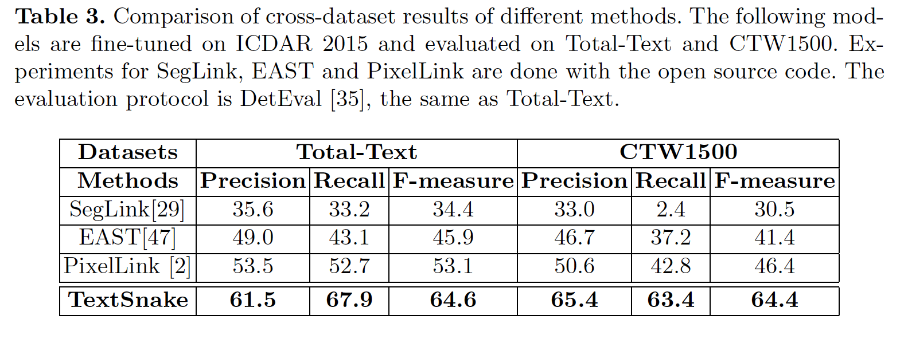

